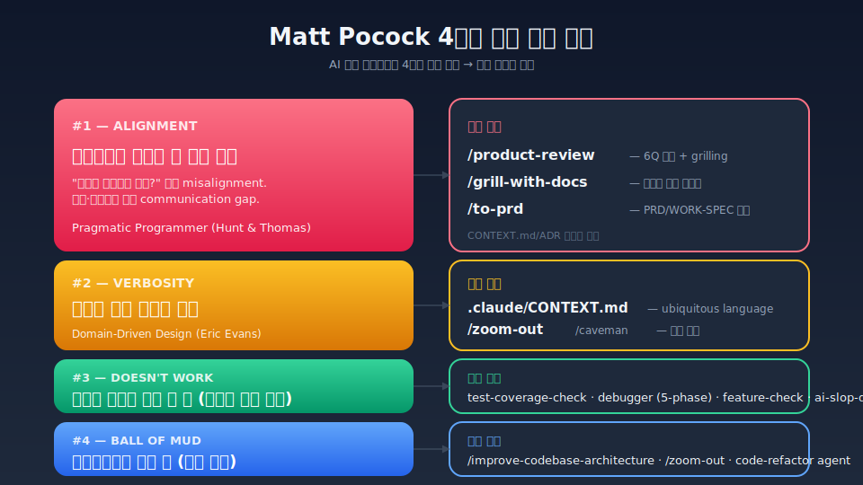
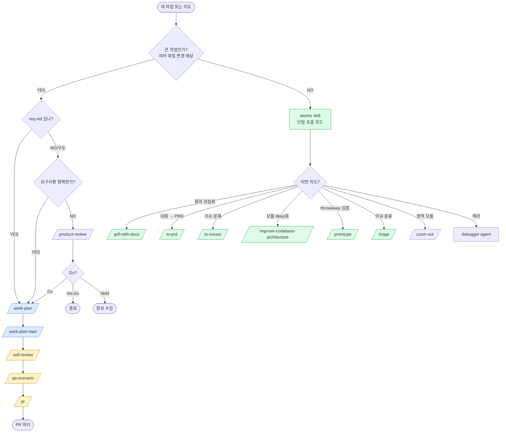

# Workflow Overview — Matt Pocock + Track 통합 가이드

> 이 문서는 "Matt Pocock 패턴 전면 재구성" 이후의 전체 워크플로우를 한 페이지에 시각화한 가이드다.
> 누군가 처음 이 저장소를 열어도 어떤 skill을 언제 부르면 되는지 알 수 있게 만든다.
>
> **관련 문서**: [WORKFLOW-GUIDELINE.md](./WORKFLOW-GUIDELINE.md) (상세 SSOT), [skills-commands-agents-catalog.md](./skills-commands-agents-catalog.md) (카탈로그), ADR 0001/0002/0003.

---

## 0. 30초 요약

| 상황 | 부를 것 |
|------|--------|
| 큰 Jira 작업 시작 (req.md 있음) | `/work-plan` → `/work-plan-start` → `/self-review` → `/pr` |
| 큰 작업이지만 req.md 없음 (구두) | `/work-plan` (구두 입력) → 이후 동일 |
| 요구사항 흐릿함, 정렬 먼저 필요 | `/product-review` 또는 `/grill-with-docs` |
| 도메인 용어만 정밀화 | `/grill-with-docs` (CONTEXT.md/ADR 인라인 갱신) |
| 대화를 PRD 양식으로 합성 | `/to-prd` |
| 계획을 작은 이슈로 분해 | `/to-issues` |
| 한 모듈만 deep화 하고 싶음 | `/improve-codebase-architecture` |
| 설계 검증용 throwaway | `/prototype` |
| Jira 이슈 분류/AGENT-BRIEF | `/triage` |
| 코드 한 부분 모르겠음 | `/zoom-out` |
| 응답 너무 김 | `/caveman` |
| 에러/버그 추적 | `debugger` agent (5-phase) |
| 코드 스멜 정리 | `code-refactor` agent |
| 브라우저 QA | `/browser-debug` |
| 보안 점검 | `/security-audit` |

---

## 1. 큰 그림 — 4가지 실패 모드 매핑



> 출처: [mattpocock/skills](https://github.com/mattpocock/skills). 한국어 워크플로우 + Track 시스템에 맞춰 변형.

핵심: AI 코딩 에이전트의 4가지 흔한 실패 모드에 각각 atomic skill을 매핑했다. 큰 워크플로우 skill (`/work-plan` 등)은 이 atomic skill의 조합 wrapper다 (ADR 0002).

---

## 2. 두 가지 모드 — Track 안 vs Track 밖

### Track 안 (큰 작업 흐름)

```
req.md or 구두 요구사항
     │
     ▼
┌─────────────────┐
│  /work-plan     │ ← grill-with-docs + to-prd + to-issues (wrapper)
│  (Step 1)       │   Gemini/Codex 크로스체크 통합
└─────────────────┘
     │ 산출: 1_REQ-SNAPSHOT.md, 2_WORK-SPEC.md, 3_FEATURE-CHECKLIST.md
     ▼
┌─────────────────┐
│ /work-plan-start│ ← tdd + diagnose + improve-architecture (wrapper)
│  (Step 2)       │   Solo/Standard/Coordinator 모드 자동 선택
└─────────────────┘
     │ 산출: 4_PLAN.md, 5_ARCHITECTURE.md, 6_SPEC.md
     ▼
┌─────────────────┐
│  /self-review   │ ← 4명 리뷰어 + Gemini/Codex 병렬
│  + /qa-scenario │
│  + /feature-check│
└─────────────────┘
     │ 산출: 7_SELF-REVIEW.md, 8_QA-SCENARIOS.md
     ▼
┌─────────────────┐
│  /pr            │
│  + /work-log    │ ← Confluence 자동 문서화
└─────────────────┘
```

**Track 안 = 거대 워크플로우 skill (wrapper) 사용**. 내부에서 atomic skill을 자동 호출. 모든 산출물은 `.claude/tracks/{track_id}/`에 저장.

### Track 밖 (즉흥 작업)

Track 디렉토리 만들지 않고 atomic skill만 직접 호출:

```
즉흥 의도
    │
    ├─ "이거 진짜 필요한가?" → /product-review
    ├─ "용어 정밀화"          → /grill-with-docs
    ├─ "대화 → PRD"           → /to-prd
    ├─ "모듈 deep화"          → /improve-codebase-architecture
    ├─ "throwaway 검증"       → /prototype
    ├─ "이슈 분류"            → /triage
    ├─ "버그 추적"            → debugger agent
    └─ "한 영역 모르겠음"     → /zoom-out
```

**Track 밖 = atomic skill 단발 호출**. Track 디렉토리/번호 매겨진 문서 생성 X. CONTEXT.md/ADR은 그대로 갱신됨 (영구 자산).

---

## 3. Atomic Skill 사용 가이드

### `/grill-with-docs` — 도메인 정렬

**언제**: 요구사항 모호, 도메인 용어 충돌, 결정 트리가 안 풀림.
**효과**: 한 번에 한 질문씩 grilling, 결정이 풀리는 즉시 CONTEXT.md/ADR 인라인 갱신.
**원칙**: 코드로 답할 수 있으면 묻지 말고 탐색. ADR은 인색하게 (hard-to-reverse + surprising + real trade-off 3조건).

### `/triage` — 이슈 분류

**언제**: 새 Jira 이슈 들어옴, 백로그 정리, AFK 에이전트가 픽업할 이슈 준비.
**상태 머신**: `needs-triage → (needs-info | ready-for-agent | ready-for-human | wontfix)`.
**산출**: AGENT-BRIEF (interface-level 명세) 또는 `.out-of-scope/` 기록.

### `/improve-codebase-architecture` — 아키텍처 점검

**언제**: shallow module 의심, leaky abstraction, untestable 코드 발견 시. Matt Pocock 권장: **며칠에 한 번**.
**도구**: deletion test, Module/Seam/Depth/Leverage/Locality 어휘.
**산출**: deepening opportunity 후보 → grilling → CONTEXT.md/ADR 갱신.

### `/to-prd` — 대화 → PRD

**언제**: 토론이 충분히 진행됐고, 결정 사항을 명세로 굳히고 싶을 때. **사용자에게 다시 묻지 않음** — 합성만.
**산출**: WORK-SPEC.md 양식 (Problem / Solution / User Stories / Implementation Decisions / Testing / Out of Scope).

### `/to-issues` — 계획 → vertical slice

**언제**: PRD/WORK-SPEC을 받아 작은 단위로 분해. tracer bullet 패턴 (한 slice = 모든 레이어를 가로지르는 좁은 경로).
**산출**: HITL/AFK 라벨, 의존성 그래프 포함.

### `/prototype` — 일회성 검증

**언제**: state machine/reducer가 모호, UI 변형 비교, "이게 정말 동작할까?" 의심.
**원칙**: **throwaway**. 결정만 추출해서 SPEC.md/ADR에 inline 후 prototype 코드 **삭제**.

---

## 4. 결정 트리 — 무엇을 부를 것인가



---

## 5. 실전 시나리오

### 시나리오 1 — 새 Jira 이슈로 큰 기능 개발

**상황**: TECH-22386에 "배송 상태 동기화 기능 만들어주세요"라는 한 줄짜리 요구.

```
1. /product-review               # "왜 만드는가" grilling. Go 판정.
2. /work-plan                    # WORK-SPEC + FEATURE-CHECKLIST 생성
   ├─ (내부) /grill-with-docs    # 용어 정밀화: "배송 상태" = Shipment.status enum 4종
   ├─ (내부) /to-prd              # PRD 합성
   └─ (내부) Gemini/Codex 크로스체크
3. /work-plan-start              # Phase별 구현 (Standard 모드)
4. /self-review                  # 4명 리뷰어 + Gemini/Codex
5. /qa-scenario                  # BDD QA 시나리오
6. /pr                           # GitHub PR
7. /work-log                     # Confluence 작업 로그
```

### 시나리오 2 — 짧은 버그 수정

**상황**: "배송 취소 시 상태가 'cancelled'로 안 바뀜" 버그 리포트.

```
1. debugger agent (Phase 1 — 재현 loop 만들기 우선)
2. fix + 회귀 테스트
3. /self-review
4. /pr
```

Track 만들지 않음 (1~2파일 수정).

### 시나리오 3 — "이 모듈 모양이 잘못된 거 같다"

**상황**: ShipmentService가 너무 비대하고 테스트가 어려움.

```
1. /improve-codebase-architecture
   └─ (내부) Explore agent로 코드 탐색
   └─ deletion test 후보 제시
   └─ grilling → "Shipment의 Lifecycle 모듈 추출" 결정
   └─ CONTEXT.md에 "Lifecycle" 용어 추가
   └─ ADR 0004 작성 (옵션)
2. (결정 후) /work-plan 으로 본격 리팩터링 작업 시작
```

### 시나리오 4 — 새 화면 UI 변형 비교

**상황**: 배송 상태 페이지의 표시 방식 3가지 후보를 비교하고 싶음.

```
1. /prototype
   └─ 한 라우트에 3 변형 토글
   └─ 사용자 walkthrough → variant B 선택
   └─ SPEC.md에 결정 inline
   └─ prototype 코드 삭제
2. /work-plan (variant B의 production 구현)
```

### 시나리오 5 — Slack 회의 → Jira 이슈

**상황**: Slack 스레드에 정리된 회의 내용을 Jira 이슈로 분해.

```
1. /slack-to-jira <Slack URL>     # 1차 변환 (모호한 상태)
2. /triage                         # 5-state machine 분류
   └─ ready-for-agent 후보면 /grill-with-docs로 grilling
   └─ AGENT-BRIEF 코멘트 작성
3. /to-issues                      # vertical slice 분해 (필요 시)
```

### 시나리오 6 — 응답이 너무 길어졌을 때

```
/caveman                    # 토큰 75% 절약 모드 ON
... 작업 ...
"stop caveman"              # 해제 (보안/비가역 명령 시 자동 해제)
```

### 시나리오 7 — 처음 보는 코드 영역에서 길 잃음

```
/zoom-out
   └─ 현재 영역 → 모듈 + 호출자 맵 → CONTEXT.md 어휘로 설명
```

---

## 6. 산출물 구조 (Track 안 작업 시)

```
.claude/tracks/{JIRA번호}-{설명}/
├── 0_INDEX.md                       문서 인덱스 (자동 생성)
├── 1_REQ-SNAPSHOT.md                req.md 원본 보존
├── 2_WORK-SPEC.md                   /work-plan 산출 (to-prd 결과 + AGENT-BRIEF)
├── 3_FEATURE-CHECKLIST.md           /work-plan 산출 (to-issues 결과)
├── 4_PLAN.md                        /work-plan-start Phase 진행률
├── 5_ARCHITECTURE.md                구현 완료 (svg-diagram)
├── 6_SPEC.md                        구현 완료
├── 7_SELF-REVIEW.md                 /self-review
├── 8_QA-SCENARIOS.md                /qa-scenario
└── metadata.json                    Track 메타데이터
```

CONTEXT.md / ADR은 Track 안이 아닌 글로벌 위치:
```
.claude/
├── CONTEXT.md                       ubiquitous language
└── docs/
    ├── adr/                          영구 결정 기록
    │   ├── 0001-skill-dependency-classification.md
    │   ├── 0002-track-as-skill-container.md
    │   └── 0003-bucket-structure.md
    └── agents/                       atomic skill 입력 설정
        ├── issue-tracker.md
        ├── triage-labels.md
        └── domain.md
```

---

## 7. FAQ

**Q. `/work-plan`과 atomic skill 중 무엇을 써야 하나?**
A. **변경 파일 3개+ 예상 → `/work-plan`** (Track 만들고 워크플로우 전체 진행). **3개 미만 또는 즉흥 의도 → atomic skill 직접 호출**.

**Q. `/work-plan`이 내부에서 atomic skill을 호출한다는데, 어떻게 디버깅하나?**
A. `4_PLAN.md`에 어떤 atomic skill이 어떤 Step에서 호출되는지 기록됨. 문제 발생 시 해당 atomic skill을 단발 호출하여 재현.

**Q. CONTEXT.md / ADR을 언제 갱신하나?**
A. `/grill-with-docs`, `/improve-codebase-architecture` 호출 중 **자동으로 인라인 갱신**된다. 수동 갱신은 사용자가 직접 편집해도 OK.

**Q. `personal/`, `in-progress/`, `deprecated/` 버킷의 skill도 호출되나?**
A. 호출은 모두 가능 (Claude Code의 skill 디스커버리는 깊이 무관). 단 카탈로그/README에 노출 안 되어 외부 사용자에게 보이지 않음.

**Q. work-plan-legacy를 다시 쓰고 싶다면?**
A. `deprecated/work-plan-legacy/SKILL.md`가 보존되어 있음. 그 SKILL.md 내용을 참조하거나 일시적으로 다시 engineering/으로 옮길 수 있다. 단 새 atomic skill 패러다임과의 일관성이 깨질 수 있음.

**Q. Hook이 git add를 차단할 때 어떻게 우회하나?**
A. **TIL 저장소 안이면 자동 통과**. 그 외 응급 우회: `SKIP_CLAUDE_DIR_BLOCK=1 git add ...`.

**Q. 글로벌(`~/.claude/`)과 TIL의 skill이 다를 수 있나?**
A. 기본적으로 `/sync-global push|pull`로 동기화. TIL 고유 skill (`cs-*`, `pencil-*`, `weekly-retro` 등)은 TIL에만 있다.

---

## 8. 관련 문서

- [WORKFLOW-GUIDELINE.md](./WORKFLOW-GUIDELINE.md) — 상세 SSOT (각 Step 깊이 들어감)
- [skills-commands-agents-catalog.md](./skills-commands-agents-catalog.md) — Skills/Commands/Agents 카탈로그
- [mattpocock-skills-application.md](./mattpocock-skills-application.md) — 초기 적용 분석
- [.claude/CONTEXT.md](../CONTEXT.md) — 도메인 용어집
- [adr/](./adr/) — ADR 0001/0002/0003
- [agents/](./agents/) — atomic skill 입력 설정

---

> 마지막 갱신: 2026-05-14
> 새 skill / 새 ADR 추가 시 본 문서도 갱신하세요.
