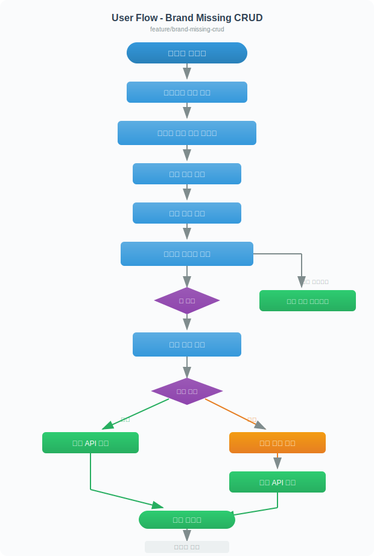
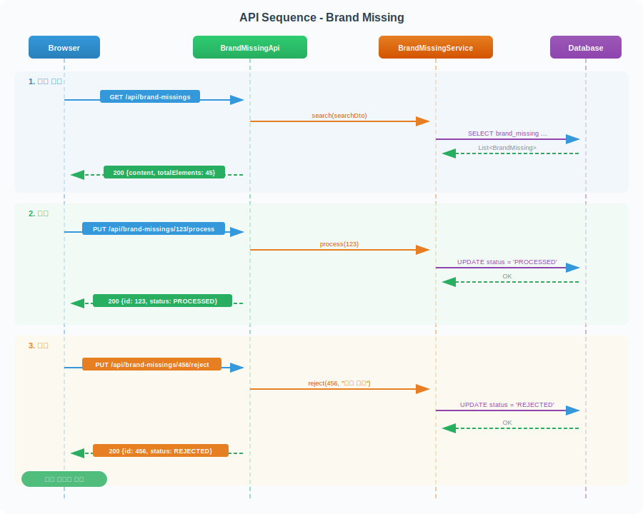
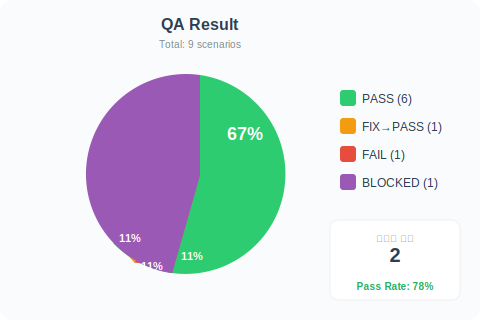

# QA Scenarios - feature/brand-missing-crud

## 환경
- 브랜치: feature/brand-missing-crud
- 비교 기준: main
- 테스트 URL: http://localhost:8080
- 생성 일시: 2026-03-19 14:30
- 변경 파일: 8개

## 변경 요약
브랜드 누락 관리 페이지 신규 개발. 목록 조회, 상세 보기, 상태 변경(처리/반려), 엑셀 다운로드 기능 포함.

## 유저 플로우 다이어그램



## API 시퀀스 다이어그램



## 시나리오 목록

### P0 - 핵심 기능 (반드시 테스트)

#### S01. 목록 페이지 로드 및 그리드 표시
- **테스트 URL**: /admin/brand-missings/page
- **시나리오**:
  - **Given**: 관리자가 로그인한 상태에서
  - **When**: 브랜드 누락 목록 페이지에 접속하면
  - **Then**: 그리드에 데이터가 표시되고 페이지네이션이 동작한다
- **검증 방법**: network, javascript, console
- **검증 코드**:
  ```javascript
  // 그리드 데이터 확인
  const rows = document.querySelectorAll('.ag-row');
  console.assert(rows.length > 0, '그리드에 데이터가 없음');
  // 페이지네이션 확인
  const totalText = document.querySelector('.total-count');
  console.assert(totalText && parseInt(totalText.textContent) > 0, '총 건수 미표시');
  ```
- **결과**: ✅ PASS

#### S02. 목록 검색 필터 동작
- **테스트 URL**: /admin/brand-missings/page
- **시나리오**:
  - **Given**: 목록 페이지가 로드된 상태에서
  - **When**: 상태 필터를 "미처리"로 선택하고 검색 버튼을 클릭하면
  - **Then**: 미처리 건만 필터링되어 그리드에 표시된다
- **검증 방법**: network, javascript
- **검증 코드**:
  ```javascript
  // API 파라미터에 status=PENDING 포함 확인
  // 그리드 내 모든 상태 셀이 "미처리"인지 확인
  const statusCells = document.querySelectorAll('.ag-row .status-cell');
  const allPending = Array.from(statusCells).every(c => c.textContent.trim() === '미처리');
  console.assert(allPending, '미처리가 아닌 항목이 포함됨');
  ```
- **결과**: ✅ PASS

#### S03. 상세 모달 열기 및 처리
- **테스트 URL**: /admin/brand-missings/page
- **시나리오**:
  - **Given**: 그리드에 미처리 데이터가 표시된 상태에서
  - **When**: 첫 번째 행을 클릭하고 처리 버튼을 누르면
  - **Then**: 처리 API가 호출되고 성공 토스트가 표시되며 그리드가 갱신된다
- **검증 방법**: network, javascript, console
- **검증 코드**:
  ```javascript
  // 모달이 열렸는지 확인
  const modal = document.querySelector('.modal.show');
  console.assert(modal !== null, '모달이 열리지 않음');
  // 처리 버튼 존재 확인
  const processBtn = modal.querySelector('.btn-process');
  console.assert(processBtn !== null, '처리 버튼 없음');
  ```
- **결과**: 🔧 FIX→PASS

#### S04. 반려 처리 (사유 입력)
- **테스트 URL**: /admin/brand-missings/page
- **시나리오**:
  - **Given**: 상세 모달이 열린 상태에서
  - **When**: 반려 버튼을 클릭하고 사유를 입력한 후 확인을 누르면
  - **Then**: 반려 API가 호출되고 상태가 "반려"로 변경된다
- **검증 방법**: network, javascript
- **결과**: ✅ PASS

### P1 - 주요 기능

#### S05. 엑셀 다운로드
- **테스트 URL**: /admin/brand-missings/page
- **시나리오**:
  - **Given**: 검색 결과가 있는 상태에서
  - **When**: 엑셀 다운로드 버튼을 클릭하면
  - **Then**: 현재 검색 조건 기준으로 엑셀 파일이 다운로드된다
- **검증 방법**: network
- **결과**: ✅ PASS

#### S06. 페이지네이션 동작
- **테스트 URL**: /admin/brand-missings/page
- **시나리오**:
  - **Given**: 총 건수가 20건을 초과하는 상태에서
  - **When**: 2페이지 버튼을 클릭하면
  - **Then**: 21~40번째 데이터가 그리드에 표시된다
- **검증 방법**: network, javascript
- **결과**: ✅ PASS

#### S07. 필터 초기화
- **테스트 URL**: /admin/brand-missings/page
- **시나리오**:
  - **Given**: 필터 조건이 설정된 상태에서
  - **When**: 초기화 버튼을 클릭하면
  - **Then**: 모든 필터가 초기값으로 돌아가고 전체 데이터가 조회된다
- **검증 방법**: javascript
- **결과**: ❌ FAIL

### P2 - 부가 기능

#### S08. 빈 데이터 상태 표시
- **테스트 URL**: /admin/brand-missings/page
- **시나리오**:
  - **Given**: 목록 페이지가 로드된 상태에서
  - **When**: 결과가 0건인 검색 조건으로 조회하면
  - **Then**: "데이터가 없습니다" 메시지가 표시된다
- **검증 방법**: javascript
- **결과**: ✅ PASS

#### S09. 날짜 필터 범위 제한
- **테스트 URL**: /admin/brand-missings/page
- **시나리오**:
  - **Given**: 날짜 필터에서
  - **When**: 종료일이 시작일보다 앞선 날짜를 선택하면
  - **Then**: 유효성 에러 메시지가 표시되고 검색이 차단된다
- **검증 방법**: javascript
- **결과**: ⚠️ BLOCKED (날짜 필터 UI 미구현)

## 결과 요약



| 항목 | 수치 |
|------|------|
| 전체 시나리오 | 9 |
| ✅ PASS | 6 |
| 🔧 FIX→PASS | 1 |
| ❌ FAIL | 1 |
| ⚠️ BLOCKED | 1 |
| 수정된 파일 | 2개 |

## 발견된 버그

| # | 시나리오 | 심각도 | 문제 | 원인 | 수정 파일 | 수정 내용 |
|---|---------|--------|------|------|---------|---------|
| 1 | S03 | Major | 처리 버튼 클릭 시 500 에러 | processDate null 처리 누락 | BrandMissingService.java:89 | LocalDateTime.now() 기본값 추가 |
| 2 | S07 | Minor | 초기화 버튼 클릭 후 그리드 미갱신 | reset 이벤트에서 search() 미호출 | brand-missing-list.js:145 | resetFilter() 내 search() 호출 추가 |

## 미검증 항목
- S09: 날짜 필터 UI가 아직 구현되지 않아 범위 제한 검증 불가 (다음 스프린트 예정)
