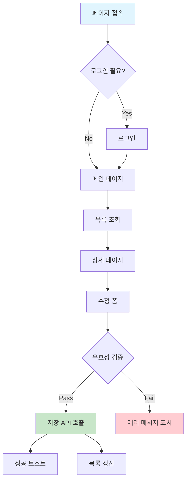
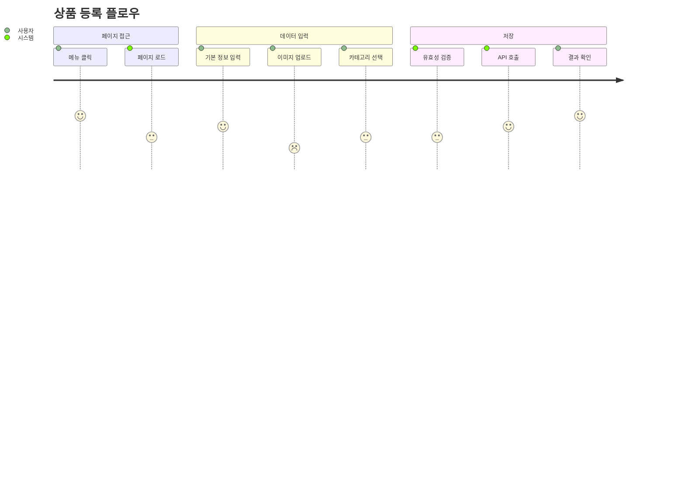
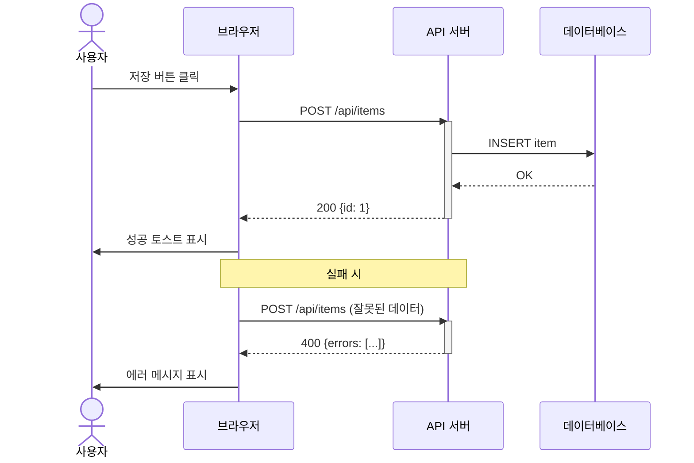
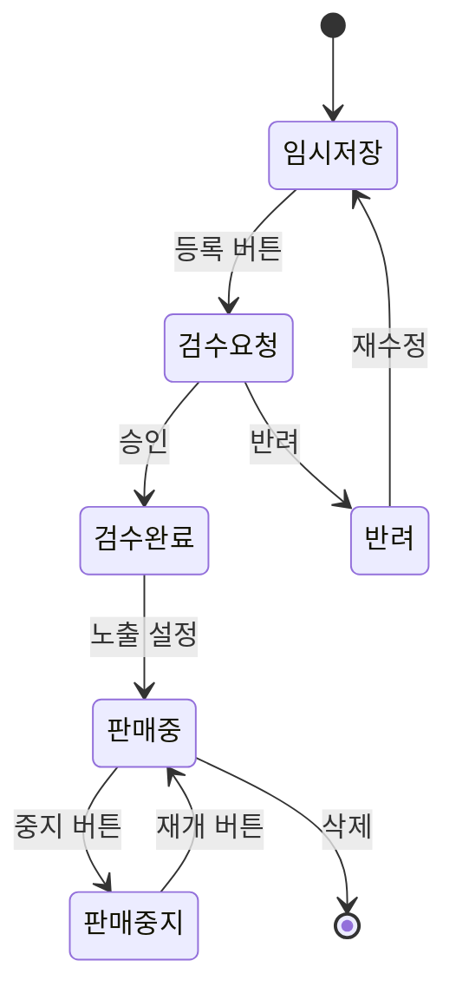
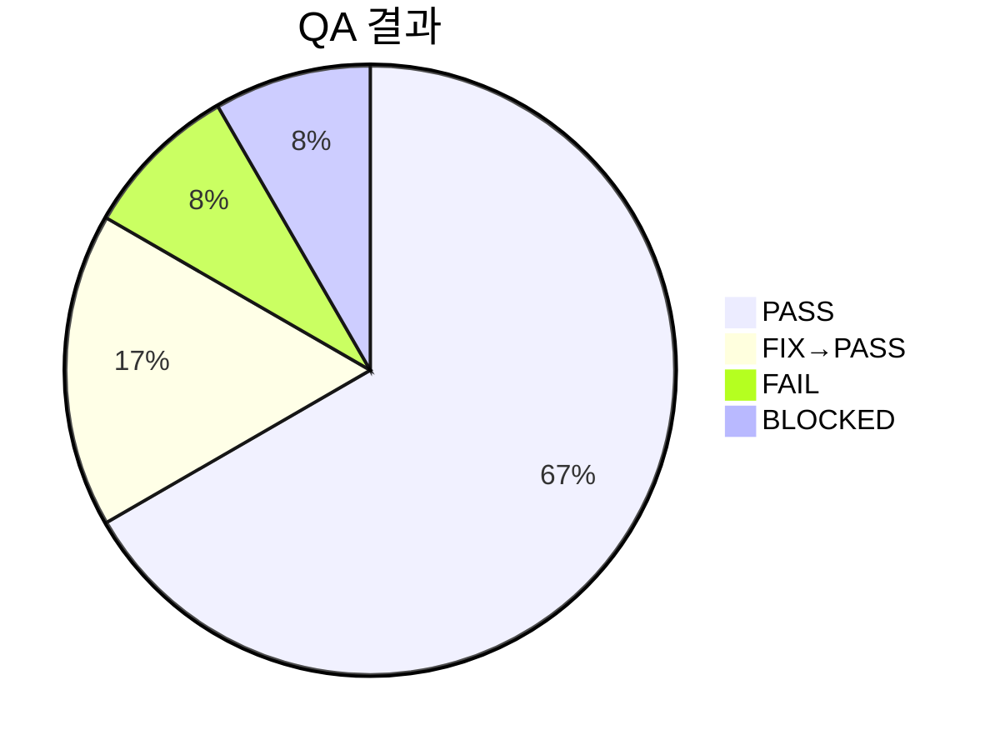

# QA 시나리오 문서 작성 가이드

`browser-debug` 스킬의 Phase 2에서 `QA-SCENARIOS.md`를 생성할 때 참조하는 가이드.
변경사항 분석 결과를 시각적이고 재사용 가능한 QA 문서로 변환하는 방법을 정의한다.

## 문서 설계 원칙

1. **시각적 흐름 우선**: 텍스트만으로 시나리오를 나열하지 않고, Mermaid 다이어그램으로 전체 흐름을 먼저 보여준다
2. **BDD 스타일 시나리오**: Given-When-Then 형식으로 누구나 이해할 수 있게 작성한다
3. **재사용성**: 회귀 테스트, 코드 리뷰, 인수 테스트에서 그대로 활용할 수 있는 구조로 작성한다
4. **실시간 업데이트**: QA 진행 중 결과를 즉시 반영할 수 있는 구조로 설계한다

## QA-SCENARIOS.md 전체 구조

```markdown
# QA Scenarios - {브랜치명}

## 환경
- 브랜치: {branch_name}
- 비교 기준: {compare_branch}
- 테스트 URL: http://localhost:{port}
- 생성 일시: {datetime}
- 변경 파일: {N}개

## 변경 요약
{변경된 기능 1~2줄 요약}

## 유저 플로우 다이어그램
{Mermaid flowchart - 전체 테스트 대상 흐름}

## 시나리오 목록
{P0/P1/P2 우선순위별 시나리오}

## API 시퀀스 다이어그램
{변경된 API가 있을 때만 포함}

## 결과 요약
{QA 완료 후 업데이트}

## 발견된 버그
{테이블 형태}

## 미검증 항목
{사유 포함}
```

## 다이어그램 사용 가이드

### 1. 유저 플로우 다이어그램 (필수)

변경사항이 영향을 주는 사용자 동선을 Mermaid flowchart로 표현한다.
QA 시나리오의 **전체 그림**을 한눈에 파악할 수 있게 한다.



작성 규칙:
- 변경된 기능과 직접 관련된 흐름만 포함 (전체 시스템 X)
- 분기점(조건)은 마름모`{}`로 표현
- 성공 경로는 초록, 실패 경로는 빨강, 시작점은 파랑으로 스타일링
- 각 노드가 시나리오 ID와 매핑되면 `클릭하면 S01로` 같은 주석 추가

### 2. User Journey 다이어그램 (권장)

사용자 경험 관점에서 각 단계의 만족도를 표현한다.
어떤 단계에서 이슈가 발생할 가능성이 높은지 직관적으로 보여준다.



작성 규칙:
- 만족도 점수(1~5): 1=매우 낮음(이슈 예상), 5=매우 높음(안정)
- 변경된 기능에 해당하는 단계는 점수를 보수적으로 설정 (이슈 가능성 반영)
- section으로 논리적 그룹핑

### 3. API 시퀀스 다이어그램 (변경된 API가 있을 때)

Controller/Service 변경이 있을 때, 프론트엔드-백엔드 간 통신 흐름을 표현한다.



작성 규칙:
- 변경된 API 엔드포인트만 포함
- 성공/실패 경로 모두 표현
- HTTP 메서드 + URL + 주요 파라미터 표시
- `Note over`로 분기점 설명

### 4. 상태 다이어그램 (복잡한 상태 전이가 있을 때)

데이터의 상태 변화가 핵심인 기능에서 사용한다.



## 시나리오 작성 형식

### BDD Given-When-Then 스타일

각 시나리오를 BDD 형식으로 작성하여 비개발자도 이해할 수 있게 한다.

```markdown
#### S01. 목록 페이지 로드 및 그리드 표시
- **우선순위**: P0
- **테스트 URL**: /admin/items/page
- **시나리오**:
  - **Given**: 관리자가 로그인한 상태에서
  - **When**: 목록 페이지에 접속하면
  - **Then**: 그리드에 데이터가 표시되고, 페이지네이션이 동작한다
- **검증 방법**:
  - `network`: GET /api/items 호출 → 200 응답
  - `javascript`: 그리드 행 개수 > 0
  - `console`: JS 에러 없음
- **결과**: ⬜ 미실행
```

### 검증 방법 코드 블록

자동화 검증에 사용할 구체적인 코드를 포함하면 재사용성이 높아진다.

```markdown
- **검증 코드**:
  ```javascript
  // 그리드 데이터 확인
  const rows = document.querySelectorAll('.ag-row');
  console.assert(rows.length > 0, '그리드에 데이터가 없음');

  // 페이지네이션 확인
  const pagination = document.querySelector('.pagination');
  console.assert(pagination !== null, '페이지네이션이 없음');
  ```
```

## 결과 상태 아이콘

| 상태 | 아이콘 | 설명 |
|------|--------|------|
| 미실행 | ⬜ | 아직 테스트하지 않음 |
| 실행중 | 🔄 | 현재 테스트 진행중 |
| 통과 | ✅ | 기대 결과와 일치 |
| 실패 | ❌ | 기대 결과와 불일치 |
| 수정후통과 | 🔧 | 버그 발견 → 수정 → 재검증 통과 |
| 차단됨 | ⚠️ | 선행 조건 미충족으로 테스트 불가 |
| 건너뜀 | ⏭️ | 의도적으로 스킵 (사유 기록) |

## 우선순위 분류 기준

| 우선순위 | ID 범위 | 설명 | 다이어그램 |
|---------|---------|------|-----------|
| **P0** | S01~S04 | 페이지 로드, 핵심 API, 메인 CRUD | flowchart 필수 |
| **P1** | S05~S09 | UI 인터랙션, 탭 전환, 필터, 일괄변경 | journey 권장 |
| **P2** | S10~ | 엣지 케이스, 엑셀, 외부 연동, 빈 데이터 | 필요 시 추가 |

## 결과 요약 섹션

QA 완료 후 문서 상단에 결과 요약을 추가한다.

```markdown
## 결과 요약



| 항목 | 수치 |
|------|------|
| 전체 시나리오 | 12 |
| ✅ PASS | 8 |
| 🔧 FIX→PASS | 2 |
| ❌ FAIL | 1 |
| ⚠️ BLOCKED | 1 |
| 수정된 파일 | 3개 |
| 소요 시간 | ~15분 |
```

## 발견된 버그 테이블

```markdown
## 발견된 버그

| # | 시나리오 | 심각도 | 문제 | 원인 | 수정 파일 | 수정 내용 |
|---|---------|--------|------|------|---------|---------|
| 1 | S03 | Critical | 저장 버튼 클릭 시 500 에러 | NullPointerException | ItemService.java:45 | null 체크 추가 |
| 2 | S07 | Minor | 필터 초기화 후 그리드 미갱신 | 이벤트 바인딩 누락 | item-list.js:120 | reset 이벤트 핸들러 추가 |
```

## 문서 재사용 시나리오

이 문서는 다음 상황에서 재사용된다:

1. **회귀 테스트**: 동일 기능 수정 시 기존 시나리오를 기반으로 재실행
2. **코드 리뷰**: PR 리뷰어가 변경 영향도를 파악하는 참고 자료
3. **인수 테스트**: QA 팀이나 PO가 기능을 검증할 때 체크리스트로 활용
4. **히스토리 추적**: 어떤 버그가 언제 발견/수정되었는지 추적

## 다이어그램 선택 가이드

| 변경 유형 | 필수 다이어그램 | 선택 다이어그램 |
|----------|--------------|--------------|
| 페이지 신규 생성 | flowchart | journey |
| 기존 페이지 수정 | flowchart | sequence (API 변경 시) |
| API 추가/변경 | sequence | flowchart |
| 상태 전이 로직 | stateDiagram | flowchart |
| CRUD 전체 | flowchart + sequence | journey |
| UI만 변경 (CSS/JS) | flowchart | - |
