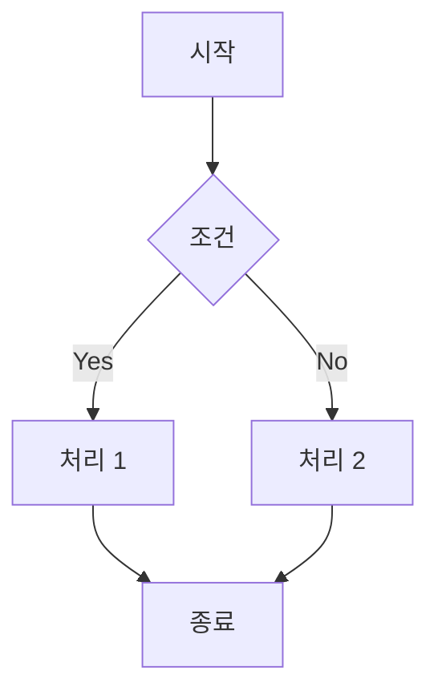
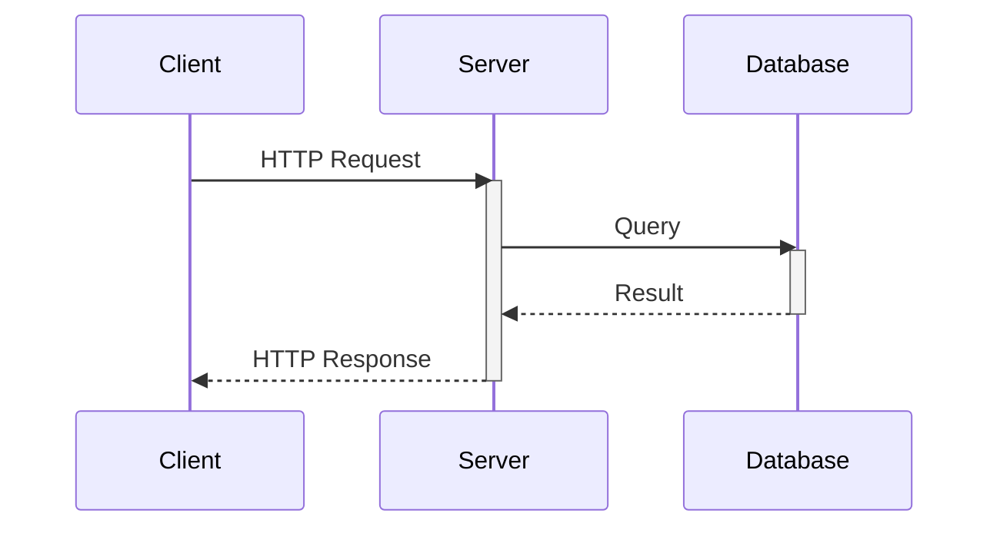
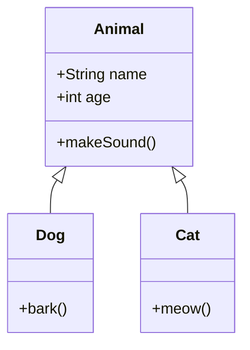
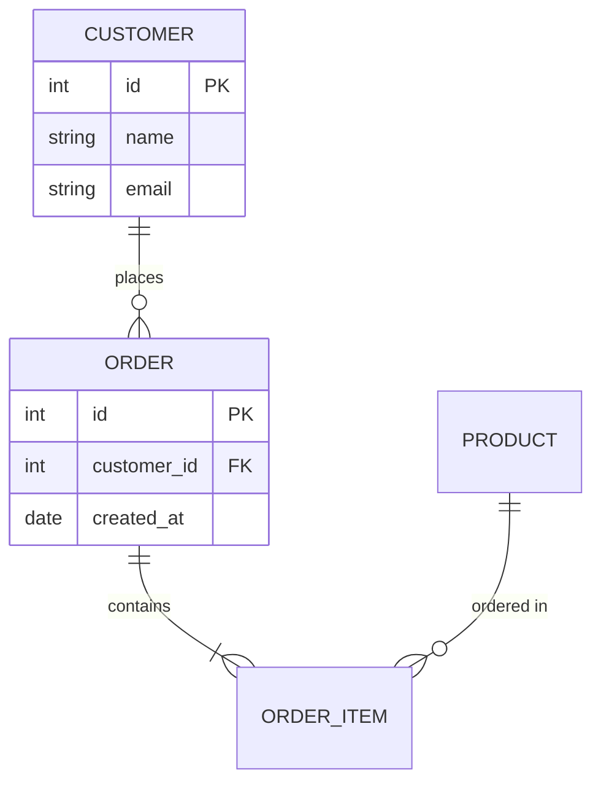
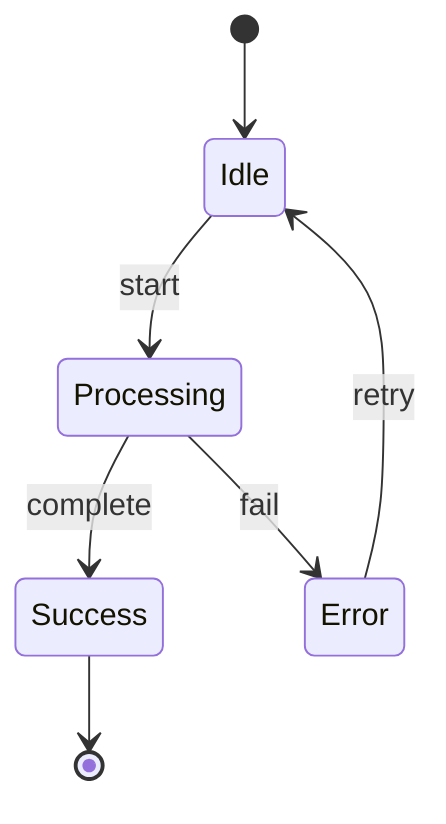
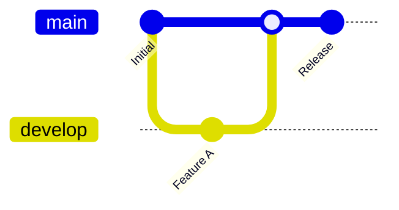
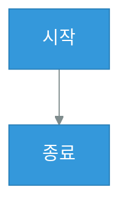
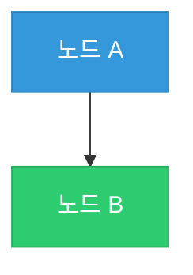

# Mermaid CLI 다이어그램 스킬

Mermaid 문법을 사용하여 다이어그램을 생성하고 SVG/PNG로 변환합니다.

## 언제 이 방식을 사용하는가?

| 상황 | Mermaid 적합 |
|------|-------------|
| **플로우차트** | 알고리즘 흐름, 의사결정 트리, 프로세스 흐름 |
| **시퀀스 다이어그램** | API 호출 흐름, 인터랙션, 프로토콜 |
| **ER 다이어그램** | 데이터베이스 스키마, 엔티티 관계 |
| **클래스 다이어그램** | 객체지향 설계, UML |
| **Git 그래프** | 브랜치 전략, 머지 플로우 |
| **간트 차트** | 프로젝트 타임라인 |
| **복잡한 논리 흐름** | 조건 분기가 많은 경우 |
| **빠른 프로토타이핑** | 빠르게 다이어그램 확인 필요 시 |

## 장점

- 텍스트 기반 문법으로 빠른 작성
- 자동 레이아웃 (노드 배치 자동화)
- 복잡한 분기/조건 표현 용이
- 시퀀스 다이어그램 특화
- Git 버전 관리 용이

## 단점

- 세밀한 레이아웃 조정 어려움
- 커스텀 스타일 제한적
- Mermaid CLI 설치 필요

## 사전 요구사항

```bash
# Mermaid CLI 설치
npm install -g @mermaid-js/mermaid-cli

# 확인
mmdc --version
```

## 파일 구조

```
cs/{category}/
├── {document}.md                    # 마크다운 문서
└── images/
    ├── {diagram-name}.mmd           # Mermaid 소스 (선택)
    └── {diagram-name}.svg           # 생성된 SVG
```

---

## Mermaid 기본 문법

### 1. 플로우차트 (Flowchart)



**방향 옵션:**
- `TD` / `TB`: 위에서 아래
- `LR`: 왼쪽에서 오른쪽
- `RL`: 오른쪽에서 왼쪽
- `BT`: 아래에서 위

**노드 형태:**
- `[텍스트]`: 사각형
- `(텍스트)`: 둥근 사각형
- `{텍스트}`: 마름모 (조건)
- `((텍스트))`: 원
- `[[텍스트]]`: 직사각형 (서브루틴)

### 2. 시퀀스 다이어그램 (Sequence Diagram)



**화살표 유형:**
- `->`: 실선
- `-->`: 점선
- `->>`: 실선 + 화살표
- `-->>`: 점선 + 화살표

**활성화/비활성화:**
- `activate 참여자`: 활성화 시작
- `deactivate 참여자`: 활성화 종료

### 3. 클래스 다이어그램 (Class Diagram)



**관계:**
- `<|--`: 상속
- `*--`: 컴포지션
- `o--`: 집합
- `-->`: 연관
- `..>`: 의존

### 4. ER 다이어그램 (Entity Relationship)



**관계 표기:**
- `||--||`: 1:1
- `||--o{`: 1:N
- `}o--o{`: N:M

### 5. 상태 다이어그램 (State Diagram)



### 6. Git 그래프



---

## 스타일 커스터마이징

### 테마 설정



### 노드별 스타일



---

## CLI 사용법

### 기본 변환

```bash
# MMD 파일에서 SVG 생성
mmdc -i diagram.mmd -o diagram.svg

# PNG로 생성
mmdc -i diagram.mmd -o diagram.png

# 배경 투명
mmdc -i diagram.mmd -o diagram.svg -b transparent
```

### 설정 파일 사용

`mermaid-config.json`:
```json
{
  "theme": "base",
  "themeVariables": {
    "primaryColor": "#3498DB",
    "primaryTextColor": "#ffffff",
    "primaryBorderColor": "#2980B9",
    "lineColor": "#7F8C8D",
    "secondaryColor": "#2ECC71",
    "tertiaryColor": "#ECF0F1",
    "fontSize": "14px"
  }
}
```

```bash
mmdc -i diagram.mmd -o diagram.svg -c mermaid-config.json
```

---

## 작성 절차

1. **Mermaid 코드 작성**: `.mmd` 파일 또는 마크다운 코드 블록
2. **SVG 변환**: `mmdc` 명령으로 변환
3. **파일 저장**: `cs/{category}/images/{diagram-name}.svg`
4. **마크다운에서 참조**: ``
5. **git add 실행**

## 주의사항

1. **파일명**: kebab-case 사용
2. **위치**: `cs/{category}/images/` 폴더에 저장
3. **한글**: 일부 폰트에서 깨질 수 있음 - 테스트 필요
4. **복잡한 레이아웃**: 자동 배치가 마음에 안 들면 SVG 직접 생성 고려
5. **Mermaid CLI 미설치 시**: SVG 직접 생성 방식 사용
