# Mermaid 다이어그램 생성 스킬

CS 문서 작성 시 ASCII 대신 Mermaid CLI로 SVG 다이어그램을 생성합니다.

## 트리거 키워드

- "다이어그램 그려줘"
- "플로우차트 만들어줘"
- "시퀀스 다이어그램"
- "아키텍처 다이어그램"
- "마인드맵으로 정리"
- "{개념} 시각화해줘"
- "ER 다이어그램"
- "클래스 다이어그램"
- "상태 다이어그램"
- "간트 차트"
- "Git 그래프"
- "타임라인"

## 다이어그램 유형 선택 가이드

| 목적 | 추천 유형 | 사용 사례 |
|------|----------|----------|
| **로직/흐름 설명** | Flowchart | 알고리즘, 상태 전환, 의사결정 |
| **API/통신 흐름** | Sequence | 클라이언트-서버 요청, 마이크로서비스 통신 |
| **시스템 구조** | Architecture (Flowchart LR + subgraph) | MSA 구조, 인프라 구성, 컴포넌트 관계 |
| **개념 정리** | Mindmap | 학습 정리, 개념 분류, 키워드 연결 |
| **클래스 관계** | Class Diagram | OOP 설계, 패턴 구조 |
| **상태 변화** | State Diagram | 상태 머신, 라이프사이클 |
| **DB 스키마** | ER Diagram | 테이블 관계, 데이터 모델 |
| **일정/타임라인** | Gantt / Timeline | 프로젝트 일정, 이벤트 순서 |
| **데이터 분포** | Pie Chart | 비율, 통계 |
| **Git 브랜치** | GitGraph | 브랜치 전략, 커밋 히스토리 |
| **사용자 경험** | User Journey | UX 흐름, 만족도 |
| **기술 평가** | Quadrant Chart | 우선순위 매트릭스, 기술 선정 |
| **수치 데이터** | XY Chart | 트래픽, 성능 지표 |
| **작업 관리** | Kanban | 태스크 상태, 스프린트 |

## 파일 구조

```
cs/{category}/
├── {document}.md           # 마크다운 문서
└── images/
    ├── {diagram-name}.mmd  # Mermaid 소스 파일
    └── {diagram-name}.svg  # 생성된 SVG 이미지
```

## 다이어그램 생성 절차

### 1. images 디렉토리 생성

```bash
mkdir -p cs/{category}/images
```

### 2. Mermaid 소스 파일 작성 (.mmd)

파일 위치: `cs/{category}/images/{diagram-name}.mmd`

### 3. SVG 생성 명령

```bash
npx -p @mermaid-js/mermaid-cli mmdc \
  -i cs/{category}/images/{diagram-name}.mmd \
  -o cs/{category}/images/{diagram-name}.svg \
  -b transparent
```

### 4. 마크다운에서 참조

```markdown

```

### 5. git add

```bash
git -C "C:/workspace/intellij/TIL" add cs/{category}/images/
```

---

## 다이어그램 유형별 Syntax 레퍼런스

### 1. Flowchart (플로우차트)

가장 범용적인 다이어그램. 프로세스, 로직, 아키텍처 모두 표현 가능.

#### 기본 템플릿

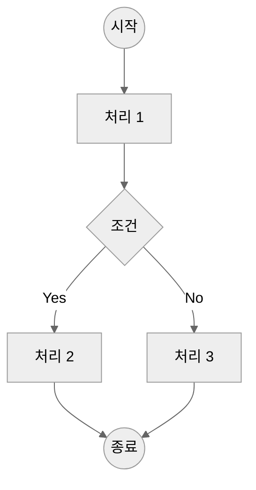

#### 방향 설정

| 방향 | 키워드 | 사용 사례 |
|------|--------|----------|
| 위→아래 | `TD` / `TB` | 일반 플로우차트 |
| 아래→위 | `BT` | 역방향 흐름 |
| 왼쪽→오른쪽 | `LR` | 아키텍처 다이어그램 |
| 오른쪽→왼쪽 | `RL` | RTL 문서 |

#### 노드 모양 전체 목록

| 문법 | 모양 | 용도 |
|------|------|------|
| `A[텍스트]` | 사각형 | 프로세스, 작업 |
| `A(텍스트)` | 둥근 사각형 | 시작/종료 |
| `A([텍스트])` | 스타디움 | 터미널 |
| `A[[텍스트]]` | 서브루틴 | 서브프로세스 |
| `A[(텍스트)]` | 원통 | 데이터베이스 |
| `A((텍스트))` | 원 | 연결점 |
| `A>텍스트]` | 비대칭 | 플래그/태그 |
| `A{텍스트}` | 마름모 | 조건/분기 |
| `A{{텍스트}}` | 육각형 | 준비 단계 |
| `A[/텍스트/]` | 평행사변형 | 입력 |
| `A[\텍스트\]` | 역평행사변형 | 출력 |
| `A[/텍스트\]` | 사다리꼴 | 수동 조작 |
| `A[\텍스트/]` | 역사다리꼴 | 수동 입력 |
| `A(((텍스트)))` | 이중 원 | 중요 연결점 |

#### 연결선 전체 목록

| 문법 | 설명 |
|------|------|
| `A --> B` | 화살표 |
| `A --- B` | 선 (화살표 없음) |
| `A -.-> B` | 점선 화살표 |
| `A ==> B` | 굵은 화살표 |
| `A --텍스트--> B` | 라벨 있는 화살표 |
| `A -.텍스트.-> B` | 라벨 있는 점선 |
| `A ==텍스트==> B` | 라벨 있는 굵은선 |
| `A --o B` | 원형 끝 |
| `A --x B` | X 끝 |
| `A <--> B` | 양방향 화살표 |
| `A o--o B` | 양방향 원형 |
| `A x--x B` | 양방향 X |
| `A ~~~ B` | 보이지 않는 연결 |

#### Subgraph (그룹핑)

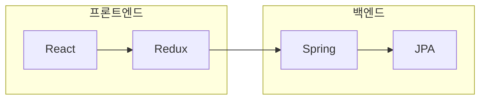

#### 스타일 컬러 가이드

| 의미 | 배경색 | 테두리색 |
|------|--------|----------|
| 정상/성공 | #c8e6c9 (연녹색) | #2e7d32 |
| 에러/위험 | #ffcdd2 (연빨강) | #c62828 |
| 경고/대기 | #ffe0b2 (연주황) | #e65100 |
| 정보/중립 | #bbdefb (연파랑) | #1976d2 |
| 비활성 | #f5f5f5 (연회색) | #9e9e9e |


---

### 2. Sequence Diagram (시퀀스 다이어그램)

API 호출, 시스템 간 통신 흐름에 최적화.

#### 기본 템플릿

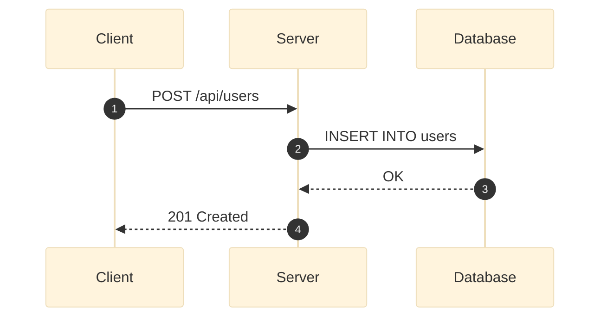

#### 화살표 종류

| 문법 | 설명 | 사용 사례 |
|------|------|----------|
| `->` | 실선 | 동기 호출 |
| `-->` | 점선 | 응답 |
| `->>` | 실선 + 채운 화살표 | 요청 (권장) |
| `-->>` | 점선 + 채운 화살표 | 응답 (권장) |
| `-x` | 실선 + X | 실패/에러 |
| `--x` | 점선 + X | 비동기 실패 |
| `-)` | 실선 + 열린 화살표 | 비동기 요청 |
| `--)` | 점선 + 열린 화살표 | 비동기 응답 |

#### 고급 기능

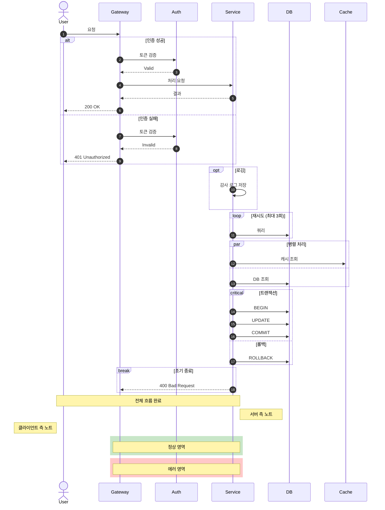

#### 영역 색상

| 의미 | RGB |
|------|-----|
| 정상 | rgb(200, 230, 200) |
| 에러 | rgb(255, 200, 200) |
| 대기/테스트 | rgb(255, 230, 180) |
| 정보 | rgb(200, 220, 255) |

---

### 3. Class Diagram (클래스 다이어그램)

OOP 설계, 디자인 패턴 구조 표현.

#### 기본 템플릿

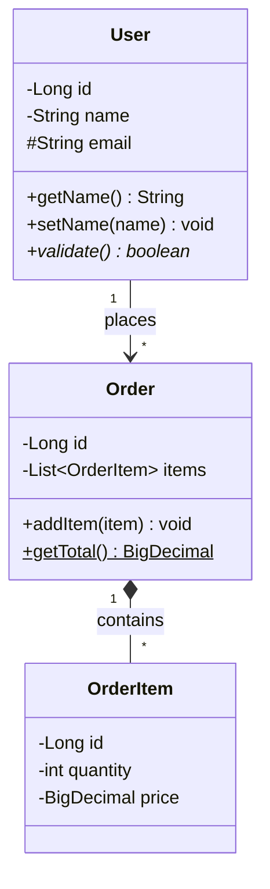

#### 접근 제어자

| 기호 | 접근 제어자 |
|------|------------|
| `+` | public |
| `-` | private |
| `#` | protected |
| `~` | package/internal |

#### 메서드 표기

| 표기 | 의미 |
|------|------|
| `method()` | 일반 메서드 |
| `method()*` | 추상 메서드 |
| `method()$` | 정적 메서드 |

#### 관계 표현 전체 목록

| 문법 | 관계 | 설명 | 화살표 |
|------|------|------|--------|
| `<\|--` | 상속 | Inheritance | 빈 삼각형 |
| `<\|..` | 구현 | Realization | 빈 삼각형 (점선) |
| `*--` | 컴포지션 | Composition (강한 소유) | 채운 다이아몬드 |
| `o--` | 집합 | Aggregation (약한 소유) | 빈 다이아몬드 |
| `-->` | 연관 | Association | 화살표 |
| `--` | 링크 | Link | 선 |
| `..>` | 의존 | Dependency | 화살표 (점선) |
| `..` | 점선 | Dashed Link | 점선 |

#### Cardinality (다중성)

| 표기 | 의미 |
|------|------|
| `1` | 정확히 1 |
| `0..1` | 0 또는 1 |
| `1..*` | 1 이상 |
| `*` | 0 이상 |
| `n` | n개 |
| `0..n` | 0에서 n개 |

#### 스테레오타입

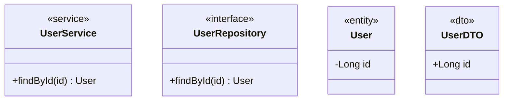

---

### 4. State Diagram (상태 다이어그램)

상태 머신, 라이프사이클 표현.

#### 기본 템플릿

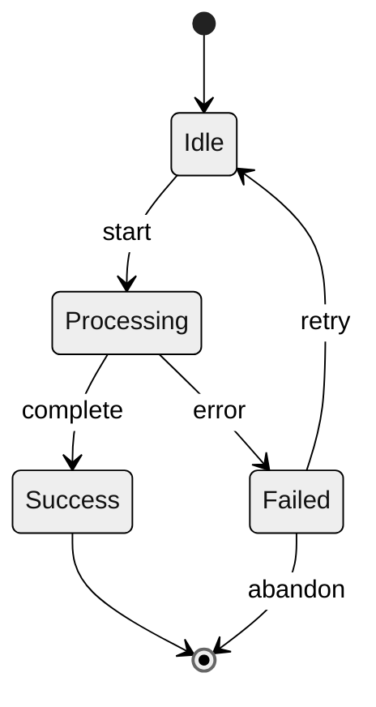

#### 복합 상태 (Nested State)

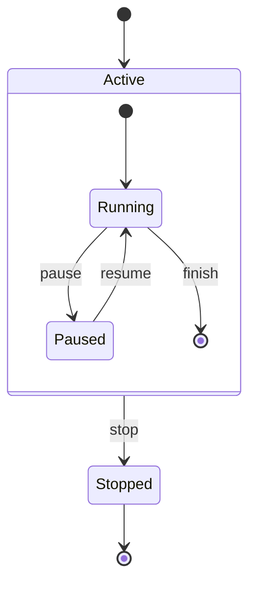

#### Fork / Join (병렬 상태)

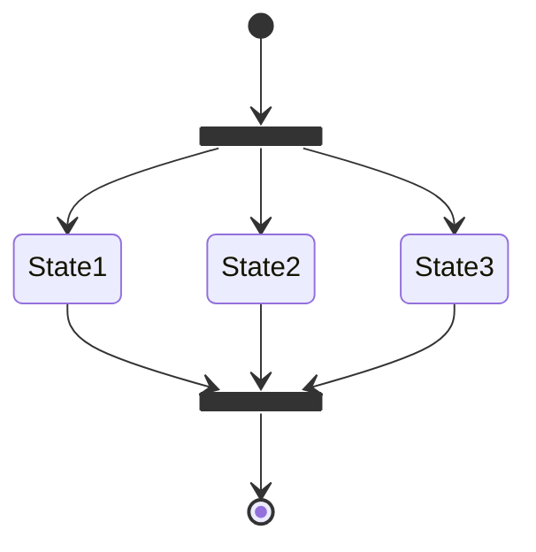

#### Choice (조건 분기)

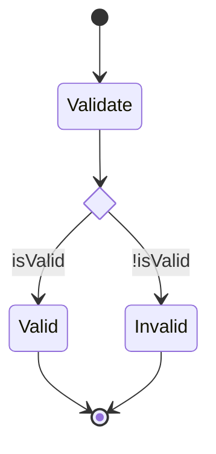

#### 노트

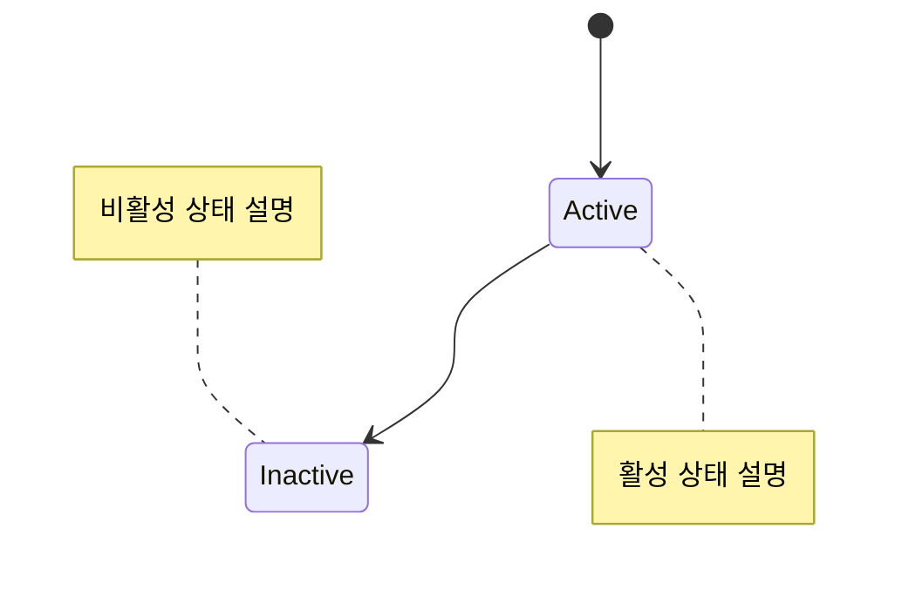

---

### 5. ER Diagram (개체 관계 다이어그램)

데이터베이스 스키마, 테이블 관계 표현.

#### 기본 템플릿

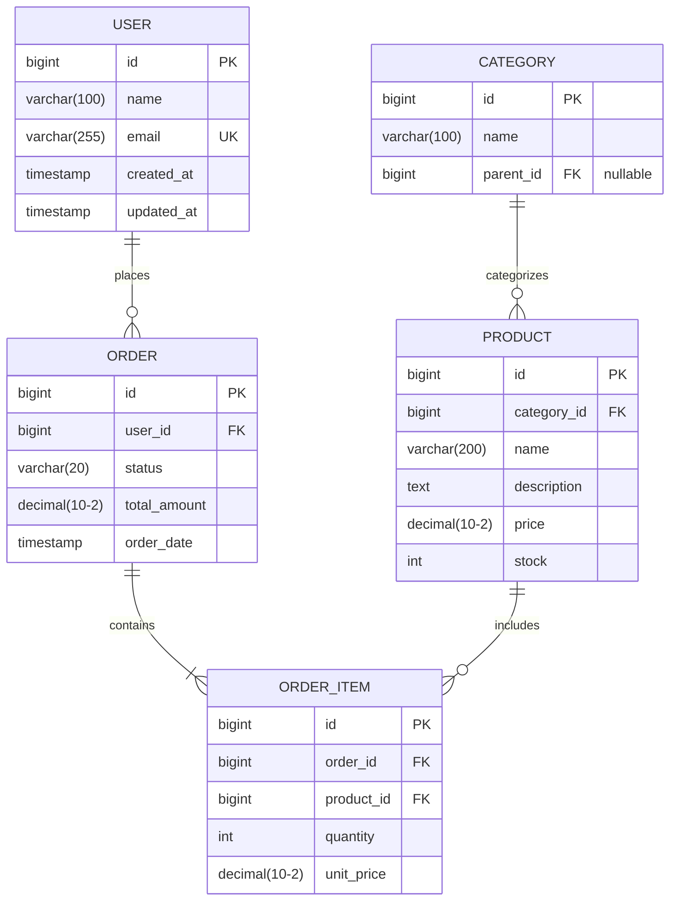

#### 관계 표기 전체 목록

| 왼쪽 | 오른쪽 | 의미 |
|------|--------|------|
| `\|\|` | `\|\|` | 정확히 1 대 1 |
| `\|\|` | `o{` | 1 대 0 이상 |
| `\|\|` | `\|{` | 1 대 1 이상 |
| `o\|` | `o{` | 0 또는 1 대 0 이상 |
| `o\|` | `\|{` | 0 또는 1 대 1 이상 |
| `}o` | `o{` | 0 이상 대 0 이상 |

#### 속성 키

| 키 | 의미 |
|----|------|
| `PK` | Primary Key |
| `FK` | Foreign Key |
| `UK` | Unique Key |

---

### 6. Mindmap (마인드맵)

개념 정리, 브레인스토밍에 최적화.

#### 기본 템플릿

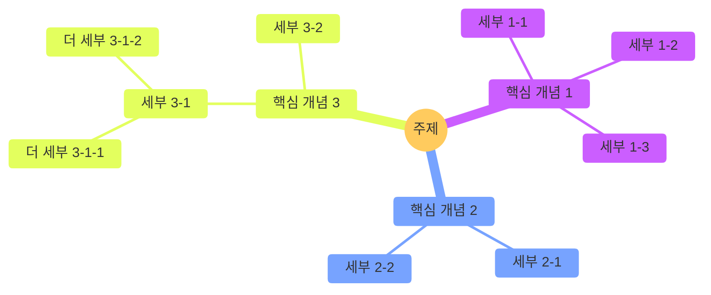

#### 노드 모양

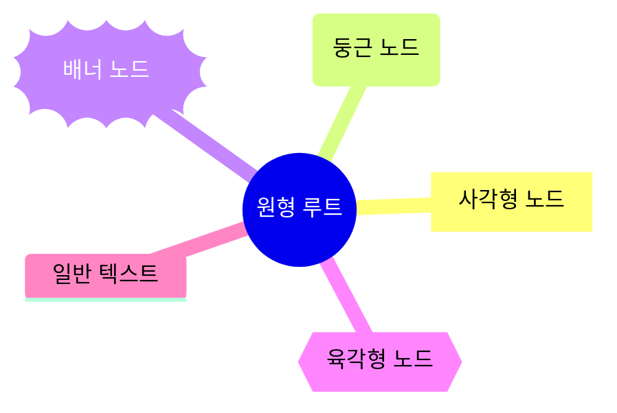

---

### 7. Gantt Chart (간트 차트)

프로젝트 일정, 마일스톤 표현.

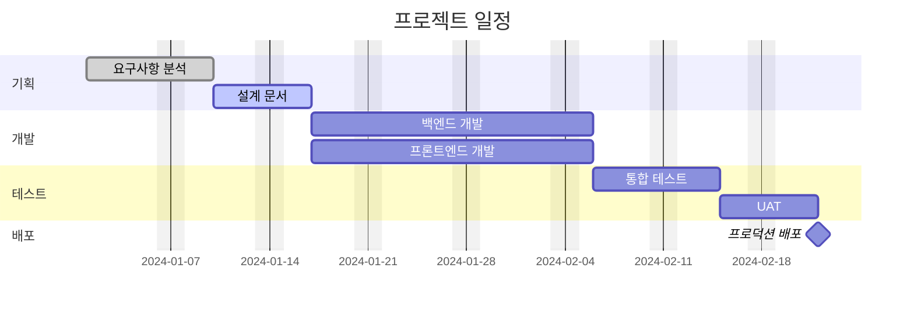

#### 태스크 상태

| 상태 | 설명 |
|------|------|
| `done` | 완료됨 |
| `active` | 진행 중 |
| `crit` | 크리티컬 패스 |
| `milestone` | 마일스톤 |

---

### 8. GitGraph (Git 그래프)

브랜치 전략, 커밋 히스토리 시각화.

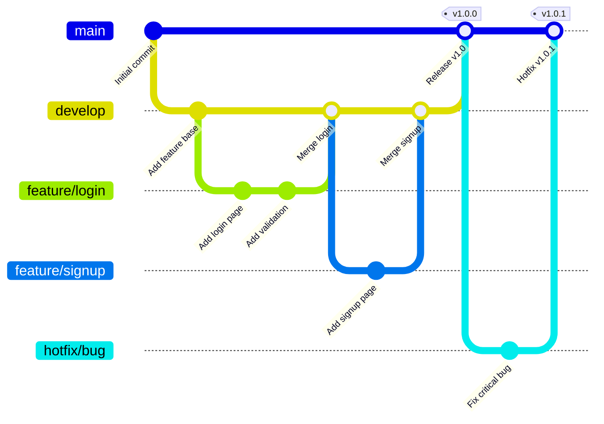

---

### 9. Timeline (타임라인)

연대표, 이벤트 순서 표현.

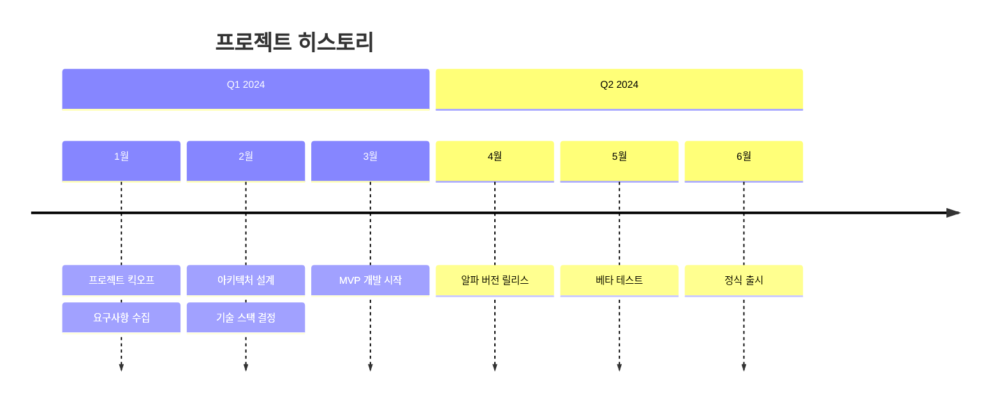

---

### 10. User Journey (사용자 여정)

UX 흐름, 사용자 만족도 표현.

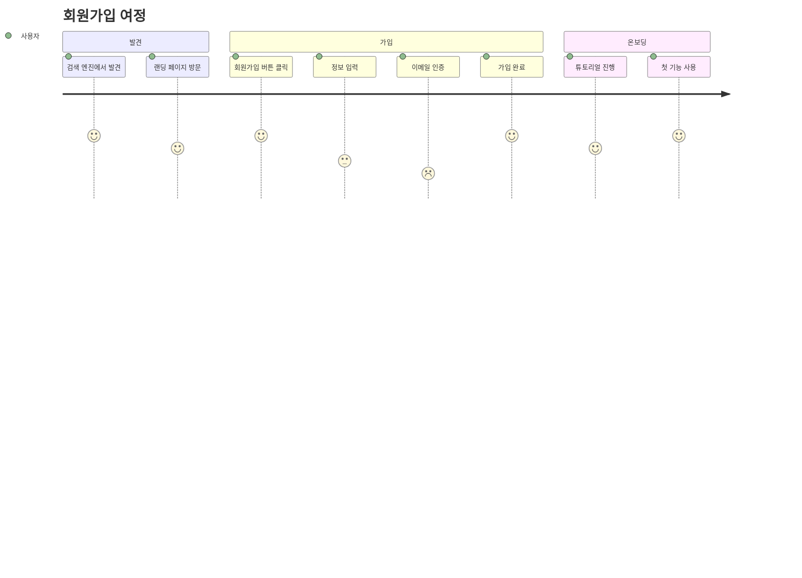

숫자는 만족도 (1: 최저, 5: 최고)

---

### 11. Pie Chart (파이 차트)

비율, 분포 표현.

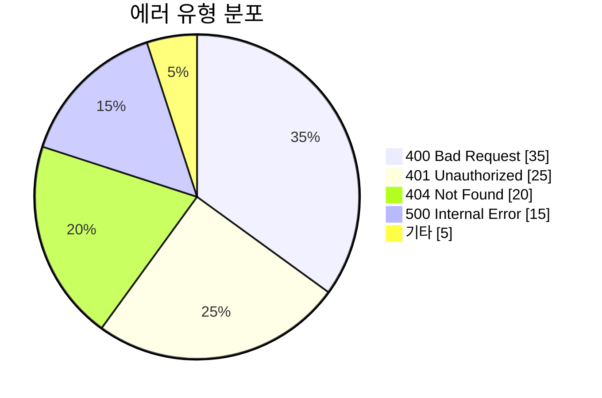

---

### 12. Quadrant Chart (사분면 차트)

기술 평가, 우선순위 매트릭스.

```mermaid
quadrantChart
    title 기술 부채 평가
    x-axis 수정 난이도 낮음 --> 수정 난이도 높음
    y-axis 비즈니스 영향 낮음 --> 비즈니스 영향 높음
    quadrant-1 즉시 수정
    quadrant-2 계획 수립
    quadrant-3 시간 여유 시 수정
    quadrant-4 모니터링
    레거시 인증: [0.8, 0.9]
    하드코딩된 설정: [0.3, 0.7]
    중복 코드: [0.4, 0.4]
    미사용 의존성: [0.2, 0.2]
    비효율 쿼리: [0.6, 0.8]
```

---

### 13. XY Chart (좌표 차트)

수치 데이터, 트렌드 표현.

```mermaid
xychart-beta
    title "월별 API 응답 시간"
    x-axis [Jan, Feb, Mar, Apr, May, Jun]
    y-axis "응답 시간 (ms)" 0 --> 500
    bar [120, 150, 180, 160, 140, 130]
    line [120, 150, 180, 160, 140, 130]
```

---

### 14. Kanban (칸반 보드)

작업 상태 관리.

```
kanban
    column1[Backlog]
        task1[기능 A 설계]
        task2[기능 B 설계]
    column2[In Progress]
        task3[기능 C 개발]
    column3[Review]
        task4[기능 D 코드 리뷰]
    column4[Done]
        task5[기능 E 완료]
        task6[기능 F 완료]
```

---

## 스타일 옵션

### 테마

| 테마 | 특징 | 사용 사례 |
|------|------|----------|
| `default` | 기본 테마 | 일반 문서 |
| `neutral` | 깔끔한 회색 기반 | 기술 문서 (권장) |
| `dark` | 다크 모드 | 다크 테마 문서 |
| `forest` | 녹색 계열 | 환경/자연 관련 |
| `base` | 커스터마이징 기본 | 브랜드 컬러 적용 |

### 테마 적용

```mermaid
%%{init: {'theme': 'neutral'}}%%
flowchart LR
    A --> B
```

### 손그림 스타일 (선택)

```mermaid
%%{init: {'look': 'handDrawn', 'theme': 'neutral'}}%%
flowchart LR
    A --> B
```

### 노드 스타일링

```mermaid
flowchart LR
    A[기본] --> B[스타일 적용]

    style A fill:#fff,stroke:#333,stroke-width:2px
    style B fill:#ff6b6b,stroke:#c92a2a,stroke-width:2px,color:#fff
```

### 클래스 정의

```mermaid
flowchart LR
    A[성공]:::success --> B[에러]:::error --> C[경고]:::warning

    classDef success fill:#c8e6c9,stroke:#2e7d32,stroke-width:2px
    classDef error fill:#ffcdd2,stroke:#c62828,stroke-width:2px
    classDef warning fill:#ffe0b2,stroke:#e65100,stroke-width:2px
```

---

## CS 문서 작성 시 다이어그램 배치 가이드

| 섹션 | 추천 다이어그램 | 예시 |
|------|----------------|------|
| 핵심 개념 | Mindmap | 주제의 전체 구조 한눈에 |
| 상세 설명 (구조) | Flowchart (LR + subgraph) | 아키텍처, 컴포넌트 관계 |
| 동작 원리 | Sequence / Flowchart | API 흐름, 상태 전환 |
| 상태 변화 | State Diagram | 라이프사이클 |
| 데이터 모델 | ER Diagram | DB 스키마 |
| 클래스 설계 | Class Diagram | OOP, 패턴 |
| 일정 | Gantt / Timeline | 프로젝트 진행 |
| 브랜치 전략 | GitGraph | Git Flow 설명 |

---

## 주의사항

1. **파일명**: kebab-case 사용 (예: `circuit-breaker-state.mmd`)
2. **SVG 재생성**: .mmd 수정 후 반드시 SVG 재생성
3. **배경**: `-b transparent` 옵션으로 투명 배경 사용
4. **한글**: 한글 텍스트 완벽 지원
5. **줄바꿈**: 노드 내 줄바꿈은 `<br/>` 사용
6. **이스케이프**: 특수문자(`#`, `&`, `<`, `>`)는 따옴표로 감싸기
7. **테마 일관성**: 같은 문서 내에서는 동일 테마 사용

---

## cs-guide-writer 연동

CS 문서 작성 시 다음 상황에서 이 스킬을 활용:

1. **동작 원리 섹션**: 프로세스 흐름을 시각화
2. **핵심 개념 섹션**: 마인드맵으로 개념 정리
3. **상세 설명 섹션**: 아키텍처/구조 시각화
4. **API/통신 설명**: 시퀀스 다이어그램
5. **데이터 모델**: ER 다이어그램
6. **상태 관리**: 상태 다이어그램

ASCII 다이어그램 대신 Mermaid SVG를 사용하여 더 명확하고 시각적인 문서를 작성합니다.

---

## 참고 자료

- [Mermaid 공식 문서](https://mermaid.js.org/)
- [Mermaid Live Editor](https://mermaid.live/)
- [Mermaid CS 문서](../../cs/automation/mermaid.md)
