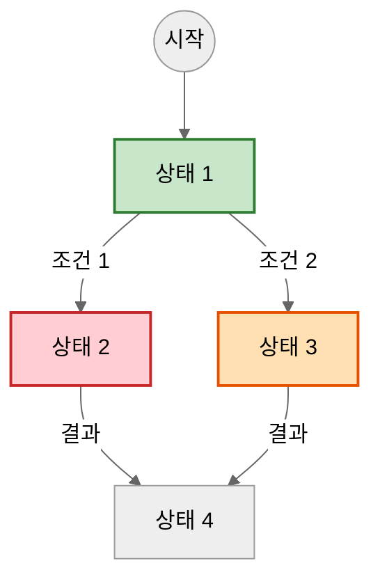
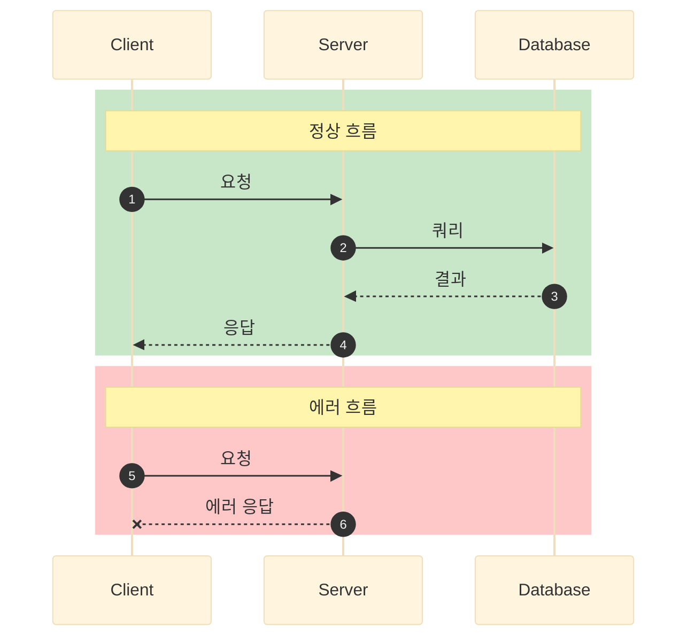
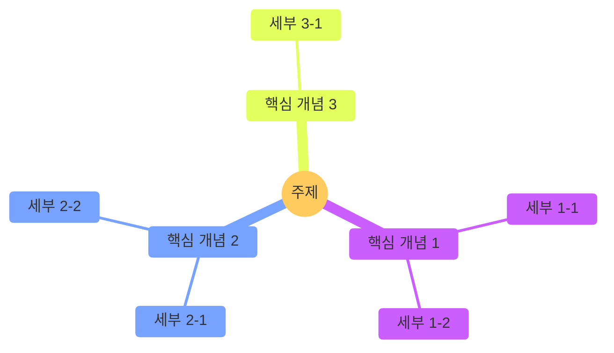
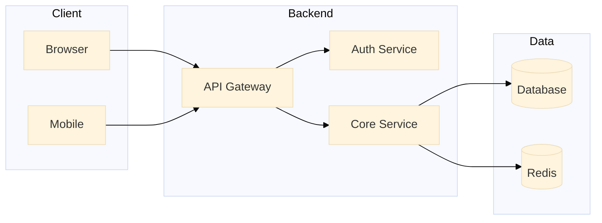
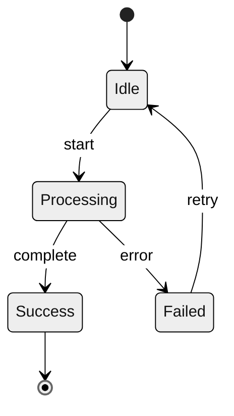

# Mermaid 다이어그램 생성 스킬

CS 문서 작성 시 ASCII 대신 Mermaid CLI로 SVG 다이어그램을 생성합니다.

## 트리거 키워드

- "다이어그램 그려줘"
- "플로우차트 만들어줘"
- "시퀀스 다이어그램"
- "아키텍처 다이어그램"
- "마인드맵으로 정리"
- "{개념} 시각화해줘"

## 다이어그램 유형 선택 가이드

| 목적 | 추천 유형 | 사용 사례 |
|------|----------|----------|
| **로직/흐름 설명** | Flowchart | 알고리즘, 상태 전환, 의사결정 |
| **API/통신 흐름** | Sequence | 클라이언트-서버 요청, 마이크로서비스 통신 |
| **시스템 구조** | Architecture | MSA 구조, 인프라 구성, 컴포넌트 관계 |
| **개념 정리** | Mindmap | 학습 정리, 개념 분류, 키워드 연결 |
| **클래스 관계** | Class Diagram | OOP 설계, 패턴 구조 |
| **상태 변화** | State Diagram | 상태 머신, 라이프사이클 |
| **일정/타임라인** | Gantt/Timeline | 프로젝트 일정, 이벤트 순서 |

## 파일 구조

```
cs/{category}/
├── {document}.md           # 마크다운 문서
└── images/
    ├── {diagram-name}.mmd  # Mermaid 소스 파일
    └── {diagram-name}.svg  # 생성된 SVG 이미지
```

## 다이어그램 생성 절차

### 1. images 디렉토리 생성

```bash
mkdir -p cs/{category}/images
```

### 2. Mermaid 소스 파일 작성 (.mmd)

파일 위치: `cs/{category}/images/{diagram-name}.mmd`

### 3. SVG 생성 명령

```bash
npx -p @mermaid-js/mermaid-cli mmdc \
  -i cs/{category}/images/{diagram-name}.mmd \
  -o cs/{category}/images/{diagram-name}.svg \
  -b transparent
```

### 4. 마크다운에서 참조

```markdown

```

### 5. git add

```bash
git -C "C:/workspace/intellij/TIL" add cs/{category}/images/
```

## 다이어그램 유형별 템플릿

### Flowchart (로직/상태 전환)



**스타일 컬러 가이드:**
| 의미 | 배경색 | 테두리색 |
|------|--------|----------|
| 정상/성공 | #c8e6c9 (연녹색) | #2e7d32 |
| 에러/위험 | #ffcdd2 (연빨강) | #c62828 |
| 경고/대기 | #ffe0b2 (연주황) | #e65100 |
| 정보/중립 | #bbdefb (연파랑) | #1976d2 |

### Sequence (API/통신 흐름)



**Sequence 화살표 종류:**
| 문법 | 의미 |
|------|------|
| `->>` | 실선 화살표 (동기 요청) |
| `-->>` | 점선 화살표 (응답) |
| `--x` | 점선 X (실패/에러) |
| `--)` | 비동기 메시지 |

**영역 색상:**
| 의미 | RGB |
|------|-----|
| 정상 | rgb(200, 230, 200) |
| 에러 | rgb(255, 200, 200) |
| 대기/테스트 | rgb(255, 230, 180) |

### Mindmap (개념 정리)



### Architecture (시스템 구조)



### State Diagram (상태 머신)



## 스타일 옵션

### 테마

| 테마 | 특징 |
|------|------|
| `neutral` | 깔끔한 회색 기반 (권장) |
| `base` | 기본 테마 |
| `dark` | 다크 모드 |
| `forest` | 녹색 계열 |

### 손그림 스타일 (선택)

```mermaid
%%{init: {'look': 'handDrawn', 'theme': 'neutral'}}%%
```

## CS 문서 작성 시 다이어그램 배치 가이드

| 섹션 | 추천 다이어그램 |
|------|----------------|
| 핵심 개념 | Mindmap |
| 상세 설명 (구조) | Architecture / Flowchart |
| 동작 원리 | Sequence / Flowchart |
| 상태 변화 | State Diagram / Flowchart |

## 주의사항

1. **파일명**: kebab-case 사용 (예: `circuit-breaker-state.mmd`)
2. **SVG 재생성**: .mmd 수정 후 반드시 SVG 재생성
3. **배경**: `-b transparent` 옵션으로 투명 배경 사용
4. **한글**: 한글 텍스트 지원됨
5. **줄바꿈**: 노드 내 줄바꿈은 `<br/>` 사용

## 예시: CS 문서에 다이어그램 추가

### 1. 문서 분석

문서 내용을 파악하고 시각화가 필요한 부분 식별

### 2. 다이어그램 유형 선택

- 상태 전환/흐름 → Flowchart
- API 호출 → Sequence
- 개념 정리 → Mindmap
- 시스템 구조 → Architecture

### 3. 다이어그램 생성

```bash
# 1. 디렉토리 생성
mkdir -p cs/{category}/images

# 2. .mmd 파일 작성 (Write 도구 사용)

# 3. SVG 생성
npx -p @mermaid-js/mermaid-cli mmdc \
  -i cs/{category}/images/{name}.mmd \
  -o cs/{category}/images/{name}.svg \
  -b transparent

# 4. git add
git -C "C:/workspace/intellij/TIL" add cs/{category}/images/
```

### 4. 마크다운에 삽입

```markdown
## 동작 원리


```

## cs-guide-writer 연동

CS 문서 작성 시 다음 상황에서 이 스킬을 활용:

1. **동작 원리 섹션**: 프로세스 흐름을 시각화
2. **핵심 개념 섹션**: 마인드맵으로 개념 정리
3. **상세 설명 섹션**: 아키텍처/구조 시각화
4. **API/통신 설명**: 시퀀스 다이어그램

ASCII 다이어그램 대신 Mermaid SVG를 사용하여 더 명확하고 시각적인 문서를 작성합니다.
