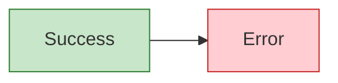
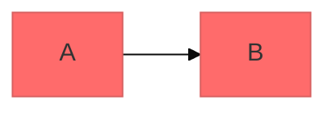

# Mermaid CLI 사용법

`mmdc` 명령어로 `.mmd` 파일을 SVG/PNG로 변환하는 방법.

---

## 기본 변환

```bash
# MMD 파일에서 SVG 생성
mmdc -i diagram.mmd -o diagram.svg

# PNG로 생성
mmdc -i diagram.mmd -o diagram.png

# 배경 투명
mmdc -i diagram.mmd -o diagram.svg -b transparent

# 테마 지정
mmdc -i diagram.mmd -o diagram.svg -t dark

# 크기 지정
mmdc -i diagram.mmd -o diagram.png -w 1920 -H 1080
```

---

## 설정 파일 사용

`mermaid-config.json`을 만들어 테마 변수를 일괄 적용할 수 있다.

```json
{
  "theme": "base",
  "themeVariables": {
    "primaryColor": "#3498DB",
    "primaryTextColor": "#ffffff",
    "primaryBorderColor": "#2980B9",
    "lineColor": "#7F8C8D",
    "secondaryColor": "#2ECC71",
    "tertiaryColor": "#ECF0F1",
    "fontSize": "14px"
  }
}
```

```bash
mmdc -i diagram.mmd -o diagram.svg -c mermaid-config.json
```

---

## 테마 옵션

| 테마 | 설명 |
|------|------|
| `default` | 기본 테마 |
| `neutral` | 깔끔한 회색 기반 |
| `dark` | 다크 모드 |
| `forest` | 녹색 계열 |
| `base` | 커스터마이징 기본 |

---

## 스타일링

### 노드 스타일 (인라인)


### 클래스 정의

여러 노드에 같은 스타일을 적용할 때 `classDef`를 사용한다.



### 다이어그램 내 테마 초기화

파일 설정 없이 다이어그램 코드 상단에서 직접 테마를 지정할 수 있다.


