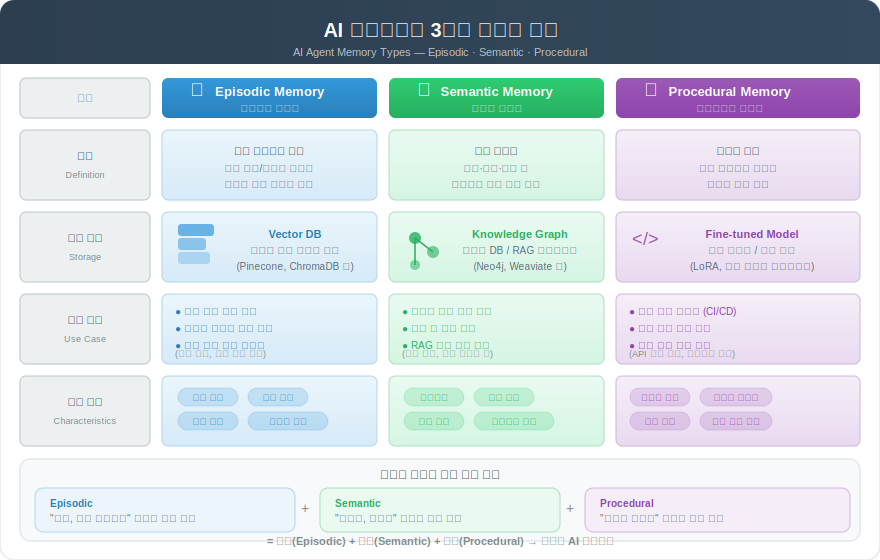

# AI 에이전트 메모리 아키텍처 (Agent Memory Architecture)

> `[3] 중급` · 선수 지식: [AI Agent란](./ai-agent.md), [Context Engineering](./context-engineering.md)

> `Trend` 2026

> AI 에이전트가 컨텍스트 윈도우의 한계를 넘어 과거 상호작용, 지식, 학습된 스킬을 장기적으로 저장·검색·활용하는 메모리 인프라 아키텍처

`#에이전트메모리` `#AgentMemory` `#MemoryArchitecture` `#메모리아키텍처` `#에피소딕메모리` `#EpisodicMemory` `#시맨틱메모리` `#SemanticMemory` `#프로시저럴메모리` `#ProceduralMemory` `#장기기억` `#LongTermMemory` `#단기기억` `#WorkingMemory` `#컨텍스트윈도우` `#ContextWindow` `#벡터DB` `#VectorDatabase` `#임베딩` `#Embedding` `#RAG` `#StatefulAgent` `#상태유지에이전트` `#MemoryManager` `#지식그래프` `#KnowledgeGraph` `#AIAgent` `#LLM` `#2026Trend` `#에이전트인프라` `#메모리검색`

## 왜 알아야 하는가?

- **실무**: 2026년 에이전트 배포에서 가장 큰 병목이 "메모리 관리". 2/3 조직이 에이전트를 실험 중이지만 프로덕션 스케일에 성공한 곳은 1/4 미만 — 그 핵심 원인이 상태(state) 관리
- **면접**: "에이전트가 이전 대화를 어떻게 기억하나요?", "RAG와 에이전트 메모리의 차이", "Stateless vs Stateful 에이전트" 등 아키텍처 설계 역량 질문 빈출
- **기반 지식**: Multi-Agent 오케스트레이션, Context Engineering, Agent SDK 구현의 핵심 인프라. 메모리 없이는 진정한 자율 에이전트 구축 불가

## 핵심 개념

- **Working Memory (작업 기억)**: LLM의 컨텍스트 윈도우 — 현재 대화와 즉시 필요한 정보를 담는 단기 저장소
- **Episodic Memory (에피소딕 기억)**: 과거 상호작용 기록 — "언제, 무엇을, 어떻게 했는가"를 저장
- **Semantic Memory (시맨틱 기억)**: 도메인 지식 저장소 — 개념, 관계, 사실 등 구조화된 지식
- **Procedural Memory (프로시저럴 기억)**: 학습된 스킬과 패턴 — "어떻게 하는가"를 저장
- **Memory Manager**: 메모리 저장/검색/삭제를 조율하는 중앙 관리 컴포넌트

## 쉽게 이해하기

**개발자의 업무 방식 비유**

현재 LLM은 **화이트보드만 있는 개발자**와 같습니다. 화이트보드(컨텍스트 윈도우)에 적을 수 있는 공간이 한정되어 있고, 지우면 다시 떠올릴 수 없습니다.

에이전트 메모리 아키텍처는 이 개발자에게 **3가지 도구를 추가**하는 것입니다:

| 도구 | 메모리 유형 | 역할 |
|------|-----------|------|
| **업무 일지** | Episodic | "지난주 A 프로젝트에서 이 버그를 이렇게 고쳤다" |
| **위키/문서** | Semantic | "우리 회사 API 스펙은 이렇다", "이 라이브러리 사용법" |
| **손에 밴 습관** | Procedural | "PR 리뷰할 때 항상 보안 체크리스트부터 확인" |

```
[화이트보드만 있는 개발자 (기존 LLM)]
"3일 전에 뭘 했더라... 기억이 안 나네"

[메모리 시스템을 갖춘 개발자 (Memory-Augmented Agent)]
"업무 일지에 따르면 3일 전에 이 패턴으로 해결했고,
 위키를 보니 관련 API 스펙이 바뀌었고,
 경험상 이 순서로 진행하면 효율적이야"
```

## 상세 설명

### 왜 컨텍스트 윈도우만으로는 부족한가?

2026년 기준 LLM의 컨텍스트 윈도우는 128K~1M 토큰으로 확장되었지만, 근본적인 한계가 있다:

| 한계 | 설명 |
|------|------|
| **비용 증가** | 컨텍스트가 길수록 API 비용이 선형 증가 |
| **성능 저하** | "Lost in the Middle" 문제 — 긴 컨텍스트의 중간 정보를 잘 활용하지 못함 |
| **세션 단절** | 대화가 끝나면 모든 맥락이 소실됨 |
| **지식 고정** | 학습 데이터 컷오프 이후 정보를 모름 |

**왜 이렇게 하는가?**
인간의 뇌도 Working Memory(작업 기억)만으로는 복잡한 업무를 수행할 수 없다. 장기 기억(Long-Term Memory)에 경험과 지식을 저장하고, 필요할 때 인출(retrieval)하는 구조가 필수다. 에이전트도 동일한 원리를 적용한 것이다.

### 3가지 메모리 유형



#### 1. Episodic Memory (에피소딕 기억)

**정의**: 과거 상호작용의 구체적인 기록. "언제, 어디서, 무엇을, 어떻게" 경험했는지 저장한다.

**저장 대상**:
- 이전 대화 이력 (사용자 요청 + 에이전트 응답)
- 작업 수행 결과 (성공/실패, 소요 시간)
- 오류 기록과 해결 과정
- 사용자 피드백 및 선호도

**구현 방식**:
```
[대화 기록] → [임베딩 모델] → [벡터 DB 저장]
                                    │
[새 질문] → [임베딩] → [유사도 검색] ─┘→ [관련 기억 인출]
```

**실제 예시** — Claude Code의 `MEMORY.md`:
```markdown
# MEMORY.md (Claude Code의 Episodic Memory)
## 프로젝트 패턴
- 이 프로젝트는 Spring Boot 3.2 + JPA 사용
- 사용자는 항상 한글 응답 선호
- 테스트 실행 시 ./gradlew test 사용

## 해결된 이슈
- 2026-03-01: N+1 쿼리 문제 → EntityGraph로 해결
- 2026-03-03: CORS 에러 → SecurityConfig에 설정 추가
```

**왜 필요한가?**
같은 실수를 반복하지 않고, 이전에 효과적이었던 접근 방식을 재활용할 수 있다. 인간이 경험에서 학습하는 것과 동일하다.

#### 2. Semantic Memory (시맨틱 기억)

**정의**: 도메인 지식과 개념 간 관계를 저장하는 지식 저장소. "무엇이 참인가"에 해당한다.

**저장 대상**:
- API 문서, 코드 규칙, 아키텍처 결정
- 개념 정의와 관계 (예: "트랜잭션 → ACID → 격리 수준")
- 비즈니스 도메인 지식
- FAQ와 베스트 프랙티스

**구현 방식**:

| 방식 | 적합한 경우 | 도구 |
|------|-----------|------|
| **벡터 DB + RAG** | 비정형 문서 검색 | Pinecone, Weaviate, ChromaDB |
| **지식 그래프** | 개념 간 관계 탐색 | Neo4j, Amazon Neptune |
| **구조화 저장** | 정형 데이터 조회 | PostgreSQL, Redis |

```java
// Semantic Memory 검색 예시 (RAG 패턴)
public class SemanticMemory {
    private final VectorStore vectorStore;
    private final EmbeddingModel embeddingModel;

    /**
     * 질의와 관련된 지식을 검색한다
     */
    public List<Document> retrieve(String query, int topK) {
        float[] queryEmbedding = embeddingModel.embed(query);
        return vectorStore.similaritySearch(
            queryEmbedding,
            topK,
            0.7  // 유사도 임계값
        );
    }
}
```

**왜 필요한가?**
LLM의 학습 데이터 컷오프 이후 정보나 조직 내부 지식은 컨텍스트 윈도우에 매번 넣어줄 수 없다. Semantic Memory가 이 갭을 채운다.

#### 3. Procedural Memory (프로시저럴 기억)

**정의**: 반복적으로 수행한 작업에서 학습된 패턴과 스킬. "어떻게 하는가"에 해당한다.

**저장 대상**:
- 성공한 코드 패턴 (예: "이 프로젝트에서 Repository는 이렇게 만든다")
- 워크플로우 템플릿 (예: "PR 생성 시 항상 이 순서로")
- 선호하는 문제 해결 전략
- Fine-tuned 모델 파라미터

**구현 방식**:
```
[반복 작업 관찰] → [패턴 추출] → [스킬으로 저장]
                                      │
[유사 작업 발생] → [스킬 매칭] ────────┘→ [자동 적용]
```

**실제 예시** — Claude Code의 Skill/Hook 시스템:
```markdown
# .claude/skills/cs-guide-writer.md (Procedural Memory)
- CS 문서 요청 시 항상 CS-GUIDE.md 템플릿을 따름
- 다이어그램은 cs-diagram-generator 에이전트에 위임
- README 업데이트는 cs-index-manager에 위임
→ 이 절차가 "손에 밴" 프로시저럴 메모리
```

**왜 필요한가?**
매번 처음부터 절차를 파악하는 대신, 학습된 패턴으로 즉시 실행할 수 있다. 사람이 자전거 타는 법을 한번 배우면 잊지 않는 것과 같다.

### 메모리 아키텍처 전체 흐름



### Working Memory와 Long-Term Memory의 협력

```
┌─────────────────── Agent Memory System ───────────────────┐
│                                                            │
│  ┌──────────────┐    ┌──────────────────────────────┐     │
│  │   User Input  │───→│    Working Memory             │     │
│  └──────────────┘    │    (Context Window)            │     │
│                       │    - 현재 대화                  │     │
│                       │    - 시스템 프롬프트             │     │
│                       │    - 검색된 장기 기억           │     │
│                       └──────────┬───────────────────┘     │
│                                  │                          │
│                       ┌──────────▼───────────────────┐     │
│                       │    Memory Manager             │     │
│                       │    - 저장 판단 (중요도 평가)    │     │
│                       │    - 검색 (유사도/관련성)       │     │
│                       │    - 삭제 (만료/중복 제거)      │     │
│                       └──┬───────┬───────────┬───────┘     │
│                          │       │           │              │
│              ┌───────────▼┐  ┌───▼────────┐ ┌▼───────────┐ │
│              │  Episodic   │  │  Semantic   │ │ Procedural  │ │
│              │  (벡터 DB)   │  │  (RAG/KG)   │ │ (패턴/스킬) │ │
│              └─────────────┘  └────────────┘ └────────────┘ │
│                                                            │
└────────────────────────────────────────────────────────────┘
```

### Stateless → Stateful 전환

2026년의 핵심 패러다임 전환은 **Stateless Agent에서 Stateful Agent로의 이동**이다.

| 항목 | Stateless Agent | Stateful Agent |
|------|----------------|----------------|
| **메모리** | 대화 종료 시 모든 맥락 소실 | 장기 메모리에 핵심 정보 유지 |
| **일관성** | 매 세션 동일한 질문에 다른 답변 가능 | 이전 결정/선호도 기반 일관된 응답 |
| **학습** | 동일한 실수 반복 가능 | 과거 실수에서 학습하여 개선 |
| **개인화** | 범용적 응답 | 사용자/조직에 맞춤화된 응답 |
| **비용** | 매번 전체 컨텍스트 전달 → 토큰 낭비 | 필요한 기억만 선택적 검색 → 비용 절감 |
| **인프라** | 추가 인프라 불필요 | 벡터 DB, 메모리 서버 등 필요 |

**왜 Stateful로 전환하는가?**
장시간 자율 작업(Agentic Coding)이 확산되면서, 에이전트가 몇 시간~며칠간 맥락을 유지해야 하는 요구가 급증했다. Stateless 방식으로는 세션이 바뀔 때마다 모든 컨텍스트를 다시 주입해야 하므로 비효율적이다.

### 메모리 저장 전략

모든 정보를 저장하면 노이즈가 증가한다. **무엇을 저장하고 무엇을 버릴 것인가**가 핵심 설계 결정이다.

#### 중요도 평가 기준

```
[상호작용 발생]
     │
     ▼
[중요도 평가] ──→ 낮음 → 저장하지 않음
     │
     ▼ 높음
[유형 분류]
     │
     ├── 경험/결과 → Episodic Memory
     ├── 지식/사실 → Semantic Memory
     └── 패턴/절차 → Procedural Memory
```

| 저장 기준 | 예시 |
|----------|------|
| **반복 참조** | 3회 이상 참조된 정보 |
| **명시적 요청** | "이것을 기억해줘" |
| **오류 해결** | 디버깅 성공 사례 |
| **의사 결정** | 아키텍처 선택 이유 |
| **사용자 선호** | 코딩 스타일, 응답 형식 |

#### 만료 및 정리

```java
// 메모리 만료 정책 예시
public class MemoryRetentionPolicy {
    private static final Duration EPISODIC_TTL = Duration.ofDays(90);
    private static final Duration SEMANTIC_TTL = Duration.ofDays(365);
    private static final int MAX_EPISODIC_COUNT = 10_000;

    /**
     * 오래되고 참조가 적은 메모리를 정리한다
     */
    public List<Memory> evict(List<Memory> memories) {
        return memories.stream()
            .filter(m -> !m.isExpired(getDefaultTTL(m.getType())))
            .sorted(Comparator.comparingInt(Memory::getReferenceCount).reversed())
            .limit(MAX_EPISODIC_COUNT)
            .toList();
    }
}
```

### 실제 구현 사례

#### Claude Code의 메모리 시스템

Claude Code는 2026년 기준 가장 실용적인 에이전트 메모리 구현 중 하나다:

| 메모리 유형 | Claude Code 구현 | 저장 위치 |
|-----------|-----------------|----------|
| **Episodic** | `MEMORY.md` 자동 메모리 | `~/.claude/projects/*/memory/` |
| **Semantic** | `CLAUDE.md` 프로젝트 지식 | 프로젝트 루트 |
| **Procedural** | Skills, Hooks | `.claude/skills/`, `.claude/settings.json` |

```
Claude Code Memory 계층:
├── Working Memory: 현재 대화 컨텍스트 윈도우
├── Episodic: MEMORY.md (세션 간 기억 유지)
├── Semantic: CLAUDE.md (프로젝트 규칙 + 도메인 지식)
└── Procedural: Skills/Hooks (자동화된 워크플로우)
```

#### 벡터 DB 기반 메모리 서버

프로덕션 에이전트에서 주로 사용하는 패턴:

```java
// 벡터 DB 기반 장기 메모리 저장/검색
public class VectorMemoryStore {
    private final VectorDatabase vectorDB;
    private final EmbeddingModel embedder;

    /**
     * 새로운 기억을 벡터 DB에 저장한다
     */
    public void store(MemoryEntry entry) {
        float[] embedding = embedder.embed(entry.getContent());
        vectorDB.upsert(
            entry.getId(),
            embedding,
            Map.of(
                "type", entry.getType().name(),
                "timestamp", entry.getCreatedAt().toString(),
                "importance", String.valueOf(entry.getImportance())
            )
        );
    }

    /**
     * 질의와 관련된 기억을 검색한다
     */
    public List<MemoryEntry> recall(String query, MemoryType type, int topK) {
        float[] queryEmbedding = embedder.embed(query);
        return vectorDB.query(queryEmbedding, topK, Map.of("type", type.name()))
            .stream()
            .map(this::toMemoryEntry)
            .toList();
    }
}
```

## 트레이드오프

| 장점 | 단점 |
|------|------|
| 세션 간 맥락 유지로 일관된 응답 | 벡터 DB 등 추가 인프라 비용 |
| 과거 실수에서 학습하여 품질 향상 | 잘못된 기억 저장 시 오류 전파 |
| 불필요한 반복 질문 감소 | 개인정보/민감 데이터 관리 복잡성 |
| 사용자 맞춤화된 경험 제공 | 메모리 검색 지연 시간(latency) 추가 |
| 컨텍스트 윈도우 토큰 비용 절감 | 메모리 노이즈 관리 (무엇을 저장할지 판단 어려움) |

## 트러블슈팅

### 사례 1: 에이전트가 오래된/잘못된 정보를 기억하여 반복 오류

#### 증상
에이전트가 이미 변경된 API 스펙을 기반으로 계속 잘못된 코드를 생성한다.

#### 원인 분석
Semantic Memory에 저장된 이전 API 문서가 업데이트되지 않았다. 벡터 유사도 검색에서 오래된 문서가 높은 점수로 검색되는 "stale memory" 문제.

#### 해결 방법
```shell
# 1. 메모리에 타임스탬프 기반 감쇠(decay) 적용
# 오래된 기억일수록 유사도 점수에 패널티

# 2. 소스 문서 변경 감지 시 자동 재색인
# 예: CLAUDE.md 변경 → 관련 Semantic Memory 갱신

# 3. 명시적 메모리 무효화
# "이전에 저장한 API v1 스펙은 무시해줘"
```

#### 예방 조치
- 메모리 엔트리에 `source_version` 메타데이터 부여
- 소스 문서 변경 시 연관 메모리 자동 재색인 파이프라인 구성
- 주기적 메모리 감사(audit) 스케줄 설정

### 사례 2: 메모리 검색 지연으로 에이전트 응답 느려짐

#### 증상
메모리 항목이 10만 건을 넘기면서 에이전트 응답 시간이 2~5초 증가.

#### 원인 분석
벡터 DB의 ANN(Approximate Nearest Neighbor) 인덱스가 최적화되지 않았거나, 필터링 없이 전체 메모리를 검색한다.

#### 해결 방법
```shell
# 1. 메모리 유형별 네임스페이스 분리
# episodic/semantic/procedural 별도 인덱스

# 2. 메타데이터 필터링으로 검색 범위 축소
# type=episodic AND project=current_project

# 3. 2단계 검색: 경량 필터 → 벡터 유사도
# 먼저 메타데이터로 후보 축소 → 벡터 검색
```

#### 예방 조치
- 메모리 보존 정책(TTL, 최대 개수) 설정
- 참조 횟수 기반 자동 정리(garbage collection)
- 검색 성능 모니터링 대시보드 구성

## 면접 예상 질문

### Q: AI 에이전트의 메모리 시스템과 단순 RAG의 차이는 무엇인가요?

A: RAG는 **Semantic Memory의 한 구현 방식**이다. 외부 문서를 검색하여 LLM의 응답을 보강하는 것이 핵심이다. 반면, 에이전트 메모리 시스템은 RAG(Semantic)에 더해 **Episodic Memory**(과거 상호작용 기억)와 **Procedural Memory**(학습된 워크플로우)까지 포함하는 상위 개념이다. RAG가 "지식을 검색하는 것"이라면, 에이전트 메모리는 "경험에서 배우고 스킬을 축적하는 것"까지 포함한다.

### Q: Stateless 에이전트 대비 Stateful 에이전트의 장단점은?

A: **Stateful**은 세션 간 맥락 유지, 개인화, 학습 능력에서 우월하지만, 벡터 DB 등 추가 인프라가 필요하고 잘못된 기억 전파 위험이 있다. **Stateless**는 인프라가 단순하고 매 요청이 독립적이라 디버깅이 쉽지만, 매번 전체 컨텍스트를 주입해야 하므로 토큰 비용이 높고 학습이 불가능하다. 2026년 트렌드는 프로덕션 에이전트의 Stateful 전환이며, 핵심은 "무엇을 기억하고 무엇을 잊을 것인가"의 메모리 관리 전략에 있다.

### Q: 에이전트 메모리에서 가장 어려운 기술적 과제는?

A: **메모리 품질 관리**다. 잘못된 정보가 저장되면 에이전트가 반복적으로 잘못된 판단을 한다("garbage in, garbage out"). 특히 Episodic Memory에서 실패한 경험을 올바르게 레이블링하는 것, Semantic Memory에서 오래된 정보를 자동 갱신하는 것, 그리고 서로 다른 메모리 유형 간 충돌을 해결하는 것이 핵심 과제다. 2026년에는 이를 위해 Memory Manager에 중요도 평가, 만료 정책, 충돌 해결 로직을 구현하는 것이 표준이 되고 있다.

## 연관 문서

| 문서 | 연관성 | 난이도 |
|------|--------|--------|
| [AI Agent란](./ai-agent.md) | 선수 지식 — 에이전트 기본 개념 | [1] 정의 |
| [Context Engineering](./context-engineering.md) | 선수 지식 — 컨텍스트 윈도우 관리 | [4] 심화 |
| [RAG](./rag.md) | Semantic Memory의 핵심 구현 기술 | [3] 중급 |
| [Multi-Agent Systems](./multi-agent-systems.md) | 다중 에이전트 간 메모리 공유 | [4] 심화 |
| [HANDOFF.md 컨텍스트 관리](./claude-code-handoff.md) | Episodic Memory의 실전 구현 패턴 | [3] 중급 |
| [Claude Code Agent Team](./claude-code-agent-team.md) | 팀 에이전트의 메모리 오케스트레이션 | [4] 심화 |

## 참고 자료

- [7 Agentic AI Trends to Watch in 2026 - MachineLearningMastery](https://machinelearningmastery.com/7-agentic-ai-trends-to-watch-in-2026/)
- [What's Next in AI: 7 Trends to Watch in 2026 - Microsoft](https://news.microsoft.com/source/features/ai/whats-next-in-ai-7-trends-to-watch-in-2026/)
- [5 Key Trends Shaping Agentic Development in 2026 - The New Stack](https://thenewstack.io/5-key-trends-shaping-agentic-development-in-2026/)
- [Agentic AI Strategy - Deloitte Insights](https://www.deloitte.com/us/en/insights/topics/technology-management/tech-trends/2026/agentic-ai-strategy.html)
- [2026 Agentic Coding Trends Report - Anthropic](https://resources.anthropic.com/hubfs/2026%20Agentic%20Coding%20Trends%20Report.pdf)
