# Agent SDK

> `[5] 심화` · 선수 지식: [Claude Code Sub Agent](./claude-code-sub-agent.md), [Skill](./claude-code-skill.md), [Hook](./claude-code-hook.md), [MCP](./mcp.md)

> 커스텀 AI 에이전트를 프로그래밍 방식으로 구축하기 위한 개발 도구

`#AgentSDK` `#에이전트SDK` `#Claude` `#Anthropic` `#SDK` `#CustomAgent` `#커스텀에이전트` `#Agentic` `#TypeScript` `#Python` `#Tool` `#도구사용` `#FunctionCalling` `#Streaming` `#MessageLoop` `#AgentLoop` `#Automation` `#자동화` `#Orchestration` `#오케스트레이션` `#MultiAgent` `#멀티에이전트` `#SubAgent` `#서브에이전트` `#Guardrail` `#가드레일` `#Handoff` `#핸드오프`

## 왜 알아야 하는가?

Agent SDK를 사용하면 Claude Code와 같은 AI 에이전트를 직접 구축할 수 있습니다. 특정 도메인에 특화된 에이전트, 멀티 에이전트 시스템, 자동화 워크플로우를 프로그래밍 방식으로 제어할 수 있어 엔터프라이즈급 AI 솔루션 개발이 가능합니다.

## 핵심 개념

- **Agent Loop**: LLM 호출 → 도구 실행 → 결과 반환의 반복 사이클
- **Tool Definition**: 에이전트가 사용할 수 있는 함수 정의
- **Handoff**: 다른 에이전트에게 작업 위임
- **Guardrail**: 안전하고 제어된 에이전트 동작 보장

## 쉽게 이해하기

**Agent SDK**를 로봇 조립 키트에 비유할 수 있습니다.

- **기성품 로봇** (Claude Code): 이미 만들어진 로봇, 바로 사용
- **조립 키트** (Agent SDK): 부품(도구)을 조합해 나만의 로봇 제작

```
Agent SDK = 에이전트 제작 공구함
```



## 상세 설명

### Agent Loop (에이전트 루프)



**동작 원리**:
1. 사용자 입력 수신
2. LLM이 다음 행동 결정 (도구 호출 or 응답)
3. 도구 실행 및 결과 수집
4. 결과를 LLM에 전달
5. 목표 달성까지 2-4 반복

### Tool Definition (도구 정의)

```typescript
// TypeScript 예시 (Anthropic Claude SDK 스타일)
const tools = [
  {
    name: "read_file",
    description: "파일 내용을 읽어옵니다",
    input_schema: {
      type: "object",
      properties: {
        path: {
          type: "string",
          description: "읽을 파일 경로"
        }
      },
      required: ["path"]
    }
  },
  {
    name: "write_file",
    description: "파일에 내용을 씁니다",
    input_schema: {
      type: "object",
      properties: {
        path: { type: "string" },
        content: { type: "string" }
      },
      required: ["path", "content"]
    }
  }
];

// 도구 실행 핸들러
function handleToolCall(name: string, input: any) {
  switch (name) {
    case "read_file":
      return fs.readFileSync(input.path, 'utf-8');
    case "write_file":
      fs.writeFileSync(input.path, input.content);
      return "파일 저장 완료";
    default:
      throw new Error(`Unknown tool: ${name}`);
  }
}
```

### 기본 Agent 구현

```typescript
import Anthropic from '@anthropic-ai/sdk';

const client = new Anthropic();

async function runAgent(userMessage: string) {
  const messages: any[] = [
    { role: "user", content: userMessage }
  ];

  // Agent Loop
  while (true) {
    const response = await client.messages.create({
      model: "claude-sonnet-4-20250514",
      max_tokens: 4096,
      tools: tools,
      messages: messages
    });

    // 응답 처리
    if (response.stop_reason === "end_turn") {
      // 최종 응답 반환
      const textBlock = response.content.find(b => b.type === "text");
      return textBlock?.text;
    }

    if (response.stop_reason === "tool_use") {
      // 도구 호출 처리
      const toolUse = response.content.find(b => b.type === "tool_use");

      // 도구 실행
      const result = handleToolCall(toolUse.name, toolUse.input);

      // 결과를 메시지에 추가
      messages.push({ role: "assistant", content: response.content });
      messages.push({
        role: "user",
        content: [{
          type: "tool_result",
          tool_use_id: toolUse.id,
          content: result
        }]
      });
    }
  }
}
```

### Handoff (작업 위임)



```typescript
// Handoff 패턴 예시
const agents = {
  manager: {
    name: "manager",
    instructions: "작업을 분석하고 적절한 전문가에게 위임합니다",
    tools: [
      {
        name: "delegate_to_coder",
        description: "코딩 작업을 코더 에이전트에게 위임"
      },
      {
        name: "delegate_to_reviewer",
        description: "코드 리뷰를 리뷰어 에이전트에게 위임"
      }
    ]
  },
  coder: {
    name: "coder",
    instructions: "코드를 작성합니다",
    tools: [/* 코딩 관련 도구 */]
  },
  reviewer: {
    name: "reviewer",
    instructions: "코드를 리뷰합니다",
    tools: [/* 리뷰 관련 도구 */]
  }
};

// Handoff 실행
async function handoff(fromAgent: string, toAgent: string, context: any) {
  console.log(`[Handoff] ${fromAgent} → ${toAgent}`);
  return runAgentWithContext(agents[toAgent], context);
}
```

### Guardrail (가드레일)



```typescript
// Guardrail 구현 예시
const guardrails = {
  // 입력 검증
  validateInput(input: string): boolean {
    const forbidden = ["password", "secret", "credential"];
    return !forbidden.some(word => input.toLowerCase().includes(word));
  },

  // 도구 권한 검사
  canUseTool(toolName: string, args: any): boolean {
    const allowedPaths = ["/workspace/", "/tmp/"];

    if (toolName === "read_file" || toolName === "write_file") {
      return allowedPaths.some(p => args.path.startsWith(p));
    }
    return true;
  },

  // 출력 필터링
  filterOutput(output: string): string {
    // API 키 마스킹
    return output.replace(/sk-[a-zA-Z0-9]+/g, "sk-****");
  }
};
```

### Streaming (스트리밍)

```typescript
// 실시간 스트리밍 응답
async function* streamAgent(userMessage: string) {
  const stream = await client.messages.stream({
    model: "claude-sonnet-4-20250514",
    max_tokens: 4096,
    tools: tools,
    messages: [{ role: "user", content: userMessage }]
  });

  for await (const event of stream) {
    if (event.type === "content_block_delta") {
      if (event.delta.type === "text_delta") {
        yield event.delta.text;
      }
    }
  }
}

// 사용
for await (const chunk of streamAgent("파일 읽어줘")) {
  process.stdout.write(chunk);
}
```

## 트레이드오프

| 방식 | 장점 | 단점 |
|------|------|------|
| 기성 에이전트 (Claude Code) | 즉시 사용, 검증됨 | 커스텀 한계 |
| Agent SDK | 완전한 제어, 확장성 | 개발 노력 필요 |
| 로우 레벨 API | 최대 유연성 | 복잡도 높음 |

## 면접 예상 질문

### Q: Agent SDK로 에이전트를 구축할 때 핵심 구성 요소는?

A: (1) **Agent Loop**: LLM 호출 → 도구 실행 → 결과 반환의 반복 사이클. stop_reason이 end_turn이 될 때까지 반복. (2) **Tool Definition**: JSON Schema로 도구 입출력 정의, 에이전트가 도구 사용 방법 이해. (3) **Guardrail**: 입력 검증, 도구 권한, 출력 필터링으로 안전한 동작 보장. (4) **Handoff**: 멀티 에이전트 시스템에서 작업 위임 패턴.

### Q: Multi-Agent 시스템에서 Handoff 패턴의 장점은?

A: (1) **관심사 분리**: 각 에이전트가 특정 역할에 집중 (코더, 리뷰어, 테스터). (2) **확장성**: 새로운 전문 에이전트 추가 용이. (3) **유지보수**: 개별 에이전트 수정이 전체 시스템에 영향 최소화. (4) **병렬 처리**: 독립적인 작업을 여러 에이전트가 동시 수행. **주의**: 에이전트 간 컨텍스트 전달과 오케스트레이션 복잡도 증가.

## 연관 문서

| 문서 | 연관성 | 난이도 |
|------|--------|--------|
| [Claude Code Sub Agent](./claude-code-sub-agent.md) | 선수 지식 | [4] 심화 |
| [MCP](./mcp.md) | 외부 시스템 연동 | [2] 입문 |
| [Tool Use](./tool-use.md) | 도구 사용 패턴 | [2] 입문 |
| [Prompt Engineering](./prompt-engineering.md) | 에이전트 지시 | [3] 중급 |

## 참고 자료

- [Anthropic Claude API Documentation](https://docs.anthropic.com/en/docs/agents-and-tools/overview)
- [Claude Agent SDK GitHub](https://github.com/anthropics/anthropic-sdk-python)
- [Building Effective Agents](https://www.anthropic.com/research/building-effective-agents)
