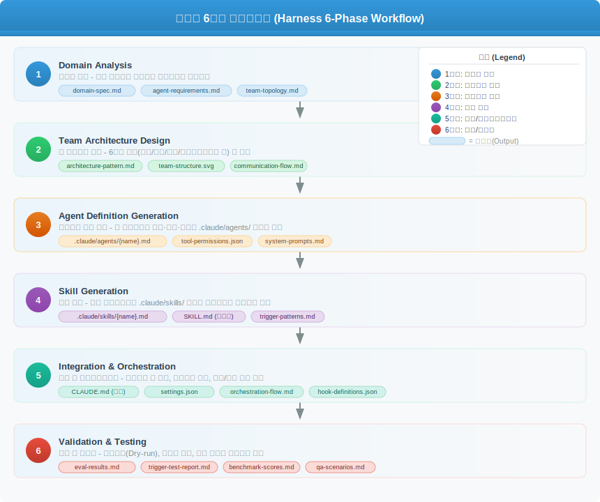
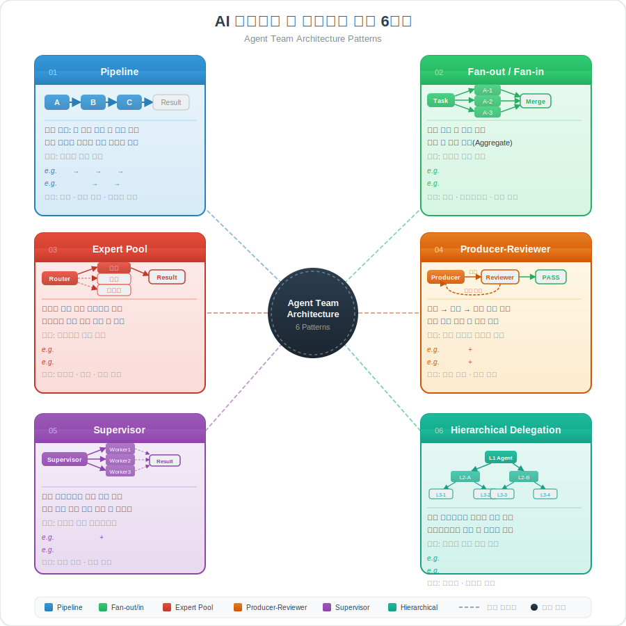
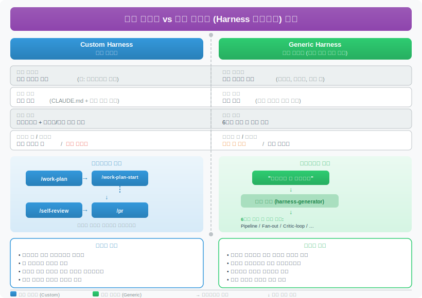

# 에이전트 팀 하네스 (Agent Team Harness)

> `[3] 중급` · 선수 지식: [AI Agent란](./ai-agent.md), [AI 하네스](./harness.md)

> 도메인에 맞는 전문 에이전트 팀을 설계하고, 에이전트가 사용할 스킬까지 자동 생성하는 메타 스킬

`#에이전트팀` `#AgentTeam` `#하네스` `#Harness` `#메타스킬` `#MetaSkill` `#오케스트레이션` `#Orchestration` `#멀티에이전트` `#MultiAgent` `#파이프라인` `#Pipeline` `#팬아웃` `#FanOut` `#팬인` `#FanIn` `#전문가풀` `#ExpertPool` `#감독자` `#Supervisor` `#ProducerReviewer` `#ProgressiveDisclosure` `#DryCrun` `#ClaudeCode` `#AgentTeams` `#SubAgent` `#서브에이전트` `#스킬자동생성` `#아키텍처패턴` `#ArchitecturePattern`

## 왜 알아야 하는가?

- **실무**: AI 에이전트 하나로는 복잡한 작업을 처리하기 어렵다. 여러 에이전트가 협업하는 "팀"을 어떻게 구성하느냐에 따라 작업 품질이 60% 이상 차이날 수 있다
- **면접**: "멀티 에이전트 시스템을 어떻게 설계하나요?"는 AI 시대의 시스템 설계 면접 핵심 질문이다
- **기반 지식**: Claude Code의 스킬, 서브에이전트, Agent Teams 기능을 이해하고 활용하기 위한 필수 개념

## 핵심 개념

- **에이전트 팀 하네스 = 팀을 설계하는 도구**: 개별 에이전트가 아닌, 에이전트들의 역할·협업 방식·순서를 정의하는 상위 프레임워크
- **메타 스킬**: 스킬(지시서)을 만들어주는 스킬. "팀 만들어줘" 한마디로 에이전트 정의 + 스킬 파일을 자동 생성
- **6가지 아키텍처 패턴**: 팀의 협업 방식을 정형화한 설계 청사진
- **수제 vs 범용**: 특정 도메인에 직접 만든 하네스 vs 어떤 도메인이든 팀을 자동 생성하는 범용 하네스

## 쉽게 이해하기

### 레스토랑으로 이해하는 에이전트 팀 하네스

**에이전트 1명 = 만능 요리사 1명**
- 주문 받고, 재료 손질하고, 요리하고, 서빙까지 혼자 한다
- 간단한 메뉴는 빠르지만, 코스 요리는 느리고 실수가 많다

**에이전트 팀 = 전문 주방 팀**
- 수셰프(재료 손질) + 메인 셰프(요리) + 파티시에(디저트) + 서버(서빙)
- 각자 전문 분야만 담당하니 빠르고 품질도 높다

**하네스 = 주방장(Head Chef)**
- "이 코스 요리는 전채 → 메인 → 디저트 순서로 진행"이라고 순서를 정한다
- 누가 어떤 역할을 맡는지, 재료를 어떻게 전달하는지 조율한다
- 문제가 생기면 대체 인력을 투입한다

**메타 스킬 = 프랜차이즈 본사**
- "이탈리안 레스토랑 차려줘"라고 하면 메뉴·레시피·인력 구성을 자동 생성
- "일식집으로 바꿔줘"라고 하면 완전히 새로운 구성을 만들어준다

## 상세 설명

### 에이전트 팀이란?

혼자 일하는 AI 에이전트 대신, **역할이 분리된 여러 에이전트가 협업**하는 구조다.

| 구분 | 단일 에이전트 | 에이전트 팀 |
|------|-------------|-----------|
| **구조** | AI 1개가 모든 것 처리 | 역할별 AI가 분업 |
| **장점** | 단순, 빠른 시작 | 전문성 높음, 품질 향상 |
| **단점** | 복잡한 작업에서 품질 저하 | 설계 비용, 조율 복잡도 |
| **비유** | 1인 가게 | 전문 팀이 있는 회사 |

**왜 팀이 필요한가?**

AI도 사람처럼 "한 번에 너무 많은 것을 하면" 품질이 떨어진다. 컨텍스트 윈도우(AI의 작업 기억 공간)는 유한하기 때문에, 역할을 나누면 각 에이전트가 자기 업무에 집중할 수 있다.

### 메타 스킬 (Meta-Skill)

**스킬**: AI에게 "이렇게 해"라고 적어둔 지시서다. 예를 들어 `/work-plan`은 "요구사항을 분석해서 작업 명세서를 만들어"라는 스킬이다.

**메타 스킬**: 스킬 자체를 만들어주는 스킬이다. "딥리서치 팀 만들어줘"라고 하면:

```
입력: "딥리서치 팀 만들어줘"
      ↓
[메타 스킬 실행]
      ↓
출력:
  .claude/agents/researcher.md      ← 리서치 에이전트 정의
  .claude/agents/validator.md       ← 검증 에이전트 정의
  .claude/agents/reporter.md        ← 보고서 에이전트 정의
  .claude/skills/deep-research/     ← 리서치 스킬
  .claude/skills/cross-validate/    ← 교차 검증 스킬
  .claude/skills/report-compile/    ← 보고서 작성 스킬
```

비유하면, **요리 레시피를 적어주는 것이 스킬**이고, **"이탈리안 레스토랑에 필요한 레시피 전부 만들어줘"가 메타 스킬**이다.

### 오케스트레이션 (Orchestration)

오케스트라 지휘자처럼, **에이전트들이 언제·어떤 순서로·어떤 데이터를 주고받으며 일하는지** 조율하는 것이다.

오케스트레이션이 관리하는 것:

| 항목 | 설명 | 비유 |
|------|------|------|
| **실행 순서** | A가 끝나야 B가 시작 | 재료 손질이 끝나야 요리 시작 |
| **데이터 전달** | A의 결과를 B에게 넘김 | 손질된 재료를 셰프에게 전달 |
| **에러 처리** | A가 실패하면 재시도 또는 대체 | 재료가 떨어지면 대체 재료 사용 |
| **병렬 실행** | 독립적인 A와 B는 동시에 | 전채와 디저트는 동시에 준비 |
| **비용 추적** | 각 에이전트의 토큰 사용량 추적 | 각 부서의 재료 사용량 집계 |

### Progressive Disclosure (점진적 공개)

AI의 컨텍스트 윈도우(작업 기억 공간)는 한정적이다. 모든 정보를 한꺼번에 넣으면 성능이 떨어진다.

Progressive Disclosure는 **필요한 시점에 필요한 정보만 제공**하는 기법이다.

```
❌ 나쁜 예: 스킬 파일에 모든 참조 문서 내용을 통째로 포함
   → 10,000줄짜리 스킬 = 컨텍스트 낭비

✅ 좋은 예: 스킬 파일은 핵심 지시만, 상세 내용은 references/에 분리
   → 스킬 200줄 + 필요할 때 references/ 참조
```

비유: 요리할 때 레시피 전체를 외우지 않는다. 지금 하는 단계의 지시만 보고, 다음 단계로 넘어갈 때 다음 페이지를 펼친다.

### 드라이런 (Dry Run)

실제로 실행하지 않고 **"실행한 척만 해서 결과를 미리 확인"**하는 테스트다.

```
[일반 실행]
"코드 리뷰 팀 만들어줘" → 실제 파일 생성 + 에이전트 실행

[드라이런]
"코드 리뷰 팀 만들어줘 (드라이런)" → 어떤 파일이 생길지 미리보기만
```

비유: 소방 훈련. 실제 불은 안 나지만, 대피 경로가 맞는지 확인한다.



## 6가지 아키텍처 패턴

에이전트 팀이 협업하는 방식을 6가지 패턴으로 정형화한 것이다. 상황에 따라 적합한 패턴이 다르다.



### 1. 파이프라인 (Pipeline)

```
[A] → [B] → [C] → [결과]
```

**비유**: 🏭 공장 조립 라인 — 앞 사람이 끝나야 다음 사람이 시작한다.

| 항목 | 설명 |
|------|------|
| **구조** | 에이전트가 순서대로 실행, 앞 단계 결과가 다음 단계 입력 |
| **적합한 경우** | 단계별 의존성이 강한 작업 |
| **예시** | 요구사항 분석 → 코드 작성 → 테스트 → 리뷰 |
| **장점** | 흐름이 명확, 디버깅 쉬움 |
| **단점** | 병목 발생 시 전체가 느려짐 |

**실전 예시**: `/work-plan` → `/work-plan-start` → `/self-review` → `/pr`

### 2. 팬아웃/팬인 (Fan-out/Fan-in)

```
         ┌→ [A] ─┐
[분배기] ─┼→ [B] ─┼→ [수집기] → [결과]
         └→ [C] ─┘
```

**비유**: 📋 시험지 채점 — 문제를 나눠서 여러 명이 동시에 채점하고, 결과를 합친다.

| 항목 | 설명 |
|------|------|
| **구조** | 하나의 작업을 여러 에이전트에 분산 → 동시 실행 → 결과 통합 |
| **적합한 경우** | 독립적으로 나눌 수 있는 작업 |
| **예시** | 코드 리뷰: 보안 + 성능 + 컨벤션 + 테스트 병렬 검사 |
| **장점** | 빠름 (병렬 처리), 전문성 분리 |
| **단점** | 결과 통합이 복잡할 수 있음 |

**실전 예시**: `/team-review`에서 4명의 리뷰어(보안·성능·컨벤션·테스트)가 동시에 리뷰

### 3. 전문가 풀 (Expert Pool)

```
               ┌→ [내과] (선택됨)
[접수] → [라우터] ┼→ [외과]
               └→ [피부과]
```

**비유**: 🏥 병원 접수 — 증상에 따라 적합한 전문의에게 배정한다.

| 항목 | 설명 |
|------|------|
| **구조** | 라우터가 요청을 분석하고, 가장 적합한 전문 에이전트를 선택 호출 |
| **적합한 경우** | 요청 유형이 다양하고, 각 유형별 전문가가 필요할 때 |
| **예시** | 버그 리포트 → DB 전문가 / 프론트 전문가 / 인프라 전문가 중 선택 |
| **장점** | 효율적 (필요한 에이전트만 호출), 확장 용이 |
| **단점** | 라우터의 판단이 틀리면 잘못된 전문가에게 배정 |

### 4. 생성-검증 (Producer-Reviewer)

```
[생성] → [검증] → 통과? → Yes → [결과]
  ↑        │
  └── No ──┘ (수정 요청)
```

**비유**: ✍️ 원고 교정 — 작가가 글을 쓰고, 편집자가 검수하고, 수정을 반복한다.

| 항목 | 설명 |
|------|------|
| **구조** | 생성 에이전트가 결과물을 만들고, 검증 에이전트가 품질 체크 후 피드백 |
| **적합한 경우** | 품질이 중요한 작업 (코드, 문서, 디자인) |
| **예시** | 코드 작성 → 코드 리뷰 → 수정 → 재리뷰 |
| **장점** | 품질 보장, 자동 개선 루프 |
| **단점** | 반복 횟수에 따라 시간 소요, 무한 루프 위험 |

### 5. 감독자 (Supervisor)

```
         ┌→ [A] (작업 1)
[감독자] ─┼→ [B] (작업 2)  ← 동적 분배
         └→ [A] (추가 작업)
```

**비유**: 👷 건설 현장소장 — 한 명이 전체를 보면서 상황에 따라 작업자에게 동적으로 일을 배분한다.

| 항목 | 설명 |
|------|------|
| **구조** | 중앙 감독 에이전트가 전체 상황을 파악하고 동적으로 작업 배분 |
| **적합한 경우** | 작업 순서가 사전에 정해지지 않고, 상황에 따라 유동적일 때 |
| **예시** | 복잡한 프로젝트 관리: 진행 상황 보고 → 병목 발견 → 인력 재배치 |
| **장점** | 유연함, 동적 최적화 |
| **단점** | 감독자 에이전트의 판단력에 의존, 감독자가 병목이 될 수 있음 |

### 6. 계층적 위임 (Hierarchical Delegation)

```
[대표] → [부서장A] → [팀장] → [담당자]
       → [부서장B] → [팀장] → [담당자]
```

**비유**: 🏢 회사 조직도 — 대표 → 부서장 → 팀장 → 담당자로 일이 내려간다.

| 항목 | 설명 |
|------|------|
| **구조** | 상위 에이전트가 하위 에이전트에게 재귀적으로 위임 |
| **적합한 경우** | 대규모·복합 작업을 체계적으로 분해해야 할 때 |
| **예시** | "웹사이트 만들어줘" → 디자인팀 + 개발팀 + QA팀 → 각 팀 내 세부 분업 |
| **장점** | 대규모 작업 관리 가능, 관심사 분리 |
| **단점** | 계층이 깊어지면 커뮤니케이션 비용 증가 |

### 패턴 선택 가이드

| 상황 | 추천 패턴 | 이유 |
|------|----------|------|
| 단계가 정해진 반복 작업 | 파이프라인 | 순서 명확, 안정적 |
| 독립적 검사를 병렬로 | 팬아웃/팬인 | 속도 극대화 |
| 요청 유형이 다양 | 전문가 풀 | 적재적소 배치 |
| 품질이 최우선 | 생성-검증 | 자동 개선 루프 |
| 상황이 유동적 | 감독자 | 동적 최적화 |
| 대규모 복합 프로젝트 | 계층적 위임 | 체계적 분해 |

## Harness 플러그인의 6단계 워크플로우

Harness 플러그인(`revfactory/harness`)은 아래 6단계로 에이전트 팀을 자동 생성한다.

| 단계 | 이름 | 하는 일 | 산출물 |
|------|------|--------|--------|
| 1 | **도메인 분석** | 어떤 분야인지, 어떤 작업인지 파악 | 도메인 요구사항 정리 |
| 2 | **팀 아키텍처 설계** | 6가지 패턴 중 적합한 구조 선택 | 아키텍처 결정서 |
| 3 | **에이전트 정의 생성** | 각 에이전트의 역할·도구·지시 정의 | `.claude/agents/*.md` |
| 4 | **스킬 생성** | 에이전트가 사용할 스킬 파일 생성 | `.claude/skills/*/SKILL.md` |
| 5 | **통합 및 오케스트레이션** | 에이전트 간 데이터 전달, 에러 처리 규칙 설정 | 오케스트레이터 설정 |
| 6 | **검증 및 테스트** | 트리거 검증, 드라이런 테스트 | 테스트 리포트 |

## 수제 하네스 vs 범용 하네스



### 개념 비교

| 관점 | 수제 하네스 (Custom) | 범용 하네스 (Generic) |
|------|---------------------|---------------------|
| **정의** | 특정 도메인에 직접 만든 워크플로우 | "팀 만들어줘"로 자동 생성되는 워크플로우 |
| **비유** | 이탈리안 레스토랑을 직접 차린 것 | 어떤 레스토랑이든 차려주는 프랜차이즈 본사 |
| **제작 방식** | CLAUDE.md + 스킬 직접 작성 | 메타 스킬이 자동 생성 |
| **도메인** | 1개 도메인 전용 | 모든 도메인 대응 |
| **아키텍처** | 파이프라인 + 팬아웃/팬인 고정 | 6가지 패턴 중 상황별 선택 |
| **도메인 핏** | ★★★★★ 매우 높음 | ★★★☆☆ 보통 |
| **범용성** | ★☆☆☆☆ 낮음 | ★★★★★ 매우 높음 |
| **시작 비용** | 높음 (직접 설계 필요) | 낮음 (한마디로 생성) |
| **유지보수** | 직접 개선 | 재생성 가능 |

### 언제 무엇을 쓸까?

```
[매일 같은 도메인에서 반복 작업?]
        │
        ├─ Yes → 수제 하네스가 유리
        │         (회사 프로젝트, 정해진 기술 스택)
        │
        └─ No → 범용 하네스가 유리
                  (매번 다른 도메인: 리서치, 마케팅, 법률...)
```

**수제 하네스가 빛나는 경우:**
- 회사 프로젝트처럼 도메인이 고정된 환경
- Jira, Confluence, Slack 등 특정 도구와 깊이 연동
- Spring Boot, React 같은 기술 스택이 정해져 있을 때
- 이미 검증된 워크플로우를 반복적으로 사용할 때

**범용 하네스가 빛나는 경우:**
- 오늘은 딥리서치, 내일은 마케팅, 모레는 법률 문서
- 새로운 도메인을 빠르게 시작해야 할 때
- 프로토타이핑이나 실험적 작업

### 실전 사례: 수제 하네스의 구조

아래는 소프트웨어 개발 도메인에 특화된 수제 하네스의 예시다.

```
[워크플로우: 소프트웨어 개발 수제 하네스]

/work-plan          계획 수립 + Track 생성
    ↓
/work-plan-start    구현 실행 (팀 에이전트 병렬 디스패치)
    │
    ├─ [Explore]       코드베이스 탐색 (병렬)
    ├─ [Plan]          구현 전략 설계 (병렬)
    ├─ [Main]          핵심 코드 작성
    ├─ [test-generator] 테스트 자동 생성 (백그라운드)
    └─ [code-refactor]  코드 품질 리뷰 (백그라운드)
    ↓
/test-coverage-check   테스트 커버리지 점검
    ↓
/self-review           코드 자체 리뷰 (4명 전문 리뷰어 병렬)
    │
    ├─ [review-security]     보안 리뷰
    ├─ [review-performance]  성능 리뷰
    ├─ [review-convention]   컨벤션 리뷰
    └─ [review-test-coverage] 테스트 리뷰
    ↓
/qa-scenario           QA 시나리오 생성
    ↓
/browser-debug         브라우저 자동화 QA
    ↓
/pr                    PR 생성
    ↓
/work-log              Confluence 문서화
```

이 구조에는 **파이프라인**(전체 흐름)과 **팬아웃/팬인**(`/self-review`의 4명 병렬 리뷰)이 함께 사용되고 있다. 특정 프로젝트의 기술 스택(Spring Boot, Jira, Confluence)과 깊이 연동되어 있어, 범용 하네스보다 도메인 핏이 높다.

## 트레이드오프

| 장점 | 단점 |
|------|------|
| 에이전트 팀으로 작업 품질 60%+ 향상 | 팀 설계에 시간과 노력 필요 |
| 6가지 패턴으로 체계적 설계 가능 | 패턴 선택을 잘못하면 오히려 비효율 |
| 메타 스킬로 빠른 팀 생성 | 자동 생성된 팀은 도메인 핏이 낮을 수 있음 |
| Progressive Disclosure로 컨텍스트 효율화 | 참조 문서 분리 관리 비용 |
| 드라이런으로 사전 검증 가능 | 드라이런 결과와 실제 실행 결과가 다를 수 있음 |

## 면접 예상 질문

### Q: 멀티 에이전트 시스템의 아키텍처 패턴 중 3가지를 설명해주세요.

A: 대표적으로 **파이프라인**, **팬아웃/팬인**, **생성-검증** 패턴이 있습니다. 파이프라인은 A→B→C 순차 실행으로 단계별 의존성이 강한 작업에 적합합니다. 팬아웃/팬인은 독립적인 작업을 여러 에이전트에 분산하여 병렬 처리한 뒤 결과를 통합하는 방식으로, 코드 리뷰처럼 관점별 독립 검사에 효과적입니다. 생성-검증은 생성 에이전트와 검증 에이전트가 피드백 루프를 돌며 품질을 개선하는 패턴으로, 높은 품질이 요구되는 작업에 사용됩니다.

### Q: "메타 스킬"이란 무엇이고, 일반 스킬과 어떻게 다른가요?

A: 일반 스킬은 특정 작업을 수행하는 지시서입니다(예: "코드 리뷰해줘"). 메타 스킬은 스킬 자체를 생성하는 상위 레벨 스킬입니다. "딥리서치 팀 만들어줘"라고 요청하면, 메타 스킬이 도메인을 분석하고, 필요한 에이전트 정의와 스킬 파일을 자동으로 생성합니다. 즉, 메타 스킬은 "도구를 만드는 도구"입니다.

### Q: 에이전트 팀에서 오케스트레이션이 왜 중요한가요?

A: 에이전트 팀에서 개별 에이전트의 능력보다 **에이전트 간 협업 방식**이 최종 결과 품질을 더 크게 좌우합니다. 오케스트레이션은 실행 순서, 데이터 전달, 에러 처리, 병렬 실행을 관리합니다. 오케스트레이션 없이 에이전트들이 제각각 동작하면 중복 작업, 데이터 불일치, 무한 루프 같은 문제가 발생합니다. 오케스트라에서 지휘자 없이 연주하면 소음이 되는 것과 같습니다.

## 연관 문서

| 문서 | 연관성 | 난이도 |
|------|--------|--------|
| [AI Agent란](./ai-agent.md) | 선수 지식 - 에이전트의 기본 개념 | [1] 정의 |
| [AI 하네스](./harness.md) | 선수 지식 - 하네스의 일반 개념 (제어/안전) | [2] 입문 |
| [멀티 에이전트 시스템](./multi-agent-systems.md) | 관련 개념 - 멀티 에이전트의 이론적 배경 | [3] 중급 |
| [Claude Code Sub Agent](./claude-code-sub-agent.md) | 실전 - Claude Code의 서브에이전트 사용법 | [3] 중급 |
| [Claude Code Agent Team](./claude-code-agent-team.md) | 실전 - Claude Code의 Agent Teams 기능 | [3] 중급 |
| [Claude Code Skill](./claude-code-skill.md) | 관련 개념 - 스킬 작성법 | [2] 입문 |

## 참고 자료

- [revfactory/harness - GitHub](https://github.com/revfactory/harness) — Harness 플러그인 원본
- [GeekNews - Harness 소개](https://news.hada.io/topic?id=27969) — 한국어 소개 글
- [Anthropic - Agent Teams Documentation](https://docs.anthropic.com/en/docs/claude-code) — Claude Code 공식 문서
- [Harness-100](https://github.com/revfactory/harness-100) — 10개 도메인 100개 에이전트 팀 컬렉션
