# AI Agent란

> `[1] 정의` · 선수 지식: 없음

> `Trend` 2025

> 복잡한 목표를 달성하기 위해 자율적으로 계획하고, 실행하고, 적응하는 인공지능 시스템

`#AI에이전트` `#AIAgent` `#Agentic` `#AgenticAI` `#자율AI` `#LLM` `#대규모언어모델` `#Claude` `#GPT` `#Gemini` `#ChatGPT` `#Anthropic` `#OpenAI` `#Google` `#ToolUse` `#FunctionCalling` `#ReAct` `#CoT` `#ChainOfThought` `#프롬프트엔지니어링` `#RAG` `#벡터DB` `#임베딩` `#AutoGPT` `#LangChain` `#CrewAI` `#멀티에이전트` `#목표지향` `#자율성` `#계획수립`

## 왜 알아야 하는가?

- **실무**: 2025년 Gartner 예측에 따르면, 2026년까지 40%의 엔터프라이즈 애플리케이션에 AI Agent가 통합될 예정
- **면접**: "AI Agent와 일반 LLM의 차이점", "Agentic AI 아키텍처" 등 최신 트렌드 질문 증가
- **기반 지식**: MCP, Tool Use, Prompt Engineering 등 모든 AI 에이전트 기술의 근간

## 핵심 개념

- **자율성(Autonomy)**: 사람의 개입 없이 스스로 판단하고 행동
- **목표 지향성(Goal-oriented)**: 복잡한 목표를 하위 작업으로 분해하여 달성
- **적응성(Adaptability)**: 환경 변화에 실시간으로 대응하고 학습

## 쉽게 이해하기

**AI Agent = 똑똑한 개인 비서**

일반 LLM이 "질문에 답하는 검색 엔진"이라면, AI Agent는 "업무를 대신 처리하는 비서"입니다.

| 상황 | 일반 LLM | AI Agent |
|------|----------|----------|
| "회의 잡아줘" | "캘린더에 회의를 추가하려면..." (방법 설명) | 참석자 일정 확인 → 시간 조율 → 회의실 예약 → 초대장 발송 (직접 실행) |
| "버그 수정해줘" | "이 코드에서 문제점은..." (분석만) | 코드 분석 → 수정 → 테스트 → PR 생성 (완료까지 진행) |

## 상세 설명

### 전통적 Agent vs 현대적 AI Agent

**전통적 Agent (규칙 기반)**
- 사전 정의된 환경에서만 동작
- 센서로 인식 → 규칙에 따라 행동
- 예: 룸바 청소기, 게임 NPC

**현대적 AI Agent (LLM 기반)**
- 유동적이고 인간 중심적인 환경에서 동작
- 추론, 계획, 도구 사용, 다른 Agent와 협업
- 예: Claude Code, GitHub Copilot, AutoGPT

### 핵심 구성 요소



| 구성 요소 | 역할 | 예시 |
|-----------|------|------|
| **Perception** | 환경 인식, 입력 해석 | 텍스트/이미지/음성 이해 |
| **Planning** | 목표 분해, 실행 계획 수립 | 복잡한 작업을 단계별로 나누기 |
| **Memory** | 컨텍스트 유지, 학습 결과 저장 | 대화 기록, 사용자 선호도 |
| **Action** | 계획 실행, 결과 반환 | API 호출, 파일 수정 |
| **Tools** | 외부 시스템 연동 | 웹 검색, 코드 실행, DB 접근 |

### 아키텍처 유형

#### 1. Single Agent (단일 에이전트)


- 하나의 에이전트가 모든 작업 처리
- 설계/테스트/유지보수가 단순
- 적합: 단순한 작업, 프로토타이핑

#### 2. Vertical (수직/계층형)



- 오케스트레이터가 하위 에이전트 조율
- 순차적 실행, 명확한 책임 분리
- 적합: 복잡한 워크플로우, 엔터프라이즈 시스템

#### 3. Horizontal (수평/협업형)


- 에이전트 간 직접 협업 (P2P 통신)
- 분산 처리, 높은 확장성
- 적합: 분산 시스템, 실시간 협업

## 동작 원리

### Observe-Think-Act 루프



1. **Observe**: 사용자 요청 또는 환경 상태 인식
2. **Think**: LLM으로 상황 분석, 다음 행동 결정
3. **Act**: 도구 실행 또는 응답 생성
4. **Loop**: 목표 달성까지 반복

## 예제 코드

### Claude Code의 Agent 동작 예시

```bash
# 사용자 요청
$ claude "이 프로젝트에 테스트 코드 추가해줘"

# Agent 내부 동작:
# 1. Observe: 프로젝트 구조 분석
# 2. Think: 어떤 테스트 프레임워크? 어떤 파일?
# 3. Act: 파일 읽기 → 테스트 작성 → 실행 → 수정

# 실제 실행되는 도구들:
# - Glob: 파일 탐색
# - Read: 코드 분석
# - Write: 테스트 작성
# - Bash: 테스트 실행
```

### LangChain Agent 예시 (Python)

```python
from langchain.agents import create_react_agent
from langchain_openai import ChatOpenAI
from langchain.tools import Tool

# 도구 정의
tools = [
    Tool(name="Search", func=search_web, description="웹 검색"),
    Tool(name="Calculator", func=calculate, description="수학 계산"),
]

# Agent 생성
agent = create_react_agent(
    llm=ChatOpenAI(model="gpt-4"),
    tools=tools,
    prompt=react_prompt
)

# 실행
result = agent.invoke({"input": "2024년 대한민국 GDP를 달러로 환산해줘"})
# Agent가 자동으로:
# 1. 검색 도구로 GDP 조회
# 2. 계산 도구로 환산
# 3. 결과 반환
```

## 트레이드오프

| 장점 | 단점 |
|------|------|
| 복잡한 작업 자동화 | 예측 불가능한 동작 가능성 |
| 인간 개입 최소화 | 디버깅 어려움 |
| 멀티스텝 추론 가능 | 높은 컴퓨팅 비용 |
| 도구 활용으로 능력 확장 | 보안/권한 관리 복잡성 |

## 트러블슈팅

### 사례 1: Agent 무한 루프

#### 증상
Agent가 같은 도구를 반복 호출하며 종료되지 않음

#### 원인 분석
- 목표 달성 조건이 불명확
- 도구 실행 결과 해석 실패
- 컨텍스트 윈도우 초과로 이전 시도 망각

#### 해결 방법
```python
# 최대 반복 횟수 제한
agent = create_agent(
    max_iterations=10,  # 최대 10회 반복
    early_stopping_method="generate"  # 조기 종료 조건
)
```

#### 예방 조치
- 명확한 종료 조건 정의
- 도구 실행 결과 로깅
- 타임아웃 설정

### 사례 2: 잘못된 도구 선택

#### 증상
Agent가 작업에 부적합한 도구를 선택

#### 원인 분석
- 도구 설명(description)이 모호함
- 비슷한 기능의 도구가 다수 존재

#### 해결 방법
```python
# 도구 설명을 명확하게 작성
Tool(
    name="SearchDocumentation",
    description="""
    공식 문서에서 API 사용법을 검색합니다.
    사용 시점: 특정 라이브러리나 프레임워크의 사용법을 알고 싶을 때
    사용하지 말 것: 일반적인 웹 검색이 필요할 때
    """
)
```

## 면접 예상 질문

### Q: AI Agent와 일반 LLM(ChatGPT)의 차이점은?

A: 일반 LLM은 "단일 턴 응답"에 최적화되어 있습니다. 질문에 답변하고 끝입니다. 반면 AI Agent는 "다중 턴 실행"이 가능합니다.

핵심 차이:
1. **도구 사용**: Agent는 외부 API, 파일 시스템 등을 직접 조작
2. **자율적 계획**: 복잡한 목표를 스스로 하위 작업으로 분해
3. **반복 실행**: 결과를 확인하고 필요시 재시도
4. **상태 유지**: 메모리를 통해 장기적 컨텍스트 관리

### Q: Agentic AI 아키텍처를 설계할 때 고려해야 할 점은?

A: 세 가지 핵심 고려사항이 있습니다:

1. **안전성**: Agent가 의도치 않은 행동을 하지 않도록 권한 제한, 샌드박싱 필요
2. **관찰 가능성**: Agent의 의사결정 과정을 추적할 수 있어야 디버깅 가능
3. **실패 복구**: 도구 실행 실패 시 graceful degradation 전략 필요

### Q: Single Agent vs Multi Agent 시스템은 언제 사용하나요?

A: 작업의 복잡도와 요구사항에 따라 선택합니다:

**Single Agent 선택 기준**:
- 작업이 단순하고 선형적
- 빠른 프로토타이핑이 필요
- 디버깅 용이성이 중요

**Multi Agent 선택 기준**:
- 전문화된 역할 분리가 필요 (코드 작성 Agent + 리뷰 Agent)
- 병렬 처리로 성능 향상 필요
- 복잡한 워크플로우 조율 필요

## 연관 문서

| 문서 | 연관성 | 난이도 |
|------|--------|--------|
| [MCP](./mcp.md) | AI Agent의 도구 연결 표준 | [2] 입문 |
| [Claude Code Skill](./claude-code-skill.md) | Agent 기능 모듈화 | [3] 중급 |
| [Claude Code Hook](./claude-code-hook.md) | Agent 생명주기 이벤트 | [3] 중급 |
| [Claude Code Sub Agent](./claude-code-sub-agent.md) | 작업 위임 및 병렬 실행 | [4] 심화 |

## 참고 자료

- [What is Agentic AI? - Aisera](https://aisera.com/blog/agentic-ai/)
- [AI Agent Architecture - orq.ai](https://orq.ai/blog/ai-agent-architecture)
- [Agentic AI Architecture - Exabeam](https://www.exabeam.com/explainers/agentic-ai/agentic-ai-architecture-types-components-best-practices/)
- [Building the Foundation for Agentic AI - Bain & Company](https://www.bain.com/insights/building-the-foundation-for-agentic-ai-technology-report-2025/)
