# AI 보조 개발 (AI-Assisted Development)

> `[2] 입문` · 선수 지식: [LLM](./llm.md)

> `Trend` 2026

> AI 도구를 활용하여 코드 생성, 테스트, 디버깅, 리뷰 등 소프트웨어 개발 전 과정의 생산성을 높이는 개발 방법론

`#AI보조개발` `#AIAssistedDevelopment` `#AI코딩` `#AICoding` `#코딩어시스턴트` `#CodingAssistant` `#GitHubCopilot` `#Copilot` `#Cursor` `#Windsurf` `#ClaudeCode` `#ChatGPT` `#GeminiCLI` `#AmazonQ` `#AIAgent` `#코드생성` `#CodeGeneration` `#AI페어프로그래밍` `#AIPairProgramming` `#생산성` `#Productivity` `#코드품질` `#CodeQuality` `#기술부채` `#TechnicalDebt` `#AI생산성역설` `#SpecDriven` `#VibeCoding` `#LLM` `#개발자경험`

## 왜 알아야 하는가?

- **실무**: 2025년 기준 85%의 개발자가 AI 코딩 도구를 사용하며, 전체 코드의 41%가 AI의 생성 또는 보조로 작성됨. 도구를 효과적으로 활용하는 능력이 핵심 역량으로 부상
- **면접**: "AI 코딩 도구의 장단점", "AI 생성 코드의 품질 관리", "AI 시대의 개발자 역할" 등 질문 빈출
- **기반 지식**: [Vibe Coding](./vibe-coding.md), [Context Engineering](./context-engineering.md), [Multi-Agent Systems](./multi-agent-systems.md) 등 AI 개발 생태계 이해의 기초

## 핵심 개념

- **AI 코딩 어시스턴트**: LLM 기반으로 코드 자동 완성, 생성, 설명, 리팩토링을 지원하는 도구
- **AI 생산성 역설 (AI Productivity Paradox)**: AI 도구가 코드 작성 속도는 높이지만, 코드 소유·유지 비용은 오히려 증가하는 현상
- **Spec-Driven Development**: 자연어 명세만으로 AI 에이전트가 자율적으로 코드를 생성하는 차세대 개발 방식

## 쉽게 이해하기

**요리와 요리 보조의 비유**

기존 개발은 모든 재료를 직접 손질하고, 레시피를 외워서 처음부터 요리하는 것과 같습니다.

AI 보조 개발은 숙련된 보조 셰프가 옆에 있는 것과 같습니다. "양파 다져줘"라고 하면 즉시 해주고, "이 소스에 뭐 넣으면 좋을까?"라고 물으면 제안해줍니다. 하지만 최종 간을 보고 요리의 완성도를 판단하는 것은 여전히 **메인 셰프(개발자)**의 몫입니다.

보조 셰프가 아무리 빨라도, 검수 없이 그대로 내보내면 손님(사용자)에게 문제가 생깁니다. **속도와 품질 사이의 균형**이 핵심입니다.

## 상세 설명

### AI 코딩 도구의 진화


| 세대 | 시기 | 대표 도구 | 특징 |
|------|------|----------|------|
| **1세대** | 2021~ | GitHub Copilot | 코드 라인/블록 단위 자동 완성, 수동 수락 |
| **2세대** | 2023~ | ChatGPT, Cursor, Windsurf | 대화형 코딩, IDE 통합, 컨텍스트 이해 |
| **3세대** | 2025~ | Claude Code, Gemini CLI | 자율적 코드 생성/수정, 터미널 기반 에이전트 |
| **4세대** | 2026~ | AI Agent 기반 IDE | 명세 기반 자율 개발, 멀티 에이전트 협업 |

**왜 이렇게 진화했는가?**

1세대는 단순 패턴 매칭에 가까웠지만, LLM의 발전으로 코드의 의미와 맥락을 이해하게 되었습니다. 2세대에서 대화형 인터페이스가 도입되었고, 3세대에서는 파일 시스템 접근, 명령어 실행 등 에이전트 능력을 갖추면서 자율성이 크게 높아졌습니다.

### 주요 AI 코딩 도구 비교

| 도구 | 유형 | 특징 | 사용률 |
|------|------|------|--------|
| **ChatGPT** | 대화형 | 범용 AI, 코드 설명/생성 | 82% |
| **GitHub Copilot** | IDE 플러그인 | 실시간 자동 완성, 1500만+ 사용자 | 68% |
| **Cursor** | AI IDE | 코드베이스 전체 컨텍스트 이해 | 급성장 |
| **Claude Code** | 터미널 에이전트 | 자율적 코드 수정, 파일 시스템 접근 | 급성장 |
| **Amazon Q** | IDE 플러그인 | AWS 통합, 엔터프라이즈 보안 | 성장 중 |

### 개발 워크플로우의 변화



AI 보조 개발은 소프트웨어 개발의 **모든 단계**에 영향을 미칩니다.

| 개발 단계 | AI 활용 방식 | 시간 절감 |
|----------|-------------|----------|
| 설계 | 아키텍처 제안, 기술 스택 비교 | 보통 |
| 코드 작성 | 자동 완성, 보일러플레이트 생성 | **30~60%** |
| 테스트 | 테스트 코드 자동 생성, 테스트 케이스 제안 | **40~50%** |
| 디버깅 | 에러 분석, 수정 방안 제시 | **20~30%** |
| 코드 리뷰 | 자동 리뷰, 보안 취약점 탐지 | 보통 |
| 문서화 | API 문서, 주석 자동 생성 | **50~70%** |

### AI 생산성 역설 (AI Productivity Paradox)


AI 코딩 도구의 효과에 대한 연구 결과는 **놀라울 만큼 상반**됩니다.

**긍정적 연구 결과:**
- GitHub 연구: HTTP 서버 구현 태스크 **55.8% 더 빠르게** 완료
- Microsoft/Accenture: 평균 **26% 생산성** 향상
- 반복 작업(보일러플레이트, 테스트 생성) **30~60% 시간 절감**

**부정적 연구 결과:**
- METR 연구 (2025): 숙련 개발자가 자신의 리포지토리에서 AI 사용 시 **19% 더 느려짐**
- Faros AI: 75% 조직이 AI 도구 사용에도 **측정 가능한 성과 향상 없음**
- 개발자는 20% 빨라졌다고 **느끼지만**, 실제 측정은 19% 느려짐

**왜 이런 역설이 발생하는가?**

```
코드 작성 비용 ↓  →  코드량 증가  →  리뷰 비용 ↑
                                    →  유지보수 비용 ↑
                                    →  보안 검증 비용 ↑
                                    →  기술 부채 누적 ↑
```

핵심 문제는 **2차 효과(Second-Order Effects)**입니다:

1. **PR 크기 증가**: AI가 코드를 빠르게 생성하면서 PR 규모가 커짐
2. **코드 리뷰 비용 증가**: 더 많은 코드를 검증해야 함
3. **시니어 검증 부담**: AI 출력의 아키텍처 적합성, 보안성을 시니어가 확인
4. **코드 클론 4배 증가**: AI 생성 패턴을 커스터마이징 없이 복사

> "AI는 코드를 **작성하는 것**은 저렴하게 만들었지만, 코드를 **소유하는 것**은 더 비싸게 만들었다."

### 코드 품질과 보안

AI 생성 코드의 품질 이슈는 심각한 수준입니다.

| 지표 | 수치 | 의미 |
|------|------|------|
| 보안 취약점 포함률 | **48%** | AI 생성 코드의 약 절반이 잠재적 보안 문제 포함 |
| 코드 클론 증가 | **4배** | 중복 코드가 급격히 늘어남 |
| Python 보안 취약점 | **29.1%** | Copilot 생성 Python 코드의 약 1/3 |
| 과도 의존 시 버그 증가 | **41%** | AI에 지나치게 의존한 프로젝트 |
| 시스템 안정성 저하 | **7.2%** | 과의존 프로젝트의 안정성 하락 |

**왜 이런 문제가 발생하는가?**

AI는 **통계적으로 가장 가능성 높은 다음 토큰**을 예측합니다. "올바른 코드"가 아닌 "가장 흔한 코드"를 생성하는 경향이 있어, 보안 모범 사례보다 일반적 패턴을 따르는 경우가 많습니다.

### 개발자 신뢰도 변화

```
2023년: 70%+ 긍정적  "혁명이다!"
2024년: 65% 긍정적   "유용하지만..."
2025년: 60% 긍정적   "장단점이 있다"

신뢰도:
- 신뢰함: 33%
- 신뢰하지 않음: 46%
- 높은 신뢰: 단 3%
```

시간이 지나면서 초기의 과대평가(Hype)가 걷히고, **현실적인 평가**로 수렴하고 있습니다.

### 효과적인 AI 보조 개발 전략

**1. 적합한 태스크에 활용**

| AI 효과 높음 | AI 효과 낮음 |
|-------------|-------------|
| 보일러플레이트 코드 생성 | 복잡한 비즈니스 로직 설계 |
| 단위 테스트 코드 작성 | 분산 시스템 아키텍처 설계 |
| 문서/주석 생성 | 성능 크리티컬 최적화 |
| 간단한 유틸리티 함수 | 보안 민감 코드 |
| 코드 변환/마이그레이션 | 레거시 시스템 리팩토링 |

**2. 검증 프로세스 필수**

```java
// AI가 생성한 코드를 그대로 사용하지 않는다
// 반드시 다음을 확인:
// 1. 코드가 의도한 동작을 하는가? (기능 검증)
// 2. 보안 취약점이 없는가? (보안 검증)
// 3. 기존 아키텍처와 일관성이 있는가? (아키텍처 검증)
// 4. 불필요한 코드나 중복이 없는가? (품질 검증)
// 5. 테스트가 충분한가? (테스트 커버리지)
```

**3. 컨텍스트 제공이 핵심**

AI 도구의 출력 품질은 **입력 컨텍스트**에 비례합니다. [Context Engineering](./context-engineering.md)을 통해 AI에게 적절한 맥락을 제공하면 생성 품질이 크게 향상됩니다.

```
나쁜 예: "로그인 기능 만들어줘"
좋은 예: "Spring Security + JWT 기반 로그인 API 구현.
         - POST /api/auth/login
         - RequestDTO: email, password
         - ResponseDTO: accessToken, refreshToken
         - 비밀번호는 BCrypt로 검증
         - 기존 UserRepository 활용"
```

### 주니어 개발자에 대한 영향

하버드 연구(2025)에 따르면, 기업이 생성형 AI를 도입하면 **6분기 내 주니어 개발자 고용이 9~10% 감소**하는 반면, 시니어 고용은 거의 영향 없습니다.

**왜 그런가?**

- AI가 주니어 수준의 작업(보일러플레이트, 간단한 CRUD)을 대체
- 시니어의 **설계 능력, 판단력, 아키텍처 경험**은 대체 불가
- 주니어 → 시니어 성장 경로가 흔들리면서 **경력 개발 경로 재정립** 필요

## 트레이드오프

| 장점 | 단점 |
|------|------|
| 반복 작업 30~60% 시간 절감 | 코드 클론 4배 증가, 기술 부채 누적 |
| 신규 언어/프레임워크 학습 곡선 단축 | AI 생성 코드 48%에 보안 취약점 |
| 문서화, 테스트 작성 부담 감소 | 검증 없는 AI 의존 시 품질 저하 |
| 개발자 경험(DX) 향상 | 주니어 개발자 고용/성장 경로 위축 |
| 1인 개발자의 생산 범위 확대 | 시니어의 코드 리뷰/검증 부담 증가 |

## 트러블슈팅

### 사례 1: AI 생성 코드의 보안 취약점

#### 증상
- AI가 생성한 SQL 쿼리에 파라미터 바인딩 없이 문자열 연결 사용
- 코드 리뷰에서 발견되지 않고 프로덕션 배포

#### 원인 분석
- AI는 "가장 흔한 패턴"을 생성하며, 보안 모범 사례를 항상 따르지 않음
- 개발자가 AI 생성 코드를 충분히 검증하지 않음 (높은 perceived correctness)

#### 해결 방법
```java
// 나쁜 예: AI가 생성한 취약 코드
String query = "SELECT * FROM users WHERE email = '" + email + "'";

// 좋은 예: 파라미터 바인딩 사용
@Query("SELECT u FROM User u WHERE u.email = :email")
Optional<User> findByEmail(@Param("email") String email);
```

#### 예방 조치
- CI/CD에 SAST(Static Application Security Testing) 도구 통합
- AI 생성 코드 전용 보안 리뷰 체크리스트 적용
- SonarQube, Snyk 등 자동 보안 스캔 적용

### 사례 2: AI 과의존으로 인한 기술 부채 누적

#### 증상
- 코드베이스에 비슷한 패턴의 중복 코드가 급증
- 리팩토링 시 같은 수정을 수십 곳에 반복

#### 원인 분석
- AI 생성 패턴을 컨텍스트에 맞게 커스터마이징하지 않고 복사
- 기존 유틸리티/공통 모듈 활용 대신 매번 새로 생성

#### 해결 방법
```
1. AI 도구에 기존 코드베이스 컨텍스트를 충분히 제공
2. 생성된 코드가 기존 추상화를 활용하는지 확인
3. 정기적인 코드 중복 분석 수행 (CPD, jscpd 등)
```

#### 예방 조치
- 팀 코딩 가이드라인에 AI 생성 코드 검증 기준 명시
- 주간 코드 품질 메트릭 모니터링 (중복률, 복잡도)
- AI 도구 설정에 프로젝트별 규칙 파일(CLAUDE.md 등) 활용

## 면접 예상 질문

### Q: AI 코딩 도구의 장단점은 무엇인가요?

A: **장점**은 반복적인 보일러플레이트 코드 작성, 테스트 생성, 문서화 등에서 30~60% 시간을 절감할 수 있다는 점입니다. 새로운 프레임워크 학습 시 예제 코드를 빠르게 생성하는 데도 유용합니다.

**단점**은 AI 생산성 역설입니다. 코드 작성은 빨라지지만, 생성된 코드의 48%에 보안 취약점이 포함될 수 있고, 코드 클론이 4배 증가하는 등 코드 소유 비용이 증가합니다. METR 연구에 따르면 숙련 개발자가 자신의 리포지토리에서 AI를 사용할 때 오히려 19% 느려지기도 했습니다.

따라서 AI 도구는 **적합한 태스크에 선별적으로 활용**하고, 생성된 코드에 대해 **반드시 검증 프로세스**를 거쳐야 합니다.

### Q: AI 시대에 개발자의 역할은 어떻게 변하나요?

A: AI가 코드 **작성**을 대체하면서, 개발자의 핵심 역할은 코드 **작성자**에서 코드 **감독자(Supervisor)**로 변화하고 있습니다.

구체적으로:
1. **설계 능력**: 무엇을 만들지, 어떤 아키텍처를 사용할지 결정
2. **검증 능력**: AI 생성 코드의 정확성, 보안성, 아키텍처 적합성 판단
3. **컨텍스트 제공**: AI에게 적절한 맥락과 제약 조건을 제공하는 Context Engineering 능력
4. **문제 정의**: 기술적 문제를 명확히 정의하고 분해하는 능력

AI가 코드를 작성하는 시대에도, **시스템 전체를 이해하고 올바른 판단을 내리는 능력**은 대체되지 않습니다.

### Q: AI 생성 코드의 품질을 어떻게 관리해야 하나요?

A: 3단계 검증 체계를 권장합니다:

1. **자동 검증**: CI/CD에 SAST, 린터, 테스트 커버리지 게이트를 통합하여 기본적인 품질/보안 이슈를 자동으로 차단
2. **AI 검증**: AI 코드 리뷰 도구로 1차 리뷰를 수행하여 명백한 문제를 걸러냄
3. **인간 검증**: 아키텍처 적합성, 비즈니스 로직 정확성, 엣지 케이스는 반드시 인간 리뷰어가 확인

특히 AI 생성 코드는 **"높은 인지된 정확성(Perceived Correctness)"** 함정이 있어, 코드가 올바르게 보이지만 실제로는 미묘한 결함이 있을 수 있으므로 주의해야 합니다.

## 연관 문서

| 문서 | 연관성 | 난이도 |
|------|--------|--------|
| [LLM](./llm.md) | 선수 지식 - AI 코딩 도구의 기반 기술 | 정의/기초 |
| [Vibe Coding](./vibe-coding.md) | 관련 개념 - AI와의 협업 코딩 패러다임 | 입문 |
| [Context Engineering](./context-engineering.md) | 관련 개념 - AI 도구의 품질을 높이는 핵심 전략 | 중급 |
| [Prompt Engineering](./prompt-engineering.md) | 관련 기술 - AI와의 효과적 소통 | 입문 |
| [Tool Use](./tool-use.md) | 관련 개념 - AI 에이전트의 도구 사용 능력 | 입문 |
| [Multi-Agent Systems](./multi-agent-systems.md) | 심화 학습 - 멀티 에이전트 협업 개발 | 중급 |
| [AI Guardrails](./ai-guardrails.md) | 관련 개념 - AI 생성 코드의 안전 장치 | 중급 |

## 참고 자료

- [Stack Overflow Developer Survey 2025 - AI Section](https://survey.stackoverflow.co/2025/ai)
- [JetBrains State of Developer Ecosystem 2025](https://blog.jetbrains.com/research/2025/10/state-of-developer-ecosystem-2025/)
- [METR - Measuring Impact of AI on Developer Productivity (2025)](https://metr.org/blog/2025-07-10-early-2025-ai-experienced-os-dev-study/)
- [GitClear - AI Copilot Code Quality 2025 Research](https://www.gitclear.com/ai_assistant_code_quality_2025_research)
- [Faros AI - The AI Productivity Paradox Research Report](https://www.faros.ai/blog/ai-software-engineering)
- [MIT Technology Review - AI Coding Is Now Everywhere](https://www.technologyreview.com/2025/12/15/1128352/rise-of-ai-coding-developers-2026/)
