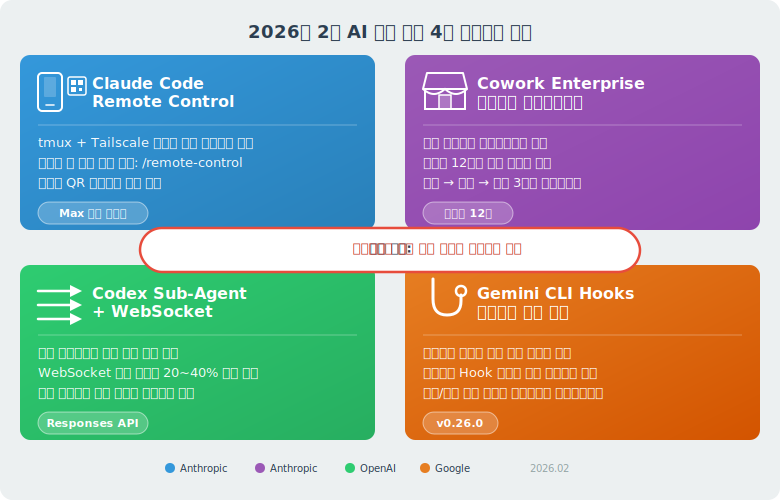
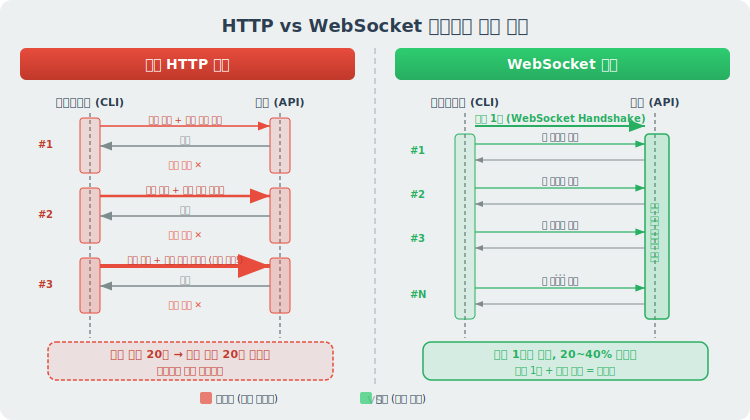
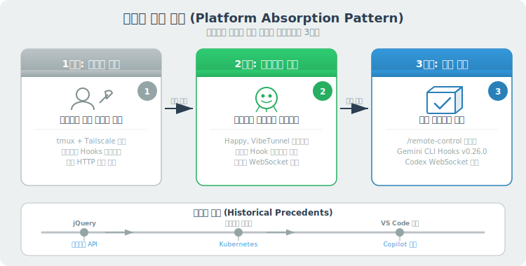

# AI 코딩 에이전트 워크플로우 흡수

> `[3] 중급` · 선수 지식: [AI Agent란](./ai-agent.md), [Claude Code Hook](./claude-code-hook.md), [MCP](./mcp.md)

> `Trend` 2026

> 커뮤니티가 먼저 만든 개발 워크플로우를 벤더가 공식 제품으로 흡수하는 현상으로, 2026년 AI 코딩 에이전트 경쟁의 핵심 축이 모델 성능에서 워크플로우 흡수 속도로 이동하고 있다

`#워크플로우흡수` `#WorkflowAbsorption` `#PlatformAbsorption` `#플랫폼흡수` `#AI코딩에이전트` `#CodingAgent` `#ClaudeCode` `#Codex` `#GeminiCLI` `#RemoteControl` `#원격제어` `#Cowork` `#코워크` `#SubAgent` `#서브에이전트` `#WebSocket` `#웹소켓` `#ResponsesAPI` `#Hooks` `#훅` `#tmux` `#Tailscale` `#플러그인마켓` `#PluginMarketplace` `#Anthropic` `#OpenAI` `#Google` `#기능수렴` `#FeatureConvergence` `#오픈소스흡수` `#개발자도구경쟁`

## 왜 알아야 하는가?

- **실무**: 사용 중인 AI 코딩 도구의 신규 기능을 이해하고 즉시 워크플로우에 반영해야 생산성 격차가 벌어지지 않음
- **면접**: "AI 도구 시장 동향과 기술 선택 기준"에 대한 관점을 보여줄 수 있음
- **기반 지식**: 플랫폼 흡수 패턴은 소프트웨어 역사에서 반복되는 구조적 현상이며, 도구 선택과 오픈소스 기여 전략에 직접 영향

## 핵심 개념

- **워크플로우 흡수(Workflow Absorption)**: 사용자가 외부 도구·스크립트로 이미 하고 있던 행동을 벤더가 관찰하여 공식 기능으로 내장하는 현상
- **기능 수렴(Feature Convergence)**: 경쟁 제품들이 서로 다른 출발점에서 동일한 기능 세트로 수렴하는 현상
- **프롬프트 vs 설정 신뢰도 격차**: 프롬프트 지시(LLM이 무시 가능)와 설정 파일 강제(셸 명령 실행 보장) 사이의 본질적인 신뢰도 차이

## 쉽게 이해하기

**대형마트 PB(자체 브랜드) 상품 비유**

| 단계 | 식품 산업 | AI 코딩 에이전트 |
|------|----------|-----------------|
| 1. 수요 발견 | 소비자가 수입 올리브유를 많이 구매 | 개발자가 tmux+Tailscale로 원격 세션 유지 |
| 2. 커뮤니티 해결 | 소규모 수입업자들이 시장 형성 | Happy, VibeTunnel 등 오픈소스 등장 |
| 3. 벤더 흡수 | 대형마트가 PB 올리브유 출시 | Anthropic이 `/remote-control` 공식 기능 출시 |
| 4. 원본 위축 | 수입업자 매출 감소 | 오픈소스 프로젝트 사용자 이탈 |

핵심은 **벤더가 기술을 발명하는 게 아니라 사용자 행동을 관찰하고 제품화하는 것**입니다.

## 2026년 2월 동시 업데이트 분석

2026년 2월, Anthropic·OpenAI·Google 세 회사가 거의 동시에 코딩 에이전트를 업데이트했습니다. 방향이 묘하게 겹치면서 명확한 패턴이 드러났습니다.

### 1. Claude Code Remote Control

**흡수한 커뮤니티 패턴**: tmux + Tailscale 원격 세션 조합

개발자가 외출 중에도 코딩 세션을 유지하려면 tmux로 세션을 띄우고 Tailscale로 VPN을 잡아야 했습니다. 이 과정이 번거로워 Happy, VibeTunnel 같은 오픈소스가 등장했고, Anthropic은 이 패턴을 그대로 공식 기능으로 만들었습니다.

| 항목 | 커뮤니티 방식 | 공식 기능 |
|------|-------------|----------|
| 설정 | tmux + Tailscale + SSH 설정 | `/remote-control` 한 줄 |
| 연결 | IP 주소 + 포트 + 인증키 | QR 코드 스캔 |
| 세션 유지 | tmux detach/attach | 노트북 잠들어도 자동 재연결 |
| MCP 서버 | 별도 포워딩 필요 | 로컬 파일시스템·MCP 그대로 유지 |
| 대상 | Max 플랜 리서치 프리뷰 | |

**왜 이렇게 하는가?**

원격 세션은 "에이전트에게 장시간 작업을 맡기고 모바일로 모니터링"하는 Agentic Coding의 핵심 워크플로우입니다. 이 마찰을 제거하면 에이전트 사용 시간이 늘어나고 플랫폼 Lock-in이 강화됩니다.

### 2. Cowork 엔터프라이즈 확장

**흡수한 커뮤니티 패턴**: 사내 AI 도구 자체 구축

1월 리서치 프리뷰 이후 "그래서 뭘 할 수 있는데?"라는 반응이 많았습니다. 이번 업데이트의 핵심은 **관리자가 사내 전용 플러그인 마켓을 만들고 팀별로 배포**할 수 있게 된 것입니다.

| 항목 | 세부 내용 |
|------|----------|
| 직군별 템플릿 | HR, IB 등 10종 추가 |
| 앱 간 연동 | Excel 분석 → PowerPoint 프리뷰 |
| 신규 커넥터 | Docusign, FactSet 포함 12개 |
| 입력 방식 | 슬래시 커맨드에 구조화된 입력 폼 |
| 모니터링 | OpenTelemetry 기반 사용량 추적 |
| 플러그인 포맷 | Claude Agent SDK와 동일 |

**왜 이렇게 하는가?**

엔터프라이즈 시장에서 승부처는 "누구나 쓸 수 있는 AI"가 아니라 **"우리 팀만의 AI 워크플로우를 만들 수 있는 플랫폼"**입니다. 플러그인 생태계가 성장할수록 전환 비용(Switching Cost)이 높아집니다.

### 3. Codex Sub-Agent + Responses API WebSocket

두 가지를 나눠서 봐야 합니다.

#### Codex Sub-Agent

**흡수한 커뮤니티 패턴**: 멀티 에이전트 파이프라인

Codex에 서브에이전트 기능이 공식 추가되었습니다. 복잡한 작업을 병렬로 쪼개서 여러 에이전트가 동시에 처리하고 결과를 모아주는 구조입니다.

- `/experimental`에서 활성화
- Claude Code의 Agent Team과 유사한 병렬 처리 모델

#### Responses API WebSocket 전환

**기술적으로 체감 임팩트가 가장 큰 변화**입니다.

| 항목 | 기존 HTTP | WebSocket |
|------|----------|-----------|
| 연결 | 도구 호출마다 새 연결 | 한 번 연결 후 유지 (최대 1시간) |
| 맥락 전송 | 매 턴마다 전체 대화 재전송 | 서버 인메모리 상태, 새 입력만 전송 |
| 속도 (20+ 도구 호출) | 기준 | **20~40% 향상** |
| 복잡한 멀티파일 코딩 | 기준 | **~40% 향상** (Cline 팀 테스트) |
| 단순 작업 | 기준 | **~15% 향상** |
| 데이터 보존 | 기본 저장 | `store=false`, Zero Data Retention 호환 |

**왜 이렇게 하는가?**

에이전트가 도구를 호출할 때마다 HTTP 연결을 새로 맺고 전체 대화 맥락을 재전송하는 것은 **구조적 낭비**입니다. WebSocket은 이 병목을 제거하고, Codex Sub-Agent와 결합하면 멀티 에이전트 파이프라인의 지연 시간이 크게 줄어듭니다.

### 4. Gemini CLI Hooks

**흡수한 커뮤니티 패턴**: Claude Code Hooks (2024년 9월 도입)

Claude Code가 먼저 도입한 기능을 Google이 Gemini CLI v0.26.0에서 따라왔습니다.

| 항목 | Claude Code Hooks | Gemini CLI Hooks |
|------|------------------|------------------|
| 도입 시점 | 2024년 9월 | 2026년 2월 (v0.26.0) |
| 이벤트 | PreToolUse, PostToolUse 등 | BeforeTool, AfterAgent 등 |
| 설정 우선순위 | 프로젝트/사용자/시스템 3단계 | 프로젝트/사용자/시스템 3단계 |
| 번들 배포 | Plugin에 포함 가능 | 확장 프로그램에 번들 가능 |
| 마이그레이션 | - | Claude Code 스크립트 소폭 수정으로 호환 |

**왜 이렇게 하는가?**

> "프롬프트에 '린터 꼭 돌려'라고 써넣는 것과 설정 파일에 강제하는 것은 신뢰도가 완전히 다르다."

| 제어 방식 | 실행 보장 | 우회 가능성 | 감사 추적 |
|-----------|----------|------------|----------|
| 프롬프트 지시 | 낮음 (LLM이 무시 가능) | 높음 | 불가 |
| Hooks 강제 실행 | 높음 (셸 명령으로 강제) | 낮음 | 가능 |

이 격차가 **엔터프라이즈 도입의 전제 조건**입니다. 프롬프트 기반 "부탁"에서 설정 기반 "강제"로의 전환은 AI 에이전트 거버넌스의 핵심 전환점입니다.

## 구조적 패턴 분석

### 패턴 1: 플랫폼 흡수 (Platform Absorption)

소프트웨어 역사에서 반복되는 구조입니다.

| 시대 | 커뮤니티 해결 | 벤더 흡수 |
|------|-------------|----------|
| 2010년대 | jQuery DOM 조작 | 브라우저 네이티브 API (querySelector) |
| 2010년대 | 커뮤니티 컨테이너 도구 | Kubernetes 표준화 |
| 2020년대 | VS Code 확장 기반 AI | GitHub Copilot 내장 |
| **2026년** | **tmux+Tailscale 원격 세션** | **Claude Code Remote Control** |
| **2026년** | **커뮤니티 Hooks 스크립트** | **Gemini CLI 공식 Hooks** |

### 패턴 2: 기능 수렴 (Feature Convergence)

세 회사가 **다른 시작점에서 같은 기능 세트로 수렴**하고 있습니다.

| 기능 | Anthropic (Claude Code) | OpenAI (Codex) | Google (Gemini CLI) |
|------|------------------------|----------------|-------------------|
| 서브 에이전트 | Agent Team (기존) | Sub-Agent (신규) | - |
| 훅 시스템 | Hooks (2024.09~) | - | Hooks (v0.26.0, 신규) |
| 플러그인/확장 | Cowork 마켓플레이스 | - | Extensions |
| 원격 세션 | Remote Control (신규) | - | - |
| WebSocket API | - | Responses API WS (신규) | - |

**의미**: 개별 기능 우위보다 **전체 워크플로우를 얼마나 빠르게 커버하느냐**가 경쟁 축입니다. 현재 Anthropic이 가장 넓은 범위를 커버하고 있습니다.

### 패턴 3: 거버넌스 전환

AI 에이전트 제어 방식이 "부탁"에서 "강제"로 진화하고 있습니다.

| 세대 | 제어 방식 | 신뢰도 | 예시 |
|------|----------|--------|------|
| 1세대 | 프롬프트 지시 | 낮음 | "테스트 꼭 돌려" |
| 2세대 | CLAUDE.md 규칙 | 중간 | "실수 방지 규칙" 문서화 |
| **3세대** | **Hooks 강제 실행** | **높음** | BeforeTool에 보안 검사 스크립트 |
| 4세대(예상) | 정책 엔진 | 최고 | 조직 레벨 거버넌스 정책 |

## 기술적 심화: WebSocket이 에이전트 성능에 미치는 영향

에이전트가 복잡한 작업을 수행할수록 도구 호출 횟수가 늘어납니다. HTTP와 WebSocket의 성능 차이는 호출 횟수에 비례하여 벌어집니다.

**호출 횟수별 누적 오버헤드 비교**

| 도구 호출 횟수 | HTTP 맥락 재전송 | WebSocket | 절감률 |
|---------------|-----------------|-----------|--------|
| 5회 (단순 작업) | 5x 전체 맥락 | 1x 초기 + 5x 델타 | ~15% |
| 20회 (중간 작업) | 20x 전체 맥락 | 1x 초기 + 20x 델타 | ~25% |
| 50회+ (복잡한 작업) | 50x+ 전체 맥락 | 1x 초기 + 50x+ 델타 | **~40%** |

**왜 멀티 에이전트에서 더 큰 차이가 나는가?**

멀티 에이전트 파이프라인에서는 각 에이전트가 독립적으로 도구를 호출합니다. 3개 에이전트가 각각 20회씩 호출하면 총 60회의 HTTP 연결이 발생합니다. WebSocket은 에이전트당 1회 연결로 이 전체를 커버합니다.

## 트레이드오프

| 관점 | 장점 | 단점 |
|------|------|------|
| **사용자** | 별도 설정 없이 공식 기능으로 편리하게 사용 | 벤더 Lock-in 심화, 대안 선택지 축소 |
| **커뮤니티** | 아이디어가 제품에 반영되어 더 많은 사용자에게 도달 | 오픈소스 프로젝트 사용자 이탈 ("흡수 피로") |
| **벤더** | 검증된 사용자 니즈 기반으로 위험 최소화 | 커뮤니티 신뢰 훼손 시 혁신 파이프라인 단절 |
| **시장** | 기능 수렴으로 도구 간 학습 비용 감소 | 차별화 축소로 가격 경쟁 심화 |

## 실무 시사점

### AI 도구 선택 기준 (2026년)

단순히 "어떤 모델이 좋은가?"가 아니라 아래 기준으로 평가해야 합니다.

| 기준 | 설명 | 현재 선두 |
|------|------|----------|
| 워크플로우 커버리지 | 몇 가지 개발 워크플로우를 공식 지원하는가 | Anthropic |
| 거버넌스 성숙도 | Hooks, 권한 관리, 감사 추적 수준 | Anthropic |
| 플러그인 생태계 | 확장 가능성, 마켓플레이스 활성도 | Anthropic (Cowork) |
| API 효율성 | WebSocket 등 에이전트 최적화 인프라 | OpenAI |
| 크로스 플랫폼 | IDE, CLI, 웹, 모바일 지원 범위 | 비슷함 |

### 개발자가 취할 전략

1. **특정 벤더에 종속되지 않는 추상화 계층 유지** - Hooks 스크립트는 벤더 간 이식 가능하게 작성
2. **커뮤니티 도구의 수명 주기 인식** - 인기 있는 커뮤니티 해결책은 벤더 흡수 후보
3. **거버넌스 기능 우선 평가** - 엔터프라이즈 도입 시 프롬프트가 아닌 Hooks 기반 강제력 확인

## 면접 예상 질문

### Q: 2026년 AI 코딩 에이전트 시장의 경쟁 축은 무엇인가요?

A: **모델 성능이 아니라 워크플로우 흡수 속도**입니다. Anthropic의 Remote Control(tmux+Tailscale 대체), Google의 Gemini CLI Hooks(Claude Code Hooks 추격), OpenAI의 Responses API WebSocket(에이전트 통신 최적화) 등 2026년 2월 동시 업데이트를 보면, 세 회사 모두 "사용자가 이미 하고 있던 행동"을 제품으로 흡수하는 데 집중합니다. 이는 소프트웨어 역사에서 반복되는 **플랫폼 흡수(Platform Absorption)** 패턴이며, jQuery→네이티브 API, 커뮤니티 도구→Kubernetes 표준화와 동일한 구조입니다.

### Q: AI 에이전트에서 프롬프트 지시와 Hooks 강제 실행의 차이는?

A: 본질적인 **신뢰도 격차**입니다. 프롬프트에 "린터 돌려"라고 쓰면 LLM이 무시할 수 있지만, BeforeTool Hook에 린터 스크립트를 설정하면 셸 명령으로 강제 실행됩니다. 이 차이가 엔터프라이즈 도입의 전제 조건입니다. 현재 Claude Code(2024.09~)와 Gemini CLI(v0.26.0)가 Hooks를 지원하며, 프롬프트 기반 "부탁"에서 설정 기반 "강제"로의 전환이 AI 에이전트 거버넌스의 핵심 전환점입니다.

### Q: Responses API WebSocket 전환이 에이전트 성능에 미치는 영향은?

A: HTTP 방식에서는 에이전트가 도구를 호출할 때마다 **새 연결을 맺고 전체 대화 맥락을 재전송**합니다. WebSocket은 연결을 한 번 열어두고 서버 인메모리 상태를 유지하면서 새 입력만 보냅니다. 도구 호출 20회 이상인 작업에서 20~40% 속도 향상이 측정되었고, 멀티 에이전트 파이프라인에서는 각 에이전트가 독립적으로 도구를 호출하므로 효과가 **에이전트 수에 비례하여 증폭**됩니다.

## 연관 문서

| 문서 | 연관성 | 난이도 |
|------|--------|--------|
| [AI Agent란](./ai-agent.md) | 선수 지식 - 에이전트 기본 개념 | [1] 정의 |
| [Claude Code Hook](./claude-code-hook.md) | 선수 지식 - Hooks 시스템 원조 | [3] 중급 |
| [MCP](./mcp.md) | 선수 지식 - 도구 사용 프로토콜 | [2] 입문 |
| [Agentic Coding](./agentic-coding.md) | 관련 - 에이전틱 코딩 패러다임 | [3] 중급 |
| [Claude Cowork](./claude-cowork.md) | 관련 - Cowork 플러그인 생태계 | [3] 중급 |
| [Claude Code Agent Team](./claude-code-agent-team.md) | 관련 - Agent Team 병렬 협업 | [4] 심화 |
| [Multi-Agent Systems](./multi-agent-systems.md) | 관련 - 다중 에이전트 이론 | [4] 심화 |
| [Claude Code Plugin](./claude-code-plugin.md) | 관련 - 플러그인 패키징 시스템 | [3] 중급 |

## 참고 자료

- [Anthropic - Claude Code Remote Control](https://docs.anthropic.com/en/docs/claude-code)
- [Anthropic - Claude Cowork Enterprise](https://www.anthropic.com/products/cowork)
- [OpenAI - Responses API WebSocket](https://platform.openai.com/docs/api-reference/responses)
- [OpenAI - Codex CLI Sub-Agents](https://github.com/openai/codex)
- [Google - Gemini CLI v0.26.0 Hooks](https://github.com/google-gemini/gemini-cli)
- [Cline - WebSocket Performance Benchmarks](https://github.com/cline/cline)
