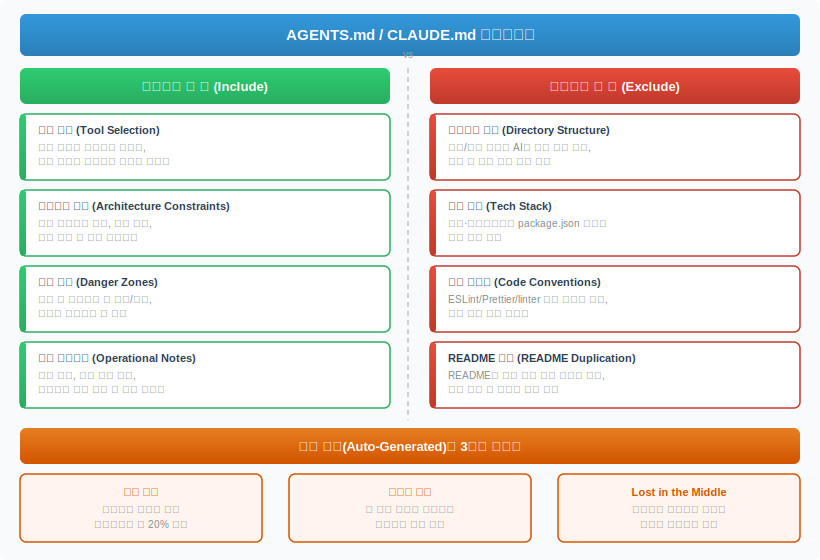
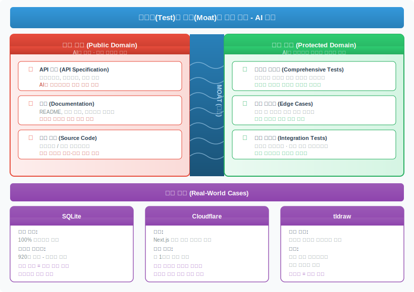

# AI 코딩 실전 베스트 프랙티스

> `[3] 중급` · 선수 지식: [Claude Code 워크플로우](./claude-code-workflow.md), [Agentic Coding](./agentic-coding.md)

> `Trend` 2026

> AI 코딩 도구를 실무에서 효과적으로 활용하기 위한 검증된 워크플로우, 컨텍스트 파일 작성법, 테스트 전략, 보안 원칙을 정리한 실전 가이드

`#AI코딩` `#BestPractices` `#베스트프랙티스` `#ClaudeCode` `#클로드코드` `#AGENTS.md` `#CLAUDE.md` `#컨텍스트엔지니어링` `#ContextEngineering` `#테스트해자` `#TestMoat` `#AI보안` `#AISecurity` `#ResearchPlanImplement` `#계획실행분리` `#AnnotationCycle` `#주석사이클` `#토큰최적화` `#앵커링편향` `#AnchoringBias` `#샌드박스` `#Sandbox` `#AgenticCoding` `#에이전틱코딩` `#AIWorkflow` `#GeekNews` `#BorisT` `#AddyOsmani` `#Cloudflare` `#SQLite`

## 왜 알아야 하는가?

- **실무**: AI 코딩 도구를 "그냥 쓰는 것"과 "전략적으로 쓰는 것"의 생산성 차이가 3~5배. 올바른 워크플로우 없이는 오히려 기술 부채가 증가
- **면접**: "AI 도구를 실무에서 어떻게 활용하나요?", "AI 생성 코드의 품질을 어떻게 보장하나요?" 등 실전 경험 질문 빈출
- **기반 지식**: Context Engineering, AI 보안, 테스트 전략 등 AI 시대 개발자의 필수 역량

## 핵심 개념

- **Research → Plan → Implement**: AI에게 코드를 맡기기 전 반드시 조사와 계획을 분리하는 3단계 워크플로우
- **Annotation Cycle**: 계획서에 인라인 주석을 달아 반복 수정하는 AI 협업 패턴
- **컨텍스트 파일 최적화**: AGENTS.md/CLAUDE.md에 "에이전트가 발견할 수 없는 정보만" 기록하는 원칙
- **테스트 = 해자(Moat)**: AI가 코드를 쉽게 복제하는 시대, 포괄적 테스트 스위트가 새로운 경쟁 우위
- **AI 코딩 보안**: 신뢰할 수 없는 저장소, 프롬프트 인젝션 등 새로운 위협에 대한 방어

## 쉽게 이해하기

**건축 프로젝트의 비유**

AI 코딩 도구는 강력한 건설 장비와 같습니다. 장비가 아무리 뛰어나도:
- **설계도(Plan)** 없이 시공하면 건물이 무너집니다
- **작업 매뉴얼(CLAUDE.md)** 이 너무 두꺼우면 아무도 안 읽습니다
- **품질 검사(Test)** 없이 완공하면 입주 후 문제가 터집니다
- **안전 규정(Security)** 을 무시하면 현장 사고가 발생합니다

## 상세 설명

### 1. Research → Plan → Implement 워크플로우

Boris Tane(개발자)이 제안한 Claude Code 활용의 핵심 원칙:

> "Claude가 계획을 검토하고 승인하기 전까지 절대 코드를 작성하게 하지 마라"



#### 1단계: Research (조사)

코드베이스를 **표면적으로 훑는 것이 아닌 심화 분석**을 요청한다.

```
"이 폴더를 깊이 있게 읽어줘. 동작 방식을 깊이 이해하고,
세부 사항까지 파악해서 research.md에 상세 보고서를 작성해"
```

**왜 이렇게 하는가?**
- "읽어봐"라고만 하면 AI는 표면적 스캔만 수행
- "deeply", "intricacies" 같은 표현이 충분한 분석 깊이를 유도
- 기존 캐싱 레이어, ORM 규칙 등을 무시하는 실수를 사전에 방지

| 표현 | AI 동작 | 결과 |
|------|---------|------|
| "읽어봐" | 파일 목록 + 구조 훑기 | 피상적 이해 |
| "깊이 분석해" | 의존성, 패턴, 규칙까지 파악 | 심화 이해 |
| "세부 사항까지 보고서 작성" | 파일에 기록하여 참조 가능 | 지속 참조 |

#### 2단계: Plan (계획)

`plan.md` 파일로 구현 계획을 작성한다.

```
"research.md를 참고해서 구현 계획을 plan.md에 작성해줘.
접근 방식, 코드 스니펫, 수정할 파일 경로, 트레이드오프를 포함해.
아직 구현하지 마."
```

**"아직 구현하지 마(don't implement yet)" 가 핵심이다.**

이 문구를 빠뜨리면 Claude는 계획을 작성하다가 조기에 코드 작성을 시작한다. 반드시 명시적으로 구현 금지를 선언해야 한다.

**왜 마크다운 파일을 사용하는가?**

| 방식 | 장점 | 단점 |
|------|------|------|
| AI Plan Mode | 빠른 시작 | 자유로운 편집 어려움 |
| **plan.md 파일** | **에디터에서 직접 수정 가능** | **약간의 추가 작업** |
| 채팅으로 소통 | 간편함 | 히스토리 유실, 수정 어려움 |

#### Annotation Cycle (주석 달기 사이클)

**이 워크플로우의 가장 차별화된 단계**다.

```
Plan 작성 → 개발자 인라인 주석 → AI 반영 → 재검토 → (1~6회 반복)
```

개발자가 plan.md에 직접 인라인 주석을 추가한다:

```markdown
## 데이터베이스 마이그레이션
<!-- NOTE: drizzle:generate로 마이그레이션 생성할 것 -->

### 캐싱 레이어
<!-- NOTE: 이 섹션 삭제. 캐싱 불필요 -->

### visibility 필드
<!-- NOTE: visibility는 list 자체에 있어야 함, item이 아님 -->
```

그리고 AI에게 되돌린다:

```
"문서에 노트를 몇 개 추가했어. 모든 노트를 반영해서 문서를 업데이트해줘.
아직 구현하지 마."
```

**왜 이렇게 하는가?**
- 채팅으로 피드백하면 컨텍스트가 흐름에 묻힘
- 파일에 직접 주석을 달면 **정확한 위치**에 **정확한 의도**가 전달됨
- 1~6회 반복하면서 계획의 완성도를 올림

#### 3단계: Implement (구현)

계획이 확정되면 단일 명령어로 전체 구현을 시작한다:

```
"전부 구현해줘. 작업이나 단계를 완료하면 plan.md에 완료 표시해줘.
모든 작업과 단계가 완료될 때까지 멈추지 마.
불필요한 주석이나 JSDoc 추가하지 마.
any나 unknown 타입 사용하지 마.
지속적으로 typecheck를 실행해."
```

| 지시 | 목적 |
|------|------|
| "전부 구현" | 계획의 모든 항목 수행 |
| "완료 표시" | plan.md로 진행 상황 추적 |
| "멈추지 마" | 중간 확인 질문 방지 |
| "불필요한 주석 금지" | 코드 간결성 유지 |
| "typecheck 실행" | 타입 에러 조기 발견 |

#### 구현 중 피드백

구현 단계에서의 피드백은 **간결해야** 한다:

```
# 좋은 예
"deduplicateByTitle 함수가 구현되지 않았어"

# 좋은 예 - 패턴 참조
"이 테이블은 users 테이블과 똑같이 생겨야 해. 같은 헤더, 같은 페이지네이션"

# 좋은 예 - 방향 전환 시
"다 되돌렸어. 이제 리스트 뷰를 더 미니멀하게만 만들어줘 - 다른 건 건드리지 마"
```

---

### 2. AGENTS.md / CLAUDE.md 올바른 작성법

Addy Osmani(Google Chrome 엔지니어)가 정리한 컨텍스트 파일 작성의 핵심 원칙.

> "AGENTS.md를 아직 해결하지 않은 기술 부채의 리스트로 생각하라"



#### 자동 생성의 3가지 문제

| 문제 | 설명 | 영향 |
|------|------|------|
| **토큰 낭비** | 에이전트가 이미 발견 가능한 정보를 중복 기록 | 비용 20%+ 증가 |
| **앵커링 편향** | 컨텍스트에 명시된 정보가 실제 현황과 무관하게 우선순위 획득 | 레거시 기술 고착 |
| **Lost in the Middle** | 중간에 위치한 정보는 LLM 성능을 오히려 저하 | 핵심 정보 무시 |

#### 포함해야 할 것 (에이전트가 발견 불가능한 것)

```markdown
# CLAUDE.md - 올바른 예시

## 도구 선택
- 패키지 매니저: pnpm (npm 사용 금지)
- 테스트 실행: --no-cache 플래그 필수

## 아키텍처 제약
- auth 모듈은 커스텀 미들웨어 패턴 사용
  → 표준 Express 패턴으로 리팩토링 금지

## 위험 지역
- legacy/ 디렉토리: deprecated이나 3개 프로덕션 모듈에서 import 중
  → 수정 시 반드시 영향 범위 확인

## 운영 주의사항
- DB 마이그레이션: production에서 직접 실행 금지
  → staging 검증 후 CI/CD 파이프라인 통해 배포
```

#### 제외해야 할 것 (에이전트가 직접 발견 가능한 것)

```markdown
# 나쁜 예시 - 이런 내용은 쓰지 마라

## 디렉토리 구조          ← 에이전트가 ls로 발견
src/
├── controllers/
├── services/
└── models/

## 기술 스택              ← package.json에서 발견
- React 18
- TypeScript 5
- Express.js

## 코드 컨벤션            ← ESLint/Prettier에서 발견
- 2 spaces indentation
- semicolons required
```

#### 계층별 아키텍처 접근

| 계층 | 내용 | 로딩 시점 |
|------|------|----------|
| **1단계: 라우팅** | 사용 가능한 페르소나, 스킬, 최소 필수 정보 | 항상 |
| **2단계: 선택적** | 작업 유형별 분리 파일 (CSS 작업엔 DB 경고 불필요) | 필요시 |
| **3단계: 자동 유지보수** | 코드 변화에 따라 자동 업데이트하는 서브에이전트 | 백그라운드 |

#### 에이전트 실패 시 진단 프로세스

에이전트가 반복 실수할 때의 대응 순서:

```
1. 코드 문제를 먼저 해결
   → 디렉토리 구조 재정렬
   → 린터 규칙 추가
   → 자동화 테스트 확인

2. 마지막 수단으로만 문서 추가
   → AGENTS.md는 진단 도구
   → 증상이 아닌 근본 원인 치료
```

---

### 3. 테스트 코드 = 새로운 해자(Moat)

AI가 코드를 쉽게 복제하는 시대, **포괄적 테스트 스위트가 새로운 경쟁 우위**가 되고 있다.



#### 핵심 사례: Cloudflare vs Vercel

| 항목 | Vercel | Cloudflare |
|------|--------|------------|
| 투자 기간 | 수 년 (Turbopack, 부분 사전 렌더링 등) | **1주일** |
| 방법 | 자체 개발 | Next.js의 테스트 + 문서를 AI로 활용 |
| 결과 | - | 94% Next.js API 커버리지, 1,700 vitest 테스트 |
| 교훈 | **좋은 문서와 테스트는 경쟁사의 무기가 될 수 있다** | - |

Cloudflare는 Next.js의 뛰어난 문서화와 테스트 스위트를 활용하여 1주일 만에 경쟁 솔루션을 개발했다. 이는 **투명성이 높을수록 모방이 용이해지는 역설**을 보여준다.

#### 방어 전략: 테스트 비공개 모델

| 프로젝트 | 전략 | 효과 |
|----------|------|------|
| **SQLite** | 핵심 코드 오픈소스 + 테스트 920만 라인 비공개 | 프로젝트 지속 가능성의 해자 |
| **tldraw** | 2026년 테스트 스위트를 공개→비공개로 전환 | IP 보호 + 사용자 신뢰 유지 |

#### 실무 적용 전략

**공개/비공개 분리 원칙:**

```
공개해도 되는 것:
├── API 스펙 (계약)
├── 기본 사용 예제
└── 신뢰성 입증용 테스트 일부

비공개로 보호할 것:
├── 포괄적 테스트 스위트 (핵심 해자)
├── 엣지 케이스 테스트
├── 성능/보안 테스트
└── 내부 통합 테스트
```

**왜 테스트가 해자인가?**
- AI는 코드를 쉽게 복제하지만, **포괄적 테스트를 "만드는 과정"** 에는 도메인 지식이 필요
- 테스트는 단순 코드가 아닌 **"어떤 엣지 케이스가 존재하는가"에 대한 경험의 집합**
- 코드 없이 테스트만으로도 시스템의 동작을 역설계할 수 있음

---

### 4. AI 에이전트 코딩 보안

AI 코딩 도구가 강력해질수록 **새로운 보안 위협**도 함께 증가한다.

#### Claude Code 보안 취약점 사례

Check Point Research가 발견한 3가지 취약점 (패치 완료):

| 취약점 | 공격 벡터 | 위험도 |
|--------|----------|--------|
| 악성 저장소 클론 | 신뢰할 수 없는 repo에 숨겨진 프롬프트 인젝션 | 높음 |
| CLAUDE.md 인젝션 | 악의적 지시가 포함된 컨텍스트 파일 | 높음 |
| MCP 서버 위장 | 악성 MCP 서버가 도구를 위장하여 명령 실행 | 높음 |

#### 방어 원칙

```
1. 신뢰할 수 없는 저장소 클론 주의
   → git clone 전 저장소의 CLAUDE.md, .cursorrules 등 확인
   → 알 수 없는 출처의 MCP 서버 연결 금지

2. 샌드박스 환경 사용
   → Matchlock: Linux 기반 AI 에이전트 워크로드 보호 CLI
   → Docker 컨테이너 내에서 AI 에이전트 실행
   → 파일 시스템 접근 범위 제한

3. 코드 리뷰 강화
   → AI 생성 코드도 반드시 보안 리뷰
   → 특히 외부 입력 처리, 인증/인가, 파일 I/O 주의
   → OWASP Top 10 관점 검토

4. 권한 최소화
   → AI에게 필요 최소한의 파일/디렉토리 접근만 허용
   → 프로덕션 환경 접근 절대 금지
   → API 키, 시크릿 노출 방지
```

#### Matchlock - AI 에이전트 샌드박스

```shell
# Matchlock 설치 및 사용 예시
# AI 에이전트를 격리된 환경에서 실행
matchlock run -- claude-code "작업 내용"

# 파일 시스템 접근 제한
matchlock run --allow-read ./src --allow-write ./output -- agent
```

| 기능 | 설명 |
|------|------|
| 파일 시스템 격리 | 지정된 디렉토리만 읽기/쓰기 허용 |
| 네트워크 제한 | 허용된 도메인만 접근 가능 |
| 프로세스 격리 | 에이전트가 시스템 명령 실행 제한 |
| 감사 로그 | 에이전트의 모든 활동을 기록 |

## 트레이드오프

| 장점 | 단점 |
|------|------|
| 3단계 워크플로우로 AI 결과물 품질 대폭 향상 | 초기 학습 곡선과 추가 작업 시간 |
| CLAUDE.md 최적화로 토큰 비용 절감 | 지속적인 문서 유지보수 필요 |
| 테스트 기반 경쟁 우위 확보 | 테스트 작성 자체의 높은 초기 비용 |
| 보안 샌드박스로 안전한 AI 활용 | 개발 편의성 일부 제약 |

## 면접 예상 질문

### Q: AI 코딩 도구를 실무에서 어떻게 활용하시나요?

A: Research → Plan → Implement 3단계 워크플로우를 사용합니다. 먼저 AI에게 코드베이스를 심화 분석하게 하고, 구현 계획을 마크다운 파일로 작성한 뒤 Annotation Cycle을 통해 계획을 다듬습니다. "아직 구현하지 마"를 명시하는 것이 핵심입니다. 계획이 확정되면 한 번의 명령으로 전체 구현을 시작하되, typecheck를 지속 실행하여 품질을 보장합니다.

### Q: CLAUDE.md나 AGENTS.md에는 어떤 내용을 작성해야 하나요?

A: "에이전트가 스스로 발견할 수 없는 정보만" 작성합니다. 도구 선택(pnpm vs npm), 아키텍처 제약(특정 패턴 변경 금지), 위험 지역(deprecated이지만 의존성이 있는 코드) 등이 해당됩니다. 디렉토리 구조, 기술 스택, 코드 컨벤션 등 에이전트가 직접 발견 가능한 정보는 제외합니다. 이 파일을 "해결되지 않은 기술 부채의 리스트"로 생각하면 됩니다.

### Q: AI 시대에 테스트 코드가 왜 중요한가요?

A: AI가 코드 복제를 쉽게 만들면서 테스트 스위트가 새로운 경쟁 우위(해자)가 되었습니다. Cloudflare가 Next.js의 테스트와 문서를 활용해 1주일 만에 경쟁 솔루션을 개발한 사례가 대표적입니다. 반면 SQLite는 핵심 코드는 오픈소스로 두되 920만 라인의 테스트는 비공개로 유지하여 프로젝트를 보호합니다. 테스트는 단순 코드가 아닌 **도메인 경험의 집합**이기 때문입니다.

### Q: AI 코딩 도구 사용 시 보안 위험은 무엇인가요?

A: 주요 위험은 세 가지입니다. (1) 악성 저장소 클론 시 숨겨진 프롬프트 인젝션, (2) CLAUDE.md 등 컨텍스트 파일을 통한 악의적 지시 주입, (3) 위장된 MCP 서버를 통한 명령 실행. 방어를 위해 신뢰할 수 없는 저장소 클론을 주의하고, Matchlock 같은 샌드박스에서 에이전트를 실행하며, AI 생성 코드도 반드시 보안 리뷰를 수행해야 합니다.

## 연관 문서

| 문서 | 연관성 | 난이도 |
|------|--------|--------|
| [Claude Code 워크플로우](./claude-code-workflow.md) | 선수 지식 - 기본 워크플로우 | 중급 |
| [Agentic Coding](./agentic-coding.md) | 선수 지식 - 에이전틱 코딩 패러다임 | 중급 |
| [Context Engineering](./context-engineering.md) | 관련 개념 - 컨텍스트 최적화 | 중급 |
| [AI 보조 개발](./ai-assisted-development.md) | 관련 개념 - AI 개발 전반 | 입문 |
| [AI Guardrails](./ai-guardrails.md) | 관련 개념 - AI 안전장치 | 중급 |
| [Claude Code Agent Team](./claude-code-agent-team.md) | 심화 학습 - 멀티 에이전트 구성 | 심화 |

## 참고 자료

- [Boris Tane - How I Use Claude Code](https://boristane.com/blog/how-i-use-claude-code/) - Claude Code 3단계 워크플로우
- [Addy Osmani - AGENTS.md](https://addyosmani.com/blog/agents-md/) - AGENTS.md 올바른 작성법
- [Tests Are the New Moat](https://saewitz.com/tests-are-the-new-moat) - 테스트가 새로운 해자인 이유
- [Cloudflare vinext](https://blog.cloudflare.com/vinext/) - AI로 Next.js 재구현 사례
- [GeekNews (news.hada.io)](https://news.hada.io/) - 한국어 기술 뉴스 큐레이션
