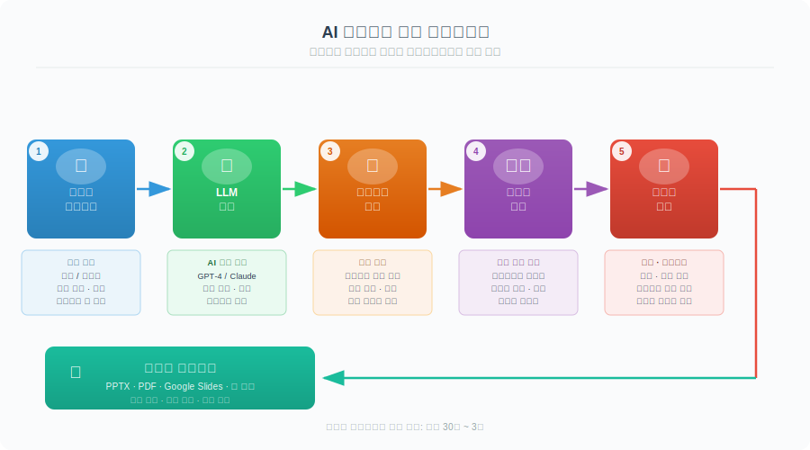
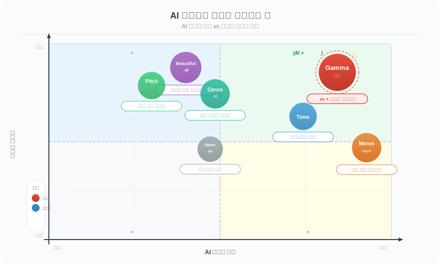

# AI 슬라이드 생성 도구 비교 가이드

> `[2] 입문` · 선수 지식: [AI Agent란](./ai-agent.md), [LLM 기초](./llm.md)

> AI를 활용하여 프레젠테이션을 자동 생성하는 도구들의 특성 비교와 선택 기준 가이드

`#AI슬라이드` `#AIPresentation` `#Gamma` `#BeautifulAI` `#Tome` `#SlidesAI` `#Pitch` `#CanvaAI` `#Manus` `#프레젠테이션자동생성` `#SlideGeneration` `#AI프로덕티비티` `#GenerativeAI` `#NoCode`

## 왜 알아야 하는가?

- **실무**: 회의, 제안서, 교육 자료 등 프레젠테이션 제작 시간을 1/10로 단축할 수 있다
- **면접**: AI 생산성 도구의 활용 경험과 도구 선정 기준을 설명할 수 있다
- **기반 지식**: LLM 기반 콘텐츠 생성 파이프라인(텍스트 → 구조화 → 디자인)의 실전 사례

## 핵심 개념

- AI 슬라이드 도구는 자연어 프롬프트로 프레젠테이션 구조와 디자인을 자동 생성한다
- 핵심 파이프라인: **프롬프트 입력 → 아웃라인 생성 → 콘텐츠 작성 → 디자인 적용**
- 각 도구는 디자인 자유도, AI 깊이, 협업 기능, 내보내기 옵션에서 차별화된다

## 쉽게 이해하기

레스토랑에서 식사를 주문하는 것과 비슷하다.

- **전통 PPT (PowerPoint)** = 직접 요리: 재료 구매, 조리, 플레이팅까지 모두 직접
- **AI 슬라이드 도구** = 레스토랑 주문: "스테이크 미디엄, 와인 페어링으로" 한마디면 풀코스 완성
- **프롬프트** = 메뉴 주문서: 구체적일수록 원하는 결과에 가까움
- **템플릿** = 레스토랑 스타일: 이탈리안, 프렌치 등 전체 톤을 결정

"비개발자 대상 생성형 AI 소개, 사례 중심, 10장"이라고 말하면, AI가 목차를 잡고, 내용을 채우고, 디자인까지 입혀서 완성된 프레젠테이션을 돌려준다.

## 동작 원리



## 서비스별 상세 비교

### 비교 요약표



| 서비스 | 핵심 강점 | AI 깊이 | 디자인 퀄리티 | 협업 | 무료 플랜 | PPT 내보내기 |
|--------|----------|---------|-------------|------|----------|-------------|
| **Gamma** | 프롬프트→완성 올인원 | 높음 | 높음 | 있음 | 400 크레딧 | Pro부터 |
| **Beautiful.ai** | 자동 레이아웃 정렬 | 중간 | 매우 높음 | 팀 특화 | 제한적 | Pro부터 |
| **Tome** | 스토리텔링 중심 | 높음 | 높음 | 있음 | 제한적 | 있음 |
| **SlidesAI** | Google Slides 통합 | 중간 | 중간 | Google 연동 | 3회/월 | Google 형식 |
| **Pitch** | 팀 협업 특화 | 중간 | 높음 | 최고 | 있음 | 있음 |
| **Canva AI** | 디자인 에셋 풍부 | 중간 | 높음 | 있음 | 있음 | 있음 |
| **Manus** | 범용 AI 에이전트 | 매우 높음 | 중간 | 없음 | 제한적 | 있음 |

### 1. Gamma

**한 줄 정리**: 프롬프트 하나로 완성도 높은 프레젠테이션을 즉시 생성하는 AI-네이티브 도구

**장점**:
- 한국어 프롬프트 지원, 한글 콘텐츠 생성 품질 우수
- 프롬프트 → 아웃라인 → 완성 3단계로 빠른 생성
- 웹 페이지 형태로 공유 가능 (PPT 뷰어 불필요)
- 블록 기반 편집으로 Notion 사용자에게 익숙한 UX
- AI 채팅으로 슬라이드 개별 수정 가능

**단점**:
- PPT 내보내기는 유료 (Plus $10/월~)
- 세밀한 디자인 커스터마이징에 한계
- 복잡한 차트/데이터 시각화 기능 부족

**적합한 사용자**: 빠른 프레젠테이션이 필요한 개인, 스타트업, 교육자

### 2. Beautiful.ai

**한 줄 정리**: AI가 레이아웃을 자동으로 정렬해주는 디자인 중심 프레젠테이션 도구

**장점**:
- "Smart Slide" 시스템으로 요소 배치 시 자동 정렬
- 전문 디자이너 수준의 레이아웃 일관성
- 100+ 전문 템플릿

**단점**:
- AI 콘텐츠 생성 능력은 상대적으로 약함
- 무료 플랜 제한적
- 한국어 지원 미흡

**적합한 사용자**: 디자인 일관성이 중요한 기업 발표, 투자 피칭

### 3. Tome

**한 줄 정리**: AI로 스토리텔링 중심의 내러티브 프레젠테이션을 생성하는 도구

**장점**:
- GPT 기반 스토리텔링 구조 자동 생성
- 텍스트 + 이미지 + 영상 통합 콘텐츠
- DALL-E 연동 AI 이미지 생성

**단점**:
- 전통적 슬라이드 형식과 다름 (호불호 갈림)
- 데이터 중심 발표에 부적합
- 한국어 콘텐츠 품질 불안정

**적합한 사용자**: 마케팅, 브랜딩, 창의적 프레젠테이션

### 4. SlidesAI

**한 줄 정리**: Google Slides 플러그인 형태로 기존 워크플로우에 AI를 추가하는 도구

**장점**:
- Google Workspace 생태계 완벽 통합
- 기존 텍스트/문서를 슬라이드로 자동 변환
- 별도 학습 비용 없음 (기존 Google Slides UX)

**단점**:
- Google Slides 디자인 한계를 그대로 상속
- AI 생성 품질이 전용 도구 대비 낮음
- 무료 3회/월 제한

**적합한 사용자**: Google Workspace 중심 조직, 기존 문서 변환 니즈

### 5. Pitch

**한 줄 정리**: 팀 협업에 특화된 프레젠테이션 도구에 AI 초안 생성 기능을 더한 서비스

**장점**:
- 실시간 협업 (Figma 수준의 멀티커서)
- 브랜드 킷 관리로 기업 디자인 일관성
- 세련된 현대적 템플릿

**단점**:
- AI 생성 기능은 보조 수준
- 순수 AI 자동 생성보다는 협업 도구에 가까움

**적합한 사용자**: 디자인 팀, 마케팅 팀의 협업 프레젠테이션

### 6. Canva AI (Magic Design)

**한 줄 정리**: 거대한 디자인 에셋 라이브러리 + AI 자동 생성의 결합

**장점**:
- 수백만 개 템플릿, 이미지, 아이콘, 폰트
- AI 프레젠테이션 생성 + 개별 요소 AI 편집
- 익숙한 Canva UX, 넓은 사용자 기반

**단점**:
- 프레젠테이션 전용이 아닌 범용 디자인 도구
- AI 생성 슬라이드의 구조적 깊이 부족
- 프리미엄 에셋은 유료

**적합한 사용자**: 이미 Canva를 사용하는 사용자, 시각적 요소가 중요한 발표

### 7. Manus

**한 줄 정리**: 범용 AI 에이전트가 웹 검색 + 슬라이드 생성을 자율적으로 수행

**장점**:
- 주제만 주면 리서치부터 슬라이드 생성까지 자동
- 웹 검색 기반 최신 정보 반영
- 코딩, 문서 작성 등 범용 작업도 가능

**단점**:
- 프레젠테이션 전용 도구가 아니어서 디자인 퀄리티 낮음
- 생성 시간이 상대적으로 길다 (분 단위)
- 세밀한 슬라이드 편집 어려움

**적합한 사용자**: 리서치가 필요한 발표, 빠른 초안이 필요한 경우

## 왜 Gamma를 선택하는가?

### 선택 기준 매트릭스

| 기준 | 가중치 | Gamma | Beautiful.ai | Tome | Canva AI | Manus |
|------|--------|-------|-------------|------|---------|-------|
| AI 생성 품질 | 30% | 9 | 6 | 8 | 7 | 8 |
| 디자인 퀄리티 | 25% | 8 | 9 | 7 | 8 | 5 |
| 사용 편의성 | 20% | 9 | 7 | 7 | 8 | 6 |
| 한국어 지원 | 15% | 8 | 4 | 5 | 7 | 7 |
| 무료 사용성 | 10% | 8 | 3 | 4 | 7 | 5 |
| **가중 합계** | **100%** | **8.6** | **6.3** | **6.7** | **7.5** | **6.4** |

### Gamma가 최적인 5가지 이유

**1. AI 생성 완성도가 가장 높다**
- 프롬프트 한 줄로 10장 이상의 완성된 슬라이드 생성
- 아웃라인 → 콘텐츠 → 디자인 전 과정을 AI가 처리
- 다른 도구는 콘텐츠 또는 디자인 한쪽만 강한 경우가 많음

**2. 한국어 지원이 우수하다**
- 한국어 프롬프트 입력 → 한국어 슬라이드 생성
- Beautiful.ai, Tome은 영어 중심으로 한국어 품질이 불안정

**3. 학습 비용이 낮다**
- Notion 스타일 블록 에디터로 직관적
- 별도 디자인 지식 불필요
- 5분 내 첫 프레젠테이션 완성 가능

**4. 공유 방식이 유연하다**
- 웹 링크로 공유 (스크롤 뷰) → PPT 뷰어 불필요
- PDF 내보내기 무료
- PPT 내보내기는 유료지만 웹 공유로 대체 가능

**5. 무료 플랜이 실용적이다**
- 가입 시 400 크레딧 제공
- 1회 생성에 40 크레딧 → 약 10개 프레젠테이션 무료 생성
- 워터마크만 감수하면 무료로 충분히 활용 가능

## 사용 시나리오별 추천

```
시나리오                     → 추천 도구
─────────────────────────────────────────────────
빠른 발표 자료 제작           → Gamma
투자 피칭덱                   → Beautiful.ai
마케팅/브랜드 프레젠테이션     → Tome, Canva AI
팀 협업 프레젠테이션           → Pitch
Google Workspace 환경         → SlidesAI
리서치 포함 자동 생성          → Manus
시각적 임팩트 극대화           → Canva AI
한국어 발표 자료               → Gamma, Canva AI
```

## Gamma 실전 사용법

### 기본 워크플로우

```
1. gamma.app 접속 → 회원가입 (Google 계정)
2. "Create new" → "Generate" 선택
3. 프롬프트 입력 (한국어 가능)
4. 아웃라인 검토 → 수정 → "Continue"
5. 테마 선택 → "Generate"
6. 완성 후 편집/공유
```

### 프롬프트 작성 팁

```
나쁜 예: "AI 소개"
좋은 예: "비개발자 대상 생성형 AI 소개, 사례 중심, 10장, 한국어"
최적 예: "IT 기업 신입사원 대상 생성형 AI 기초 교육 자료,
         ChatGPT/Claude/Gemini 비교, 실무 활용 사례 5개 포함,
         12장, 한국어, 톤: 친근하고 쉬운 설명"
```

### 편집 기능

| 기능 | 사용법 |
|------|--------|
| 블록 추가 | `/` 입력 → 메뉴에서 선택 |
| AI 텍스트 수정 | 텍스트 선택 → AI Edit |
| AI 채팅 수정 | 우측 하단 채팅창에 수정 요청 |
| 테마 변경 | 상단 Theme 버튼 |
| 카드 스타일 | 개별 카드 → Card style |
| 이미지 교체 | 이미지 클릭 → Replace/AI regenerate |

### 내보내기 옵션

| 형식 | 플랜 | 비고 |
|------|------|------|
| 웹 링크 공유 | Free | 스크롤 형태, PPT 뷰어 불필요 |
| PDF | Free | 인쇄용 |
| PPT/PPTX | Plus ($10/월~) | PowerPoint 호환 |
| 임베드 | Free | 웹사이트/Notion에 삽입 |

## 주의사항 / 트레이드오프

### AI 생성 슬라이드의 한계

- **데이터 정확성**: AI가 생성한 통계/수치는 반드시 팩트체크 필요
- **디자인 획일성**: AI 생성 슬라이드는 비슷한 패턴을 반복하는 경향
- **세밀한 커스터마이징**: 픽셀 단위 조정은 전통 PPT 도구가 유리
- **오프라인 사용**: 대부분 웹 기반으로 오프라인 작업 불가

### 도구 선택 시 고려사항

```
AI 생성 품질 ←→ 디자인 자유도     : Gamma(AI) vs Beautiful.ai(디자인)
사용 편의성  ←→ 기능 깊이          : Gamma(편의) vs Canva(기능)
빠른 생성    ←→ 세밀한 편집        : Manus(빠름) vs Pitch(편집)
무료 사용    ←→ 전문 기능          : Free 플랜은 대부분 제한적
```

## 면접 질문

### Q1. AI 슬라이드 도구를 실무에서 어떻게 활용하나요?

**핵심**: 초안 생성 자동화 → 인간의 검토/수정에 집중

> "프레젠테이션 제작의 80%는 구조 잡기와 초안 작성이다. AI 도구로 이 단계를 자동화하고,
> 인간은 메시지 다듬기, 데이터 검증, 청중 맞춤 조정에 집중한다.
> Gamma를 예로 들면, 프롬프트로 10장 초안을 30초에 생성하고,
> 20분간 내용을 검토/수정하면 과거 2~3시간 걸리던 작업을 30분에 완료할 수 있다."

### Q2. 여러 AI 슬라이드 도구 중 하나를 선택해야 한다면 기준은?

**핵심**: 사용 시나리오, 팀 환경, 예산, 언어 지원 4가지 기준

> "첫째, 주요 사용 시나리오(빠른 생성 vs 디자인 퀄리티 vs 팀 협업).
> 둘째, 기존 도구 생태계와의 호환성(Google Workspace, Figma 등).
> 셋째, 예산(무료 플랜 범위, 팀 라이선스 비용).
> 넷째, 언어 지원(한국어 콘텐츠 생성 품질).
> 이 4가지를 기준으로 가중 평가하면 대부분의 경우 최적 도구를 선정할 수 있다."

## 참고 자료

- [Gamma 공식 사이트](https://gamma.app)
- [Beautiful.ai 공식 사이트](https://www.beautiful.ai)
- [Tome 공식 사이트](https://tome.app)
- [Pitch 공식 사이트](https://pitch.com)
- [SlidesAI 공식 사이트](https://www.slidesai.io)
- [Canva AI 공식 사이트](https://www.canva.com)

---

> **관련 문서**: [AI Agent란](./ai-agent.md) · [LLM 기초](./llm.md) · [AI 보조 개발](./ai-assisted-development.md) · [Nano Banana 2 이미지 생성](./nanobanana-image-generation.md)
