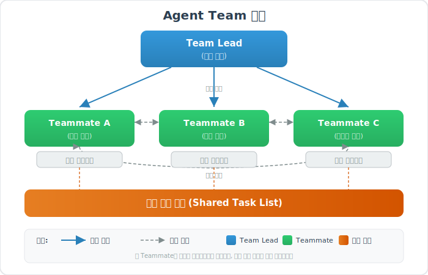
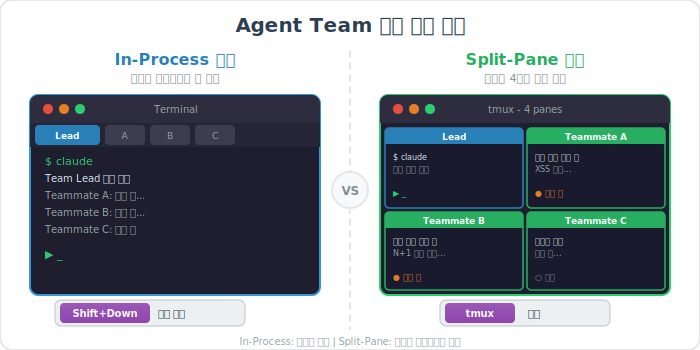
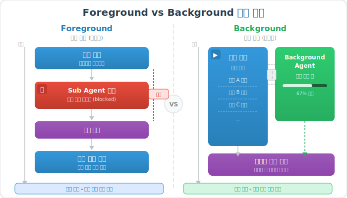

# Claude Code Agent Team

> `[4] 심화` · 선수 지식: [Claude Code Sub Agent](./claude-code-sub-agent.md), [Multi-Agent Systems](./multi-agent-systems.md)

> `Trend` 2026

> Claude Code에서 여러 독립 AI 에이전트를 하나의 팀으로 구성하여 복잡한 작업을 병렬로 조율하는 협업 시스템

`#AgentTeam` `#에이전트팀` `#ClaudeCode` `#멀티에이전트` `#MultiAgent` `#TeamLead` `#Teammate` `#병렬실행` `#ParallelExecution` `#Worktree` `#GitWorktree` `#Background` `#Foreground` `#SubAgent` `#서브에이전트` `#오케스트레이션` `#Orchestration` `#SplitPane` `#InProcess` `#tmux` `#TeamCoordination` `#Resume` `#Isolation` `#CustomAgent` `#AgentMarkdown` `#비용관리` `#TokenCost` `#Anthropic` `#Sonnet` `#Opus`

## 왜 알아야 하는가?

- **실무**: 대규모 리팩토링, 병렬 코드 리뷰, 모듈별 동시 개발 등 복잡한 작업을 여러 에이전트에 위임하여 처리 속도를 극대화
- **면접**: AI 에이전트 오케스트레이션 패턴과 병렬 처리 아키텍처 이해도 증명
- **기반 지식**: Sub Agent(단일 위임)에서 Agent Team(팀 협업)으로 확장하는 핵심 전환점

## 핵심 개념

- **Agent Team**: 여러 독립 AI 에이전트가 공유 작업 목록에서 자체 조율하며 병렬 협업하는 시스템
- **Team Lead**: 팀을 생성하고 작업을 분배하며 결과를 종합하는 메인 에이전트
- **Teammate**: 독립 컨텍스트 윈도우에서 자율적으로 할당된 작업을 수행하는 팀 멤버
- **Worktree Isolation**: 각 에이전트가 독립된 Git worktree에서 작업하여 파일 충돌을 방지하는 격리 모드

## 쉽게 이해하기

**프로젝트 팀 비유**

| 요소 | 프로젝트 팀 | Agent Team |
|------|------------|------------|
| 팀장 | PM (프로젝트 매니저) | Team Lead (메인 세션) |
| 팀원 | 프론트엔드, 백엔드 개발자 | Teammate (독립 인스턴스) |
| 작업판 | Jira 보드 | 공유 작업 목록 (Shared Task List) |
| 회의실 | 스탠드업 미팅 | 메시지 통신 (`Shift+Down`) |
| 작업 공간 | 각자의 브랜치 | Git Worktree (격리 환경) |



## Sub Agent와 Agent Team의 차이

기존 Sub Agent와 Agent Team은 근본적으로 다른 협업 모델입니다.

| 특성 | Sub Agent | Agent Team |
|------|-----------|------------|
| **컨텍스트** | 메인 세션 내부에서 실행 | 각 멤버가 독립 컨텍스트 보유 |
| **통신 방향** | 결과만 메인으로 단방향 반환 | 팀 멤버 간 양방향 직접 소통 |
| **조정 방식** | 메인 에이전트가 모든 작업 관리 | 공유 작업 목록에서 자체 조정 |
| **적합한 작업** | 자체 포함된 단일 작업 | 복잡한 병렬 탐구/개발 |
| **비용** | 낮음 (결과 요약 반환) | 높음 (독립 인스턴스 x N) |
| **팀 규모** | 해당 없음 | 3~5명 권장 |

**선택 기준**

```
결과만 필요하고, 단일 작업인가?
  → Yes: Sub Agent
  → No: 팀 멤버 간 발견사항 공유가 필요한가?
         → Yes: Agent Team
         → No: Sub Agent 병렬 실행
```

## 상세 설명

### 1. Agent Team 활성화

Agent Team은 실험적 기능(Experimental)으로, 명시적 활성화가 필요합니다.

**환경 변수 방식**

```bash
export CLAUDE_CODE_EXPERIMENTAL_AGENT_TEAMS=1
claude
```

**settings.json 방식**

```json
{
  "env": {
    "CLAUDE_CODE_EXPERIMENTAL_AGENT_TEAMS": "1"
  }
}
```

### 2. 팀 생성 및 운영

자연어로 팀 구성을 요청합니다.

```
인증, DB, API 모듈을 병렬로 리뷰하는 팀을 만들어줘.
보안 전문가 1명, 성능 전문가 1명, 테스트 전문가 1명으로 구성.
```

**Team Lead (메인 세션)의 역할**

| 역할 | 설명 |
|------|------|
| 팀 생성 | 팀 멤버 수, 역할, 모델 지정 |
| 작업 분배 | 각 멤버에게 구체적인 작업 할당 |
| 조율 | 진행 상황 모니터링, 충돌 해결 |
| 결과 종합 | 모든 멤버의 결과를 통합하여 보고 |

**Teammate (팀 멤버)의 역할**

| 역할 | 설명 |
|------|------|
| 자율 실행 | 할당된 작업을 독립적으로 수행 |
| 상호 소통 | 다른 멤버에게 발견사항 전달 |
| 작업 청구 | 공유 목록에서 새 작업을 자체 선택 |
| 결과 보고 | Lead에게 최종 결과 반환 |

### 3. Display 모드

팀 멤버의 출력을 확인하는 두 가지 방식입니다.



**In-Process 모드 (기본)**

```bash
claude --teammate-mode in-process
```

- 모든 팀 멤버가 **같은 터미널**에서 실행
- `Shift+Down`으로 팀 멤버 간 순환
- 추가 설정 불필요

**Split-Pane 모드**

```bash
claude --teammate-mode tmux
```

- 각 팀 멤버가 **별도 pane**에서 실행
- 모든 출력을 동시에 확인 가능
- tmux 또는 iTerm2 필요

**Auto 모드 (기본값)**

tmux 세션 내부이면 Split-Pane, 아니면 In-Process를 자동 선택합니다.

### 4. Custom Agent 정의

프로젝트에 맞는 전문 에이전트를 Markdown 파일로 정의합니다.

**파일 위치 및 범위**

| 위치 | 범위 | 용도 |
|------|------|------|
| `.claude/agents/` | 프로젝트 전체 | 팀 공유 에이전트 |
| `~/.claude/agents/` | 모든 프로젝트 | 개인용 에이전트 |

**에이전트 정의 예시** (`.claude/agents/security-reviewer.md`)

```markdown
---
name: security-reviewer
description: 보안 취약점 전문 리뷰어. 코드 리뷰 시 자동 사용
tools: Read, Grep, Glob, Bash
model: sonnet
maxTurns: 10
---

보안 전문가로서 OWASP Top 10 기준으로 코드를 리뷰합니다.

## 리뷰 항목
- SQL Injection 취약점
- XSS 가능성
- 인증/인가 누락
- 민감 데이터 노출
- 하드코딩된 시크릿
```

**핵심 설정 옵션**

| 옵션 | 설명 | 예시 |
|------|------|------|
| `tools` | 사용 가능한 도구 제한 | `Read, Grep, Glob` |
| `model` | 사용할 모델 지정 | `sonnet`, `opus`, `haiku` |
| `maxTurns` | 최대 실행 턴 수 | `10` |
| `background` | 항상 백그라운드 실행 | `true` |
| `isolation` | 격리 모드 | `worktree` |
| `permissionMode` | 권한 승인 방식 | `default`, `acceptEdits` |
| `memory` | 장기 기억 범위 | `user`, `project` |

### 5. Foreground vs Background 실행



| 특성 | Foreground (기본) | Background |
|------|-------------------|------------|
| 메인 대화 차단 | O (완료까지 대기) | X (계속 작업 가능) |
| 권한 요청 | 실시간 전달 | 사전 승인 필요 |
| 사용자 질문 | AskUserQuestion 가능 | 불가 (자동 거부) |
| 전환 방법 | 기본값 | `Ctrl+B` 또는 설정 |

**Background 에이전트 정의**

```yaml
---
name: long-test-runner
description: 전체 테스트 스위트 실행
background: true
tools: Bash, Read
model: haiku
---
```

### 6. Worktree Isolation (격리 모드)

여러 에이전트가 **같은 파일을 동시에 수정**해야 할 때 필수적입니다.

**왜 필요한가?**

Git worktree 없이 병렬 작업하면 파일 충돌이 발생합니다. Worktree는 각 에이전트에게 독립된 작업 디렉토리를 제공합니다.

**CLI에서 Worktree 세션 시작**

```bash
# 명시적 이름 지정
claude --worktree feature-auth

# 자동 이름 생성
claude --worktree
```

**에이전트에 Worktree 격리 설정**

```yaml
---
name: parallel-worker
isolation: worktree
---
```

**Worktree 동작 원리**

```
메인 저장소: /project (main 브랜치)
    │
    ├── Worktree A: /project/.claude/worktrees/feature-auth/
    │   └── worktree-feature-auth 브랜치
    │
    ├── Worktree B: /project/.claude/worktrees/bugfix-login/
    │   └── worktree-bugfix-login 브랜치
    │
    └── 완료 후:
        ├── 변경 있음 → 사용자에게 유지/삭제 확인
        └── 변경 없음 → 자동 정리 (worktree + 브랜치 삭제)
```

### 7. Agent Resume (재개)

에이전트의 이전 컨텍스트를 유지한 채 작업을 이어갈 수 있습니다.

```
[1회차: 분석]
> security-reviewer로 인증 모듈 리뷰해줘

Claude: [분석 완료]
        Agent ID: sec-review-abc123

[2회차: 이어서 진행]
> sec-review-abc123 재개하고 인가 로직도 분석해줘

Claude: [이전 컨텍스트 복원 → 추가 분석]
```

## 실전 활용 패턴

### 패턴 1: 병렬 코드 리뷰

```
팀을 만들어서 PR #142를 리뷰해줘:
- 보안 관점 리뷰어 1명 (Sonnet)
- 성능 관점 리뷰어 1명 (Sonnet)
- 테스트 커버리지 리뷰어 1명 (Sonnet)
각자 리뷰 후 결과를 종합해줘.
```

**적합한 이유**: 각 관점이 독립적이면서, 최종 결과에서 종합이 필요

### 패턴 2: 모듈별 동시 개발

```bash
# 터미널 1: 인증 모듈
claude --worktree feature-auth
> 인증 모듈 개발해줘

# 터미널 2: 결제 모듈 (동시 진행)
claude --worktree feature-payment
> 결제 모듈 개발해줘

# 완료 후 병합
git merge feature-auth feature-payment
```

**적합한 이유**: 모듈 간 의존성이 낮고, 독립적으로 개발 가능

### 패턴 3: Plan + Review 분리

```
[Session A - Writer]
> API 엔드포인트 구현해줘

[Session B - Reviewer]
> Session A가 만든 구현을 리뷰하고 보안/성능 이슈 찾아줘
```

**적합한 이유**: 작성자와 리뷰어를 분리하여 객관적 품질 검증

### 패턴 4: Fan-out (대규모 일괄 처리)

```bash
# 마이그레이션 대상 파일 목록 생성
claude -p "마이그레이션할 파일 목록 출력" > files.txt

# 각 파일을 병렬로 처리
for file in $(cat files.txt); do
  claude -p "$file를 React에서 Vue로 마이그레이션" \
    --allowedTools "Edit,Bash(git commit *)"
done
```

**적합한 이유**: 동일한 작업을 여러 파일에 반복 적용

## 팀 구성 가이드

### 팀 크기 결정

| 작업 복잡도 | 권장 팀 크기 | 근거 |
|------------|-------------|------|
| 단순 리뷰 | 2~3명 | 관점이 적음 |
| 중간 규모 개발 | 3~4명 | 모듈 분리 가능 |
| 대규모 리팩토링 | 4~5명 | 최대 병렬화 |
| 5명 초과 | 비권장 | 조율 오버헤드 > 이점 |

**왜 5명이 상한인가?**

에이전트 수가 증가하면 토큰 비용은 선형(N배) 증가하지만, 조율 오버헤드는 비선형(N^2)으로 증가합니다. 5명을 초과하면 조율 비용이 병렬화 이점을 상회합니다.

### 모델 선택 전략

| 작업 유형 | 권장 모델 | 비용 | 이유 |
|----------|----------|------|------|
| 코드 탐색/검색 | Haiku | 낮음 | 읽기 전용, 빠른 응답 |
| 일반 코딩/리뷰 | Sonnet | 중간 | 비용 대비 성능 최적 |
| 복잡한 아키텍처 설계 | Opus | 높음 | 깊은 추론 필요 |

## 트레이드오프

| 장점 | 단점 |
|------|------|
| 병렬 처리로 처리 속도 극대화 | 토큰 비용 N배 증가 |
| 관점 분리로 품질 향상 | 조율 오버헤드 발생 |
| 독립 컨텍스트로 깊은 분석 가능 | 디버깅 복잡성 증가 |
| Worktree로 파일 충돌 방지 | 병합 시 충돌 가능 |
| 팀 멤버 간 직접 소통 가능 | 실험적 기능 (안정성 리스크) |

## 비용 관리

### 비용 추적

```bash
/cost    # 현재 세션 비용 확인
```

### 비용 최적화 전략

| 전략 | 효과 | 방법 |
|------|------|------|
| Sonnet 기본 사용 | 비용 50~70% 절감 | 팀 멤버 모델을 sonnet으로 지정 |
| 팀 크기 최소화 | 선형 비용 감소 | 필요한 최소 인원으로 구성 |
| Spawn 프롬프트 간결화 | 입력 토큰 절감 | 불필요한 맥락 제거 |
| 완료 즉시 정리 | 불필요한 토큰 방지 | "팀 정리해줘" 명시 |
| Verbose 작업 위임 | 메인 컨텍스트 보호 | 로그 분석 등은 Sub Agent로 |

### 비용 비교

```
단독 세션:      ~$0.50/작업
Sub Agent 3개:  ~$1.00/작업 (x2)
Agent Team 3명: ~$3.50/작업 (x7, Plan 모드 포함)
```

## 팀 제어 명령

| 명령 | 설명 |
|------|------|
| `Shift+Down` | In-Process 모드에서 팀 멤버 순환 |
| `Ctrl+B` | 실행 중인 작업을 Background로 전환 |
| `Ctrl+T` | Background 작업 목록 토글 |
| `팀 정리해줘` | 모든 팀 멤버 종료 |
| `/permissions` | 자주 사용하는 명령 사전 승인 |
| `/cost` | 현재 세션 비용 확인 |
| `/clear` | 컨텍스트 초기화 |
| `/compact` | 수동 컨텍스트 압축 |

## 트러블슈팅

### 사례 1: 팀 멤버가 보이지 않음

#### 증상
팀을 생성했으나 Teammate 출력이 나타나지 않음

#### 원인 분석
In-Process 모드에서는 한 번에 하나의 팀 멤버만 표시됨

#### 해결 방법
```bash
# 팀 멤버 간 순환
Shift+Down

# 또는 Split-Pane 모드로 전환 (tmux 필요)
claude --teammate-mode tmux
```

### 사례 2: 권한 프롬프트가 너무 많음

#### 증상
팀 멤버마다 반복적으로 권한 승인 요청 발생

#### 원인 분석
각 Teammate가 독립 컨텍스트이므로 권한이 공유되지 않음

#### 해결 방법
```bash
# 사전에 자주 사용하는 명령 일괄 승인
/permissions

# 또는 에이전트 정의에서 permissionMode 설정
---
name: auto-worker
permissionMode: acceptEdits
---
```

### 사례 3: Worktree 정리 안 됨

#### 증상
작업 종료 후 worktree가 남아있음

#### 원인 분석
tmux 세션이 아직 활성 상태이거나, 변경사항이 남아있는 경우

#### 해결 방법
```bash
# tmux 세션 확인 및 종료
tmux ls
tmux kill-session -t <session-name>

# worktree 수동 정리
git worktree list
git worktree remove <path>
```

## 실전 구축 가이드: 4인 리뷰 팀 만들기

이론이 아닌 **실제로 동작하는** Agent Team 구축 과정입니다. `/self-review`(단일 에이전트 순차 리뷰)를 `/team-review`(4인 병렬 리뷰)로 업그레이드한 사례입니다.

### Step 1: 환경 설정

**Agent Team 활성화**

```bash
# 방법 1: 환경 변수 (세션 단위)
export CLAUDE_CODE_EXPERIMENTAL_AGENT_TEAMS=1

# 방법 2: settings.json (영구 설정)
# ~/.claude/settings.json
{
  "env": {
    "CLAUDE_CODE_EXPERIMENTAL_AGENT_TEAMS": "1"
  }
}
```

**tmux 설치 (Split-Pane 모드 사용 시)**

```bash
# macOS
brew install tmux

# Ubuntu/Debian
sudo apt install tmux

# Windows (Git Bash에서)
# WSL 사용 권장: wsl --install → 이후 apt install tmux
```

### Step 2: 전문 리뷰어 에이전트 정의

`~/.claude/agents/` 디렉토리에 4개의 리뷰어를 생성합니다. 글로벌 레벨이므로 **모든 프로젝트에서 사용** 가능합니다.

```
~/.claude/agents/
├── review-performance.md      # 성능 전문가
├── review-security.md         # 보안 전문가
├── review-test-coverage.md    # 테스트 전문가
└── review-convention.md       # 컨벤션 전문가
```

**에이전트 정의 핵심 구조** (공통 패턴)

```markdown
---
name: review-{관점}
description: {관점} 관점 코드 리뷰 전문 에이전트
tools: Read, Glob, Grep, Bash    # 읽기 전용 도구만 허용
model: sonnet                     # 비용 효율 최적
maxTurns: 15                      # 충분한 분석 턴
---

당신은 {관점} 전문 코드 리뷰어이다.

## 리뷰 범위
{관점별 체크리스트 테이블}

## 작업 흐름
1단계: 변경 파일 수집 (git diff)
2단계: 안티패턴 검색 (Grep)
3단계: 파일별 심층 분석 (Read)
4단계: 결과 보고 (정형화된 마크다운)

## 금지 사항
- 코드 수정 금지 (리뷰만)
- 다른 관점 이슈 언급 금지 (담당 영역만)
```

**각 리뷰어의 전문 영역**

| 리뷰어 | 파일명 | 핵심 체크 항목 | 체크 수 |
|--------|--------|---------------|--------|
| 성능 전문가 | `review-performance.md` | N+1 쿼리, 고비용 객체 반복 생성, O(N²) 루프, 반복문 내 I/O | 12개 |
| 보안 전문가 | `review-security.md` | OWASP Top 10, SQL Injection, 하드코딩 시크릿, 인증/인가 누락 | 14개 |
| 테스트 전문가 | `review-test-coverage.md` | 테스트 존재 여부, 경계값/예외 케이스 누락, 테스트 품질 | 13개 |
| 컨벤션 전문가 | `review-convention.md` | CLAUDE.md 규칙, @Data 금지, SOLID, 클린 코드, DTO 분리 | 22개 |

**왜 `tools`에 Write/Edit를 제외하는가?**

리뷰 에이전트는 코드를 **읽고 분석만** 해야 합니다. 수정 권한을 주면 리뷰 중 임의로 코드를 변경할 위험이 있습니다. "발견"과 "수정"의 책임을 분리하는 것이 핵심입니다.

### Step 3: 오케스트레이션 커맨드 생성

`~/.claude/commands/team-review.md`에 팀을 조율하는 커맨드를 정의합니다.

```markdown
---
description: 4명의 전문 리뷰어 에이전트 팀으로 병렬 코드 리뷰
allowed-tools: Bash(git:*), Read, Write, Glob, Grep, Task
---

# 팀 코드 리뷰

4명의 리뷰어를 **병렬로** 실행하여 TEAM-REVIEW.md로 통합한다.

## 실행 절차

1단계: 비교 브랜치 결정 (main/master)
2단계: 4개의 Task를 **동시에** 실행
       - review-performance
       - review-security
       - review-test-coverage
       - review-convention
3단계: Gemini/Codex 크로스 리뷰 (선택적, 병렬)
4단계: 결과 통합 → TEAM-REVIEW.md 생성
5단계: git add + 다음 액션 선택
```

**핵심 포인트**: 4개의 Task 도구를 **하나의 메시지에서 동시 호출**하여 병렬 실행합니다.

### Step 4: 사용

```bash
# 작업 브랜치에서 실행
/team-review
```

**출력 예시 (TEAM-REVIEW.md)**

```markdown
# Team Code Review

> 브랜치: `feature/order-api` | 리뷰 일시: 2026-02-25 10:30

## 종합 리뷰 요약

| 관점 | 리뷰어 | 상태 | 요약 |
|------|--------|------|------|
| 성능 | review-performance | ⚠️ | N+1 쿼리 2건 발견 |
| 보안 | review-security | ✅ | 취약점 없음 |
| 테스트 | review-test-coverage | ❌ | OrderService 테스트 누락 |
| 컨벤션 | review-convention | ⚠️ | @Data 사용 1건 |

### 심각도 집계

| 심각도 | 성능 | 보안 | 테스트 | 컨벤션 | 합계 |
|--------|------|------|--------|--------|------|
| 🔴 높음 | 1 | 0 | 1 | 1 | **3** |
| ⚠️ 중간 | 2 | 0 | 2 | 3 | **7** |
| 💡 참고 | 0 | 0 | 1 | 2 | **3** |
```

### Step 5: 기존 워크플로우와 통합

```
[빠른 리뷰]     /self-review  → SELF-REVIEW.md  → /pr
[깊은 리뷰]     /team-review  → TEAM-REVIEW.md  → /pr
[외부 PR 리뷰]  /review-pr 42 → 터미널 출력     → gh pr review
```

세 가지 리뷰 커맨드가 **공존**하며, 상황에 따라 선택합니다.

| 상황 | 추천 | 이유 |
|------|------|------|
| 소규모 변경 (파일 1~3개) | `/self-review` | 오버헤드 최소 |
| 중요 기능/PR 전 | `/team-review` | 다관점 검증 |
| 다른 사람의 PR 리뷰 | `/review-pr` | PR 번호 기반 |

### 커스터마이징 가이드

**프로젝트별 리뷰어 추가하기**

프로젝트 레벨(`.claude/agents/`)에 프로젝트 특화 리뷰어를 추가할 수 있습니다:

```markdown
# .claude/agents/review-domain.md
---
name: review-domain
description: 도메인 로직 전문 리뷰어
tools: Read, Glob, Grep
model: sonnet
---

주문 도메인의 비즈니스 규칙을 검증한다:
- 주문 상태 전이 규칙 준수 여부
- 금액 계산 로직 정확성
- 재고 차감 타이밍 검증
```

그리고 `team-review.md`의 Task 호출에 5번째 에이전트로 추가하면 됩니다.

**리뷰어 비활성화하기**

특정 관점이 불필요한 경우, `team-review.md`에서 해당 Task 호출을 주석 처리하거나 삭제합니다. 에이전트 파일 자체는 남겨두면 개별 호출에서 계속 사용할 수 있습니다.

## 실전 구축 가이드 2: CS 문서 작성 팀

코드 리뷰 외에도 **문서 작성 워크플로우**에 팀 에이전트를 적용할 수 있습니다. CS 학습 문서 작성 시 다이어그램 생성과 인덱스 관리를 병렬화한 사례입니다.

### 문제: 순차 실행의 병목

기존 cs-guide-writer는 모든 작업을 순차로 처리합니다:

```
문서 작성 (3분) → 다이어그램 3개 (3분) → README 업데이트 (1분) → git add
                                                            = 총 7분
```

### 해결: 3역할 병렬 실행

```
[기획] 카테고리·난이도·다이어그램 스펙 결정 (30초)
          │
          ├─── [Claude 본체] 문서 작성 ──────── 3분 ──┐
          ├─── [cs-diagram-generator] 이미지 생성 ─ 3분 ──┤
          └─── [cs-index-manager] README 업데이트 ─ 1분 ──┘
                                                    │
                                               git add
                                           = 총 3분 30초
```

### 팀 에이전트 구성

| 역할 | 에이전트 | 모델 | 도구 |
|------|---------|------|------|
| 문서 작성 | Claude 본체 (오케스트레이터) | - | 전체 |
| 다이어그램 생성 | `cs-diagram-generator` | Sonnet | Write, Bash, Read, Glob |
| 인덱스 관리 | `cs-index-manager` | Haiku | Read, Edit, Glob, Grep |

### cs-diagram-generator의 역할

SVG 직접 생성과 Mermaid CLI 변환을 모두 처리하는 이미지 전문가입니다:

```markdown
# 에이전트 프롬프트 예시
CS 문서용 다이어그램을 생성해줘.

카테고리: cs/network/
다이어그램:
1. tcp-handshake (시퀀스, "TCP 3-way 핸드셰이크 과정", Mermaid)
2. osi-7-layer (계층 테이블, "OSI 7계층 구조", SVG 직접)
3. packet-structure (데이터 구조, "TCP 패킷 헤더 구조", SVG 직접)
```

**핵심 특징:**
- 프로젝트 색상 팔레트(파랑 #3498DB, 초록 #2ECC71 등) 자동 준수
- Mermaid CLI 실패 시 SVG 직접 생성으로 자동 폴백
- 문서 본문은 수정하지 않음 (이미지 파일만 담당)

### cs-index-manager의 역할

메타데이터만 전달받아 README.md를 정확히 업데이트하는 경량 에이전트입니다:

```markdown
# 에이전트 프롬프트 예시
CS 문서 인덱스를 업데이트해줘.

카테고리: cs/network/
파일명: tcp-handshake.md
제목: TCP 3-Way Handshake
난이도: [2] 입문
선수 지식: [TCP/IP란?](./tcp-ip.md)
트렌드: 아님
한 줄 설명: TCP 연결 수립을 위한 3단계 핸드셰이크 과정
```

**핵심 특징:**
- Haiku 모델 사용 (비용 절감 — 단순 편집 작업)
- 기존 README 구조를 유지하면서 새 항목만 추가
- 트렌드 문서면 `cs/trend/README.md`에도 자동 추가

### 팀 모드 선택 기준

| 조건 | 모드 | 이유 |
|------|------|------|
| 다이어그램 0~1개 | 기본 (순차) | 에이전트 오버헤드가 더 큼 |
| 다이어그램 2개 이상 | **팀 (병렬)** | 이미지 생성 시간을 숨길 수 있음 |
| TODO 목록 (다수 문서) | **팀 (병렬)** | 문서별 에이전트 위임 가능 |
| 간단한 기초/정의 문서 | 기본 (순차) | 다이어그램 불필요한 경우 많음 |

## 면접 예상 질문

### Q: Sub Agent와 Agent Team의 차이점은?

A: **Sub Agent**는 메인 에이전트가 단일 작업을 독립 컨텍스트에 위임하고 **결과만 받는 단방향 패턴**입니다. 반면 **Agent Team**은 여러 에이전트가 **공유 작업 목록에서 자체 조율**하며 **서로 직접 소통**하는 양방향 협업 모델입니다. Sub Agent는 포커스된 단일 작업(코드 검색, 테스트 실행)에, Agent Team은 복잡한 병렬 탐구(멀티 관점 리뷰, 모듈별 동시 개발)에 적합합니다. 비용 측면에서 Agent Team은 독립 인스턴스 x N만큼 토큰이 소모되므로, 작업 복잡도에 따라 적절한 패턴을 선택해야 합니다.

### Q: Agent Team에서 Worktree Isolation이 필요한 이유는?

A: 여러 에이전트가 **같은 파일을 동시에 수정하면 파일 충돌이 발생**합니다. Git worktree는 각 에이전트에게 독립된 작업 디렉토리와 브랜치를 제공하여 이 문제를 해결합니다. 이는 분산 시스템의 **격리(Isolation) 원칙**과 동일한 개념입니다. 작업 완료 후 Git merge로 결과를 통합하며, 변경이 없는 worktree는 자동으로 정리됩니다.

### Q: Agent Team의 적정 팀 크기는?

A: **3~5명**이 최적입니다. 에이전트 수 증가 시 토큰 비용은 선형(N)으로 증가하지만, 조율 오버헤드는 비선형(N^2)으로 증가합니다. 5명을 초과하면 조율 비용이 병렬화 이점을 상회하므로, 최소한의 인원으로 시작하여 필요시 확장하는 전략이 비용 효율적입니다.

## 연관 문서

| 문서 | 연관성 | 난이도 |
|------|--------|--------|
| [Claude Code Sub Agent](./claude-code-sub-agent.md) | 선수 지식 - 단일 위임 패턴 | [4] 심화 |
| [Multi-Agent Systems](./multi-agent-systems.md) | 선수 지식 - 다중 에이전트 이론 | [4] 심화 |
| [Claude Code Workflow](./claude-code-workflow.md) | 관련 - 병렬 세션 운영 전략 | [3] 중급 |
| [Claude Code Skill](./claude-code-skill.md) | 관련 - 에이전트 기능 모듈화 | [3] 중급 |
| [Agent SDK](./agent-sdk.md) | 후속 - 커스텀 에이전트 프로그래밍 | [5] 심화 |
| [Context Engineering](./context-engineering.md) | 관련 - 컨텍스트 관리 전략 | [4] 심화 |

## 참고 자료

- [Claude Code Agent Teams Documentation](https://docs.anthropic.com/en/docs/claude-code/agent-teams)
- [Claude Code Sub-Agents Documentation](https://docs.anthropic.com/en/docs/claude-code/sub-agents)
- [Claude Code Best Practices](https://docs.anthropic.com/en/docs/claude-code/best-practices)
- [Claude Code Cost Management](https://docs.anthropic.com/en/docs/claude-code/costs)
