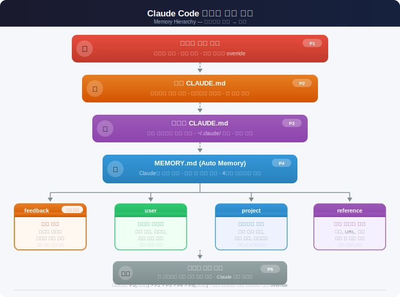
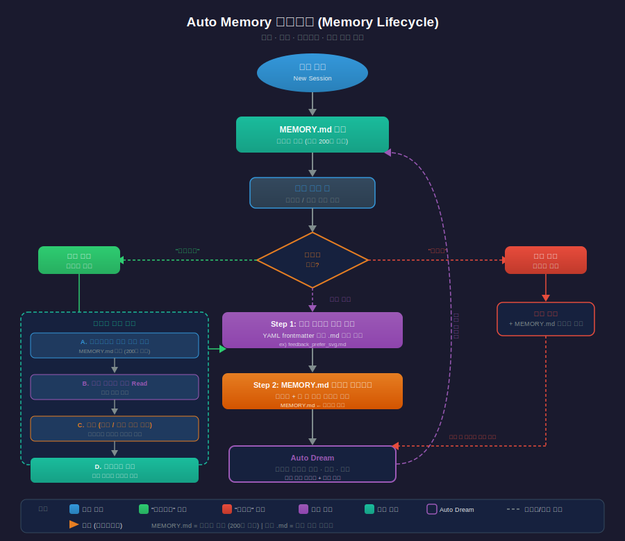

# Claude Code Auto Memory (MEMORY.md)

> `[2] 입문` · 선수 지식: [Claude Code 설정 체계](./claude-code-settings.md)

> Claude Code가 세션 간 학습 내용을 자동으로 축적하는 파일 기반 메모리 시스템. CLAUDE.md가 "사용자가 Claude에게 주는 지시"라면, MEMORY.md는 "Claude가 스스로 기록하는 학습 노트"이다.

`#AutoMemory` `#자동메모리` `#MEMORY.md` `#ClaudeCode` `#메모리시스템` `#세션간학습` `#피드백메모리` `#FeedbackMemory` `#ProjectMemory` `#UserMemory` `#ReferenceMemory` `#CLAUDE.md` `#컨텍스트관리` `#ContextManagement` `#설정계층` `#메모리인덱스` `#AutoDream` `#메모리통합` `#Anthropic` `#CLI` `#개발도구` `#AIAssisted` `#프로젝트메모리` `#학습누적` `#세션관리`

## 왜 알아야 하는가?

- **실무**: Claude Code를 반복 사용할수록 같은 실수를 교정하는 시간이 줄어든다. "DB 테스트에서 mock 쓰지 마"를 매번 말하는 대신, 한 번 피드백하면 다음 세션부터 자동 적용
- **면접**: AI 도구의 "상태 관리"와 "학습 메커니즘"을 이해하는 것은 AI 협업 역량의 핵심. "AI 도구가 프로젝트 맥락을 어떻게 유지하나요?"라는 질문에 구체적으로 답변 가능
- **기반 지식**: CLAUDE.md(지시), MEMORY.md(학습), 대화 컨텍스트(임시) 3계층을 이해해야 Claude Code를 효과적으로 커스터마이징할 수 있다

## 핵심 개념

- **Auto Memory**: Claude가 자동으로 학습 내용을 파일에 기록하는 시스템. 세션이 끝나도 사라지지 않는다
- **MEMORY.md**: 메모리 디렉토리의 인덱스 파일. 매 세션 시작 시 최대 200줄까지 자동 로드된다
- **메모리 타입**: user(사용자 프로필), feedback(교정 기록), project(프로젝트 상황), reference(외부 리소스) 4종류
- **메모리 파일**: 개별 메모리는 YAML frontmatter를 가진 독립 마크다운 파일로 저장된다
- **Auto Dream**: 축적된 메모리를 자동으로 정리·통합하는 후속 기능

## 쉽게 이해하기

**업무 노트 비유**

회사에서 새 팀원(Claude)과 일한다고 생각해보자.

| 상황 | 비유 | Claude Code |
|------|------|-------------|
| 팀 업무 매뉴얼 | "우리 팀은 이렇게 일해" | **CLAUDE.md** — 사용자가 작성하는 규칙 |
| 팀원의 업무 노트 | "아, 이 팀장은 이걸 싫어하는구나" | **MEMORY.md** — Claude가 스스로 기록 |
| 오늘 회의 메모 | "오늘 논의한 내용" | **대화 컨텍스트** — 세션 종료 시 사라짐 |

매뉴얼(CLAUDE.md)은 팀 전체가 공유하지만, 업무 노트(MEMORY.md)는 그 팀원만의 것이다. 시간이 지날수록 노트가 쌓여서 더 효율적으로 일하게 된다.

## 상세 설명

### 저장 경로와 구조

Auto Memory는 프로젝트별로 분리된 디렉토리에 저장된다.

```
~/.claude/projects/<project-path>/memory/
├── MEMORY.md               ← 인덱스 (매 세션 시작 시 200줄까지 로드)
├── user_role.md             ← 사용자 프로필
├── feedback_testing.md      ← 피드백 기록
├── project_build.md         ← 프로젝트 정보
└── reference_docs.md        ← 외부 리소스 위치
```

**프로젝트 경로 결정 방식:**
- Git 저장소 내: 저장소 루트를 프로젝트로 인식 (모든 워크트리가 동일 메모리 공유)
- Git 저장소 외: 작업 디렉토리를 프로젝트로 사용

**왜 이렇게 하는가?**
프로젝트 단위로 메모리를 분리하면, A 프로젝트의 "Spring Boot 사용" 규칙이 B 프로젝트의 "Express.js 사용" 환경을 오염시키지 않는다. Git 워크트리 간 메모리 공유는 같은 저장소의 다른 브랜치에서도 일관된 학습 효과를 보장한다.

### 4가지 메모리 타입



#### 1. feedback — 교정 기록 (가장 중요)

사용자가 Claude의 접근 방식을 교정할 때 자동 저장된다.

```markdown
---
name: DB 테스트 정책
description: 통합 테스트에서 real DB 사용 필수
type: feedback
---

통합 테스트에서 DB mock 금지.
**Why:** mock/prod 괴리로 마이그레이션 장애 발생한 전례
**How to apply:** 테스트 코드 작성 시 H2 또는 실제 DB 연결
```

**저장 트리거:**
- "아니야, X 대신 Y를 사용해"
- "그렇게 하지 마"
- "맞아, 그 방식이 좋아" (성공 패턴도 기록)

#### 2. user — 사용자 프로필

사용자의 역할, 기술 수준, 선호도를 기록한다.

```markdown
---
name: 사용자 역할
description: 시니어 백엔드 개발자, Spring Boot 전문
type: user
---

시니어 백엔드 개발자. Spring Boot/Kotlin 주력.
프론트엔드(React)는 입문 수준 — 프론트 설명 시 백엔드 비유 활용.
```

**왜 중요한가?**
시니어에게 기초 설명을 반복하면 시간 낭비, 주니어에게 고급 개념만 던지면 이해 불가. 사용자 프로필이 있으면 Claude가 설명 수준을 자동 조절한다.

#### 3. project — 프로젝트 상황

코드나 Git 히스토리에서 파악할 수 없는 프로젝트 결정사항을 기록한다.

```markdown
---
name: merge freeze
description: 2026-03-05부터 모바일 릴리즈 위한 merge freeze
type: project
---

2026-03-05부터 merge freeze. 모바일 팀 릴리즈 브랜치 커팅.
**Why:** 모바일 QA 기간 중 코드 변경 최소화
**How to apply:** 비핵심 PR은 freeze 이후로 연기
```

> **주의**: 상대 날짜("이번 목요일")는 반드시 절대 날짜("2026-03-05")로 변환하여 저장한다.

#### 4. reference — 외부 리소스 위치

정보를 찾을 수 있는 외부 시스템의 위치를 기록한다.

```markdown
---
name: 파이프라인 버그 트래커
description: 파이프라인 버그는 Linear INGEST 프로젝트에서 추적
type: reference
---

파이프라인 버그: Linear 프로젝트 "INGEST"
온콜 대시보드: grafana.internal/d/api-latency
```

### 저장과 로드 메커니즘



#### 저장 (2단계)

**Step 1**: 개별 메모리 파일 생성 (YAML frontmatter + 본문)

```markdown
---
name: SVG 우선
description: 다이어그램 생성 시 Mermaid보다 SVG 직접 생성 우선
type: feedback
---

다이어그램은 SVG 직접 생성을 우선 사용.
**Why:** 정밀한 레이아웃 제어와 일관된 스타일 적용
**How to apply:** 다이어그램 생성 요청 시 svg-diagram 스킬 우선 사용
```

**Step 2**: MEMORY.md 인덱스에 포인터 추가

```markdown
# Memory Index

## Feedback
- [SVG 우선](feedback_svg_priority.md) - 다이어그램 생성 시 SVG 직접 생성 우선
```

#### 로드

| 시점 | 동작 | 범위 |
|------|------|------|
| 세션 시작 | MEMORY.md 자동 로드 | 최대 200줄 |
| 필요 시 | 개별 메모리 파일 Read | 전체 내용 |

**왜 200줄 제한인가?**
매 세션마다 모든 메모리를 로드하면 컨텍스트 윈도우를 낭비한다. 인덱스만 먼저 읽고, 관련 있는 메모리만 필요할 때 읽는 "lazy loading" 전략이다.

#### 업데이트와 삭제

- 사용자가 **"기억해줘"** → 즉시 메모리 저장
- 사용자가 **"잊어줘"** → 해당 메모리 파일 삭제 + 인덱스 정리
- Claude가 **오래된 정보 발견** → 자동으로 업데이트 또는 삭제

### 저장하면 안 되는 것

| 항목 | 이유 | 대안 |
|------|------|------|
| 코드 패턴, 아키텍처, 파일 경로 | 코드를 읽으면 파악 가능 | 코드 직접 읽기 |
| Git 히스토리, 변경 이력 | `git log`/`git blame`이 정확 | Git 명령어 |
| 디버깅 해결법 | 코드와 커밋 메시지에 기록됨 | 코드/커밋 참조 |
| CLAUDE.md에 이미 있는 내용 | 중복 | CLAUDE.md 참조 |
| 임시 작업 상태 | 현재 세션에만 유효 | Task/Plan 도구 |
| API 키, 비밀번호 | 보안 위험 | 환경변수, 시크릿 매니저 |

**핵심 원칙**: 코드, Git, 문서에서 파악할 수 있는 정보는 저장하지 않는다. **대화에서만 얻을 수 있는 비명시적 정보**만 저장한다.

## 동작 원리

### CLAUDE.md vs MEMORY.md 우선순위

```
사용자 직접 지시 (대화 중)     ← 최우선
    ↓
로컬 CLAUDE.md (프로젝트)     ← 프로젝트별 규칙
    ↓
글로벌 CLAUDE.md (~/.claude/) ← 공통 규칙
    ↓
MEMORY.md (auto memory)       ← 학습된 맥락 (비강제)
    ↓
시스템 기본 동작               ← 최하위
```

**핵심 차이:**
- CLAUDE.md: **지시(instruction)** — "이렇게 해라"
- MEMORY.md: **맥락(context)** — "이전에 이런 일이 있었다"

CLAUDE.md의 규칙은 강제성이 높고, MEMORY.md의 내용은 참고용 맥락으로 작용한다. 상충 시 CLAUDE.md가 우선한다.

### 메모리 검증 프로세스

메모리에 저장된 정보는 시간이 지나면 부정확해질 수 있다. Claude는 메모리를 활용하기 전에 다음 검증을 수행한다:

| 메모리 내용 | 검증 방법 |
|------------|----------|
| 파일 경로 언급 | 해당 파일이 존재하는지 확인 |
| 함수/플래그 언급 | grep으로 실제 존재 여부 확인 |
| 프로젝트 상태 | git log 또는 코드 읽기로 최신 상태 확인 |

> "메모리에 X가 있다" ≠ "지금 X가 존재한다". 메모리는 기록 시점의 스냅샷이다.

## 트레이드오프

| 장점 | 단점 |
|------|------|
| 세션 간 학습 누적 → 반복 교정 불필요 | 로컬 전용 — 팀 공유 불가 |
| 프로젝트별 맥락 자동 분리 | 200줄 제한으로 대량 정보 저장 어려움 |
| 명시적 지시 없이도 선호도 반영 | 비강제적 — 100% 따르지 않을 수 있음 |
| Git과 독립적 → .gitignore 불필요 | 기기 이동 시 메모리 수동 복사 필요 |

## 트러블슈팅

### 사례 1: 메모리가 적용되지 않는 것 같음

#### 증상
이전 세션에서 "기억해줘"로 저장한 내용을 Claude가 무시하는 것처럼 보임

#### 원인 분석
1. MEMORY.md가 200줄을 초과하여 해당 항목이 잘림
2. 메모리 내용이 CLAUDE.md 규칙과 상충하여 CLAUDE.md가 우선 적용됨
3. 메모리 파일은 존재하지만 인덱스(MEMORY.md)에 포인터가 누락됨

#### 해결 방법
```bash
# 1. MEMORY.md 줄 수 확인
wc -l ~/.claude/projects/<project>/memory/MEMORY.md

# 2. 메모리 디렉토리 전체 확인
ls ~/.claude/projects/<project>/memory/

# 3. /memory 명령으로 직접 확인/편집
# Claude Code 내에서: /memory
```

#### 예방 조치
- MEMORY.md 인덱스는 간결하게 유지 (포인터만)
- 상세 내용은 반드시 개별 파일로 분리
- 중요한 규칙은 MEMORY.md가 아닌 CLAUDE.md에 추가

### 사례 2: 메모리가 과도하게 쌓임

#### 증상
오래된, 부정확한 메모리가 현재 작업에 잘못된 맥락을 제공

#### 원인 분석
프로젝트 구조 변경, 기술 스택 전환 등으로 기존 메모리가 더 이상 유효하지 않음

#### 해결 방법
```bash
# 메모리 디렉토리에서 오래된 파일 직접 삭제
rm ~/.claude/projects/<project>/memory/feedback_old_pattern.md

# MEMORY.md 인덱스에서도 해당 라인 제거
# 또는 "잊어줘: [특정 내용]"으로 Claude에게 요청
```

#### 예방 조치
- 주기적으로 `/memory`로 메모리 감사
- Auto Dream 기능이 활성화되어 있으면 자동 정리 수행

## 실전 활용 가이드

### 1. 효과적인 피드백 저장

```
❌ 비효과적: "다르게 해줘"
✅ 효과적:   "통합 테스트에서 mock 쓰지 마 — 작년에 mock/prod 괴리로 마이그레이션 장애 났어"
```

**이유(Why)**를 함께 말하면 Claude가 유사한 상황에서도 올바르게 판단할 수 있다.

### 2. CLAUDE.md vs MEMORY.md 사용 기준

| 이것을 원한다면 | 여기에 추가 |
|---------------|-----------|
| 모든 세션에서 강제 적용 | **CLAUDE.md** |
| 팀원도 같은 규칙 적용 | **CLAUDE.md** (Git 커밋) |
| Claude의 자연스러운 학습 | **MEMORY.md** (자동) |
| 개인 선호도 반영 | **MEMORY.md** (자동 또는 "기억해줘") |

### 3. 메모리 활성화/비활성화

```json
// settings.json
{
  "autoMemoryEnabled": false  // 비활성화
}
```

```bash
# 환경변수로 비활성화
export CLAUDE_CODE_DISABLE_AUTO_MEMORY=1
```

### 4. 커스텀 메모리 경로

```json
// settings.json
{
  "autoMemoryDirectory": "~/my-custom-memory-dir"
}
```

## 면접 예상 질문

### Q: Claude Code에서 CLAUDE.md와 MEMORY.md의 차이점은?

A: CLAUDE.md는 **사용자가 작성하는 프로젝트 규칙**이고, MEMORY.md는 **Claude가 자동으로 기록하는 학습 내용**이다. CLAUDE.md는 Git에 커밋되어 팀이 공유하고 강제성이 높지만, MEMORY.md는 로컬 전용이며 맥락 참고용이다. 상충 시 CLAUDE.md가 우선한다. 이는 "명시적 규칙 > 암묵적 학습"이라는 설계 원칙을 따른다.

### Q: Auto Memory 시스템에서 200줄 제한이 있는 이유는?

A: 매 세션 시작 시 MEMORY.md가 컨텍스트 윈도우에 주입되는데, 메모리가 너무 크면 실제 작업에 사용할 컨텍스트가 줄어든다. 그래서 인덱스(MEMORY.md)는 200줄로 제한하고, 상세 내용은 개별 파일로 분리하여 필요할 때만 읽는 **lazy loading 전략**을 사용한다. DB의 인덱스-데이터 분리와 같은 원리이다.

### Q: AI 도구가 프로젝트 맥락을 어떻게 유지하나요?

A: Claude Code는 3계층으로 맥락을 관리한다. (1) CLAUDE.md — 사용자가 정의한 규칙으로 가장 강제성이 높다. (2) MEMORY.md — Claude가 세션 간 학습한 내용으로 피드백, 사용자 프로필, 프로젝트 상황 등을 자동 기록한다. (3) 대화 컨텍스트 — 현재 세션의 임시 메모리로 세션 종료 시 사라진다. 이 구조 덕분에 "반복 교정 없이" 점점 더 효율적인 협업이 가능해진다.

## 연관 문서

| 문서 | 연관성 | 난이도 |
|------|--------|--------|
| [Claude Code 설정 체계](./claude-code-settings.md) | 선수 지식 — 설정 계층 이해 | `[3] 중급` |
| [AI 에이전트 메모리 아키텍처](./agent-memory.md) | 관련 개념 — 범용 에이전트 메모리 이론 | `[3] 중급` |
| [Context Engineering](./context-engineering.md) | 기반 이론 — 컨텍스트 관리 전략 | `[3] 중급` |
| [Claude Code 실전 치트시트](./claude-code-practical-cheatsheet.md) | 실무 활용 — 일상 워크플로우 | `[2] 입문` |
| [글로벌 CLAUDE.md 가이드](./GLOBAL-CLAUDE.md) | 관련 설정 — CLAUDE.md 작성법 | `[2] 입문` |

## 참고 자료

- [Claude Code Docs — How Claude remembers your project](https://docs.anthropic.com/en/docs/claude-code/memory)
- [Anthropic Blog — Claude Code Auto Memory](https://www.anthropic.com/blog)
- [Claude Code GitHub — Memory System](https://github.com/anthropics/claude-code)
