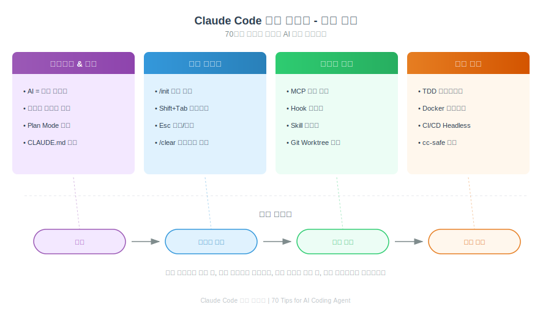
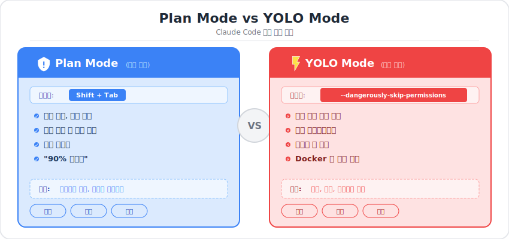
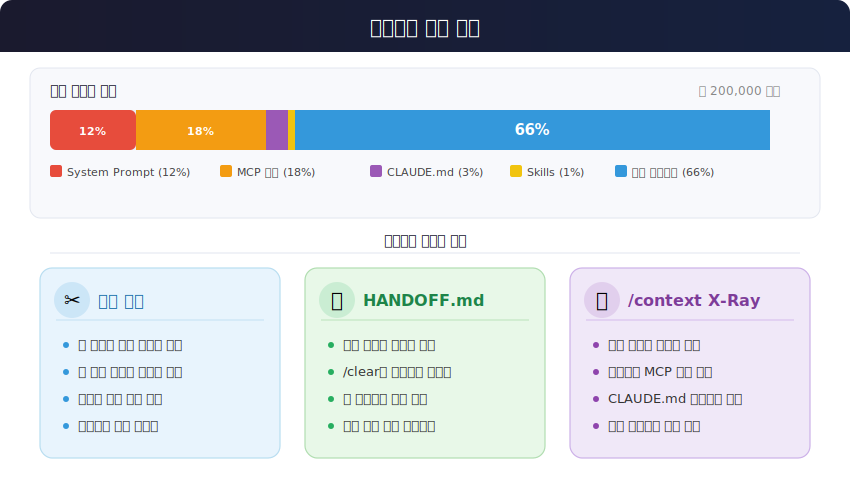
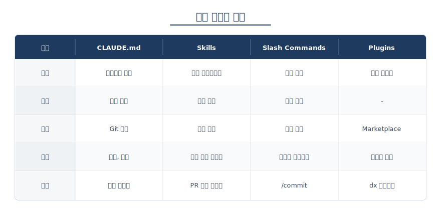
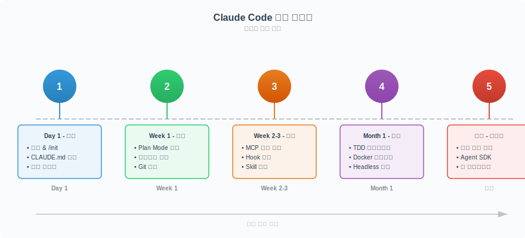

# Claude Code 실전 가이드 - 70가지 팁 핵심 정리

> ykdojo(43개 팁)와 Ado Kukic(31개 팁)의 실전 경험을 기반으로 정리한 Claude Code 완벽 가이드
> 원본: Claude Code 가이드 PDF (Manus AI, 2026)

## 핵심 정리

Claude Code는 Anthropic의 CLI 기반 AI 코딩 에이전트다. 단순한 코드 생성 도구가 아니라, **설계-실행-검증**을 자율적으로 수행하는 에이전틱 개발 도구(Agentic Developer Tool)다. 이 가이드는 70개 팁에서 **당장 실전에 적용 가능한 핵심**만 추려 정리한다.



---

## 목차

1. [마인드셋: AI와 협업하는 법](#1-마인드셋-ai와-협업하는-법)
2. [필수 설정: 시작 전 반드시 해야 할 것](#2-필수-설정-시작-전-반드시-해야-할-것)
3. [단축키 & 명령어 치트시트](#3-단축키--명령어-치트시트)
4. [컨텍스트 관리: 성능의 핵심](#4-컨텍스트-관리-성능의-핵심)
5. [Git & GitHub 워크플로우](#5-git--github-워크플로우)
6. [확장 시스템: MCP, Hooks, Skills](#6-확장-시스템-mcp-hooks-skills)
7. [실전 꿀팁 모음](#7-실전-꿀팁-모음)
8. [보안 & 안전](#8-보안--안전)
9. [학습 로드맵](#9-학습-로드맵)

---

## 1. 마인드셋: AI와 협업하는 법

### 1.1 구체적 지시 = 좋은 결과

AI에게 **"로그인 기능 만들어줘"** 라고 하면 실패한다. **구체적 단계별 지시**가 핵심이다.

```
❌ 나쁜 예시
"로그인 기능 만들어줘"

✅ 좋은 예시 (단계별 지시)
1. "users 테이블을 만들어줘. 필드는 username, email, password_hash, created_at, updated_at"
2. "Drizzle ORM으로 스키마를 정의해줘"
3. "React + TailwindCSS로 로그인 UI를 만들어줘"
4. "/api/auth/login에 POST 엔드포인트를 추가해줘"
5. "JWT 토큰을 localStorage에 저장하는 로직을 추가해줘"
```

> **ykdojo 핵심 조언**: "A → B를 한 번에 가려하지 마라. A → A1 → A2 → A3 → B로 나눠서 가라."

### 1.2 Plan Mode vs YOLO Mode



| 구분 | Plan Mode | YOLO Mode |
|------|-----------|-----------|
| **활성화** | `Shift+Tab` | `--dangerously-skip-permissions` |
| **철학** | 설계 먼저, 실행 나중 | 모든 권한 자동 승인 |
| **성공률** | ~90% (Ado 기준) | 빠르지만 위험 |
| **추천 상황** | 프로덕션, 복잡한 작업 | 실험, Docker 내, 학습 |

> **Ado 핵심 조언**: "90%의 실수는 계획 부족에서 온다. 두 번 생각하고, 한 번 실행하라(Think twice, execute once)."

### 1.3 Vibe Coding vs Deep Dive

ykdojo가 제안한 두 가지 작업 모드:

| Vibe Coding (감각적 코딩) | Deep Dive (깊이 파기) |
|--------------------------|----------------------|
| 빠른 프로토타이핑 | 정밀한 구현 |
| 큰 그림 중심 | 세부 사항 중심 |
| "대충 만들어봐" | "이 부분을 정확히 구현해줘" |
| **용도**: MVP, 실험 | **용도**: 프로덕션, 디버깅 |

> "평소에는 Vibe Coding으로, 중요한 건 Deep Dive로. 상황에 맞게 전환하라."

---

## 2. 필수 설정: 시작 전 반드시 해야 할 것

### 2.1 CLAUDE.md 설정 (/init)

CLAUDE.md는 AI에게 주는 **프로젝트 설명서**다. `/init` 명령으로 자동 생성할 수 있다.

```bash
# 프로젝트 디렉토리에서 실행
> /init
```

자동 생성되는 CLAUDE.md 예시:

```markdown
# Project: E-commerce Platform

## Tech Stack
- **Frontend**: Next.js 14, React 18, TailwindCSS
- **Backend**: Node.js, Express, PostgreSQL

## Coding Standards
- Use TypeScript strict mode
- Prefer server components over client components

## DO NOT
- Never commit `.env` files
- Never use `any` type in TypeScript

## Common Commands
- `npm run dev`: Start development server
- `npm run build`: Build for production
```

**CLAUDE.md 작성 핵심 원칙**:

```
❌ 나쁜 CLAUDE.md (장황한 설명)
"Our authentication system is built using NextAuth.js, which is a
complete authentication solution for Next.js applications. It provides
a flexible and secure way to add authentication..."

✅ 좋은 CLAUDE.md (간결한 규칙)
## Authentication
- NextAuth.js with Credentials provider
- JWT session strategy
- **DO NOT**: Bypass auth checks, expose session secrets
```

> **ykdojo 핵심 조언**: "짧은 CLAUDE.md가 좋은 CLAUDE.md다. 규칙만 적어라. 설명은 쓰지 마라."

### 2.2 Memory 업데이트

CLAUDE.md는 대화 중에도 업데이트할 수 있다:

```
> Update Claude.md: always use bun instead of npm
```

Claude가 CLAUDE.md를 자동으로 수정한다.

### 2.3 셸 별칭(Alias) 설정

`~/.zshrc` 또는 `~/.bashrc`에 추가:

```bash
# Claude Code 핵심 별칭
alias c='claude'              # 기본 실행
alias cc='claude --continue'  # 이전 세션 이어서
alias cr='claude --resume'    # 특정 세션 복원
alias ch='claude --chrome'    # Chrome 연동

# Git 별칭 (Claude와 함께 사용)
alias gb='git branch'
alias gco='git checkout'
alias gst='git status'
```

> **ykdojo**: "자주 쓰는 명령어는 반드시 별칭으로 만들어라. 시간이 곧 돈이다."

---

## 3. 단축키 & 명령어 치트시트


### 3.1 키보드 단축키

| 단축키 | 기능 | 설명 |
|--------|------|------|
| `Esc Esc` | **실행 취소** | Git reset으로 마지막 변경 되돌림 |
| `Ctrl+R` | **히스토리 검색** | 이전 프롬프트 검색 |
| `Ctrl+S` | **프롬프트 스태시** | 입력 중인 프롬프트 임시 저장 |
| `Shift+Tab` | **Plan Mode** | 설계 모드 전환 (실행 전 계획) |
| `Tab` / `Enter` | **제안 수락** | Claude의 제안을 수락 |
| `Ctrl+C` | **작업 중단** | 현재 실행 중지 |
| `Ctrl+B` | **출력 축소** | 긴 출력 접기 |
| `Ctrl+G` | **에디터 열기** | $EDITOR로 프롬프트 편집 |
| `Ctrl+A` | **전체 선택** | 다른 AI로 복사할 때 유용 |

### 3.2 슬래시 명령어

**Tier 1 - 매일 사용하는 필수 명령어:**

| 명령어 | 기능 |
|--------|------|
| `/init` | CLAUDE.md 자동 생성 |
| `/usage` | 토큰 사용량 확인 |
| `/clear` | 대화 초기화 (컨텍스트 리셋) |
| `/context` | 컨텍스트 X-Ray (상세 분석) |
| `/stats` | 세션 통계 |

**Tier 2 - 상황별 유용한 명령어:**

| 명령어 | 기능 |
|--------|------|
| `/clone` | 현재 세션 복제 |
| `/half-clone` | 컨텍스트만 복제 (대화 제외) |
| `/sandbox` | 권한 범위 설정 |
| `/mcp` | MCP 서버 관리 |
| `/export` | 대화 내보내기 (Markdown) |
| `/vim` | Vim 모드 전환 |
| `/permissions` | 권한 설정 |

### 3.3 ! Prefix: 즉시 실행

`!`를 붙이면 Claude를 거치지 않고 **즉시 셸 명령을 실행**한다:

```bash
# 일반 (Claude가 해석 후 실행)
> "git status 보여줘"
Claude: "네, git status를 확인하겠습니다..." [여러 단계]

# ! Prefix (즉시 실행, Claude 개입 없음)
> !git status
[바로 실행, 결과만 표시]
```

> **Ado**: "`!git diff`, `!npm test`, `!docker ps` 같은 간단한 확인은 ! Prefix로 바로 실행하라."

### 3.4 CLI 플래그

```bash
claude -p "prompt"                      # Headless 모드 (파이프라인용)
claude --continue                       # 마지막 세션 이어서
claude --resume                         # 세션 목록에서 선택
claude --resume auth-system-refactor    # 이름으로 세션 복원
claude --chrome                         # Chrome 연동
claude --dangerously-skip-permissions   # YOLO 모드 (주의!)
```

---

## 4. 컨텍스트 관리: 성능의 핵심

> **ykdojo**: "AI는 기억력이 제한적이다. 컨텍스트가 넘치면, AI는 앞에서 한 이야기도 잊는다."



### 4.1 HANDOFF.md 패턴 (가장 중요한 꿀팁)

컨텍스트가 50k 토큰을 넘기면 성능이 저하된다. **HANDOFF.md**로 컨텍스트를 리셋하면서도 작업을 이어갈 수 있다.

```bash
# 1단계: 현재 상태 저장
> "현재까지의 작업 내용을 HANDOFF.md에 정리해줘.
   시도한 것, 성공한 것, 실패한 것, 다음 단계를 포함해줘."

# 2단계: 컨텍스트 초기화
> /clear

# 3단계: 새 컨텍스트에서 이어서 작업
> "@HANDOFF.md 이 문서를 읽고 다음 단계부터 이어서 진행해줘"
```

HANDOFF.md 예시:

```markdown
# 작업: Stripe 결제 연동

## 목표
Stripe Checkout 세션을 통한 결제 기능 구현

## 완료된 작업
- Stripe SDK 설치 및 API 키 설정
- `/api/create-checkout-session` 엔드포인트 생성
- 성공/실패 페이지 생성

## 실패한 시도
- Webhook 서명 검증 실패
- 원인: ngrok 터널 URL 변경

## 다음 단계
1. ngrok 고정 URL 설정
2. Stripe에 Webhook URL 등록
3. `payment_intent.succeeded` 이벤트 핸들러 구현
4. 결제 내역 `payments` 테이블에 저장
```

### 4.2 /context X-Ray 활용

`/context` 명령으로 토큰 사용량을 정확히 파악할 수 있다:

```
Context Usage: 87,432 / 200,000 tokens (43.7%)

Breakdown:
- System Prompt: 10,234 tokens (11.7%)
- MCP Servers: 15,678 tokens (18.0%)
  - supabase-mcp: 8,234 tokens
  - playwright-mcp: 4,123 tokens
  - firecrawl-mcp: 3,321 tokens
- Memory Files (CLAUDE.md): 2,345 tokens (2.7%)
- Conversation History: 57,941 tokens (66.3%)
```

> **Ado**: "10개 MCP를 연결하면 토큰의 80%를 잡아먹을 수 있다. 필요한 것만 연결하라."

### 4.3 분할 정복

한 번에 큰 작업을 시키면 실패한다. **작은 단위로 나눠서 순차 실행**하라:

```
# ❌ 한 번에 모든 것을 요청
"전체 인증 시스템을 만들어줘"

# ✅ 단계별로 나눠서 요청
1단계: "데이터베이스 스키마를 만들어줘"
2단계: "API 엔드포인트를 만들어줘"
3단계: "UI 컴포넌트를 만들어줘"
4단계: "테스트를 작성해줘"
```

> **ykdojo**: "하나의 작업이 끝나면 그 결과를 확인하고, 다음을 지시하라. UI를 먼저 만들라고 하면, Claude가 알아서 뒷단도 만든다."

---

## 5. Git & GitHub 워크플로우

### 5.1 커밋 & PR 자동화

```bash
# 스마트 커밋 (변경 분석 후 메시지 자동 생성)
> "변경사항을 분석하고 적절한 커밋 메시지로 커밋해줘"
# Claude: git diff 분석 → 커밋 메시지 생성 → git commit

# Draft PR 생성
> "변경사항을 정리해서 draft PR을 만들어줘.
   변경 이유, 테스트 방법, 주의사항을 포함해줘."
# Claude: gh pr create --draft --title "..." --body "..."
```

### 5.2 Git Worktree로 병렬 작업

같은 레포지토리에서 **여러 브랜치를 동시에** 작업할 수 있다:

```bash
# Worktree 생성
> "git worktree로 feature/auth 브랜치를 ../myapp-feature-auth에 만들어줘"

# 결과:
# 터미널 1: ~/projects/myapp-feature-auth (인증 기능)
# 터미널 2: ~/projects/myapp-hotfix (핫픽스)
# 터미널 3: ~/projects/myapp (메인 개발)
```

> **ykdojo**: "Worktree는 브랜치 전환 비용을 없앤다. 다만 node_modules는 공유되지 않으므로, 각각 설치해야 한다."

### 5.3 PR 코드 리뷰

```bash
# 1. PR 체크아웃
> "gh pr checkout 123으로 이 PR을 리뷰해줘"

# 2. 코드 분석 요청
> "이 PR의 변경사항을 분석하고, 잠재적 문제를 찾아줘"

# 3. 특정 파일 집중 리뷰
> "src/auth/middleware.ts를 집중 리뷰해줘.
   보안 취약점이 있는지 확인해줘"
```

---

## 6. 확장 시스템: MCP, Hooks, Skills



### 6.1 MCP (Model Context Protocol)

MCP로 Claude에게 **외부 도구를 연결**할 수 있다:

```bash
# Playwright MCP (브라우저 자동화)
claude mcp add -s user playwright npx @playwright/mcp@latest

# Supabase MCP (데이터베이스)
claude mcp add -s user supabase npx @supabase/mcp@latest

# Firecrawl MCP (웹 스크래핑)
claude mcp add -s user firecrawl npx @firecrawl/mcp@latest
```

**실전 활용 예시:**

```bash
# Supabase MCP - 데이터 조회
> "Supabase에서 users 테이블의 최근 7일 가입자 수를 조회해줘"
# Claude: SELECT COUNT(*) FROM users WHERE created_at >= NOW() - INTERVAL '7 days'

# Playwright MCP - E2E 테스트
> "Playwright로 로그인 플로우를 테스트해줘"
# Claude: 1. 브라우저 열기 → 2. 로그인 → 3. 검증 → 4. 스크린샷
```

> **주의**: MCP 서버는 **필요한 것만** 연결하라. 10개 MCP를 연결하면 토큰의 80%를 차지할 수 있다.

### 6.2 Hooks: 자동 안전장치

Hooks는 특정 이벤트에 자동으로 실행되는 셸 명령어다:

| Hook 이벤트 | 실행 시점 |
|-------------|----------|
| `PreToolUse` | 도구 실행 전 |
| `PostToolUse` | 도구 실행 후 |
| `PermissionRequest` | 권한 요청 시 |
| `Notification` | 알림 발생 시 |
| `SubagentStart` | 서브에이전트 시작 시 |
| `SubagentStop` | 서브에이전트 종료 시 |

**실전 예시 - 위험 명령 차단:**

```json
{
  "hooks": {
    "PreToolUse": {
      "command": "bash",
      "args": ["-c", "if echo $TOOL_INPUT | grep -q 'rm -rf /'; then echo 'BLOCKED: Dangerous command'; exit 1; fi"]
    }
  }
}
```

**실전 예시 - tmux 미사용 경고:**

```json
{
  "hooks": {
    "PreToolUse": {
      "command": "bash",
      "args": ["-c", "if [[ $TOOL_NAME == 'Bash' ]] && [[ ! $TMUX ]]; then echo 'Warning: tmux 없이 실행 중'; fi"]
    }
  }
}
```

> **Ado**: "Hooks는 AI의 가드레일이다. 실수로 위험한 명령이 실행되는 것을 막을 수 있다."

### 6.3 Skills: 재사용 가능한 워크플로우

Skills는 Claude가 자동으로 감지하는 **작업 템플릿**이다.

`~/.claude/skills/google-translate/skill.md` 예시:

```markdown
# Google Translate Skill

When the user asks how to pronounce a word in a specific language,
generate a Google Translate link.

## Format
https://translate.google.com/?sl=auto&tl={target_language}&text={word}

## Example
User: "How do you pronounce 'hello' in Korean?"
Response: https://translate.google.com/?sl=auto&tl=ko&text=hello
```

### 6.4 확장 시스템 선택 가이드

```
프로젝트 전체 규칙이 필요하다    → CLAUDE.md
반복되는 워크플로우를 자동화하고 싶다 → Skills
자주 쓰는 프롬프트를 저장하고 싶다  → Slash Commands
올인원 확장 패키지가 필요하다     → Plugins
```

> **ykdojo**: "Skills와 Slash Commands는 비슷하지만 다르다. Skills는 Claude가 자동 감지하고, Slash Commands는 사용자가 직접 호출한다."

---

## 7. 실전 꿀팁 모음

### 7.1 음성 입력으로 3.75배 빠른 작업

ykdojo는 음성 입력으로 분당 40단어 → 150단어(3.75배)로 생산성을 높였다:

| 도구 | 플랫폼 | 특징 |
|------|--------|------|
| SuperWhisper | macOS | 고급, 커스터마이징 |
| MacWhisper | macOS | OpenAI Whisper 기반 |
| Windows Speech Recognition | Windows | 무료, 기본 내장 |

### 7.2 세션 관리

```bash
# 이전 세션 이어서 작업
claude --continue

# 세션에 이름 붙이기
> /rename auth-system-refactor

# 이름으로 세션 복원
claude --resume auth-system-refactor

# 대화 내보내기
> /export
```

> **Ado**: "세션에 의미 있는 이름을 붙여라. `2025-01-15 14:30`보다 `stripe-integration`이 훨씬 낫다."

### 7.3 서브에이전트로 병렬 작업

```bash
# 보안 감사 병렬 실행
> "3개 에이전트로 보안 감사를 병렬로 실행해줘"
# Agent 1: /src/auth 보안 검사
# Agent 2: /src/api 보안 검사
# Agent 3: /src/database 보안 검사
# → 결과 통합
```

### 7.4 Headless 모드로 CI/CD 통합

```bash
# 파이프라인에서 사용
claude -p "Fix the lint errors"

# 파이프 입력
git diff | claude -p "Explain these changes"

# JSON 출력
echo "Review this PR" | claude -p --json
```

**GitHub Actions 예시:**

```yaml
name: Claude Code Review
on:
  pull_request:
    types: [opened, synchronize]

jobs:
  review:
    runs-on: ubuntu-latest
    steps:
      - uses: actions/checkout@v3
      - name: Review PR
        env:
          ANTHROPIC_API_KEY: ${{ secrets.ANTHROPIC_API_KEY }}
        run: |
          git diff origin/main...HEAD | \
          claude -p "Review this PR and identify potential issues" \
          > review.md
```

### 7.5 TDD 워크플로우

```bash
> "TDD 방식으로 사용자 인증 기능을 구현해줘"

# Claude 실행 순서:
# 1. 실패하는 테스트 작성
# 2. git commit -m "Add failing tests for user registration"
# 3. 테스트를 통과하는 최소한의 코드 구현
# 4. 리팩토링
# 5. git commit -m "Implement user registration"
```

> **ykdojo**: "테스트 없이 AI가 생성한 코드를 믿지 마라. 테스트는 AI 코드의 보험이다."

### 7.6 코드 리뷰 자동화

```bash
> "변경사항을 리뷰해줘. 특히 성능, 보안, 가독성을 중점적으로 확인해줘"

# Claude 출력 예시:
# | 파일 | 문제점 | 심각도 |
# |------|--------|--------|
# | auth.ts | "비밀번호 비교가 O(n)이다" | 중간 |
# | api.ts | "SQL 인젝션 가능성" | 높음 |
# | user.ts | null 체크 누락 | 낮음 |
```

### 7.7 realpath로 정확한 파일 지정

상대 경로가 헷갈릴 때 절대 경로를 사용하라:

```bash
# 상대 경로 → 절대 경로 변환
> !realpath ../../config/database.ts
/Users/ykdojo/projects/myapp/config/database.ts

# 절대 경로로 정확히 지정
> "@/Users/ykdojo/projects/myapp/config/database.ts 이 파일을 분석해줘"
```

### 7.8 자동화의 자동화

ykdojo가 제안한 자동화 레벨:

```
Level 0: ChatGPT에 코드 복사/붙여넣기
Level 1: ChatGPT 플러그인으로 파일 직접 수정
Level 2: Claude Code로 직접 작업
Level 3: 별칭(Alias)으로 명령어 단축
Level 4: CLAUDE.md로 규칙 자동 적용
Level 5: Slash Commands로 프롬프트 재사용
Level 6: Skills로 Claude가 자동 감지
Level 7: Hooks로 이벤트 기반 자동화
```

> "대부분의 개발자는 Level 2-3에 머문다. Level 6-7로 올라가면, AI가 알아서 일한다."

---

## 8. 보안 & 안전

### 8.1 cc-safe: 위험 명령 감지

ykdojo가 만든 `cc-safe` 도구로 위험한 승인 설정을 스캔할 수 있다:

```bash
# 설치
npm install -g cc-safe

# 현재 프로젝트 스캔
npx cc-safe .

# 출력 예시:
# Found 3 risky approved commands:
# 1. "Bash(rm -rf dist/)" → Dangerous: rm -rf
# 2. "Bash(sudo npm install -g)" → Dangerous: sudo
# 3. "Bash(curl https://install.sh | sh)" → Dangerous: curl | sh
```

### 8.2 Docker 샌드박스

안전한 YOLO 모드 사용을 위한 Docker 설정:

```dockerfile
FROM ubuntu:22.04

RUN apt-get update && apt-get install -y \
    curl git tmux vim nodejs npm python3

# Claude Code 설치
RUN curl -fsSL https://claude.ai/install.sh | sh

WORKDIR /workspace
CMD ["/bin/bash"]
```

```bash
# 샌드박스 실행
docker run -it --rm \
    -v $(pwd):/workspace \
    -e ANTHROPIC_API_KEY=$ANTHROPIC_API_KEY \
    claude-sandbox

# 안전한 YOLO 모드
claude --dangerously-skip-permissions
```

### 8.3 /sandbox 명령어

```bash
> /sandbox
> "npm install, npm test, git status, git diff만 허용해줘"
# → 이 범위 내에서만 자동 실행 가능
```

> **Ado**: "일반 작업은 Sandbox, 실험적 작업만 YOLO. 프로덕션에서는 절대 YOLO를 쓰지 마라."

---

## 9. 학습 로드맵



### 입문 (1-3일)

| 순서 | 할 일 | 참고 |
|------|-------|------|
| 1 | `/init`으로 CLAUDE.md 생성 | [2.1절](#21-claudemd-설정-init) |
| 2 | 기본 명령어 3개 익히기 (`/usage`, `/clear`, `/stats`) | [3.2절](#32-슬래시-명령어) |
| 3 | 첫 커밋 자동화 시도 | [5.1절](#51-커밋--pr-자동화) |
| 4 | Draft PR 생성해보기 | [5.1절](#51-커밋--pr-자동화) |

### 중급 (3-12일)

| 순서 | 할 일 | 참고 |
|------|-------|------|
| 1 | MCP 서버 1개 연결 (Playwright 추천) | [6.1절](#61-mcp-model-context-protocol) |
| 2 | Hook 3개 이상 설정 | [6.2절](#62-hooks-자동-안전장치) |
| 3 | HANDOFF.md 패턴 실습 | [4.1절](#41-handoffmd-패턴-가장-중요한-꿀팁) |
| 4 | Docker 샌드박스 구성 | [8.2절](#82-docker-샌드박스) |

### 고급 (1개월)

| 순서 | 할 일 | 참고 |
|------|-------|------|
| 1 | 서브에이전트 병렬 활용 | [7.3절](#73-서브에이전트로-병렬-작업) |
| 2 | CI/CD에 Headless 모드 통합 | [7.4절](#74-headless-모드로-cicd-통합) |
| 3 | 커스텀 Skills 5개 이상 작성 | [6.3절](#63-skills-재사용-가능한-워크플로우) |

---

## 참고 자료

### 공식 문서
- [Claude Code 공식 문서](https://code.claude.com/docs/en/overview)
- [Anthropic Engineering 블로그](https://www.anthropic.com/engineering/claude-code-best-practices)
- [Claude Code GitHub](https://github.com/anthropics/claude-code)

### 커뮤니티
- [ykdojo claude-code-tips](https://github.com/ykdojo/claude-code-tips) - 43개 팁, 스크립트, dx 플러그인
- [Ado Advent of Claude 2025](https://adocomplete.com/advent-of-claude-2025/) - 31개 일별 가이드
- [r/ClaudeAI](https://www.reddit.com/r/ClaudeAI/) - Reddit 커뮤니티

### 추천 읽을거리
- [Jacob's Tech Tavern](https://blog.jacobstechtavern.com/p/claude-code-productivity) - "Claude Code로 생산성 50-100% 향상"
- [The Pragmatic Engineer](https://newsletter.pragmaticengineer.com/p/how-claude-code-is-built) - Claude Code 내부 구조
- [Lenny's Newsletter](https://www.lennysnewsletter.com/p/everyone-should-be-using-claude-code) - Claude Code 필수 사용 이유

---

## 쉽게 이해하기

> Claude Code를 **요리사의 조수**에 비유할 수 있다.
>
> - **CLAUDE.md** = 레시피북 (이 주방의 규칙과 재료 목록)
> - **Plan Mode** = 레시피를 먼저 읽고 재료를 준비하는 것
> - **YOLO Mode** = 레시피 없이 감으로 요리하는 것
> - **HANDOFF.md** = 교대 근무 인수인계 문서
> - **MCP** = 조수에게 새로운 도구를 쥐어주는 것 (믹서기, 오븐 등)
> - **Hooks** = "고기를 썰기 전에 반드시 손을 씻어라" 같은 자동 규칙
> - **컨텍스트** = 조수의 기억력 (한 번에 너무 많이 시키면 잊어버린다)

---

## 면접 질문

### Q1. Claude Code에서 컨텍스트 관리가 왜 중요한가?

Claude Code는 200,000 토큰의 컨텍스트 윈도우를 가진다. System Prompt, MCP 서버 정의, CLAUDE.md, 대화 히스토리 등이 이 공간을 공유한다. 컨텍스트가 넘치면 **컨텍스트 드리프트(Context Drift)**가 발생하여 이전 지시를 잊거나 정확도가 39%까지 떨어질 수 있다. HANDOFF.md 패턴, `/clear`, `/context` X-Ray 등으로 관리해야 한다.

### Q2. Plan Mode와 YOLO Mode의 차이와 적절한 사용 시나리오는?

**Plan Mode**(Shift+Tab)는 코드 변경 전 설계를 먼저 수행하고 사용자 승인을 받는 안전한 모드다. 프로덕션 코드, 복잡한 리팩토링에 적합하다. **YOLO Mode**(`--dangerously-skip-permissions`)는 모든 권한을 자동 승인하여 빠르게 작업하지만 위험하다. Docker 컨테이너 내부, 실험적 프로젝트, 학습용으로만 사용해야 한다.

### Q3. CLAUDE.md, Skills, Slash Commands, Plugins의 차이는?

- **CLAUDE.md**: 프로젝트 전체에 적용되는 규칙/설정. 자동 로드됨
- **Skills**: 특정 워크플로우를 자동화. Claude가 자동 감지
- **Slash Commands**: 자주 쓰는 프롬프트를 명령어로 저장. 사용자가 수동 호출
- **Plugins**: 위 모든 것을 통합한 올인원 패키지. Marketplace로 공유
