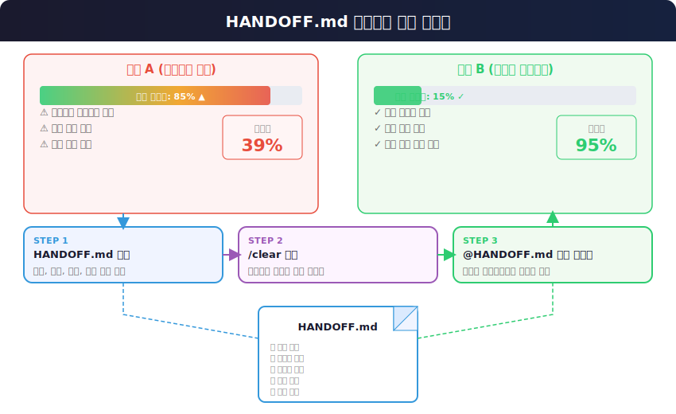

# HANDOFF.md 컨텍스트 관리

> `[3] 중급` · 선수 지식: [Claude Code Workflow](./claude-code-workflow.md), [Context Engineering](./context-engineering.md)

> 장시간 AI 에이전트 작업에서 컨텍스트 윈도우 한계를 극복하는 세션 인수인계 패턴

`#HANDOFF` `#컨텍스트관리` `#ContextManagement` `#ContextWindow` `#컨텍스트윈도우` `#세션관리` `#SessionManagement` `#ClaudeCode` `#클로드코드` `#컨텍스트리셋` `#ContextReset` `#인수인계` `#작업연속성` `#토큰관리` `#TokenManagement`

## 왜 알아야 하는가?

- **실무**: 장시간 작업 시 AI 에이전트의 성능 저하를 방지하고, 작업 연속성을 보장한다
- **효율성**: 컨텍스트 윈도우를 효율적으로 관리하여 AI 에이전트의 응답 품질을 일정하게 유지한다
- **기반 지식**: Context Engineering의 핵심 실천 패턴으로, AI 에이전트 협업의 기본기다

## 핵심 개념

- **컨텍스트 윈도우 (Context Window)**: LLM이 한 번에 처리할 수 있는 토큰의 최대 크기. Claude는 약 200,000 토큰
- **컨텍스트 드리프트 (Context Drift)**: 대화가 길어질수록 초기 지시를 잊거나 정확도가 떨어지는 현상
- **HANDOFF.md**: 현재 작업 상태를 구조화하여 기록하는 인수인계 문서. 세션 간 작업 연속성을 보장한다
- **컨텍스트 리셋 (Context Reset)**: `/clear`로 대화를 초기화하여 신선한 컨텍스트에서 작업을 재개하는 기법

## 쉽게 이해하기

**비유: 병원 교대 근무 인수인계**

24시간 운영되는 병원을 떠올려 보자. 의사가 12시간 교대 근무를 한다.

- **컨텍스트 윈도우** = 의사의 집중력. 12시간 연속 근무하면 집중력이 떨어진다
- **컨텍스트 드리프트** = 피곤해진 의사가 초기 환자 정보를 잊어버리는 것
- **HANDOFF.md** = 교대 시 다음 의사에게 전달하는 인수인계 차트
- **컨텍스트 리셋** = 충분히 쉬고 다음 교대 의사가 신선한 상태로 근무 시작

인수인계 차트 없이 교대하면? 다음 의사가 처음부터 환자를 파악해야 한다.
인수인계 차트가 있으면? "이 환자는 어떤 상태이고, 어떤 처치를 했고, 다음에 무엇을 해야 하는지" 바로 파악할 수 있다.

HANDOFF.md도 같다. AI 에이전트가 "피곤해지기 전에" 현재 상태를 기록하고, 신선한 세션에서 이어받는 것이다.

## 상세 설명

### 1. 컨텍스트 윈도우의 한계

Claude Code는 약 200,000 토큰의 컨텍스트 윈도우를 가진다. 이 공간에는 다음이 모두 포함된다:

```
┌──────────────────────────────────────────────┐
│          컨텍스트 윈도우 (200K 토큰)            │
├──────────────────────────────────────────────┤
│                                               │
│  ┌──────────────────────┐  약 10~20K         │
│  │  시스템 프롬프트       │                    │
│  │  + CLAUDE.md          │                    │
│  │  + MCP 서버 정의       │                    │
│  └──────────────────────┘                     │
│  ┌──────────────────────┐  계속 증가 ↑       │
│  │  대화 히스토리         │                    │
│  │  (질문 + 응답 누적)    │                    │
│  │  + 파일 읽기 결과      │                    │
│  │  + 도구 실행 결과      │                    │
│  └──────────────────────┘                     │
│  ┌──────────────────────┐  모델 출력         │
│  │  현재 응답 생성 공간    │                    │
│  └──────────────────────┘                     │
│                                               │
└──────────────────────────────────────────────┘
```

**왜 문제인가?**

대화가 길어지면 대화 히스토리가 계속 쌓인다. 50K 토큰을 넘기면:
- 초기 지시를 잊는 **컨텍스트 드리프트**가 발생한다
- 응답 정확도가 **39%까지** 떨어질 수 있다 (Anthropic 연구)
- 중복 작업, 이전에 시도한 실패 방법을 반복하는 문제가 생긴다

```
토큰 사용량과 성능의 관계:

  정확도
  100% ┤ ████████
       │ █████████████
   80% ┤ ████████████████
       │ ███████████████████
   60% ┤ ████████████████████████
       │ █████████████████████████████
   40% ┤ ████████████████████████████████████
       │
   20% ┤
       └──────────────────────────────────────
        0K    30K    50K    80K    120K   200K
                    토큰 사용량

        ◀─── 쾌적 구간 ───▶◀── 성능 저하 ──▶
```

### 2. HANDOFF.md 작성 절차

HANDOFF 패턴은 3단계로 진행한다:

**1단계: 저장 - 현재 상태를 HANDOFF.md에 기록**

```
> "지금까지의 작업 내용을 HANDOFF.md 파일로 정리해줘.
   다음 에이전트가 이 파일만 읽고 작업을 이어갈 수 있도록
   시도한 것, 성공한 것, 실패한 것, 다음 단계를 명확히 작성해줘."
```

**2단계: 초기화 - 컨텍스트 리셋**

```
> /clear
```

**3단계: 재시작 - 새 세션에서 이어서 작업**

```
> "@HANDOFF.md 이 문서를 읽고 다음 단계부터 이어서 진행해줘"
```

**왜 이렇게 하는가?**

- 1단계에서 AI가 스스로 작업 상태를 정리하면, 사람이 정리하는 것보다 누락이 적다
- 2단계의 `/clear`로 컨텍스트 윈도우를 완전히 비우면 새 세션처럼 시작한다
- 3단계에서 `@` 참조로 파일을 직접 읽으면 가장 효율적으로 컨텍스트를 주입한다

### 3. HANDOFF.md에 포함해야 할 내용

```markdown
# HANDOFF: {작업 제목}

## 작업 목표
{이 작업이 최종적으로 달성해야 하는 것}

## 현재 상태
{전체 진행률과 현재 위치}

## 완료된 작업
- [x] {완료 항목 1} - {결과 요약}
- [x] {완료 항목 2} - {결과 요약}

## 실패한 시도 (중요!)
- {시도 내용} → 실패 이유: {원인}
- {시도 내용} → 실패 이유: {원인}

## 다음 단계
- [ ] {다음 할 일 1} - {접근 방법 힌트}
- [ ] {다음 할 일 2} - {접근 방법 힌트}

## 관련 파일
- `path/to/file.ts` - {역할 설명}
- `path/to/config.json` - {수정 내용}

## 주의사항
- {다음 에이전트가 반드시 알아야 할 제약사항}
```

**각 섹션이 필요한 이유:**

| 섹션 | 목적 | 없으면 생기는 문제 |
|------|------|-------------------|
| 작업 목표 | 방향 설정 | 다음 세션이 엉뚱한 방향으로 진행 |
| 완료된 작업 | 중복 방지 | 이미 한 작업을 다시 수행 |
| **실패한 시도** | **같은 실수 방지** | **동일한 실패를 반복** |
| 다음 단계 | 즉시 착수 가능 | 처음부터 분석해야 함 |
| 관련 파일 | 탐색 시간 절약 | 파일을 다시 찾아야 함 |
| 주의사항 | 함정 회피 | 알려진 제약사항에 빠짐 |

> **핵심**: "실패한 시도" 섹션이 가장 중요하다. 이것이 없으면 새 세션이 동일한 실패를 반복한다.

### 4. 실전 활용 시나리오

#### 시나리오 1: 장시간 기능 개발

대규모 기능을 단계별로 나눠 작업할 때:

```
세션 1: DB 스키마 설계 + 엔티티 생성
  → HANDOFF.md에 스키마 구조, 결정 사항 기록
  → /clear

세션 2: API 엔드포인트 구현
  → @HANDOFF.md 읽고 API 개발
  → HANDOFF.md 업데이트
  → /clear

세션 3: 프론트엔드 연동 + 테스트
  → @HANDOFF.md 읽고 마무리
```

#### 시나리오 2: 복잡한 에러 디버깅

디버깅이 길어져 컨텍스트가 오염될 때:

```
세션 1: 에러 재현 + 원인 분석 시도
  → 시도한 방법과 결과를 HANDOFF.md에 기록
  → 특히 "실패한 시도"를 상세히 기록
  → /clear

세션 2: 실패한 방법을 피하고 새로운 접근
  → @HANDOFF.md로 이미 실패한 경로를 인지
  → 다른 접근법으로 해결
```

#### 시나리오 3: 팀 인수인계

다른 팀원이 같은 프로젝트에서 Claude Code를 사용할 때:

```
개발자 A: 기능 구현 중 퇴근
  → HANDOFF.md에 현재 진행 상태 기록
  → git commit & push

개발자 B: 다음 날 출근
  → @HANDOFF.md 읽고 이어서 작업
  → 맥락 파악 시간 대폭 절약
```

### 5. 슬래시 커맨드로 자동화하기

HANDOFF.md 작성을 매번 수동으로 하면 번거롭다. 슬래시 커맨드로 자동화할 수 있다.

`.claude/commands/handoff.md` 파일을 생성하면 `/handoff`로 즉시 실행 가능하다:

```bash
# 사용법
> /handoff
```

실행하면 AI 에이전트가 자동으로:
1. 현재 작업 목표를 파악하여 기록
2. 완료된 작업과 실패한 시도를 분류
3. 다음 단계와 관련 파일을 정리
4. HANDOFF.md 파일을 생성/업데이트
5. `/clear` 실행 안내

> **참고**: 슬래시 커맨드 생성 방법은 [Claude Code Slash Command](./claude-code-slash-command.md)를 참고

### 6. 효과 및 측정 지표

HANDOFF 패턴을 적용했을 때의 효과:

| 지표 | HANDOFF 미적용 | HANDOFF 적용 | 개선 |
|------|---------------|-------------|------|
| 세션 간 맥락 유지율 | ~30% | ~90% | 3배 향상 |
| 동일 실패 반복률 | 높음 | 거의 없음 | 대폭 감소 |
| 새 세션 착수 시간 | 5~10분 (재분석) | 1~2분 (읽기만) | 5배 단축 |
| 응답 정확도 유지 | 점진적 하락 | 일정 유지 | 안정화 |

**HANDOFF를 사용해야 하는 시점:**

- `/usage`로 확인한 토큰 사용량이 **50K 이상**일 때
- AI의 응답이 이전 맥락을 놓치기 시작할 때
- 작업을 중단하고 나중에 이어해야 할 때
- 복잡한 디버깅이 3회 이상 실패했을 때



## 트레이드오프

| 장점 | 단점 |
|------|------|
| 컨텍스트 드리프트 방지 | HANDOFF 작성에 약간의 시간 소요 |
| 세션 간 작업 연속성 보장 | 파일 관리가 필요 (작업 완료 후 삭제) |
| 팀 간 인수인계 가능 | 지나치게 자주 사용하면 오히려 비효율 |
| 실패 패턴 반복 방지 | HANDOFF 품질에 따라 효과 차이 |

## 면접 예상 질문

- Q: AI 에이전트에서 컨텍스트 관리가 왜 중요한가?
  - A: LLM은 고정된 컨텍스트 윈도우 안에서 동작하기 때문에, 대화가 길어지면 초기 정보를 잊는 컨텍스트 드리프트가 발생한다. 특히 시스템 프롬프트, MCP 정의, 대화 히스토리가 같은 윈도우를 공유하므로, 유효한 컨텍스트 공간이 예상보다 적다. 이를 관리하지 않으면 응답 품질이 39%까지 떨어질 수 있어, HANDOFF 같은 체계적 컨텍스트 관리 전략이 필수다.

- Q: HANDOFF.md에서 "실패한 시도"를 기록하는 이유는?
  - A: AI 에이전트는 컨텍스트가 리셋되면 이전 세션의 실패 경험을 잊는다. "실패한 시도"를 명시적으로 기록하지 않으면 새 세션에서 동일한 접근을 반복하여 시간을 낭비한다. 이는 사람의 인수인계에서도 마찬가지로, "이미 시도했지만 안 되는 방법"을 전달하는 것이 "할 일 목록"만큼 중요하다.

- Q: HANDOFF 패턴과 CLAUDE.md의 차이점은?
  - A: CLAUDE.md는 프로젝트의 영구적인 규칙과 설정을 담는 문서로, 모든 세션에서 자동으로 읽힌다. 반면 HANDOFF.md는 특정 작업의 임시 상태를 기록하는 문서로, 작업 완료 후 삭제한다. CLAUDE.md가 "이 주방의 규칙"이라면, HANDOFF.md는 "지금 하고 있는 요리의 현재 상태"다.

## 연관 문서

| 문서 | 연관성 | 난이도 |
|------|--------|--------|
| [Claude Code Workflow](./claude-code-workflow.md) | 세션 관리, 병렬 작업의 기본 (선수 지식) | Intermediate |
| [Context Engineering](./context-engineering.md) | 컨텍스트 설계의 이론적 배경 (선수 지식) | Advanced |
| [Claude Code 실전 가이드](./claude-code-guide.md) | HANDOFF 패턴의 간략 소개 (4.1절) | Intermediate |
| [Claude Code Slash Command](./claude-code-slash-command.md) | /handoff 커맨드 생성 방법 | Intermediate |
| [Claude Code Sub Agent](./claude-code-sub-agent.md) | Sub Agent 간 컨텍스트 전달 패턴 | Advanced |

## 참고 자료

- [Anthropic - Claude Code Best Practices](https://docs.anthropic.com/en/docs/claude-code/overview)
- [Context Engineering - Langtrace Blog](https://www.langtrace.ai/blog/what-is-context-engineering)
- Claude Code 실전 가이드 PDF (Manus AI, 2026)
