# Claude Code Hook

> `[3] 중급` · 선수 지식: [MCP](./mcp.md)

> `Trend` 2025

> AI 에이전트의 생명주기(lifecycle)에서 특정 시점에 자동 실행되는 사용자 정의 셸 명령어 시스템

`#ClaudeCode` `#Hook` `#훅` `#Hooks` `#이벤트훅` `#EventHook` `#라이프사이클` `#Lifecycle` `#자동화` `#Automation` `#Anthropic` `#AI도구` `#CLI` `#셸스크립트` `#ShellScript` `#PreToolUse` `#PostToolUse` `#Notification` `#Stop` `#파일보호` `#자동포맷팅` `#코드검증` `#settings.json` `#결정적제어` `#트리거` `#Trigger` `#개발환경`

## 왜 알아야 하는가?

- **실무**: AI 에이전트의 동작을 코드로 제어하여 민감한 파일 보호, 자동 포맷팅 등 일관된 개발 환경 구축
- **면접**: AI 도구 활용 능력과 자동화 역량을 보여주는 실질적 사례
- **기반 지식**: Claude Code 고급 기능 활용의 필수 요소

## 핵심 개념

- **자동 실행 명령어**: 특정 이벤트(Tool 호출, 세션 시작 등) 시점에 자동으로 트리거되는 셸 스크립트
- **결정적 제어**: LLM의 제안에 의존하지 않고, 실제 코드로 규칙을 강제 실행
- **Tool 호출 차단/승인**: Exit code를 통해 특정 작업을 차단하거나 허용
- **JSON 기반 구조화 제어**: stdout으로 JSON을 출력하여 세밀한 동작 제어 가능
- **다중 계층 설정**: 사용자 전역, 프로젝트, 로컬 설정 계층으로 유연한 구성

## 쉽게 이해하기

**Hook**을 **건물의 보안 시스템**에 비유할 수 있습니다.

건물에 들어가려면 여러 보안 체크포인트를 통과해야 합니다:
- **입구 게이트** (PreToolUse): 들어가기 전 신분 확인
- **출구 게이트** (PostToolUse): 나갈 때 반출품 검사
- **알림 시스템** (Notification): 특이사항 발생 시 경비실에 알림

Claude Code에서 Hook도 마찬가지입니다. Claude가 파일을 수정하려 할 때:

```
[Claude] "이 파일 수정할게요"
    ↓
[PreToolUse Hook] ".env 파일인가? → 차단!"
    ↓
[Claude] "알겠습니다. .env 파일은 수정하지 않겠습니다"
```

Hook이 없다면 Claude에게 "민감한 파일 수정하지 마"라고 말해도 LLM이 실수할 수 있습니다. 하지만 Hook은 **코드로 강제**하므로 100% 확실하게 차단됩니다.

## 상세 설명

### Hook 이벤트 종류

Claude Code는 다양한 생명주기 이벤트에 Hook을 연결할 수 있습니다.

| 이벤트 | 실행 시점 | 주요 용도 |
|--------|----------|----------|
| **PreToolUse** | Tool 실행 전 | 입력 검증, 차단, 로깅 |
| **PostToolUse** | Tool 완료 후 | 자동 포맷팅, 후처리 |
| **Notification** | 알림 발송 시 | 커스텀 알림 처리 |
| **UserPromptSubmit** | 사용자 입력 시 | 프롬프트 검증, 컨텍스트 추가 |
| **PermissionRequest** | 권한 요청 시 | 자동 승인/거부 |
| **SessionStart** | 세션 시작 시 | 환경 설정, 의존성 확인 |
| **SessionEnd** | 세션 종료 시 | 정리 작업, 로깅 |
| **Stop** | Claude 응답 완료 시 | 종료 결정 제어 |
| **SubagentStop** | Subagent 완료 시 | Subagent 종료 제어 |
| **PreCompact** | Context 압축 전 | 정리 작업 |

### 설정 파일 위치 계층

Hook 설정은 여러 위치에 저장할 수 있으며, 우선순위가 있습니다.

| 우선순위 | 위치 | 용도 | Git 공유 |
|---------|------|------|---------|
| 1 | `~/.claude/settings.json` | 사용자 전역 설정 | X |
| 2 | `.claude/settings.json` | 프로젝트 공통 설정 | O |
| 3 | `.claude/settings.local.json` | 로컬 프로젝트 설정 | X |

**왜 계층 구조인가?**

- **전역 설정**: 모든 프로젝트에 적용할 개인 규칙 (예: 항상 로깅)
- **프로젝트 설정**: 팀 전체가 따라야 할 규칙 (예: 특정 파일 보호)
- **로컬 설정**: 개인 환경에 맞는 오버라이드 (예: 로컬 경로)

### Hook 설정 구조

```json
{
  "hooks": {
    "PreToolUse": [
      {
        "matcher": "Bash",
        "hooks": [
          {
            "type": "command",
            "command": "your-script.sh",
            "timeout": 30
          }
        ]
      }
    ]
  }
}
```

| 필드 | 설명 | 필수 |
|------|------|------|
| `matcher` | Tool 이름 패턴 (정규식 지원) | O |
| `type` | 항상 `"command"` | O |
| `command` | 실행할 셸 명령어 | O |
| `timeout` | 타임아웃 (초, 기본 60) | X |

### Matcher 패턴

Matcher로 특정 Tool에만 Hook을 적용할 수 있습니다.

| 패턴 | 매칭 대상 | 예시 |
|------|----------|------|
| `Bash` | Bash Tool만 | 셸 명령어 검증 |
| `Edit\|Write` | Edit 또는 Write | 파일 수정 검증 |
| `mcp__memory__.*` | MCP 메모리 도구 | MCP 특정 도구 |
| `*` 또는 `""` | 모든 Tool | 전체 로깅 |

**주의**: Matcher는 대소문자를 구분합니다.

### Exit Code 처리

Hook의 종료 코드로 동작을 제어합니다.

| Exit Code | 의미 | 동작 |
|-----------|------|------|
| `0` | 성공 | Tool 실행 계속, stdout은 verbose 모드에 표시 |
| `2` | 차단 | Tool 실행 중단, stderr가 Claude에 피드백 |
| 기타 | 비차단 오류 | Tool 실행 계속, stderr는 verbose 모드에 표시 |

**Exit code 2가 핵심인 이유**

Exit code 2는 "이 작업을 수행하면 안 됩니다"라는 **강제 차단** 신호입니다. Claude는 stderr 메시지를 읽고 대안을 찾습니다.

### JSON 출력을 통한 구조화 제어

Exit code 0에서 stdout으로 JSON을 출력하면 세밀한 제어가 가능합니다.

```json
{
  "continue": true,
  "stopReason": "작업 완료",
  "suppressOutput": false,
  "systemMessage": "추가 컨텍스트 정보",
  "hookSpecificOutput": {
    "permissionDecision": "allow",
    "permissionDecisionReason": "안전한 작업으로 판단"
  }
}
```

## 동작 원리

### Hook 실행 흐름



### Hook에 전달되는 입력 데이터

Hook은 stdin으로 JSON 데이터를 받습니다.

```json
{
  "tool_name": "Edit",
  "tool_input": {
    "file_path": "/path/to/file.js",
    "old_string": "...",
    "new_string": "..."
  }
}
```

### 환경 변수

Hook 실행 시 사용 가능한 환경 변수:

| 변수 | 설명 |
|------|------|
| `$CLAUDE_PROJECT_DIR` | 프로젝트 루트 경로 |
| `$CLAUDE_ENV_FILE` | 환경 변수 지속용 파일 경로 (SessionStart) |
| `$CLAUDE_CODE_REMOTE` | 원격 실행 여부 |

## 예제 코드

### 기본 예제: Bash 명령 로깅

모든 Bash 명령을 로그 파일에 기록합니다.

```json
{
  "hooks": {
    "PreToolUse": [
      {
        "matcher": "Bash",
        "hooks": [
          {
            "type": "command",
            "command": "jq -r '.tool_input.command' >> ~/.claude/bash-log.txt"
          }
        ]
      }
    ]
  }
}
```

### 민감한 파일 보호

`.env`, `package-lock.json` 등의 수정을 차단합니다.

```json
{
  "hooks": {
    "PreToolUse": [
      {
        "matcher": "Edit|Write",
        "hooks": [
          {
            "type": "command",
            "command": "python3 -c \"import json,sys; d=json.load(sys.stdin); p=d.get('tool_input',{}).get('file_path',''); sys.exit(2 if any(x in p for x in ['.env','package-lock.json','.git/']) else 0)\""
          }
        ]
      }
    ]
  }
}
```

### 자동 코드 포맷팅 (PostToolUse)

TypeScript 파일 수정 후 자동으로 Prettier 실행:

```json
{
  "hooks": {
    "PostToolUse": [
      {
        "matcher": "Edit|Write",
        "hooks": [
          {
            "type": "command",
            "command": "jq -r '.tool_input.file_path' | xargs -I {} sh -c 'echo {} | grep -q \"\\.ts$\" && npx prettier --write {}'"
          }
        ]
      }
    ]
  }
}
```

### 외부 스크립트 활용

복잡한 로직은 별도 스크립트로 분리합니다.

**.claude/hooks/validate-bash.py:**

```python
#!/usr/bin/env python3
import json
import re
import sys

BLOCKED_PATTERNS = [
    (r"\brm\s+-rf\s+/", "루트 삭제 명령 차단"),
    (r"\bsudo\b", "sudo 명령 차단"),
]

try:
    data = json.load(sys.stdin)
    command = data.get("tool_input", {}).get("command", "")

    for pattern, message in BLOCKED_PATTERNS:
        if re.search(pattern, command):
            print(message, file=sys.stderr)
            sys.exit(2)

    sys.exit(0)
except Exception as e:
    print(f"Hook 오류: {e}", file=sys.stderr)
    sys.exit(1)
```

**settings.json:**

```json
{
  "hooks": {
    "PreToolUse": [
      {
        "matcher": "Bash",
        "hooks": [
          {
            "type": "command",
            "command": "\"$CLAUDE_PROJECT_DIR\"/.claude/hooks/validate-bash.py"
          }
        ]
      }
    ]
  }
}
```

### SessionStart로 환경 설정

세션 시작 시 Node.js 버전 설정:

**.claude/hooks/setup-session.sh:**

```bash
#!/bin/bash

# nvm으로 Node 버전 설정
source ~/.nvm/nvm.sh
nvm use 20

# 환경 변수 지속
if [ -n "$CLAUDE_ENV_FILE" ]; then
  echo 'export NODE_ENV=development' >> "$CLAUDE_ENV_FILE"
fi

exit 0
```

**settings.json:**

```json
{
  "hooks": {
    "SessionStart": [
      {
        "matcher": "startup",
        "hooks": [
          {
            "type": "command",
            "command": "\"$CLAUDE_PROJECT_DIR\"/.claude/hooks/setup-session.sh"
          }
        ]
      }
    ]
  }
}
```

## 트레이드오프

| 장점 | 단점 |
|------|------|
| 규칙을 코드로 100% 강제 가능 | 스크립트 오류 시 전체 워크플로우 중단 |
| LLM 실수에 의존하지 않는 확실한 제어 | 복잡한 Hook은 디버깅 어려움 |
| 자동 포맷팅/린팅으로 코드 품질 유지 | 과도한 Hook은 응답 속도 저하 |
| 민감한 파일/명령어 완벽 보호 | 초기 설정 학습 곡선 존재 |
| 팀 전체에 일관된 규칙 적용 | Exit code 관리 실수 가능성 |

## 면접 예상 질문

### Q: Hook과 CLAUDE.md 지침의 차이점은 무엇인가요?

A: 핵심 차이는 **강제력**입니다.

- **CLAUDE.md**: Claude에게 "이렇게 해주세요"라고 **요청**하는 것입니다. LLM이 대부분 따르지만, 때로는 무시하거나 실수할 수 있습니다.
- **Hook**: 특정 동작을 **코드로 강제**합니다. Exit code 2를 반환하면 Claude가 아무리 원해도 해당 작업을 수행할 수 없습니다.

**사용 가이드라인:**
- 일반적인 스타일 가이드 → CLAUDE.md
- 절대로 위반하면 안 되는 규칙 → Hook

### Q: Exit code 2와 다른 에러 코드의 차이는?

A: **Exit code 2는 "차단"**, 나머지는 **"경고"** 입니다.

| Exit Code | 의미 | Claude 동작 |
|-----------|------|------------|
| 0 | 성공 | 작업 진행 |
| 2 | 차단 | 작업 중단, stderr 읽고 대안 모색 |
| 1, 3+ | 경고 | 작업 진행, 로그에만 기록 |

**왜 2인가?** Unix 관례에서 exit code 2는 "misuse of command"를 의미합니다. Hook에서는 이를 "이 작업은 허용되지 않음"으로 재해석합니다.

### Q: Hook 스크립트가 실패하면 어떻게 되나요?

A: Exit code에 따라 다릅니다.

- **Exit 2**: Tool 호출이 차단되고, Claude는 stderr 메시지를 받아 대안을 찾습니다.
- **Exit 1, 3+**: 경고로 처리되어 Tool 호출은 계속 진행됩니다. `--debug` 모드에서 오류 확인 가능합니다.
- **타임아웃**: 기본 60초 후 Hook이 종료되고, 비차단 오류로 처리됩니다.

**베스트 프랙티스**: Hook 스크립트는 항상 try-catch로 감싸고, 예상치 못한 오류는 exit 1로 처리하여 작업이 중단되지 않도록 합니다.

### Q: 여러 Hook이 같은 이벤트에 등록되면?

A: **병렬 실행**됩니다.

동일 이벤트의 여러 Hook은 동시에 실행됩니다. 하나라도 exit 2를 반환하면 Tool 호출이 차단됩니다.

```json
{
  "hooks": {
    "PreToolUse": [
      { "matcher": "Bash", "hooks": [{ "command": "script1.sh" }] },
      { "matcher": "Bash", "hooks": [{ "command": "script2.sh" }] }
    ]
  }
}
```

위 설정에서 `script1.sh`와 `script2.sh`는 동시에 실행됩니다.

## 연관 문서

| 문서 | 연관성 | 난이도 |
|------|--------|--------|
| [MCP](./mcp.md) | 선수 지식 - AI 에이전트 기초 | [2] 입문 |
| [Skill](./claude-code-skill.md) | 관련 개념 - 커스텀 워크플로우 | [3] 중급 |
| [Sub Agent](./claude-code-sub-agent.md) | 심화 학습 - 병렬 작업 위임 | [4] 심화 |

## 참고 자료

- [Claude Code Hooks Documentation](https://docs.anthropic.com/en/docs/claude-code/hooks)
- [Claude Code Settings Guide](https://docs.anthropic.com/en/docs/claude-code/settings)
