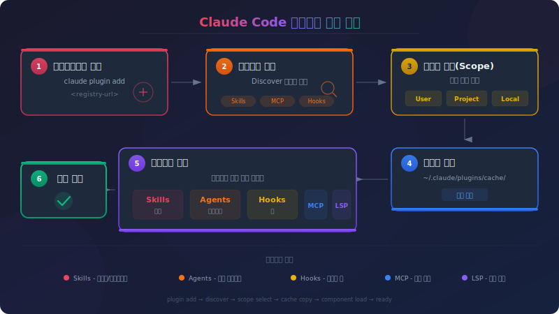

# Claude Code Plugin

> `[3] 중급` · 선수 지식: [Skill](./claude-code-skill.md), [Hook](./claude-code-hook.md)

> `Trend` 2025

> Skill, Agent, Hook, MCP 서버를 패키징하여 배포하는 Claude Code 확장 시스템

`#ClaudeCode` `#Plugin` `#플러그인` `#Marketplace` `#마켓플레이스` `#확장` `#Extension` `#배포` `#Distribution` `#패키징` `#Packaging` `#LSP` `#MCP` `#AgentSkills` `#OpenStandard` `#커뮤니티` `#Community` `#Anthropic`

## 왜 알아야 하는가?

- **실무**: 반복적으로 사용하는 Skill, Hook, MCP 서버를 하나의 패키지로 묶어 팀 전체에 일관된 개발 환경 제공
- **면접**: AI 도구의 확장성과 생태계 이해, 플러그인 아키텍처 설계 역량 증명
- **기반 지식**: Claude Code 생태계의 핵심 배포 메커니즘, 마켓플레이스 기반 도구 공유

## 핵심 개념

- **플러그인**: Skill, Agent, Hook, MCP/LSP 서버를 하나의 패키지로 묶은 확장 단위
- **마켓플레이스**: 플러그인을 검색하고 설치할 수 있는 카탈로그 (앱 스토어와 유사)
- **네임스페이스**: 플러그인 스킬은 `plugin-name:skill-name` 형식으로 충돌 방지
- **설치 스코프**: User / Project / Local / Managed 4단계로 적용 범위 제어
- **plugin.json**: 플러그인의 메타데이터와 구성을 정의하는 매니페스트 파일
- **자동 업데이트**: 마켓플레이스 기반 플러그인은 시작 시 자동 업데이트 가능

## 쉽게 이해하기

**Plugin**을 스마트폰의 **앱 스토어 앱**에 비유할 수 있습니다.

스마트폰(Claude Code)은 기본 기능만으로도 사용 가능하지만, 앱 스토어(마켓플레이스)에서 앱(플러그인)을 설치하면 기능이 확장됩니다.

```
스마트폰 비유:
┌────────────────────────────────────────────┐
│  앱 스토어 (마켓플레이스)                     │
│     └── 앱 (플러그인)                        │
│           ├── 기능 A (Skill)                │
│           ├── 알림 설정 (Hook)               │
│           ├── 외부 연동 (MCP 서버)           │
│           └── 코드 분석 (LSP 서버)           │
│                                              │
│  설치하면 → 스마트폰에 새 기능 추가           │
│  삭제하면 → 원래 상태로 복원                  │
└────────────────────────────────────────────┘
```

Skill이 "하나의 업무 매뉴얼"이라면, Plugin은 "업무 매뉴얼 + 도구 + 설정을 포함한 직무 키트"입니다.

## 상세 설명

### Plugin vs 독립 구성 비교

| 접근 방식 | Skill 이름 | 적합한 상황 |
|----------|-----------|------------|
| **독립 구성** (`.claude/` 디렉토리) | `/hello` | 개인 워크플로우, 프로젝트 특화, 빠른 실험 |
| **플러그인** (`.claude-plugin/plugin.json`) | `/plugin-name:hello` | 팀 공유, 커뮤니티 배포, 버전 관리, 다수 프로젝트 재사용 |

**독립 구성을 사용해야 할 때:**
- 단일 프로젝트 커스터마이징
- 개인적인 설정으로 공유 불필요
- 플러그인으로 패키징하기 전 실험 단계
- `/hello`, `/review`처럼 짧은 스킬 이름 선호

**플러그인을 사용해야 할 때:**
- 팀이나 커뮤니티와 공유 필요
- 동일한 스킬을 여러 프로젝트에서 사용
- 버전 관리와 쉬운 업데이트 필요
- 마켓플레이스를 통한 배포
- 네임스페이스 충돌 방지 필요 (`/my-plugin:hello`)

### 플러그인 디렉토리 구조

```
my-plugin/
├── .claude-plugin/           # 메타데이터 디렉토리
│   └── plugin.json             # 매니페스트 (필수 아님, 권장)
├── commands/                 # Skill (마크다운 파일)
├── agents/                   # 에이전트 정의
├── skills/                   # Agent Skills (SKILL.md)
│   └── code-review/
│       ├── SKILL.md
│       └── scripts/
├── hooks/                    # 이벤트 핸들러
│   └── hooks.json
├── .mcp.json                 # MCP 서버 설정
├── .lsp.json                 # LSP 서버 설정
├── settings.json             # 기본 설정
├── scripts/                  # 유틸리티 스크립트
└── LICENSE
```

> **주의**: `commands/`, `agents/`, `skills/`, `hooks/`는 반드시 플러그인 루트에 위치해야 합니다. `.claude-plugin/` 안에 넣으면 안 됩니다. `.claude-plugin/`에는 `plugin.json`만 위치합니다.

### plugin.json 매니페스트

```json
{
  "name": "my-plugin",
  "version": "1.0.0",
  "description": "플러그인 설명",
  "author": {
    "name": "Author Name",
    "email": "author@example.com"
  },
  "homepage": "https://docs.example.com/plugin",
  "repository": "https://github.com/author/plugin",
  "license": "MIT",
  "keywords": ["keyword1", "keyword2"],
  "commands": ["./custom/commands/special.md"],
  "agents": "./custom/agents/",
  "skills": "./custom/skills/",
  "hooks": "./config/hooks.json",
  "mcpServers": "./mcp-config.json",
  "lspServers": "./.lsp.json",
  "outputStyles": "./styles/"
}
```

| 필드 | 필수 | 설명 |
|------|------|------|
| `name` | 매니페스트 포함 시 필수 | 고유 식별자 (kebab-case). 스킬 네임스페이스로 사용 |
| `version` | 권장 | 시맨틱 버저닝 (MAJOR.MINOR.PATCH) |
| `description` | 권장 | 플러그인 매니저에서 표시되는 설명 |
| `author` | 아니오 | 작성자 정보 (name, email, url) |
| `homepage` | 아니오 | 문서 URL |
| `repository` | 아니오 | 소스 코드 URL |
| `license` | 아니오 | 라이선스 식별자 |
| `keywords` | 아니오 | 검색 태그 |

> 매니페스트가 없으면 기본 디렉토리에서 컴포넌트를 자동 발견하고, 디렉토리 이름을 플러그인 이름으로 사용합니다.

### 플러그인 컴포넌트

#### 1. Skills (스킬)

플러그인의 가장 기본적인 확장 단위입니다.

```
skills/
├── code-review/
│   └── SKILL.md
└── deploy/
    ├── SKILL.md
    └── scripts/
        └── deploy.sh
```

플러그인 스킬은 네임스페이스가 적용되어 `/plugin-name:skill-name`으로 호출합니다.

#### 2. Agents (에이전트)

특화된 서브에이전트를 제공합니다.

```markdown
---
name: security-reviewer
description: 보안 관점에서 코드를 검토하는 전문 에이전트
---

보안 리뷰어로서 코드를 분석합니다...
```

설치 후 `/agents`에서 확인 가능하며, Claude가 작업 맥락에 따라 자동 호출할 수 있습니다.

#### 3. Hooks (훅)

도구 사용 전후에 자동 실행되는 이벤트 핸들러입니다.

```json
// hooks/hooks.json
{
  "hooks": {
    "PostToolUse": [
      {
        "matcher": "Write|Edit",
        "hooks": [
          {
            "type": "command",
            "command": "${CLAUDE_PLUGIN_ROOT}/scripts/format-code.sh"
          }
        ]
      }
    ]
  }
}
```

**사용 가능한 이벤트:**

| 이벤트 | 시점 |
|--------|------|
| `PreToolUse` | 도구 사용 전 |
| `PostToolUse` | 도구 사용 성공 후 |
| `PostToolUseFailure` | 도구 실행 실패 후 |
| `UserPromptSubmit` | 사용자 프롬프트 제출 시 |
| `SessionStart` / `SessionEnd` | 세션 시작/종료 시 |
| `SubagentStart` / `SubagentStop` | 서브에이전트 시작/종료 시 |
| `Stop` | Claude 중지 시도 시 |

> `${CLAUDE_PLUGIN_ROOT}`: 플러그인 디렉토리의 절대 경로. 훅, MCP 서버, 스크립트에서 경로 참조 시 사용

#### 4. MCP 서버

외부 도구와 서비스를 연결합니다.

```json
// .mcp.json
{
  "mcpServers": {
    "plugin-database": {
      "command": "${CLAUDE_PLUGIN_ROOT}/servers/db-server",
      "args": ["--config", "${CLAUDE_PLUGIN_ROOT}/config.json"],
      "env": {
        "DB_PATH": "${CLAUDE_PLUGIN_ROOT}/data"
      }
    }
  }
}
```

플러그인 활성화 시 MCP 서버가 자동으로 시작되며, Claude의 기존 도구와 함께 사용 가능합니다.

#### 5. LSP 서버

실시간 코드 인텔리전스를 제공합니다. Claude가 편집 직후 타입 오류, 누락된 import 등을 즉시 감지할 수 있습니다.

```json
// .lsp.json
{
  "go": {
    "command": "gopls",
    "args": ["serve"],
    "extensionToLanguage": {
      ".go": "go"
    }
  }
}
```

**Claude가 LSP로 얻는 능력:**

| 기능 | 설명 |
|------|------|
| **자동 진단** | 편집 후 즉시 오류/경고 감지, 같은 턴에서 수정 |
| **코드 탐색** | 정의 이동, 참조 찾기, 타입 정보, 심볼 목록 |

> LSP 플러그인은 언어 서버 바이너리를 별도로 설치해야 합니다. 플러그인은 연결 설정만 제공합니다.

#### 6. Settings (설정)

플러그인 활성화 시 기본 설정을 적용합니다. 현재 `agent` 키만 지원됩니다.

```json
// settings.json
{
  "agent": "security-reviewer"
}
```

이 설정은 플러그인의 `agents/` 디렉토리에 정의된 에이전트를 메인 스레드로 활성화합니다.

### 설치 스코프

| 스코프 | 설정 파일 | 용도 |
|--------|----------|------|
| **User** | `~/.claude/settings.json` | 개인용, 모든 프로젝트에 적용 (기본값) |
| **Project** | `.claude/settings.json` | 팀 공유, 버전 관리 포함 |
| **Local** | `.claude/settings.local.json` | 프로젝트 특화, gitignore |
| **Managed** | `managed-settings.json` | 관리자 배포, 읽기 전용 |

---

## 플러그인 생성 가이드

### 1단계: 디렉토리 생성

```bash
mkdir -p my-plugin/.claude-plugin
```

### 2단계: 매니페스트 작성

`my-plugin/.claude-plugin/plugin.json`:

```json
{
  "name": "my-plugin",
  "description": "팀 개발 워크플로우 자동화",
  "version": "1.0.0",
  "author": {
    "name": "Your Name"
  }
}
```

### 3단계: 스킬 추가

```bash
mkdir -p my-plugin/skills/hello
```

`my-plugin/skills/hello/SKILL.md`:

```yaml
---
name: hello
description: Greet the user with a friendly message
disable-model-invocation: true
---

Greet the user named "$ARGUMENTS" warmly.
Make the greeting personal and encouraging.
```

### 4단계: 로컬 테스트

```bash
# --plugin-dir 플래그로 로컬 플러그인 로드
claude --plugin-dir ./my-plugin

# 여러 플러그인 동시 로드
claude --plugin-dir ./plugin-one --plugin-dir ./plugin-two
```

테스트 확인 사항:
- `/my-plugin:hello`로 스킬 호출
- `/agents`에서 에이전트 확인
- 훅이 예상대로 트리거되는지 확인

### 5단계: 기존 구성 마이그레이션

이미 `.claude/` 디렉토리에 있는 설정을 플러그인으로 전환할 수 있습니다.

```bash
# 기존 파일 복사
cp -r .claude/commands my-plugin/
cp -r .claude/agents my-plugin/
cp -r .claude/skills my-plugin/

# 훅 마이그레이션 (settings.json의 hooks 객체를 별도 파일로)
mkdir my-plugin/hooks
# hooks.json 작성
```

| 독립 구성 (`.claude/`) | 플러그인 |
|------------------------|---------|
| 단일 프로젝트에서만 사용 | 마켓플레이스로 공유 가능 |
| `.claude/commands/` | `plugin-name/commands/` |
| `settings.json`의 hooks | `hooks/hooks.json` |
| 수동 복사로 공유 | `/plugin install`로 설치 |

---

## 마켓플레이스

### 공식 Anthropic 마켓플레이스

Claude Code 시작 시 자동으로 사용 가능합니다. `/plugin` → **Discover** 탭에서 탐색합니다.

```bash
# 공식 마켓플레이스에서 설치
/plugin install plugin-name@claude-plugins-official
```

**공식 마켓플레이스 주요 플러그인:**

#### 코드 인텔리전스 (LSP)

| 언어 | 플러그인 | 필요 바이너리 |
|------|---------|-------------|
| TypeScript | `typescript-lsp` | `typescript-language-server` |
| Python | `pyright-lsp` | `pyright-langserver` |
| Go | `gopls-lsp` | `gopls` |
| Rust | `rust-analyzer-lsp` | `rust-analyzer` |
| Java | `jdtls-lsp` | `jdtls` |
| Kotlin | `kotlin-lsp` | `kotlin-language-server` |
| C/C++ | `clangd-lsp` | `clangd` |
| PHP | `php-lsp` | `intelephense` |
| Swift | `swift-lsp` | `sourcekit-lsp` |

#### 외부 통합

| 카테고리 | 플러그인 |
|----------|---------|
| 소스 관리 | `github`, `gitlab` |
| 프로젝트 관리 | `atlassian` (Jira/Confluence), `asana`, `linear`, `notion` |
| 디자인 | `figma` |
| 인프라 | `vercel`, `firebase`, `supabase` |
| 커뮤니케이션 | `slack` |
| 모니터링 | `sentry` |

#### 개발 워크플로우

| 플러그인 | 설명 |
|---------|------|
| `commit-commands` | Git 커밋, 푸시, PR 생성 워크플로우 |
| `pr-review-toolkit` | PR 리뷰 전문 에이전트 |
| `agent-sdk-dev` | Agent SDK 개발 도구 |
| `plugin-dev` | 플러그인 제작 도구 |

### 데모 마켓플레이스

Anthropic이 관리하는 예제 플러그인 모음입니다.

```bash
# 데모 마켓플레이스 추가
/plugin marketplace add anthropics/claude-code

# Discover 탭에서 확인
/plugin
```

### 커뮤니티 마켓플레이스: claude-plugins.dev

[claude-plugins.dev](https://claude-plugins.dev)는 커뮤니티가 유지 관리하는 오픈소스 플러그인/스킬 레지스트리입니다.

**특징:**
- Agent Skills 오픈 표준 ([agentskills.io](https://agentskills.io)) 기반
- Claude Code 외 Cursor, OpenCode, Codex 등 호환
- 관련성, 다운로드 수, 커뮤니티 스타로 정렬
- 원커맨드 설치 지원

**설치 방법:**

```bash
# npx를 통한 설치 (Claude Code v2.0.12+)
npx claude-plugins install <plugin-identifier>
```

**주요 카테고리:**
- 개발: 프론트엔드 디자인, 기능 개발, 백엔드 API
- 생산성: 코드 리뷰, PR 리뷰, 커밋 워크플로우
- 언어: JavaScript/TypeScript, Python
- 보안: 보안 가이드라인, 취약점 경고
- 문서: 코드 설명, 기술 문서 작성
- AI/ML: 에이전트 개발, 컨텍스트 관리

### 마켓플레이스 관리

```bash
# 마켓플레이스 추가 (다양한 소스)
/plugin marketplace add owner/repo                              # GitHub
/plugin marketplace add https://gitlab.com/company/plugins.git  # Git URL
/plugin marketplace add ./my-marketplace                        # 로컬 경로
/plugin marketplace add https://example.com/marketplace.json    # 원격 URL

# 특정 브랜치/태그
/plugin marketplace add https://gitlab.com/company/plugins.git#v1.0.0

# 마켓플레이스 목록
/plugin marketplace list

# 마켓플레이스 업데이트
/plugin marketplace update marketplace-name

# 마켓플레이스 제거 (설치된 플러그인도 함께 제거)
/plugin marketplace remove marketplace-name
```

### 플러그인 설치/관리

```bash
# 설치 (기본: user 스코프)
/plugin install plugin-name@marketplace-name

# 특정 스코프로 설치
claude plugin install formatter@my-marketplace --scope project

# 비활성화 (제거하지 않음)
/plugin disable plugin-name@marketplace-name

# 재활성화
/plugin enable plugin-name@marketplace-name

# 완전 제거
/plugin uninstall plugin-name@marketplace-name

# 업데이트
/plugin update plugin-name@marketplace-name
```

### 팀 마켓플레이스 구성

`.claude/settings.json`에 마켓플레이스를 설정하면, 팀원이 저장소를 신뢰할 때 자동으로 마켓플레이스와 플러그인이 설치됩니다.

### 자동 업데이트

| 마켓플레이스 유형 | 기본 자동 업데이트 |
|------------------|------------------|
| 공식 Anthropic | 활성화 |
| 서드파티 | 비활성화 |
| 로컬 개발용 | 비활성화 |

```bash
# 자동 업데이트 토글 (UI)
/plugin → Marketplaces → 마켓플레이스 선택 → Enable/Disable auto-update

# 환경변수로 전체 자동 업데이트 비활성화
export DISABLE_AUTOUPDATER=true

# Claude Code 업데이트는 비활성화하되 플러그인 업데이트만 유지
export DISABLE_AUTOUPDATER=true
export FORCE_AUTOUPDATE_PLUGINS=true
```

---

## 동작 원리

### 플러그인 설치 흐름



### 플러그인 캐싱

마켓플레이스 플러그인은 보안을 위해 `~/.claude/plugins/cache`에 복사됩니다.

**경로 제한사항:**
- 플러그인 디렉토리 외부 파일 참조 불가 (`../shared-utils` 등)
- 외부 의존성이 필요하면 심볼릭 링크 사용

```bash
# 심볼릭 링크로 외부 파일 포함
ln -s /path/to/shared-utils ./shared-utils
# 심볼릭 링크된 콘텐츠가 캐시에 복사됨
```

### 환경변수

| 변수 | 설명 |
|------|------|
| `${CLAUDE_PLUGIN_ROOT}` | 플러그인 디렉토리 절대 경로. 훅, MCP, 스크립트에서 사용 |

---

## 예제 코드

### 예제 1: 기본 플러그인 (인사 스킬)

```
greeting-plugin/
├── .claude-plugin/
│   └── plugin.json
└── skills/
    └── hello/
        └── SKILL.md
```

**plugin.json:**

```json
{
  "name": "greeting",
  "description": "A greeting plugin to learn the basics",
  "version": "1.0.0"
}
```

**skills/hello/SKILL.md:**

```yaml
---
name: hello
description: Greet the user with a personalized message
---

# Hello Skill

Greet the user named "$ARGUMENTS" warmly.
Make the greeting personal and encouraging.
```

**사용:** `/greeting:hello Alex`

### 예제 2: 코드 리뷰 + 포매팅 플러그인

```
code-quality/
├── .claude-plugin/
│   └── plugin.json
├── skills/
│   └── review/
│       └── SKILL.md
├── hooks/
│   └── hooks.json
└── scripts/
    └── format-code.sh
```

**hooks/hooks.json:**

```json
{
  "hooks": {
    "PostToolUse": [
      {
        "matcher": "Write|Edit",
        "hooks": [
          {
            "type": "command",
            "command": "jq -r '.tool_input.file_path' | xargs npm run lint:fix"
          }
        ]
      }
    ]
  }
}
```

### 예제 3: MCP 서버 + LSP 통합 플러그인

```
full-stack-plugin/
├── .claude-plugin/
│   └── plugin.json
├── skills/
│   └── analyze/
│       └── SKILL.md
├── .mcp.json
├── .lsp.json
└── settings.json
```

**.mcp.json:**

```json
{
  "mcpServers": {
    "project-db": {
      "command": "npx",
      "args": ["@company/mcp-server", "--plugin-mode"],
      "cwd": "${CLAUDE_PLUGIN_ROOT}"
    }
  }
}
```

**.lsp.json:**

```json
{
  "typescript": {
    "command": "typescript-language-server",
    "args": ["--stdio"],
    "extensionToLanguage": {
      ".ts": "typescript",
      ".tsx": "typescriptreact"
    }
  }
}
```

### 예제 4: 에이전트 기본 설정 플러그인

`settings.json`으로 플러그인 활성화 시 특정 에이전트를 메인 스레드로 설정합니다.

```json
// settings.json
{
  "agent": "security-reviewer"
}
```

```markdown
<!-- agents/security-reviewer.md -->
---
name: security-reviewer
description: 모든 코드 변경에 대해 보안 관점에서 자동 검토
---

보안 리뷰어로서 모든 코드를 분석합니다.
OWASP Top 10, 인증/인가, 입력 검증을 중점 확인합니다.
```

---

## 베스트 프랙티스

### 플러그인 설계 원칙

**1. 단일 책임 (Single Responsibility)**

하나의 플러그인은 하나의 도메인에 집중합니다. "코드 리뷰 + 배포 + 모니터링"을 하나에 담지 말고, 각각 분리합니다.

**2. 네이밍 컨벤션**

```
# 좋은 예
code-review-toolkit
deployment-automation
security-scanner

# 나쁜 예
my-plugin
utils
tools
```

**3. 버전 관리**

시맨틱 버저닝을 따릅니다. 버전을 업데이트하지 않으면 캐싱으로 인해 기존 사용자에게 변경사항이 반영되지 않습니다.

| 변경 유형 | 버전 업데이트 |
|----------|-------------|
| 호환되지 않는 변경 | MAJOR (1.0.0 → 2.0.0) |
| 하위 호환 새 기능 | MINOR (1.0.0 → 1.1.0) |
| 버그 수정 | PATCH (1.0.0 → 1.0.1) |

**4. 경로 규칙**

- 모든 경로는 상대 경로로, `./`로 시작
- 플러그인 내부 경로 참조 시 항상 `${CLAUDE_PLUGIN_ROOT}` 사용
- 커스텀 경로는 기본 디렉토리를 대체하지 않고 보충

### 안티패턴

| 안티패턴 | 이유 | 대안 |
|----------|------|------|
| `.claude-plugin/` 안에 컴포넌트 배치 | 로드되지 않음 | 플러그인 루트에 배치 |
| 절대 경로 사용 | 이식성 없음 | `./` 상대 경로 사용 |
| 외부 파일 직접 참조 | 캐싱 후 접근 불가 | 심볼릭 링크 사용 |
| 버전 미업데이트 | 변경사항 미반영 | 매 배포 시 버전 범프 |
| 과도한 컴포넌트 | 유지보수 어려움 | 도메인별 분리 |

---

## 인기 플러그인 실전 사용법

### 1. commit-commands (Git 워크플로우 자동화)

**다운로드: 65k+** | 제공: @anthropics/claude-code

커밋, 푸시, PR 생성을 자동화합니다. 가장 많이 사용되는 기본 워크플로우 플러그인입니다.

**설치:**

```bash
# 공식 마켓플레이스에서 설치
/plugin install commit-commands@claude-plugins-official

# 또는 데모 마켓플레이스에서
/plugin marketplace add anthropics/claude-code
/plugin install commit-commands@anthropics-claude-code
```

**사용법:**

```bash
# 변경사항 커밋 (자동으로 diff 분석 → 메시지 생성 → 커밋)
/commit-commands:commit

# 커밋 + 푸시 + PR 생성까지 한 번에
/commit-commands:commit-push-pr

# 삭제된 리모트 브랜치의 로컬 추적 정리
/commit-commands:clean_gone
```

**실전 시나리오:**

```
# 코드 수정 후
> /commit-commands:commit
  → Claude가 git diff 분석
  → 변경사항에 맞는 커밋 메시지 자동 생성
  → git add + git commit 실행

# PR까지 한 번에
> /commit-commands:commit-push-pr
  → 커밋 → 푸시 → PR 생성까지 자동 완료
```

### 2. code-review (자동 코드 리뷰)

**다운로드: 65k+** | 제공: @anthropics/claude-code

5개의 병렬 에이전트가 PR을 다각도로 리뷰합니다. 신뢰도 점수 기반으로 오탐을 필터링합니다.

**설치:**

```bash
/plugin install code-review@claude-plugins-official
```

**사용법:**

```bash
# 현재 PR 자동 리뷰
/code-review:code-review
```

**내부 동작 (5개 병렬 에이전트):**

```
코드 리뷰 요청
    │
    ├── Agent 1: CLAUDE.md 준수 여부 확인
    ├── Agent 2: 버그 탐지
    ├── Agent 3: 히스토리 컨텍스트 분석
    ├── Agent 4: PR 히스토리 리뷰
    └── Agent 5: 코드 코멘트 분석
    │
    └── 신뢰도 점수 기반 필터링 → 최종 리뷰 결과
```

### 3. frontend-design (프론트엔드 디자인)

**다운로드: 65k+ · 스타: 4.9k** | 제공: @anthropics/claude-code

프론트엔드 작업 시 **자동으로 활성화**되어 프로덕션급 UI를 생성합니다. 일반적인 AI 생성 디자인의 "무미건조한" 느낌을 피합니다.

**설치:**

```bash
/plugin install frontend-design@claude-plugins-official

# 또는 커뮤니티 레지스트리에서
npx claude-plugins install @anthropics/claude-code-plugins/frontend-design
```

**사용법:**

이 플러그인은 **Model-invoked** (자동 활성화) 스킬입니다. 프론트엔드 관련 요청 시 Claude가 자동으로 적용합니다.

```bash
# 직접 호출 필요 없음 - 아래와 같은 요청 시 자동 활성화
> 로그인 페이지 만들어줘
> 대시보드 UI 디자인해줘
> 이 컴포넌트 스타일 개선해줘
```

**자동 적용되는 디자인 원칙:**
- 대담한 디자인 선택 (기본 템플릿 느낌 회피)
- 타이포그래피 최적화
- 애니메이션과 트랜지션
- 시각적 디테일 (그림자, 그라데이션, 간격)

### 4. feature-dev (기능 개발 워크플로우)

**다운로드: 65k+** | 제공: @anthropics/claude-code

7단계 구조화된 프로세스로 기능을 개발합니다. 코드베이스 탐색부터 아키텍처 설계, 구현, 리뷰까지 포함합니다.

**설치:**

```bash
/plugin install feature-dev@claude-plugins-official
```

**사용법:**

```bash
# 기능 개발 시작
/feature-dev:feature-dev 사용자 인증 시스템 구현
```

**내부 워크플로우 (3개 전문 에이전트):**

```
/feature-dev 실행
    │
    ▼
Phase 1-2: code-explorer 에이전트
    → 코드베이스 분석, 관련 파일 탐색
    │
    ▼
Phase 3-4: code-architect 에이전트
    → 아키텍처 설계, 구현 계획 수립
    │
    ▼
Phase 5-6: 구현 실행
    → 코드 작성, 테스트 생성
    │
    ▼
Phase 7: code-reviewer 에이전트
    → 품질 검토, 개선 제안
```

### 5. document-skills (문서 처리)

**다운로드: 64.7k+ · 스타: 1.7k** | 제공: @anthropics/anthropic-agent-skills

Excel, Word, PowerPoint, PDF 파일을 생성/편집합니다.

**설치:**

```bash
npx claude-plugins install @anthropics/anthropic-agent-skills/document-skills
```

**사용법:**

```bash
# 자동 활성화 - 문서 관련 요청 시 자동 적용
> 이 데이터로 엑셀 파일 만들어줘
> 프로젝트 보고서 Word 문서로 작성해줘
> 프레젠테이션 PPT 만들어줘
> 이 PDF에서 텍스트 추출해줘
```

### 6. compound-engineering (복합 엔지니어링)

**다운로드: 8.9k+ · 스타: 2.9k** | 제공: @EveryInc

29개 에이전트, 22개 명령어, 19개 스킬을 포함한 대규모 플러그인입니다.

**설치:**

```bash
npx claude-plugins install @EveryInc/every-marketplace/compound-engineering
```

### 7. security-guidance (보안 가이드)

**제공: @anthropics/claude-code**

`PreToolUse` 훅으로 9가지 보안 패턴을 모니터링합니다. 코드 작성 전에 보안 취약점을 사전 경고합니다.

**설치:**

```bash
/plugin install security-guidance@claude-plugins-official
```

**동작 방식:**

별도 명령어 없이 자동 동작합니다. Claude가 도구를 사용하기 전 `PreToolUse` 훅이 실행되어 보안 패턴을 검사합니다.

```
Claude가 Write/Edit 도구 실행 전
    │
    ▼
security-guidance 훅 실행
    ├── SQL Injection 패턴 감지
    ├── XSS 취약점 확인
    ├── 하드코딩된 시크릿 감지
    ├── 안전하지 않은 랜덤 생성 확인
    └── ... (9가지 패턴)
    │
    ▼
경고 발견 시 → Claude에게 수정 요청
```

### 플러그인 설치 요약 플로우

```bash
# 1. 마켓플레이스 확인 (공식은 기본 포함)
/plugin

# 2. Discover 탭에서 탐색 또는 직접 설치
/plugin install commit-commands@claude-plugins-official
/plugin install code-review@claude-plugins-official
/plugin install frontend-design@claude-plugins-official
/plugin install feature-dev@claude-plugins-official

# 3. 커뮤니티 플러그인은 npx로 설치
npx claude-plugins install @anthropics/anthropic-agent-skills/document-skills

# 4. 설치 확인
/plugin  → Installed 탭

# 5. 사용
/commit-commands:commit
/code-review:code-review
/feature-dev:feature-dev 새 기능 설명
```

---

## 트레이드오프

| 장점 | 단점 |
|------|------|
| Skill, Hook, MCP를 하나로 패키징 | 독립 구성 대비 초기 설정 복잡 |
| 마켓플레이스로 쉬운 배포/설치 | 네임스페이스로 스킬 이름이 길어짐 |
| 버전 관리로 안정적 업데이트 | 버전 관리를 놓치면 변경 미반영 |
| 팀 전체 일관된 개발 환경 | 플러그인 신뢰성은 제작자에 의존 |
| 자동 업데이트 지원 | 캐싱으로 외부 파일 참조 제한 |
| LSP로 실시간 코드 인텔리전스 | LSP 바이너리 별도 설치 필요 |

---

## 트러블슈팅

### 사례 1: /plugin 명령어 인식 안 됨

#### 증상
`/plugin` 입력 시 "unknown command" 또는 명령어 미표시

#### 원인 분석
Claude Code 버전이 1.0.33 미만

#### 해결 방법
```bash
# 버전 확인
claude --version

# 업데이트
brew upgrade claude-code        # Homebrew
npm update -g @anthropic-ai/claude-code  # npm
```

### 사례 2: 플러그인 컴포넌트 로드 안 됨

#### 증상
플러그인 설치 후 스킬, 에이전트, 훅이 보이지 않음

#### 원인 분석
디렉토리 구조 오류 - 컴포넌트가 `.claude-plugin/` 안에 위치

#### 해결 방법
```
# 잘못된 구조
my-plugin/
├── .claude-plugin/
│   ├── plugin.json
│   ├── commands/      ← 여기가 아님!
│   └── agents/        ← 여기가 아님!

# 올바른 구조
my-plugin/
├── .claude-plugin/
│   └── plugin.json    ← 여기에는 매니페스트만
├── commands/           ← 플러그인 루트에
└── agents/             ← 플러그인 루트에
```

### 사례 3: 훅 스크립트 실행 안 됨

#### 증상
파일 편집 후 훅이 트리거되지 않음

#### 원인 분석
- 스크립트 실행 권한 없음
- 경로에 `${CLAUDE_PLUGIN_ROOT}` 미사용
- 이벤트명 대소문자 오류

#### 해결 방법
```bash
# 실행 권한 부여
chmod +x ./scripts/your-script.sh

# shebang 확인
#!/usr/bin/env bash

# 경로 확인
"command": "${CLAUDE_PLUGIN_ROOT}/scripts/your-script.sh"

# 이벤트명 확인 (대소문자 구분)
"PostToolUse"  # O
"postToolUse"  # X
```

### 사례 4: LSP 서버 시작 안 됨

#### 증상
`/plugin` Errors 탭에 "Executable not found in $PATH"

#### 원인 분석
언어 서버 바이너리가 시스템에 설치되지 않음

#### 해결 방법
```bash
# 예: TypeScript LSP
npm install -g typescript-language-server typescript

# 예: Python LSP
pip install pyright

# 설치 후 재시작
```

### 사례 5: 스킬이 나타나지 않음

#### 증상
설치한 플러그인의 스킬이 `/` 자동완성에 표시되지 않음

#### 해결 방법
```bash
# 캐시 클리어 후 재설치
rm -rf ~/.claude/plugins/cache
# Claude Code 재시작 후 플러그인 재설치
```

### 디버깅 도구

```bash
# 플러그인 로딩 상세 로그
claude --debug

# 또는 실행 중
/debug
```

디버그 모드에서 확인 가능한 정보:
- 로딩 중인 플러그인 목록
- 매니페스트 오류
- 컴포넌트 등록 상태
- MCP 서버 초기화 상태

---

## 면접 예상 질문

### Q: Plugin과 독립 Skill의 차이점은?

A: 핵심 차이는 **배포 범위와 패키징 수준**입니다.

독립 Skill (`.claude/skills/`)은 단일 프로젝트에 특화되며 짧은 이름(`/review`)으로 호출합니다. Plugin은 Skill + Agent + Hook + MCP를 하나로 묶어 마켓플레이스를 통해 배포하며, 네임스페이스(`/plugin:review`)로 충돌을 방지합니다.

**실무 가이드**: 개인/프로젝트용은 독립 Skill, 팀/커뮤니티 공유 시 Plugin으로 전환합니다.

### Q: 플러그인의 보안은 어떻게 보장하나요?

A: 3가지 메커니즘이 있습니다.

1. **캐싱**: 마켓플레이스 플러그인은 `~/.claude/plugins/cache`에 복사되어 원본 변경의 영향을 받지 않음
2. **스코프 제어**: User/Project/Local/Managed 4단계로 적용 범위 제한
3. **사용자 신뢰**: 플러그인 설치 시 사용자가 명시적으로 신뢰를 확인

> Anthropic은 공식 마켓플레이스 외 서드파티 플러그인의 MCP 서버, 파일, 소프트웨어를 검증하지 않으므로 설치 전 반드시 확인 필요

### Q: LSP 플러그인의 장점은?

A: Claude에게 **실시간 코드 인텔리전스**를 제공합니다.

LSP 없이는 Claude가 파일 편집 후 컴파일러/린터를 실행해야 오류를 발견합니다. LSP가 있으면 편집 직후 타입 오류, 누락된 import, 문법 오류를 즉시 감지하고 같은 턴에서 수정합니다. grep 기반 검색보다 정확한 코드 탐색(정의 이동, 참조 찾기)도 가능합니다.

### Q: 플러그인 버전 관리가 중요한 이유는?

A: **캐싱 메커니즘** 때문입니다.

Claude Code는 버전을 기준으로 업데이트 여부를 판단합니다. 코드를 변경했더라도 `plugin.json`의 버전을 올리지 않으면, 기존 사용자의 캐시에 이전 버전이 남아 변경사항이 반영되지 않습니다.

---

## 연관 문서

| 문서 | 연관성 | 난이도 |
|------|--------|--------|
| [Skill](./claude-code-skill.md) | 선수 지식 - 플러그인의 핵심 구성요소 | [3] 중급 |
| [Hook](./claude-code-hook.md) | 선수 지식 - 이벤트 기반 자동화 | [3] 중급 |
| [MCP](./mcp.md) | 관련 개념 - 외부 시스템 연결 | [2] 입문 |
| [Slash Command](./claude-code-slash-command.md) | 관련 개념 - Skill로 통합됨 | [3] 중급 |
| [Sub Agent](./claude-code-sub-agent.md) | 관련 개념 - 에이전트 컴포넌트 | [4] 심화 |
| [Claude Code 설정 체계](./claude-code-settings.md) | 관련 개념 - 스코프 시스템 | [3] 중급 |

## 참고 자료

- [Claude Code Plugins Documentation (공식)](https://code.claude.com/docs/en/plugins)
- [Discover and Install Plugins (공식)](https://code.claude.com/docs/en/discover-plugins)
- [Plugins Reference (공식)](https://code.claude.com/docs/en/plugins-reference)
- [Plugin Marketplaces (공식)](https://code.claude.com/docs/en/plugin-marketplaces)
- [Agent Skills 오픈 표준](https://agentskills.io)
- [claude-plugins.dev - 커뮤니티 플러그인 레지스트리](https://claude-plugins.dev)
- [anthropics/claude-code - 데모 플러그인](https://github.com/anthropics/claude-code/tree/main/plugins)
