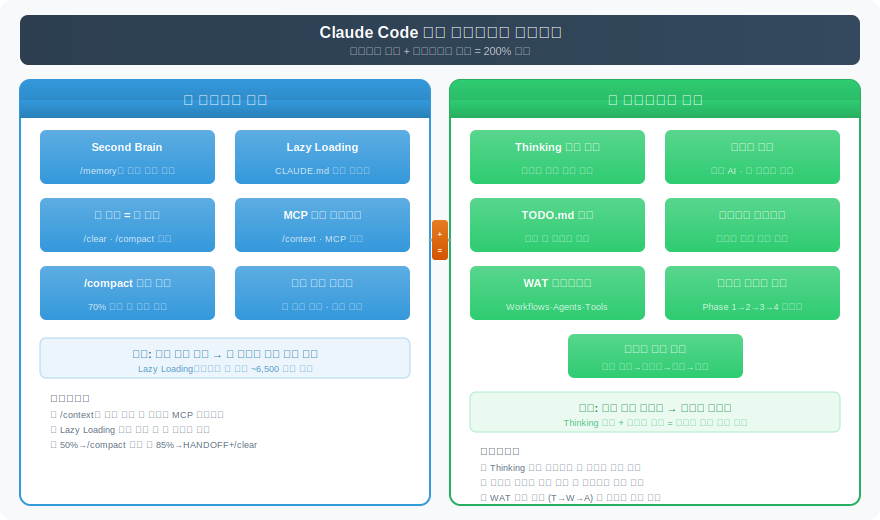
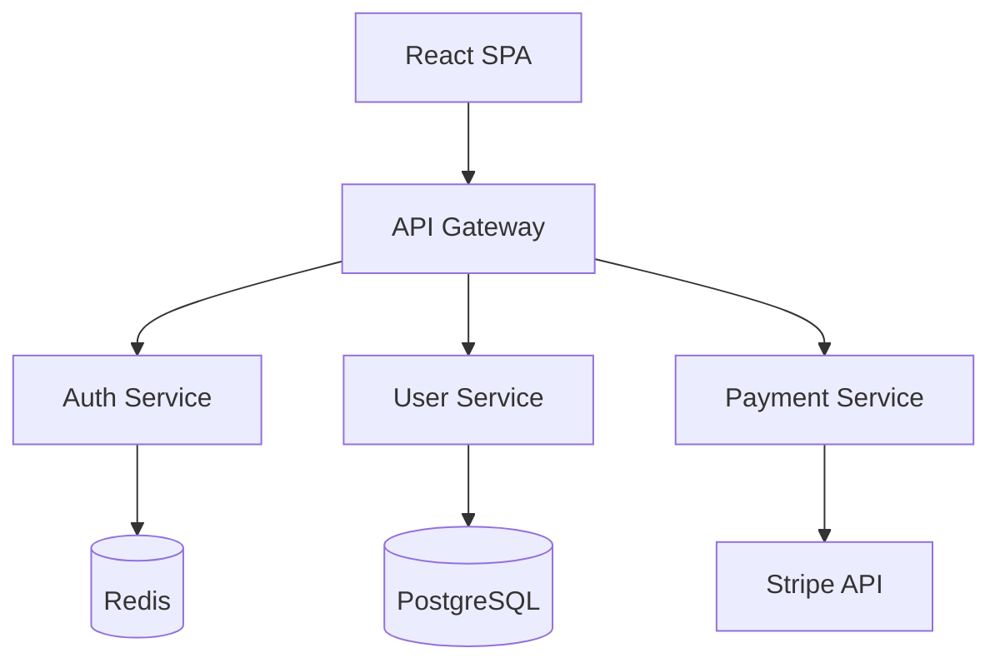

# Claude Code 실전 워크플로우 치트시트

> `[3] 중급` · 선수 지식: [Claude Code 실전 가이드](./claude-code-guide.md), [Claude Code Workflow](./claude-code-workflow.md)

> 컨텍스트 관리와 워크플로우 철학으로 Claude Code 200% 활용하기

`#ClaudeCode` `#컨텍스트관리` `#ContextManagement` `#SecondBrain` `#Memory` `#LazyLoading` `#CLAUDE.md` `#TokenOptimization` `#워크플로우` `#Workflow` `#ThinkingLog` `#TODO.md` `#MCP` `#ScriptOffload` `#WAT프레임워크` `#AIAgent` `#실전치트시트`

## 왜 알아야 하는가?

- **실무**: Claude Code의 컨텍스트 윈도우는 유한하다. 관리하지 않으면 **성능이 급격히 저하**되고, 같은 실수를 반복하며, 세션 간 연속성이 끊긴다
- **효율성**: 컨텍스트 절약 기법과 워크플로우 철학을 적용하면 **동일한 토큰 예산으로 2~3배 더 복잡한 작업**을 처리할 수 있다
- **기반 지식**: [Claude Code 실전 가이드](./claude-code-guide.md)의 70가지 팁과 [Workflow](./claude-code-workflow.md)의 병렬 세션 전략을 **실전에서 조합하는 방법론**이다

## 핵심 개념

- **Second Brain**: `/memory` 시스템으로 Claude가 자동으로 학습 기억을 축적하는 구조
- **Lazy Loading CLAUDE.md**: 참조 구조로 필요한 컨텍스트만 로드하여 토큰 절약
- **한 세션 = 한 피처**: 컨텍스트 오염을 방지하는 세션 격리 원칙
- **MCP 토큰 모니터링**: MCP 서버가 소비하는 토큰을 추적하고 최적화
- **스크립트 오프로드**: 무거운 작업을 외부 스크립트로 분리하는 패턴
- **Thinking 로그 읽기**: Claude의 사고 과정에서 잘못된 가정을 조기 포착
- **TODO.md 활용**: 세션 간 작업 연속성을 유지하는 경량 인수인계
- **WAT 프레임워크**: Workflows, Agents, Tools로 구성된 AI 활용 방법론
- **크로스 리뷰**: 다른 AI의 비평을 받아 코드 품질 향상

## 쉽게 이해하기

**비유: 요리사의 주방 운영**

Claude Code를 사용하는 것은 **요리사(개발자)가 AI 부주방장과 함께 주방을 운영**하는 것과 같다.

| 요리 비유 | Claude Code 실전 | 왜? |
|-----------|-----------------|-----|
| 레시피 노트 | **Second Brain** (`/memory`) | 맛있었던 조합을 기록해두면 다음에 바로 재현 |
| 필요한 재료만 꺼내기 | **Lazy Loading CLAUDE.md** | 냉장고 전체를 조리대에 올리면 작업 공간 부족 |
| 한 요리에 집중 | **한 세션 = 한 피처** | 파스타 만들면서 디저트 동시에 하면 둘 다 망함 |
| 주방 기구 관리 | **MCP 토큰 모니터링** | 안 쓰는 기구가 조리대를 차지하면 비효율 |
| 설거지 맡기기 | **스크립트 오프로드** | 단순 반복 작업은 식기세척기에 위임 |
| 맛보기 | **Thinking 로그 읽기** | 중간에 맛을 보지 않으면 완성 후 실패 발견 |
| 교대 인수인계 | **TODO.md** | 다음 근무자에게 "여기까지 했고, 다음은 이것" |
| 다른 셰프 의견 듣기 | **크로스 리뷰** | 자기 요리만 먹으면 편향됨 |

---

## 상세 설명

### 1. 컨텍스트 관리

컨텍스트 윈도우는 Claude Code의 **작업 메모리**다. 이것을 효율적으로 관리하는 것이 생산성의 핵심이다.



#### 1-1. Second Brain — `/memory` 시스템

`/memory` 명령으로 Claude가 대화 중 학습한 내용을 **자동으로 파일 기반 메모리에 축적**한다. 다음 세션에서 별도 설명 없이 이전 맥락을 이어갈 수 있다.

```
~/.claude/projects/{project-hash}/memory/
├── MEMORY.md              # 인덱스 (200줄 이내)
├── user_preferences.md    # 사용자 선호도
├── feedback_testing.md    # 피드백 기록
├── project_auth.md        # 프로젝트 맥락
└── reference_jira.md      # 외부 참조 포인터
```

**메모리 유형과 활용:**

| 유형 | 저장 대상 | 예시 |
|------|----------|------|
| `user` | 역할, 선호도, 지식 수준 | "시니어 백엔드 개발자, React는 처음" |
| `feedback` | 교정, 가이드라인 | "테스트에서 DB Mock 사용 금지" |
| `project` | 진행 중인 작업, 마감일 | "3/20까지 인증 모듈 리팩토링" |
| `reference` | 외부 시스템 위치 | "버그 트래킹은 Linear INGEST 프로젝트" |

**실전 사용법:**

```bash
# 명시적 메모리 저장 요청
> "앞으로 테스트 코드에서 Mockito 대신 실제 DB를 사용해줘. 기억해줘."
# → feedback 메모리로 자동 저장

# 메모리 확인
> /memory
# → MEMORY.md 인덱스 표시

# 이전 맥락 활용 (자동)
> "지난번 인증 작업 이어서 해줘"
# → project 메모리에서 맥락 복원
```

**왜 중요한가?**

기존 방식은 매 세션마다 "나는 이런 개발자고, 이 프로젝트는 이런 상태고..."를 반복 설명해야 했다. Second Brain은 이 **반복 컨텍스트 소비를 제거**한다.

#### 1-2. Lazy Loading CLAUDE.md

CLAUDE.md에 모든 규칙을 직접 작성하면 **매 대화마다 수천 토큰을 소비**한다. 참조 구조로 필요할 때만 로드하면 토큰을 절약할 수 있다.

**권장 (O) — 참조 구조:**

```markdown
# CLAUDE.md

## 프로젝트 개요
Next.js 14 + TypeScript + Prisma 기반 SaaS 플랫폼

## 핵심 규칙
- 모든 API는 Zod 스키마로 검증
- 테스트는 Vitest 사용, Mock DB 금지

## 상세 규칙 (필요 시 참조)
- 코딩 컨벤션: @docs/CODING_CONVENTION.md
- API 설계 가이드: @docs/API_GUIDE.md
- 테스트 전략: @docs/TEST_STRATEGY.md
- 배포 절차: @docs/DEPLOY.md
```

**비권장 (X) — 모놀리식 구조:**

```markdown
# CLAUDE.md (500줄 이상)

## 프로젝트 개요
...
## 코딩 컨벤션 (200줄)
...
## API 설계 가이드 (150줄)
...
## 테스트 전략 (100줄)
...
## 배포 절차 (50줄)
...
```

**왜?**

| 구조 | 시스템 프롬프트 토큰 | 작업 가용 토큰 |
|------|---------------------|---------------|
| 모놀리식 (500줄) | ~8,000 | ~192,000 |
| Lazy Loading (50줄 + 참조) | ~1,500 | ~198,500 |

**절약 효과: 매 대화마다 ~6,500 토큰 절약** → 긴 세션에서 누적 효과가 극대화된다.

#### 1-3. 한 세션 = 한 피처 원칙

하나의 Claude Code 세션에서 **여러 피처를 동시에 작업하면 컨텍스트가 오염**된다. Claude는 이전 피처의 코드, 에러, 시도를 기억하면서 새로운 피처에 잘못 적용할 수 있다.

**실전 전략:**

```bash
# 피처 A 완료 → 컨텍스트 정리
> /clear                # 완전 초기화 (권장)
# 또는
> /compact              # 대화 요약 후 압축 (맥락 일부 유지)

# 피처 B 시작
> "새로운 작업: 결제 모듈 구현. @CLAUDE.md 참조."
```

**`/clear` vs `/compact` 선택 기준:**

| 상황 | 명령 | 이유 |
|------|------|------|
| 완전히 다른 피처 시작 | `/clear` | 이전 컨텍스트 간섭 제거 |
| 관련 피처 이어서 작업 | `/compact` | 핵심 맥락 유지하면서 토큰 절약 |
| 50k 토큰 초과 시 | `/clear` + HANDOFF.md | 성능 저하 방지 |
| 디버깅 → 구현 전환 | `/compact` | 디버깅 결과 활용 가능 |

#### 1-4. MCP 토큰 모니터링

MCP (Model Context Protocol) 서버는 강력하지만, **각 서버의 도구 정의가 토큰을 소비**한다. 10개의 MCP를 연결하면 토큰의 80%를 MCP가 차지할 수 있다.

**모니터링 방법:**

```bash
# 컨텍스트 사용량 확인
> /context

# 출력 예시:
Context Usage: 87,432 / 200,000 tokens (43.7%)

Breakdown:
- System Prompt: 10,234 tokens (11.7%)
- MCP Servers: 45,678 tokens (52.3%)  # ← 문제!
  - supabase-mcp: 18,234 tokens
  - playwright-mcp: 14,123 tokens
  - firecrawl-mcp: 8,321 tokens
  - slack-mcp: 5,000 tokens
- Memory Files: 2,345 tokens (2.7%)
- Conversation: 29,175 tokens (33.3%)
```

**최적화 전략:**

```jsonc
// .claude/settings.json — 작업별 MCP 프로파일
{
  // 프로파일 1: 코딩 작업 (필수 MCP만)
  "mcpServers": {
    "supabase": { /* ... */ }
  }

  // 프로파일 2: 리서치 작업
  // 별도 설정 파일로 분리하여 필요 시 전환
}
```

**MCP 래핑 패턴** — 토큰을 많이 소비하는 MCP를 경량 래퍼로 감싸기:

```bash
# 원본 MCP: 도구 50개, ~15,000 토큰
# 래핑 MCP: 자주 쓰는 도구 10개만 노출, ~3,000 토큰

# 커스텀 MCP 래퍼 예시
npx -y @anthropic/create-mcp-server my-slim-supabase
# → 필요한 도구만 선별하여 재노출
```

#### 1-5. /compact 적극 활용

`/compact`는 대화 히스토리를 **요약본으로 압축**하여 토큰을 회수한다. 단순히 오래된 메시지를 삭제하는 것이 아니라, **핵심 결정사항과 코드 변경을 유지**하면서 부가 대화를 제거한다.

**사용 타이밍:**

```
토큰 사용량 30% → 작업 진행
토큰 사용량 50% → /compact 고려
토큰 사용량 70% → /compact 실행 (권장)
토큰 사용량 85% → /clear + HANDOFF.md (필수)
```

**실전 팁:**

```bash
# compact 전에 중요한 결정사항 명시
> "지금까지 결정한 사항: 1) JWT 사용, 2) Redis 세션 캐시, 3) Rate Limiting 적용.
   이 결정사항을 유지하면서 /compact 해줘."

> /compact
```

#### 1-6. CLAUDE.md에 아키텍처 다이어그램 포함

CLAUDE.md에 프로젝트의 **시스템 아키텍처를 Mermaid 다이어그램으로 정리**해두면, Claude가 코드베이스 전체 구조를 한눈에 파악한다. 파일을 하나하나 읽는 것보다 효율적이다.

```markdown
# CLAUDE.md

## 시스템 아키텍처



## 폴더 구조

```
src/
├── auth/       # 인증 (JWT + Redis 세션)
├── user/       # 사용자 CRUD
├── payment/    # Stripe 결제
└── shared/     # 공통 미들웨어
```
```

**왜 효과적인가?**

Claude가 "결제 관련 코드 수정해줘"라고 요청받았을 때, 아키텍처 다이어그램이 있으면 **Payment Service → Stripe API** 경로를 즉시 이해하고, 관련 파일만 정확히 찾아간다. 없으면 전체 코드베이스를 탐색하며 토큰을 소비한다.

#### 1-7. 파일 참조 최적화

Claude Code에서 `@파일명`으로 파일을 참조하면 **전체 파일 내용이 컨텍스트에 로드**된다. 대용량 파일을 무분별하게 참조하면 토큰이 빠르게 소진된다.

**권장 (O):**

```bash
# 특정 함수만 참조
> "@src/auth/login.ts의 validateToken 함수를 수정해줘"

# 줄 범위 지정
> "@src/config.ts 10-30번 줄의 설정을 변경해줘"
```

**비권장 (X):**

```bash
# 대용량 파일 전체 참조
> "@src/generated/schema.ts 전체를 분석해줘"  # 10,000줄 파일 → 수만 토큰

# 불필요한 다중 파일 참조
> "@package.json @tsconfig.json @next.config.js @tailwind.config.js 모두 참조해줘"
```

---

### 2. 워크플로우 & 코딩 철학

컨텍스트 관리가 **자원 최적화**라면, 워크플로우 철학은 **작업 품질 최적화**다.

#### 2-1. Thinking 로그 읽기

Claude Code의 Extended Thinking (확장 사고) 기능은 Claude가 **문제를 분석하는 과정을 투명하게 보여준다**. 이 로그에서 잘못된 가정을 조기에 포착할 수 있다.

**활용 방법:**

```
# Claude의 Thinking 로그 예시:
[Thinking] 사용자가 인증 시스템을 요청했다.
현재 프로젝트에 Passport.js가 설치되어 있으므로...
→ ⚠️ 여기서 포착! Passport.js는 레거시이고 현재는 next-auth 사용 중

# 즉시 교정
> "Passport.js가 아니라 next-auth를 사용하고 있어. 그 기준으로 다시 설계해줘."
```

**왜 중요한가?**

코드를 다 작성한 후 잘못된 가정을 발견하면 **전체를 다시 해야 한다**. Thinking 로그를 중간중간 확인하면 **잘못된 방향으로 가기 전에 교정**할 수 있다.

**실전 체크포인트:**

| 시점 | 확인 사항 |
|------|----------|
| 작업 시작 직후 | Claude가 올바른 기술 스택을 가정하고 있는가? |
| 설계 완료 시 | 아키텍처 결정의 근거가 타당한가? |
| 코드 생성 중 | 사용하는 라이브러리/API가 최신인가? |
| 에러 발생 시 | 원인 분석이 올바른 방향인가? |

#### 2-2. 다른 AI 비평 받기 — 크로스 리뷰

Claude Code가 생성한 코드를 **다른 AI로 리뷰**하면 편향을 줄이고 품질을 높일 수 있다.

**방법 1: `/export` 활용**

```bash
# Claude Code 대화 내용을 마크다운으로 내보내기
> /export conversation.md

# 다른 AI에 제공
# → ChatGPT, Gemini, Codex 등에 conversation.md를 전달하여 리뷰 요청
```

**방법 2: MCP 연동 크로스 리뷰**

```bash
# Codex MCP 연결 시
> "@codex 이 코드를 리뷰해줘: @src/auth/middleware.ts"

# 결과를 바탕으로 개선
> "Codex가 N+1 쿼리 문제를 지적했어. 수정해줘."
```

**방법 3: 팀 리뷰 에이전트**

```bash
# /team-review 명령으로 4명의 전문 리뷰어 에이전트 병렬 실행
> /team-review

# 각 에이전트가 다른 관점에서 리뷰:
# - 성능 리뷰어: N+1, 메모리, I/O 병목
# - 보안 리뷰어: OWASP, 인증/인가
# - 테스트 리뷰어: 커버리지, 누락 시나리오
# - 컨벤션 리뷰어: 클린 코드, SOLID
```

#### 2-3. TODO.md 활용 — 세션 간 연속성

HANDOFF.md가 **상세한 인수인계 문서**라면, TODO.md는 **경량 체크리스트**다. 빠르게 작성하고 빠르게 이어갈 수 있다.

```markdown
# TODO.md

## 현재 작업: 결제 모듈 v2

### 완료
- [x] Stripe SDK 업그레이드 (v14 → v16)
- [x] 결제 세션 생성 API
- [x] 웹훅 핸들러 기본 구조

### 진행 중
- [ ] 웹훅 서명 검증 (ngrok URL 이슈)
- [ ] 결제 내역 DB 저장

### 예정
- [ ] 환불 API
- [ ] 구독 관리
- [ ] 결제 대시보드 UI

### 메모
- ngrok 무료 플랜은 URL이 변경됨 → 고정 URL 필요
- Stripe 테스트 모드에서 카드번호: 4242 4242 4242 4242
```

**HANDOFF.md vs TODO.md:**

| 항목 | HANDOFF.md | TODO.md |
|------|-----------|---------|
| 목적 | 컨텍스트 전체 인수인계 | 작업 진행 상태 추적 |
| 분량 | 상세 (시도/실패/교훈 포함) | 경량 (체크리스트) |
| 사용 시점 | `/clear` 직전 | 매 세션 시작/종료 |
| 생성 방식 | Claude에게 요청 | 직접 또는 Claude에게 요청 |

#### 2-4. 스크립트 오프로드

Claude Code의 컨텍스트를 소비하지 않으면서 **무거운 작업을 외부 스크립트로 분리**하는 패턴이다.

**오프로드 대상:**

| 작업 유형 | 오프로드 방법 | 이유 |
|-----------|-------------|------|
| 대량 파일 변환 | 셸 스크립트 | 수백 개 파일 처리는 컨텍스트 낭비 |
| 데이터 마이그레이션 | SQL 스크립트 | 대량 데이터 조작은 DB에서 직접 |
| 반복 포맷팅 | Prettier/ESLint | 포맷팅에 AI를 쓸 필요 없음 |
| CI/CD 파이프라인 | GitHub Actions | 빌드/배포는 자동화 도구에 위임 |
| 로그 분석 | grep/awk 파이프라인 | 대량 로그는 CLI 도구가 효율적 |

**실전 예시:**

```bash
# ❌ Claude에게 직접 시키면 컨텍스트 소비
> "src/ 아래의 모든 .js 파일을 .ts로 변환해줘"
# → 파일 하나당 컨텍스트 소비, 100개면 세션 폭발

# ✅ 스크립트 생성만 요청
> "src/ 아래의 모든 .js 파일을 .ts로 변환하는 bash 스크립트를 만들어줘"
# → 스크립트만 생성 (토큰 최소 소비)
# → 스크립트를 직접 실행 (!bash convert.sh)
```

#### 2-5. WAT 프레임워크

**W**orkflows, **A**gents, **T**ools — AI 활용을 체계적으로 설계하는 프레임워크다.

```
┌──────────────────────────────────────────────────────┐
│                   WAT 프레임워크                       │
├──────────────────────────────────────────────────────┤
│                                                       │
│  [W] Workflows — 작업 흐름 설계                       │
│  ├─ CLAUDE.md: 프로젝트 규칙 정의                     │
│  ├─ Plan Mode: 구현 전 설계 검증                      │
│  └─ HANDOFF/TODO: 세션 간 연속성                      │
│                                                       │
│  [A] Agents — 에이전트 역할 분담                      │
│  ├─ Sub Agent: 독립 작업 위임                         │
│  ├─ Agent Team: 병렬 협업                             │
│  └─ Cross Review: AI 간 상호 검증                     │
│                                                       │
│  [T] Tools — 도구 연결                                │
│  ├─ MCP Server: 외부 시스템 연동                      │
│  ├─ Hook: 생명주기 자동화                             │
│  └─ Script Offload: 무거운 작업 분리                  │
│                                                       │
└──────────────────────────────────────────────────────┘
```

**적용 순서:**

1. **Tools 먼저** — 필요한 MCP 서버, Hook을 설정
2. **Workflows 다음** — CLAUDE.md, 컨텍스트 관리 전략 수립
3. **Agents 마지막** — Sub Agent, 팀 구성으로 확장

**왜 이 순서인가?**

도구가 없으면 워크플로우가 작동하지 않고, 워크플로우가 없으면 에이전트가 방향 없이 움직인다. **기반부터 쌓아야 전체가 작동**한다.

#### 2-6. 에러 로그 그대로 붙여넣기

에러가 발생하면 **자신의 해석을 추가하지 말고, 에러 로그 원문을 그대로** Claude에게 전달하라. 사람의 해석이 오히려 핵심 단서를 가릴 수 있다.

**권장 (O):**

```bash
> "이 에러를 해결해줘:

TypeError: Cannot read properties of undefined (reading 'map')
    at UserList (src/components/UserList.tsx:15:23)
    at renderWithHooks (node_modules/react-dom/...)
    at mountIndeterminateComponent (..."
```

**비권장 (X):**

```bash
> "UserList 컴포넌트에서 map 함수 에러가 나는데,
   아마 데이터가 안 와서 그런 것 같아. 수정해줘."
# → "아마 ~인 것 같다"는 오진일 수 있고, 스택 트레이스 없이는 정확한 원인 분석 불가
```

**왜?**

스택 트레이스에는 **파일 경로, 줄 번호, 호출 체인** 등 Claude가 정확히 원인을 찾는 데 필요한 모든 정보가 있다. 사람이 요약하면 이 정보가 손실된다.

#### 2-7. 점진적 복잡도 증가

Claude Code에게 한 번에 복잡한 작업을 시키면 실패 확률이 높다. **단계별로 복잡도를 올리는 전략**이 효과적이다.

```bash
# Phase 1: 기본 동작 확인 (5분)
> "Express 서버에 GET /health 엔드포인트를 추가해줘"

# Phase 2: 핵심 로직 구현 (15분)
> "POST /api/users 엔드포인트를 추가해줘.
   Zod로 입력 검증하고 Prisma로 DB에 저장해줘."

# Phase 3: 에러 처리 추가 (10분)
> "중복 이메일 시 409, 유효성 실패 시 400 에러를 반환해줘."

# Phase 4: 테스트 작성 (10분)
> "위 API에 대한 통합 테스트를 작성해줘. 성공/실패 케이스 모두."
```

**만약 한 번에 모든 것을 요청하면?**

```bash
# ❌ 한 번에 요청
> "CRUD API를 만들어줘. 입력 검증, 에러 처리, 인증, 페이지네이션,
   테스트 코드까지 모두 포함해줘."
# → Claude가 중간에 컨텍스트를 잃거나, 일부를 빠뜨리거나,
#   잘못된 가정으로 전체를 다시 작성할 가능성 높음
```

#### 2-8. 피드백 루프 설계 — TDD 기반 스마트 코딩

Claude Code의 작업 결과를 **자동으로 검증하는 루프**를 설계하면 품질이 크게 향상된다. 핵심은 **작은 변경 → 테스트 → 커밋 → 반복**의 TDD 사이클이다.

```
┌─────────┐     ┌──────────┐     ┌──────────┐
│ 코드 생성 │ ──→ │ 테스트 실행│ ──→ │ 결과 확인  │
└─────────┘     └──────────┘     └──────────┘
     ↑                                │
     │          실패 시 자동 수정       │
     └─────────────────────────────────┘
```

**Hook 기반 자동 검증:**

```jsonc
// .claude/settings.json
{
  "hooks": {
    "PostToolUse": [
      {
        "matcher": "Write|Edit",
        "command": "npm run lint --fix && npm test -- --bail"
      }
    ]
  }
}
```

**TDD 기반 사이클:**

```bash
# 1. 작은 단위로 변경 요청
> "validateEmail 함수를 추가해줘. 정규식 기반으로."

# 2. 즉시 테스트
> "방금 작성한 함수에 대한 테스트를 작성하고 실행해줘"

# 3. 통과 확인 후 다음 단계
> "이제 validatePassword 함수를 추가해줘"

# 4. 반복
# 큰 기능을 한 번에 만들지 않고, 작은 함수 단위로
# 변경 → 테스트 → 확인 → 다음 변경 사이클을 반복
```

**수동 검증 체크포인트:**

```bash
# 코드 생성 후
> "방금 작성한 코드에 대해 테스트를 실행해줘"

# 테스트 통과 후
> "이 코드에서 보안 취약점이 있는지 확인해줘"

# 최종 확인
> "/self-review"
```

---

## 컨텍스트 관리 체크리스트

### 세션 시작 시

- [ ] `/context`로 현재 토큰 사용량 확인
- [ ] 불필요한 MCP 서버 비활성화
- [ ] CLAUDE.md가 Lazy Loading 구조인지 확인
- [ ] TODO.md 또는 HANDOFF.md로 이전 작업 맥락 로드

### 작업 중

- [ ] 한 세션에서 하나의 피처만 작업
- [ ] 50% 토큰 사용 시 `/compact` 고려
- [ ] 70% 토큰 사용 시 `/compact` 실행
- [ ] Thinking 로그에서 잘못된 가정 모니터링
- [ ] 대용량 파일은 줄 범위 지정하여 참조

### 세션 종료 시

- [ ] TODO.md 업데이트 (진행 상태 반영)
- [ ] 중요한 결정사항은 `/memory`로 저장
- [ ] 85% 이상 토큰 사용 시 HANDOFF.md 생성 후 `/clear`

---

## 워크플로우 체크리스트

### 코드 품질

- [ ] 스크립트 오프로드 대상 작업을 Claude에게 직접 시키지 않았는가?
- [ ] 점진적 복잡도 증가 전략을 적용했는가?
- [ ] 크로스 리뷰 (다른 AI 또는 팀 리뷰)를 받았는가?
- [ ] 피드백 루프 (테스트 → 검증 → 수정)가 설계되어 있는가?

### 프로젝트 설정

- [ ] WAT 프레임워크 순서로 설정했는가? (Tools → Workflows → Agents)
- [ ] MCP 서버 토큰 소비량을 모니터링하고 있는가?
- [ ] Second Brain (`/memory`)에 프로젝트 맥락이 축적되고 있는가?
- [ ] CLAUDE.md가 Lazy Loading 구조로 되어 있는가?

---

## 연관 문서

| 문서 | 연관성 | 난이도 |
|------|--------|--------|
| [Claude Code 실전 가이드](./claude-code-guide.md) | 70가지 팁의 기본기 (선수 지식) | Intermediate |
| [Claude Code Workflow](./claude-code-workflow.md) | 병렬 세션, 모델 선택 전략 (선수 지식) | Intermediate |
| [HANDOFF.md 컨텍스트 관리](./claude-code-handoff.md) | 세션 인수인계 패턴 상세 | Intermediate |
| [Context Engineering](./context-engineering.md) | 컨텍스트 설계의 학문적 기반 | Advanced |
| [AI 에이전트 메모리 아키텍처](./agent-memory.md) | Second Brain의 이론적 배경 | Advanced |
| [Claude Code 커스터마이징 마스터 가이드](./claude-code-customization.md) | 설정 최적화 실전 | Intermediate |
| [Claude Code Agent Team](./claude-code-agent-team.md) | 팀 리뷰 에이전트 구성 | Advanced |

## 참고 자료

- Claude Code 실전 워크플로우 치트시트 (Notion, 2026)
- [Anthropic Claude Code 공식 문서](https://docs.anthropic.com/en/docs/claude-code)
- [Claude Code Best Practices](https://docs.anthropic.com/en/docs/claude-code/best-practices)
- Boris Cherny, "Claude Code 창시자 워크플로우" (2026)
