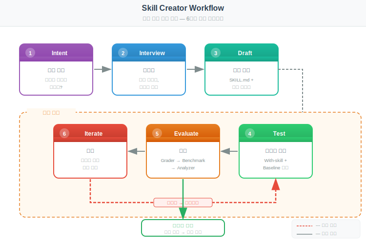
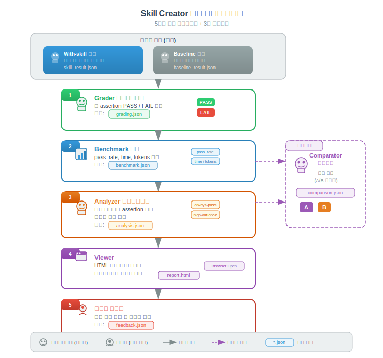

# Claude Code Skill Creator 플러그인

> `[3] 중급` · 선수 지식: [Skill](./claude-code-skill.md), [Plugin](./claude-code-plugin.md)

> `Trend` 2025-2026

> 평가 주도 개발(Evaluation-Driven Development)로 스킬을 생성·테스트·최적화하는 전문 도구

`#ClaudeCode` `#SkillCreator` `#스킬생성` `#EvaluationDriven` `#평가주도` `#Evaluation` `#Benchmark` `#벤치마크` `#Grader` `#Comparator` `#Analyzer` `#Description최적화` `#트리거최적화` `#SKILL.md` `#ProgressiveDisclosure` `#테스트케이스` `#반복개선` `#IterativeLoop` `#BlindComparison` `#맹목비교` `#Anthropic` `#Plugin` `#워크플로우` `#Workflow` `#SubAgent` `#서브에이전트` `#AgentSkills`

## 왜 알아야 하는가?

- **실무**: 팀 워크플로우를 스킬로 패키징할 때, 감이 아닌 정량적 평가로 품질을 검증하여 신뢰할 수 있는 스킬 제작
- **면접**: AI 도구의 메타 레벨 최적화 — "AI를 사용하는 것"을 넘어 "AI의 능력 자체를 설계·측정·개선"하는 역량 증명
- **기반 지식**: Evaluation-Driven Development 패러다임, 정성적/정량적 평가 병행, 트리거 정확도 최적화

## 왜 사용하는가?

> 스킬 품질을 감이 아닌 정량적 평가로 검증하고, TDD처럼 반복 개선하여 신뢰할 수 있는 스킬을 만들기 위해 사용한다.

### 스킬을 직접 만들 때의 문제

스킬을 수동으로 작성하면 3가지 문제가 발생합니다:

- **동작 확인이 주관적**: "잘 되는 것 같다" → 실제로는 특정 케이스에서 실패. 본인이 테스트한 1-2개 프롬프트에서만 작동
- **Description이 부정확 (Undertrigger)**: `"Handle data files"` 같은 description → Claude가 "나도 할 수 있다"고 판단하여 스킬을 호출하지 않음
- **개선 방향을 모름**: 스킬이 기대보다 못할 때, 어디를 고쳐야 하는지 감으로 판단. 이전 버전 대비 실제로 나아졌는지 비교 불가

### TDD와 EDD의 대응 관계

코드에 TDD가 있듯, 스킬에는 EDD(Evaluation-Driven Development)가 있습니다.

| TDD (코드) | EDD (스킬) |
|-----------|-----------|
| 실패하는 테스트 작성 | 테스트 케이스(evals.json) 작성 |
| 최소 코드로 테스트 통과 | SKILL.md 초안으로 평가 통과 시도 |
| 리팩토링 | 피드백 기반 스킬 개선 |
| 테스트 스위트 실행 | Grader가 assertion 채점 |
| 코드 커버리지 | pass_rate, 토큰, 시간 벤치마크 |
| 회귀 테스트 | Baseline 대비 비교 (퇴보 감지) |

```
TDD:   RED(실패 테스트) → GREEN(최소 구현) → REFACTOR(개선) → 반복
EDD:   TEST(평가 실행) → EVALUATE(채점)   → ITERATE(개선)  → 반복
```

본질은 동일합니다 — "먼저 기대 결과를 정의하고, 측정하고, 통과할 때까지 반복한다." 차이점은 코드 테스트는 결정적(deterministic)이라 PASS/FAIL이 명확하지만, 스킬 출력은 비결정적이라 **정량 평가(assertion) + 정성 평가(사용자 피드백)를 병행**한다는 점입니다.

### Skill Creator 사용 시 이점

| 이점 | 수동 작성 | Skill Creator |
|------|----------|---------------|
| **품질 측정** | "잘 되는 것 같다" | pass_rate 0.92, 평균 25초 |
| **트리거 정확도** | 감으로 description 작성 | 20개 쿼리로 자동 최적화 루프 |
| **개선 방향** | 직감 | Analyzer가 우선순위별 개선안 도출 |
| **퇴보 방지** | 모름 | Baseline 대비 자동 비교 |
| **팀 공유 신뢰성** | "내가 만들었으니 써봐" | "pass_rate 92%, baseline 대비 40% 향상" |

## 핵심 개념

- **Evaluation-Driven Development**: 스킬 품질을 감이 아닌 체계적 평가로 측정하고, 반복 개선하는 개발 방법론
- **반복 개선 루프**: Draft → Test → Evaluate → Improve를 만족할 때까지 반복, 각 iteration은 독립 디렉토리에 기록
- **3종 평가 에이전트**: Grader(채점), Comparator(맹목 비교), Analyzer(분석)가 병렬로 스킬 품질을 다각도 평가
- **Description 최적화**: 스킬 트리거링 정확도를 높이기 위한 자동화된 description 개선 루프
- **Progressive Disclosure 설계**: 메타데이터(~100단어) → SKILL.md 본문(<500줄) → 번들 리소스(무제한)의 3단계 로딩
- **정량/정성 평가 병행**: 객관적 assertion과 주관적 사용자 피드백을 모두 활용
- **Baseline 비교**: 스킬 적용 결과를 스킬 미적용(또는 이전 버전) 결과와 항상 비교

## 쉽게 이해하기

**Skill Creator**를 **요리사의 레시피 개발 과정**에 비유할 수 있습니다.

```
요리사의 레시피 개발:

[1] 의도]  "매콤한 파스타 레시피를 만들자"
      │
      ▼
[2] 초안]  첫 번째 레시피 작성
      │
      ▼
[3] 시식]  3명의 시식단에게 제공
      │     ├── 채점관: "매운맛 8/10, 식감 6/10"
      │     ├── 비교관: "A(새 레시피) vs B(기존)" → "A가 낫다"
      │     └── 분석관: "면 삶는 시간이 핵심 차이"
      │
      ▼
[4] 개선]  피드백 반영하여 레시피 수정
      │
      ▼
[5] 반복]  만족할 때까지 3→4 반복
```

Skill Creator도 동일합니다. 스킬을 만들고, 테스트 케이스로 실행하고, 3종 에이전트가 채점하고, 피드백을 반영하여 개선합니다. "맛있다/없다"라는 감이 아닌, 정량적 점수와 구체적 분석으로 품질을 판단합니다.

## 상세 설명

### 스킬 생성 워크플로우

Skill Creator의 핵심은 **6단계 워크플로우**입니다.



```
[1] Intent (의도 캡처)
     │  "이 스킬이 무엇을 하는가?"
     ▼
[2] Interview (인터뷰)
     │  엣지 케이스, 입출력 형식 확인
     ▼
[3] Draft (초안 작성)
     │  SKILL.md + 번들 리소스
     ▼
[4] Test (테스트 실행)
     │  With-skill + Baseline 병렬 실행
     ▼
[5] Evaluate (평가)
     │  Grader → Benchmark → Analyzer → Viewer
     ▼
[6] Iterate (반복)
     │  피드백 반영 → 4번으로 돌아감
     └── 만족할 때까지 반복
```

#### Step 1: Intent — 의도 캡처

스킬이 해결할 문제를 명확히 정의합니다:

- **무엇을** 할 것인가? (핵심 기능)
- **언제** 트리거되어야 하는가? (트리거 조건)
- **어떤 형식**으로 출력하는가? (예상 결과물)
- **테스트 가능한가?** (평가 방법)

#### Step 2: Interview — 인터뷰 & 리서치

사용자와 한 번에 하나의 질문으로 요구사항을 구체화합니다:

- 엣지 케이스는 무엇인가?
- 입출력 형식은?
- 사용 가능한 MCP 도구는?
- 기존 프로젝트 패턴은?

#### Step 3: Draft — SKILL.md 작성

**디렉토리 구조:**

```
skill-name/
├── SKILL.md              (필수)
│   ├── YAML frontmatter   (name, description)
│   └── Markdown 지시사항
├── scripts/               (선택: 실행 가능한 코드)
├── references/            (선택: 필요시 로드할 문서)
└── assets/                (선택: 출력에 사용할 파일)
```

**Progressive Disclosure 3단계:**

| 단계 | 크기 | 로딩 시점 | 내용 |
|------|------|----------|------|
| 1. 메타데이터 | ~100단어 | 항상 컨텍스트에 포함 | name + description (트리거링 결정용) |
| 2. SKILL.md 본문 | <500줄 | 스킬 트리거 시 | 핵심 지시사항, 워크플로우 |
| 3. 번들 리소스 | 무제한 | 필요할 때만 | 스크립트, 템플릿, 레퍼런스 |

**Description 작성 핵심:**

```yaml
# 나쁜 예 (Undertrigger 위험)
description: "Handle data files"

# 좋은 예 (명시적 트리거 조건)
description: "Use when user mentions dashboard, data visualization,
  company data display, or asks to show metrics/KPIs in a visual format"
```

#### Step 4: Test — 테스트 케이스 실행

**evals.json 형식:**

```json
{
  "skill_name": "my-skill",
  "evals": [
    {
      "id": 1,
      "prompt": "사용자 실제 요청과 유사한 프롬프트",
      "expected_output": "예상되는 결과 설명",
      "files": []
    }
  ]
}
```

**병렬 실행 구조:**

```
테스트 케이스 1
    ├── With-skill 런 (스킬 적용)     ──┐
    └── Baseline 런 (스킬 미적용)      ──┤ 동시 시작
                                         │
테스트 케이스 2                          │
    ├── With-skill 런                   ──┤
    └── Baseline 런                     ──┘
```

- **새 스킬**: Baseline = 스킬 없이 실행
- **기존 스킬 개선**: Baseline = 이전 버전 스냅샷

**Assertion 작성 기준:**

| 좋은 Assertion | 나쁜 Assertion |
|---------------|---------------|
| 객관적으로 검증 가능 | 주관적 판단 필요 |
| 명확한 설명 이름 | 모호한 이름 |
| 실패 시 원인 파악 가능 | 항상 통과 (차별성 없음) |

> 글쓰기, 디자인 등 주관적 스킬에는 assertion을 강제하지 않고 정성적 평가를 사용합니다.

#### Step 5: Evaluate — 평가 시스템



**5단계 평가 파이프라인:**

```
1. Grader 서브에이전트
   → 각 assertion 채점 (PASS/FAIL + 증거)
   → grading.json 생성
        │
        ▼
2. Benchmark 집계
   → python aggregate_benchmark.py
   → pass_rate, time, tokens (mean ± stddev)
   → benchmark.json + benchmark.md
        │
        ▼
3. Analyzer 서브에이전트
   → 항상 통과하는 assertion 식별 (차별성 없음)
   → 고분산 평가 식별 (불안정)
   → 시간/토큰 트레이드오프 분석
        │
        ▼
4. Viewer 실행
   → python generate_review.py
   → 브라우저에서 시각적 리뷰 페이지 열림
        │
        ▼
5. 사용자 피드백 수집
   → feedback.json 생성
   → 비어있는 피드백 = 괜찮음
```

### 3종 평가 에이전트 상세

#### Grader (채점관)

**역할:** Assertion을 실행 결과와 비교하여 PASS/FAIL 판정

**채점 기준:**
- **PASS**: 명확한 증거 + 진정한 작업 완료 (표면적 준수가 아닌 실질적 수행)
- **FAIL**: 증거 없음, 모순, 검증 불가, 표면적 준수만

**출력 (grading.json):**

```json
{
  "expectations": [
    {"text": "차트에 축 레이블이 있어야 함", "passed": true, "evidence": "X축: 날짜, Y축: 매출액 확인"}
  ],
  "summary": {"passed": 2, "failed": 1, "total": 3, "pass_rate": 0.67}
}
```

#### Comparator (비교관)

**역할:** 두 버전의 출력을 레이블 없이(A/B) 맹목 비교

**평가 루브릭:**

| 카테고리 | 항목 | 점수 범위 |
|---------|------|----------|
| 콘텐츠 | 정확성, 완성도, 정밀도 | 각 1-5 |
| 구조 | 조직화, 포맷팅, 사용성 | 각 1-5 |

**출력:** Winner (A/B/TIE), 상세 이유, 루브릭 점수

#### Analyzer (분석관)

**역할:** 비교 결과를 "언블라인드"하고 구체적 개선안 도출

**출력 (analysis.json):**

```json
{
  "improvement_suggestions": [
    {
      "priority": "high",
      "category": "instructions",
      "suggestion": "차트 생성 시 축 레이블 필수 포함 지시 추가",
      "expected_impact": "시각화 완성도 30% 향상"
    }
  ]
}
```

### Description 최적화 루프

스킬 트리거링 정확도는 description의 품질에 의존합니다.

**트리거링 동작 원리:**
- Claude는 사용 가능한 스킬 리스트에서 name + description으로 스킬 선택
- 쉽게 처리할 수 있는 작업에는 스킬을 호출하지 않음 (Undertrigger)
- 따라서 description이 정확할수록 적절한 시점에 트리거됨

**최적화 프로세스:**

```
1. 평가 쿼리 생성 (20개)
   ├── should_trigger: true  (10개)
   └── should_trigger: false (10개)
        │
        ▼
2. 사용자 검토 (HTML 뷰어)
   → 쿼리 품질 확인, 수정
        │
        ▼
3. 최적화 루프 실행 (백그라운드)
   → 60% 훈련 / 40% 테스트 분할
   → 각 쿼리 3회 실행 (신뢰도 확보)
   → Extended Thinking으로 개선 제안
   → 최대 5회 반복
        │
        ▼
4. best_description 적용
   → SKILL.md frontmatter 업데이트
```

**좋은 평가 쿼리 vs 나쁜 평가 쿼리:**

| 좋은 예 | 나쁜 예 |
|---------|---------|
| "보스가 보낸 Q4 매출 엑셀 파일 분석해줘" | "데이터 포맷해줘" |
| 자연스러운 사용자 언어 | 키워드 나열 |
| 구체적 맥락 포함 | 추상적 요청 |
| Claude가 스킬 없이도 할 수 있을 정도로 실질적 | 스킬이 필수인 단순 요청 |

### 작업 공간 구조

```
workspace/
├── iteration-1/
│   ├── eval-0-eval_name/
│   │   ├── eval_metadata.json
│   │   ├── with_skill/
│   │   │   ├── outputs/     (결과 파일)
│   │   │   └── timing.json
│   │   ├── without_skill/
│   │   │   ├── outputs/
│   │   │   └── timing.json
│   │   ├── with_skill_grading.json
│   │   └── without_skill_grading.json
│   ├── benchmark.json
│   ├── benchmark.md
│   └── feedback.json
├── iteration-2/
│   └── (iteration-1과 동일 구조)
├── skill-snapshot/           (기존 스킬 개선 시)
└── history.json              (전체 반복 이력)
```

### 스킬 개선 철학

**4가지 원칙:**

| 원칙 | 설명 | 예시 |
|------|------|------|
| **피드백 일반화** | 몇 가지 예시에 오버피팅 금지 | "차트 색상 변경" → "시각화 가이드라인 추가" |
| **프롬프트 간결화** | 불필요한 지시 제거 | 500줄 → 핵심 200줄 |
| **이유 설명** | "왜"를 전달 | "ALWAYS do X" → "X because Y" |
| **반복 작업 번들화** | 여러 테스트에서 반복되는 스크립트 → scripts/ | 매번 인라인 → `scripts/chart.py` |

**종료 조건:**
- 사용자가 만족
- 피드백 모두 비어있음
- 의미있는 진전 없음 (수확체감)

### 주요 스크립트

| 스크립트 | 용도 | 실행 예시 |
|---------|------|---------|
| `run_eval.py` | 단일 평가 실행 | `python -m scripts.run_eval ...` |
| `aggregate_benchmark.py` | 벤치마크 결과 집계 | `python -m scripts.aggregate_benchmark <workspace>/iteration-N` |
| `run_loop.py` | Description 최적화 반복 | `python -m scripts.run_loop --max-iterations 5` |
| `generate_review.py` | HTML 리뷰 뷰어 생성 | `python eval-viewer/generate_review.py <workspace>` |
| `package_skill.py` | 스킬 검증 & 패키징 | `python -m scripts.package_skill` |
| `quick_validate.py` | SKILL.md 빠른 검증 | `python -m scripts.quick_validate` |

### 실전 활용 예시

#### 예시 1: 코드 리뷰 스킬 생성

```
[1] Intent
   "PR 코드를 OWASP Top 10 관점에서 보안 리뷰하는 스킬"

[2] Interview
   Q: "어떤 언어/프레임워크?"
   A: "Java/Spring Boot"
   Q: "리포트 형식은?"
   A: "마크다운 체크리스트"

[3] Draft → skills/security-review/SKILL.md

[4] Test (evals.json)
   eval-1: "이 PR에서 SQL 인젝션 취약점 찾아줘" (XSS, CSRF 포함)
   eval-2: "안전한 코드 PR" (false positive 테스트)

[5] Evaluate
   Grader: "SQL 인젝션 탐지 PASS, XSS 탐지 FAIL"
   Analyzer: "XSS 패턴 매칭 규칙 보강 필요"

[6] Iterate
   → XSS 탐지 규칙 추가 후 재평가
   → 2회 반복 후 모든 assertion PASS
```

#### 예시 2: 기존 스킬 Description 최적화

```
현재: description: "Review code for security issues"
문제: 일반 코드 리뷰 요청에도 트리거됨 (오탐)

[최적화 루프 실행]
→ 20개 평가 쿼리 생성
→ 3회 반복 최적화

결과: description: "Use when reviewing code specifically for security
  vulnerabilities, OWASP Top 10 issues, or when user mentions security
  audit, penetration testing, or vulnerability scanning"
→ 오탐률 80% 감소
```

### 설치 및 설정

```bash
# 공식 마켓플레이스에서 설치
/plugin install skill-creator@claude-plugins-official

# 스킬 생성 시작
/skill-creator:skill-creator 보안 리뷰 스킬 만들어줘
```

### 플랫폼별 지원

| 기능 | Claude Code | Claude.ai | Cowork |
|------|-----------|-----------|--------|
| 병렬 테스트 실행 | O | X (순차) | O |
| Baseline 비교 | O | X | O |
| HTML 뷰어 | O (브라우저) | X (대화로 제시) | O (`--static`) |
| Description 최적화 | O | X | O |
| 맹목 비교 | O | X | O |
| 스킬 패키징 | O | O (Python 필요) | O |

---

## 면접 예상 질문

### Q: Evaluation-Driven Development란 무엇인가?

A: **스킬의 품질을 체계적 평가로 측정하고 반복 개선하는 개발 방법론**입니다.

TDD가 "코드가 의도대로 동작하는가?"를 테스트로 검증하듯, EDD는 "스킬이 의도대로 AI를 가이드하는가?"를 평가로 검증합니다. 핵심 차이점은 AI 스킬의 출력이 결정적(deterministic)이지 않으므로, 정량적 assertion과 정성적 사용자 피드백을 병행한다는 점입니다.

### Q: Undertrigger 문제란 무엇이며 어떻게 해결하는가?

A: **스킬이 적용되어야 할 상황에서 트리거되지 않는 현상**입니다.

원인은 description이 너무 보수적이거나 추상적일 때 발생합니다. 예를 들어 `"Handle data files"`이라는 description은 Claude가 "나도 데이터 파일 정도는 처리할 수 있다"고 판단하여 스킬을 호출하지 않습니다. 해결 방법은 Description 최적화 루프를 통해 20개 평가 쿼리로 트리거 정확도를 정량적으로 측정하고, 자동화된 반복으로 최적의 description을 도출하는 것입니다.

### Q: 왜 맹목 비교(Blind Comparison)를 사용하는가?

A: **확증 편향을 제거하기 위해서**입니다.

"새 버전이 더 좋을 것"이라는 기대가 평가를 왜곡할 수 있습니다. Comparator 에이전트에게 어느 것이 스킬 적용 버전인지 알려주지 않고(A/B 레이블만), 순수하게 출력 품질만으로 판단하게 합니다. 이는 의학의 이중 맹검 실험과 동일한 원리입니다.

---

## 연관 문서

| 문서 | 연관성 | 난이도 |
|------|--------|--------|
| [Skill](./claude-code-skill.md) | 선수 지식 - 스킬 시스템의 기본 개념 | [3] 중급 |
| [Plugin](./claude-code-plugin.md) | 선수 지식 - 플러그인 설치 및 관리 | [3] 중급 |
| [Superpowers](./claude-code-superpowers.md) | 관련 개념 - 14개 완전 워크플로우 스킬 | [3] 중급 |
| [Sub Agent](./claude-code-sub-agent.md) | 관련 개념 - 평가 에이전트 기반 기술 | [4] 심화 |
| [Context Engineering](./context-engineering.md) | 관련 개념 - Progressive Disclosure 설계 | [4] 심화 |

## 참고 자료

- [Skill Creator Plugin (공식 마켓플레이스)](https://claude-plugins.dev)
- [Claude Code Plugins Documentation](https://code.claude.com/docs/en/plugins)
- [Agent Skills 오픈 표준](https://agentskills.io)
- [Claude Code Skill 가이드](./claude-code-skill.md)
