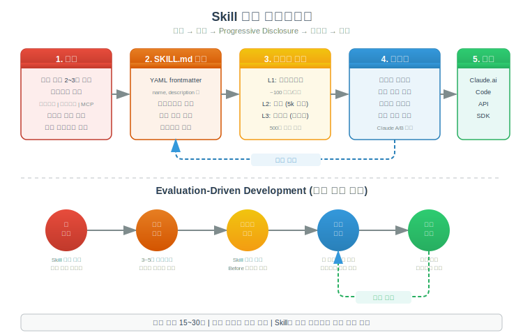

# Claude Code Skill

> `[3] 중급` · 선수 지식: [MCP](./mcp.md)

> `Trend` 2025

> AI 에이전트의 기능을 모듈화하여 확장하는 능력 패키징 시스템

`#ClaudeCode` `#Skill` `#스킬` `#Skills` `#SKILL.md` `#모듈화` `#Modular` `#워크플로우` `#Workflow` `#자동화` `#Automation` `#Anthropic` `#AI도구` `#ModelInvoked` `#자동발견` `#재사용` `#패키징` `#템플릿` `#프롬프트` `#ProjectSkill` `#UserSkill` `#ManagedSkill` `#트리거키워드` `#슬래시명령어` `#커스터마이징` `#ProgressiveDisclosure` `#EvaluationDriven` `#FrontMatter` `#SkillBuilding`

## 왜 알아야 하는가?

- **실무**: 반복되는 작업 패턴을 재사용 가능한 모듈로 만들어 생산성 향상
- **면접**: AI 도구를 단순 사용이 아닌 확장/커스터마이징하는 역량 증명
- **기반 지식**: Claude Code 자동화 및 팀 협업의 핵심 구성요소

## 핵심 개념

- **자동 발견 (Model-invoked)**: 사용자가 명시적으로 호출하지 않아도 Claude가 상황에 맞게 자동으로 선택하여 사용
- **모듈화된 전문성**: 특정 도메인의 지식과 워크플로우를 재사용 가능한 단위로 패키징
- **SKILL.md 기반**: 마크다운 파일로 정의하며 YAML frontmatter로 메타데이터 지정
- **Progressive Disclosure (점진적 공개)**: 3단계 로딩으로 컨텍스트 비용을 최적화
- **도구 접근 제어**: `allowed-tools` 옵션으로 특정 도구만 사용하도록 제한 가능
- **팀 공유 가능**: Git 저장소에 커밋하면 팀원 모두 동일한 Skill 사용 가능

## 쉽게 이해하기

**Skill**을 회사의 **업무 매뉴얼**에 비유할 수 있습니다.

신입사원(Claude)이 입사하면 모든 업무를 처음부터 배워야 합니다. 하지만 회사에 잘 정리된 업무 매뉴얼이 있다면, 특정 상황에서 어떻게 해야 하는지 바로 참고할 수 있습니다.

예를 들어, "고객 환불 요청" 상황이 발생하면:
- 매뉴얼 없이: 매번 선배에게 물어보거나 시행착오를 겪음
- 매뉴얼 있으면: "고객 환불 매뉴얼"을 자동으로 찾아서 절차대로 처리

Skill도 마찬가지입니다. "PDF 파일 처리해줘"라고 요청하면, Claude가 자동으로 `pdf-processing` Skill을 발견하고 그 안의 지침대로 작업합니다.

단, Slash Command가 "이 매뉴얼 실행해"라고 직접 지정하는 것이라면, Skill은 "상황에 맞는 매뉴얼을 알아서 찾아 적용"하는 것입니다.

## 상세 설명

### Skill vs Slash Command

두 기능 모두 Claude의 동작을 확장하지만, 호출 방식이 다릅니다.

| 구분 | Slash Command | Skill |
|------|---------------|-------|
| 호출 방식 | 사용자가 `/review`처럼 직접 호출 | Claude가 자동으로 발견 및 사용 |
| 파일 구조 | 단일 `.md` 파일 | 디렉토리 + `SKILL.md` |
| 지원 파일 | 불가 | 스크립트, 템플릿 등 지원 |
| 적합한 상황 | 같은 프롬프트를 반복 실행 | 상황에 따라 자동 적용 |

**왜 이렇게 구분되어 있는가?**

Slash Command는 "명확한 의도"가 있을 때 사용합니다. 사용자가 정확히 무엇을 원하는지 알고 있으므로 직접 호출합니다. 반면 Skill은 "맥락 기반 자동화"에 적합합니다. Claude가 대화 맥락을 분석하여 적절한 Skill을 선택하므로, 사용자가 매번 명령어를 기억할 필요가 없습니다.

### Skill vs MCP

**MCP = 연결 (What)** / **Skill = 절차 (How)**

| 구분 | MCP | Skill |
|------|-----|-------|
| 역할 | 외부 시스템 연결 | 작업 수행 방법 정의 |
| 비유 | 매장의 진열대 접근권 | 직원의 전문 지식 |
| 제공하는 것 | 도구(Tool) | 절차적 지식(Workflow) |
| 구문 처리 | 도구별 입출력 | 표현, 시퀀싱, 로직 |

**왜 분리되어 있는가?**

MCP는 "무엇에 접근할 수 있는가"를, Skill은 "그 데이터를 어떻게 활용할지"를 각각 담당합니다. 예를 들어 MCP가 BigQuery 연결을 제공하면, Skill은 "매출 분석 시 어떤 쿼리를 조합하고, 어떤 포맷으로 보고서를 만들지"를 정의합니다.

### Skill 저장 위치

| 종류 | 위치 | 용도 | 적용 범위 |
|------|------|------|----------|
| Enterprise | Managed settings | 조직 표준 워크플로우 | 조직 전체 |
| Personal Skill | `~/.claude/skills/` | 개인 워크플로우, 실험적 기능 | 모든 프로젝트 |
| Project Skill | `.claude/skills/` | 팀 워크플로우, 프로젝트 특화 기능 | 해당 프로젝트만 |
| Plugin | `<plugin>/skills/` | 플러그인 활성화 범위 | 플러그인 범위 |

> 동일 이름 시 우선순위: Enterprise > Personal > Project

**왜 여러 레벨로 나뉘는가?**

- **Personal Skill**: 개인의 작업 스타일에 맞춘 설정. Git에 공유되지 않으므로 실험적 Skill 테스트에 적합
- **Project Skill**: 팀 전체가 동일한 가이드라인을 따라야 할 때 사용. `git pull`만 하면 팀원 모두 동일한 Skill 사용
- **Enterprise**: 조직 전체 표준 정책을 강제할 때 사용. 보안 리뷰와 승인 프로세스 포함

---

## Skill 생성 가이드

### 1단계: 설계 (Planning & Design)

#### 사용 사례 정의

Skill 구축 전 **2~3개의 구체적 사용 사례**를 먼저 정의합니다.

```
사용 사례 정의 체크리스트:
┌────────────────────────────────────────────┐
│  1. 사용자 목표: 무엇을 달성하려 하는가?     │
│  2. 트리거 표현: 어떤 말로 요청하는가?        │
│  3. 수행 단계: 어떤 순서로 작업하는가?        │
│  4. 도구 사용: 어떤 도구가 필요한가?          │
│  5. 최종 결과: 어떤 산출물이 나오는가?        │
└────────────────────────────────────────────┘
```

#### Skill 3대 카테고리

| 카테고리 | 목적 | 특징 | 예시 |
|----------|------|------|------|
| **문서/자산 생성** | 정형화된 문서 생성 | 스타일 가이드 내장, 템플릿 활용 | 보고서, PPT, 엑셀 |
| **워크플로 자동화** | 다단계 프로세스 자동화 | 검증 지점 포함, 순차 실행 | 배포, 코드 리뷰 |
| **MCP 강화** | 외부 도구 조합 활용 | 도구 조합, 오류 처리 | 매출 분석, CRM 통합 |

### 2단계: SKILL.md 작성

#### 디렉토리 구조

```
skill-name/
├── SKILL.md              # 메인 지시사항 (필수)
├── template.md           # Claude가 채울 템플릿 (선택)
├── examples/             # 기대 출력 예시 (선택)
│   └── sample.md
├── scripts/              # 실행 가능한 코드 (선택)
│   ├── analyze.py
│   └── validate.py
├── references/           # 필요 시 로드할 문서 (선택)
│   ├── finance.md
│   └── api_docs.md
└── assets/               # 출력에 사용되는 파일 (선택)
    └── logo.png
```

| 디렉토리 | 목적 | 로딩 방식 |
|----------|------|----------|
| `scripts/` | 결정론적 반복 작업용 코드 | **실행** (코드 자체는 컨텍스트에 미로드, 출력만 소비) |
| `references/` | 필요 시 컨텍스트에 로드할 문서 | **읽기** (Claude가 필요 시 파일 읽기) |
| `assets/` | 출력에 사용되는 파일 | **참조** (컨텍스트에 로드되지 않음) |

**왜 이 구조인가?**

Slash Command는 단일 `.md` 파일이지만, Skill은 디렉토리입니다. 복잡한 워크플로우를 지원하기 위함입니다:
- 긴 참조 문서를 별도 파일로 분리하여 컨텍스트 비용 절감
- 헬퍼 스크립트 포함으로 결정론적 작업 위임
- 템플릿 파일로 일관된 출력 보장

#### YAML Frontmatter 전체 필드

```yaml
---
name: my-skill-name
description: 스킬이 하는 일과 사용 시점 설명
argument-hint: "[issue-number]"
disable-model-invocation: true
user-invocable: false
allowed-tools: Read, Grep, Glob
model: claude-sonnet-4-20250514
context: fork
agent: Explore
hooks: { ... }
---
```

| 필드 | 필수 | 설명 | 기본값 |
|------|------|------|--------|
| `name` | 권장 | 스킬 이름. 소문자/숫자/하이픈만, 최대 64자. 생략 시 디렉토리명 사용 | 디렉토리명 |
| `description` | 권장 | 스킬 설명 + 사용 시점. 최대 1024자 | - |
| `argument-hint` | 아니오 | 자동완성 시 인자 힌트 표시 | - |
| `disable-model-invocation` | 아니오 | `true`면 수동(`/name`)으로만 호출 가능 | `false` |
| `user-invocable` | 아니오 | `false`면 `/` 메뉴에서 숨김(Claude만 호출) | `true` |
| `allowed-tools` | 아니오 | 스킬 활성 시 허용 도구 제한 | 전체 허용 |
| `model` | 아니오 | 스킬 실행 시 사용할 모델 | 현재 모델 |
| `context` | 아니오 | `fork` 설정 시 격리된 서브에이전트에서 실행 | 메인 컨텍스트 |
| `agent` | 아니오 | `context: fork` 시 서브에이전트 타입 | general-purpose |
| `hooks` | 아니오 | 스킬 라이프사이클에 스코핑된 훅 | - |

#### name 유효성 규칙

- 소문자, 숫자, 하이픈(`-`)만 사용 가능
- 최대 64자
- XML 태그 형식 불가
- `anthropic`, `claude` 예약어 불가

#### 호출 제어 매트릭스

| Frontmatter 설정 | 사용자 호출 | Claude 호출 | description 로드 시점 |
|------------------|-----------|-----------|---------------------|
| (기본값) | 가능 | 가능 | 항상 로드 |
| `disable-model-invocation: true` | 가능 | 불가 | 미로드 |
| `user-invocable: false` | 불가 | 가능 | 항상 로드 |

**왜 호출 제어가 필요한가?**

- `disable-model-invocation: true`: 배포(`/deploy`)처럼 위험한 작업은 사용자의 명시적 의도가 있어야만 실행
- `user-invocable: false`: 내부 유틸리티 Skill은 Claude가 상황 판단하여 자동 사용, 사용자에게 노출 불필요

#### description 작성 원칙

`description`은 Skill의 **자동 발견 품질을 결정**하는 가장 중요한 필드입니다.

**작성 규칙:**
1. **3인칭으로 작성** (시스템 프롬프트에 주입되므로)
2. **구체적인 키워드 포함**
3. **무엇을 하는지 + 언제 사용하는지** 모두 포함

```yaml
# Bad - 모호하고 사용 시점 불명확
description: Helps with documents

# Bad - 1인칭 사용
description: I can help you process PDF files

# Good - 구체적이고 사용 시점 명확
description: Extract text and tables from PDF files, fill forms, merge documents. Use when working with PDF files or when the user mentions PDFs, forms, or document extraction.
```

#### 문자열 치환 변수

Skill 본문에서 런타임 값을 참조할 수 있습니다.

| 변수 | 설명 | 예시 |
|------|------|------|
| `$ARGUMENTS` | 호출 시 전달된 모든 인자 | `/fix-issue 123` → `"123"` |
| `$ARGUMENTS[N]` | N번째 인자 (0-based) | `/migrate Button React Vue` → `$ARGUMENTS[1]` = `"React"` |
| `$N` | `$ARGUMENTS[N]` 축약형 | `$0` = 첫 번째 인자 |
| `${CLAUDE_SESSION_ID}` | 현재 세션 ID | - |

#### 동적 컨텍스트 주입

`!` 접두사로 명령어 출력을 Skill 컨텍스트에 주입할 수 있습니다.

```yaml
---
name: pr-summary
description: Summarize changes in a pull request
context: fork
agent: Explore
allowed-tools: Bash(gh *)
---

## Pull request context
- PR diff: !`gh pr diff`
- PR comments: !`gh pr view --comments`
- Changed files: !`gh pr diff --name-only`

## Your task
Summarize this pull request...
```

**왜 유용한가?**

Skill이 실행될 때 최신 데이터를 자동으로 가져오므로, 항상 현재 상태 기반으로 작업할 수 있습니다.

### 3단계: Progressive Disclosure (점진적 공개)


Skill은 컨텍스트 비용을 최적화하기 위해 **3단계 점진적 공개 아키텍처**를 사용합니다.

| 레벨 | 로딩 시점 | 토큰 비용 | 내용 |
|------|----------|----------|------|
| **Level 1: 메타데이터** | 항상 (시작 시) | ~100 토큰/스킬 | `name` + `description` |
| **Level 2: 지시사항** | 스킬 트리거 시 | 5k 토큰 미만 | SKILL.md 본문 (워크플로우, 가이드라인) |
| **Level 3+: 리소스** | 필요 시 | 사실상 무제한 | 스크립트 실행, 참조 문서 읽기 |

```
로딩 과정:

시작 시 ───→ 모든 Skill의 name+description 로드 (Level 1)
                          │
사용자 요청 ──→ "이 PDF에서 텍스트 추출해줘"
                          │
Claude 판단 ──→ description 기반 관련 Skill 선택
                          │
Skill 활성화 ──→ SKILL.md 본문 로드 (Level 2)
                          │
선택적 로드 ──→ 필요한 참조 파일만 추가 읽기 (Level 3)
                          │
스크립트 실행 ──→ 코드 자체는 컨텍스트에 미포함, 출력만 소비
```

#### Progressive Disclosure 패턴 3가지

**패턴 1: 고수준 가이드 + 참조**

SKILL.md에 핵심 내용만 두고, 상세 내용은 별도 파일로 분리합니다.

```markdown
---
name: pdf-processing
description: Extract text and tables from PDF files...
---

# PDF Processing

## Quick start
[핵심 코드 예제]

## Advanced features
**Form filling**: See [FORMS.md](FORMS.md) for complete guide
**API reference**: See [REFERENCE.md](REFERENCE.md) for all methods
```

**패턴 2: 도메인별 분리**

도메인별로 참조 문서를 분리하여, 관련 도메인만 로드합니다.

```
bigquery-skill/
├── SKILL.md (개요 및 내비게이션)
└── reference/
    ├── finance.md (수익, 결제 메트릭)
    ├── sales.md (기회, 파이프라인)
    ├── product.md (API 사용량, 기능)
    └── marketing.md (캠페인, 귀인)
```

**패턴 3: 조건부 세부정보**

특정 조건에서만 필요한 상세 정보를 분리합니다.

```markdown
# DOCX Processing

## Creating documents
Use docx-js for new documents. See [DOCX-JS.md](DOCX-JS.md).

## Editing documents
For simple edits, modify the XML directly.

**For tracked changes**: See [REDLINING.md](REDLINING.md)
**For OOXML details**: See [OOXML.md](OOXML.md)
```

#### Progressive Disclosure 핵심 규칙

| 규칙 | 설명 |
|------|------|
| SKILL.md 본문 500줄 이하 | 컨텍스트 비용 관리 |
| 참조 1단계 깊이까지만 | 중첩 참조 지양 (SKILL.md → file.md 까지만) |
| 100줄 이상 참조 파일에 목차 포함 | Claude의 정보 탐색 효율성 |
| 파일명은 설명적으로 | `form_validation_rules.md` (O), `doc2.md` (X) |

### 4단계: 테스트 (Evaluation-Driven Development)

Anthropic은 **평가 주도 개발(Evaluation-Driven Development)** 방식을 권장합니다.

```
Skill 개발 사이클:

    ┌──────────────────────────────────────────────────┐
    │  1. 갭 식별: Skill 없이 대표 작업 수행            │
    │       → 실패 지점 문서화                          │
    │                    │                              │
    │                    ▼                              │
    │  2. 평가 생성: 갭을 테스트하는 3-5개 시나리오       │
    │                    │                              │
    │                    ▼                              │
    │  3. 기준선 측정: Skill 없이 성능 측정              │
    │                    │                              │
    │                    ▼                              │
    │  4. 최소 지시사항 작성: 갭 해결에 필요한 최소만     │
    │                    │                              │
    │                    ▼                              │
    │  5. 반복: 평가 실행 → 기준선 비교 → 개선  ──────┐ │
    │                    ▲                            │ │
    │                    └────────────────────────────┘ │
    └──────────────────────────────────────────────────┘
```

#### 테스트 방법

| 방법 | 환경 | 적합한 상황 |
|------|------|------------|
| 수동 테스트 | Claude.ai | 빠른 반복, 초기 설계 검증 |
| 스크립트 기반 | Claude Code | 회귀 테스트, 내부 팀 사용 |
| API 기반 | 자동화 | 정량적 검증, 대규모 배포 |

**수동 테스트: 자동 호출 테스트**
```
# description에 매칭되는 자연스러운 질문으로 테스트
How does this code work?
```

**수동 테스트: 직접 호출 테스트**
```
# 슬래시 명령으로 직접 테스트
/explain-code src/auth/login.ts
```

#### 5가지 평가 차원

| 차원 | 측정 내용 |
|------|----------|
| 트리거 정확도 | 올바른 요청에 활성화되고 무관한 요청에는 비활성화되는가? |
| 격리 동작 | Skill이 단독으로 올바르게 작동하는가? |
| 공존성 | 다른 Skill과 함께 있을 때 성능 저하가 없는가? |
| 지시사항 준수 | Claude가 Skill 지시사항을 정확히 따르는가? |
| 출력 품질 | 정확하고 유용한 결과를 생성하는가? |

#### 평가 구조 예시

```json
{
  "skills": ["pdf-processing"],
  "query": "Extract all text from this PDF and save to output.txt",
  "files": ["test-files/document.pdf"],
  "expected_behavior": [
    "PDF 파일을 적절한 라이브러리로 읽기",
    "모든 페이지에서 텍스트 추출",
    "output.txt에 추출 텍스트 저장"
  ]
}
```

#### 반복적 개발: Claude A/B 방법

| 역할 | 하는 일 |
|------|--------|
| **Claude A** (설계자) | Skill 설계 및 개선 |
| **Claude B** (테스터) | 실제 작업에서 Skill 사용 |

1. Claude B의 행동 관찰
2. Claude A에게 피드백 전달
3. Skill 개선
4. 반복

#### 개선 신호 진단

| 증상 | 원인 | 해결책 |
|------|------|--------|
| Skill이 활성화되지 않음 | description이 추상적 | 구체적 키워드와 사용 시점 추가 |
| 불필요한 상황에서 활성화 | description 범위 과다 | 범위 축소, 부정 트리거 추가 |
| 실행 결과가 부정확 | 지시사항 불명확 | 단계별 지침 구체화, 오류 처리 강화 |
| 컨텍스트 비용 과다 | SKILL.md가 너무 큼 | 참조 파일로 분리 (Progressive Disclosure) |

### 5단계: 배포 (Distribution)

#### 플랫폼별 배포 방법

| 플랫폼 | 배포 방법 | 네트워크 접근 | 패키지 설치 |
|--------|----------|-------------|-----------|
| **Claude.ai** | zip 업로드 (Settings > Features) | 설정에 따라 | npm/PyPI 가능 |
| **Claude Code** | 파일시스템 직접 배치 | 전체 접근 | 로컬 설치 권장 |
| **Claude API** | `/v1/skills` 엔드포인트 | 미접근 | 사전 설치만 |
| **Agent SDK** | 파일시스템 배치 | SDK 설정에 따라 | SDK 설정에 따라 |

> **중요**: 커스텀 Skill은 플랫폼 간 동기화되지 않습니다. 각 플랫폼에 별도 업로드 필요.

**Claude Code 배포:**

```bash
# Project Skill
mkdir -p .claude/skills/my-skill
# SKILL.md 작성 후 git commit

# Personal Skill
mkdir -p ~/.claude/skills/my-skill
# SKILL.md 작성
```

**Claude.ai 배포:**

1. Skill 디렉토리를 zip으로 압축
2. Settings > Features에서 업로드
3. Pro, Max, Team, Enterprise 플랜에서 사용 가능

**API 배포:**

```
# Beta headers 필요:
code-execution-2025-08-25
skills-2025-10-02
files-api-2025-04-14

# /v1/skills 엔드포인트로 업로드
# Workspace 범위로 공유
```

---

## 동작 원리

### Skill 자동 발견 프로세스



### Skill 빌딩 워크플로우



---

## 예제 코드

### 예제 1: 기본 Skill (코드 설명)

```yaml
# .claude/skills/explain-code/SKILL.md
---
name: explain-code
description: Explains code with visual diagrams and analogies. Use when explaining how code works, teaching about a codebase, or when the user asks "how does this work?"
---

When explaining code, always include:

1. **Start with an analogy**: Compare the code to something from everyday life
2. **Draw a diagram**: Use ASCII art to show the flow, structure, or relationships
3. **Walk through the code**: Explain step-by-step what happens
4. **Highlight a gotcha**: What's a common mistake or misconception?

Keep explanations conversational. For complex concepts, use multiple analogies.
```

### 예제 2: 수동 호출 전용 (배포 Skill)

```yaml
# .claude/skills/deploy/SKILL.md
---
name: deploy
description: Deploy the application to production
context: fork
disable-model-invocation: true
---

Deploy the application:
1. Run the test suite
2. Build the application
3. Push to the deployment target
4. Verify deployment succeeded
```

**왜 `disable-model-invocation: true`인가?**

배포는 프로덕션 환경에 직접 영향을 미치는 위험한 작업입니다. Claude가 대화 맥락만으로 자동 판단하여 실행하면 안 되고, 반드시 사용자가 `/deploy`로 명시적 호출해야 합니다.

### 예제 3: 인자 사용 Skill (이슈 수정)

```yaml
# .claude/skills/fix-issue/SKILL.md
---
name: fix-issue
description: Fix a GitHub issue
disable-model-invocation: true
argument-hint: "[issue-number]"
---

Fix GitHub issue $ARGUMENTS following our coding standards.

1. Read the issue description
2. Understand the requirements
3. Implement the fix
4. Write tests
5. Create a commit
```

**사용법:** `/fix-issue 123`

### 예제 4: 도구 제한 Skill (코드 리뷰)

```yaml
# .claude/skills/code-reviewer/SKILL.md
---
name: code-reviewer
description: 코드 품질과 잠재적 이슈를 검토합니다. 코드 리뷰, PR 검토, 코드 품질 분석 시 사용하세요.
allowed-tools: Read, Grep, Glob
---

# 코드 리뷰어

파일 수정 없이 읽기 전용으로 코드를 리뷰합니다.

## 리뷰 체크리스트

1. 코드 구조 및 조직화
2. 에러 처리 완성도
3. 성능 고려사항
4. 보안 취약점
5. 테스트 커버리지

## 사용 방법

1. Read 도구로 대상 파일 읽기
2. Grep으로 패턴 검색
3. Glob으로 관련 파일 찾기
4. 구체적인 라인 참조와 함께 상세 피드백 제공
```

### 예제 5: 다중 파일 Skill (API 설계)

```
# 폴더 구조
.claude/skills/api-designer/
├── SKILL.md
├── conventions.md
└── templates/
    └── endpoint-template.md
```

**SKILL.md:**

```yaml
---
name: api-designer
description: 팀 컨벤션에 따라 RESTful API를 설계합니다. 새 API 엔드포인트 생성이나 API 설계 검토 시 사용하세요.
---

# API 설계자

## 빠른 참조

네이밍 규칙은 [conventions.md](conventions.md) 참고.
엔드포인트 템플릿은 [templates/](templates/) 참고.

## 사용 방법

1. RESTful 네이밍 컨벤션 준수
2. 적절한 HTTP 메서드 사용
3. 일관된 응답 포맷 설계
4. 에러 처리 명세 포함
```

### 예제 6: MCP 연동 Skill (매출 분석)

```yaml
# .claude/skills/sales-analyzer/SKILL.md
---
name: sales-analyzer
description: Analyze sales data from CRM and generate insights. Use when analyzing revenue, pipeline, or sales performance.
---

## Data Sources
Use BigQuery:bigquery_query to pull sales data.
Use Salesforce:get_opportunities for pipeline data.

## Analysis Steps
1. Query current quarter pipeline
2. Compare with historical trends
3. Generate forecast report

## Important
- Always use fully qualified tool names (ServerName:tool_name)
- Validate data before analysis
```

> **MCP 도구 참조 규칙**: 반드시 정규화된 이름(Fully Qualified Name) 사용. `BigQuery:bigquery_query` (O), `bigquery_query` (X)

### 예제 7: 동적 컨텍스트 주입 Skill

```yaml
# .claude/skills/pr-summary/SKILL.md
---
name: pr-summary
description: Summarize changes in a pull request
context: fork
agent: Explore
allowed-tools: Bash(gh *)
---

## Pull request context
- PR diff: !`gh pr diff`
- PR comments: !`gh pr view --comments`
- Changed files: !`gh pr diff --name-only`

## Your task
Summarize this pull request focusing on:
1. What changed and why
2. Potential risks or concerns
3. Testing recommendations
```

---

## 베스트 프랙티스

### 핵심 원칙 3가지

**1. 간결함이 핵심 (Less is More)**

Claude는 이미 매우 똑똑합니다. 각 정보에 대해 자문하세요:
- "Claude가 정말 이 설명이 필요한가?"
- "이 토큰 비용을 정당화할 만큼 가치가 있는가?"

**2. 적절한 자유도 설정**

| 자유도 | 적합한 상황 | 표현 방식 |
|--------|------------|----------|
| 높음 | 여러 접근법이 유효한 경우 | 텍스트 지시 |
| 중간 | 선호 패턴이 있지만 변형 허용 | 의사코드/스크립트 |
| 낮음 | 정확한 순서 필수인 경우 | 구체적 스크립트 |

**3. 사용할 모든 모델로 테스트**

- **Haiku**: 충분한 가이드가 제공되는가?
- **Sonnet**: 명확하고 효율적인가?
- **Opus**: 과도한 설명이 없는가?

### 네이밍 컨벤션

**동명사(gerund) 형태 권장:**

```
# 좋은 예
processing-pdfs
analyzing-spreadsheets
managing-databases

# 허용
pdf-processing
process-pdfs

# 피해야 할 것 (모호함)
helper
utils
tools
```

### 워크플로우 패턴

**체크리스트 패턴** (복잡한 다단계 작업):

```markdown
Copy this checklist and track your progress:

Task Progress:
- [ ] Step 1: Analyze the input
- [ ] Step 2: Create mapping
- [ ] Step 3: Validate mapping
- [ ] Step 4: Execute transformation
- [ ] Step 5: Verify output
```

**피드백 루프 패턴** (반복 개선 작업):

```markdown
1. Make edits
2. Validate immediately: `python scripts/validate.py`
3. If validation fails: fix → validate again
4. Only proceed when validation passes
```

### 안티패턴 (피해야 할 것)

| 안티패턴 | 이유 | 대안 |
|----------|------|------|
| Windows 스타일 경로 (`\`) | 플랫폼 호환성 | `/` 사용 |
| 너무 많은 선택지 제공 | Claude가 결정 지연 | 기본값 제공 + 탈출구 |
| 시간에 민감한 정보 포함 | 업데이트 어려움 | 동적 참조로 대체 |
| 일관되지 않은 용어 사용 | 혼란 유발 | 용어 사전 정의 |
| README.md, CHANGELOG.md 포함 | 불필요한 컨텍스트 소비 | Skill 번들에서 제외 |

---

## 트레이드오프

| 장점 | 단점 |
|------|------|
| 반복 작업 자동화로 생산성 향상 | description 작성이 부실하면 자동 발견 실패 |
| 팀 전체 일관된 워크플로우 적용 | 복잡한 Skill은 유지보수 비용 증가 |
| 도메인 지식을 코드화하여 공유 | 유사한 Skill 간 충돌 가능성 |
| Git 기반 버전 관리 및 협업 용이 | 초기 설정 학습 곡선 존재 |
| Progressive Disclosure로 컨텍스트 최적화 | 플랫폼 간 동기화 미지원 |

---

## 트러블슈팅

### 사례 1: Skill이 자동 발견되지 않음

#### 증상
사용자가 관련 질문을 해도 Skill이 활성화되지 않음

#### 원인 분석
`description`이 너무 추상적이거나, 사용자가 실제 사용하는 표현과 매칭되지 않음

#### 해결 방법
1. 사용자가 실제로 사용하는 트리거 표현 수집
2. description에 구체적 키워드와 "Use when..." 패턴 추가
3. 다양한 표현으로 테스트

#### 예방 조치
Skill 설계 시 **2~3개의 구체적 사용 사례**를 먼저 정의하고, 각 사례의 트리거 표현을 description에 반영

### 사례 2: 불필요한 상황에서 Skill 활성화

#### 증상
무관한 요청에도 Skill이 활성화되어 의도치 않은 동작 수행

#### 원인 분석
description의 범위가 너무 넓거나, 다른 Skill과 description이 겹침

#### 해결 방법
1. description 범위 축소 (구체적 조건 명시)
2. 부정 트리거 추가: "Do NOT use when..."
3. 다른 Skill과의 경계 명확화

#### 예방 조치
`disable-model-invocation: true`로 설정하여 수동 호출만 허용하는 것도 방법

### 사례 3: 업로드 실패 (Claude.ai)

#### 증상
zip 파일 업로드 시 오류 발생

#### 원인 분석
- `SKILL.md` 파일명 오류 (대소문자 구분)
- YAML frontmatter 형식 오류
- zip 파일 구조 문제

#### 해결 방법
1. 파일명이 정확히 `SKILL.md`인지 확인
2. YAML `---` 구분자가 올바른지 확인
3. zip 내 최상위에 `SKILL.md`가 위치하는지 확인

#### 예방 조치
```bash
# 올바른 zip 구조 확인
unzip -l my-skill.zip
# SKILL.md가 최상위 또는 단일 디렉토리 내에 위치해야 함
```

### 사례 4: MCP 도구 호출 실패

#### 증상
Skill에서 MCP 도구를 사용하려 하지만 실행 실패

#### 원인 분석
- 도구 이름에 서버 접두사 누락
- MCP 서버 연결 미설정
- 인증 토큰 만료

#### 해결 방법
1. 정규화된 이름 사용: `ServerName:tool_name`
2. MCP 서버 연결 상태 확인
3. 인증 정보 갱신

#### 예방 조치
Skill에 MCP 도구 참조 시 항상 `서버이름:도구이름` 형식을 사용하고, 연결 실패 시 대체 동작을 정의

---

## 면접 예상 질문

### Q: Skill과 Slash Command의 차이점은 무엇인가요?

A: 핵심 차이는 **호출 방식**입니다. Slash Command는 사용자가 `/review`처럼 명시적으로 호출해야 합니다. 반면 Skill은 Claude가 대화 맥락을 분석하여 자동으로 적절한 Skill을 선택합니다.

**왜 이런 구분이 필요한가?** Slash Command는 "정확히 이 작업을 해라"라는 명확한 의도가 있을 때 적합합니다. Skill은 "PDF 다뤄줘"처럼 맥락에서 적절한 도구를 자동으로 선택해야 할 때 유용합니다. 따라서 자주 반복하는 명확한 작업은 Slash Command로, 상황에 따라 유연하게 적용해야 하는 워크플로우는 Skill로 구현합니다.

### Q: Skill의 description을 잘 작성하는 방법은?

A: 핵심은 **사용 시점을 명확히 명시**하는 것입니다.

**나쁜 예**: `description: 문서 관련 작업을 도와줍니다` - 언제 사용할지 불명확

**좋은 예**: `description: PDF 파일에서 텍스트와 테이블을 추출하고 양식을 작성합니다. PDF 파일 작업, 문서 추출, 양식 작성 시 사용하세요.`

**왜 이렇게 작성해야 하는가?** Claude는 description을 기반으로 "이 Skill을 사용할 상황인가?"를 판단합니다. 구체적인 키워드(PDF, 양식, 추출)와 사용 시점이 명시되어야 정확한 매칭이 가능합니다.

### Q: Progressive Disclosure가 왜 중요한가요?

A: **컨텍스트 윈도우 비용 최적화** 때문입니다. 모든 Skill의 전체 내용을 항상 로드하면 컨텍스트가 빠르게 소진됩니다. Progressive Disclosure는 Level 1(~100 토큰)만 항상 로드하고, 실제 필요할 때만 Level 2, 3을 로드하여 토큰을 절약합니다.

**왜 3단계인가?** Level 1은 "발견" (어떤 Skill이 있는지), Level 2는 "실행" (어떻게 작업하는지), Level 3은 "심화" (추가 참고 자료)로 각 단계가 명확한 역할을 갖습니다.

### Q: allowed-tools 옵션은 언제 사용하나요?

A: **안전성과 예측 가능성**이 중요한 상황에서 사용합니다.

대표적인 사용 사례:
- **읽기 전용 Skill**: 코드 리뷰어가 실수로 파일을 수정하면 안 됨 → `allowed-tools: Read, Grep, Glob`
- **보안 민감 작업**: 특정 도구 접근을 원천 차단
- **역할 분리**: 각 Skill의 책임 범위를 명확히 제한

**왜 기본값이 "모든 도구 허용"인가?** 대부분의 Skill은 유연성이 필요합니다. 제한은 필요한 경우에만 명시적으로 설정하는 것이 설계 철학입니다.

---

## 연관 문서

| 문서 | 연관성 | 난이도 |
|------|--------|--------|
| [MCP](./mcp.md) | 선수 지식 - AI 에이전트와 외부 시스템 연결 | [2] 입문 |
| [Slash Command](./claude-code-slash-command.md) | 관련 개념 - 명시적 호출 방식 | [3] 중급 |
| [Hook](./claude-code-hook.md) | 관련 개념 - 이벤트 기반 제어 | [3] 중급 |
| [Sub Agent](./claude-code-sub-agent.md) | 후속 학습 - `context: fork` 활용 | [4] 심화 |
| [Agent SDK](./agent-sdk.md) | 후속 학습 - 프로그래밍 방식 에이전트 구축 | [5] 심화 |
| [Context Engineering](./context-engineering.md) | 관련 개념 - Progressive Disclosure 설계 | [4] 심화 |

## 참고 자료

- [Claude Code Skills Documentation](https://docs.anthropic.com/en/docs/claude-code/skills)
- [The Complete Guide to Building Skills for Claude (PDF)](https://resources.anthropic.com/hubfs/The-Complete-Guide-to-Building-Skill-for-Claude.pdf)
- [A complete guide to building skills for Claude (Blog)](https://claude.com/blog/complete-guide-to-building-skills-for-claude)
- [Skill authoring best practices](https://platform.claude.com/docs/en/agents-and-tools/agent-skills/best-practices)
- [Skills for enterprise](https://platform.claude.com/docs/en/agents-and-tools/agent-skills/enterprise)
- [anthropics/skills - GitHub 공식 Skills 저장소](https://github.com/anthropics/skills)
- [긱뉴스 - Claude Skills 빌딩 완벽 가이드](https://news.hada.io/topic?id=26328)
