# Claude Code Sub Agent & Skill 활용 가이드

> `[4] 심화` · 선수 지식: [Skill](./claude-code-skill.md), [Hook](./claude-code-hook.md)

> `Trend` 2025

> AI 에이전트를 효과적으로 활용하기 위한 핵심 개념과 실전 사용법

`#ClaudeCode` `#SubAgent` `#서브에이전트` `#SubAgents` `#멀티에이전트` `#MultiAgent` `#병렬처리` `#ParallelProcessing` `#Task도구` `#TaskTool` `#Anthropic` `#AI자동화` `#에이전트오케스트레이션` `#Orchestration` `#위임` `#Delegation` `#컨텍스트분리` `#독립실행` `#비동기` `#Async` `#Explore` `#Plan` `#Swarm` `#효율성` `#복잡한작업` `#아키텍처`

## 왜 알아야 하는가?

- **실무**: 복잡한 작업을 독립적인 에이전트에 위임하여 병렬 처리 및 효율성 극대화
- **면접**: AI 에이전트 아키텍처 이해와 고급 활용 역량 증명
- **기반 지식**: 대규모 AI 자동화 시스템 설계의 핵심 패턴

## 핵심 개념: 누가(Who) vs 어떻게(How)

Claude Code에서 복잡한 작업을 처리할 때 두 가지 핵심 도구가 있습니다.

| 구분 | Sub Agent (서브에이전트) | Skill (스킬) |
|------|-------------------------|--------------|
| **핵심 질문** | "누가 이 일을 할 것인가?" | "어떤 규칙으로 할 것인가?" |
| **비유** | 전문 요리사 | 요리 레시피 |
| **역할** | 독립적으로 작업을 수행하는 전문가 | 작업 시 참고하는 지침서 |
| **저장 위치** | `.claude/agents/이름.md` | `.claude/skills/이름/SKILL.md` |
| **컨텍스트** | 별도의 독립 공간에서 작업 | 메인 대화에서 참조 |
| **호출 방식** | 명시적 호출 또는 자동 위임 | 상황에 맞게 자동 발견 |

## 쉽게 이해하기



**레스토랑 비유**:
- **메인 에이전트** = 총주방장: 전체 주문 관리, 요리사 배정
- **Sub Agent** = 전문 요리사: 스테이크 전문가, 파스타 전문가
- **Skill** = 레시피: "우리 가게 시크릿 소스 비법"

## 사용 방법

### 1단계: 설정 (준비)

프로젝트 루트에 필요한 파일을 생성합니다.

**Sub Agent 정의** (`.claude/agents/order-expert.md`):
```markdown
---
name: order-expert
description: 주문 로직 전문가. 주문 API 개발 시 사용
tools: Read, Edit, Bash, Grep, Glob
model: sonnet
---

당신은 주문 도메인 전문가입니다.

## 역할
- 주문 생성/수정/취소 API 개발
- 주문 상태 관리 로직 구현
- 재고 확인 및 차감 처리

## 작업 방식
1. 기존 주문 관련 코드 분석
2. 요구사항에 맞는 API 설계
3. 에러 처리 포함하여 구현
4. 단위 테스트 작성
```

**Skill 정의** (`.claude/skills/api-standard/SKILL.md`):
```markdown
---
name: api-standard
description: 사내 API 응답 규격. API 개발 시 자동 적용
---

## API 응답 형식

모든 API는 다음 형식을 따릅니다:

```json
{
  "success": true,
  "data": { },
  "error": null,
  "timestamp": "2025-01-01T00:00:00Z"
}
```

## 에러 코드 규칙
- 1xxx: 인증 관련
- 2xxx: 권한 관련
- 3xxx: 비즈니스 로직
- 4xxx: 외부 서비스

## 네이밍 규칙
- 엔드포인트: kebab-case (`/order-items`)
- 필드명: camelCase (`orderId`)
```

### 2단계: 실행 (명령)

**방법 1: 자동 위임** (가장 간단)
```
> 주문 API 만들어줘

Claude가 자동으로:
1. order-expert 서브에이전트 호출
2. api-standard 스킬 참조
3. 독립 컨텍스트에서 작업 후 결과 반환
```

**방법 2: 특정 전문가 지목**
```
> @order-expert 주문 취소 API 추가해줘
```

**방법 3: 에이전트 목록에서 선택**
```
> /agents
[목록에서 order-expert 선택]
> 주문 상태 변경 API 만들어줘
```

### 3단계: 결과 확인

```
[order-expert 에이전트 작업 완료]

생성된 파일:
- src/api/orders/create.ts
- src/api/orders/cancel.ts
- src/tests/orders.test.ts

Agent ID: order-abc123
(나중에 이 ID로 작업 재개 가능)
```

## 내장 에이전트 타입

별도 정의 없이 바로 사용할 수 있는 에이전트입니다.

| 타입 | 용도 | 특징 |
|------|------|------|
| **Explore** | 코드 검색/분석 | 빠르고 저렴 (Haiku), 읽기 전용 |
| **General-Purpose** | 코드 수정/생성 | 모든 도구 사용 가능 (Sonnet) |
| **Plan** | 계획 수립 | 플랜 모드 전용 |

**Explore 철저함 수준**:
```
quick        → "이 함수 어디있어?" (단순 검색)
medium       → "에러 처리 구조 설명해줘" (일반 분석)
very thorough → "전체 아키텍처 파악해줘" (심층 분석)
```

## 실전 예제

### 예제 1: 기능 개발 워크플로우

```
프로젝트 구조:
.claude/
├── agents/
│   ├── db-architect.md      # DB 설계 전문가
│   ├── order-expert.md      # 주문 로직 전문가
│   └── test-writer.md       # 테스트 작성 전문가
└── skills/
    ├── api-standard/        # API 규격
    └── error-codes/         # 에러 코드 표준

사용자: "주문 기능 만들어줘"

워크플로우:
1. 메인 Claude → db-architect 호출
   "주문 테이블 설계해줘"

2. 메인 Claude → order-expert 호출
   "주문 CRUD API 구현해줘"
   (api-standard 스킬 자동 참조)

3. 메인 Claude → test-writer 호출
   "주문 API 테스트 작성해줘"

4. 결과 통합 → 사용자에게 보고
```

### 예제 2: Resume으로 장기 작업

```
[1일차: 분석]
> 결제 시스템 전체 분석해줘

Claude: [Explore 에이전트로 분석]
        Agent ID: payment-001

[2일차: 계획]
> payment-001 재개하고 리팩토링 계획 세워줘

Claude: [이전 분석 컨텍스트 복원]
        [계획 수립]

[3일차: 구현]
> payment-001 재개하고 1단계 구현해줘

Claude: [이전 계획 기반으로 구현]
```

### 예제 3: 병렬 작업

```bash
# 터미널 1
git worktree add ../auth -b feature-auth
cd ../auth && claude
> 인증 모듈 개발해줘

# 터미널 2 (동시 진행)
git worktree add ../payment -b feature-payment
cd ../payment && claude
> 결제 모듈 개발해줘

# 완료 후 병합
git merge feature-auth feature-payment
```

## 언제 무엇을 사용하나?

### Sub Agent를 사용할 때

| 상황 | 이유 |
|------|------|
| 복잡한 분석 작업 | 독립 컨텍스트로 깊이 있는 분석 |
| 코드 리뷰/감사 | 전문화된 체크리스트 적용 |
| 장기 프로젝트 | Resume으로 컨텍스트 유지 |
| 병렬 작업 | 여러 기능 동시 개발 |

### Skill을 사용할 때

| 상황 | 이유 |
|------|------|
| 팀 코딩 컨벤션 | 모든 작업에 일관되게 적용 |
| API 규격 표준화 | 자동으로 규격 준수 |
| 반복 패턴 정의 | 매번 설명 없이 자동 적용 |

### 조합해서 사용할 때

```
Skill: "API는 이런 형식으로 만들어야 해" (규칙)
   +
Sub Agent: "내가 그 규칙대로 만들게" (실행자)
   =
일관된 품질의 결과물
```

## 핵심 정리



## 빠른 시작 체크리스트

1. [ ] 반복되는 작업 패턴 → Skill로 정의
2. [ ] 전문 역할이 필요한 작업 → Sub Agent로 정의
3. [ ] 코드 검색/분석만 필요 → Explore 에이전트 사용
4. [ ] 코드 수정이 필요 → General-Purpose 에이전트 사용
5. [ ] 장기 작업 → Agent ID 저장 후 Resume 활용

## 연관 문서

| 문서 | 연관성 | 난이도 |
|------|--------|--------|
| [MCP](./mcp.md) | 선수 지식 - AI 에이전트 기초 | [2] 입문 |
| [Skill](./claude-code-skill.md) | 선수 지식 - 모듈화된 지침 | [3] 중급 |
| [Hook](./claude-code-hook.md) | 관련 개념 - 이벤트 제어 | [3] 중급 |

## 참고 자료

- [Claude Code Sub-Agents Documentation](https://docs.anthropic.com/en/docs/claude-code/sub-agents)
- [Claude Code Skills Documentation](https://docs.anthropic.com/en/docs/claude-code/skills)
