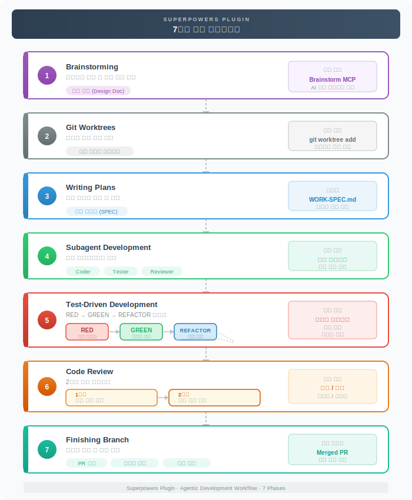
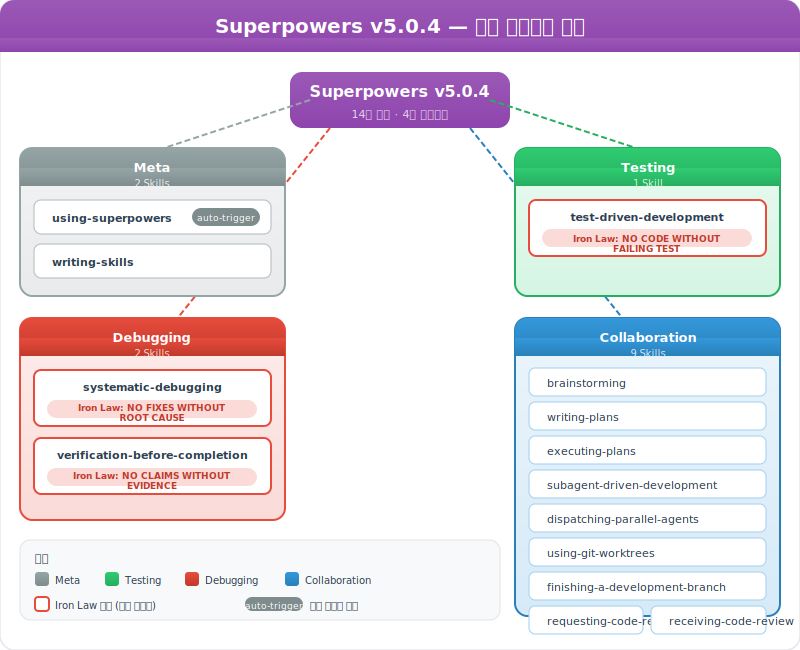

# Claude Code Superpowers 플러그인

> `[3] 중급` · 선수 지식: [Skill](./claude-code-skill.md), [Plugin](./claude-code-plugin.md)

> `Trend` 2025-2026

> 14개 스킬로 구성된 완전한 소프트웨어 개발 워크플로우 플러그인, TDD·체계적 디버깅·검증 기반의 규율 있는 개발 프로세스

`#ClaudeCode` `#Superpowers` `#슈퍼파워` `#Plugin` `#Skill` `#TDD` `#TestDrivenDevelopment` `#Debugging` `#체계적디버깅` `#CodeReview` `#Brainstorming` `#브레인스토밍` `#GitWorktree` `#SubAgent` `#서브에이전트` `#병렬실행` `#ParallelAgents` `#ImplementationPlan` `#IronLaw` `#Verification` `#검증` `#RedGreenRefactor` `#Anthropic` `#워크플로우` `#Workflow` `#자동화` `#Automation` `#개발규율`

## 왜 알아야 하는가?

- **실무**: 14개 스킬이 브레인스토밍부터 코드 리뷰까지 전체 개발 라이프사이클을 커버하여 일관된 품질의 코드를 생산
- **면접**: TDD, 체계적 디버깅, 코드 리뷰 등 소프트웨어 엔지니어링 베스트 프랙티스를 자동화 수준으로 내재화한 경험 증명
- **기반 지식**: AI 에이전트가 "규율 있는 개발"을 수행하는 방법론, 스킬 기반 워크플로우 오케스트레이션의 참조 구현

## 왜 사용하는가?

> AI 에이전트가 단계를 건너뛰거나 지름길을 택하지 않도록, Iron Law로 소프트웨어 엔지니어링 규율을 강제하여 일관된 품질의 코드를 생산하기 위해 사용한다.

### AI 에이전트에게 규율이 필요한 이유

AI 에이전트는 기본적으로 **효율성을 추구**합니다. "빨리 결과를 내자"는 경향이 있어 중요한 단계를 건너뛰기 쉽습니다:

- 설계 없이 바로 코딩 시작
- 테스트 없이 구현 완료 선언
- 근본 원인 파악 없이 감으로 버그 수정
- "코드 바꿨으니 고쳐졌을 것"이라는 검증 없는 추정

사람도 마찬가지지만, AI는 이런 합리화를 더 자연스럽게 합니다. Superpowers는 이 문제를 **Iron Law(철칙)로 구조적으로 차단**합니다.

### Superpowers 유무 비교

| 관점 | Superpowers 미사용 | Superpowers 사용 |
|------|-------------------|-----------------|
| **설계** | 바로 코딩 시작 | brainstorming으로 설계 승인 후 구현 |
| **테스트** | 구현 후 테스트 (또는 생략) | TDD 강제 — 실패 테스트 먼저, 위반 시 삭제 |
| **디버깅** | 감으로 이것저것 시도 | 4단계 체계적 프로세스 — 근본 원인 먼저 |
| **완료 기준** | "될 것 같다" | 검증 증거 필수 — 실행 결과 첨부 |
| **코드 리뷰** | 단일 리뷰 또는 생략 | 2단계 자동 리뷰 (스펙 준수 + 코드 품질) |
| **병렬 처리** | 단일 스레드 순차 처리 | 서브에이전트로 컨텍스트 격리 병렬 실행 |

### 3가지 Iron Law가 핵심

Superpowers 14개 스킬 중 가장 중요한 것은 **3가지 Iron Law**입니다:

| Iron Law | 스킬 | 방지하는 문제 |
|----------|------|-------------|
| 실패 테스트 없이 코드 금지 | test-driven-development | "테스트 나중에 쓸게" → 영원히 안 씀 |
| 근본 원인 없이 수정 금지 | systematic-debugging | "이거 바꿔보자" → 다른 버그 생성 |
| 증거 없이 완료 선언 금지 | verification-before-completion | "고쳤을 거야" → 실제로는 안 고쳐짐 |

이 3가지만으로도 AI 에이전트의 코드 품질이 크게 향상됩니다. 나머지 11개 스킬은 이 규율 위에서 **워크플로우를 체계화**하는 역할입니다.

## 핵심 개념

- **Iron Law (철칙)**: 각 스킬에 위반 불가능한 핵심 규칙이 존재 — "테스트 없이 프로덕션 코드 금지", "근본 원인 없이 수정 금지", "검증 없이 완료 선언 금지"
- **7단계 기본 워크플로우**: brainstorming → worktree → plan → subagent-development → TDD → code-review → finish-branch의 완전한 개발 사이클
- **자동 트리거 (using-superpowers)**: 모든 대화 시작 시 자동 로드되어 상황에 맞는 스킬을 1%라도 관련 있으면 반드시 호출
- **Subagent 기반 병렬 실행**: 독립적인 작업을 서브에이전트에 위임하여 컨텍스트 격리와 병렬 처리를 동시에 달성
- **2단계 리뷰 시스템**: 모든 구현 후 스펙 준수 리뷰 → 코드 품질 리뷰의 이중 검증
- **증거 기반 검증**: 완료 주장 전 반드시 실행 결과(테스트 출력, 빌드 로그)를 증거로 제시
- **사용자 지시 최우선**: Superpowers 스킬보다 CLAUDE.md 등 사용자 명시적 지시가 항상 우선

## 쉽게 이해하기

**Superpowers**를 **숙련된 시니어 개발자의 체크리스트 습관**에 비유할 수 있습니다.

주니어 개발자는 코드를 바로 작성하고, 테스트를 나중에 추가하며, 버그를 감으로 수정합니다. 반면 시니어 개발자는:

```
주니어: "코드 짜자!" → 버그 발생 → "이것저것 바꿔보자" → 우연히 해결
시니어: "먼저 설계하자" → "테스트부터 작성" → "실패 확인" → "최소 구현" → "검증" → "리뷰"
```

Superpowers는 이 시니어 개발자의 습관을 14개의 자동 실행 체크리스트로 만든 것입니다. Claude가 "빨리 코드 짜자"는 유혹에 빠지지 않도록, 각 단계에 Iron Law(철칙)를 설정하여 건너뛸 수 없게 합니다.

## 상세 설명

### 기본 워크플로우 (7단계)

Superpowers의 핵심은 아이디어에서 완성된 코드까지의 **완전한 개발 사이클**입니다.



```
[1] Brainstorming          아이디어 → 설계 문서
         │
         ▼
[2] Git Worktrees           격리된 작업 환경 생성
         │
         ▼
[3] Writing Plans           구현 계획서 작성
         │
         ▼
[4] Subagent Development    서브에이전트로 병렬 구현
         │
         ▼
[5] Test-Driven Development RED → GREEN → REFACTOR 사이클
         │
         ▼
[6] Code Review             스펙 준수 + 코드 품질 이중 검증
         │
         ▼
[7] Finishing Branch        브랜치 정리 및 통합
```

각 단계는 이전 단계의 산출물을 입력으로 받습니다. brainstorming의 설계 문서가 plan의 입력이 되고, plan이 subagent의 구현 지시서가 됩니다.

### 14개 스킬 카테고리

Superpowers의 14개 스킬은 4개 카테고리로 분류됩니다.



#### Meta (메타 스킬)

| 스킬 | 트리거 | 핵심 원칙 |
|------|--------|----------|
| **using-superpowers** | 모든 대화 시작 시 자동 | 1%라도 관련 스킬이 있으면 반드시 호출 |
| **writing-skills** | 스킬 생성/수정 시 | TDD를 문서 작성에 적용 |

**using-superpowers**는 다른 모든 스킬의 게이트웨이입니다. 대화가 시작되면 자동으로 로드되어 "어떤 스킬을 사용해야 하는가?"를 판단합니다.

**우선순위 규칙:**
1. 사용자 명시적 지시 (CLAUDE.md, 직접 요청) — 최우선
2. Superpowers 스킬 — 시스템 프롬프트 기본 동작을 오버라이드
3. 시스템 프롬프트 기본 동작 — 최하위

#### Testing (테스팅)

| 스킬 | 트리거 | Iron Law |
|------|--------|----------|
| **test-driven-development** | 기능 구현, 버그 수정 전 | 실패하는 테스트 없이 프로덕션 코드 금지 |

**Red-Green-Refactor 사이클:**

```
RED: 실패하는 테스트 작성
  → 실패 확인 (올바른 이유로 실패하는지 검증)
    → GREEN: 테스트를 통과하는 최소한의 코드 작성
      → 모든 테스트 통과 확인
        → REFACTOR: 코드 정리 (테스트는 계속 통과)
          → 다음 RED로
```

**위반 시 대응:**
- 테스트 전에 코드를 작성했다면? → **삭제하고 처음부터 다시 시작**
- "참고용"으로 남겨둘 수 있나? → **불가. 삭제는 삭제**

#### Debugging (디버깅)

| 스킬 | 트리거 | Iron Law |
|------|--------|----------|
| **systematic-debugging** | 버그, 테스트 실패, 예상치 못한 동작 | 근본 원인 조사 없이 수정 금지 |
| **verification-before-completion** | 완료 주장, 커밋, PR 생성 전 | 검증 증거 없이 완료 선언 금지 |

**systematic-debugging의 4단계:**

| Phase | 이름 | 핵심 활동 |
|-------|------|----------|
| 1 | **근본 원인 조사** | 에러 메시지 정독, 재현, 최근 변경 확인, 진단 로그 |
| 2 | **가설 수립** | 증거 기반 가설 목록, 우선순위 지정 |
| 3 | **검증 및 수정** | 가설 하나씩 검증, 최소 변경으로 수정 |
| 4 | **회귀 방지** | 회귀 테스트 추가, 모니터링 확인 |

**verification-before-completion의 게이트 함수:**

```
1. IDENTIFY — 이 주장을 증명하는 명령어는?
2. RUN     — 해당 명령어 전체 실행 (새로, 완전히)
3. READ    — 전체 출력 확인, 종료 코드 체크
4. VERIFY  — 출력이 주장을 확인하는가?
5. CLAIM   — 증거와 함께 주장
```

| 주장 | 필요한 증거 | 불충분한 증거 |
|------|-----------|-------------|
| 테스트 통과 | 테스트 명령 출력: 0 failures | 이전 실행, "통과할 것" |
| 빌드 성공 | 빌드 명령: exit 0 | 린터 통과, 로그 괜찮아 보임 |
| 버그 수정 | 원래 증상 테스트 통과 | 코드 변경됨, 수정 추정 |

#### Collaboration (협업)

| 스킬 | 트리거 | 핵심 원칙 |
|------|--------|----------|
| **brainstorming** | 기능 생성, 컴포넌트 빌드, 동작 수정 전 | 설계 승인 없이 구현 금지 |
| **writing-plans** | 스펙/요구사항이 있는 다단계 작업 | 코드 터치 전에 계획 작성 |
| **executing-plans** | 작성된 계획을 별도 세션에서 실행 | 리뷰 체크포인트 포함 |
| **subagent-driven-development** | 독립 작업이 있는 계획 실행 | 태스크당 새 서브에이전트 + 2단계 리뷰 |
| **dispatching-parallel-agents** | 2개 이상 독립 작업 | 공유 상태 없는 작업만 병렬화 |
| **requesting-code-review** | 작업 완료, 주요 기능 구현 후 | 요구사항 충족 검증 |
| **receiving-code-review** | 코드 리뷰 피드백 수신 시 | 기술적 엄격성, 맹목적 동의 금지 |
| **using-git-worktrees** | 격리된 작업 환경 필요 시 | 안전 검증 후 워크트리 생성 |
| **finishing-a-development-branch** | 구현 완료, 테스트 통과 후 | 머지/PR/정리 옵션 구조화 제시 |

### 핵심 스킬 상세

#### brainstorming — 설계 먼저

**체크리스트 (순서대로):**

1. 프로젝트 컨텍스트 탐색 (파일, 문서, 최근 커밋)
2. 시각적 동반자 제안 (UI 관련 질문이 예상될 때)
3. 명확화 질문 (한 번에 하나씩)
4. 2-3개 접근 방식 제안 (트레이드오프 + 추천안)
5. 설계 제시 (복잡도에 비례하는 섹션 분할)
6. 설계 문서 작성 → `docs/superpowers/specs/` 저장
7. 스펙 리뷰 루프 (서브에이전트 검토, 최대 3회 반복)
8. 사용자 최종 확인
9. writing-plans 스킬로 전환

**Hard Gate:** 설계 승인 전 어떤 구현 행위도 금지. "이건 단순하니까 설계 불필요"는 안티패턴.

#### writing-plans — Bite-Sized 태스크

**태스크 세분화 기준 (각 2-5분):**

```
Step 1: 실패하는 테스트 작성
Step 2: 테스트 실행하여 실패 확인
Step 3: 테스트 통과하는 최소 코드 구현
Step 4: 테스트 실행하여 통과 확인
Step 5: 커밋
```

**플랜 문서 필수 헤더:**
- 관련 스펙 링크
- 의존성 목록
- 검증 명령어
- 예상 산출물

#### subagent-driven-development — 격리된 구현

**핵심 구조:**

```
메인 에이전트 (오케스트레이터)
    │
    ├── Task 1 → 서브에이전트 A (구현)
    │                 │
    │                 ├── 스펙 준수 리뷰어 (1차)
    │                 └── 코드 품질 리뷰어 (2차)
    │
    ├── Task 2 → 서브에이전트 B (구현)
    │                 │
    │                 ├── 스펙 준수 리뷰어 (1차)
    │                 └── 코드 품질 리뷰어 (2차)
    │
    └── Task 3 → ...
```

**왜 태스크마다 새 서브에이전트인가?**
- 이전 태스크의 컨텍스트 오염 방지
- 메인 에이전트의 컨텍스트 윈도우 보존
- 필요한 컨텍스트만 정확히 구성하여 전달

### 스킬 요약표

| # | 스킬 | 카테고리 | 자동/수동 | Iron Law |
|---|------|---------|----------|----------|
| 1 | using-superpowers | Meta | 자동 | 1% 관련이면 스킬 호출 필수 |
| 2 | writing-skills | Meta | 수동 | TDD를 스킬 작성에 적용 |
| 3 | brainstorming | Collaboration | 자동 | 설계 승인 없이 구현 금지 |
| 4 | writing-plans | Collaboration | 수동 | 코드 전에 계획 |
| 5 | executing-plans | Collaboration | 수동 | 리뷰 체크포인트 필수 |
| 6 | subagent-driven-development | Collaboration | 수동 | 태스크당 새 서브에이전트 + 2단계 리뷰 |
| 7 | dispatching-parallel-agents | Collaboration | 수동 | 독립 작업만 병렬화 |
| 8 | using-git-worktrees | Collaboration | 수동 | 안전 검증 후 생성 |
| 9 | finishing-a-development-branch | Collaboration | 수동 | 구조화된 옵션 제시 |
| 10 | requesting-code-review | Collaboration | 수동 | 요구사항 충족 검증 |
| 11 | receiving-code-review | Collaboration | 수동 | 기술적 엄격성, 맹목적 동의 금지 |
| 12 | test-driven-development | Testing | 수동 | 실패 테스트 없이 코드 금지 |
| 13 | systematic-debugging | Debugging | 수동 | 근본 원인 없이 수정 금지 |
| 14 | verification-before-completion | Debugging | 수동 | 증거 없이 완료 선언 금지 |

### 실전 활용 시나리오

#### 시나리오 1: 새 기능 개발

```
사용자: "사용자 인증 시스템 구현해줘"

[using-superpowers] → brainstorming 스킬 자동 트리거
[brainstorming]
  1. 프로젝트 구조 탐색
  2. "JWT vs 세션 기반? OAuth 필요? 2FA 포함?"
  3. 3가지 접근 방식 비교 제시
  4. 승인된 설계 문서 작성

[writing-plans]
  → 15개 Bite-Sized 태스크로 분할
  → 각 태스크에 테스트-구현-검증 사이클 포함

[using-git-worktrees]
  → 격리된 작업 환경 생성

[subagent-driven-development]
  → 태스크별 서브에이전트 디스패치
  → 각 태스크 완료 후 2단계 리뷰

[verification-before-completion]
  → 전체 테스트 스위트 실행
  → 빌드 성공 확인
  → 증거와 함께 완료 보고

[finishing-a-development-branch]
  → PR 생성 / 머지 / 정리 옵션 제시
```

#### 시나리오 2: 프로덕션 버그 수정

```
사용자: "주문 API에서 간헐적 500 에러 발생"

[using-superpowers] → systematic-debugging 스킬 트리거
[systematic-debugging]
  Phase 1: 에러 로그 정독, 재현 조건 확인
  Phase 2: "커넥션 풀 고갈" 가설 수립
  Phase 3: 진단 로그로 가설 검증 → 확인

[test-driven-development]
  RED: 커넥션 풀 고갈 시나리오 테스트 작성
  GREEN: 커넥션 타임아웃 설정 추가
  REFACTOR: 커넥션 관리 로직 정리

[verification-before-completion]
  → 회귀 테스트 통과 확인
  → 부하 테스트로 커넥션 풀 안정성 검증
```

#### 시나리오 3: 코드 리뷰 피드백 처리

```
리뷰어: "이 부분 N+1 쿼리 문제 있을 수 있어요"

[receiving-code-review]
  1. 피드백의 기술적 타당성 검증
  2. 실제로 N+1 쿼리인지 프로파일링으로 확인
  3. 타당하면 수정, 아니면 증거와 함께 반박
  → 맹목적 동의가 아닌 기술적 엄격성

[test-driven-development]
  → 수정이 필요한 경우 TDD로 진행
```

### Red Flags (자기 합리화 경고)

using-superpowers는 Claude가 스킬을 건너뛰려고 자기 합리화하는 패턴을 명시적으로 경고합니다:

| 합리화 | 현실 |
|--------|------|
| "이건 단순한 질문이야" | 질문도 작업. 스킬 확인 필요 |
| "먼저 컨텍스트가 필요해" | 스킬이 컨텍스트 수집 방법을 알려줌 |
| "코드베이스 먼저 탐색하자" | 스킬이 탐색 방법을 알려줌 |
| "이 스킬은 과하다" | 단순한 것이 복잡해지는 법 |
| "먼저 이것만 하고..." | 확인 후에 행동 |

### Superpowers vs 독자 개발 비교

| 관점 | Superpowers 사용 | 미사용 |
|------|-----------------|--------|
| 설계 | 항상 brainstorming 거침 | 바로 코딩 시작 |
| 테스트 | TDD 강제 (RED-GREEN-REFACTOR) | 구현 후 테스트 (또는 생략) |
| 디버깅 | 4단계 체계적 프로세스 | 감으로 이것저것 시도 |
| 완료 기준 | 증거 기반 검증 필수 | "될 것 같다" |
| 코드 리뷰 | 2단계 (스펙+품질) 자동 리뷰 | 단일 리뷰 또는 생략 |
| 병렬 처리 | 서브에이전트로 컨텍스트 격리 | 단일 스레드 순차 처리 |

### 설치 및 설정

```bash
# 공식 마켓플레이스에서 설치 (v5.0.4)
/plugin install superpowers@claude-plugins-official

# 설치 확인
/plugin  → Installed 탭에서 superpowers 확인
```

설치 후 별도 설정 없이 using-superpowers가 모든 대화에서 자동 활성화됩니다.

---

## 면접 예상 질문

### Q: Superpowers의 Iron Law란 무엇이며, 왜 필요한가?

A: Iron Law는 각 스킬에 설정된 **위반 불가능한 핵심 규칙**입니다.

예를 들어 TDD의 Iron Law는 "실패하는 테스트 없이 프로덕션 코드 금지"이며, 이를 위반하면 작성한 코드를 삭제하고 처음부터 다시 시작합니다. AI 에이전트는 효율성 추구로 인해 단계를 건너뛰는 경향이 있는데, Iron Law는 이런 "지름길의 유혹"을 구조적으로 차단합니다. 결과적으로 단기적으로는 느려 보이지만, 재작업과 버그를 줄여 장기적으로 더 빠릅니다.

### Q: Subagent-driven development에서 왜 태스크마다 새 서브에이전트를 생성하는가?

A: 3가지 이유가 있습니다.

1. **컨텍스트 오염 방지**: 이전 태스크의 코드, 디버깅 히스토리가 다음 태스크의 판단을 흐리지 않음
2. **메인 에이전트 컨텍스트 보존**: 오케스트레이터는 전체 계획 조율에 집중하고, 구현 세부사항은 서브에이전트에 위임
3. **정밀한 컨텍스트 구성**: 세션 히스토리가 아닌, 태스크에 필요한 정보만 선별하여 전달

이는 마이크로서비스 아키텍처에서 서비스 간 격리와 동일한 원리입니다.

### Q: verification-before-completion은 왜 별도 스킬로 분리되었는가?

A: AI 에이전트의 가장 위험한 패턴이 **"코드를 변경했으니 고쳐졌을 것"이라는 추정**이기 때문입니다.

사람도 마찬가지지만, AI는 특히 "테스트가 통과할 것이다"라고 자신 있게 말하면서 실제로는 확인하지 않는 경향이 강합니다. 이 스킬은 "증거 없이 주장하면 거짓말"이라는 원칙을 강제하여, 모든 완료 주장에 실행 결과라는 증거를 반드시 첨부하게 합니다.

### Q: 14개 스킬을 모두 알아야 하는가?

A: using-superpowers가 자동으로 상황에 맞는 스킬을 선택하므로 **전부 외울 필요는 없습니다**. 단, 3개 Iron Law (TDD, Debugging, Verification)는 이해해야 합니다. 이 3개가 코드 품질의 핵심 보장이기 때문입니다. 나머지 스킬은 워크플로우 컨텍스트에서 자동 트리거되며, 필요할 때 세부 내용을 확인하면 됩니다.

---

## 연관 문서

| 문서 | 연관성 | 난이도 |
|------|--------|--------|
| [Skill](./claude-code-skill.md) | 선수 지식 - 스킬 시스템의 기본 개념 | [3] 중급 |
| [Plugin](./claude-code-plugin.md) | 선수 지식 - 플러그인 설치 및 관리 | [3] 중급 |
| [Skill Creator](./claude-code-skill-creator.md) | 관련 개념 - 스킬 생성/테스트/최적화 도구 | [3] 중급 |
| [Sub Agent](./claude-code-sub-agent.md) | 관련 개념 - 서브에이전트 기반 병렬 실행 | [4] 심화 |
| [Agent Team](./claude-code-agent-team.md) | 관련 개념 - 팀 오케스트레이션 | [4] 심화 |
| [Claude Code Workflow](./claude-code-workflow.md) | 관련 개념 - 워크플로우 최적화 전략 | [3] 중급 |

## 참고 자료

- [Superpowers Plugin (공식 마켓플레이스)](https://claude-plugins.dev)
- [Claude Code Plugins Documentation](https://code.claude.com/docs/en/plugins)
- [Test-Driven Development by Example - Kent Beck](https://www.amazon.com/Test-Driven-Development-Kent-Beck/dp/0321146530)
- [Agent Skills 오픈 표준](https://agentskills.io)
