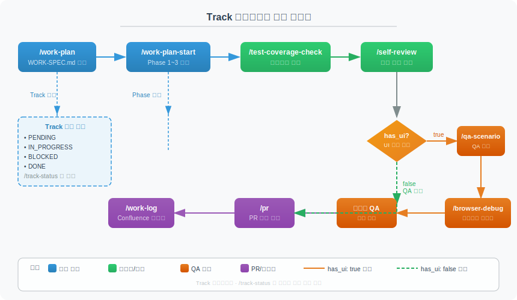
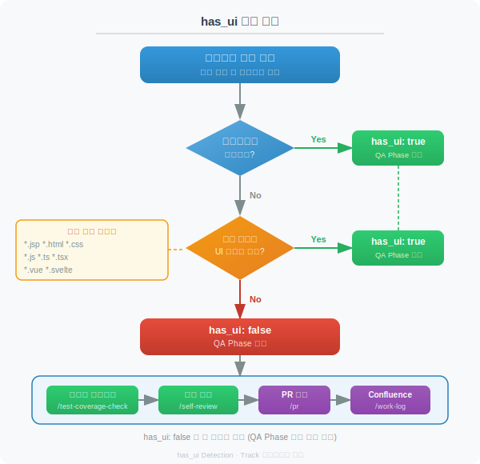

# Claude Code Track 시스템

> `[3] 중급` · 선수 지식: [Claude Code Workflow](./claude-code-workflow.md), [Claude Code Skill](./claude-code-skill.md)

> `/work-plan`으로 생성하고 `/track-status`로 추적하는 작업 관리 시스템. Phase 기반 진행률 관리, 프로젝트 유형별 조건부 Phase, 단계별 커맨드 연계 워크플로우를 제공한다.

`#Track` `#TrackStatus` `#WorkPlan` `#Phase` `#has_ui` `#조건부Phase` `#워크플로우` `#작업추적` `#ClaudeCode` `#SlashCommand` `#metadata` `#Checkpoint`

## 왜 알아야 하는가?

- **실무**: 복잡한 작업을 Phase 단위로 분리하여 체계적으로 진행하고 추적
- **효율성**: `/track-status` 한 번으로 현재 진행률과 다음 단계를 즉시 파악
- **품질**: Checkpoint 프로토콜로 각 Phase 완료 시 자동 검증
- **자동화**: 프로젝트 유형에 따라 테스트/리뷰/QA Phase를 자동으로 추가하거나 생략

## 핵심 개념

- **Track**: `/work-plan`으로 생성되는 작업 추적 단위. `metadata.json` + `plan.md` + `spec.md`로 구성
- **Phase**: Track 내 작업 단계. 구현 → 테스트 → 리뷰 → QA → PR 순서
- **Checkpoint**: 각 Phase 종료 시 실행되는 검증 프로토콜
- **has_ui**: UI 파일 변경 여부를 판별하여 QA Phase 포함/생략을 결정하는 필드

## 쉽게 이해하기

**비유: 여행 계획 + GPS 내비게이션**

| 여행 비유 | Track 시스템 |
|----------|-------------|
| 여행 계획서 작성 | `/work-plan` → WORK-SPEC.md + Track 생성 |
| 계획서의 각 일정 | Phase (구현, 테스트, 리뷰 등) |
| GPS "현재 위치" | `/track-status` → 진행률 + 현재 Phase |
| GPS "다음 경유지" | 다음 단계 안내 (다음 커맨드 제안) |
| 경유지별 체크인 | Checkpoint (Phase 완료 검증) |
| 해변 여행 vs 등산 | has_ui: true(QA 포함) vs false(QA 생략) |

## 상세 설명

### Track 디렉토리 구조

```
.claude/tracks/
├── index.md                          ← 전체 Track 목록
└── {track_id}/                       ← 개별 Track
    ├── metadata.json                 ← 메타데이터 (상태, 유형, has_ui)
    ├── plan.md                       ← Phase별 작업 체크리스트
    └── spec.md                       ← 요구사항 요약
```

### Track 생명주기

```
  ┌──────────┐     /work-plan      ┌──────────┐    /work-plan-start    ┌──────────────┐
  │          │ ──────────────────▶  │          │ ──────────────────────▶│              │
  │  (없음)  │                     │   new    │                        │ in_progress  │
  │          │                     │          │                        │              │
  └──────────┘                     └──────────┘                        └──────┬───────┘
                                                                              │
                                                                     모든 Phase 완료
                                                                              │
                                                                              ▼
                                                                       ┌──────────────┐
                                                                       │  completed   │
                                                                       └──────────────┘
```

| 상태 | 설명 | 전환 조건 |
|------|------|----------|
| `new` | Track 생성됨, 작업 미시작 | `/work-plan` 실행 |
| `in_progress` | 작업 진행 중 | `/work-plan-start` 실행 |
| `completed` | 모든 Phase 완료 | 마지막 Phase 완료 + git add |

### metadata.json 스키마

```json
{
  "track_id": "user-auth_20260320",
  "description": "사용자 인증 API 구현",
  "type": "spring-boot-api",
  "has_ui": false,
  "status": "in_progress",
  "created_at": "2026-03-20T10:00:00+09:00",
  "work_spec_path": ".claude/docs/WORK-SPEC.md",
  "total_phases": 6,
  "current_phase": 3
}
```

| 필드 | 타입 | 설명 |
|------|------|------|
| `track_id` | string | `{shortname}_{YYYYMMDD}` 형식 고유 ID |
| `description` | string | Track 설명 |
| `type` | string | 프로젝트 유형 (`spring-boot-api`, `spring-batch`, `til-docs`, `algorithm`, `frontend`, `library`) |
| `has_ui` | boolean | UI 파일 변경 포함 여부 → QA Phase 포함/생략 결정 |
| `status` | string | `new` / `in_progress` / `completed` |
| `current_phase` | number | 현재 진행 중인 Phase 번호 |

### Track ID 생성 규칙

```
형식: {shortname}_{YYYYMMDD}
- shortname: 요구사항에서 핵심 키워드를 kebab-case로 추출 (2~4단어)
- YYYYMMDD: 생성일자

예시:
- user-auth_20260320
- batch-retry_20260320
- campaign-sku-filter_20260315
```

---

## 전체 워크플로우



### 커맨드 파이프라인

```
┌────────────┐   ┌─────────────────┐   ┌────────────────────┐   ┌──────────────┐
│ /work-plan  │ → │ /work-plan-start │ → │/test-coverage-check│ → │ /self-review  │
│ 계획 수립   │   │ 구현 실행        │   │ 테스트 커버리지    │   │ + /simplify  │
│ + Track생성 │   │ + Phase 진행     │   │ 점검 + 누락 보완   │   │ 코드 리뷰    │
└────────────┘   └─────────────────┘   └────────────────────┘   └──────┬───────┘
                                                                       ↓
┌────────────┐   ┌──────────┐   ┌──────────────┐   ┌─────────────┐   ┌───────────────┐
│ /work-log  │ ← │   /pr    │ ← │ 사용자 QA 확인│ ← │/browser-debug│ ← │ /qa-scenario  │
│ Confluence │   │ PR 생성  │   │ (수동 검증)   │   │ 브라우저 QA  │   │ QA 시나리오   │
│ 문서화     │   │          │   │              │   │              │   │ 생성          │
└────────────┘   └──────────┘   └──────────────┘   └─────────────┘   └───────────────┘
                       ↑                                                     ↑
                       └── UI 없는 프로젝트(has_ui: false)는 ────────────────┘
                           코드 리뷰 → /pr 직행 (QA 단계 스킵)
```

### 단계별 상세 설명

#### 1단계: `/work-plan` — 계획 수립 + Track 생성

req.md 요구사항을 분석하여 WORK-SPEC.md 작업 명세서와 Track을 자동 생성한다.

| 수행 작업 | 설명 |
|----------|------|
| 프로젝트 유형 판별 | build.gradle, package.json 등으로 자동 판별 |
| `has_ui` 판별 | 변경 대상 파일의 UI 확장자 포함 여부 확인 |
| WORK-SPEC.md 생성 | 요구사항, 기술 스택, 파일 변경 목록, Phase 설계 |
| Gemini/Codex 크로스 체크 | 외부 AI로 계획 품질 검증 (설치된 경우) |
| Track 디렉토리 생성 | `metadata.json` + `plan.md` + `spec.md` |
| index.md 업데이트 | 전체 Track 목록에 추가 |

#### 2단계: `/work-plan-start` — 구현 실행

WORK-SPEC.md에 따라 Phase별로 코드를 구현한다.

| 수행 작업 | 설명 |
|----------|------|
| Track 감지 | WORK-SPEC.md에서 Track ID 확인, `status: in_progress`로 전환 |
| TaskCreate | Phase별 작업 목록을 Task 도구로 생성 |
| Phase별 구현 | WORK-SPEC.md 설계에 따라 순차 구현 |
| Checkpoint 실행 | 각 Phase 완료 시 검증 + 사용자 확인 |
| plan.md 업데이트 | 완료 항목 `[x]`, 진행 중 `[~]` 갱신 |
| 팀 에이전트 워크플로우 | 파일 3개+ 변경 시 Explore/Plan/test-generator 병렬 디스패치 |

#### 3단계: `/test-coverage-check` — 테스트 커버리지 점검

변경된 소스 파일의 테스트 커버리지를 분석하고 누락 테스트를 자동 생성한다.

| 수행 작업 | 설명 |
|----------|------|
| review-test-coverage 에이전트 | 커버리지 갭 식별 |
| test-generator 에이전트 | 누락 테스트 자동 생성 + 실행 |
| plan.md 체크 | 테스트 커버리지 Phase 항목 `[x]` 처리 |

#### 4단계: `/self-review` + `/simplify` — 코드 리뷰

4명의 전문 리뷰어 에이전트 팀이 병렬로 코드를 리뷰한다.

| 리뷰어 | 관점 |
|--------|------|
| review-convention | 컨벤션, 가독성, CLAUDE.md 규칙 |
| review-performance | N+1 쿼리, 고비용 객체, I/O 병목 |
| review-security | OWASP Top 10, 인증/인가, 민감정보 |
| review-test-coverage | 테스트 존재 여부, 누락 시나리오 |

#### 5단계: `/qa-scenario` — QA 시나리오 생성 (has_ui: true만)

변경사항을 분석하여 BDD(Given-When-Then) 형식의 QA 시나리오 문서를 생성한다.

| 수행 작업 | 설명 |
|----------|------|
| 변경 파일 카테고리 분류 | Controller, Service, View 등 |
| 영향 범위 분석 | 영향도 매트릭스 생성 |
| QA-SCENARIOS.md 생성 | BDD 형식 시나리오 + Mermaid 다이어그램 |

#### 6단계: `/browser-debug` — 브라우저 QA (has_ui: true만)

Chrome 자동화로 웹 페이지를 점검한다.

| 수행 작업 | 설명 |
|----------|------|
| 서버 자동 기동 | Spring Boot 등 서버 탐지 및 실행 |
| Chrome 자동화 점검 | 콘솔 에러, DOM 상태, 네트워크 에러 검사 |
| 이슈 즉시 수정 | 발견된 문제 자동 수정 |

#### 7단계: `/pr` — PR 생성

현재 브랜치의 변경사항을 분석하여 PR을 자동 생성한다.

| 수행 작업 | 설명 |
|----------|------|
| 커밋 분석 | 전체 커밋 히스토리 분석 |
| PR 타이틀/본문 작성 | Summary + Test Plan 자동 작성 |
| 리뷰어 랜덤 선정 | PR_REVIEWER_EXCLUDE 목록 제외 후 선정 |

#### 8단계: `/work-log` — Confluence 문서화

작업 내용을 Confluence에 구조화된 작업 로그로 자동 생성한다.

| 수행 작업 | 설명 |
|----------|------|
| 브랜치 변경 분석 | git diff + 코드 읽기 |
| 비개발자 친화 작성 | 표, ASCII 다이어그램 포함 |
| Confluence 페이지 생성 | MCP 또는 curl 폴백 |

---

## plan.md 구조

plan.md는 Phase별 작업 체크리스트로, 진행률 계산의 기반이 된다.

### 체크박스 상태

| 표기 | 의미 | 진행률 반영 |
|------|------|-----------|
| `[ ]` | 미완료 | 미포함 |
| `[~]` | 진행 중 | 미포함 |
| `[x]` | 완료 | 포함 |

### Phase 자동 추가 규칙

프로젝트 유형에 따라 공통 Phase가 자동으로 추가된다:

| 프로젝트 유형 | 테스트 커버리지 | 코드 리뷰 | 브라우저 QA | PR & 문서화 |
|-------------|:-------------:|:--------:|:----------:|:----------:|
| **Spring Boot API** (has_ui: false) | O | O | X | O |
| **Spring Boot** (has_ui: true) | O | O | O | O |
| **Spring Batch** | O | O | X | O |
| **프론트엔드** | O | O | O | O |
| **TIL 문서** | X | X | X | O |
| **알고리즘** | O | X | X | O |
| **라이브러리** | O | O | X | O |

---

## Checkpoint 프로토콜

각 Phase 완료 시 자동으로 실행되는 검증 프로세스.

```
Phase 완료
    ↓
┌───────────────────────────────┐
│ 1. plan.md 업데이트            │
│    - [ ] → [x] (완료 항목)     │
│    - Checkpoint 기록           │
├───────────────────────────────┤
│ 2. 검증 실행                   │
│    - 변경 파일 목록 정리        │
│    - 테스트 실행 (있는 경우)     │
│    - 빌드 확인 (가능한 경우)     │
├───────────────────────────────┤
│ 3. 사용자 확인                  │
│    - Phase 완료 보고            │
│    - 다음 Phase 진행 질문       │
├───────────────────────────────┤
│ 4. metadata.json 업데이트       │
│    - current_phase 갱신        │
└───────────────────────────────┘
```

---

## /track-status 상세

### 기본 사용법

```bash
/track-status              # 전체 Track 현황 + 워크플로우 가이드
/track-status {track_id}   # 특정 Track 상세 조회
```

### 진행률 계산

```
진행률 = (체크된 항목 [x] 수) / (전체 체크박스 수) × 100%
```

### 다음 단계 안내 규칙

`/track-status` 실행 시 현재 상태에 따라 다음에 실행할 커맨드를 자동 안내:

| 현재 상태 | has_ui | 다음 단계 안내 |
|----------|--------|--------------|
| `status: new` | - | → `/work-plan-start`로 구현을 시작하세요 |
| 구현 Phase 진행 중 | - | → 현재 Task: {task명}. `/work-plan-start`를 계속 실행하세요 |
| 구현 완료 | - | → `/test-coverage-check`로 테스트 커버리지를 점검하세요 |
| 테스트 커버리지 완료 | - | → `/self-review`로 코드 리뷰를 진행하세요 |
| 코드 리뷰 완료 | `true` | → `/qa-scenario`로 QA 시나리오를 생성하세요 |
| 코드 리뷰 완료 | `false` | → `/pr`로 PR을 생성하세요 (UI 없는 프로젝트) |
| QA 시나리오 완료 | `true` | → `/browser-debug`로 브라우저 QA를 실행하세요 |
| 브라우저 QA 완료 | `true` | → 수동 QA를 완료한 후 `/pr`로 PR을 생성하세요 |
| PR 생성 완료 | - | → `/work-log`로 Confluence 작업 문서를 작성하세요 |
| 모든 Phase 완료 | - | → 모든 작업이 완료되었습니다! |

### Track이 없을 때

Track이 없으면 전체 워크플로우 가이드를 출력하여, 어떤 커맨드부터 시작해야 하는지 안내한다.

---

## has_ui 조건부 Phase



### UI 유무 판별 기준

| 프로젝트 유형 | `has_ui` 기본값 | 판별 조건 |
|-------------|----------------|----------|
| **Spring Boot API** | `false` | JSP/CSS/HTML 등 UI 파일 변경이 포함되면 `true` |
| **Spring Batch** | `false` | 항상 |
| **프론트엔드** | `true` | 항상 |
| **TIL 문서** | `false` | 항상 |
| **알고리즘** | `false` | 항상 |
| **라이브러리** | `false` | 항상 |

**UI 파일 변경 감지 확장자**: `*.jsp`, `*.html`, `*.css`, `*.js`, `*.ts`, `*.tsx`, `*.vue`

### 하위 호환

`has_ui` 필드가 없는 기존 Track은 `type` 기반으로 추론:
- `frontend` → `has_ui: true`
- 그 외 → `has_ui: false`

---

## index.md 관리

`.claude/tracks/index.md`는 전체 Track 목록을 관리한다:

```markdown
# Tracks

## Active
- [~] [사용자 인증 API](./user-auth_20260320/) - 2026-03-20 생성

## Completed
- [x] [배치 재시도 로직](./batch-retry_20260315/) - 2026-03-15 생성

## Archived
(없음)
```

---

## 주의사항/트레이드오프

| 항목 | 설명 |
|------|------|
| **Track 없이도 동작** | Track이 없으면 `/work-plan-start`는 기존 방식대로 진행 (하위 호환) |
| **비표준 UI 확장자** | `.ftl`, `.vm` 등은 자동 감지되지 않음 → WORK-SPEC.md에서 수동 설정 |
| **API + 화면 혼합** | 하나의 Track에 API와 화면 변경이 섞이면 has_ui: true |
| **Phase 순서 고정** | Phase 간 의존성이 있으므로 순서 변경 불가 |
| **한 세션 = 한 Track** | 하나의 대화에서 하나의 Track만 진행 권장 |

## 연관 문서

- [Claude Code Workflow](./claude-code-workflow.md) - 병렬 세션, Plan 모드, 최적화 전략
- [Claude Code Skill](./claude-code-skill.md) - AI 에이전트 기능 모듈화
- [Claude Code Slash Command](./claude-code-slash-command.md) - 자주 사용하는 프롬프트 명령어화
- [Claude Code Agent Team](./claude-code-agent-team.md) - 독립 AI 에이전트 팀 병렬 협업
- [Claude Code 코드 리뷰 명령어](./claude-code-review-commands.md) - /self-review, /pr 사용 가이드
