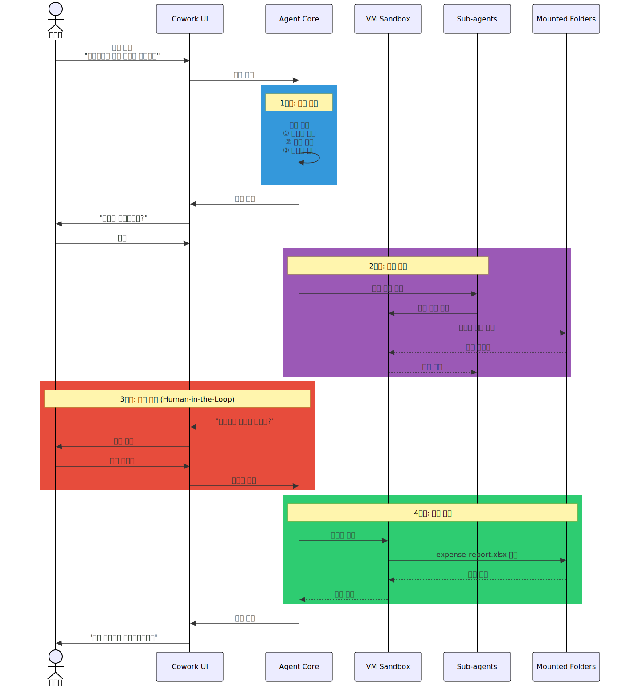

# Claude Cowork

> `[3] 중급` · 선수 지식: [AI Agent란](./ai-agent.md), [Claude Code Skill](./claude-code-skill.md), [MCP](./mcp.md)

> `Trend` 2026

> Claude Code의 에이전트 기능을 Claude Desktop에서 접근할 수 있게 한 범용 AI 코워커(Coworker) — 폴더 기반 파일 시스템 접근과 플러그인 생태계를 통해 비개발자도 복잡한 다단계 작업을 자동화한다.

`#ClaudeCowork` `#코워크` `#Cowork` `#AICoworker` `#AI코워커` `#ClaudeDesktop` `#에이전트` `#Agent` `#파일시스템` `#FileSystem` `#샌드박스` `#Sandbox` `#플러그인` `#Plugin` `#Connector` `#커넥터` `#Skills` `#스킬` `#SlashCommand` `#SubAgent` `#하위에이전트` `#자동화` `#Automation` `#Anthropic` `#ClaudeCode` `#VirtualMachine` `#AppleVirtualization` `#Knowledge Worker` `#지식노동자` `#연구프리뷰`

## 왜 알아야 하는가?

- **실무**: 반복적인 문서 작업, 데이터 정리, 파일 관리를 AI에게 위임하여 지식 노동의 생산성을 극대화할 수 있다
- **면접**: 2026년 AI Agent의 실용화 핵심 사례로, "에이전트형 AI"의 개념과 한계를 설명할 수 있어야 한다
- **기반 지식**: Claude Code → Cowork → 플러그인 생태계로 이어지는 Anthropic의 에이전트 전략을 이해하면, AI Agent의 실제 제품화 방식을 파악할 수 있다

## 핵심 개념

- Claude Cowork는 **Claude Code의 에이전트 아키텍처**를 Claude Desktop에서 비개발자도 사용할 수 있도록 래핑한 제품이다
- 사용자가 지정한 **폴더에만 접근**하며, 가상 머신(VM) 샌드박스 안에서 파일 읽기/쓰기/생성을 수행한다
- **플러그인 시스템**으로 Skills, Connectors, Slash Commands, Sub-agents를 번들링하여 역할별 워크플로우를 구성한다
- 대화형이 아닌 **작업 큐(Task Queue)** 방식 — 동료에게 일을 맡기듯 작업을 쌓아두고 병렬 처리한다

## 쉽게 이해하기

**회사에 새로 온 인턴에게 업무를 맡기는 상황**을 생각해보자.

1. 인턴에게 **특정 서류함(폴더)의 접근 권한**을 준다
2. **"이 영수증 사진들로 경비 보고서 만들어줘"** 같은 지시를 남긴다
3. 인턴이 **계획을 세우고, 하나씩 처리**하면서 중간중간 진행 상황을 알려준다
4. 모르는 건 질문하고, 중요한 결정은 **반드시 확인**을 받는다
5. 특정 업무(법률, 마케팅)를 잘 하게 **매뉴얼(플러그인)** 을 제공한다

이것이 Claude Cowork가 동작하는 방식이다. 터미널도 코드도 필요 없이, 폴더 하나를 지정하고 자연어로 지시하면 된다.

## 상세 설명

### Claude Code vs Claude Cowork

Claude Code와 Cowork는 **동일한 에이전트 SDK 기반**이지만, 대상 사용자와 접근 방식이 다르다.

| 비교 항목 | Claude Code | Claude Cowork |
|----------|-------------|---------------|
| **대상 사용자** | 개발자 | 모든 지식 노동자 |
| **인터페이스** | 터미널 (CLI) | Claude Desktop GUI |
| **파일 접근** | 전체 프로젝트 디렉토리 | 명시적으로 지정한 폴더만 |
| **실행 환경** | 로컬 셸 직접 실행 | VM 샌드박스 (격리) |
| **확장 방식** | MCP 서버, Skills, Hooks | 플러그인 (Skills + Connectors + Slash Commands + Sub-agents) |
| **주요 작업** | 코딩, 디버깅, Git 관리 | 문서 작성, 데이터 분석, 파일 관리 |
| **보안 모델** | 사용자 권한 그대로 실행 | 사전 구성된 파일시스템 샌드박스 |

**왜 이렇게 구분하는가?**

Claude Code는 개발자에게 최대한의 자유도를 제공해야 하므로 터미널에서 직접 실행된다. 반면 Cowork는 비개발자가 안전하게 사용해야 하므로 VM 샌드박스로 격리하고, 명시적으로 허용한 폴더에만 접근을 제한한다.

### 아키텍처

Cowork는 Apple Virtualization Framework(macOS) 기반의 경량 Linux VM 위에서 동작한다.



**핵심 구성 요소:**

| 계층 | 역할 |
|------|------|
| **Claude Desktop UI** | 사용자 인터페이스 — Chat, Code, Cowork 탭 |
| **Agent SDK** | Claude Code와 공유하는 에이전트 코어 — 계획, 실행, 적응 루프 |
| **VM Sandbox** | Apple Virtualization Framework 기반 격리 환경 |
| **Mounted Folders** | 사용자가 허용한 폴더만 `/sessions/[ID]/mnt/` 에 마운트 |
| **Plugin System** | Skills, Connectors, Slash Commands, Sub-agents 번들 |

### 플러그인 시스템

플러그인은 Cowork의 핵심 확장 메커니즘이다. 4가지 구성 요소를 하나의 패키지로 번들링한다.



#### 1. Skills (스킬)

Claude의 역량을 확장하는 **지식과 능력 묶음**이다. YAML 프론트매터 + 마크다운 형식으로 작성된다.

```yaml
---
name: sales-playbook
description: 영업 프로세스 및 제품 특성 가이드
version: 1.0
---

# 영업 플레이북

## 제품별 포지셔닝
- Enterprise: 보안, 규정 준수 강조
- Startup: 빠른 통합, 비용 효율 강조
```

**왜 파일 기반인가?**

모든 구성 요소가 파일 기반이므로 Git으로 버전 관리하고, 팀 간 공유하고, Claude 자체로 수정할 수 있다. 코드 없이 플러그인을 만들고 배포할 수 있는 것이 핵심이다.

#### 2. Connectors (커넥터)

**외부 도구와 데이터 소스를 연결**한다. CRM, 지식 기반, 데이터베이스 등과 통합하여 Claude가 실시간 정보에 접근한다.

#### 3. Slash Commands (슬래시 명령어)

사용자가 `/` 를 입력하면 나타나는 **빠른 실행 명령어**다. 팀 전체가 일관된 방식으로 작업하도록 표준화한다.

#### 4. Sub-agents (하위 에이전트)

복잡한 작업을 분할하여 **독립적으로 처리하는 전문 에이전트**다. 병렬 실행을 통해 처리 시간을 단축한다.

### 공식 플러그인 (11종)

Anthropic이 제공하는 오픈소스 플러그인 템플릿이다.

| 플러그인 | 대상 역할 | 주요 기능 |
|---------|----------|----------|
| **Productivity** | 전체 | 작업 관리, 일정 정리, 메모 자동화 |
| **Enterprise Search** | 전체 | 사내 데이터 통합 검색 |
| **Data** | 데이터 분석가 | 데이터 정리, 시각화, 보고서 생성 |
| **Finance** | 재무팀 | 경비 보고서, 재무 분석 |
| **Legal** | 법무팀 | 계약서 검토, NDA 분류, 컴플라이언스 |
| **Marketing** | 마케팅 | 콘텐츠 생성, 캠페인 분석 |
| **Sales** | 영업 | CRM 통합, 영업 보고서 |
| **Customer Support** | 고객 지원 | 고객 문의 분석, FAQ 생성 |
| **Product Management** | 제품팀 | 사양서 작성, 로드맵 관리 |
| **Bio Research** | 연구원 | 논문 분석, 실험 데이터 정리 |
| **Plugin Builder** | 개발자 | 커스텀 플러그인 생성 도구 |

### 지시사항 계층화 (Instructions Hierarchy)

Cowork는 Claude Code의 CLAUDE.md와 유사한 **계층적 지시사항 시스템**을 제공한다.

| 계층 | 범위 | 설정 위치 |
|------|------|----------|
| **전역 지시사항** | 모든 Cowork 세션 | Settings > Cowork > Global instructions |
| **폴더 지시사항** | 특정 폴더 작업 시 | 폴더 내 설정 또는 Claude가 세션 중 업데이트 |

**Claude Code와의 대응:**

| Claude Code | Cowork |
|-------------|--------|
| `~/.claude/CLAUDE.md` | 전역 지시사항 |
| 프로젝트 `CLAUDE.md` | 폴더 지시사항 |
| `.claude/settings.json` | Plugin 설정 |

## 동작 원리

사용자가 작업을 요청하면 Cowork는 다음과 같은 **에이전트 루프**를 실행한다.



**핵심 포인트:**

1. **계획 수립 (Planning)**: 작업을 분석하고 단계별 계획을 세운다
2. **하위 에이전트 분배**: 독립적인 하위 작업은 병렬로 분배한다
3. **실행 (Execution)**: VM 샌드박스 안에서 파일 읽기/쓰기/생성을 수행한다
4. **사용자 확인 (Human-in-the-Loop)**: 중요한 결정은 반드시 사용자에게 확인을 요청한다
5. **결과 집계**: 하위 에이전트의 결과를 모아 최종 산출물을 완성한다

## 보안 모델

Cowork의 보안은 **다계층 방어(Defense in Depth)** 전략을 따른다.

| 계층 | 보호 대상 | 메커니즘 |
|------|----------|----------|
| **VM 격리** | 호스트 OS | Apple Virtualization Framework로 완전 격리 |
| **폴더 마운트** | 파일 시스템 | 명시적으로 허용한 폴더만 `/sessions/[ID]/mnt/` 에 마운트 |
| **권한 확인** | 파괴적 작업 | 파일 삭제 등 위험 작업 전 사용자 확인 필수 |
| **프롬프트 인젝션 방어** | 데이터 무결성 | 웹 검색 결과 요약, 산업 수준 방어 장치 |

**Anthropic의 보안 권고 사항:**

- 민감한 금융 정보가 포함된 폴더 접근 제한
- 신뢰할 수 있는 사이트에만 확장 권한 부여
- 의심스러운 행동이 발견되면 즉시 작업 중단
- 연구 프리뷰 단계이므로 규제 대상 업무에는 사용 금지

### 주의사항

| 항목 | 내용 |
|------|------|
| **감사 로그** | Cowork 활동은 감사 로그에 기록되지 않음 (Enterprise 제한) |
| **크로스 디바이스** | 기기 간 동기화 미지원 (향후 추가 예정) |
| **플러그인 공유** | 조직 전체 플러그인 배포 기능 미지원 (로컬 저장만 가능) |

## 출시 타임라인

| 날짜 | 이벤트 |
|------|--------|
| 2026.01.12 | 연구 프리뷰 출시 (macOS, Max 구독자) |
| 2026.01.16 | Pro 구독자($20/월) 확대 |
| 2026.01.23 | Team/Enterprise 추가 |
| 2026.01.30 | 플러그인 시스템 출시 (11종 오픈소스 플러그인) |
| 2026.02.10 | Windows 지원 (x64, 기능 동등) |

## 크로스 플랫폼 호환성

Cowork의 **Skills 포맷은 오픈 표준**으로, 여러 AI 플랫폼에서 호환된다.

| 플랫폼 | 통합 방식 |
|--------|----------|
| **VS Code + GitHub Copilot** | Microsoft가 Skills 지원 통합 |
| **OpenAI Codex CLI** | Skills 포맷 채택 |
| **Cursor, Goose, Amp** | 호환 스킬 로딩 메커니즘 구현 |
| **Letta** | 호환 스킬 로딩 지원 |

**왜 오픈 표준인가?**

하나의 Skill 파일을 작성하면 Claude, Copilot, Codex 등 여러 AI 에이전트에서 재사용할 수 있다. 이는 MCP가 도구 연결의 표준이 되었듯이, Skills가 에이전트 능력 정의의 표준이 되려는 Anthropic의 전략이다.

## 트레이드오프

| 장점 | 단점 |
|------|------|
| 비개발자도 에이전트형 AI 활용 가능 | 연구 프리뷰 — 안정성 검증 미완료 |
| VM 샌드박스로 안전한 파일 접근 | 감사 로그 미지원 (엔터프라이즈 한계) |
| 플러그인으로 역할별 커스터마이징 | 플러그인 조직 공유 기능 부재 |
| 병렬 하위 에이전트로 빠른 처리 | Desktop 앱을 열어두어야 작동 |
| Claude Code와 동일한 에이전트 코어 | Claude Code 대비 자유도 제한 (샌드박스) |
| Skills 오픈 표준으로 크로스 플랫폼 | 오프라인 작업 불가 (클라우드 의존) |

## 면접 예상 질문

### Q: Claude Cowork와 Claude Code의 차이점은?

A: 둘 다 동일한 Agent SDK 기반이지만, **대상 사용자와 보안 모델이 다르다**. Claude Code는 개발자를 위한 CLI로 로컬 셸에서 직접 실행되어 최대 자유도를 제공한다. Cowork는 비개발자를 위한 GUI로, Apple Virtualization Framework 기반 VM 샌드박스에서 격리 실행되며 명시적으로 허용한 폴더에만 접근한다. Cowork는 플러그인(Skills + Connectors + Slash Commands + Sub-agents)으로 역할별 확장을 지원하고, Claude Code는 MCP 서버와 Hooks로 확장한다.

### Q: Cowork의 플러그인 시스템은 어떻게 구성되나?

A: 플러그인은 4가지 구성 요소의 번들이다. **Skills**는 역할별 지식과 능력(YAML + Markdown), **Connectors**는 외부 도구/데이터 연결, **Slash Commands**는 빠른 실행 명령어, **Sub-agents**는 독립 작업 처리 에이전트다. 모든 구성 요소가 파일 기반이므로 Git 관리, 팀 공유, AI 자체 수정이 가능하다. Skills 포맷은 오픈 표준으로 VS Code, Copilot, Codex CLI 등에서도 호환된다.

### Q: Cowork의 보안 모델은?

A: **다계층 방어** 전략을 사용한다. (1) VM 격리 — Apple Virtualization Framework로 호스트 OS와 완전 분리, (2) 폴더 마운트 — 사용자가 명시적으로 허용한 폴더만 접근, (3) Human-in-the-Loop — 파일 삭제 등 파괴적 작업 전 반드시 사용자 확인, (4) 프롬프트 인젝션 방어 — 웹 검색 결과 요약 등 산업 수준 방어 장치. 다만 연구 프리뷰 단계이므로 규제 대상 업무에는 사용을 권장하지 않는다.

### Q: AI Agent의 "에이전트형 작업"이란?

A: 전통적 LLM 채팅이 "한 번의 질문 → 한 번의 답변" 패턴이라면, 에이전트형 작업은 **"목표를 주면 스스로 계획 → 실행 → 확인 → 적응"하는 자율적 루프**다. Cowork는 이를 구현하여 "영수증 사진 폴더 → 경비 보고서 완성"처럼 다단계 작업을 자동 처리한다. 핵심은 작업 분해(Sub-agent), 병렬 실행, Human-in-the-Loop(중요 결정 시 사용자 확인)이다.

## 연관 문서

| 문서 | 연관성 | 난이도 |
|------|--------|--------|
| [AI Agent란](./ai-agent.md) | 에이전트 기본 개념 | [1] 정의 |
| [Claude Code Skill](./claude-code-skill.md) | Skills 포맷 상세 | [3] 중급 |
| [MCP](./mcp.md) | 외부 시스템 연결 프로토콜 | [2] 입문 |
| [Claude Code Sub Agent](./claude-code-sub-agent.md) | 하위 에이전트 아키텍처 | [4] 심화 |
| [Multi-Agent Systems](./multi-agent-systems.md) | 다중 에이전트 협업 패턴 | [4] 심화 |
| [Claude Code Workflow](./claude-code-workflow.md) | Claude Code 워크플로우 비교 | [3] 중급 |
| [AI Guardrails](./ai-guardrails.md) | AI 보안 가드레일 | [3] 중급 |
| [Claude Code 설정 체계](./claude-code-settings.md) | 설정 계층 비교 | [3] 중급 |

## 참고 자료

- [Introducing Cowork - Claude Blog](https://claude.com/blog/cowork-research-preview)
- [Cowork Plugins - Claude Blog](https://claude.com/blog/cowork-plugins)
- [Getting started with Cowork - Claude Help Center](https://support.claude.com/en/articles/13345190-getting-started-with-cowork)
- [Anthropic's Cowork Tool - TechCrunch](https://techcrunch.com/2026/01/12/anthropics-new-cowork-tool-offers-claude-code-without-the-code/)
- [First impressions of Claude Cowork - Simon Willison](https://simonwillison.net/2026/Jan/12/claude-cowork/)
- [Anthropic Announces Claude CoWork - InfoQ](https://www.infoq.com/news/2026/01/claude-cowork/)
- [Knowledge Work Plugins - GitHub](https://github.com/anthropics/knowledge-work-plugins)
