# Claude 제품 비교 가이드

> `[2] 입문` · 선수 지식: [AI Agent란](./ai-agent.md)

> `Trend` 2026

> Anthropic의 3대 Claude 제품 — Claude AI(대화형 어시스턴트), Claude Cowork(범용 AI 코워커), Claude Code(개발자용 CLI 에이전트)의 핵심 차이와 사용 시나리오를 비교한다.

`#Claude` `#ClaudeAI` `#ClaudeCowork` `#ClaudeCode` `#Anthropic` `#AI어시스턴트` `#AI코워커` `#CLI에이전트` `#AgentSDK` `#LLM` `#Opus` `#Sonnet` `#Haiku` `#대화형AI` `#에이전트` `#플러그인` `#MCP` `#Skill` `#Hook` `#VM샌드박스` `#코딩에이전트` `#지식노동자` `#개발자도구` `#제품비교`

## 왜 알아야 하는가?

- **실무**: 업무 유형에 따라 적합한 Claude 제품을 선택해야 생산성을 극대화할 수 있다. 잘못된 제품 선택은 비용 낭비와 비효율을 초래한다
- **면접**: "AI Agent의 실제 제품화 사례"로서, 동일 LLM 기반 위에 대상 사용자별로 다른 인터페이스와 보안 모델을 적용한 전략을 설명할 수 있어야 한다
- **기반 지식**: Claude AI → Claude Code → Claude Cowork로 이어지는 Anthropic의 에이전트 전략을 이해하면, AI 제품 설계의 핵심 원칙(보안 격리, 확장성, 사용자 경험)을 파악할 수 있다

## 핵심 개념

Anthropic은 **동일한 LLM(Opus/Sonnet/Haiku)과 Agent SDK**를 기반으로 세 가지 제품을 제공한다.

- **Claude AI** — 모든 사용자를 위한 **대화형 AI 어시스턴트**. 질문에 답하고, 글을 쓰고, 코드를 분석한다
- **Claude Cowork** — 비개발자를 위한 **범용 AI 코워커**. 파일을 직접 다루며, VM 샌드박스에서 안전하게 작업을 자동화한다
- **Claude Code** — 개발자를 위한 **CLI 에이전트**. 터미널에서 코드를 작성하고, 디버깅하고, Git을 관리한다

세 제품은 **같은 두뇌(LLM)**를 공유하지만, **손과 발(실행 환경)**이 다르다.

## 쉽게 이해하기

**회사에서 함께 일하는 세 명의 동료**를 상상해보자.

| 동료 | 역할 | Claude 제품 |
|------|------|------------|
| **상담역** | 질문하면 즉시 답변해주는 전문가. 직접 일을 하진 않지만, 분석과 조언이 탁월하다 | Claude AI |
| **사무 보조** | 서류함에서 문서를 꺼내 정리하고, 보고서를 작성하고, 데이터를 분석한다. 단, 지정된 서류함만 접근 가능하다 | Claude Cowork |
| **개발팀 동료** | 코드를 작성하고, 버그를 잡고, 배포를 돕는다. 터미널과 Git을 자유자재로 다룬다 | Claude Code |

- **상담역(Claude AI)**: "이 계약서 검토해줘" → 의견을 말해주지만, 파일을 직접 수정하진 않는다
- **사무 보조(Cowork)**: "이 폴더의 영수증으로 경비 보고서 만들어줘" → 파일을 열고, 정리하고, 새 문서를 만든다
- **개발팀 동료(Code)**: "이 버그 고치고 PR 만들어줘" → 코드를 수정하고, 테스트하고, Git으로 제출한다

## 상세 설명

### Claude AI (claude.ai)

Claude AI는 Anthropic의 **대화형 AI 어시스턴트**로, 웹(claude.ai)과 모바일 앱에서 접근할 수 있다.

**핵심 특징:**

- **대화 기반 인터페이스** — 자연어로 질문하고 답변을 받는 채팅 형태
- **Artifacts** — 코드, 문서, 다이어그램 등을 대화 옆에 실시간으로 생성·미리보기
- **Projects** — 문맥을 유지하면서 관련 대화를 묶어 관리
- **파일 업로드** — PDF, 이미지, 코드 파일을 업로드하여 분석 (최대 200K 토큰 컨텍스트)
- **웹 검색** — 실시간 웹 정보를 참조하여 응답

**왜 "대화형"인가?**

Claude AI는 사용자가 업로드한 파일을 "읽을" 수는 있지만, 로컬 파일 시스템에 직접 접근하거나 수정할 수 없다. 모든 작업은 대화 컨텍스트 안에서 이루어지며, 결과를 복사하여 사용자가 직접 적용해야 한다.

**적합한 사용자:** 모든 사용자 — 학생, 연구자, 작가, 마케터, 개발자 등

### Claude Cowork

Claude Cowork는 Claude Desktop에서 접근하는 **범용 AI 코워커**로, 비개발자가 복잡한 파일 기반 작업을 자동화할 수 있게 한다.

**핵심 특징:**

- **폴더 기반 파일 접근** — 사용자가 명시적으로 지정한 폴더만 접근 가능
- **VM 샌드박스** — Apple Virtualization Framework 기반 격리 환경에서 안전하게 실행
- **작업 큐 방식** — 대화가 아닌, 동료에게 일을 맡기듯 작업을 쌓아두고 병렬 처리
- **플러그인 생태계** — Skills, Connectors, Slash Commands, Sub-agents를 번들링하여 역할별 워크플로우 구성

**왜 "코워커"인가?**

Claude AI가 "질문-답변" 패턴이라면, Cowork는 "작업 지시-자율 실행" 패턴이다. 사용자가 "이 폴더의 CSV 파일들을 분석해서 보고서 만들어줘"라고 지시하면, Cowork가 계획을 세우고, 파일을 읽고, 결과물을 생성한다. 중요한 결정에는 사용자 확인을 요청한다.

**적합한 사용자:** 비개발자 지식 노동자 — 기획자, 분석가, 마케터, 법무팀 등

> 상세 내용: [Claude Cowork](./claude-cowork.md)

### Claude Code

Claude Code는 터미널에서 실행하는 **개발자 전용 CLI 에이전트**로, 코드베이스 전체를 이해하고 자율적으로 개발 작업을 수행한다.

**핵심 특징:**

- **터미널/IDE 통합** — CLI 또는 VS Code/JetBrains에서 직접 실행
- **전체 프로젝트 접근** — 코드베이스 전체를 읽고, 수정하고, 파일을 생성
- **MCP 서버 연결** — 외부 시스템(DB, API, Jira 등)과 통합
- **확장 시스템** — Skill, Hook, Slash Command, Sub Agent로 워크플로우 자동화
- **멀티 에이전트** — 여러 에이전트를 병렬로 실행하여 복잡한 작업 분담

**왜 "CLI 에이전트"인가?**

개발자에게는 최대한의 자유도가 필요하다. GUI보다 터미널이 빠르고, 셸 명령어와 Git을 직접 실행할 수 있어야 한다. Claude Code는 VM 격리 없이 사용자 권한으로 직접 실행되므로, 시스템의 모든 도구를 자유롭게 활용할 수 있다.

**적합한 사용자:** 소프트웨어 개발자, DevOps 엔지니어, 보안 분석가

> 상세 내용: [Claude Code Workflow](./claude-code-workflow.md), [Claude Code 실전 가이드](./claude-code-guide.md)

### 종합 비교표

| 비교 항목 | Claude AI | Claude Cowork | Claude Code |
|----------|-----------|---------------|-------------|
| **대상 사용자** | 모든 사용자 | 비개발자 지식 노동자 | 개발자 |
| **인터페이스** | 웹(claude.ai), 모바일 앱 | Claude Desktop GUI | 터미널 CLI, IDE 통합 |
| **실행 환경** | 클라우드 서버 | VM 샌드박스 (로컬) | 로컬 셸 직접 실행 |
| **파일 접근** | 업로드된 파일만 | 지정된 폴더만 | 전체 프로젝트 디렉토리 |
| **보안 모델** | 서버 사이드 격리 | VM + 폴더 마운트 격리 | 사용자 권한 그대로 실행 |
| **확장 방식** | Projects, Artifacts | 플러그인 (Skills + Connectors) | MCP, Skill, Hook, Sub Agent |
| **작업 패턴** | 질문 → 답변 (대화형) | 지시 → 자율 실행 (작업 큐) | 지시 → 자율 실행 (에이전트 루프) |
| **주요 작업** | 분석, 작문, 코드 리뷰 | 문서 작성, 데이터 분석, 파일 관리 | 코딩, 디버깅, Git, 배포 |
| **오프라인** | 불가 | 부분 가능 (로컬 VM) | 불가 (API 호출 필요) |
| **멀티 에이전트** | 미지원 | 플러그인 Sub-agents | Sub Agent, Agent Team |

### 플랜별 접근 가능 기능

| 기능 | Free | Pro ($20/월) | Max ($100~200/월) | Team ($25+/석/월) | Enterprise |
|------|------|-------------|-------------------|------------------|------------|
| **Claude AI 대화** | 제한적 | 무제한급 | 무제한급 | 무제한급 | 무제한급 |
| **Artifacts/Projects** | 기본 | 전체 | 전체 | 전체 | 전체 |
| **Claude Code** | 미지원 | 포함 | 확장 사용량 | Team Premium에 포함 | 포함 |
| **Claude Cowork** | 미지원 | 포함 | 확장 사용량 | 포함 | 포함 |
| **파일 업로드** | 제한적 | 전체 | 전체 | 전체 | 전체 |
| **모델 선택** | Sonnet | Opus/Sonnet/Haiku | Opus/Sonnet/Haiku | Opus/Sonnet/Haiku | 전체 |
| **API 접근** | 별도 과금 | 별도 과금 | 별도 과금 | 별도 과금 | 맞춤 계약 |
| **관리자 도구** | 미지원 | 미지원 | 미지원 | 포함 | 고급 거버넌스 |

### 사용 시나리오별 추천

#### 시나리오 1: "보고서 초안을 작성하고 싶다"

```
데이터가 로컬 파일에 있다 → Claude Cowork
                              (폴더 지정 후 자동 분석·작성)

데이터를 직접 붙여넣을 수 있다 → Claude AI
                                 (대화로 분석 요청)
```

#### 시나리오 2: "코드를 리팩토링하고 싶다"

```
전체 코드베이스 대상 → Claude Code
                       (터미널에서 자율 수정)

단일 파일 코드 리뷰 → Claude AI
                      (붙여넣기 후 리뷰 요청)
```

#### 시나리오 3: "팀 프로젝트를 관리하고 싶다"

```
개발 워크플로우 자동화 → Claude Code + MCP
                          (Jira, GitHub, Slack 연동)

비개발 업무 자동화 → Claude Cowork + 플러그인
                      (문서 관리, 데이터 정리)

빠른 의사결정 지원 → Claude AI
                     (분석, 비교, 요약)
```

#### 시나리오 4: "AI를 처음 사용한다"

```
무료로 시작 → Claude AI (Free)
              (기본 대화, 파일 분석)

업무에 본격 활용 → Claude AI Pro ($20/월)
                   (Code, Cowork 모두 포함)
```

## 다이어그램



세 제품은 **동일한 LLM과 Agent SDK를 공유**하지만, 대상 사용자에 따라 인터페이스, 보안 모델, 확장 방식이 다르다.

**공통 기반:**
- **Claude LLM** — Opus(최고 성능), Sonnet(균형), Haiku(빠른 응답)
- **Agent SDK** — 계획(Plan) → 실행(Execute) → 적응(Adapt) 루프

**분기점:**
- Claude AI: 클라우드 서버에서 대화형으로 동작
- Claude Cowork: 로컬 VM 안에서 파일을 직접 조작
- Claude Code: 로컬 셸에서 코드와 시스템 도구를 직접 실행

## 트레이드오프

### Claude AI

| 장점 | 단점 |
|------|------|
| 접근성이 가장 높음 (브라우저만 있으면 됨) | 로컬 파일에 직접 접근 불가 |
| 무료 플랜 제공 | 결과를 수동으로 적용해야 함 |
| 웹 검색으로 최신 정보 참조 가능 | 장시간 자율 작업 불가 |
| Artifacts로 시각적 결과물 생성 | 파일 시스템 조작 불가 |

### Claude Cowork

| 장점 | 단점 |
|------|------|
| 비개발자도 파일 기반 자동화 가능 | macOS 전용 (Apple Virtualization) |
| VM 샌드박스로 안전한 실행 환경 | 지정 폴더 외 접근 불가 |
| 플러그인으로 역할별 특화 가능 | 개발 작업에는 부적합 |
| 병렬 작업 큐로 효율적 처리 | 연구 프리뷰 단계 (제한적 기능) |

### Claude Code

| 장점 | 단점 |
|------|------|
| 최대 자유도 — 시스템 전체 접근 | 터미널 사용 능력 필요 |
| MCP로 외부 시스템 통합 | 보안 경계가 사용자 권한과 동일 |
| 멀티 에이전트로 복잡한 작업 분담 | API 비용이 사용량에 비례 |
| Git/IDE 직접 통합 | 비개발자에게는 진입 장벽 높음 |

## 면접 예상 질문

### Q1. Claude AI, Cowork, Code의 핵심 차이점은?

세 제품은 동일한 LLM(Opus/Sonnet/Haiku)과 Agent SDK를 공유하지만, **대상 사용자와 실행 환경**이 다르다. Claude AI는 클라우드에서 대화형으로 동작하는 범용 어시스턴트, Cowork는 로컬 VM 샌드박스에서 파일을 직접 조작하는 비개발자용 코워커, Code는 로컬 셸에서 코드와 시스템 도구를 직접 실행하는 개발자용 CLI 에이전트다.

### Q2. Claude Cowork가 VM 샌드박스를 사용하는 이유는?

비개발자가 AI에게 파일 시스템 접근 권한을 부여하므로, **보안 격리가 필수**다. VM 샌드박스는 악의적이거나 잘못된 명령이 호스트 시스템에 영향을 미치지 않도록 보호한다. 반면 Claude Code는 개발자가 의도적으로 시스템 수준 작업을 수행해야 하므로 격리 없이 사용자 권한으로 직접 실행된다.

### Q3. 하나의 LLM으로 여러 제품을 만드는 전략의 장점은?

**플랫폼 전략**이다. 핵심 AI 역량(LLM + Agent SDK)을 한 번 개발하고, UI/보안/확장 모델만 달리하여 다양한 사용자층을 커버할 수 있다. 이는 개발 비용 절감, 일관된 AI 품질 유지, 생태계 확장에 유리하다. Google의 Android/Chrome OS가 Linux 커널을 공유하는 것과 유사한 패턴이다.

### Q4. AI Agent를 제품화할 때 가장 중요한 설계 결정은?

**보안 격리 수준**과 **사용자 자유도** 사이의 트레이드오프다. Claude Code는 자유도를 극대화하여 생산성을 높이지만, 보안은 사용자에게 의존한다. Cowork는 VM으로 격리하여 안전성을 보장하지만, 할 수 있는 작업이 제한된다. 대상 사용자의 기술 수준과 보안 요구사항에 따라 이 균형점을 결정해야 한다.

## 연관 문서

| 문서 | 설명 |
|------|------|
| [AI Agent란](./ai-agent.md) | AI 에이전트의 정의, 구성 요소, 동작 원리 |
| [Claude Cowork](./claude-cowork.md) | Cowork 상세 — 아키텍처, 플러그인, 보안 모델 |
| [Claude Code Workflow](./claude-code-workflow.md) | Code 워크플로우 — 병렬 세션, Plan 모드, 최적화 |
| [Claude Code 실전 가이드](./claude-code-guide.md) | 70가지 팁 핵심 정리, 단축키, 컨텍스트 관리 |
| [Agent SDK](./agent-sdk.md) | 커스텀 에이전트 빌드 SDK |
| [MCP](./mcp.md) | AI 에이전트와 외부 시스템 연결 프로토콜 |
| [Claude Code Skill](./claude-code-skill.md) | 에이전트 기능 모듈화, 스킬 생성 가이드 |
| [Claude Code Plugin](./claude-code-plugin.md) | Skill/Hook/MCP를 패키징하여 배포 |

## 참고 자료

- [Anthropic 공식 블로그 — Claude Cowork 발표](https://www.anthropic.com/news/claude-cowork)
- [Claude 플랜 및 가격](https://claude.com/pricing)
- [Claude Code 공식 문서](https://docs.anthropic.com/en/docs/claude-code/overview)
- [VentureBeat — Claude Code에서 Cowork으로의 확장](https://venturebeat.com/orchestration/anthropic-says-claude-code-transformed-programming-now-claude-cowork-is)
