# Figma + MCP + Claude Code 통합 가이드

> `[3] 중급` · 선수 지식: [MCP](./mcp.md), [Tool Use](./tool-use.md)

> Figma 디자인을 MCP 프로토콜로 Claude Code에 연결하여 Design-to-Code 워크플로우를 자동화하는 통합 가이드 `Trend 2025-2026`

`#Figma` `#FigmaMCP` `#DesignToCode` `#MCP` `#ModelContextProtocol` `#ClaudeCode` `#FigmaMake` `#CodeConnect` `#디자인시스템` `#DesignSystem` `#프론트엔드` `#백엔드` `#API설계` `#컴포넌트` `#React` `#Tailwind` `#디자인토큰` `#DesignToken` `#Pencil` `#PencilMCP` `#프로토타이핑` `#UI자동화` `#코드생성` `#CodeGeneration` `#디자인협업` `#FigJam` `#SVG`

## 왜 알아야 하는가?

- **실무**: 디자인 → 코드 변환 과정에서 발생하는 소통 비용과 구현 오차를 줄인다. 백엔드 개발자도 API 응답 구조를 디자인에 맞춰 설계하거나, 어드민 화면을 직접 구현할 수 있다
- **면접**: "디자인 시스템과 코드베이스를 어떻게 동기화하나요?"에 대한 실전 답변이 된다. MCP 기반 도구 통합 아키텍처를 설명할 수 있다
- **기반 지식**: MCP를 통한 외부 디자인 도구 연동의 실전 사례로, 양방향 데이터 흐름 설계 패턴을 이해할 수 있다

## 핵심 개념

- **Figma MCP**: Figma의 공식 MCP 서버로, AI 에이전트가 Figma 파일을 읽고 디자인 컨텍스트를 코드로 변환할 수 있게 한다
- **Design-to-Code**: 디자인 파일을 분석하여 프로덕션 레벨 코드를 자동 생성하는 워크플로우
- **Code Connect**: Figma 컴포넌트와 코드베이스의 실제 컴포넌트를 매핑하는 시스템
- **Pencil MCP**: 로컬에서 디자인 파일(.pen)을 생성·편집하는 경량 MCP 서버
- **Design Token**: 색상, 타이포그래피, 간격 등 디자인 속성을 코드에서 재사용 가능한 변수로 정의한 것

## 쉽게 이해하기

**건축 설계도**에 비유할 수 있다.

- **Figma** = 건축 설계도 (디자이너가 그린 청사진)
- **MCP 서버** = 측량사 (설계도를 읽고 정확한 수치를 전달)
- **Claude Code** = 시공 감독 (수치를 받아 실제 건물을 짓는 지시)
- **코드베이스** = 건물 (실제 구현된 결과물)

기존에는 개발자가 설계도를 눈으로 보고 직접 수치를 재서 건물을 지었다. 이제 측량사(MCP)가 설계도에서 정확한 수치를 자동으로 읽어 시공 감독(Claude Code)에게 전달하므로, 오차 없이 빠르게 건물을 지을 수 있다.

## 동작 원리

### 전체 아키텍처



### Design-to-Code 워크플로우



## 상세 설명

### Pencil vs Figma: 백엔드 개발자 관점 비교

Claude Code에서 디자인 작업을 하는 두 가지 방법이 있다.

| 비교 항목 | Pencil MCP | Figma MCP |
|-----------|-----------|-----------|
| **설치** | 로컬 MCP 서버, 즉시 사용 | Figma 계정 + Dev Mode 필요 |
| **파일 형식** | `.pen` (암호화, Pencil 전용) | `.fig` (Figma 클라우드) |
| **협업** | 개인 작업 중심 | 디자이너-개발자 실시간 협업 |
| **디자인 품질** | 빠른 프로토타입, 간단한 레이아웃 | 전문 디자인 시스템, 고품질 |
| **코드 생성** | HTML/CSS/JS 직접 생성 | React + Tailwind 기반 힌트 제공 |
| **적합한 상황** | 어드민 화면, 내부 도구, 빠른 목업 | 프로덕션 UI, 디자인 시스템 연동 |
| **백엔드 개발자** | 디자이너 없이 혼자 만들 때 | 디자이너와 협업할 때 |

**언제 무엇을 쓸까?**

```
혼자 어드민 화면 만든다 → Pencil MCP
디자이너가 Figma로 준 시안이 있다 → Figma MCP
빠른 프로토타입이 필요하다 → Pencil MCP
프로덕션 UI를 구현한다 → Figma MCP
```

### 활용 방법

#### A. 데이터 중심 디자인 (백엔드 → 프론트엔드)

백엔드 개발자가 API 응답 구조를 먼저 설계하고, 이를 기반으로 화면을 구성하는 접근법이다.

```
1. API 응답 JSON 구조 설계
2. Figma/Pencil에서 데이터 바인딩 포인트 확인
3. Claude Code로 API ↔ UI 매핑 코드 생성
```

**실전 예시: 사용자 프로필 API → 화면 구현**

```java
// 1단계: API 응답 설계
@GetMapping("/api/users/{id}")
public UserProfileResponse getUserProfile(@PathVariable Long id) {
    return userService.getProfile(id);
}

// 응답 DTO
public record UserProfileResponse(
    String name,
    String email,
    String avatarUrl,
    LocalDateTime joinedAt,
    List<String> roles
) {}
```

Claude Code에서 Figma MCP를 호출하면:

```
Claude> Figma 디자인의 사용자 프로필 화면을 분석하고,
        UserProfileResponse에 맞는 React 컴포넌트를 생성해줘
```

결과적으로 API 응답 구조와 디자인이 자동으로 매핑된 컴포넌트가 생성된다.

#### B. 양방향 코드 동기화 (Code Connect)

Figma의 Code Connect 기능을 사용하면 디자인 컴포넌트와 코드 컴포넌트를 양방향으로 매핑할 수 있다.

```
Figma 컴포넌트 ←→ Code Connect 매핑 ←→ 코드베이스 컴포넌트
```

**동작 방식:**

1. Figma에서 `Button` 컴포넌트를 선택
2. Figma MCP가 Code Connect 매핑을 확인
3. 프로젝트의 `<Button />` 컴포넌트를 직접 참조
4. 새로운 코드를 생성하지 않고 기존 컴포넌트를 재사용

```typescript
// Code Connect 매핑 예시
// Figma의 "Primary Button" → 프로젝트의 Button 컴포넌트
import { Button } from '@/components/ui/Button';

// Figma 디자인의 variant가 자동으로 props에 매핑
<Button variant="primary" size="lg">
  시작하기
</Button>
```

#### C. 인터랙션 및 로직 검증

디자인에 포함된 상태 변화(로딩, 에러, 빈 상태)를 코드의 조건 분기와 매핑한다.

```
디자인 상태          →    코드 상태
─────────────────────────────────────
Default 상태         →    정상 데이터 렌더링
Loading 상태         →    isLoading === true
Error 상태           →    error !== null
Empty 상태           →    data.length === 0
```

### 실전 구축 가이드

Figma MCP를 Claude Code와 연결하는 3단계 과정이다.

#### 1단계: Figma MCP 서버 설정

Claude Code의 MCP 설정 파일에 Figma MCP를 추가한다.

**방법 A: Anthropic 공식 Figma MCP (권장)**

Claude Code에 이미 내장되어 있으므로 별도 설치가 필요 없다. Figma URL을 Claude Code에 붙여넣기만 하면 자동으로 Figma MCP가 활성화된다.

```
Claude> https://www.figma.com/design/abc123/MyDesign?node-id=1:2
        이 디자인을 React 코드로 변환해줘
```

**방법 B: 커뮤니티 Figma MCP 서버 (커스텀)**

더 세밀한 제어가 필요한 경우 커뮤니티 MCP 서버를 설치한다.

```json
// .claude/settings.json
{
  "mcpServers": {
    "figma": {
      "command": "npx",
      "args": ["-y", "@anthropic/figma-mcp-server"],
      "env": {
        "FIGMA_ACCESS_TOKEN": "your-figma-token"
      }
    }
  }
}
```

**Figma Access Token 발급:**

1. [Figma Settings](https://www.figma.com/settings) 접속
2. **Personal access tokens** 섹션에서 토큰 생성
3. 환경 변수 또는 설정 파일에 저장

#### 2단계: Figma URL 파싱 이해

Claude Code가 Figma URL에서 정보를 추출하는 규칙이다.

| URL 패턴 | 추출 정보 |
|----------|----------|
| `figma.com/design/:fileKey/:fileName?node-id=:nodeId` | fileKey, nodeId (하이픈→콜론 변환) |
| `figma.com/design/:fileKey/branch/:branchKey/:fileName` | branchKey를 fileKey로 사용 |
| `figma.com/make/:makeFileKey/:makeFileName` | Figma Make 파일 |
| `figma.com/board/:fileKey/:fileName` | FigJam 파일 → `get_figjam` 사용 |

#### 3단계: Design-to-Code 실행

Figma URL을 Claude Code에 전달하면 아래 과정이 자동으로 진행된다.

```
[사용자] Figma URL + 요청사항 입력
         ↓
[Claude Code] get_design_context 호출
         ↓
[Figma MCP] 디자인 분석 결과 반환
  - 코드 힌트 (React + Tailwind)
  - 스크린샷
  - Code Connect 매핑 정보
  - 디자인 토큰 (CSS 변수)
  - 어노테이션 메모
         ↓
[Claude Code] 프로젝트에 맞게 적응
  - 기존 컴포넌트 재사용
  - 디자인 토큰 → 프로젝트 토큰 매핑
  - 스택/프레임워크에 맞는 코드 생성
         ↓
[결과] 프로덕션 레벨 코드 출력
```

### Claude Code 활용 방법

#### 시나리오 1: 디자인 기반 코드 생성

```
# Figma 디자인을 코드로 변환
Claude> 이 Figma 디자인을 분석하고 우리 프로젝트의 디자인 시스템에 맞게
        React 컴포넌트를 만들어줘
        https://www.figma.com/design/abc123/Dashboard?node-id=10:200

# Claude Code가 수행하는 작업:
# 1. get_design_context로 디자인 분석
# 2. 프로젝트의 기존 컴포넌트 탐색
# 3. Code Connect 매핑 확인
# 4. 디자인 토큰 매핑
# 5. 프로젝트 컨벤션에 맞는 코드 생성
```

**결과물 예시:**

```tsx
// Claude Code가 생성한 코드 (프로젝트 적응 완료)
import { Card, CardHeader, CardContent } from '@/components/ui/Card';
import { Badge } from '@/components/ui/Badge';
import { formatDate } from '@/utils/date';

interface DashboardCardProps {
  title: string;
  status: 'active' | 'inactive' | 'pending';
  updatedAt: string;
}

export function DashboardCard({ title, status, updatedAt }: DashboardCardProps) {
  return (
    <Card>
      <CardHeader>
        <h3 className="text-lg font-semibold">{title}</h3>
        <Badge variant={status}>{status}</Badge>
      </CardHeader>
      <CardContent>
        <p className="text-sm text-muted-foreground">
          {formatDate(updatedAt)}
        </p>
      </CardContent>
    </Card>
  );
}
```

#### 시나리오 2: 디자인 수정 사항 반영

디자이너가 Figma에서 수정한 내용을 코드에 반영한다.

```
Claude> 디자이너가 DashboardCard의 레이아웃을 변경했어.
        새 디자인을 확인하고 기존 코드를 업데이트해줘.
        https://www.figma.com/design/abc123/Dashboard?node-id=10:200

# Claude Code가 수행하는 작업:
# 1. 새 디자인 컨텍스트 분석
# 2. 기존 코드와 diff 비교
# 3. 변경된 부분만 업데이트
# 4. 기존 로직/데이터 바인딩 유지
```

#### 시나리오 3: 백엔드 개발자의 어드민 화면 구축 (Pencil MCP)

디자이너 없이 어드민 화면을 직접 만드는 경우이다.

```
Claude> Pencil로 사용자 관리 어드민 화면을 만들어줘.
        - 사용자 목록 테이블 (이름, 이메일, 역할, 가입일)
        - 검색/필터 기능
        - 페이지네이션
        - Desktop + Mobile 반응형

# Pencil MCP를 사용하여:
# 1. 새 .pen 파일 생성
# 2. Desktop 레이아웃 디자인
# 3. Mobile 레이아웃 디자인
# 4. HTML/CSS/JS 코드로 변환
```

### 주요 MCP 도구 정리

#### Figma MCP 도구

| 도구 | 설명 | 사용 시점 |
|------|------|----------|
| `get_design_context` | 디자인 분석 + 코드 힌트 + 스크린샷 반환 | 코드 생성의 핵심 도구 |
| `get_screenshot` | 특정 노드의 스크린샷 캡처 | 시각적 확인이 필요할 때 |
| `get_metadata` | 파일/컴포넌트 메타데이터 조회 | 구조 파악 시 |
| `get_code_connect_map` | Code Connect 매핑 목록 조회 | 기존 컴포넌트 재사용 시 |
| `get_variable_defs` | 디자인 토큰/변수 정의 조회 | 토큰 매핑 시 |
| `generate_diagram` | FigJam에 다이어그램 생성 | 아키텍처 문서화 |

#### Pencil MCP 도구

| 도구 | 설명 | 사용 시점 |
|------|------|----------|
| `batch_design` | 노드 삽입/수정/삭제/복사 일괄 처리 | 화면 디자인의 핵심 도구 |
| `batch_get` | 패턴/ID로 노드 검색 및 조회 | 기존 디자인 탐색 |
| `get_screenshot` | 현재 디자인 스크린샷 | 시각적 검증 |
| `get_guidelines` | 디자인 가이드라인 조회 | 웹앱, 모바일 등 |
| `get_style_guide` | 스타일 가이드 조회 | 디자인 영감 |
| `snapshot_layout` | 레이아웃 구조 확인 | 삽입 위치 결정 |

## 트레이드오프

| 항목 | 장점 | 단점 |
|------|------|------|
| **Figma MCP** | 디자이너 협업 최적, 프로덕션 품질 | Figma 의존성, Dev Mode 유료 |
| **Pencil MCP** | 즉시 사용, 무료, 빠른 프로토타입 | 디자인 품질 한계, 협업 어려움 |
| **Code Connect** | 코드-디자인 완벽 동기화 | 초기 매핑 설정 비용 |
| **자동 코드 생성** | 개발 속도 향상, 일관성 | 생성 코드 품질 검증 필요 |
| **MCP 기반 통합** | 표준화된 프로토콜, 확장성 | 네트워크 의존성, 설정 복잡도 |

### 백엔드 개발자 관점 주의사항

1. **생성된 코드를 그대로 쓰지 마라**: Figma MCP가 반환하는 React + Tailwind 코드는 참고용이다. 프로젝트의 스택, 컴포넌트, 컨벤션에 맞게 반드시 적응시켜야 한다
2. **디자인 토큰을 하드코딩하지 마라**: `#3B82F6` 같은 hex 값이 나오면 프로젝트의 CSS 변수나 테마 시스템으로 매핑한다
3. **API 계약을 먼저 정의하라**: 화면 구현 전에 API 응답 구조를 확정하고, 디자인의 데이터 바인딩 포인트와 매핑한다
4. **상태 관리를 고려하라**: 디자인의 Loading/Error/Empty 상태가 코드의 상태 관리와 일치하는지 확인한다

## 면접 예상 질문

### Q1. Design-to-Code 워크플로우에서 MCP의 역할은?

MCP는 Figma와 Claude Code 사이의 표준화된 통신 프로토콜 역할을 한다. Figma MCP 서버가 디자인 파일을 분석하여 구조화된 데이터(코드 힌트, 스크린샷, 디자인 토큰, Code Connect 매핑)로 변환하고, 이를 Claude Code가 받아 프로젝트에 맞는 코드를 생성한다. 핵심은 디자인 도구의 종류에 관계없이 동일한 프로토콜로 연동할 수 있다는 점이다.

### Q2. Code Connect와 일반 디자인-코드 변환의 차이는?

일반 변환은 디자인을 보고 새로운 코드를 생성하므로 프로젝트의 기존 컴포넌트와 중복이 발생한다. Code Connect는 Figma 컴포넌트와 코드베이스의 실제 컴포넌트를 매핑하므로, 새 코드를 생성하지 않고 기존 컴포넌트를 직접 참조한다. 이는 디자인 시스템의 일관성을 유지하고 코드 중복을 방지한다.

### Q3. 백엔드 개발자가 Figma MCP를 활용하는 실전 시나리오는?

1. **어드민 화면 구축**: Pencil MCP로 빠르게 프로토타입하고 코드로 변환
2. **API-UI 매핑 검증**: API 응답 구조와 디자인의 데이터 표시 영역이 일치하는지 확인
3. **디자인 리뷰 참여**: 디자인의 상태(로딩, 에러, 빈 상태)가 API 명세와 일관되는지 검증
4. **풀스택 작업**: 디자이너가 전달한 Figma URL로 프론트엔드 코드를 직접 생성하여 풀스택 개발

### Q4. Pencil과 Figma MCP의 사용 기준은?

**Pencil**: 개인 작업, 빠른 프로토타입, 디자이너 없는 내부 도구 개발에 적합하다. 로컬에서 즉시 사용 가능하고 `.pen` 파일로 관리한다.

**Figma**: 디자이너와의 협업, 프로덕션 UI, 디자인 시스템 연동이 필요할 때 사용한다. Code Connect를 통한 양방향 동기화가 가능하다.

판단 기준은 "디자이너와 협업하는가?"이다. 협업이면 Figma, 혼자 작업이면 Pencil이 효율적이다.

## 연관 문서

- [MCP (Model Context Protocol)](./mcp.md) - AI 에이전트와 외부 시스템 연결을 위한 표준 프로토콜
- [Tool Use](./tool-use.md) - LLM이 외부 도구를 호출하여 실제 작업을 수행하는 능력
- [Claude Code Skill](./claude-code-skill.md) - AI 에이전트의 기능을 모듈화하여 확장하는 능력 패키징 시스템
- [Vibe Coding](./vibe-coding.md) - AI와 협업하여 코드를 생성하고 검토하는 새로운 코딩 패러다임

## 참고 자료

- [Figma MCP Server (Anthropic 공식)](https://github.com/anthropics/claude-figma-mcp) - Figma MCP 서버 공식 레포지토리
- [Figma Dev Mode](https://www.figma.com/dev-mode/) - 개발자를 위한 Figma 기능
- [Code Connect](https://www.figma.com/developers/code-connect) - Figma Code Connect 공식 문서
- [MCP 프로토콜 명세](https://modelcontextprotocol.io/) - Model Context Protocol 공식 사이트
- [Pencil MCP](https://usepencil.ai/) - Pencil 디자인 도구 공식 사이트
