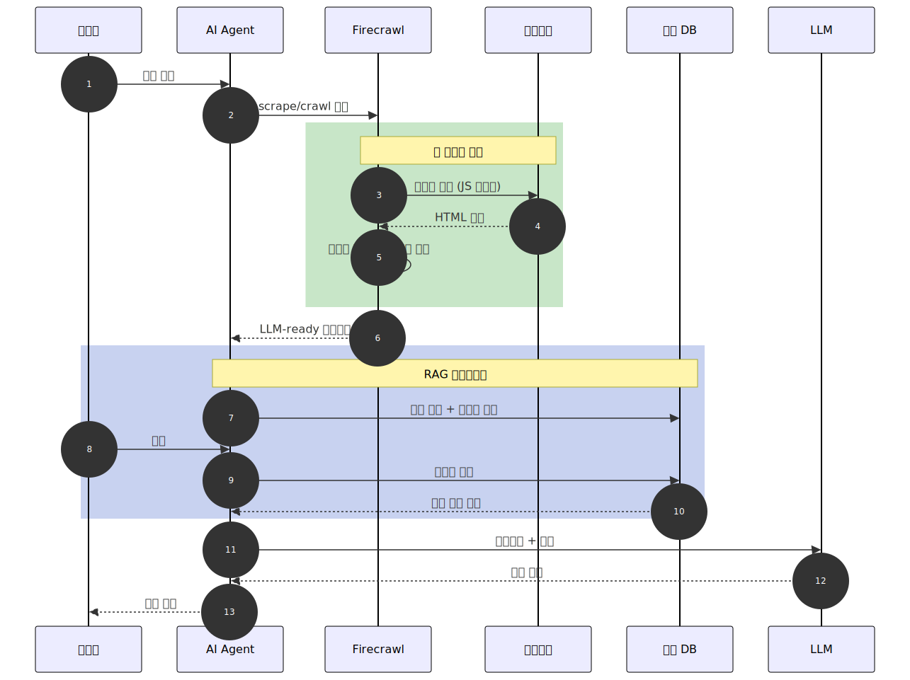

# Firecrawl

> `[3] 중급` · 선수 지식: [AI Agent란](./ai-agent.md), [RAG](./rag.md), [MCP](./mcp.md)

> 웹사이트를 LLM에 최적화된 마크다운 또는 구조화된 데이터로 변환하는 웹 데이터 API 서비스

`#Firecrawl` `#파이어크롤` `#웹스크래핑` `#WebScraping` `#웹크롤링` `#WebCrawling` `#LLMReady` `#마크다운변환` `#RAG` `#데이터수집` `#DataCollection` `#APIService` `#Mendable` `#JavaScript렌더링` `#구조화데이터` `#StructuredData` `#Extract` `#Scrape` `#Crawl` `#Map` `#MCPServer` `#LangChain` `#LlamaIndex` `#CrewAI` `#Crawl4AI` `#JinaReader` `#Scrapy` `#BeautifulSoup` `#AIAgent` `#FIRE1`

## 왜 알아야 하는가?

- **실무**: RAG 시스템 구축 시 웹 데이터를 깨끗한 마크다운으로 변환하는 파이프라인이 필수
- **면접**: AI 에이전트의 외부 데이터 접근 전략, 웹 크롤링 아키텍처 질문에 대비
- **기반 지식**: MCP 서버, AI 에이전트의 웹 접근 도구로서 LLM 생태계의 핵심 인프라

## 핵심 개념

- **Scrape**: 단일 URL의 콘텐츠를 마크다운/HTML/JSON으로 추출
- **Crawl**: 하위 페이지를 재귀적으로 탐색하며 대량 수집
- **Map**: 웹사이트 전체 URL 구조를 빠르게 매핑
- **Extract**: LLM 기반으로 스키마에 맞는 구조화된 데이터 추출
- **LLM-ready 출력**: 광고/메뉴 등 노이즈를 자동 제거한 깨끗한 마크다운

## 쉽게 이해하기

**Firecrawl**을 전문 리서치 비서에 비유할 수 있습니다.

| 비유 | Firecrawl 개념 |
|------|----------------|
| "이 기사 요약해줘" | Scrape (단일 URL 추출) |
| "이 사이트 전체 자료 모아줘" | Crawl (재귀적 크롤링) |
| "이 사이트 목차만 뽑아줘" | Map (URL 맵 생성) |
| "이 페이지에서 가격표만 정리해줘" | Extract (구조화 데이터 추출) |
| "관련 자료를 검색해서 내용까지 읽어줘" | Search (검색 + 콘텐츠 추출) |
| "알아서 찾아서 정리해줘" | Agent (자율 수집) |

기존 방식에서는 개발자가 직접 HTTP 요청, HTML 파싱, JavaScript 렌더링, 봇 차단 우회, 텍스트 정제를 모두 구현해야 했습니다. Firecrawl은 이 모든 과정을 **단일 API 호출**로 해결합니다.

## 상세 설명

### 탄생 배경

LLM 애플리케이션이 폭발적으로 증가하면서, 웹 데이터를 LLM이 이해할 수 있는 형태로 변환하는 수요가 급증했습니다. 기존 도구(Beautiful Soup, Scrapy)는 HTML 파싱에는 강하지만, **동적 콘텐츠 렌더링**, **노이즈 제거**, **LLM 최적화**에 대한 추가 작업이 필요했습니다.

Firecrawl은 **Mendable.ai**가 개발한 오픈소스(AGPL-3.0) 프로젝트로, "웹을 LLM-ready 데이터로 변환"이라는 목적에 특화되어 설계되었습니다.

**왜 이렇게 하는가?**
LLM에 웹 페이지를 그대로 넣으면 광고, 네비게이션 메뉴, 푸터, 쿠키 배너 등 노이즈가 섞여 토큰을 낭비하고 응답 품질이 떨어집니다. Firecrawl은 본문만 정제하여 **토큰 효율성**과 **응답 정확도**를 동시에 높입니다.

### 아키텍처



### 핵심 API

#### 1. Scrape - 단일 URL 추출

단일 URL의 콘텐츠를 마크다운, HTML, 스크린샷, JSON 등으로 변환합니다. JavaScript 렌더링, 프록시 관리, 봇 차단 우회를 자동 처리합니다.

```python
from firecrawl import Firecrawl

firecrawl = Firecrawl(api_key="fc-YOUR-API-KEY")

# 기본 스크래핑 (마크다운 출력)
result = firecrawl.scrape("https://example.com")
print(result["markdown"])

# 다양한 포맷으로 추출
result = firecrawl.scrape(
    "https://example.com",
    formats=["markdown", "html", "screenshot"]
)
```

#### 2. Crawl - 재귀적 크롤링

URL의 하위 페이지를 자동으로 탐색하며 대량 수집합니다. WebSocket으로 실시간 진행 상황을 모니터링할 수 있습니다.

```python
# 최대 100페이지 크롤링
result = firecrawl.crawl(
    "https://example.com",
    limit=100
)

for page in result["data"]:
    print(page["metadata"]["title"])
    print(page["markdown"][:200])
```

#### 3. Map - URL 맵 생성

웹사이트의 전체 URL 구조를 빠르게 파악합니다. 크롤링 전 대상 범위를 확인하는 데 유용합니다.

```python
# 사이트 전체 URL 수집
urls = firecrawl.map("https://docs.example.com")
print(f"총 {len(urls)} 개 URL 발견")
```

#### 4. Extract - 구조화 데이터 추출

LLM을 활용하여 웹 페이지에서 스키마에 맞는 데이터를 추출합니다. 프롬프트 기반 또는 스키마 기반으로 동작합니다.

```python
# 스키마 기반 추출
data = firecrawl.extract(
    urls=["https://example.com/pricing"],
    schema={
        "plan_name": "string",
        "price": "number",
        "features": "list[string]"
    },
    prompt="가격 정보를 추출해주세요"
)
```

**왜 이렇게 하는가?**
기존 웹 스크래핑은 CSS 셀렉터나 XPath로 데이터를 추출했기 때문에, 사이트 구조가 바뀌면 코드를 수정해야 했습니다. Extract는 **LLM이 의미를 이해하고 추출**하므로 구조 변경에 강건합니다.

#### 5. Search - 웹 검색 + 콘텐츠 추출

웹 검색을 수행한 뒤, 결과 페이지의 전체 콘텐츠까지 마크다운으로 변환합니다.

```python
# 검색 후 콘텐츠까지 획득
results = firecrawl.search("AI web scraping tools 2026")
for r in results:
    print(r["title"])
    print(r["markdown"][:200])
```

#### 6. Agent (FIRE-1) - 자율 웹 에이전트

URL 없이 프롬프트만으로 AI가 자율적으로 웹을 탐색하고 데이터를 수집합니다.

```python
# 프롬프트 기반 자율 수집
result = firecrawl.agent(
    prompt="2026년 한국 AI 스타트업 투자 현황을 정리해주세요"
)
```

### 지원 SDK

| SDK | 패키지명 | 비고 |
|-----|---------|------|
| Python | `firecrawl-py` | 공식, v2 지원 |
| Node.js | `@mendable/firecrawl-js` | 공식, v2 지원 |
| Go | 공식 SDK | v1 API 지원 |
| Rust | `firecrawl-sdk` | v1 API 지원 |
| Java | 커뮤니티 SDK | v1.11.0+ |
| Ruby | 공식 SDK | 지원 |
| CLI | `npx firecrawl` | 커맨드라인 |

### 주요 특징

| 특징 | 설명 |
|------|------|
| **JavaScript 렌더링** | 헤드리스 브라우저로 동적 콘텐츠 자동 렌더링 |
| **LLM-ready 출력** | 광고, 메뉴, 푸터 등 노이즈 자동 제거 |
| **프록시 자동 관리** | IP 차단 방지를 위한 프록시 로테이션 |
| **봇 차단 우회** | 안티봇 메커니즘 자동 처리 (클라우드) |
| **PDF 파싱** | PDF 문서 내용 자동 추출 |
| **캐싱** | 기본 2일 캐시, 강제 새로고침 가능 |
| **페이지 액션** | write, click, wait 등 상호작용 지원 |
| **Webhook** | 크롤링 완료 시 알림 |

## 동작 원리

Firecrawl이 RAG 파이프라인에서 어떻게 활용되는지 보여줍니다.



## MCP 서버 활용

Firecrawl은 공식 **MCP 서버**를 제공하여, AI 에이전트(Claude, Cursor 등)에서 바로 웹 스크래핑 도구로 사용할 수 있습니다.

### 제공 도구

| MCP 도구 | 설명 |
|----------|------|
| `firecrawl_scrape` | 단일 URL 콘텐츠 추출 |
| `firecrawl_crawl` | 비동기 재귀 크롤링 |
| `firecrawl_map` | URL 맵 생성 |
| `firecrawl_extract` | 구조화 데이터 추출 |
| `firecrawl_search` | 웹 검색 |
| `firecrawl_batch_scrape` | 다중 URL 일괄 처리 |

### 설정 예시 (Claude Desktop)

```json
{
  "mcpServers": {
    "firecrawl": {
      "url": "https://mcp.firecrawl.dev/v2/mcp",
      "headers": {
        "Authorization": "Bearer YOUR_API_KEY"
      }
    }
  }
}
```

**왜 이렇게 하는가?**
MCP로 연결하면 AI 에이전트가 **대화 중 필요할 때 자동으로** 웹 데이터를 수집할 수 있습니다. 별도의 스크립트를 작성할 필요 없이, 에이전트의 도구(Tool)로서 자연스럽게 통합됩니다.

## AI 프레임워크 통합

| 프레임워크 | 통합 방식 | 용도 |
|-----------|----------|------|
| **LangChain** | `FireCrawlLoader` | RAG 문서 로더 |
| **LlamaIndex** | Document Loader | 인덱싱 파이프라인 |
| **CrewAI** | 네이티브 도구 | 에이전트 웹 접근 |

```python
# LangChain 통합 예시
from langchain_community.document_loaders import FireCrawlLoader

loader = FireCrawlLoader(
    url="https://docs.example.com",
    mode="crawl",
    params={"limit": 50}
)
docs = loader.load()
```

## 경쟁 도구 비교

| 항목 | Firecrawl | Crawl4AI | Jina Reader | Beautiful Soup | Scrapy |
|------|-----------|----------|-------------|----------------|--------|
| **유형** | SaaS + 오픈소스 | 오픈소스 | SaaS API | 라이브러리 | 프레임워크 |
| **JS 렌더링** | 자동 | 지원 | 지원 | 미지원 | 미들웨어 필요 |
| **LLM 최적화** | 핵심 기능 | 지원 | 핵심 기능 | 미지원 | 미지원 |
| **가격** | 유료 (무료 티어) | 무료 | 무료 티어 | 무료 | 무료 |
| **셀프호스팅** | 가능 (제한적) | 완전 지원 | 제한적 | 해당 없음 | 해당 없음 |
| **설정 난이도** | 매우 쉬움 | 중간 | 매우 쉬움 | 쉬움 | 중간~높음 |
| **봇 차단 우회** | 자동 (클라우드) | 제한적 | 제한적 | 미지원 | 미들웨어 필요 |
| **구조화 추출** | LLM 기반 | LLM 기반 | 제한적 | 수동 코딩 | 수동 코딩 |

**선택 가이드:**
- 빠른 프로토타이핑 + API 편의성 → **Firecrawl**
- 완전한 제어 + 무료 + 로컬 실행 → **Crawl4AI**
- 가장 간단한 사용법 → **Jina Reader** (`r.jina.ai/URL`)
- 기존 Python 프로젝트 → **Beautiful Soup**
- 대규모 크롤링 인프라 → **Scrapy**

## 가격 정책

| 플랜 | 월 가격 | 크레딧/월 | 동시 요청 |
|------|--------|----------|----------|
| **Free** | 무료 | 500 (일회성) | 2개 |
| **Hobby** | $16 | 3,000 | 5개 |
| **Standard** | $83 | 100,000 | 50개 |
| **Growth** | $333 | 500,000 | 100개 |
| **Enterprise** | 커스텀 | 무제한 | 커스텀 |

### 크레딧 소비 기준

| 작업 | 크레딧 |
|------|--------|
| Scrape / Crawl (기본) | 1 / 페이지 |
| Map | 1 / 요청 |
| Search | 2 / 10결과 |
| Agent | 동적 과금 (매일 5회 무료) |

## 셀프호스팅

Docker Compose로 로컬 환경에 설치할 수 있습니다.

```bash
# 저장소 클론
git clone https://github.com/mendableai/firecrawl.git

# 환경 설정
cp apps/api/.env.example apps/api/.env

# Docker 실행
docker compose build && docker compose up
# http://localhost:3002 에서 접근
```

### 셀프호스팅 제한 사항

| 기능 | 클라우드 | 셀프호스팅 |
|------|---------|----------|
| 모든 API | 지원 | `/agent` 미지원 |
| 고급 봇 우회 | 자동 | 수동 프록시 설정 필요 |
| 스크린샷 | 지원 | Playwright 별도 필요 |

## 트레이드오프

| 장점 | 단점 |
|------|------|
| 단일 API로 복잡한 스크래핑 인프라 대체 | 유료 서비스 (무료 티어 500크레딧 일회성) |
| JS 렌더링, 봇 우회 자동 처리 | 셀프호스팅 시 Agent, 고급 우회 기능 미지원 |
| LLM-ready 깨끗한 마크다운 출력 | 미사용 크레딧 이월 불가 |
| MCP 서버로 AI 에이전트 즉시 통합 | 대규모 크롤링 시 비용 증가 |
| LangChain, LlamaIndex 네이티브 통합 | 클라우드와 셀프호스팅 기능 격차 큼 |
| 다양한 SDK (Python, Node.js, Go 등) | 복잡한 브라우저 워크플로우는 제한적 |

## 트러블슈팅

### 사례 1: 크레딧 빠르게 소진

#### 증상
크롤링 실행 후 예상보다 크레딧이 빠르게 소진됩니다.

#### 원인 분석
`crawl` API의 기본 `limit`이 10,000페이지이며, 하위 링크를 모두 따라가 예상보다 많은 페이지를 수집합니다. 향상된 프록시(+4 크레딧), JSON 모드(+4 크레딧) 등 추가 과금도 원인입니다.

#### 해결 방법
```python
# 1. map으로 먼저 범위 파악
urls = firecrawl.map("https://example.com")
print(f"예상 크레딧: {len(urls)}")

# 2. limit 설정으로 범위 제한
result = firecrawl.crawl(
    "https://example.com",
    limit=50,
    include_paths=["/docs/*"],
    exclude_paths=["/blog/*", "/archive/*"]
)
```

#### 예방 조치
- 크롤링 전 `map`으로 대상 URL 수를 먼저 확인
- `include_paths`와 `exclude_paths`로 범위 제한
- Webhook으로 크롤링 진행 상황 모니터링

### 사례 2: 동적 콘텐츠 누락

#### 증상
SPA(Single Page Application)에서 콘텐츠가 빈 값으로 반환됩니다.

#### 원인 분석
JavaScript 렌더링이 완료되기 전에 콘텐츠를 수집한 경우입니다.

#### 해결 방법
```python
# waitFor로 렌더링 대기 시간 설정
result = firecrawl.scrape(
    "https://spa-example.com",
    wait_for=5000,  # 5초 대기
    actions=[
        {"type": "wait", "milliseconds": 3000},
        {"type": "click", "selector": "#load-more"}
    ]
)
```

#### 예방 조치
- SPA는 `wait_for` 파라미터로 렌더링 대기 시간 설정
- `actions`로 버튼 클릭 등 추가 상호작용 정의

## 면접 예상 질문

### Q: LLM 애플리케이션에서 웹 데이터를 수집할 때 고려할 점은?

A: (1) **데이터 품질**: 광고, 메뉴 등 노이즈를 제거하여 토큰 낭비를 방지해야 합니다. Firecrawl 같은 도구가 이를 자동화합니다. (2) **동적 콘텐츠**: SPA처럼 JavaScript로 렌더링되는 콘텐츠는 헤드리스 브라우저가 필요합니다. (3) **법적/윤리적 고려**: robots.txt 준수, 이용약관 확인, 적절한 요청 간격 설정이 필요합니다. (4) **비용 효율**: 크롤링 범위를 사전에 `map`으로 파악하고, 필요한 페이지만 선택적으로 수집합니다.

### Q: Firecrawl과 Beautiful Soup의 차이점은?

A: **Beautiful Soup**은 HTML 파싱 라이브러리로, 개발자가 직접 HTTP 요청, JavaScript 렌더링(Selenium 등), 프록시, 노이즈 제거를 구현해야 합니다. **Firecrawl**은 이 모든 과정을 API 한 번 호출로 해결하며, LLM에 최적화된 마크다운을 출력합니다. Beautiful Soup은 무료이고 완전한 제어가 가능한 반면, Firecrawl은 편의성과 속도에서 우위입니다. **선택 기준**: 단순 파싱이면 Beautiful Soup, RAG/AI 파이프라인이면 Firecrawl이 적합합니다.

### Q: 웹 크롤링에서 봇 차단을 우회하는 방법은?

A: (1) **프록시 로테이션**: IP 기반 차단을 회피 (2) **User-Agent 변경**: 브라우저처럼 보이는 헤더 설정 (3) **요청 간격 조절**: 사람의 탐색 패턴을 모방 (4) **헤드리스 브라우저**: JavaScript 실행으로 브라우저 핑거프린트 생성. Firecrawl은 이를 자동으로 처리하지만, **윤리적 크롤링**(robots.txt 준수, 서버 부하 고려)이 전제되어야 합니다.

## 연관 문서

| 문서 | 연관성 | 난이도 |
|------|--------|--------|
| [AI Agent란](./ai-agent.md) | 선수 지식 | [1] 정의 |
| [RAG](./rag.md) | 데이터 수집 파이프라인 | [3] 중급 |
| [MCP](./mcp.md) | MCP 서버 연결 | [2] 입문 |
| [Tool Use](./tool-use.md) | 에이전트 도구 활용 | [2] 입문 |
| [LLM 기초](./llm.md) | Extract의 LLM 활용 | [1] 정의 |

## 참고 자료

- [Firecrawl 공식 문서](https://docs.firecrawl.dev)
- [Firecrawl GitHub](https://github.com/firecrawl/firecrawl)
- [Firecrawl MCP Server](https://github.com/firecrawl/firecrawl-mcp-server)
- [LangChain FireCrawl 통합](https://python.langchain.com/docs/integrations/document_loaders/firecrawl/)
- [Firecrawl 가격 정책](https://www.firecrawl.dev/pricing)
