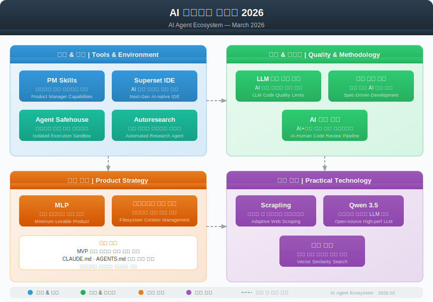

# AI 에이전트 생태계 트렌드 2026 (3월 2주차)

> `[3] 중급` · 선수 지식: [AI Agent](./ai-agent.md), [LLM](./llm.md), [Agentic Coding](./agentic-coding.md)

> `Trend` 2026

> GeekNews(hada.io) 2026.03.10 기준, AI 에이전트 생태계의 주요 트렌드를 분석하고 실무 관점에서 시사점을 정리한 문서

`#AI에이전트` `#AIAgent` `#트렌드2026` `#GeekNews` `#하다` `#PMSkills` `#SupersetIDE` `#AgentSafehouse` `#Autoresearch` `#LLM코드품질` `#스펙주도개발` `#SpecDrivenDevelopment` `#AI코드리뷰` `#MLP` `#MinimumLovableProduct` `#파일시스템맥락` `#Scrapling` `#Qwen3.5` `#벡터쿼리` `#에이전틱코딩` `#AgenticCoding` `#Karpathy` `#코딩에이전트` `#GitWorktree` `#샌드박싱` `#AI보안` `#코드리뷰자동화` `#개발워크플로우`

## 왜 알아야 하는가?

- **실무**: AI 에이전트 도구 선택과 워크플로우 구성에 직접적인 의사결정 근거 제공
- **면접**: "최근 AI 개발 트렌드"는 시니어 면접 빈출 주제 — 구체적 사례와 시사점을 말할 수 있어야 함
- **기반 지식**: 빠르게 변하는 AI 생태계에서 방향성을 잡고, 자신의 워크플로우를 지속 개선하는 데 필수

## 핵심 개념

- 상위 20개 토픽 중 **약 70%가 AI/에이전트 관련** — 개발 생태계의 중심축이 완전히 이동
- AI 에이전트가 "코드 생성"을 넘어 **PM, 연구, 보안, 리뷰**까지 역할 확장
- "그럴듯한 코드"와 "올바른 코드"의 간극 — **AI 생성 코드 품질 검증이 핵심 이슈**로 부상
- 파일시스템이 AI 에이전트의 **지속적 맥락 관리 수단**으로 재조명

## 쉽게 이해하기

2026년 3월 현재, 개발자 커뮤니티는 마치 **"AI 에이전트 종합 박람회"** 같은 분위기다.

이전에는 "AI가 코드를 짜준다"는 것이 화제였다면, 지금은 "AI가 짠 코드를 **어떻게 검증하고, 어떤 워크플로우로 협업하며, 어떤 도구로 관리할 것인가**"가 핵심 의제다.

비유하자면, 자동차가 처음 나왔을 때는 "차가 달린다!"가 놀라운 뉴스였지만, 지금은 교통법규, 보험, 정비소, 주유소 인프라가 더 중요한 것과 같다.

## 상세 분석

### 1. AI 에이전트 도구 & 개발 환경

AI 에이전트를 **사용하고 관리하는 도구** 자체가 하나의 생태계를 형성하고 있다.

#### PM Skills — AI 에이전트를 PM으로 활용

- **핵심**: 검증된 PM 프레임워크(PRD, 유저 스토리, 우선순위 매트릭스)를 AI 워크플로우에 내장
- **특징**: 단순 문서 생성이 아닌 **구조화된 제품 의사결정** 지원
- **대상**: Claude Code, Cowork용 플러그인
- **시사점**: AI 에이전트의 역할이 "코드 생성" → "제품 관리"까지 확장

**왜 중요한가?**
개발자가 직접 PM 역할을 수행하는 스타트업/소규모 팀에서, AI가 체계적인 의사결정 프레임워크를 제공하면 제품 품질이 크게 향상된다.

#### Superset IDE — 멀티 에이전트 병렬 실행 환경

- **핵심**: Claude Code, Codex 등 여러 AI 코딩 에이전트를 **병렬로 실행**하는 확장 터미널
- **핵심 기술**: 각 작업을 독립된 **Git worktree**로 격리
- **장점**: 에이전트 간 충돌 없이 동시 작업 가능

```shell
# Superset의 핵심 패턴 — Git worktree 기반 격리
# 에이전트 A: feature-auth 작업
git worktree add ../agent-a-workspace feature-auth

# 에이전트 B: fix-bug-123 작업 (동시 진행)
git worktree add ../agent-b-workspace fix-bug-123
```

**왜 중요한가?**
멀티 에이전트 시대에 **작업 격리(isolation)** 는 필수다. 같은 코드베이스에서 여러 에이전트가 동시에 수정하면 충돌이 불가피하므로, worktree 기반 격리가 사실상 표준 패턴으로 자리잡고 있다.

#### Agent Safehouse — macOS용 에이전트 샌드박싱

- **핵심**: macOS 네이티브 샌드박스로 로컬 AI 에이전트가 **시스템 외부를 변경하지 못하도록 격리**
- **방식**: 각 에이전트가 독립된 샌드박스 환경에서 실행
- **시사점**: AI 에이전트 **보안**이 별도 도구 카테고리로 분화

**왜 중요한가?**
AI 에이전트는 파일 읽기/쓰기, 명령 실행 등 강력한 권한을 가진다. 악의적이지 않더라도 실수로 시스템 파일을 삭제하거나 민감 정보를 노출할 수 있으므로, 샌드박싱은 프로덕션 환경에서 필수다.

#### Autoresearch — Karpathy의 자율 연구 프레임워크

- **핵심**: 단일 GPU·단일 파일 약 630줄의 자기완결형 자율 연구 프레임워크
- **방식**: AI 에이전트가 **밤새 자율적으로 LLM 학습 실험을 반복** 수행
- **특징**: nanochat LLM 학습 코어를 극도로 압축

**왜 중요한가?**
"인간이 자는 동안 AI가 연구하는" 패턴이 현실화되고 있다. 개발자는 실험 설계(가설)에 집중하고, 실행과 반복은 에이전트에 위임하는 분업 구조가 정착 중이다.

### 2. AI 코딩 품질 & 방법론

AI가 코드를 잘 **생성**하는 것은 확인되었고, 이제 핵심 의제는 **품질 검증**이다.

#### LLM은 "올바른 코드"가 아닌 "그럴듯한 코드"를 작성한다

- **사례**: SQLite를 LLM이 Rust로 재작성 → 기본 키 조회에서 원본보다 **약 20,000배 느림**
- **핵심 문제**: 코드가 컴파일되고 테스트를 통과하지만, 성능이 치명적으로 낮음
- **원인**: LLM은 "패턴 매칭"으로 코드를 생성하므로, 최적화 관점의 설계가 부재

| 지표 | 원본 SQLite (C) | LLM 재작성 (Rust) |
|------|-----------------|-------------------|
| PK 조회 속도 | 1x (기준) | ~20,000x 느림 |
| 컴파일 | 통과 | 통과 |
| 테스트 | 통과 | 통과 |
| 성능 최적화 | 수십 년 축적 | 부재 |

**실무 대응 방안:**

```
AI 코드 품질 검증 파이프라인:

1. 기능 검증: 테스트 통과 여부 (자동)
2. 성능 검증: 벤치마크 비교 (필수)
3. 보안 검증: OWASP Top 10 점검 (자동)
4. 코드 리뷰: 인간 또는 리뷰 에이전트 (필수)
```



#### 스펙 주도 개발 — 방정식이 아닌 삼각형

- **핵심 주장**: "스펙 → 코드"라는 직선 관계가 아닌, **스펙 ↔ 코드 ↔ 피드백**의 반복적 삼각형
- **배경**: 노코드 라이브러리 구축 경험에서 도출된 교훈
- **시사점**: AI 에이전트에게 스펙을 한 번에 던지는 것보다, **반복적으로 피드백하며 개선**하는 것이 효과적

```
전통적 관점 (직선):
  스펙 ─────────────────→ 코드

실제 관점 (삼각형):
  스펙 ←───→ 코드
    ↑           ↓
    └── 피드백 ──┘
```

**왜 중요한가?**
`/work-plan` → `/work-plan-start` 같은 워크플로우도 한 번에 완성을 기대하기보다, Phase별 검증과 피드백 루프를 설계하는 것이 핵심이다.

#### AI 시대 코드 리뷰

- **출처**: 15년차 CTO의 정-반-합 에세이
- **정(Thesis)**: 코드 리뷰는 항상 시간과 인력 문제가 있었다
- **반(Antithesis)**: AI가 코드 리뷰를 대체할 수 있다
- **합(Synthesis)**: AI 리뷰 + 인간 리뷰의 **하이브리드 방식**이 최적

| 리뷰 유형 | AI가 잘하는 것 | 인간이 잘하는 것 |
|-----------|---------------|-----------------|
| 컨벤션 | 스타일, 네이밍, 포맷 | 도메인 맥락의 네이밍 |
| 성능 | 알려진 안티패턴 탐지 | 비즈니스 로직 기반 최적화 |
| 보안 | OWASP Top 10 패턴 | 비즈니스 로직 취약점 |
| 설계 | SOLID 원칙 검증 | 아키텍처 의사결정 |

### 3. 제품/전략 인사이트

#### Minimum Lovable Product (MLP)

- **배경**: AI로 소프트웨어 개발 비용이 급격히 하락
- **핵심**: 기능만 갖춘 MVP(Minimum Viable Product)는 더 이상 충분하지 않음
- **새 기준**: 사용자가 **감정적으로 반응**하는 MLP가 새로운 기준선

| 구분 | MVP | MLP |
|------|-----|-----|
| 목표 | 기능이 작동하는가? | 사용자가 좋아하는가? |
| 기준 | 기술적 완성도 | 감정적 반응 |
| 출시 품질 | "동작하면 됨" | "쓰고 싶어야 함" |
| AI 시대 의미 | 누구나 만들 수 있음 | 차별화 요소 |

**왜 중요한가?**
AI가 MVP 수준의 코드를 쉽게 생성하므로, 단순 기능 구현은 더 이상 경쟁력이 아니다. **UX, 디자인, 감성적 품질**이 제품 성공의 핵심 변수가 되었다.

#### 파일시스템이 주목받는 이유

- **배경**: AI 에이전트 생태계에서 파일시스템이 **지속적 맥락 관리 수단**으로 재부상
- **비교**: 데이터베이스는 구조화된 데이터에 적합하지만, 에이전트의 작업 맥락은 비정형적
- **패턴**: `CLAUDE.md`, `HANDOFF.md`, `MEMORY.md` 같은 파일 기반 맥락 관리

| 맥락 관리 방식 | 장점 | 단점 |
|---------------|------|------|
| DB 기반 | 구조화, 쿼리 가능 | 스키마 설계 필요, 오버헤드 |
| 파일 기반 | 간단, 범용, Git 추적 | 검색 성능 한계, 동시성 |
| 하이브리드 | 양쪽 장점 | 복잡성 증가 |

**왜 중요한가?**
현재 Claude Code 생태계의 `CLAUDE.md`, auto memory 등이 정확히 이 패턴이다. 파일 기반 맥락 관리가 업계 전체에서 유효한 패턴으로 인정받고 있다는 의미다.

### 4. 실용 기술 동향

#### Scrapling — 적응형 웹 스크래핑 프레임워크

- **핵심**: 웹사이트 구조 변경 시 **자동으로 요소를 재탐색**하는 적응형 스크래핑
- **강점**: 안티-봇 시스템 우회 + 대규모 크롤링 지원
- **용도**: 데이터 수집, 모니터링, AI 학습 데이터 파이프라인

#### Qwen3.5 로컬 실행

- **모델군**: 0.8B ~ 397B까지 다양한 크기
- **특징**: 멀티모달 하이브리드 추론 + **256K 컨텍스트**
- **로컬 실행**: Unsloth를 통한 경량화 및 로컬 GPU 실행 지원
- **시사점**: 대형 모델의 로컬 실행이 점점 더 실용적으로 변하고 있음

#### 30억 개 벡터 쿼리

- **배경**: Jeff Dean의 30억 개 벡터 쿼리 문제에 대한 최적 map-reduce 솔루션
- **방식**: 분산 처리를 통한 대규모 벡터 유사도 검색
- **시사점**: RAG, 벡터 DB 기반 시스템의 **스케일링 한계와 해법**을 보여주는 사례

## 생태계 전체 지도



## 트레이드오프

| 트렌드 | 기회 | 리스크 |
|--------|------|--------|
| AI 에이전트 도구 폭발 | 생산성 극대화 | 도구 피로(Tool Fatigue), 학습 비용 |
| AI 코드 생성 보편화 | 개발 속도 향상 | "그럴듯한 코드" 함정, 성능 부채 |
| MLP 기준 상승 | UX 품질 향상 | 출시까지 더 많은 노력 필요 |
| 파일 기반 맥락 관리 | 간결, Git 추적 | 스케일링 한계, 검색 성능 |
| 로컬 LLM 실행 | 데이터 프라이버시, 비용 절감 | GPU 투자, 모델 품질 차이 |

## 면접 예상 질문

### Q: 현재 AI 에이전트 개발 생태계의 주요 트렌드는?

A: 2026년 현재 AI 에이전트 생태계는 3가지 축으로 발전하고 있다. 첫째, 에이전트 **도구의 전문화** — PM, 보안, 연구 등 목적별 도구가 분화되고 있다. 둘째, **품질 검증 체계의 정립** — AI가 생성한 코드의 성능·보안을 검증하는 파이프라인이 필수가 되었다. 셋째, **맥락 관리의 파일 기반 표준화** — CLAUDE.md, HANDOFF.md 같은 파일 기반 맥락 관리가 업계 패턴으로 자리잡았다.

### Q: AI가 생성한 코드의 한계는 무엇이고, 어떻게 대응하는가?

A: LLM은 "그럴듯한 코드(plausible code)"를 생성하지, "올바른 코드(correct code)"를 보장하지 않는다. SQLite의 Rust 재작성 사례처럼 컴파일·테스트를 통과하면서도 20,000배 느린 코드가 나올 수 있다. 대응 방안으로는 **4단계 검증 파이프라인**(기능 → 성능 → 보안 → 리뷰)을 구축하고, AI 리뷰와 인간 리뷰를 하이브리드로 적용하는 것이 현재 최선의 방법이다.

### Q: MVP와 MLP의 차이는?

A: AI로 개발 비용이 급락하면서 기능만 갖춘 MVP는 누구나 만들 수 있게 되었다. MLP(Minimum Lovable Product)는 사용자가 **감정적으로 반응**하는 수준의 제품을 의미한다. 기술적 완성도가 아닌 UX·디자인·감성적 품질이 차별화 요소이며, 이것이 AI 시대 제품 경쟁의 새로운 기준선이다.

## 연관 문서

| 문서 | 연관성 | 난이도 |
|------|--------|--------|
| [AI Agent](./ai-agent.md) | AI 에이전트 기초 개념 | [1] 정의 |
| [LLM](./llm.md) | 대규모 언어 모델 기초 | [1] 정의 |
| [Agentic Coding](./agentic-coding.md) | 에이전틱 코딩 방법론 | [3] 중급 |
| [AI 보조 개발](./ai-assisted-development.md) | AI 협업 개발 패턴 | [3] 중급 |
| [AI 코딩 베스트 프랙티스](./ai-coding-best-practices.md) | AI 코딩 품질 관리 | [3] 중급 |
| [GeekNews 트렌드 3/6](./geeknews-trends-2026-03-06.md) | 이전 주 트렌드 | [3] 중급 |
| [Context Engineering](./context-engineering.md) | 맥락 관리 기법 | [3] 중급 |
| [AI Guardrails](./ai-guardrails.md) | AI 안전성 확보 | [3] 중급 |

## 참고 자료

- [GeekNews (hada.io)](https://news.hada.io/) — 2026.03.10 기준 상위 20개 토픽
- [PM Skills - GitHub](https://github.com/phuryn) — AI 에이전트를 PM으로 활용
- [Superset IDE - GitHub](https://github.com/superset-sh) — 멀티 에이전트 병렬 실행 IDE
- [Agent Safehouse](https://agent-safehouse.dev) — macOS용 에이전트 샌드박싱
- [Autoresearch - Karpathy GitHub](https://github.com/karpathy) — 자율 연구 프레임워크
- [LLM은 올바른 코드를 작성하지 않는다](https://blog.katanaquant.com) — AI 코드 품질 분석
- [스펙 주도 개발의 교훈](https://dbreunig.com) — 삼각형 모델
- [AI 시대 코드 리뷰](https://flowkater.io) — 정-반-합 에세이
- [MLP의 시대](https://elenaverna.com) — Minimum Lovable Product
- [파일시스템이 주목받는 이유](https://madalitso.me) — AI 맥락 관리
