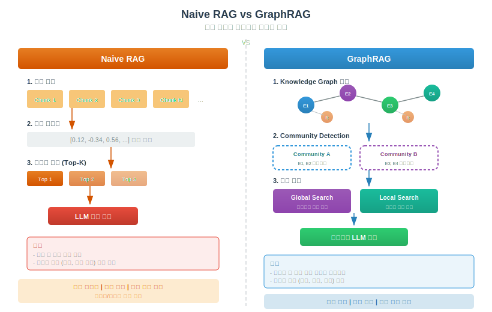

# GraphRAG (Graph-based Retrieval-Augmented Generation)

> `[4] 심화` · 선수 지식: [RAG](./rag.md), [AI Agent란](./ai-agent.md)

> `Trend` 2026

> 지식 그래프(Knowledge Graph)를 활용하여 엔티티 간 관계를 구조화하고, 커뮤니티 기반 요약으로 복합적인 질문에 답변하는 차세대 RAG 아키텍처

`#GraphRAG` `#그래프RAG` `#KnowledgeGraph` `#지식그래프` `#EntityExtraction` `#엔티티추출` `#RelationExtraction` `#관계추출` `#CommunityDetection` `#커뮤니티감지` `#LeidenAlgorithm` `#GlobalSearch` `#LocalSearch` `#MapReduce` `#Neo4j` `#LangChain` `#MicrosoftGraphRAG` `#NaiveRAG` `#RAG` `#LLM` `#그래프데이터베이스` `#GraphDatabase` `#Indexing` `#Chunking` `#StructuredRetrieval`

## 왜 알아야 하는가?

기존 RAG(Naive RAG)는 단순 유사도 검색에 의존하여 **"전체 문서에서 핵심 테마는?"** 같은 글로벌 질문에 취약합니다. GraphRAG는 이 한계를 극복하는 2026년 핵심 기술입니다.

- **실무**: 대규모 문서 코퍼스에서 관계 기반 지식 검색, 엔터프라이즈 지식 관리 시스템 구축
- **면접**: "Naive RAG의 한계와 GraphRAG의 해결 방식" — 2026년 AI 엔지니어 핵심 면접 주제
- **기반 지식**: Knowledge Graph, Community Detection, Map-Reduce 패턴 등 데이터 과학 핵심 개념 통합

## 핵심 개념

- **Knowledge Graph (지식 그래프)**: 엔티티(노드)와 관계(엣지)로 구성된 구조화된 지식 표현
- **Entity/Relation Extraction**: LLM이 텍스트에서 주요 엔티티와 그 관계를 자동 추출
- **Community Detection**: Leiden 알고리즘으로 밀접하게 연결된 엔티티 그룹(커뮤니티)을 식별
- **Community Summary**: 각 커뮤니티를 LLM이 요약하여 글로벌 질문에 활용
- **Global Search**: 모든 커뮤니티 요약을 Map-Reduce로 종합하여 전체적인 답변 생성
- **Local Search**: 특정 엔티티의 이웃 관계를 탐색하여 구체적인 답변 생성

## 쉽게 이해하기

**도서관**에서 정보를 찾는 두 가지 방법을 비교해보세요.

| Naive RAG (키워드 검색) | GraphRAG (사서의 연결 추천) |
|------------------------|---------------------------|
| 카탈로그에서 키워드로 책 검색 | 사서가 책들 사이의 **관계**를 알고 있음 |
| "AI" 검색 → AI 관련 책 5권 반환 | "AI의 전체 흐름은?" → 역사, 기술, 응용 연결 |
| 각 책은 **독립적** | 책 간 인용, 저자 관계, 분야 연결까지 활용 |
| 간단한 질문에 빠르게 대응 | 복합적 질문에 **구조화된 답변** 제공 |

Naive RAG가 **도서 카탈로그 검색**이라면, GraphRAG는 **모든 책의 관계를 파악한 전문 사서**에게 질문하는 것입니다.

## 상세 설명

### Naive RAG의 한계

기존 Naive RAG는 문서를 청크 단위로 분할한 뒤 벡터 유사도로 검색합니다. 이 방식은 두 가지 근본적인 한계가 있습니다.

1. **정보 파편화**: 청크 분할 과정에서 엔티티 간 관계 정보가 손실됨
2. **글로벌 질문 실패**: "이 문서 전체의 핵심 테마는?", "주요 인물 간 관계는?" 같은 전체적 맥락 질문에 대응 불가

### GraphRAG의 해결 방식

Microsoft Research가 2024년 발표한 GraphRAG는 **지식 그래프 + 커뮤니티 감지 + 계층적 요약**을 결합하여 이 문제를 해결합니다.

```
Naive RAG:  문서 → 청크 → 벡터 → 유사도 검색 → LLM
GraphRAG:   문서 → 엔티티/관계 추출 → 지식 그래프 → 커뮤니티 감지 → 요약 → LLM
```



### 파이프라인 단계

GraphRAG 파이프라인은 크게 **인덱싱(오프라인)**과 **쿼리(온라인)** 두 단계로 나뉩니다.

#### Phase 1: 인덱싱

| 단계 | 설명 | 사용 기술 |
|------|------|----------|
| **텍스트 청킹** | 원본 문서를 처리 가능한 단위로 분할 | 고정 크기 / 시맨틱 청킹 |
| **엔티티 추출** | 각 청크에서 주요 엔티티(인물, 조직, 기술 등)를 식별 | LLM (GPT-4 등) |
| **관계 추출** | 엔티티 간 관계(소속, 개발, 인용 등)를 파악 | LLM + 프롬프트 엔지니어링 |
| **그래프 구축** | 엔티티를 노드, 관계를 엣지로 Knowledge Graph 생성 | NetworkX / Neo4j |
| **커뮤니티 감지** | 밀접하게 연결된 엔티티 그룹을 계층적으로 식별 | Leiden Algorithm |
| **커뮤니티 요약** | 각 커뮤니티의 핵심 내용을 LLM으로 요약 | LLM Map-Reduce |

#### Phase 2: 쿼리

| 쿼리 유형 | 적합한 질문 | 동작 방식 |
|-----------|------------|----------|
| **Global Search** | "전체 테마는?", "주요 트렌드는?" | 모든 커뮤니티 요약 → Map(부분 답변) → Reduce(통합 답변) |
| **Local Search** | "X와 Y의 관계는?", "X의 세부사항은?" | 관련 엔티티의 이웃 노드 + 관계 + 원본 텍스트 결합 |

## 동작 원리

### GraphRAG 파이프라인 플로우



### Leiden Algorithm (커뮤니티 감지)

Leiden 알고리즘은 그래프에서 **모듈성(Modularity)**이 높은 커뮤니티를 계층적으로 식별합니다.

```
Level 0: 개별 엔티티 (가장 세밀)
Level 1: 소규모 커뮤니티 (5-10개 엔티티)
Level 2: 중규모 커뮤니티 (여러 소규모 통합)
Level N: 전체 문서 수준 (가장 포괄적)
```

- **Level이 낮을수록**: 세밀한 답변 (Local Search에 적합)
- **Level이 높을수록**: 포괄적 답변 (Global Search에 적합)

### Global Search: Map-Reduce 패턴

```
질문: "이 문서의 핵심 테마 3가지는?"

[Map 단계]
  Community A 요약 → 부분 답변 A
  Community B 요약 → 부분 답변 B
  Community C 요약 → 부분 답변 C
  ...

[Reduce 단계]
  부분 답변 A + B + C + ... → 통합 최종 답변
```

### Local Search: 엔티티 중심 탐색

```
질문: "GraphRAG와 Naive RAG의 차이점은?"

1. 질문에서 핵심 엔티티 식별: "GraphRAG", "Naive RAG"
2. Knowledge Graph에서 해당 엔티티의 이웃 탐색
3. 관련 관계, 커뮤니티 요약, 원본 텍스트 청크 수집
4. 수집된 컨텍스트로 LLM 답변 생성
```

## 아키텍처

```
┌─────────────────────────────────────────────────────────────┐
│                    GraphRAG Architecture                     │
├─────────────────────────────────────────────────────────────┤
│                                                              │
│  ┌─────────────┐    ┌──────────────┐    ┌───────────────┐  │
│  │  원본 문서    │───▶│ Entity/Rel   │───▶│ Knowledge     │  │
│  │  Corpus      │    │ Extraction   │    │ Graph         │  │
│  └─────────────┘    │ (LLM 기반)    │    │ (Nodes+Edges) │  │
│                      └──────────────┘    └───────┬───────┘  │
│                                                   │          │
│                                          ┌────────▼───────┐ │
│                                          │ Community      │ │
│                                          │ Detection      │ │
│                                          │ (Leiden)        │ │
│                                          └────────┬───────┘ │
│                                                   │          │
│                                          ┌────────▼───────┐ │
│                                          │ Community      │ │
│                                          │ Summaries      │ │
│                                          │ (LLM 요약)     │ │
│                                          └────────┬───────┘ │
│                                                   │          │
│  ┌─────────────────────────────────────────────────┘         │
│  │                                                           │
│  ▼                                                           │
│  ┌──────────────────┐    ┌──────────────────┐               │
│  │  Global Search   │    │  Local Search    │               │
│  │  (Map-Reduce)    │    │  (Entity 이웃)   │               │
│  │  "전체 요약은?"   │    │  "X와 Y 관계?"   │               │
│  └──────────────────┘    └──────────────────┘               │
│                                                              │
└─────────────────────────────────────────────────────────────┘
```

## 예제 코드

### Microsoft GraphRAG (공식 라이브러리)

```python
# pip install graphrag

import asyncio
from graphrag.index import run_pipeline
from graphrag.query import GlobalSearch, LocalSearch

# 1. 인덱싱: 문서에서 Knowledge Graph 구축
async def build_index():
    """문서 코퍼스를 Knowledge Graph로 변환"""
    await run_pipeline(
        root="./ragtest",           # 프로젝트 루트
        config_path="settings.yaml" # GraphRAG 설정
    )

# settings.yaml 핵심 설정
"""
llm:
  api_key: ${GRAPHRAG_API_KEY}
  model: gpt-4o

chunks:
  size: 1200
  overlap: 100

entity_extraction:
  max_gleanings: 1     # 추가 추출 반복 횟수

community_reports:
  max_length: 2000     # 커뮤니티 요약 최대 길이

claim_extraction:
  enabled: true        # 주장/사실 추출 활성화
"""

# 2. Global Search: 전체적인 질문
async def global_search(query: str):
    """커뮤니티 요약 기반 글로벌 검색"""
    search = GlobalSearch(
        llm=llm,
        context_builder=context_builder,
        map_system_prompt=MAP_PROMPT,
        reduce_system_prompt=REDUCE_PROMPT,
    )
    result = await search.asearch(query)
    return result.response

# 3. Local Search: 구체적인 질문
async def local_search(query: str):
    """엔티티 이웃 탐색 기반 로컬 검색"""
    search = LocalSearch(
        llm=llm,
        context_builder=context_builder,
        community_level=2,  # 커뮤니티 계층 레벨
    )
    result = await search.asearch(query)
    return result.response

# 실행 예시
asyncio.run(build_index())

# 글로벌 질문 — Naive RAG로는 답변 어려운 유형
answer = asyncio.run(global_search(
    "이 문서 전체에서 반복되는 핵심 테마 3가지를 요약해주세요"
))
print(answer)

# 로컬 질문 — 특정 엔티티 중심
answer = asyncio.run(local_search(
    "GraphRAG에서 Leiden 알고리즘의 역할은 무엇인가요?"
))
print(answer)
```

### LangChain + Neo4j 통합

```python
from langchain_community.graphs import Neo4jGraph
from langchain_openai import ChatOpenAI
from langchain.chains import GraphCypherQAChain

# 1. Neo4j 그래프 데이터베이스 연결
graph = Neo4jGraph(
    url="bolt://localhost:7687",
    username="neo4j",
    password="password"
)

# 2. Knowledge Graph에 데이터 적재
graph.query("""
    CREATE (graphrag:Technology {name: 'GraphRAG', year: 2024})
    CREATE (ms:Organization {name: 'Microsoft Research'})
    CREATE (leiden:Algorithm {name: 'Leiden Algorithm'})
    CREATE (rag:Technology {name: 'Naive RAG'})

    CREATE (ms)-[:DEVELOPED]->(graphrag)
    CREATE (graphrag)-[:USES]->(leiden)
    CREATE (graphrag)-[:IMPROVES]->(rag)
""")

# 3. 자연어 → Cypher 쿼리 → 그래프 검색
llm = ChatOpenAI(model="gpt-4o", temperature=0)

chain = GraphCypherQAChain.from_llm(
    llm=llm,
    graph=graph,
    verbose=True,
    allow_dangerous_requests=True  # Cypher 쿼리 실행 허용
)

# 4. 자연어 질의
response = chain.invoke({
    "query": "GraphRAG를 개발한 조직과 사용하는 알고리즘은?"
})
print(response["result"])
# → "Microsoft Research가 개발했으며, Leiden Algorithm을 사용합니다."
```

## 트레이드오프

### Naive RAG vs GraphRAG 비교

| 비교 항목 | Naive RAG | GraphRAG |
|-----------|-----------|----------|
| **검색 방식** | 벡터 유사도 (코사인) | 그래프 탐색 + 커뮤니티 요약 |
| **인덱싱 비용** | 낮음 (임베딩만) | 높음 (LLM 호출 다수) |
| **인덱싱 시간** | 빠름 | 느림 (수 시간 가능) |
| **로컬 질문** | 우수 | 우수 |
| **글로벌 질문** | 취약 | 탁월 |
| **관계 추론** | 불가 | 가능 |
| **비용** | 저렴 | 고가 (LLM API 비용) |
| **구현 복잡도** | 낮음 | 높음 |
| **데이터 업데이트** | 쉬움 (재임베딩) | 어려움 (재인덱싱) |
| **적합한 사용처** | FAQ, 단순 검색 | 연구 분석, 복합 질의 |

### 언제 어떤 것을 선택할까?

| 상황 | 추천 |
|------|------|
| 단순 Q&A 챗봇 | Naive RAG |
| 비용이 제한적 | Naive RAG |
| "전체 문서의 핵심 테마는?" 류의 질문 | GraphRAG |
| 엔티티 간 관계 파악 필요 | GraphRAG |
| 빠른 프로토타이핑 | Naive RAG |
| 대규모 코퍼스 심층 분석 | GraphRAG |
| 실시간 데이터 업데이트 필요 | Naive RAG |

**결론**: GraphRAG는 Naive RAG의 **대체제가 아닌 보완재**입니다. 글로벌 질문이나 관계 추론이 필요한 경우에 선택하고, 단순 검색은 여전히 Naive RAG가 효율적입니다. 실무에서는 두 방식을 **하이브리드로 결합**하는 것이 최선입니다.

## 면접 예상 질문

### Q: GraphRAG가 Naive RAG와 다른 점은 무엇인가요?

A: 핵심 차이는 **검색 단위**와 **컨텍스트 구성 방식**입니다.

- **Naive RAG**: 텍스트 청크 → 벡터 유사도 검색 → 상위 K개 청크를 LLM에 전달
- **GraphRAG**: 텍스트 → 엔티티/관계 추출 → Knowledge Graph 구축 → 커뮤니티 감지 → 커뮤니티 요약 기반 검색

GraphRAG는 **구조화된 관계 정보**를 활용하므로, "전체 문서의 핵심 테마는?" 같은 글로벌 질문에서 Naive RAG 대비 월등한 성능을 보입니다. Microsoft Research 논문에서 Naive RAG는 글로벌 질문의 종합성(comprehensiveness)과 다양성(diversity)에서 GraphRAG에 크게 뒤졌습니다.

### Q: GraphRAG의 커뮤니티 감지는 왜 필요한가요?

A: Knowledge Graph만으로는 수천~수만 개의 엔티티를 효율적으로 검색할 수 없습니다. 커뮤니티 감지(Leiden Algorithm)는 세 가지 역할을 합니다.

1. **정보 압축**: 수천 개 엔티티를 의미 있는 그룹으로 클러스터링
2. **계층적 탐색**: Level별로 세밀한/포괄적 답변 조절 가능
3. **글로벌 검색 가능**: 커뮤니티 요약을 통해 전체 문서 수준의 질문에 답변

### Q: GraphRAG의 단점과 이를 완화하는 방법은?

A: 주요 단점은 **높은 인덱싱 비용**과 **느린 인덱싱 속도**입니다.

**비용 문제**: 엔티티/관계 추출, 커뮤니티 요약 모두 LLM API 호출이 필요하여 대규모 코퍼스에서는 수백 달러 이상의 비용이 발생할 수 있습니다.

**완화 방법**:
- 저비용 LLM(GPT-4o-mini, Claude Haiku 등)으로 엔티티 추출 수행
- 증분 인덱싱(변경된 부분만 재처리)
- Naive RAG와 하이브리드 구성 (글로벌 질문만 GraphRAG 사용)

### Q: GraphRAG를 실무에 적용할 때 고려사항은?

A: 세 가지 핵심 고려사항이 있습니다.

1. **비용 대비 효과**: 글로벌 질문이 전체 쿼리의 10% 미만이면 Naive RAG로 충분
2. **데이터 업데이트 주기**: 데이터가 자주 바뀌면 재인덱싱 비용이 지속적으로 발생
3. **그래프 품질**: LLM의 엔티티/관계 추출 품질이 전체 시스템 성능을 결정 — 도메인별 프롬프트 튜닝 필수

## 연관 문서

| 문서 | 연관성 | 난이도 |
|------|--------|--------|
| [RAG](./rag.md) | 선수 지식 — Naive RAG의 기본 개념 | [3] 중급 |
| [AI Agent란](./ai-agent.md) | 선수 지식 — Agentic RAG와의 연결 | [1] 정의 |
| [Context Engineering](./context-engineering.md) | 관련 개념 — 컨텍스트 설계 관점 | [4] 심화 |
| [Multi-Agent Systems](./multi-agent-systems.md) | 확장 — GraphRAG + 멀티에이전트 결합 | [4] 심화 |
| [MCP](./mcp.md) | 관련 기술 — 외부 그래프 DB 연결 | [2] 입문 |

## 참고 자료

- [From Local to Global: A Graph RAG Approach to Query-Focused Summarization (Microsoft Research, 2024)](https://arxiv.org/abs/2404.16130)
- [Microsoft GraphRAG GitHub](https://github.com/microsoft/graphrag)
- [GraphRAG: Unlocking LLM discovery on narrative private datasets (Microsoft Blog)](https://www.microsoft.com/en-us/research/blog/graphrag-unlocking-llm-discovery-on-narrative-private-datasets/)
- [LangChain Graph-based RAG Documentation](https://python.langchain.com/docs/how_to/#graph)
- [Neo4j GraphRAG Package for Python](https://neo4j.com/docs/neo4j-graphrag-python/current/)
