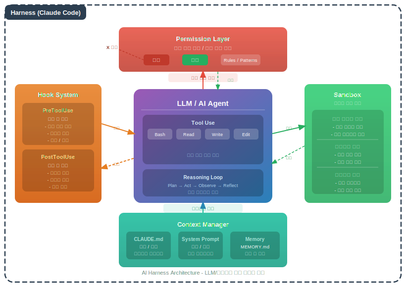
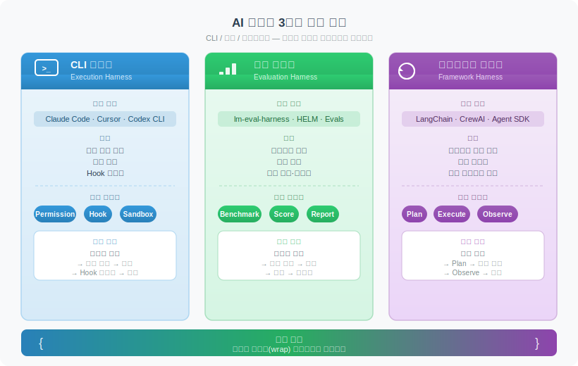

# AI 하네스 (AI Harness)

> `[2] 입문` · 선수 지식: [AI Agent란](./ai-agent.md)

> AI 모델이나 에이전트를 외부에서 감싸서 실행 환경·권한·생명주기를 제어하는 프레임워크

`#하네스` `#Harness` `#AIHarness` `#AI하네스` `#TestHarness` `#EvaluationHarness` `#CLIHarness` `#ClaudeCode` `#AgentRuntime` `#에이전트런타임` `#AgentFramework` `#LangChain` `#CrewAI` `#AgentSDK` `#lm-evaluation-harness` `#벤치마크` `#Benchmark` `#Guardrails` `#가드레일` `#Hook` `#Permission` `#권한제어` `#ToolUse` `#SandBox` `#샌드박스` `#에이전트제어` `#CLAUDE.md` `#settings.json`

## 왜 알아야 하는가?

- **실무**: AI 에이전트가 파일 삭제, DB 조작 등 위험한 행동을 하지 못하도록 하네스가 제어한다. 하네스 없는 에이전트는 브레이크 없는 자동차와 같다
- **면접**: "AI 에이전트의 안전성을 어떻게 보장하는가?"에 대한 핵심 답변이 하네스 아키텍처다
- **기반 지식**: Claude Code Hook, Guardrails, Agent SDK 등 고급 주제를 이해하기 위한 기반 개념

## 핵심 개념

- **하네스 = AI를 감싸는 틀**: AI 모델(LLM)이나 에이전트를 직접 실행하지 않고, 하네스가 생명주기를 관리한다
- **제어의 역전**: AI가 "무엇을 할지" 결정하지만, "어디까지 할 수 있는지"는 하네스가 결정한다
- **결정적 제어(Deterministic Control)**: LLM의 확률적 판단에 의존하지 않고, 코드로 규칙을 강제한다

## 쉽게 이해하기

AI 에이전트를 **신입 개발자**에 비유해보자.

- 신입(AI)은 코드를 잘 작성하지만, 회사 규칙을 모를 수 있다
- **하네스 = 팀 리드 + 코드 리뷰 + CI/CD 파이프라인**
  - 팀 리드가 "이 브랜치에만 푸시해" (권한 제어)
  - 코드 리뷰가 "위험한 코드는 머지 차단" (Hook)
  - CI/CD가 "테스트 통과해야 배포" (자동 검증)

신입이 아무리 뛰어나도, **이런 안전장치 없이 프로덕션에 직접 접근시키지 않는다.** AI 하네스도 같은 역할이다.

## 상세 설명

### 전통적 하네스 vs AI 하네스

| 구분 | 전통적 하네스 | AI 하네스 |
|------|-------------|----------|
| **대상** | 소프트웨어 (SUT) | LLM / AI 에이전트 |
| **핵심 목적** | 테스트 자동화 | 실행 제어 + 안전성 보장 |
| **제어 대상** | 입출력, 생명주기 | 권한, 도구 호출, 컨텍스트 |
| **예시** | JUnit, pytest | Claude Code, LangChain, Agent SDK |
| **특수성** | 결정적(Deterministic) | 비결정적 AI + 결정적 하네스 |

**왜 AI에서 하네스가 더 중요한가?**

전통적 소프트웨어는 코드가 정해진 대로 동작한다. 하지만 AI 에이전트는 **비결정적(Non-deterministic)** — 같은 입력에도 다른 행동을 할 수 있다. 따라서 하네스가 "가능한 행동의 범위"를 결정적으로 강제해야 한다.

### AI 하네스의 3가지 유형

#### 1. CLI 하네스 (Agent Runtime)

AI 에이전트의 실행 환경을 제어한다. **Claude Code가 대표적인 CLI 하네스**다.

| 구성 요소 | 역할 | Claude Code 대응 |
|-----------|------|-----------------|
| **설정(Configuration)** | 에이전트 동작 규칙 정의 | `CLAUDE.md`, `settings.json` |
| **권한(Permission)** | 도구 실행 허용/차단 | Permission Mode, `allowedTools` |
| **Hook** | 특정 이벤트에 자동 실행 | `PreToolUse`, `PostToolUse` |
| **샌드박스(Sandbox)** | 격리된 실행 환경 | Bash sandbox, 파일 시스템 제한 |
| **컨텍스트(Context)** | AI에게 제공하는 정보 | 시스템 프롬프트, 메모리, 파일 읽기 |

```
┌─── Claude Code Harness ───────────────────┐
│                                            │
│  settings.json → Permission → Hook        │
│       ↓              ↓          ↓         │
│  ┌─────────────────────────────────┐      │
│  │         Claude (LLM)            │      │
│  │   "파일을 삭제하겠습니다"        │      │
│  └─────────────────────────────────┘      │
│       ↓                                    │
│  PreToolUse Hook: "rm 명령 차단!"          │
│  → Exit code 2 → 실행 거부                │
│                                            │
└────────────────────────────────────────────┘
```

**왜 CLAUDE.md가 아닌 Hook이 필요한가?**

CLAUDE.md는 AI에게 "지시"하는 것이지, AI가 무시할 수 있다(LLM은 확률적). Hook은 하네스 레벨에서 **코드로 강제**하므로 AI가 우회할 수 없다. 이것이 **결정적 제어**의 핵심이다.

#### 2. 평가 하네스 (Evaluation Harness)

LLM의 성능을 체계적으로 측정하고 비교한다.

| 도구 | 설명 | 측정 대상 |
|------|------|----------|
| **lm-evaluation-harness** | EleutherAI의 LLM 벤치마크 프레임워크 | MMLU, HellaSwag, ARC 등 표준 벤치마크 |
| **HELM** | Stanford의 통합 평가 프레임워크 | 정확도, 공정성, 독성, 효율성 |
| **Evals (OpenAI)** | OpenAI의 모델 평가 도구 | 커스텀 평가 시나리오 |
| **Claude Eval** | Anthropic의 자체 평가 체계 | 안전성, 유용성, 정직성 |

```java
// 평가 하네스의 핵심 구조 (개념적 코드)
interface EvaluationHarness {
    List<TestCase> loadBenchmark(String name);     // 벤치마크 로드
    Response runModel(Model model, TestCase tc);   // 모델 실행
    Score evaluate(Response response, TestCase tc); // 결과 평가
    Report aggregate(List<Score> scores);           // 종합 리포트
}
```

**왜 별도의 평가 하네스가 필요한가?**

일반 테스트 하네스(JUnit)는 "정답이 하나"인 코드를 검증한다. LLM은 자연어를 생성하므로 정답이 여러 개일 수 있고, 공정성·독성 같은 비기능적 품질도 측정해야 한다. 평가 하네스는 이런 다차원 평가를 지원한다.

#### 3. 에이전트 프레임워크 하네스

에이전트의 계획-실행-관찰 루프를 관리한다.

| 프레임워크 | 하네스 역할 |
|-----------|-----------|
| **LangChain/LangGraph** | 체인 실행, 메모리 관리, 도구 라우팅 |
| **CrewAI** | 멀티 에이전트 역할 분배, 협업 조율 |
| **Anthropic Agent SDK** | 에이전트 생명주기, 도구 실행, 가드레일 |
| **AutoGen** | 대화 기반 멀티 에이전트 오케스트레이션 |

```
┌─── Agent Framework Harness ──────────┐
│                                       │
│  Plan → Execute → Observe → Reflect  │
│    ↑                          │       │
│    └──────────────────────────┘       │
│              반복                     │
│                                       │
│  하네스가 관리하는 것:                │
│  - 어떤 도구를 호출할 수 있는지       │
│  - 최대 반복 횟수 (무한 루프 방지)    │
│  - 에이전트 간 메시지 전달            │
│  - 실행 로그 및 비용 추적             │
│                                       │
└───────────────────────────────────────┘
```



### Claude Code 하네스 심화

Claude Code는 가장 정교한 CLI 하네스 중 하나다. 핵심 제어 메커니즘을 계층별로 살펴보자.

#### 제어 계층 구조

```
┌─────────────────────────────────────────────┐
│ Layer 1: Permission Mode                     │
│   plan / auto-edit / full-auto              │
│   → 사용자 승인 없이 실행 가능한 범위 결정   │
├─────────────────────────────────────────────┤
│ Layer 2: settings.json                       │
│   allowedTools / blockedTools               │
│   → 허용/차단할 도구 목록 명시               │
├─────────────────────────────────────────────┤
│ Layer 3: Hooks                               │
│   PreToolUse / PostToolUse                  │
│   → 도구 실행 전후에 코드로 검사/차단         │
├─────────────────────────────────────────────┤
│ Layer 4: CLAUDE.md                           │
│   프로젝트 규칙, 컨벤션, 금지사항             │
│   → AI에게 지시 (확률적, 우회 가능)          │
├─────────────────────────────────────────────┤
│ Layer 5: System Prompt                       │
│   Anthropic이 설정한 기본 동작 규칙           │
│   → 안전성, 윤리 가이드라인                  │
└─────────────────────────────────────────────┘
       ↑ 결정적 (코드 강제)
       ↓ 확률적 (LLM 판단)
```

Layer 1~3은 **하네스가 코드로 강제**하므로 AI가 우회할 수 없다. Layer 4~5는 **AI에게 지시**하는 것이므로 확률적이다. 보안에 중요한 규칙은 반드시 Layer 1~3에 설정해야 한다.

#### 실전 예시: 위험 SQL 차단

```bash
# settings.json의 PreToolUse Hook
# 하네스가 Bash 실행 전에 이 스크립트를 호출
# → DELETE/DROP 등 위험 SQL을 코드 레벨에서 차단
{
  "hooks": {
    "PreToolUse": [{
      "matcher": "Bash",
      "command": "./block-dangerous-sql.sh"
    }]
  }
}
```

이 Hook은 AI가 `DELETE FROM users` 같은 SQL을 실행하려 하면, 하네스 레벨에서 차단한다. CLAUDE.md에 "DELETE 쓰지 마세요"라고 적는 것보다 **100% 확실한 방법**이다.



## 트레이드오프

| 장점 | 단점 |
|------|------|
| AI 행동을 결정적으로 제한 | 하네스 설정 학습 비용 |
| 보안 사고 예방 (파일 삭제, DB 조작 등) | 과도한 제한 시 에이전트 생산성 저하 |
| 표준화된 평가·벤치마크 가능 | 하네스마다 설정 방식이 다름 |
| 실행 로그·비용 추적 자동화 | 하네스 자체의 버그 가능성 |

## 트러블슈팅

### 사례 1: Hook이 동작하지 않음

#### 증상
`PreToolUse` Hook을 설정했는데 AI가 여전히 차단되어야 할 명령을 실행한다.

#### 원인 분석
Hook 스크립트에 실행 권한이 없거나, `matcher`가 올바르지 않은 경우. 특히 Windows 환경에서 셸 스크립트 실행 시 발생한다.

#### 해결 방법
```bash
# 1. 스크립트 실행 권한 확인
chmod +x ./block-dangerous-sql.sh

# 2. matcher 확인 - 도구 이름이 정확해야 함
# 올바른 예: "Bash", "Write", "Edit"
# 잘못된 예: "bash", "write" (대소문자 구분)

# 3. 로그로 Hook 동작 확인
# PostToolUse Hook에서 실행 이력 기록
```

#### 예방 조치
- Hook 설정 후 반드시 테스트 실행으로 동작 확인
- `settings.json` 문법 검증 (JSON Lint)

### 사례 2: 에이전트가 무한 루프에 빠짐

#### 증상
AI 에이전트가 같은 도구를 반복 호출하며 멈추지 않는다.

#### 원인 분석
하네스에 최대 반복 횟수(`max_iterations`) 설정이 없거나, 에이전트가 실패를 인식하지 못하고 재시도하는 경우.

#### 해결 방법
```python
# LangChain 예시: 최대 반복 제한
agent = initialize_agent(
    tools=tools,
    llm=llm,
    max_iterations=10,    # 최대 10회 반복
    early_stopping_method="force"  # 초과 시 강제 종료
)
```

#### 예방 조치
- 모든 에이전트 프레임워크에서 `max_iterations` 설정 필수
- 비용 상한(Cost Limit) 설정으로 토큰 과다 사용 방지

## 면접 예상 질문

### Q: AI 하네스란 무엇이고, 왜 전통적 하네스보다 중요한가요?

A: AI 하네스는 LLM이나 에이전트를 감싸서 실행 환경·권한·생명주기를 제어하는 프레임워크입니다. 전통적 소프트웨어는 코드가 결정적으로 동작하지만, AI는 비결정적이라 같은 입력에도 다른 행동을 할 수 있습니다. 따라서 하네스가 "가능한 행동의 범위"를 결정적으로 강제해야 합니다. Claude Code의 Hook, Permission 시스템이 대표적인 예입니다.

### Q: CLAUDE.md에 "위험한 명령 실행 금지"라고 적으면 되지 않나요? Hook이 왜 필요한가요?

A: CLAUDE.md는 AI에게 "지시"하는 것이지, AI가 100% 따르는 것은 아닙니다(확률적). Hook은 하네스 레벨에서 코드로 강제하므로 AI가 우회할 수 없습니다. 보안에 중요한 규칙은 반드시 결정적 제어(Hook, Permission)로 설정해야 합니다. 이것이 "CLAUDE.md = 가이드라인, Hook = 법률"인 이유입니다.

### Q: lm-evaluation-harness 같은 평가 하네스는 일반 테스트 프레임워크와 어떻게 다른가요?

A: 일반 테스트 프레임워크(JUnit)는 "정답이 하나"인 코드를 검증합니다. 평가 하네스는 자연어 생성 결과를 검증해야 하므로, 정확도뿐 아니라 공정성·독성·효율성 같은 다차원 평가를 지원합니다. 또한 여러 모델을 동일 벤치마크로 비교하는 표준화된 환경을 제공합니다.

## 연관 문서

| 문서 | 연관성 | 난이도 |
|------|--------|--------|
| [AI Agent란](./ai-agent.md) | 선수 지식 - 에이전트의 기본 개념 | [1] 정의 |
| [Claude Code Hook](./claude-code-hook.md) | CLI 하네스의 핵심 제어 메커니즘 | [3] 중급 |
| [Claude Code 설정 체계](./claude-code-settings.md) | 하네스 설정 구조 심화 | [3] 중급 |
| [AI Guardrails](./ai-guardrails.md) | 하네스와 가드레일의 관계 | [3] 중급 |
| [Agent SDK](./agent-sdk.md) | 프레임워크 하네스의 구현체 | [3] 중급 |

## 참고 자료

- [Anthropic - Claude Code Documentation](https://docs.anthropic.com/en/docs/claude-code)
- [EleutherAI - lm-evaluation-harness](https://github.com/EleutherAI/lm-evaluation-harness)
- [Stanford HELM](https://crfm.stanford.edu/helm/)
- [LangChain Agent Documentation](https://python.langchain.com/docs/modules/agents/)
