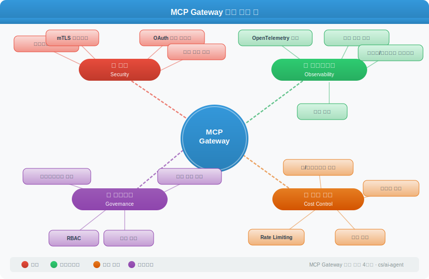

# MCP Gateway

> `[4] 심화` · 선수 지식: [MCP (Model Context Protocol)](./mcp.md), [AI Agent란?](./ai-agent.md)

> `Trend` 2026

> AI Agent와 MCP 서버 사이에 위치하여 보안, 관찰가능성, 비용 제어, 거버넌스를 중앙에서 통합 관리하는 엔터프라이즈 인프라 계층

`#MCPGateway` `#MCP게이트웨이` `#ModelContextProtocol` `#AIAgent` `#에이전트인프라` `#AgentInfrastructure` `#보안게이트웨이` `#SecurityGateway` `#관찰가능성` `#Observability` `#OpenTelemetry` `#RateLimiting` `#RBAC` `#거버넌스` `#Governance` `#비용제어` `#CostControl` `#자격증명관리` `#CredentialManagement` `#APIGateway` `#Cloudflare` `#Kong` `#Bifrost` `#Speakeasy` `#제로트러스트` `#ZeroTrust` `#감사로그` `#AuditLog` `#엔터프라이즈AI` `#MCP서버관리`

## 왜 알아야 하는가?

MCP가 AI Agent의 도구 연결 표준으로 자리잡으면서(2026년 2월 기준 월간 9,700만+ SDK 다운로드), 기업에서는 수십~수백 개의 MCP 서버를 운영하게 되었다. 이 규모에서 **각 Agent가 개별 MCP 서버에 직접 연결하는 구조는 보안, 비용, 운영 측면에서 지속 불가능**하다.

- **실무**: 프로덕션 환경에서 AI Agent를 운영할 때, MCP Gateway 없이는 자격증명 분산, 모니터링 불가, 비용 폭주 등 운영 이슈가 발생한다
- **면접**: "AI Agent를 엔터프라이즈 환경에 배포할 때 어떤 인프라가 필요한가?"라는 질문에 Gateway 계층을 설명할 수 있어야 한다
- **기반 지식**: API Gateway → MCP Gateway로 이어지는 인프라 패턴의 진화를 이해하면, 향후 Agent 인프라 설계의 기반이 된다

## 핵심 개념

- MCP Gateway는 **AI Agent와 MCP 서버 사이의 중앙 프록시**로, 모든 도구 호출이 이 게이트웨이를 통과한다
- API Gateway가 마이크로서비스 앞에 놓이듯, MCP Gateway는 MCP 서버 앞에 놓인다
- 핵심 4대 기능: **보안(Security)**, **관찰가능성(Observability)**, **비용 제어(Cost Control)**, **거버넌스(Governance)**

## 쉽게 이해하기

회사 건물의 **출입 관리 시스템**을 생각해 보자.

- **Gateway 없는 구조**: 각 사무실(MCP 서버)마다 별도 잠금장치가 있고, 모든 방문자(AI Agent)가 각 사무실 열쇠를 개별 관리한다. 누가 어디를 출입했는지 추적이 어렵고, 열쇠를 잃어버리면 보안 사고가 발생한다
- **Gateway 있는 구조**: 건물 로비에 **통합 보안 데스크**가 있다. 방문자는 로비에서 신원 확인(인증)을 거치고, 출입 권한(인가)을 확인받고, 모든 출입이 자동 기록(감사 로그)된다. 보안 데스크가 열쇠를 중앙 관리하므로 방문자가 직접 열쇠를 가질 필요가 없다

## 상세 설명

### Gateway가 필요한 이유

MCP 서버가 1~2개일 때는 Agent가 직접 연결해도 문제가 없다. 하지만 기업 환경에서는 다음 문제가 발생한다:

| 문제 | 설명 |
|------|------|
| **자격증명 분산** | 각 Agent가 DB 비밀번호, API 키 등을 직접 보유 → 유출 위험 증가 |
| **모니터링 불가** | Agent가 어떤 도구를 얼마나 호출했는지 추적 불가 |
| **비용 폭주** | Rate Limiting 없이 Agent가 무한 API 호출 가능 |
| **접근 제어 부재** | 모든 Agent가 모든 MCP 서버에 접근 가능 |
| **장애 전파** | 하나의 MCP 서버 장애가 전체 Agent에 영향 |

**왜 이렇게 하는가?**
API Gateway가 마이크로서비스 아키텍처의 필수 인프라가 된 것과 같은 이유다. 개별 서비스 직접 호출은 소규모에서만 작동하고, 규모가 커지면 중앙 관리 계층이 필수적이다.

### Gateway 없는 구조 vs 있는 구조





### 핵심 기능 4가지



#### 1. 보안 (Security)

| 기능 | 설명 |
|------|------|
| **자격증명 중앙 관리** | MCP 서버의 API 키, DB 비밀번호를 Gateway가 보유. Agent는 자격증명을 알 필요 없음 |
| **mTLS** | Gateway ↔ MCP 서버 간 상호 TLS 인증으로 통신 암호화 |
| **OAuth 2.1** | Agent 인증에 OAuth 2.1 표준 사용 (MCP 공식 사양에 포함) |
| **비밀 볼트 연동** | HashiCorp Vault, AWS Secrets Manager 등과 통합하여 자격증명 자동 교체 |

**왜 이렇게 하는가?**
Agent가 자격증명을 직접 보유하면, 프롬프트 인젝션 공격으로 자격증명이 유출될 수 있다. Gateway가 자격증명을 보유하면 Agent에게는 권한 토큰만 발급되므로, 공격 표면이 크게 줄어든다.

#### 2. 관찰가능성 (Observability)

| 기능 | 설명 |
|------|------|
| **분산 추적** | OpenTelemetry로 Agent의 도구 호출 전체 흐름 추적 |
| **메트릭** | 도구별 호출 횟수, 지연시간, 에러율 수집 (Prometheus 호환) |
| **감사 로그** | 누가(Agent), 언제, 어떤 도구를, 어떤 입력으로 호출했는지 기록 |
| **이상 탐지** | 비정상적인 호출 패턴 감지 (예: Agent가 갑자기 1000회 DB 쿼리) |

**왜 이렇게 하는가?**
Multi-Agent 환경에서 하나의 Agent가 20개 도구를 순차 호출할 때, 어디서 실패했는지 파악하려면 중앙 추적이 필수다. 개별 MCP 서버 로그만으로는 전체 흐름을 재구성할 수 없다.

#### 3. 비용 제어 (Cost Control)

| 기능 | 설명 |
|------|------|
| **Rate Limiting** | Agent/팀/프로젝트별 분당/시간당 호출 횟수 제한 |
| **쿼터 관리** | 월간 사용량 한도 설정 및 경고 알림 |
| **사용량 대시보드** | 팀별, Agent별, 도구별 사용량 실시간 시각화 |
| **시맨틱 캐싱** | 동일/유사 요청 결과를 캐싱하여 중복 호출 절감 |

**왜 이렇게 하는가?**
AI Agent는 자율적으로 도구를 호출하기 때문에, 사람이 직접 API를 호출할 때보다 호출량이 폭발적으로 증가할 수 있다. Gartner는 2026년 엔터프라이즈 앱의 40%가 AI Agent를 내장할 것으로 예측하며, 제어 없는 Agent 운영은 비용 재앙으로 이어진다.

#### 4. 거버넌스 (Governance)

| 기능 | 설명 |
|------|------|
| **RBAC** | 역할 기반 접근 제어. Agent별로 사용 가능한 도구를 제한 |
| **정책 엔진** | "프로덕션 DB는 읽기 전용 Agent만 접근 가능" 같은 규칙 정의 |
| **컴플라이언스 감사** | GDPR, SOC2 등 규정 준수를 위한 접근 기록 보관 |
| **도구 버전 관리** | MCP 서버의 도구 스키마 변경 시 하위 호환성 보장 |

**왜 이렇게 하는가?**
2026년 Deloitte는 AI Agent 거버넌스를 "컴플라이언스 오버헤드가 아닌 배포 가속 수단"으로 정의했다. 성숙한 거버넌스 프레임워크가 있어야 조직이 고가치 시나리오에 Agent를 배포할 자신감을 갖게 된다.

### 주요 MCP Gateway 솔루션 비교 (2026)

| 솔루션 | 특징 | MCP 지원 | 캐싱 | 비고 |
|--------|------|---------|------|------|
| **Cloudflare MCP Server Portals** | 제로 트러스트 기반, 글로벌 엣지 네트워크 | 네이티브 | 제한적 | 기존 Cloudflare 인프라와 통합 |
| **Kong AI Gateway** | API Gateway 확장, MCP Proxy 플러그인 | 플러그인 | 미지원 | 기존 Kong 사용 조직에 적합 |
| **Bifrost** | 11μs 지연, 다중 프로바이더 페일오버 | 네이티브 | 시맨틱 캐싱 | 성능 중심 설계 |
| **Speakeasy** | OpenAPI → MCP 서버 자동 생성 | 생성 도구 | - | API 개발 플랫폼 |

### API Gateway와의 비교

| 항목 | API Gateway | MCP Gateway |
|------|-------------|-------------|
| **대상** | 마이크로서비스 | MCP 서버 (AI 도구) |
| **클라이언트** | 웹/모바일 앱 | AI Agent |
| **프로토콜** | HTTP/REST/gRPC | MCP (JSON-RPC over stdio/SSE) |
| **인증** | API Key, JWT, OAuth | OAuth 2.1, Agent 토큰 |
| **특수 기능** | 요청 변환, 캐싱 | 도구 스키마 관리, 시맨틱 캐싱 |
| **호출 패턴** | 예측 가능 (사용자 트리거) | 비예측적 (Agent 자율 호출) |

**왜 별도 Gateway가 필요한가?**
기존 API Gateway를 MCP에 그대로 사용할 수 있지만, MCP 고유의 요구사항(도구 스키마 디스커버리, 시맨틱 캐싱, Agent 인증)을 처리하려면 MCP 전용 기능이 필요하다.

## 예제: MCP Gateway 설정

### Cloudflare MCP Server Portal 등록 예시

```yaml
# mcp-gateway-config.yaml
gateway:
  name: "production-mcp-gateway"
  auth:
    type: oauth2.1
    issuer: "https://auth.company.com"

  servers:
    - name: "database-server"
      upstream: "mcp://db-server.internal:8080"
      tools:
        - name: "query"
          access: ["data-analyst-agent", "report-agent"]
        - name: "write"
          access: ["admin-agent"]
      rate_limit:
        requests_per_minute: 100

    - name: "search-server"
      upstream: "mcp://search.internal:8081"
      tools:
        - name: "search"
          access: ["*"]  # 모든 Agent 허용
      rate_limit:
        requests_per_minute: 500

  observability:
    tracing:
      exporter: otlp
      endpoint: "https://otel-collector.internal:4317"
    metrics:
      exporter: prometheus
      port: 9090
    audit_log:
      storage: s3
      bucket: "mcp-audit-logs"
      retention_days: 90
```

### Agent 측 연결 설정

```json
{
  "mcpServers": {
    "company-gateway": {
      "url": "https://mcp-gateway.company.com",
      "auth": {
        "type": "oauth2",
        "client_id": "agent-data-analyst",
        "scope": "mcp:read mcp:search"
      }
    }
  }
}
```

Gateway를 사용하면 Agent는 개별 MCP 서버의 주소나 자격증명을 알 필요 없이, **Gateway 하나에만 연결**하면 된다.

## 트레이드오프

| 장점 | 단점 |
|------|------|
| 중앙집중 보안으로 자격증명 유출 위험 감소 | 단일 장애점(SPOF)이 될 수 있음 |
| 통합 모니터링/감사 로그 | 추가 네트워크 홉으로 지연 증가 |
| 팀별 비용 추적 및 Rate Limiting | Gateway 자체의 운영/관리 비용 |
| RBAC으로 도구 접근 세밀 제어 | 소규모 환경에서는 오버엔지니어링 |
| MCP 서버 변경 시 Agent 수정 불필요 | Gateway 설정 복잡도 |

## 트러블슈팅

### 사례 1: Agent가 도구 호출 시 403 Forbidden

#### 증상

```
Error: MCP Gateway returned 403 Forbidden
Tool: database-server/query
Agent: report-agent
```

#### 원인 분석

Gateway의 RBAC 정책에서 해당 Agent에 대한 도구 접근 권한이 미설정되었거나, OAuth 토큰의 scope이 부족한 경우 발생한다.

#### 해결 방법

```yaml
# Gateway 설정에서 Agent 권한 확인
servers:
  - name: "database-server"
    tools:
      - name: "query"
        access: ["report-agent"]  # Agent 추가
```

또는 Agent의 OAuth scope을 확인한다:

```json
{
  "scope": "mcp:read mcp:query"
}
```

#### 예방 조치

- Gateway 대시보드에서 403 에러 알림 설정
- 새 Agent 배포 시 필요한 도구 접근 권한을 사전 정의하는 체크리스트 운영

### 사례 2: 지연시간 급증

#### 증상

도구 호출 응답 시간이 평소 50ms에서 2000ms로 급증

#### 원인 분석

Gateway의 Rate Limiting에 의해 요청이 큐잉되거나, 백엔드 MCP 서버의 응답 지연이 Gateway를 통해 전파된 경우

#### 해결 방법

1. Gateway 메트릭에서 Rate Limit 히트 여부 확인
2. 백엔드 MCP 서버의 헬스 체크 확인
3. 시맨틱 캐싱 활성화로 중복 요청 감소

#### 예방 조치

- Gateway에 Circuit Breaker 패턴 적용
- 지연시간 임계값 알림 설정 (P99 > 500ms)
- 백엔드 MCP 서버별 타임아웃 설정

## 면접 예상 질문

### Q: MCP Gateway가 왜 필요한가? 기존 API Gateway로는 안 되는가?

A: 기존 API Gateway도 기본적인 프록시 역할은 가능하지만, MCP 고유의 요구사항을 처리하기 어렵다. MCP의 **도구 스키마 디스커버리**(Agent가 사용 가능한 도구 목록을 동적으로 조회), **시맨틱 캐싱**(의미적으로 동일한 요청 결과 재사용), **Agent 인증**(자율적 호출 주체 인증)은 기존 API Gateway의 요청/응답 변환 모델과 맞지 않는다. 특히 AI Agent는 사용자와 달리 자율적으로 도구를 호출하기 때문에, Rate Limiting과 비용 제어의 중요성이 훨씬 크다.

### Q: MCP Gateway가 단일 장애점(SPOF)이 되지 않는가?

A: 맞다. 따라서 프로덕션 환경에서는 **다중 인스턴스 + 로드밸런서** 구성이 필수다. Cloudflare의 경우 글로벌 엣지 네트워크에 분산 배포되고, Kong은 클러스터 모드를 지원한다. 또한 Gateway 장애 시 Agent가 직접 연결로 폴백하는 **Circuit Breaker 패턴**을 적용할 수 있다. 이는 API Gateway가 SPOF 문제를 해결하는 방식과 동일하다.

### Q: 소규모 팀에서도 MCP Gateway가 필요한가?

A: MCP 서버가 1~2개이고 Agent가 소수라면 직접 연결이 더 적절하다. Gateway의 오버헤드(운영, 설정, 비용)가 이점보다 클 수 있다. 일반적으로 **MCP 서버 5개 이상 + 다수 Agent**를 운영하거나, **보안/컴플라이언스 요구사항**이 있을 때 Gateway 도입을 고려한다.

## 연관 문서

| 문서 | 연관성 | 난이도 |
|------|--------|--------|
| [MCP (Model Context Protocol)](./mcp.md) | 선수 지식 - MCP 프로토콜 자체 이해 | [2] 입문 |
| [AI Agent란?](./ai-agent.md) | 선수 지식 - Agent의 동작 원리 | [1] 정의 |
| [Multi-Agent System](./multi-agent-systems.md) | 관련 개념 - 다중 Agent 운영 시 Gateway 필요성 증가 | [3] 중급 |
| [A2A Protocol](./a2a-protocol.md) | 관련 개념 - Agent 간 통신 프로토콜 | [3] 중급 |
| [AI Guardrails](./ai-guardrails.md) | 관련 개념 - Agent 안전장치와 거버넌스 | [3] 중급 |
| [Tool Use](./tool-use.md) | 관련 개념 - Agent의 도구 호출 메커니즘 | [2] 입문 |

## 참고 자료

- [Cloudflare - Zero Trust MCP Server Portals](https://blog.cloudflare.com/zero-trust-mcp-server-portals/)
- [Speakeasy - What is an MCP Gateway](https://www.speakeasy.com/blog/what-is-an-mcp-gateway)
- [Google Cloud - AI Agent Trends 2026 Report](https://cloud.google.com/resources/content/ai-agent-trends-2026)
- [Deloitte - Agentic AI Strategy](https://www.deloitte.com/us/en/insights/topics/technology-management/tech-trends/2026/agentic-ai-strategy.html)
- [The New Stack - 5 Key Trends Shaping Agentic Development in 2026](https://thenewstack.io/5-key-trends-shaping-agentic-development-in-2026/)
- [Composio - 10 Best MCP Gateways for Developers in 2026](https://composio.dev/content/best-mcp-gateway-for-developers)
