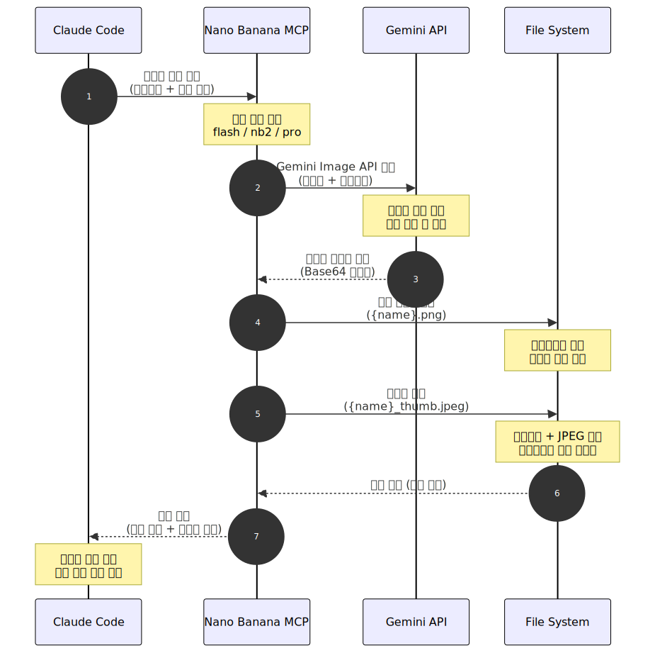
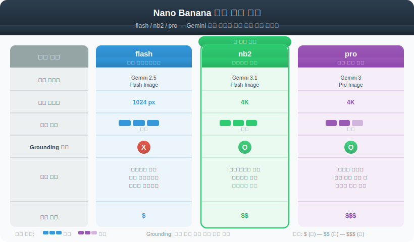

# Nano Banana 2 이미지 생성

> `[2] 입문` · 선수 지식: [MCP](./mcp.md)

> Claude Code에서 MCP를 통해 Gemini 이미지 생성 모델을 호출하여 고품질 이미지를 생성하는 도구

`#나노바나나` `#NanoBanana` `#NanoBanana2` `#이미지생성` `#ImageGeneration` `#Gemini` `#GeminiFlashImage` `#GeminiProImage` `#MCP` `#MCPServer` `#ClaudeCode` `#AI이미지` `#텍스트투이미지` `#Text2Image` `#4K` `#GoogleAI` `#GoogleCloud` `#APIKey` `#SynthID` `#워터마크` `#Grounding` `#이미지편집` `#ImageEditing` `#멀티모달` `#Multimodal`

## 왜 알아야 하는가?

- **실무**: Claude Code 작업 중 다이어그램, 목업, 아이콘 등 이미지를 즉시 생성하여 문서화와 프로토타이핑을 가속화할 수 있다
- **면접**: MCP 기반 외부 AI 서비스 통합 패턴을 이해하면 AI 에이전트 아키텍처 설명에 활용 가능
- **기반 지식**: MCP 서버를 통한 외부 API 연동의 실전 사례로, 커스텀 MCP 서버 개발의 참고 모델

## 핵심 개념

- Nano Banana 2는 Google Gemini 이미지 생성 모델을 MCP 서버로 래핑한 도구
- Claude Code에서 자연어 프롬프트로 이미지 생성/편집 가능
- 3가지 모델 티어(flash, nb2, pro) 지원, 최대 4K 해상도

## 쉽게 이해하기

카페에서 주문하는 것과 비슷하다.

- **Claude Code** = 손님 (이미지가 필요해서 주문)
- **Nano Banana MCP** = 캐셔 (주문을 받아서 주방에 전달)
- **Gemini API** = 주방 (실제 이미지를 만들어 내놓음)
- **API Key** = 회원카드 (결제 수단, 등급에 따라 주문 한도가 다름)

손님이 "바다 위 석양 사진 만들어줘"라고 말하면, 캐셔가 주방에 전달하고, 주방이 이미지를 만들어서 돌려준다.

## 동작 원리



## 상세 설명

### Nano Banana MCP란?

Nano Banana는 Google의 Gemini 이미지 생성 모델을 Claude Code에서 사용할 수 있도록 MCP 프로토콜로 연결하는 서버다. 핵심 기능은 다음과 같다:

| 기능 | 설명 |
|------|------|
| 이미지 생성 | 텍스트 프롬프트로 새 이미지 생성 |
| 이미지 편집 | 기존 이미지를 입력하여 수정 |
| 멀티 이미지 | 최대 3개 입력 이미지로 합성/조합 |
| Google Search Grounding | 실제 사물/인물의 정확한 표현을 위한 검색 기반 생성 |
| SynthID 워터마크 | AI 생성 이미지임을 식별하는 디지털 워터마크 자동 적용 |

### 모델 티어 비교



| 티어 | 내부 모델 | 최대 해상도 | 속도 | Grounding | 용도 |
|------|----------|-----------|------|-----------|------|
| `flash` | Gemini 2.5 Flash Image | 1024px | 빠름 | X | 빠른 프로토타입, 테스트 |
| `nb2` | Gemini 3.1 Flash Image | 4K | 빠름 | O | **기본 권장**, 고품질 + 빠른 속도 |
| `pro` | Gemini 3 Pro Image | 4K | 보통 | O | 최고 품질, 복잡한 장면 |
| `auto` | 자동 선택 | 4K | - | - | 프롬프트에 따라 nb2/pro 자동 선택 |

**왜 nb2가 기본 권장인가?**
Flash 수준의 속도로 4K 해상도와 Grounding을 지원하기 때문이다. Pro는 추론 품질이 더 높지만 속도가 느리므로, 복잡한 장면이나 텍스트 렌더링이 필요한 경우에만 사용한다.

### 지원 비율(Aspect Ratio)

| 비율 | 용도 |
|------|------|
| `1:1` | 프로필, 아이콘, 정방형 썸네일 |
| `16:9` | 프레젠테이션, 배너, 와이드스크린 |
| `9:16` | 모바일 풀스크린, 스토리 |
| `4:3` | 일반 문서, 블로그 이미지 |
| `3:2` | 사진 표준 비율 |
| `21:9` | 울트라와이드 배너 |

## 설정 가이드

### 1단계: Google AI API 키 발급

1. [Google AI Studio](https://aistudio.google.com/) 접속
2. **Get API Key** → **Create API key** 클릭
3. 생성된 `AIzaSy...` 형식의 키를 복사

### 2단계: 결제(Billing) 활성화

> **중요**: Free Tier는 이미지 생성 모델의 일일 한도가 매우 낮다. 안정적 사용을 위해 유료 Tier를 권장한다.

1. [Google AI Studio 요금제](https://aistudio.google.com/pricing) 에서 현재 Tier 확인
2. **Pay-as-you-go** 활성화 (Tier 1 이상)
3. [Rate Limit 대시보드](https://ai.dev/rate-limit) 에서 할당량 확인

#### Tier별 할당량 비교

| Tier | 분당 요청(RPM) | 일일 요청(RPD) | 비용 |
|------|--------------|--------------|------|
| Free | 2 RPM | 50 RPD | 무료 |
| Tier 1 | 10 RPM | 1,500 RPD | 종량제 |
| Tier 2+ | 더 높음 | 더 높음 | 종량제 |

### 3단계: MCP 서버 설정

Claude Code의 MCP 설정 파일에 Nano Banana 서버를 추가한다.

#### 방법 A: 글로벌 설정 (~/.claude/settings.json)

```json
{
  "mcpServers": {
    "nanobanana": {
      "command": "npx",
      "args": ["-y", "nano-banana@latest"],
      "env": {
        "GEMINI_API_KEY": "발급받은_API_KEY",
        "IMAGE_OUTPUT_DIR": "이미지_저장_경로"
      }
    }
  }
}
```

#### 방법 B: 프로젝트 설정 (.claude/settings.json)

프로젝트별로 이미지 저장 경로를 다르게 지정할 때 사용한다.

```json
{
  "mcpServers": {
    "nanobanana": {
      "command": "npx",
      "args": ["-y", "nano-banana@latest"],
      "env": {
        "GEMINI_API_KEY": "발급받은_API_KEY",
        "IMAGE_OUTPUT_DIR": "./images",
        "RETURN_FULL_IMAGE": "false"
      }
    }
  }
}
```

#### 환경 변수 설명

| 변수 | 필수 | 설명 |
|------|------|------|
| `GEMINI_API_KEY` | O | Google AI Studio에서 발급받은 API 키 |
| `IMAGE_OUTPUT_DIR` | X | 이미지 기본 저장 경로 (기본: `~/nanobanana-images`) |
| `RETURN_FULL_IMAGE` | X | MCP 응답에 원본 이미지 포함 여부 (기본: `false`). `true`면 4K 이미지가 응답에 포함되어 토큰 사용량 증가 |

### 4단계: 연결 확인

Claude Code에서 다음과 같이 확인:

```shell
# Claude Code 실행 후 MCP 서버 목록 확인
/mcp
```

`nanobanana` 서버가 목록에 표시되면 설정 완료.

## 사용 가이드

### 기본 이미지 생성

Claude Code에서 자연어로 요청하면 된다:

```
"바다 위 석양 이미지를 16:9 비율로 생성해줘"
```

Claude가 내부적으로 `generate_image` 도구를 호출한다.

### 주요 파라미터

| 파라미터 | 타입 | 설명 |
|---------|------|------|
| `prompt` | string (필수) | 이미지 설명. 주제, 구도, 스타일, 텍스트 등 상세하게 작성 |
| `model_tier` | string | `flash`, `nb2`, `pro`, `auto` 중 선택 |
| `aspect_ratio` | string | `1:1`, `16:9`, `9:16`, `4:3` 등 |
| `output_path` | string | 저장 경로. 파일명 또는 디렉토리 지정 |
| `n` | int (1~4) | 생성할 이미지 수 |
| `negative_prompt` | string | 제외할 요소 (스타일, 객체, 텍스트 등) |
| `resolution` | string | `high`, `4k`, `2k`, `1k` |
| `enable_grounding` | bool | Google Search 기반 정확도 향상 (Pro만) |
| `system_instruction` | string | 톤/스타일 가이드 |

### 프롬프트 작성 팁

좋은 프롬프트는 다음 요소를 포함한다:

```
[주제] + [구도/액션] + [배경/장소] + [스타일] + [텍스트(필요 시)]
```

#### 예시

| 목적 | 프롬프트 |
|------|---------|
| 기술 블로그 배너 | "Modern tech blog header with circuit board patterns, blue gradient background, minimalist style" |
| 아키텍처 일러스트 | "Isometric illustration of cloud computing architecture, servers connected to client devices, clean flat design" |
| 마스코트 | "Cute cartoon robot character waving, friendly expression, pastel colors, simple vector style" |

### 이미지 편집

기존 이미지를 입력하여 수정할 수 있다:

```
"이 이미지의 배경을 파란 하늘로 바꿔줘"
→ input_image_path_1에 원본 이미지 경로 지정
```

### 멀티 이미지 합성

최대 3개 이미지를 입력하여 조합할 수 있다:

```
"첫 번째 이미지의 인물을 두 번째 이미지의 배경에 합성해줘"
→ input_image_path_1, input_image_path_2에 각각 경로 지정
```

### 유지보수 명령

| 명령 | 설명 |
|------|------|
| `check_quota` | Files API 저장 사용량 확인 (~20GB 한도) |
| `cleanup_local` | 오래된 로컬 이미지 정리 |
| `cleanup_expired` | 만료된 Files API 항목 정리 |
| `full_cleanup` | 전체 정리 (위 3가지 순차 실행) |

## 트러블슈팅

### 사례 1: 429 RESOURCE_EXHAUSTED (할당량 초과)

#### 증상

```
Error: 429 RESOURCE_EXHAUSTED
Quota exceeded for metric: generate_content_free_tier_requests
limit: 0, model: gemini-3.1-flash-image
```

#### 원인 분석

API 키가 Free Tier로 인식되어 일일 할당량(50 RPD)이 소진되었거나, 유료 결제가 활성화되지 않은 상태다. 에러 메트릭에 `free_tier`가 포함되면 결제 미연동이 원인이다.

#### 해결 방법

```shell
# 1. 현재 할당량 확인
# https://ai.dev/rate-limit 접속

# 2. Google AI Studio에서 결제 활성화
# https://aistudio.google.com/pricing → Pay-as-you-go 활성화

# 3. API 키가 결제 활성화된 프로젝트에 속하는지 확인
# https://aistudio.google.com/apikey
```

#### 예방 조치

- Rate Limit 대시보드를 주기적으로 확인
- 프로젝트별 API 키를 분리하여 할당량 관리
- `retryDelay` 값을 확인하여 자동 재시도 간격 설정

### 사례 2: 이미지 0개 반환 (returned: 0)

#### 증상

```json
{
  "returned": 0,
  "images": [],
  "file_paths": []
}
```

에러 없이 호출은 성공했으나 이미지가 생성되지 않음.

#### 원인 분석

Gemini의 안전 필터(Safety Filter)가 프롬프트를 거부했거나, 프롬프트가 모호하여 이미지 생성에 실패한 경우다.

#### 해결 방법

1. **프롬프트 수정**: 더 구체적이고 명확한 설명으로 변경
2. **모델 변경**: `flash` → `nb2` 또는 `pro`로 변경하여 재시도
3. **negative_prompt 활용**: 원하지 않는 요소를 명시적으로 제외

### 사례 3: MCP 서버 연결 실패

#### 증상

Claude Code에서 `/mcp` 명령 시 nanobanana가 표시되지 않음.

#### 해결 방법

```shell
# 1. Node.js 설치 확인
node --version  # v18+ 필요

# 2. npx 동작 확인
npx -y nano-banana@latest --help

# 3. 설정 파일 경로 확인
# Windows: %USERPROFILE%\.claude\settings.json
# macOS/Linux: ~/.claude/settings.json

# 4. Claude Code 재시작
```

## 실전 활용 사례

### CS 문서 다이어그램 보조

SVG/Mermaid로 표현하기 어려운 시각 자료를 Nano Banana로 생성:

```
"HTTP 요청-응답 사이클을 보여주는 인포그래픽,
 클라이언트에서 서버로의 화살표, 상태 코드 표시,
 깔끔한 테크니컬 일러스트레이션 스타일"
```

### 프로젝트 문서화

README나 Wiki에 사용할 배너, 아이콘, 설명 이미지 생성:

```
"프로젝트 아키텍처를 보여주는 아이소메트릭 일러스트,
 마이크로서비스 3개가 메시지 큐로 연결,
 파란색 톤의 미니멀 디자인"
```

### 프로토타이핑

UI 목업이나 와이어프레임용 이미지 빠르게 생성:

```
"모바일 앱 로그인 화면 목업, 이메일/비밀번호 입력 필드,
 소셜 로그인 버튼, 미니멀 UI 디자인, 흰색 배경"
```

## 면접 예상 질문

### Q: MCP 서버를 통해 외부 AI 서비스를 통합하는 구조의 장점은?

A: MCP는 AI 에이전트와 외부 도구 사이의 **표준화된 인터페이스**를 제공한다. 이미지 생성 모델이 바뀌더라도 MCP 서버만 수정하면 되므로, 클라이언트(Claude Code)는 변경 없이 동일한 방식으로 호출할 수 있다. 이는 소프트웨어 설계의 **의존성 역전 원칙(DIP)**과 동일한 패턴이다. 또한 MCP의 도구 스키마(Tool Schema)가 자동으로 파라미터 검증과 문서화 역할을 하므로, 통합 비용이 낮다.

### Q: AI 이미지 생성 시 SynthID 워터마크의 역할은?

A: SynthID는 Google DeepMind가 개발한 **디지털 워터마크**로, 사람 눈에는 보이지 않지만 전용 도구로 AI 생성 이미지임을 식별할 수 있다. 딥페이크 방지, 저작권 분쟁 해소, AI 콘텐츠 투명성 확보에 기여한다. Nano Banana로 생성한 모든 이미지에 자동 적용된다.

## 연관 문서

| 문서 | 연관성 | 난이도 |
|------|--------|--------|
| [MCP](./mcp.md) | 선수 지식 - MCP 프로토콜 기본 | [2] 입문 |
| [Tool Use](./tool-use.md) | MCP 도구 호출 패턴 | [2] 입문 |
| [Claude Code Skill](./claude-code-skill.md) | MCP 도구를 스킬에서 활용 | [3] 중급 |
| [Claude Code 설정 체계](./claude-code-settings.md) | MCP 서버 설정 방법 | [3] 중급 |

## 참고 자료

- [Nano Banana GitHub](https://github.com/nichochar/nano-banana) - MCP 서버 소스 코드
- [Google AI Studio](https://aistudio.google.com/) - API 키 발급 및 관리
- [Gemini API Rate Limits](https://ai.google.dev/gemini-api/docs/rate-limits) - 할당량 상세 문서
- [Google AI Rate Limit Dashboard](https://ai.dev/rate-limit) - 실시간 할당량 모니터링
