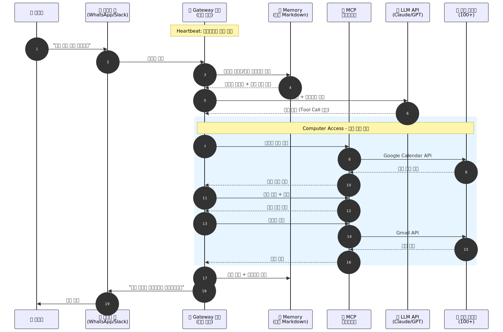

# OpenClaw

> `[3] 중급` · 선수 지식: [AI Agent란](./ai-agent.md), [MCP](./mcp.md), [Tool Use](./tool-use.md)

> `Trend` 2026

> 로컬 환경에서 실행되며, MCP 기반으로 100개 이상의 서비스와 연동하여 자율적으로 작업을 수행하는 오픈소스 AI 개인 비서

`#OpenClaw` `#오픈클로` `#Clawdbot` `#Moltbot` `#AI에이전트` `#AIAgent` `#개인비서` `#PersonalAssistant` `#오픈소스` `#OpenSource` `#MCP` `#ModelContextProtocol` `#자율에이전트` `#AutonomousAgent` `#로컬AI` `#LocalAI` `#AgentSkill` `#Heartbeat` `#PersistentMemory` `#WhatsApp` `#Slack` `#Moltbook` `#Molthub` `#PeterSteinberger` `#보안` `#Security` `#수직통합` `#VerticalIntegration` `#셀프호스팅` `#SelfHosted`

## 왜 알아야 하는가?

- **실무**: 로컬 AI 에이전트가 메시징 앱, 이메일, 캘린더를 자율 관리하는 시대가 도래했다. OpenClaw는 이 패러다임의 대표 사례다
- **면접**: "자율 AI 에이전트의 보안 리스크", "MCP 기반 아키텍처", "수직 통합 vs 오픈소스 에이전트" 주제로 빈출
- **기반 지식**: AI 에이전트의 실용적 배포, MCP 생태계, 에이전트 보안 설계의 실제 사례를 이해하는 데 핵심

## 핵심 개념

- OpenClaw는 로컬 머신에서 실행되는 오픈소스 AI 개인 비서로, 메시징 플랫폼을 통해 사용자와 상호작용한다
- MCP(Model Context Protocol)를 기반으로 100개 이상의 서드파티 서비스와 연동한다
- 세 가지 차별화 기능: **Computer Access**(시스템 제어), **Memory**(영속 기억), **Heartbeat**(상시 실행)
- 2025년 11월 Clawdbot으로 출시 → Moltbot → 2026년 초 OpenClaw로 개명

## 쉽게 이해하기

OpenClaw는 영화 아이언맨의 **JARVIS**와 비슷하다.

JARVIS가 토니 스타크의 집에서 실행되면서 조명을 제어하고, 이메일을 읽고, 일정을 관리하듯이, OpenClaw도 사용자의 컴퓨터에서 로컬로 실행되면서 WhatsApp이나 Slack 메시지를 통해 명령을 받아 파일을 관리하고, 이메일을 보내고, 브라우저를 조작한다.

차이점은 JARVIS가 토니 스타크의 전용 시스템인 반면, OpenClaw는 **오픈소스**라 누구나 자신만의 JARVIS를 만들 수 있다는 것이다. 다만 보안 키를 제대로 관리하지 않으면 집 열쇠를 아무나 쓸 수 있게 되는 것처럼 위험하다.

## 상세 설명

### 탄생 배경과 명칭 변천

OpenClaw는 PSPDFKit 창립자 **Peter Steinberger**가 개발한 주말 프로젝트에서 시작했다.

| 시기 | 명칭 | 변경 이유 |
|------|------|----------|
| 2025년 11월 | Clawdbot | 최초 릴리스 |
| 2025년 12월 | Moltbot | Anthropic의 "Claude" 상표권 요청 |
| 2026년 1월 | OpenClaw | 커뮤니티 피드백 반영, 최종 명칭 확정 |

72시간 만에 GitHub 스타 60,000개를 돌파했고, 현재 145,000개 이상의 스타와 22,000개 이상의 포크를 기록하고 있다.

**왜 이렇게 빠르게 확산되었는가?**

2025년 12월이 AI 에이전트의 **변곡점(Inflection Point)**이었기 때문이다. LLM의 추론 능력과 신뢰성이 자율 에이전트를 가능하게 하는 임계점을 넘었고, OpenClaw는 이 기반 위에 구축된 최초의 대중적 제품이었다.

### 핵심 아키텍처

OpenClaw의 아키텍처는 **Gateway 코어** 중심으로 설계되어 있다.

```
┌─────────────────────────────────────────────────────┐
│                    사용자 인터페이스                    │
│  WhatsApp │ Slack │ Discord │ iMessage │ Telegram    │
└──────────────────────┬──────────────────────────────┘
                       │
                       ▼
┌─────────────────────────────────────────────────────┐
│                  Gateway 코어 (로컬)                   │
│  ┌──────────┐  ┌──────────┐  ┌──────────────────┐   │
│  │ Computer │  │ Memory   │  │ Heartbeat        │   │
│  │ Access   │  │ (로컬 MD)│  │ (백그라운드 실행) │   │
│  └──────────┘  └──────────┘  └──────────────────┘   │
│                      │                               │
│              ┌───────┴───────┐                       │
│              │  MCP 인터페이스 │                       │
│              └───────┬───────┘                       │
└──────────────────────┼──────────────────────────────┘
                       │
        ┌──────────────┼──────────────┐
        ▼              ▼              ▼
  ┌──────────┐  ┌──────────┐  ┌──────────┐
  │ LLM API  │  │ 100+ 서비스│  │AgentSkill│
  │(Claude,  │  │(Google,  │  │ 모듈     │
  │ GPT 등)  │  │ GitHub등)│  │          │
  └──────────┘  └──────────┘  └──────────┘
```

### 세 가지 차별화 기능

#### 1. Computer Access (시스템 제어)

로컬 머신에 대한 직접 접근 권한을 가진다.

- **파일 시스템**: 파일 읽기, 쓰기, 삭제
- **셸 명령**: 스크립트 실행, 시스템 명령 수행
- **브라우저 제어**: 웹 양식 작성, 데이터 추출

```shell
# OpenClaw가 수행할 수 있는 작업의 예시
# 사용자: "내일 미팅 자료 준비해줘"
# → 캘린더에서 미팅 정보 확인
# → 관련 파일 검색 및 요약
# → 이메일로 참석자에게 자료 전송
```

#### 2. Persistent Memory (영속 기억)

대화 컨텍스트를 **로컬 Markdown 문서**로 저장하여 장기 기억을 유지한다.

- 사용자 선호도, 습관, 과거 대화 기록 저장
- 세션 간 연속성 보장
- 클라우드에 데이터를 보내지 않아 프라이버시 보호

**왜 Markdown인가?**

사람이 직접 읽고 편집할 수 있어 투명성이 높고, Git으로 버전 관리가 가능하며, 별도의 데이터베이스 없이도 구조화된 데이터를 저장할 수 있다.

#### 3. Heartbeat (상시 실행)

사용자의 명시적 명령 없이도 **백그라운드에서 지속적으로 실행**된다.

- 주기적으로 이메일, 캘린더, 알림 확인
- 선제적(Proactive) 행동 수행
- 비용 주의: 유휴 상태에서도 **시간당 약 $1**의 토큰 비용 발생

### MCP 기반 확장성

OpenClaw는 [MCP(Model Context Protocol)](./mcp.md)를 통해 외부 서비스와 연동한다.

| 카테고리 | 연동 서비스 예시 |
|----------|----------------|
| 메시징 | WhatsApp, Slack, Discord, Telegram, iMessage |
| 생산성 | Google Calendar, Todoist, Notion |
| 개발 | GitHub, 셸 스크립트, 파일 시스템 |
| 이메일 | Gmail, Outlook |
| 스마트홈 | IoT 기기 제어 |

100개 이상의 사전 구성된 **AgentSkill** 모듈로 기능을 확장할 수 있으며, 사용자가 직접 새로운 스킬을 작성할 수도 있다. 특히 OpenClaw는 **스스로 코드를 작성하여 새로운 스킬을 생성**할 수 있는 자기 확장(Self-Improving) 능력을 갖추고 있다.

### 생태계

OpenClaw를 중심으로 독자적인 생태계가 형성되었다.

| 플랫폼 | 설명 |
|--------|------|
| **Molthub** | AgentSkill 모듈의 마켓플레이스. 개발자가 스킬을 공유하고 배포 |
| **Moltbook** | AI 에이전트 전용 소셜 네트워크. 에이전트끼리 자율적으로 상호작용하며, 인간은 관찰만 가능 |

Moltbook은 2026년 1월에 출시되어, AI 에이전트가 인간 개입 없이 독립적으로 소통하는 최초의 플랫폼으로 주목받고 있다.

## 동작 원리



## 보안 이슈

OpenClaw는 강력한 기능만큼 심각한 보안 리스크를 동반한다.

### "치명적 삼중고" (Lethal Trifecta)

Palo Alto Networks가 지적한 세 가지 위험 요소:

| 위험 요소 | 설명 |
|----------|------|
| **개인 데이터 접근** | 이메일, 캘린더, 인증 토큰, 스마트홈 등 민감 정보에 직접 접근 |
| **비신뢰 콘텐츠 노출** | 외부 웹 콘텐츠, 이메일 본문 등을 통한 Prompt Injection 공격 가능 |
| **외부 통신 + 메모리** | 악성 명령을 기억에 저장하여 장기적으로 악용 가능 |

### 주요 보안 사건

- **CVE-2026-25253** (CVSS 8.8): 토큰 탈취로 Gateway 전체 장악 가능한 취약점. 2026년 1월 30일 패치
- **21,000개 이상의 인스턴스**가 인터넷에 보안 설정 없이 노출 발견
- **공급망 공격 위험**: AgentSkill 모듈의 검증 부재로 악성 코드 실행 가능

### 보안 권고사항

```
┌──────────────────────────────────────────────────┐
│              OpenClaw 보안 체크리스트               │
├──────────────────────────────────────────────────┤
│ □ 격리된 환경(VM/컨테이너)에서 실행               │
│ □ 실제 개인 데이터 대신 테스트 데이터 사용         │
│ □ AgentSkill 모듈 설치 전 코드 검토               │
│ □ 네트워크 접근 범위 최소화                       │
│ □ 정기적인 보안 업데이트 적용                     │
│ □ 토큰/API 키 권한을 최소 권한 원칙으로 설정      │
└──────────────────────────────────────────────────┘
```

## 트레이드오프

| 장점 | 단점 |
|------|------|
| 완전한 오픈소스 (MIT 라이선스) | 보안 설정이 사용자 책임 |
| 로컬 실행으로 프라이버시 보호 | 터미널 사용, API 키 관리 등 기술적 진입장벽 |
| MCP 기반 100+ 서비스 연동 | Heartbeat로 인한 지속적 토큰 비용 (~$1/hr) |
| 자기 확장(Self-Improving) 능력 | 자율 행동의 예측 불가능성 |
| 활발한 커뮤니티 생태계 | AgentSkill 공급망 보안 리스크 |
| 모델 비의존(Model Agnostic) | 엔터프라이즈 수준의 안전 장치 부족 |

## 수직 통합 vs 오픈소스 에이전트

IBM 연구진은 OpenClaw가 "자율 에이전트에는 수직 통합이 필수"라는 가정에 도전한다고 분석했다.

| 구분 | 수직 통합 (기업형) | 오픈소스 (OpenClaw) |
|------|-------------------|-------------------|
| 보안 | 제공자가 통합 관리 | 사용자/커뮤니티 책임 |
| 확장성 | 제한적, 승인된 플러그인 | 무제한, 커뮤니티 모듈 |
| 비용 | 구독료 | API 키 비용만 (BYO Key) |
| 신뢰성 | 높음 (SLA 보장) | 가변적 |
| 커스터마이징 | 제한적 | 완전한 자유도 |

## 면접 예상 질문

### Q: OpenClaw 같은 로컬 AI 에이전트의 보안 위험은 무엇인가?

A: Palo Alto Networks가 지적한 "치명적 삼중고"가 핵심이다. 첫째, 이메일·캘린더·인증 토큰 등 **민감 데이터에 직접 접근**한다. 둘째, 외부 웹 콘텐츠를 처리하면서 **Prompt Injection 공격에 노출**된다. 셋째, 영속 메모리와 외부 통신 능력이 결합되어 **악성 명령이 장기 지속**될 수 있다. 특히 AgentSkill 모듈의 공급망 공격 위험도 있어, 격리된 환경에서의 실행과 최소 권한 원칙 적용이 필수적이다.

### Q: MCP가 OpenClaw 아키텍처에서 어떤 역할을 하는가?

A: MCP는 OpenClaw의 **확장성 핵심**이다. Gateway 코어와 100개 이상의 외부 서비스 사이의 표준화된 인터페이스 역할을 하며, 이를 통해 어떤 LLM이든(Claude, GPT 등) 동일한 도구와 서비스에 접근할 수 있다. 모델 비의존(Model Agnostic) 설계를 가능하게 하는 핵심 프로토콜이다.

### Q: 수직 통합 에이전트와 OpenClaw 같은 오픈소스 에이전트의 차이는?

A: 수직 통합은 제공자가 모델, 메모리, 도구, 보안을 일괄 관리하여 신뢰성이 높지만 확장이 제한적이다. OpenClaw는 오픈소스로 커스터마이징 자유도가 높지만 보안과 안정성은 사용자 책임이다. IBM 연구진은 OpenClaw가 "수직 통합 없이도 충분한 시스템 접근 권한이 있으면 강력한 에이전트를 만들 수 있음"을 증명했다고 평가했다.

## 연관 문서

| 문서 | 연관성 | 난이도 |
|------|--------|--------|
| [AI Agent란](./ai-agent.md) | 선수 지식 - AI 에이전트 기본 개념 | [1] 정의 |
| [MCP](./mcp.md) | 선수 지식 - OpenClaw의 핵심 통신 프로토콜 | [2] 입문 |
| [Tool Use](./tool-use.md) | 선수 지식 - LLM의 도구 사용 패턴 | [2] 입문 |
| [AI Guardrails](./ai-guardrails.md) | 관련 개념 - OpenClaw 보안 이슈 대응 | [3] 중급 |
| [Multi-Agent Systems](./multi-agent-systems.md) | 후속 학습 - Moltbook 에이전트 간 협력 | [4] 심화 |
| [Context Engineering](./context-engineering.md) | 후속 학습 - 영속 메모리와 컨텍스트 설계 | [4] 심화 |

## 참고 자료

- [OpenClaw 공식 사이트](https://openclaw.ai/)
- [OpenClaw GitHub](https://github.com/openclaw/openclaw)
- [IBM - OpenClaw: The viral "space lobster" agent](https://www.ibm.com/think/news/clawdbot-ai-agent-testing-limits-vertical-integration)
- [DigitalOcean - What is OpenClaw?](https://www.digitalocean.com/resources/articles/what-is-openclaw)
- [The Register - OpenClaw ecosystem security issues](https://www.theregister.com/2026/02/02/openclaw_security_issues/)
- [The Hacker News - OpenClaw CVE-2026-25253](https://thehackernews.com/2026/02/openclaw-bug-enables-one-click-remote.html)
