# Prompt Engineering (프롬프트 엔지니어링)

> `[3] 중급` · 선수 지식: [LLM 기초](./llm.md), [AI Agent란](./ai-agent.md)

> LLM에서 원하는 결과를 얻기 위해 입력(프롬프트)을 설계하고 최적화하는 기술

`#PromptEngineering` `#프롬프트엔지니어링` `#프롬프트` `#Prompt` `#LLM` `#ChatGPT` `#Claude` `#GPT` `#FewShot` `#퓨샷` `#ZeroShot` `#제로샷` `#ChainOfThought` `#CoT` `#사고의연쇄` `#SystemPrompt` `#시스템프롬프트` `#Temperature` `#Token` `#Context` `#맥락` `#Instruction` `#지시` `#Role` `#역할` `#Output` `#출력형식` `#Hallucination` `#환각` `#Grounding`

## 왜 알아야 하는가?

같은 LLM이라도 프롬프트에 따라 결과 품질이 크게 달라집니다. 좋은 프롬프트는 더 정확하고 유용한 응답을 이끌어내며, AI 에이전트의 성능을 결정짓는 핵심 요소입니다. 프롬프트 엔지니어링은 AI 시대의 필수 스킬입니다.

## 핵심 개념

- **System Prompt**: LLM의 역할과 행동 지침 설정
- **Few-shot Learning**: 예시를 통해 원하는 형식/스타일 유도
- **Chain of Thought (CoT)**: 단계적 추론 유도
- **Output Format**: 출력 형식 명시 (JSON, 마크다운 등)

## 쉽게 이해하기

**프롬프트 엔지니어링**을 요리 레시피에 비유할 수 있습니다.

```
프롬프트 = 요리 레시피
```



## 상세 설명

### 프롬프트 구조



### Zero-shot vs Few-shot



**차이점:**

| 방식 | 장점 | 단점 |
|------|------|------|
| Zero-shot | 토큰 절약 | 형식 불일치 가능 |
| Few-shot | 정확도/일관성 높음 | 토큰 소모 많음 |

### Chain of Thought (CoT)



**효과:**
- 복잡한 추론 문제에서 정확도 향상
- 추론 과정 검증 가능
- 디버깅 용이

**CoT 트리거 문구**:
- "단계별로 생각해주세요"
- "Let's think step by step"
- "먼저 ~을 분석하고, 그 다음 ~을 고려해주세요"

### System Prompt 설계

```markdown
# 좋은 System Prompt 예시

당신은 10년 경력의 시니어 백엔드 개발자입니다.

## 역할
- 코드 리뷰를 수행합니다
- 버그를 찾고 개선점을 제안합니다
- 보안 취약점을 식별합니다

## 규칙
1. 항상 이유와 함께 설명합니다
2. 코드 예시를 포함합니다
3. 우선순위를 명시합니다 (Critical/Major/Minor)
4. 긍정적인 부분도 언급합니다

## 출력 형식
```json
{
  "summary": "전체 요약",
  "issues": [
    {
      "severity": "Critical|Major|Minor",
      "line": 숫자,
      "issue": "문제 설명",
      "suggestion": "개선 제안",
      "example": "수정 코드 예시"
    }
  ],
  "positives": ["좋은 점들"]
}
```

## 금지 사항
- 불명확한 "아마도", "어쩌면" 사용 금지
- 근거 없는 비판 금지
```

### Output Format 명시

```
프롬프트:
"다음 텍스트에서 핵심 정보를 추출해주세요.

텍스트: [긴 텍스트...]

출력 형식:
```json
{
  "title": "제목",
  "main_points": ["핵심 포인트 1", "핵심 포인트 2"],
  "entities": {
    "people": ["인물들"],
    "places": ["장소들"],
    "dates": ["날짜들"]
  },
  "summary": "한 줄 요약"
}
```
"
```

### 프롬프트 최적화 팁



### 안티 패턴과 개선

| 안티 패턴 | 문제 | 개선 |
|----------|------|------|
| "잘 해줘" | 모호함 | "3개의 구체적인 예시와 함께 설명해줘" |
| 너무 긴 지시 | 혼란 | 핵심 위주로 정리, 우선순위 명시 |
| 예시 없음 | 형식 불일치 | 원하는 출력 형태 예시 제공 |
| 부정문만 사용 | 방향성 부족 | "~하지마" 대신 "~해줘" |

### Hallucination 방지

```markdown
## 환각(Hallucination) 방지 전략

1. **Grounding (근거 제공)**
   "다음 문서만을 기반으로 답변해주세요: [문서 내용]
    문서에 없는 내용은 '정보 없음'이라고 답해주세요."

2. **불확실성 인정 유도**
   "확실하지 않은 경우 '확실하지 않습니다'라고 답하고,
    신뢰도를 1-5로 표시해주세요."

3. **출처 요청**
   "답변에 대한 근거를 인용해주세요.
    근거가 없으면 답변하지 마세요."

4. **사실 확인 지시**
   "다음 정보가 사실인지 검증하고,
    검증 불가능한 경우 명시해주세요."
```

## 트레이드오프

| 기법 | 장점 | 단점 |
|------|------|------|
| 상세한 지시 | 정확도 향상 | 토큰 비용 증가 |
| Few-shot | 일관성 향상 | 컨텍스트 소모 |
| CoT | 추론 품질 향상 | 응답 시간 증가 |
| 구조화된 출력 | 파싱 용이 | 유연성 감소 |

## 면접 예상 질문

### Q: Few-shot과 Zero-shot의 차이와 사용 시점은?

A: **Zero-shot**: 예시 없이 지시만 제공. 간단한 작업, 토큰 절약 시 사용. **Few-shot**: 2-5개 예시 제공. 복잡한 형식, 일관성 필요 시 사용. **선택 기준**: (1) 작업 복잡도 (2) 출력 형식 중요도 (3) 토큰 예산. **팁**: 예시 품질이 중요하며, 다양한 케이스 포함 권장.

### Q: Chain of Thought가 효과적인 상황은?

A: **효과적인 경우**: (1) 수학 계산, 논리 추론 (2) 여러 단계 분석 필요 (3) 복잡한 의사결정. **비효과적인 경우**: (1) 단순 사실 질문 (2) 창의적 글쓰기 (3) 빠른 응답 필요. **구현**: "단계별로 생각해주세요" 문구 추가 또는 추론 과정 예시 제공.

## 연관 문서

| 문서 | 연관성 | 난이도 |
|------|--------|--------|
| [LLM 기초](./llm.md) | 선수 지식 | [1] 기초 |
| [AI Agent란](./ai-agent.md) | 선수 지식 | [1] 기초 |
| [Tool Use](./tool-use.md) | 도구 지시 | [2] 입문 |

## 참고 자료

- [Anthropic Prompt Engineering Guide](https://docs.anthropic.com/en/docs/build-with-claude/prompt-engineering/overview)
- [OpenAI Prompt Engineering Guide](https://platform.openai.com/docs/guides/prompt-engineering)
- [Learn Prompting](https://learnprompting.org/)
