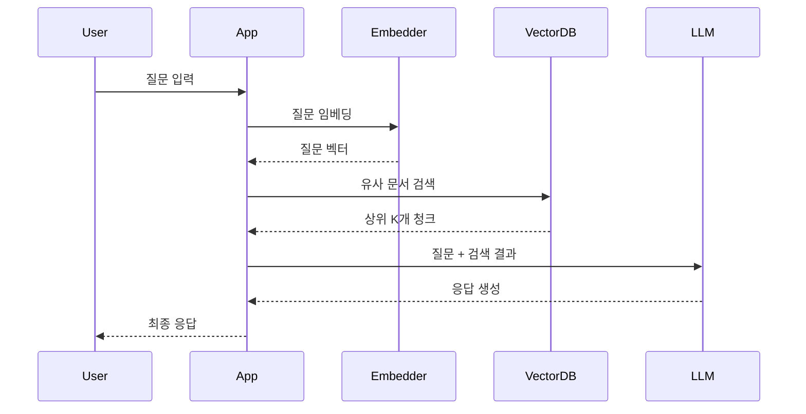

# RAG (Retrieval-Augmented Generation)

> `[3] 중급` · 선수 지식: [LLM 기초](./llm.md), [AI Agent란](./ai-agent.md)

> `Trend` 2025-2026

> 외부 지식을 검색하여 LLM의 응답을 강화하는 하이브리드 AI 아키텍처

`#RAG` `#RetrievalAugmentedGeneration` `#검색증강생성` `#벡터DB` `#VectorDatabase` `#임베딩` `#Embedding` `#시맨틱검색` `#SemanticSearch` `#청킹` `#Chunking` `#LLM` `#대규모언어모델` `#Hallucination` `#환각방지` `#Pinecone` `#Weaviate` `#Milvus` `#ChromaDB` `#FAISS` `#OpenAI` `#LangChain` `#LlamaIndex` `#HybridSearch` `#BM25` `#CosineSimilarity` `#ContextWindow` `#AgenticRAG` `#MultimodalRAG`

## 왜 알아야 하는가?

LLM은 강력하지만 **학습 데이터의 한계**와 **환각(Hallucination)** 문제가 있습니다. RAG는 이를 해결하는 핵심 기술입니다.

- **실무**: 기업 내부 문서, 최신 데이터 기반 AI 챗봇/검색 시스템 구축에 필수
- **면접**: 2025년 AI 엔지니어 면접에서 가장 자주 등장하는 주제 중 하나
- **기반 지식**: Agent, Tool Use, 벡터 DB 등 현대 AI 시스템의 기반

## 핵심 개념

- **Retrieval (검색)**: 사용자 질문과 관련된 문서를 외부 지식 베이스에서 찾음
- **Augmentation (증강)**: 검색된 문서를 LLM의 컨텍스트에 추가
- **Generation (생성)**: 증강된 컨텍스트를 기반으로 LLM이 응답 생성

## 쉽게 이해하기

**오픈북 시험**을 생각해보세요.

| 일반 LLM | RAG |
|----------|-----|
| 암기한 내용만으로 답변 | 책(외부 지식)을 참고하며 답변 |
| 모르는 건 추측 (환각) | 책에서 찾아서 정확하게 답변 |
| 최신 정보 반영 불가 | 책을 업데이트하면 최신 정보 반영 |

LLM이 학생이라면, RAG는 시험 중 참고할 수 있는 **교과서**를 제공하는 것입니다.

## 상세 설명

### RAG 파이프라인 구조

RAG는 크게 **인덱싱(Indexing)**과 **쿼리(Query)** 두 단계로 나뉩니다.



### 1단계: 인덱싱 (오프라인)

문서를 벡터 DB에 저장하는 준비 단계입니다.

```
문서 → 청킹 → 임베딩 → 벡터 DB 저장
```

**청킹(Chunking) 전략**

| 전략 | 설명 | 적합한 경우 |
|------|------|------------|
| **고정 크기** | 500자씩 분할 | 단순, 빠른 구현 |
| **시맨틱 청킹** | 의미 단위로 분할 | 품질 중시 |
| **문장/문단 기반** | 자연스러운 경계 | 문서 구조 유지 |
| **오버랩** | 청크 간 일부 중복 | 컨텍스트 손실 방지 |

**왜 청킹이 중요한가?**

- 청크가 너무 크면: 검색 정확도 저하, 불필요한 정보 포함
- 청크가 너무 작으면: 컨텍스트 손실, 의미 파편화
- 최적 크기는 도메인과 사용 사례에 따라 다름 (보통 200-1000 토큰)

### 2단계: 쿼리 (온라인)

사용자 질문에 대해 실시간으로 응답을 생성합니다.

```
질문 → 임베딩 → 유사도 검색 → 상위 K개 청크 선택 → LLM에 컨텍스트로 전달 → 응답 생성
```

### 검색 전략

| 전략 | 방식 | 장점 | 단점 |
|------|------|------|------|
| **Dense Retrieval** | 벡터 유사도 (코사인) | 의미적 유사성 포착 | 키워드 매칭 약함 |
| **Sparse Retrieval** | BM25 (키워드) | 정확한 용어 매칭 | 동의어 처리 약함 |
| **Hybrid Search** | Dense + Sparse 결합 | 두 장점 결합 | 구현 복잡성 증가 |

**왜 Hybrid Search인가?**

실무에서는 Hybrid Search가 표준입니다. 벡터 검색만으로는 특정 키워드(제품명, 코드명 등)를 정확히 찾지 못하는 경우가 많습니다.

## 동작 원리

### 기본 RAG 흐름



## RAG 아키텍처 유형

### 1. Naive RAG (기본형)

가장 단순한 형태입니다.

```
질문 → 검색 → 생성
```

- **장점**: 구현 간단, 빠른 프로토타이핑
- **단점**: 검색 품질에 크게 의존, 복잡한 질문 처리 어려움

### 2. Advanced RAG (개선형)

검색 전후에 최적화 단계를 추가합니다.

```
질문 → [쿼리 재작성] → 검색 → [리랭킹] → 생성
```

**주요 기법:**
- **Query Expansion**: 질문을 여러 변형으로 확장
- **HyDE**: 가상의 답변을 먼저 생성 후 검색
- **Re-ranking**: 검색 결과 재정렬 (Cross-encoder)

### 3. Agentic RAG (에이전트형)

AI Agent가 검색 과정을 능동적으로 제어합니다.

```
질문 → [계획] → 검색 → [검증] → 필요시 재검색 → 생성
```

**특징:**
- 검색 결과가 불충분하면 자동으로 쿼리 수정
- 여러 소스에서 정보 수집
- 신뢰도 검증 후 응답 생성

### 4. Long RAG

긴 문서를 효과적으로 처리하는 아키텍처입니다.

**기존 RAG 문제점:**
- 긴 문서를 작은 청크로 분할 → 컨텍스트 손실

**Long RAG 해결책:**
- 섹션/문서 단위로 더 긴 검색 단위 사용
- 계층적 검색 (문서 → 섹션 → 문단)

### 5. Multimodal RAG

텍스트뿐 아니라 이미지, 오디오, 비디오도 처리합니다.

| 모달리티 | 처리 방식 |
|----------|----------|
| 이미지 | CLIP, Vision Encoder로 임베딩 |
| 오디오 | Whisper로 텍스트 변환 후 처리 |
| 비디오 | 프레임 추출 + 오디오 분리 처리 |

## 예제 코드

### Python + LangChain 기본 예제

```python
from langchain.document_loaders import TextLoader
from langchain.text_splitter import RecursiveCharacterTextSplitter
from langchain.embeddings import OpenAIEmbeddings
from langchain.vectorstores import Chroma
from langchain.chat_models import ChatOpenAI
from langchain.chains import RetrievalQA

# 1. 문서 로드 및 청킹
loader = TextLoader("knowledge_base.txt")
documents = loader.load()

text_splitter = RecursiveCharacterTextSplitter(
    chunk_size=500,
    chunk_overlap=50,  # 오버랩으로 컨텍스트 유지
    separators=["\n\n", "\n", ".", " "]
)
chunks = text_splitter.split_documents(documents)

# 2. 임베딩 및 벡터 DB 저장
embeddings = OpenAIEmbeddings()
vectorstore = Chroma.from_documents(chunks, embeddings)

# 3. RAG 체인 구성
llm = ChatOpenAI(model="gpt-4")
qa_chain = RetrievalQA.from_chain_type(
    llm=llm,
    chain_type="stuff",  # 검색 결과를 그대로 컨텍스트에 추가
    retriever=vectorstore.as_retriever(search_kwargs={"k": 5})
)

# 4. 질의 응답
response = qa_chain.run("RAG의 핵심 개념은 무엇인가요?")
print(response)
```

### Hybrid Search 구현

```python
from langchain.retrievers import EnsembleRetriever
from langchain.retrievers import BM25Retriever

# BM25 (Sparse) + Vector (Dense) 결합
bm25_retriever = BM25Retriever.from_documents(chunks)
bm25_retriever.k = 5

vector_retriever = vectorstore.as_retriever(search_kwargs={"k": 5})

# 앙상블 (가중치 조절 가능)
ensemble_retriever = EnsembleRetriever(
    retrievers=[bm25_retriever, vector_retriever],
    weights=[0.4, 0.6]  # 벡터 검색에 더 높은 가중치
)
```

## 트레이드오프

| 관점 | 장점 | 단점 |
|------|------|------|
| **정확성** | 환각 감소, 사실 기반 응답 | 검색 실패 시 품질 저하 |
| **최신성** | 지식 베이스 업데이트로 최신 정보 반영 | 인덱싱 파이프라인 유지 비용 |
| **비용** | 파인튜닝보다 저렴 | 벡터 DB, 임베딩 API 비용 발생 |
| **지연시간** | - | 검색 단계 추가로 레이턴시 증가 |
| **확장성** | 지식 추가 용이 | 대규모 데이터 시 검색 최적화 필요 |

### RAG vs Fine-tuning

| 비교 항목 | RAG | Fine-tuning |
|-----------|-----|-------------|
| 지식 업데이트 | 즉시 가능 | 재학습 필요 |
| 비용 | 인프라 비용 (벡터 DB) | 학습 비용 (GPU) |
| 환각 제어 | 출처 명시 가능 | 어려움 |
| 도메인 적응 | 문서만 추가 | 데이터셋 + 학습 필요 |
| 추론 속도 | 검색으로 느림 | 빠름 |

**결론**: 대부분의 엔터프라이즈 사례에서 RAG가 기본 선택입니다. Fine-tuning은 특수한 스타일/톤이 필요하거나 지식이 고정된 경우에 고려합니다.

## 트러블슈팅

### 사례 1: 검색 결과가 관련 없음

#### 증상
사용자 질문과 전혀 관련 없는 청크가 검색됨

#### 원인 분석
- 청킹 전략 부적절 (너무 작거나 의미 단위 무시)
- 임베딩 모델이 도메인에 부적합
- 검색 k 값이 너무 낮음

#### 해결 방법
```python
# 1. 시맨틱 청킹으로 변경
from langchain.text_splitter import SemanticChunker
splitter = SemanticChunker(embeddings, breakpoint_threshold_type="percentile")

# 2. 도메인 특화 임베딩 모델 사용
from sentence_transformers import SentenceTransformer
model = SentenceTransformer('intfloat/multilingual-e5-large')

# 3. k 값 증가 + 리랭킹
retriever = vectorstore.as_retriever(search_kwargs={"k": 20})
# + Cross-encoder로 상위 5개 재정렬
```

### 사례 2: 환각이 여전히 발생

#### 증상
검색된 문서에 없는 내용을 LLM이 생성

#### 원인 분석
- 프롬프트에 "검색 결과만 사용하라"는 지시 부재
- 검색 결과가 불충분하여 LLM이 추론으로 채움

#### 해결 방법
```python
SYSTEM_PROMPT = """
당신은 제공된 컨텍스트만 사용하여 답변하는 AI입니다.
컨텍스트에 답이 없으면 "정보가 없습니다"라고 말하세요.
절대로 추측하거나 외부 지식을 사용하지 마세요.

컨텍스트:
{context}
"""
```

## 면접 예상 질문

### Q: RAG와 Fine-tuning의 차이점은 무엇이고, 언제 각각을 사용하나요?

A: RAG는 **추론 시점에 외부 지식을 검색**하여 활용하고, Fine-tuning은 **모델 가중치 자체를 업데이트**합니다.

**RAG 선택 시점:**
- 지식이 자주 업데이트됨 (뉴스, 문서)
- 출처 명시가 필요함
- 빠른 구축이 필요함

**Fine-tuning 선택 시점:**
- 특정 스타일/톤이 필요함
- 지식이 고정되어 있음
- 추론 속도가 중요함

### Q: 청킹 전략은 어떻게 결정하나요?

A: 도메인과 사용 사례에 따라 다릅니다.

1. **문서 구조가 명확할 때**: 문단/섹션 기반 청킹
2. **구조가 불분명할 때**: 시맨틱 청킹 (의미 유사도 기반)
3. **컨텍스트 손실 우려 시**: 오버랩 청킹 (10-20% 중복)
4. **일반적인 시작점**: 500-1000 토큰, 50-100 토큰 오버랩

### Q: Hybrid Search가 왜 중요한가요?

A: 벡터 검색(Dense)과 키워드 검색(Sparse)의 **상호 보완** 때문입니다.

- **벡터 검색 한계**: "GPT-4o" 같은 고유 명사 검색 실패 가능
- **키워드 검색 한계**: "비용 절감 방법"과 "예산 효율화"의 연결 불가

Hybrid Search는 두 방식을 결합하여 정확도와 재현율을 모두 높입니다.

## 연관 문서

| 문서 | 연관성 | 난이도 |
|------|--------|--------|
| [LLM 기초](./llm.md) | 선수 지식 | [1] 정의 |
| [AI Agent란](./ai-agent.md) | 선수 지식 | [1] 정의 |
| [Tool Use](./tool-use.md) | 관련 개념 (도구로서의 RAG) | [2] 입문 |
| [Prompt Engineering](./prompt-engineering.md) | RAG 프롬프트 최적화 | [3] 중급 |
| [Multi-Agent Systems](./multi-agent-systems.md) | Agentic RAG 확장 | [4] 심화 |

## 참고 자료

- [The 2025 Guide to Retrieval-Augmented Generation](https://www.edenai.co/post/the-2025-guide-to-retrieval-augmented-generation-rag)
- [RAG in 2025: Bridging Knowledge and Generative AI](https://squirro.com/squirro-blog/state-of-rag-genai)
- [Six Lessons Learned Building RAG Systems in Production](https://towardsdatascience.com/six-lessons-learned-building-rag-systems-in-production/)
- [Enhancing Retrieval-Augmented Generation: A Study of Best Practices (arXiv)](https://arxiv.org/abs/2501.07391)
- [LangChain RAG Documentation](https://python.langchain.com/docs/tutorials/rag/)
