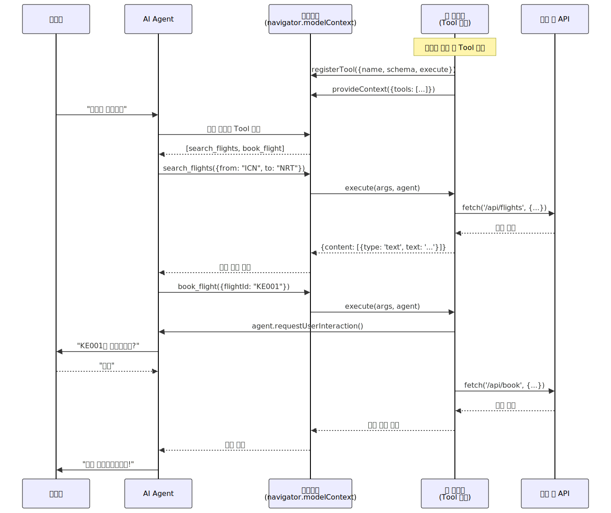

# WebMCP (Web Model Context Protocol)

> `[3] 중급` · 선수 지식: [MCP](./mcp.md), [Tool Use](./tool-use.md)

> `Trend` 2025-2026

> WebMCP는 **웹 페이지가 브라우저 내 AI 에이전트에게 구조화된 도구(Tool)를 직접 노출**하는 웹 표준이다.

`#WebMCP` `#웹MCP` `#ModelContextProtocol` `#브라우저MCP` `#BrowserMCP` `#MCP-B` `#navigatorModelContext` `#registerTool` `#provideContext` `#AgenticWeb` `#에이전틱웹` `#AIAgent` `#브라우저자동화` `#웹표준` `#Chrome` `#Google` `#Microsoft` `#W3C` `#선언적API` `#명령형API` `#JSONSchema` `#ToolDiscovery` `#HumanInTheLoop` `#클라이언트사이드` `#프론트엔드MCP` `#웹앱통합` `#스크래핑대체`

## 왜 알아야 하는가?

- **실무**: AI 에이전트를 웹 서비스에 통합할 때, 별도 서버 없이 기존 웹앱에 ~50줄의 코드만 추가하면 AI가 사이트 기능을 직접 호출할 수 있다. 인증/세션도 기존 브라우저 세션을 그대로 활용한다.
- **면접**: "기존 MCP와 WebMCP의 차이는?"이 2026년 AI 에이전트 면접 핵심 질문이다. 서버 사이드 vs 클라이언트 사이드 프로토콜의 아키텍처 차이를 설명할 수 있어야 한다.
- **기반 지식**: "에이전틱 웹(Agentic Web)" 시대의 핵심 기술이다. 웹사이트가 AI 에이전트의 도구로 작동하는 패러다임 전환을 이해하면, 향후 웹 개발의 방향성을 파악할 수 있다.

## 핵심 개념

- **WebMCP**: 웹 페이지가 MCP 서버 역할을 하여 AI 에이전트에게 도구를 노출하는 **브라우저 네이티브 프로토콜**
- **선언적 API**: HTML `<form>` 속성만으로 도구를 정의 (코드 불필요)
- **명령형 API**: JavaScript `navigator.modelContext`로 도구를 등록하고 관리
- **Human-in-the-Loop**: 사용자가 항상 가시적인 브라우저에서 AI 작업을 확인하고 승인

## 쉽게 이해하기

**레스토랑 주문**으로 비유할 수 있습니다.

**기존 MCP (전화 주문)**
- 손님(AI)이 전화로 주문하려면 전용 콜센터(MCP 서버)가 필요
- 콜센터는 별도 전화번호(API 키)와 주문 시스템(서버 인프라)을 갖춰야 함
- 손님은 메뉴를 직접 볼 수 없고, 콜센터가 대신 읽어줘야 함

**WebMCP (매장 방문 + 키오스크)**
- 손님(AI)이 직접 매장에 와서 키오스크(웹 페이지)를 사용
- 키오스크가 "이 매장에서 할 수 있는 것"을 메뉴판(Tool)으로 보여줌
- 별도 콜센터 불필요, 매장의 기존 시스템(기존 앱 로직)을 그대로 사용
- 점원(사용자)이 주문 확인 가능 → **Human-in-the-Loop**

핵심 차이: **별도 서버 없이, 웹 페이지 자체가 AI에게 "여기서 뭘 할 수 있는지" 알려준다.**

## 상세 설명

### 기존 MCP vs WebMCP 비교

| 항목 | 기존 MCP | WebMCP |
|------|----------|--------|
| **실행 환경** | 서버 사이드 (별도 프로세스) | 브라우저 내부 (클라이언트 사이드) |
| **배포** | 별도 MCP 서버 필요 | 기존 웹앱에 코드 추가 |
| **인증** | API 키, OAuth 2.1 등 별도 설정 | 기존 브라우저 세션 활용 |
| **통신** | JSON-RPC (stdio/SSE/HTTP) | JavaScript 함수 호출 |
| **속도** | 네트워크 왕복 필요 | 밀리초 단위 (로컬 실행) |
| **도구 정의** | JSON 스키마 (서버 측) | HTML 속성 또는 JavaScript |
| **사용자 가시성** | 백그라운드 동작 | 브라우저에서 실시간 확인 |
| **Headless 지원** | 지원 | 미지원 (가시적 브라우저 필수) |
| **대상 개발자** | 백엔드 개발자 | 프론트엔드/풀스택 개발자 |

**왜 WebMCP가 필요한가?**

기존 MCP는 강력하지만, 웹 서비스와 AI 에이전트를 연결하려면 별도 서버를 구축해야 했다. WebMCP는 이 문제를 해결한다:

1. **인프라 부담 제거**: MCP 서버를 별도로 운영할 필요 없이 웹앱에 코드만 추가
2. **인증 복잡도 제거**: OAuth, API 키 없이 기존 로그인 세션 활용
3. **스크래핑 대체**: AI가 화면을 캡처하고 해석하는 대신, 명시적 API로 정확하게 작업
4. **사용자 제어 보장**: 모든 AI 작업이 사용자 눈앞에서 이루어짐

### 아키텍처



### 선언적 API (Declarative API)

HTML `<form>` 요소에 속성만 추가하면 도구가 정의된다. **JavaScript 코드가 필요 없다.**

```html
<!-- 기존 HTML 폼에 tool-name, tool-description 속성만 추가 -->
<form action="/todos" method="post"
      tool-name="add-todo"
      tool-description="할 일 목록에 새 항목을 추가합니다">

  <input type="text" name="description" required
         tool-prop-description="할 일 내용 (텍스트)">

  <input type="date" name="due_date"
         tool-prop-description="마감일 (선택)">

  <button type="submit">추가</button>
</form>
```

**왜 이렇게 하는가?**

기존 HTML 폼은 이미 "사용자 입력 → 서버 처리"라는 구조를 갖고 있다. WebMCP는 이 구조를 그대로 활용하여 "AI 입력 → 서버 처리"로 확장한다. 프론트엔드 개발자는 익숙한 HTML만으로 AI 도구를 정의할 수 있다.

### 명령형 API (Imperative API)

JavaScript로 복잡한 도구를 등록하고 동적으로 관리한다.

```javascript
// navigator.modelContext API를 통해 도구 등록
navigator.modelContext.registerTool({
  name: 'search_flights',
  description: '출발지와 도착지로 항공편을 검색합니다',
  inputSchema: {
    type: 'object',
    properties: {
      from: { type: 'string', description: '출발 공항 코드 (예: ICN)' },
      to: { type: 'string', description: '도착 공항 코드 (예: NRT)' },
      date: { type: 'string', description: '출발 날짜 (YYYY-MM-DD)' }
    },
    required: ['from', 'to', 'date']
  },
  async execute(args, agent) {
    // 기존 앱의 API를 그대로 호출 (인증은 브라우저 세션 사용)
    const response = await fetch('/api/flights/search', {
      method: 'POST',
      headers: { 'Content-Type': 'application/json' },
      body: JSON.stringify(args)
    });
    const flights = await response.json();

    return {
      content: [{
        type: 'text',
        text: JSON.stringify(flights)
      }]
    };
  }
});
```

**provideContext()로 한 번에 등록**

```javascript
// 여러 도구를 한 번에 등록 (이전 등록 초기화)
navigator.modelContext.provideContext({
  tools: [
    {
      name: 'get_cart',
      description: '현재 장바구니 내용을 조회합니다',
      inputSchema: { type: 'object', properties: {} },
      async execute() {
        const cart = await fetch('/api/cart').then(r => r.json());
        return { content: [{ type: 'text', text: JSON.stringify(cart) }] };
      }
    },
    {
      name: 'add_to_cart',
      description: '상품을 장바구니에 추가합니다',
      inputSchema: {
        type: 'object',
        properties: {
          productId: { type: 'string', description: '상품 ID' },
          quantity: { type: 'number', description: '수량' }
        },
        required: ['productId', 'quantity']
      },
      async execute(args) {
        const result = await fetch('/api/cart/add', {
          method: 'POST',
          headers: { 'Content-Type': 'application/json' },
          body: JSON.stringify(args)
        }).then(r => r.json());
        return { content: [{ type: 'text', text: JSON.stringify(result) }] };
      }
    }
  ]
});
```

### React에서 사용하기

```typescript
import { useWebMCP } from '@mcp-b/react-webmcp';
import { z } from 'zod';

function InvoiceApp() {
  useWebMCP({
    name: 'create_invoice',
    description: '새 인보이스를 생성합니다',
    inputSchema: {
      customerEmail: z.string().email().describe('고객 이메일'),
      items: z.array(z.object({
        name: z.string().describe('상품명'),
        price: z.number().describe('가격'),
        quantity: z.number().describe('수량')
      })).describe('인보이스 항목')
    },
    handler: async ({ customerEmail, items }) => {
      const response = await fetch('/api/invoices', {
        method: 'POST',
        headers: { 'Content-Type': 'application/json' },
        body: JSON.stringify({ customerEmail, items })
      });
      return await response.json();
    }
  });

  return <div>인보이스 관리 시스템</div>;
}
```

### Human-in-the-Loop (사용자 확인 요청)

WebMCP의 핵심 설계 원칙 중 하나는 **사용자가 항상 제어권을 갖는 것**이다.

```javascript
navigator.modelContext.registerTool({
  name: 'book_flight',
  description: '항공편을 예약합니다 (결제 포함)',
  inputSchema: {
    type: 'object',
    properties: {
      flightId: { type: 'string', description: '항공편 ID' },
      passengers: { type: 'number', description: '승객 수' }
    },
    required: ['flightId']
  },
  async execute(args, agent) {
    // 결제 전 사용자 확인 요청
    await agent.requestUserInteraction();
    // → 브라우저가 사용자에게 확인 다이얼로그 표시
    // → 사용자가 승인해야 다음 코드가 실행됨

    const result = await fetch('/api/book', {
      method: 'POST',
      body: JSON.stringify(args)
    }).then(r => r.json());

    return { content: [{ type: 'text', text: `예약 완료: ${result.bookingId}` }] };
  }
});
```

## 동작 원리



### 3단계 동작 과정

**1단계: Discovery (도구 발견)**
- 웹 페이지가 로드될 때 `registerTool()` 또는 HTML 속성으로 도구 등록
- AI 에이전트가 `navigator.modelContext`를 통해 사용 가능한 도구 목록 조회
- JSON Schema로 각 도구의 입/출력 명세를 제공

**2단계: Invocation (도구 호출)**
- AI 에이전트가 적절한 도구를 선택하고 파라미터와 함께 호출
- 브라우저가 중개자 역할로 `execute()` 함수 실행
- 기존 앱 로직(API 호출, DOM 조작 등)이 수행됨

**3단계: Response (결과 반환)**
- 도구 실행 결과가 MCP 콘텐츠 형식으로 반환
- AI 에이전트가 결과를 해석하여 사용자에게 응답
- 필요 시 `requestUserInteraction()`으로 사용자 확인 후 진행

### MCP-B 확장과의 관계

**MCP-B**(Model Context Protocol for the Browser)는 WebMCP의 오픈소스 구현체이다.

```
┌──────────────────┐    ┌─────────────────┐    ┌──────────────┐
│  MCP Client      │    │  MCP-B 확장     │    │  웹 페이지    │
│  (Claude Desktop │◄──►│  (Chrome 확장)   │◄──►│  (Tab MCP    │
│   Cursor IDE)    │    │  도구 집계/라우팅│    │   Server)    │
└──────────────────┘    └─────────────────┘    └──────────────┘
```

- **Tab MCP Server**: 웹 페이지 내 JavaScript로 구현, 기존 API를 래핑
- **MCP-B 확장**: 모든 탭의 도구를 집계하고 외부 MCP 클라이언트에 라우팅
- **MCP Client**: Claude Desktop, Cursor IDE 등 기존 MCP 클라이언트와 호환

## 활용 시나리오

### 전자상거래

```javascript
// 상품 검색, 장바구니, 결제까지 AI가 지원
navigator.modelContext.provideContext({
  tools: [
    { name: 'search_products', description: '상품 검색', /* ... */ },
    { name: 'add_to_cart', description: '장바구니 추가', /* ... */ },
    { name: 'checkout', description: '결제 진행', /* ... */ }
  ]
});
// AI: "빨간 원피스 검색해줘" → search_products 호출
// AI: "장바구니에 담아줘" → add_to_cart 호출
// AI: "결제해줘" → checkout 호출 (requestUserInteraction으로 확인)
```

### 개발자 포털

```javascript
// 코드 리뷰 자동화
navigator.modelContext.registerTool({
  name: 'get_try_run_failures',
  description: 'CI/CD 파이프라인의 실패한 테스트 결과를 조회합니다',
  inputSchema: {
    type: 'object',
    properties: {
      prNumber: { type: 'number', description: 'PR 번호' }
    }
  },
  async execute({ prNumber }) {
    const failures = await fetch(`/api/pr/${prNumber}/failures`).then(r => r.json());
    return { content: [{ type: 'text', text: JSON.stringify(failures) }] };
  }
});
```

### 의료/법률 (정밀한 필드 입력)

```html
<!-- 선언적 API로 서류 제출 자동화 -->
<form action="/api/application" method="post"
      tool-name="submit_application"
      tool-description="보험 청구서를 제출합니다">

  <input type="text" name="patient_name" required
         tool-prop-description="환자 이름">

  <input type="text" name="diagnosis_code" required
         tool-prop-description="진단 코드 (ICD-10)">

  <input type="number" name="amount" required
         tool-prop-description="청구 금액 (원)">

  <button type="submit">제출</button>
</form>
```

## 트레이드오프

| 장점 | 단점 |
|------|------|
| 별도 서버 인프라 불필요 | Headless 환경 미지원 (가시적 브라우저 필수) |
| 기존 브라우저 세션/인증 재사용 | 아직 초기 프리뷰 단계 (Chrome 146+) |
| 밀리초 단위 실행 속도 | 도구 발견을 위해 사이트를 직접 방문해야 함 |
| HTML 속성만으로 도구 정의 가능 | 복잡한 UI는 상당한 리팩토링 필요 |
| Human-in-the-Loop 보장 | 완전 자율 에이전트에는 부적합 |
| 기존 프론트엔드 코드 재사용 | 생태계가 아직 형성 중 |

## 현재 상태와 지원 범위

| 항목 | 상태 |
|------|------|
| **Chrome 지원** | Chrome 146+ (플래그 활성화 필요) |
| **표준화** | Google + Microsoft 공동 제안 (2025년 8월) |
| **W3C** | Web Machine Learning CG에서 논의 중 |
| **MCP-B 확장** | Chrome Web Store 공개 |
| **프레임워크** | React, Angular, Rails, Phoenix LiveView 지원 |
| **라이선스** | GNU GPLv3 (오픈소스) |

## 면접 예상 질문

### Q: 기존 MCP와 WebMCP의 핵심 차이는 무엇인가요?

A: 기존 MCP는 **서버 사이드 프로토콜**로 별도 MCP 서버를 운영하고 API 키로 인증해야 한다. JSON-RPC로 통신하며 백엔드 개발자가 주로 구현한다. 반면 WebMCP는 **브라우저 네이티브 프로토콜**로 웹 페이지 자체가 MCP 서버 역할을 한다. 별도 서버가 필요 없고, 기존 브라우저 세션을 인증에 활용하며, HTML 속성이나 JavaScript로 프론트엔드 개발자가 구현한다. 두 프로토콜은 대체 관계가 아니라 **보완 관계**로, 서버 사이드 통합에는 MCP, 브라우저 기반 상호작용에는 WebMCP를 사용한다.

### Q: WebMCP에서 Human-in-the-Loop는 어떻게 구현되나요?

A: WebMCP의 `execute()` 함수에서 `agent.requestUserInteraction()`을 호출하면 브라우저가 사용자에게 확인 다이얼로그를 표시한다. 사용자가 승인해야만 이후 코드가 실행되므로, 결제나 삭제 같은 위험한 작업에서 사용자 제어권을 보장한다. 이는 WebMCP의 설계 목표 중 하나인 "완전 자율 에이전트가 아닌, 사용자와 에이전트가 협업하는 워크플로우"를 구현하는 핵심 메커니즘이다.

### Q: 선언적 API와 명령형 API는 언제 각각 사용하나요?

A: **선언적 API**는 기존 HTML `<form>`에 `tool-name`, `tool-description` 속성만 추가하면 되므로, 표준 폼 제출(할 일 추가, 검색 등) 같은 단순한 작업에 적합하다. JavaScript가 필요 없어 진입 장벽이 낮다. **명령형 API**는 `navigator.modelContext.registerTool()`로 복잡한 비즈니스 로직, 동적 도구 등록/해제, 조건부 로직이 필요한 경우에 사용한다. SPA(Single Page Application)에서 페이지 상태에 따라 도구를 동적으로 변경해야 할 때 적합하다.

## 연관 문서

| 문서 | 연관성 | 난이도 |
|------|--------|--------|
| [MCP](./mcp.md) | 선수 지식 - 서버 사이드 MCP 프로토콜 | [2] 입문 |
| [Tool Use](./tool-use.md) | 선수 지식 - LLM 도구 사용 패턴 | [2] 입문 |
| [A2A Protocol](./a2a-protocol.md) | 관련 개념 - 에이전트 간 통신 프로토콜 | [3] 중급 |
| [AI Agent란](./ai-agent.md) | 기반 지식 - AI 에이전트 기초 | [1] 정의 |
| [Context Engineering](./context-engineering.md) | 심화 학습 - 컨텍스트 설계 | [4] 심화 |

## 참고 자료

- [Chrome Blog - WebMCP Early Preview](https://developer.chrome.com/blog/webmcp-epp)
- [WebMCP GitHub (W3C Web Machine Learning CG)](https://github.com/webmachinelearning/webmcp)
- [WebMCP Proposal](https://github.com/webmachinelearning/webmcp/blob/main/docs/proposal.md)
- [MCP-B 공식 사이트](https://mcp-b.ai/)
- [MCP-B Examples](https://github.com/WebMCP-org/examples)
- [GeekNews - WebMCP 소개](https://news.hada.io/topic?id=26597)
