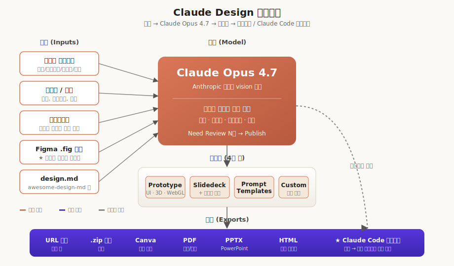
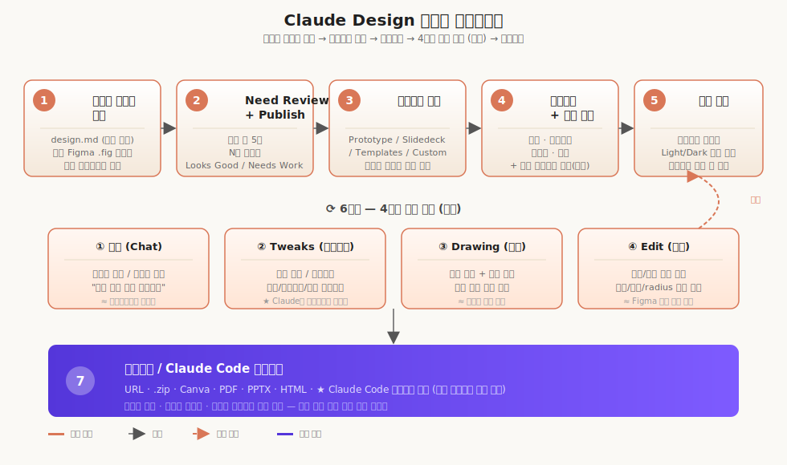

# Claude Design 활용 가이드

> `[2] 활용` · 선수 지식: [Claude (LLM) 기본](../../ai-agent/README.md), 디자인 시스템 개념(권장)

> 한 줄 정의: Anthropic Labs가 2026-04-17 출시한 **대화형 디자인 협업 도구**로, Claude Opus 4.7 기반에서 디자인 시스템·프로토타입·슬라이드를 만들고 Claude Code로 핸드오프할 수 있다.

`#클로드디자인` `#ClaudeDesign` `#Anthropic` `#AnthropicLabs` `#JennyWen` `#제니웬` `#디자인시스템` `#DesignSystem` `#ClaudeOpus47` `#Figma` `#피그마임포트` `#FigmaImport` `#CarbonDesignSystem` `#카본디자인시스템` `#Prototype` `#프로토타입` `#Slidedeck` `#슬라이드덱` `#Tweaks` `#트윅스` `#Drawing` `#ResearchPreview` `#ClaudeCode` `#Handoff` `#핸드오프` `#디자인패러다임` `#AI디자인툴` `#AIDesignTool` `#Canva` `#PDF` `#PPTX`

---

## 왜 알아야 하는가?

### 실무 관점

- **디자인 시스템 구축이 5분으로**: 기존에는 디자이너 + 개발자가 수 주~수 개월 걸리던 토큰/컴포넌트 정의 작업이, design.md 파일 또는 Figma `.fig` 파일 1개 업로드로 자동 생성된다.
- **빠른 검증 사이클**: 와이어프레임 → 하이파이 목업 → 인터랙티브 프로토타입을 한 도구에서 진행하므로 "리서치 → 발산 → 수렴" 단계를 짧게 순환시킬 수 있다.
- **Claude Code 연계**: 디자인이 확정되면 핸드오프 번들을 Claude Code로 한 번에 전달하여 코드 구현으로 직결할 수 있다.

### 면접 관점

- "AI 디자인 도구가 디자이너의 역할을 어떻게 바꾸는가"는 2026년 IT 업계의 단골 토픽이다.
- Figma 주가가 발표 당일 **−7%** 하락한 사건은 디자인 SW 시장 재편을 보여주는 사례로 자주 인용된다.

### 기반 지식 관점

- 멀티모달 LLM(텍스트+이미지+코드)의 실무 적용 사례.
- "디자인 시스템(토큰·컴포넌트 라이브러리)"이라는 개념을 실제 도구로 체험하며 이해할 수 있다.

---

## 핵심 개념

### Claude Design이란?

Anthropic Labs(Anthropic의 실험 제품 브랜드)가 2026-04-17 발표한 **대화형 디자인 협업 도구**다. 좌측 채팅 패널에 무엇을 만들지 설명하면, 우측 캔버스에 결과가 실시간으로 그려지고 자연어 + 인라인 코멘트 + 슬라이더로 다듬는 식이다.

| 항목 | 값 |
|------|-----|
| 출시일 | 2026-04-17 |
| 분류 | Research Preview (Anthropic Labs) |
| 기반 모델 | **Claude Opus 4.7** (Anthropic 최상위 vision 모델) |
| 대상 플랜 | Pro, Max, Team, Enterprise |
| 지원 환경 | **웹 브라우저 전용** (데스크탑 앱 미지원) |
| 4개 탭 | Prototype / Slidedeck / Prompt Templates / 새 유형 |

### 탄생 배경 — "We trust the process. Dead."

Anthropic Claude Design 디렉터 **Jenny Wen**(전 Figma FigJam 디자인 디렉터)이 출시 약 한 달 전 컨퍼런스에서 다음과 같이 말한 것이 영상 인트로에 인용된다:

> "디자이너들이 배워온 그 디자인 프로세스 — 리서치 후 발산·수렴을 반복하는 그 사이클을 우리는 복음처럼 신봉했다. 그 프로세스는 죽었다(dead)."
> — Jenny Wen (자막 00:00~00:18 인용)

엔지니어가 7개의 Claude를 동시에 돌려 코드를 찍어내는 시대에, 디자이너만 몇 달짜리 사이클을 도는 것은 비현실적이다. 따라서 **빠르게 만들고 즉시 검증한다**가 새 패러다임이다. Claude Design은 이 흐름의 Anthropic식 답변이다.

### 시장 영향

발표 당일 디자인 SW 업계 주가가 동반 하락했다(영상 00:58~01:12 인용):

| 종목 | 변동 |
|------|------|
| Figma | -7% |
| Adobe | 동반 하락 |
| Wix | 동반 하락 |

> 이는 Claude Design의 기능이 **기존 디자인 SW의 핵심 워크플로우(디자인 시스템·프로토타입·슬라이드)를 한 번에 대체할 수 있다**고 시장이 평가했음을 의미한다.

---

## 쉽게 이해하기

> Claude Design은 **"브랜드 가이드라인을 말로 설명하면 그 브랜드의 디자인 키트를 5분 안에 짜주는 시니어 디자이너"** 와 같다.
>
> 평소에는 "Spotify처럼 다크 + 강렬한 초록 액센트로 슬라이드 10장 만들어줘"라고 시키면 5분 만에 결과가 나온다.
>
> 마음에 안 드는 부분은 **세 가지 손가락**으로 고친다:
> - **말로**: "여기 패딩 좀 키워줘" (인라인 코멘트)
> - **그림으로**: 캔버스 위 영역을 그리며 "이 안에 텍스트 다 들어가게 해줘" (Drawing)
> - **다이얼로**: Claude가 만들어준 슬라이더로 "쉐이더 강도", "액센트 컬러"를 실시간 조절 (Tweaks)
>
> 마지막엔 디자인 파일을 가방(번들)에 싸서 옆 부서(Claude Code)에 던져 주면 그쪽에서 코드로 만들어 준다.

---

## 아키텍처



**입력**: 텍스트 프롬프트 / 이미지·문서 / 코드베이스 / Figma `.fig` 파일 / 웹 캡처
**처리**: Claude Opus 4.7 (디자인 시스템 학습 + 캔버스 렌더링)
**출력**: 캔버스 → URL 공유 / 폴더(.zip) / Canva / PDF / PPTX / standalone HTML / **Claude Code 핸드오프 번들**

---

## 시작하기

### 1. 접근

웹 브라우저로 Claude에 로그인 → 좌측 사이드바의 **Design** 메뉴 클릭. 데스크탑 앱은 미지원이다.

### 2. 4개 탭 선택

| 탭 | 용도 |
|----|------|
| **Prototype** | 인터랙티브 UI 프로토타입 |
| **Slidedeck** | 발표용 슬라이드 + 발표자 노트 |
| **Prompt Templates** | 카드 뉴스 등 템플릿 기반 빠른 시작 |
| **새 유형(Custom)** | 위 카테고리에 해당하지 않는 자유 결과물 |

### 3. 첫 프롬프트 작성

효과적인 프롬프트는 4요소를 포함한다 (Anthropic 공식 가이드):

| 요소 | 예시 |
|------|------|
| 목표 (무엇을) | "월별 매출 대시보드를 만들고 싶다" |
| 레이아웃 (배치) | "상단에 KPI 카드 4개, 하단에 라인차트" |
| 콘텐츠 (정보) | "필터: 기간/제품군/지역" |
| 대상 (사용자) | "운영팀이 매주 확인하는 용도" |

---

## 핵심 워크플로우



### 디자인 시스템 만들기 (★ 가장 강력한 기능)

영상 발표자는 **"디자인 시스템 자동 생성"이 Claude Design의 진짜 핵심**이라고 강조한다 (자막 14:09 인용).

#### 방법 A — design.md 파일로 (Spotify 사례)

1. **Design Systems** 탭 → **Create New Design System** → **Create**
2. **Company Name** 입력 (예: "Spotify Design System")
3. **GitHub Link** 또는 **노트 필드**에 design.md 내용 붙여넣기
   - 추천 레포: [awesome-design-md](https://github.com/) — Apple, BMW, IBM, Coinbase, Spotify 등 글로벌 브랜드의 design.md 모음
   - 외부 GitHub URL은 접근 실패 케이스가 있으므로 **노트 필드 직접 붙여넣기**가 더 안정적
4. **에셋 추가**: 로고 파일 / 앱 화면 스크린샷 등을 함께 업로드
5. **Continue → Generate** (약 **5분 소요**)
6. **Need Review** 항목들이 카드로 표시됨 (Spotify 사례에서는 **18개 항목**)
   - 각 항목별로 **Looks Good** / **Needs Work** 선택
   - Needs Work 시 수정 방향을 프롬프트로 추가 입력
7. **Publish 토글** 활성화 → 디자인 시스템 발행
8. **Default 토글**: 새 프로젝트 기본값으로 설정 여부

#### 방법 B — Figma 파일로 (★ 발표자 강력 추천)

영상에서 **"이게 가장 핵심적인 기능"**이라고 평가한 워크플로우다 (자막 14:09).

1. **Figma Community**에서 잘 만들어진 디자인 시스템 검색 (예: "Carbon Design System" — IBM 오픈소스)
2. 해당 Figma 파일에서 **메뉴 → 파일 → 로컬 복사본 저장** → `.fig` 파일 다운로드
3. Claude Design → **Design Systems** 탭 → **Create**
4. Company Name 입력 후 **Figma 파일 업로드**
5. **Generate** → Need Review → Publish

> Figma Community에는 **이미 글로벌 대기업의 고품질 디자인 시스템이 공개**되어 있다. 디자인 가이드를 직접 만들 필요 없이 임포트만 해도 즉시 사용 가능하다.

#### 결과 확인

- **UI Kit**: 컬러/타이포그래피/간격/컴포넌트가 시각화된 키트
- **Design Files** 탭: SVG, 아이콘 HTML, UI 키트 파일이 폴더로 저장됨

### 슬라이드덱 만들기 (Spotify 디자인 시스템 활용 예시)

1. **Slidedeck** 메뉴 → 프로젝트명 입력 (예: "Spotify Slides")
2. 디자인 시스템이 자동 적용됨을 확인 (Spotify Green이 미리 설정됨)
3. **Speaker Notes** 옵션 활성화 (텍스트는 슬라이드에 적게, 발표자 노트는 별도 관리)
4. **모델 선택**: Opus 4.7 (기본값)
5. 입력창에 **자료 + 작성 지시**:
   ```
   [영상/문서 스크립트 본문]
   이 스크립트로 발표할 PPT 슬라이드를 만들어줘
   ```
6. 결과: 10장 + 발표자 노트 자동 생성

### 슬라이드 고급화 (애니메이션 추가)

이미 만들어진 슬라이드에 추가 프롬프트로 한 단계 발전시킬 수 있다 (자막 10:18~11:46 시연):

```
전체적인 내용은 유지하되 아래 가이드에 따라 애니메이션 슬라이드로 개선해 줘.

- 배경: WebGL 쉐이더 사용
- 폰트: {지정}
- 컬러: 화이트 + 액센트 1색 (텍스트 가독성 유지)
- 그래픽: 슬라이드별 맥락에 맞는 추상 도형 / 상징적 그래픽
- 애니메이션: JSX 애니메이션 컴포넌트 사용
```

결과로 **타임라인 플레이 버튼**이 생기고, 쉐이더 연기 효과·텍스트 스트리밍 애니메이션·반투명 UI가 포함된 결과물이 나온다.

---

## 4가지 수정 수단

Claude Design은 결과물을 4가지 방식으로 수정할 수 있다.

### 1. 채팅 (Inline Comments)

광범위한 변경에 사용한다.

```
"이 버튼의 패딩을 좀 더 크게"
"전체 컬러 톤을 따뜻하게"
```

### 2. Tweaks (커스텀 슬라이더 — Claude가 만들어줌)

영상 시연 (자막 11:54~13:05):

1. 캔버스 도구의 **Tweaks** 클릭 → 패널 표시
2. 원하는 조절 옵션을 프롬프트로 설명 (예: "적절한 수정 옵션을 만들어줘")
3. Claude가 **컬러 / 지속 시간 / 강도** 같은 슬라이더를 자동 생성
4. 우측 상단의 **Tweaks 토글** 활성화 → 우측 하단 패널에서 실시간 조작

> Claude가 슬라이더 자체를 디자인해서 만들어준다는 점이 다른 도구와 차별화되는 지점이다.

### 3. Drawing (영역 마킹)

부분 영역에 대한 섬세한 수정에 사용한다 (자막 12:50~13:08):

1. 캔버스 위 원하는 영역을 직접 드로잉(마킹)
2. 수정 요청 입력 (예: "박스 안에 텍스트가 다 들어가도록")
3. 같은 패턴이 적용된 다른 요소까지 함께 수정해 준다 (1개 요청 → 3개 동시 반영 사례)

### 4. Edit (요소 직접 편집)

특정 요소를 선택해 폰트·사이즈·웨이트·컬러·얼라인·패딩·radius를 직접 조정한다.

### 비교

| 수단 | 적합한 경우 | 디자인 도구 비유 |
|------|------------|-------------------|
| 채팅 | 광범위/모호한 변경 | "디자이너에게 메시지 보내기" |
| Tweaks | 동일 디자인을 다양한 변형으로 미세조정 | "Figma Variants + 슬라이더 패널 자동 생성" |
| Drawing | 영역 단위 부분 수정 | "포토샵 선택 영역 + 코멘트" |
| Edit | 픽셀 단위 정확한 속성 변경 | "Figma 우측 속성 패널" |

---

## Presentation Mode

슬라이드 발표 시 유용한 모드 (자막 13:32~13:53):

1. 우측 상단 **Present** 클릭 → **In Steps** 선택 → 발표 모드 전환
2. 슬라이드 전체 화면 + **별도 발표자 노트** 패널 동시 표시

---

## Figma 디자인 시스템 → 앱 키스크린 (★ 핵심 시나리오)

영상에서 가장 인상적이라 평가한 시나리오. Figma Community의 IBM **Carbon Design System**으로 Threads 클론 앱을 만든 사례 (자막 13:32~17:42).

### 절차

1. Figma Community에서 Carbon Design System 검색 → `.fig` 다운로드
2. Claude Design → Design Systems → 새 시스템 생성 + `.fig` 업로드
3. Generate → Need Review → Publish
4. **New Design Using This System** 버튼 클릭
5. **Prototype** 메뉴 → 프로토타입명 입력
6. Carbon Design System 선택 + **Hi-Fidelity** 모드 선택
7. 프롬프트: "쓰레드 같은 글 위주 SNS의 주요 키스크린을 만들어줘"
8. **선택지 질문(Clarifying Questions)** 표시 → 컨텍스트 부족분에 대한 선택형 질문
   - 발표자는 "Carbon Design System 규칙을 엄격하게 따르도록" 선택
9. 결과:
   - **Home Feed / Thread Detail / Composer / Profile / Discovery** 등 **5개 키스크린**
   - **Light Mode + Dark Mode** 두 버전 동시 생성
   - "엔터프라이즈 쓰레드 플랫폼" 컨셉으로 일관성 있게 구성

### 핵심 학습

- 디자인 시스템 1개 구축 → AI가 알아서 조합 → 키스크린 자동 디자인까지 위임 가능
- "Carbon 규칙을 엄격하게 따르도록" 같은 **선택지 응답**이 결과 품질에 큰 영향을 준다
- 더미 데이터 보강 요청 시 **이미지도 자동 생성**되어 채워진다

---

## 익스포트 / Claude Code 핸드오프

| 형식 | 용도 |
|------|------|
| 조직 내 URL | 사내 공유 (뷰 / 편집 권한 제어) |
| 폴더(.zip) | 로컬 백업 / 자산 추출 |
| Canva | 추가 편집 |
| PDF | 인쇄·외부 공유 |
| PPTX | PowerPoint 작업 연계 |
| Standalone HTML | 정적 호스팅 |
| **Claude Code 핸드오프 번들** | **단일 명령어로 코드 구현 직결** |

> Claude Code 핸드오프는 디자인 의도·디자인 시스템·자산을 묶어 한 번에 전달하므로, 별도의 "디자인 → 개발 스펙 작성" 단계가 불필요하다.

---

## 비용 고려사항 (실측 사례)

영상 발표자가 **테스트 + 시연 과정에서 약 47달러**가 추가 청구되었다고 보고한다 (자막 19:11). Pro/Max 플랜 기본 토큰 외 추가 사용량이 별도 과금되는 구조로 추정되므로, 업무 도입 시 다음을 고려한다:

| 절약 패턴 | 권장 |
|----------|------|
| 디자인 시스템은 **한 번만 잘 구축** | Need Review를 꼼꼼히 거쳐 재생성 횟수 최소화 |
| **Tweaks 슬라이더**로 변형 | 매번 재생성하지 않고 슬라이더로 즉시 변화 |
| **Hi-Fidelity** 단계는 컨셉 확정 후 | Wireframe으로 컨셉 확정 → Hi-Fi 1회 생성 |
| 모델 선택 | 콘셉트 단계에서는 Sonnet 등 하위 모델 시도 (가능 시) |

---

## 알려진 한계 (공식 도움말 기준)

| 한계 | 설명 | 우회 |
|------|------|------|
| 인라인 코멘트 간헐적 소실 | 코멘트가 일시적으로 사라지는 경우 | 채팅으로 동일 요청 재전달 |
| 컴팩트 뷰 저장 오류 | 컴팩트 뷰에서 저장 실패 발생 가능 | 일반 뷰로 전환 후 저장 |
| 대규모 코드베이스 연결 시 지연 | 디자인 시스템 자동 학습 시 시간 증가 | 핵심 모듈만 선택 업로드 |
| 외부 GitHub URL 접근 실패 | 영상 시연에서 발생 | design.md 내용을 노트 필드에 직접 붙여넣기 |

> 자세한 사용 팁과 한계는 [tips-and-limitations.md](./tips-and-limitations.md) 참조.

---

## 영상 19분 요약

전체 자막 분석을 정리한 챕터별 요약은 [video-summary.md](./video-summary.md) 참조.

---

## 면접 예상 질문

### Q1. Claude Design은 기존 Figma와 어떻게 다른가?

- Figma는 **사람이 직접 도구로 그리는** 디자인 SW다.
- Claude Design은 **자연어 + 디자인 시스템 + AI 모델**의 조합으로, 디자인 시스템만 정의되면 결과물(슬라이드/프로토타입/UI)을 자동 생성한다.
- 발표 당일 Figma 주가가 **−7%** 하락한 사실은 시장이 일정 수준의 기능 대체 가능성을 인정했음을 의미한다.

### Q2. "Trust the process is dead"라는 말의 맥락은?

- Anthropic Claude Design 디렉터(전 Figma FigJam 디렉터) Jenny Wen의 발언으로, **리서치 → 발산 → 수렴** 사이클을 복음처럼 따르던 기존 디자인 프로세스가 AI 시대에 더 이상 유효하지 않다는 의미다.
- 엔지니어가 7개의 Claude를 동시에 돌리는 시대에 디자인만 몇 달짜리 사이클을 도는 것은 비현실적이라는 진단.

### Q3. Claude Design의 가장 강력한 기능은?

- **Figma Community 디자인 시스템 임포트 → 키스크린 자동 디자인**.
- 이미 공개된 Carbon, Material 같은 고품질 디자인 시스템을 그대로 임포트해 즉시 자기 앱의 베이스로 사용 가능하다.
- 영상 발표자가 "이게 가장 핵심"이라고 명시 (자막 14:09).

### Q4. Tweaks는 다른 슬라이더 도구와 어떻게 다른가?

- 일반 슬라이더는 **고정된 속성(투명도, 회전 등)** 을 조정한다.
- Claude Design의 Tweaks는 **Claude가 컨텍스트에 맞춰 슬라이더 자체를 디자인**한다(컬러/지속 시간/강도 등이 디자인 의도에 따라 자동 정의됨).

### Q5. 디자인을 코드로 어떻게 연결하는가?

- **Claude Code 핸드오프 번들**을 통해 한 번의 명령으로 전달된다.
- 디자인 의도·디자인 시스템·자산이 모두 패키징되므로 별도의 "개발 스펙 문서" 작성 단계가 불필요하다.

---

## 연관 문서

| 관계 | 문서 | 설명 |
|------|------|------|
| 보조 (영상 요약) | [video-summary.md](./video-summary.md) | YouTube 19분 영상 챕터별 한국어 요약 |
| 보조 (실전 팁) | [tips-and-limitations.md](./tips-and-limitations.md) | 효과적 프롬프트, 4가지 수정 수단 비교, 한계 우회 |
| 관련 (Claude Code) | [Codex Plugin for Claude Code](../../tool/codex-plugin-claude-code.md) | Claude Code 내 Codex 플러그인 (핸드오프 후 연계) |
| 관련 (Claude Code 도구) | [Claude HUD](../../tool/claude-hud-setup.md) · [Claude Code StatusLine](../../tool/claude-code-statusline.md) | Claude Code 환경 설정 |
| 관련 (NotebookLM) | [Google NotebookLM](../../tool/google-notebooklm.md) | 다른 AI 결과물 생성 도구 비교 |

---

## 참고 자료

- [Anthropic — Introducing Claude Design by Anthropic Labs](https://www.anthropic.com/news/claude-design-anthropic-labs) — 공식 발표 글
- [Claude Help Center — Get started with Claude Design](https://support.claude.com/en/articles/14604416-get-started-with-claude-design) — 공식 시작 가이드
- [YouTube — 디자인 프로세스를 부숴버린 클로드 디자인 19분 만에 완벽파악?](https://www.youtube.com/watch?v=NnIuDXt-KKI) — 본 가이드의 영상 분석 출처 (19:26, 2026-04-20 업로드)
- [TechCrunch — Anthropic launches Claude Design](https://techcrunch.com/2026/04/17/anthropic-launches-claude-design-a-new-product-for-creating-quick-visuals/) — 외부 시각 (참고)

---

## 변경 이력

| 날짜 | 내용 |
|------|------|
| 2026-04-26 | 초기 작성 (출시 약 9일 후 시점) — Anthropic 공식 + 영상 자막 통합 |

> 본 가이드는 **2026-04-26 시점의 Research Preview 상태**를 기준으로 작성되었습니다. 기능 변경 가능성이 있으니 공식 자료를 함께 확인하세요.
