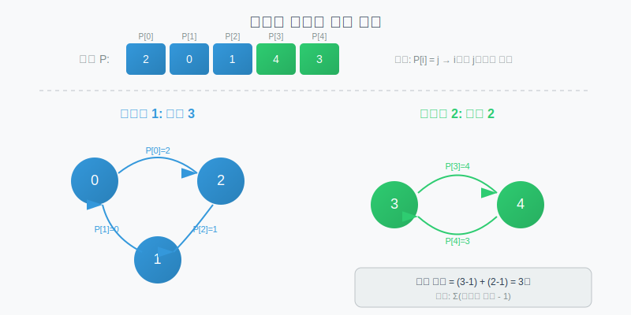
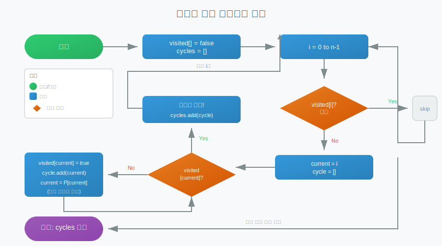

# 사이클 분해 (Cycle Decomposition)

> `[3] 중급` · 선수 지식: [그래프 알고리즘](./graph.md)

> 순열이나 함수형 그래프를 서로소인 사이클들로 분해하여 구조를 파악하는 알고리즘

`#사이클분해` `#CycleDecomposition` `#순열` `#Permutation` `#사이클` `#Cycle` `#서로소사이클` `#DisjointCycles` `#함수형그래프` `#FunctionalGraph` `#사이클찾기` `#CycleDetection` `#순열사이클` `#PermutationCycle` `#사이클길이` `#CycleLength` `#LCM` `#최소공배수` `#원상복귀` `#회전` `#Rotation` `#좌석교환` `#스왑` `#Swap` `#그래프` `#Graph` `#DFS` `#방문배열`

## 왜 알아야 하는가?

- **실무**: 데이터 재배열, 메모리 최적화된 배열 회전, 상태 전이 시스템 분석 등에서 활용됩니다. 특히 in-place 알고리즘 구현 시 사이클 분해를 통해 O(1) 추가 공간으로 문제를 해결할 수 있습니다.
- **면접**: 배열 회전, 좌석 교환, 순열 복원 등의 문제에서 자주 출제됩니다. "최소 스왑 횟수" 문제의 핵심 기법으로, 사이클 구조를 파악하면 효율적으로 풀 수 있습니다.
- **기반 지식**: 순열 이론, 함수형 그래프, 오일러 경로 등 고급 알고리즘의 기반이 됩니다. 암호학의 치환 암호, 군론(Group Theory)에서도 중요한 개념입니다.

## 핵심 개념

- **사이클 (Cycle)**: 시작점에서 출발해 다시 시작점으로 돌아오는 경로
- **서로소 사이클 (Disjoint Cycles)**: 공통 원소가 없는 독립적인 사이클들
- **사이클 분해**: 순열/그래프를 서로소인 사이클들의 합으로 표현
- **함수형 그래프**: 각 정점의 진출 차수가 정확히 1인 그래프
- **원상 복귀**: 순열을 반복 적용하여 원래 상태로 돌아오는 것

## 쉽게 이해하기

**사이클 분해**를 좌석 교환 문제로 이해할 수 있습니다.

학급에서 학생들이 좌석을 바꾸려고 합니다:
- 현재 배치: `[A, B, C, D, E]` (1~5번 좌석)
- 목표 배치: `[C, A, B, E, D]`

이를 분석하면:
- A는 1번 → 2번으로 이동
- B는 2번 → 3번으로 이동
- C는 3번 → 1번으로 이동 → **사이클 1: (1 → 2 → 3 → 1)**
- D는 4번 → 5번으로 이동
- E는 5번 → 4번으로 이동 → **사이클 2: (4 → 5 → 4)**

두 개의 서로소 사이클로 분해됩니다:
- 사이클 1: 길이 3 (A, B, C가 순환)
- 사이클 2: 길이 2 (D, E가 교환)

**핵심 통찰**:
- 각 사이클 내에서만 교환하면 됨
- 길이 k인 사이클은 k-1번의 스왑으로 정렬 가능
- 전체 스왑 횟수 = (3-1) + (2-1) = 3번

## 상세 설명

### 순열의 사이클 분해

순열 `P`에서 `P[i] = j`는 "i번 위치의 원소가 j번 위치로 이동"을 의미합니다.



#### 기본 알고리즘

```java
public class CycleDecomposition {

    /**
     * 순열을 서로소 사이클들로 분해
     * @param perm 순열 배열 (0-indexed)
     * @return 각 사이클을 리스트로 담은 리스트
     */
    public List<List<Integer>> decompose(int[] perm) {
        int n = perm.length;
        boolean[] visited = new boolean[n];
        List<List<Integer>> cycles = new ArrayList<>();

        for (int i = 0; i < n; i++) {
            if (!visited[i]) {
                List<Integer> cycle = new ArrayList<>();
                int current = i;

                // 사이클 추적
                while (!visited[current]) {
                    visited[current] = true;
                    cycle.add(current);
                    current = perm[current];
                }

                // 길이 1인 사이클(고정점)은 제외 가능
                if (cycle.size() > 1) {
                    cycles.add(cycle);
                }
            }
        }

        return cycles;
    }
}
```

**시간 복잡도**: O(N) - 각 원소를 정확히 한 번씩 방문
**공간 복잡도**: O(N) - 방문 배열

#### 예제: 순열 분해

```java
// 순열: [2, 0, 1, 4, 3]
// 의미: 0→2, 1→0, 2→1, 3→4, 4→3

int[] perm = {2, 0, 1, 4, 3};
List<List<Integer>> cycles = decompose(perm);

// 결과:
// 사이클 1: [0, 2, 1] → 0→2→1→0
// 사이클 2: [3, 4] → 3→4→3
```

### 함수형 그래프의 사이클 분해

**함수형 그래프 (Functional Graph)**:
- 각 정점에서 정확히 하나의 간선이 나감
- 예: `next[i] = j`로 표현
- 항상 사이클이 존재 (비둘기집 원리)

```java
public class FunctionalGraphCycle {

    /**
     * 함수형 그래프에서 모든 사이클 찾기
     * @param next next[i] = i에서 다음으로 가는 정점
     * @return 각 정점이 속한 사이클 번호 (-1이면 사이클에 직접 속하지 않음)
     */
    public int[] findCycles(int[] next) {
        int n = next.length;
        int[] cycleId = new int[n];
        Arrays.fill(cycleId, -1);

        // 상태: 0=미방문, 1=방문중(현재 경로), 2=완료
        int[] state = new int[n];
        int currentCycleId = 0;

        for (int i = 0; i < n; i++) {
            if (state[i] == 0) {
                List<Integer> path = new ArrayList<>();
                int current = i;

                // 경로 추적
                while (state[current] == 0) {
                    state[current] = 1;  // 방문 중
                    path.add(current);
                    current = next[current];
                }

                // 사이클 발견 (현재 경로에서 다시 방문)
                if (state[current] == 1) {
                    int cycleStart = path.indexOf(current);
                    for (int j = cycleStart; j < path.size(); j++) {
                        cycleId[path.get(j)] = currentCycleId;
                    }
                    currentCycleId++;
                }

                // 모든 경로 노드 완료 처리
                for (int node : path) {
                    state[node] = 2;
                }
            }
        }

        return cycleId;
    }
}
```

### 응용 1: 최소 스왑 횟수

**문제**: 배열을 정렬하기 위한 최소 스왑 횟수 구하기

**핵심 공식**: `최소 스왑 = N - 사이클 개수`

또는 각 사이클별로: `사이클 길이 - 1`의 합

```java
public class MinimumSwaps {

    /**
     * 배열을 정렬하기 위한 최소 스왑 횟수
     * @param arr 정렬할 배열
     * @return 최소 스왑 횟수
     */
    public int minSwaps(int[] arr) {
        int n = arr.length;

        // (값, 원래 인덱스) 쌍 생성
        int[][] arrPos = new int[n][2];
        for (int i = 0; i < n; i++) {
            arrPos[i][0] = arr[i];
            arrPos[i][1] = i;
        }

        // 값 기준 정렬
        Arrays.sort(arrPos, (a, b) -> a[0] - b[0]);

        // 순열 생성: 정렬 후 각 위치에 올 원래 인덱스
        int[] perm = new int[n];
        for (int i = 0; i < n; i++) {
            perm[i] = arrPos[i][1];
        }

        // 사이클 분해로 스왑 횟수 계산
        boolean[] visited = new boolean[n];
        int swaps = 0;

        for (int i = 0; i < n; i++) {
            if (!visited[i]) {
                int cycleLength = 0;
                int current = i;

                while (!visited[current]) {
                    visited[current] = true;
                    current = perm[current];
                    cycleLength++;
                }

                // 길이 k 사이클 → k-1번 스왑 필요
                if (cycleLength > 1) {
                    swaps += cycleLength - 1;
                }
            }
        }

        return swaps;
    }
}
```

**왜 `사이클 길이 - 1`번의 스왑인가?**

길이 k인 사이클 `(a₁ → a₂ → ... → aₖ → a₁)`에서:
- a₁과 a₂를 스왑하면 a₁이 제자리로
- a₁과 a₃를 스왑하면 a₂가 제자리로
- ...
- k-1번의 스왑으로 모든 원소가 제자리로

### 응용 2: 배열 회전 (In-place)

**문제**: 배열을 k칸 오른쪽으로 회전 (O(1) 추가 공간)

```java
public class ArrayRotation {

    /**
     * 배열을 k칸 오른쪽으로 회전 (in-place)
     * 사이클 분해를 이용한 O(N) 시간, O(1) 공간
     */
    public void rotate(int[] nums, int k) {
        int n = nums.length;
        k = k % n;
        if (k == 0) return;

        int count = 0;  // 이동 완료된 원소 수

        for (int start = 0; count < n; start++) {
            int current = start;
            int prev = nums[start];

            // 한 사이클 완료
            do {
                int next = (current + k) % n;
                int temp = nums[next];
                nums[next] = prev;
                prev = temp;
                current = next;
                count++;
            } while (current != start);
        }
    }
}
```

**왜 동작하나?**

- 회전은 순열로 표현됨: `P[i] = (i + k) % n`
- 이 순열을 사이클 분해하면 `gcd(n, k)`개의 동일 길이 사이클
- 각 사이클 시작점에서 원소들을 순환시키면 회전 완료

### 응용 3: 원상 복귀 횟수

**문제**: 순열을 몇 번 적용하면 원래 상태로 돌아오는가?

**정답**: 모든 사이클 길이의 **최소공배수 (LCM)**

```java
public class PermutationOrder {

    /**
     * 순열을 반복 적용하여 원래로 돌아오는 최소 횟수
     * = 모든 사이클 길이의 LCM
     */
    public long getOrder(int[] perm) {
        int n = perm.length;
        boolean[] visited = new boolean[n];
        long result = 1;

        for (int i = 0; i < n; i++) {
            if (!visited[i]) {
                int cycleLength = 0;
                int current = i;

                while (!visited[current]) {
                    visited[current] = true;
                    current = perm[current];
                    cycleLength++;
                }

                result = lcm(result, cycleLength);
            }
        }

        return result;
    }

    private long gcd(long a, long b) {
        return b == 0 ? a : gcd(b, a % b);
    }

    private long lcm(long a, long b) {
        return a / gcd(a, b) * b;
    }
}
```

**예시**: 순열 `[1, 2, 0, 4, 3]`
- 사이클 1: (0 → 1 → 2 → 0) 길이 3
- 사이클 2: (3 → 4 → 3) 길이 2
- 원상 복귀: LCM(3, 2) = 6번

### 응용 4: 특정 순열로 변환하기

**문제**: 배열 A를 배열 B로 만들기 위한 최소 스왑 횟수

```java
public class TransformArray {

    /**
     * 배열 A를 배열 B로 변환하기 위한 최소 스왑 횟수
     * 조건: A와 B는 같은 원소들로 구성
     */
    public int minSwapsToTransform(int[] A, int[] B) {
        int n = A.length;

        // B의 각 값의 위치 매핑
        Map<Integer, Integer> posInB = new HashMap<>();
        for (int i = 0; i < n; i++) {
            posInB.put(B[i], i);
        }

        // A[i]가 가야 할 위치로 순열 생성
        int[] perm = new int[n];
        for (int i = 0; i < n; i++) {
            perm[i] = posInB.get(A[i]);
        }

        // 사이클 분해로 스왑 횟수 계산
        boolean[] visited = new boolean[n];
        int swaps = 0;

        for (int i = 0; i < n; i++) {
            if (!visited[i]) {
                int cycleLength = 0;
                int current = i;

                while (!visited[current]) {
                    visited[current] = true;
                    current = perm[current];
                    cycleLength++;
                }

                if (cycleLength > 1) {
                    swaps += cycleLength - 1;
                }
            }
        }

        return swaps;
    }
}
```

## 동작 원리



### 알고리즘 흐름

1. **초기화**: 모든 정점을 미방문 상태로
2. **순회**: 미방문 정점 i에서 시작
3. **사이클 추적**: 방문하지 않은 정점을 따라가며 경로 기록
4. **사이클 완성**: 이미 방문한 정점을 만나면 사이클 완성
5. **반복**: 모든 정점을 방문할 때까지

### 정확성 증명

**왜 모든 원소가 정확히 하나의 사이클에 속하는가?**

- 순열에서 각 원소는 정확히 하나의 다음 원소를 가짐 (함수의 정의)
- 유한 집합에서 함수를 반복 적용하면 반드시 사이클 발생
- 서로 다른 시작점에서 출발한 경로가 만나면 그 지점부터 같은 경로
- 따라서 사이클들은 서로소 (공통 원소 없음)

## 시간/공간 복잡도

| 연산 | 시간 복잡도 | 공간 복잡도 |
|------|------------|------------|
| 사이클 분해 | O(N) | O(N) |
| 최소 스왑 계산 | O(N log N) | O(N) |
| 배열 회전 (in-place) | O(N) | O(1) |
| 원상 복귀 횟수 | O(N log M) | O(N) |

*M: 사이클 길이들의 LCM 계산 비용*

## 트레이드오프

| 접근법 | 장점 | 단점 |
|--------|------|------|
| 사이클 분해 | O(N) 시간, 구조 파악 | 구현 복잡도 |
| 단순 시뮬레이션 | 직관적, 구현 쉬움 | O(N²) 시간 가능 |
| 정렬 기반 | 범용적 | O(N log N), 추가 공간 |

## 트러블슈팅

### 사례 1: 0-indexed vs 1-indexed 혼동

#### 증상
```java
// 순열 [1, 2, 3] 입력 시 ArrayIndexOutOfBoundsException
int[] perm = {1, 2, 3};  // 1-indexed 순열
current = perm[current]; // perm[0]=1 → perm[1]=2 → perm[2]=3 → 범위 초과!
```

#### 원인 분석
문제에서 1-indexed 순열을 주는 경우가 많음. 그대로 사용하면 인덱스 범위 초과.

#### 해결 방법
```java
// 방법 1: 전처리로 0-indexed 변환
for (int i = 0; i < n; i++) {
    perm[i]--;  // 1-indexed → 0-indexed
}

// 방법 2: 1-indexed 배열 사용
int[] perm = new int[n + 1];  // 0번 인덱스 미사용
```

### 사례 2: 고정점(길이 1 사이클) 처리

#### 증상
```java
// 순열 [0, 2, 1]에서 0은 고정점
// 결과: 사이클 [[0], [1, 2]] vs [[1, 2]]
```

#### 원인 분석
길이 1인 사이클(자기 자신으로 가는 원소)을 포함할지 여부에 따라 결과가 달라짐.

#### 해결 방법
```java
// 문제 요구사항에 따라 선택
if (cycle.size() > 1) {  // 길이 1 제외
    cycles.add(cycle);
}

// 최소 스왑에서는 길이 1 사이클이 스왑 불필요 (자동 처리)
```

## 면접 예상 질문

### Q: 사이클 분해란 무엇이고 언제 사용하나요?

A: 사이클 분해는 순열이나 함수형 그래프를 **서로소인 사이클들의 합**으로 표현하는 것입니다. **언제 사용하나?** 배열을 정렬하는 최소 스왑 횟수, in-place 배열 회전, 순열 반복 적용 횟수 계산 등에 사용합니다. **왜 유용한가?** 문제의 구조를 파악하여 효율적인 해법을 찾을 수 있습니다. 예를 들어 길이 k인 사이클은 k-1번의 스왑으로 정렬되므로, 전체 스왑 횟수 = N - 사이클 개수입니다.

### Q: 배열을 정렬하는 최소 스왑 횟수를 구하는 방법은?

A: **사이클 분해**를 사용합니다. 배열의 현재 위치와 정렬 후 위치의 관계를 순열로 표현하고, 이를 사이클 분해합니다. **공식**: `최소 스왑 = N - 사이클 개수` 또는 `Σ(사이클 길이 - 1)`. **왜 그런가?** 길이 k인 사이클에서 k개 원소를 제자리로 보내려면 k-1번의 스왑이 필요합니다. 첫 번째 스왑으로 1개가 제자리로, 두 번째로 2개가... 마지막 k-1번째 스왑으로 나머지 2개가 동시에 제자리로 갑니다.

### Q: 순열을 몇 번 적용하면 원래 상태로 돌아오나요?

A: **모든 사이클 길이의 최소공배수(LCM)**번입니다. **왜 LCM인가?** 길이 k인 사이클은 k번 적용 시 원상 복귀합니다. 여러 사이클이 동시에 원상 복귀하려면 모든 사이클 길이의 공배수여야 하고, 최소값은 LCM입니다. **예시**: 사이클 길이가 3, 4이면 LCM(3, 4) = 12번 적용 시 원상 복귀. 이는 군론에서 순열의 위수(order)라고 합니다.

### Q: in-place 배열 회전에서 사이클 분해가 어떻게 활용되나요?

A: k칸 회전은 순열 `P[i] = (i + k) % n`입니다. 이를 사이클 분해하면 **gcd(n, k)개의 사이클**이 생깁니다. 각 사이클 시작점에서 원소들을 순환시키면 O(N) 시간, O(1) 추가 공간으로 회전됩니다. **예시**: n=6, k=2이면 gcd(6,2)=2개 사이클: (0→2→4→0), (1→3→5→1). 각 사이클에서 원소를 차례로 이동시키면 완료.

### Q: 함수형 그래프에서 사이클은 반드시 존재하나요?

A: **예, 반드시 존재합니다** (비둘기집 원리). 함수형 그래프에서 각 정점은 정확히 하나의 나가는 간선을 가집니다. N개 정점에서 시작하여 N+1번 이동하면 N개 중 하나는 반드시 재방문합니다. 따라서 사이클이 반드시 존재합니다. 다만, 모든 정점이 사이클에 직접 속하지는 않을 수 있고, 사이클로 진입하는 "꼬리(tail)" 부분이 있을 수 있습니다.

## 연관 문서

| 문서 | 연관성 | 난이도 |
|------|--------|--------|
| [그래프 알고리즘](./graph.md) | 선수 지식: 그래프 순회, DFS | [4] 심화 |
| [그래프 (자료구조)](../data-structure/graph.md) | 선수 지식: 그래프 표현 방법 | [4] 심화 |
| [Union-Find](../data-structure/union-find.md) | 관련 개념: 집합 분해, 사이클 감지 | [3] 중급 |

## 참고 자료

- Introduction to Algorithms (CLRS) - Chapter 31 (Number-Theoretic Algorithms) - 순열과 군 이론
- Competitive Programmer's Handbook - Chapter 17 (Combinatorics) - 순열 사이클
- [LeetCode 41. First Missing Positive](https://leetcode.com/problems/first-missing-positive/) - 사이클 분해 응용
- [LeetCode 189. Rotate Array](https://leetcode.com/problems/rotate-array/) - in-place 회전
- [Codeforces - Functional Graph Problems](https://codeforces.com/blog/entry/68138) - 함수형 그래프 문제 모음
