# 분할 정복 (Divide and Conquer)

> `[3] 중급` · 선수 지식: [알고리즘이란](./what-is-algorithm.md), [시간 복잡도](./time-complexity.md)

> 문제를 작은 부분 문제로 나누어 해결한 후 결과를 합치는 알고리즘 설계 기법

`#분할정복` `#DivideAndConquer` `#재귀` `#Recursion` `#합병정렬` `#MergeSort` `#퀵정렬` `#QuickSort` `#이진탐색` `#BinarySearch` `#거듭제곱` `#분할` `#Divide` `#정복` `#Conquer` `#결합` `#Combine` `#TopDown` `#마스터정리` `#MasterTheorem`

## 왜 알아야 하는가?

분할 정복은 복잡한 문제를 단순한 문제들로 쪼개어 해결하는 강력한 기법입니다. Merge Sort, Quick Sort, Binary Search 등 핵심 알고리즘의 기반이며, 코딩 테스트와 면접에서 자주 출제됩니다.

## 핵심 개념

- **Divide (분할)**: 문제를 더 작은 부분 문제로 나눔
- **Conquer (정복)**: 부분 문제를 재귀적으로 해결
- **Combine (결합)**: 부분 문제의 해를 합쳐 원래 문제의 해 도출

## 쉽게 이해하기

**분할 정복**을 전화번호부에서 이름 찾기에 비유할 수 있습니다.

"김철수"를 찾으려면:
1. **분할**: 전화번호부 중간을 펼침
2. **비교**: "박"이면 "김"은 앞쪽에 있음
3. **정복**: 앞쪽 절반에서 다시 중간을 펼침
4. 반복하면 빠르게 찾음 (이진 탐색)

## 상세 설명

### 분할 정복 구조



### 예시 1: 합병 정렬 (Merge Sort)

```
[38, 27, 43, 3, 9, 82, 10]

1. Divide:
[38, 27, 43, 3] | [9, 82, 10]
[38, 27] | [43, 3] | [9, 82] | [10]
[38] [27] [43] [3] [9] [82] [10]

2. Conquer + Combine (정렬하며 합치기):
[27, 38] [3, 43] [9, 82] [10]
[3, 27, 38, 43] [9, 10, 82]
[3, 9, 10, 27, 38, 43, 82]
```

```java
void mergeSort(int[] arr, int left, int right) {
    if (left < right) {
        int mid = (left + right) / 2;
        mergeSort(arr, left, mid);       // 왼쪽 정복
        mergeSort(arr, mid + 1, right);  // 오른쪽 정복
        merge(arr, left, mid, right);    // 결합
    }
}
```

**시간 복잡도**: O(n log n)

### 예시 2: 이진 탐색 (Binary Search)

```java
int binarySearch(int[] arr, int target) {
    int left = 0, right = arr.length - 1;

    while (left <= right) {
        int mid = (left + right) / 2;

        if (arr[mid] == target) return mid;
        else if (arr[mid] < target) left = mid + 1;
        else right = mid - 1;
    }
    return -1;
}
```

**시간 복잡도**: O(log n)

### 예시 3: 거듭제곱 (Power)

```java
// 일반: O(n)
long power(long x, int n) {
    long result = 1;
    for (int i = 0; i < n; i++) result *= x;
    return result;
}

// 분할 정복: O(log n)
long power(long x, int n) {
    if (n == 0) return 1;
    if (n % 2 == 0) {
        long half = power(x, n / 2);
        return half * half;
    } else {
        return x * power(x, n - 1);
    }
}
```

### 분할 정복 적용 알고리즘

| 알고리즘 | 시간 복잡도 | 설명 |
|---------|------------|------|
| Merge Sort | O(n log n) | 정렬 |
| Quick Sort | O(n log n) 평균 | 정렬 |
| Binary Search | O(log n) | 탐색 |
| Karatsuba | O(n^1.585) | 큰 수 곱셈 |
| Strassen | O(n^2.807) | 행렬 곱셈 |
| FFT | O(n log n) | 다항식 곱셈 |

## 트레이드오프

| 장점 | 단점 |
|------|------|
| 복잡한 문제 단순화 | 재귀 호출 오버헤드 |
| 병렬화 가능 | 스택 오버플로우 위험 |
| 효율적 (보통 O(n log n)) | 작은 문제에서는 비효율 |

## 면접 예상 질문

### Q: 분할 정복과 동적 프로그래밍의 차이는?

A: **분할 정복**은 부분 문제들이 서로 독립적이고 중복되지 않습니다. **동적 프로그래밍**은 부분 문제들이 중복되어 메모이제이션으로 재계산을 피합니다. **예시**: 피보나치에서 분할 정복은 중복 계산으로 비효율적이고, DP는 메모이제이션으로 O(n)에 해결합니다.

## 연관 문서

| 문서 | 연관성 | 난이도 |
|------|--------|--------|
| [그리디](./greedy.md) | 알고리즘 설계 기법 | [3] 중급 |
| [백트래킹](./backtracking.md) | 알고리즘 설계 기법 | [3] 중급 |

## 참고 자료

- Introduction to Algorithms (CLRS)
- [Visualgo - Sorting](https://visualgo.net/en/sorting)
