# 탐색 알고리즘 (Search Algorithms)

> `[3] 중급` · 선수 지식: [시간 복잡도](./time-complexity.md), [정렬](./sort.md)

> 데이터 집합에서 특정 값을 찾는 알고리즘

`#탐색` `#Search` `#탐색알고리즘` `#SearchAlgorithm` `#이진탐색` `#BinarySearch` `#선형탐색` `#LinearSearch` `#순차탐색` `#SequentialSearch` `#해시탐색` `#HashSearch` `#BST` `#이진탐색트리` `#BinarySearchTree` `#LowerBound` `#UpperBound` `#Parametric` `#파라메트릭` `#O(logn)` `#O(n)` `#O(1)` `#정렬된데이터` `#중간값` `#분할정복` `#인덱스` `#검색`

## 왜 알아야 하는가?

- **실무**: 데이터베이스 인덱싱(B-Tree), 검색 엔진, 캐시 시스템(해시 테이블) 등 모든 데이터 접근의 기반입니다. 정렬된 데이터의 빠른 조회가 필요한 모든 시스템에 필수적입니다.
- **면접**: 이진 탐색은 코딩 테스트 기본이며, Lower/Upper Bound는 중급 문제에 자주 출제됩니다. 자료구조(BST, 해시 테이블) 선택 기준을 묻는 단골 질문입니다.
- **기반 지식**: 시간 복잡도 분석의 대표 예시이며, 정렬과의 트레이드오프를 이해하는 핵심 주제입니다. 자료구조 선택 기준(순서, 삽입/삭제 빈도)을 학습합니다.

## 핵심 개념

- **선형 탐색**: 순차적으로 모든 원소를 확인 - O(n)
- **이진 탐색**: 정렬된 배열에서 절반씩 범위를 줄여가며 탐색 - O(log n)
- **이진 탐색 트리 (BST)**: 트리 구조를 이용한 효율적 탐색/삽입/삭제
- **해시 탐색**: 해시 함수로 직접 위치 계산 - O(1) 평균
- **전제 조건**: 이진 탐색은 정렬된 데이터가 필수

## 쉽게 이해하기

**탐색 알고리즘**을 사전에서 단어 찾기에 비유할 수 있습니다.

단어장에서 "Zebra"를 찾는다면:

- **선형 탐색**: A부터 Z까지 한 페이지씩 넘기며 찾기. 확실하지만 느림
- **이진 탐색**: 중간(M)을 펼쳐 Z가 뒤쪽인지 확인 → 뒷부분의 중간(S) 펼침 → 더 뒤쪽(V와 Z 사이)... 반복하여 빠르게 찾기
- **이진 탐색 트리**: 각 페이지에 "이 단어보다 작으면 왼쪽, 크면 오른쪽" 안내문이 있는 사전
- **해시 탐색**: 단어를 공식에 넣으면 정확한 페이지 번호가 나오는 마법 사전

예를 들어, 전화번호부에서 사람을 찾을 때:
- 가나다순으로 정렬되어 있으면 이진 탐색처럼 중간부터 찾기
- 무작위 순서면 선형 탐색으로 처음부터 찾기
- 전화번호로 찾으면 해시 탐색처럼 바로 찾기

**핵심**: 데이터가 정렬되어 있으면 훨씬 빠르게 찾을 수 있습니다.

## 상세 설명

### 1. 선형 탐색 (Linear Search)

배열의 처음부터 끝까지 순차적으로 탐색하는 방식입니다.

**왜 이렇게 하는가?**

가장 단순하고 직관적인 방법입니다. 데이터가 정렬되어 있지 않거나, 작은 데이터셋에서는 오히려 선형 탐색이 효율적입니다. 또한 모든 원소를 확인해야 하는 경우 유일한 선택지입니다.

```java
public int linearSearch(int[] arr, int target) {
    for (int i = 0; i < arr.length; i++) {
        if (arr[i] == target) {
            return i; // 찾은 인덱스 반환
        }
    }
    return -1; // 못 찾음
}
```

**특징**:
- 시간 복잡도: 최선 O(1), 평균/최악 O(n)
- 공간 복잡도: O(1)
- 정렬 불필요

**언제 사용하나?**

- 데이터가 정렬되어 있지 않을 때
- 데이터 크기가 작을 때 (n < 100)
- 단 한 번만 탐색할 때 (정렬 비용이 더 클 때)
- 링크드 리스트 등 인덱스 접근이 불가능한 자료구조

**왜 작은 데이터에서는 선형 탐색이 나을 수 있나?**

이진 탐색은 정렬이 전제되어야 하므로 정렬 비용 O(n log n)이 추가됩니다. 한 번만 탐색한다면 정렬 O(n log n) + 탐색 O(log n)보다 선형 탐색 O(n)이 더 빠릅니다.

### 2. 이진 탐색 (Binary Search)

정렬된 배열에서 중간값과 비교하며 탐색 범위를 절반씩 줄여가는 방식입니다.

**왜 이렇게 하는가?**

정렬된 데이터는 중간값과의 비교만으로 절반을 제거할 수 있습니다. 매번 탐색 범위가 절반으로 줄어 O(log n)의 성능을 보입니다.

```java
// 반복문 방식
public int binarySearch(int[] arr, int target) {
    int left = 0;
    int right = arr.length - 1;

    while (left <= right) {
        int mid = left + (right - left) / 2; // 오버플로우 방지

        if (arr[mid] == target) {
            return mid;
        } else if (arr[mid] < target) {
            left = mid + 1; // 오른쪽 절반 탐색
        } else {
            right = mid - 1; // 왼쪽 절반 탐색
        }
    }
    return -1;
}

// 재귀 방식
public int binarySearchRecursive(int[] arr, int target, int left, int right) {
    if (left > right) {
        return -1;
    }

    int mid = left + (right - left) / 2;

    if (arr[mid] == target) {
        return mid;
    } else if (arr[mid] < target) {
        return binarySearchRecursive(arr, target, mid + 1, right);
    } else {
        return binarySearchRecursive(arr, target, left, mid - 1);
    }
}
```

**왜 `(left + right) / 2`가 아닌 `left + (right - left) / 2`를 사용하나?**

`left + right`가 int 범위를 초과하면 오버플로우가 발생합니다. `left + (right - left) / 2`는 수학적으로 동일하지만 오버플로우를 방지합니다.

**특징**:
- 시간 복잡도: O(log n) - 1000개 → 약 10번, 100만 개 → 약 20번
- 공간 복잡도: 반복문 O(1), 재귀 O(log n) (콜스택)
- **정렬 필수**: 정렬되지 않으면 작동하지 않음

**언제 사용하나?**

- 정렬된 배열에서 빠른 탐색이 필요할 때
- 여러 번 탐색해야 할 때 (정렬 비용 상쇄)
- 특정 조건을 만족하는 경계값 찾기 (Lower Bound, Upper Bound)

#### 이진 탐색 변형: Lower Bound / Upper Bound

**Lower Bound**: target 이상인 첫 번째 원소의 인덱스
**Upper Bound**: target 초과인 첫 번째 원소의 인덱스

```java
// Lower Bound: target 이상인 첫 위치
public int lowerBound(int[] arr, int target) {
    int left = 0;
    int right = arr.length;

    while (left < right) {
        int mid = left + (right - left) / 2;
        if (arr[mid] < target) {
            left = mid + 1;
        } else {
            right = mid; // target 이상이면 right 이동
        }
    }
    return left;
}

// Upper Bound: target 초과인 첫 위치
public int upperBound(int[] arr, int target) {
    int left = 0;
    int right = arr.length;

    while (left < right) {
        int mid = left + (right - left) / 2;
        if (arr[mid] <= target) {
            left = mid + 1;
        } else {
            right = mid;
        }
    }
    return left;
}
```

**언제 사용하나?**

- 중복된 값의 범위 찾기
- 삽입할 위치 찾기 (정렬 유지)
- 범위 쿼리 (range query)

### 3. 이진 탐색 트리 (Binary Search Tree, BST)

각 노드가 "왼쪽 자식 < 부모 < 오른쪽 자식" 규칙을 만족하는 트리입니다.

**왜 이렇게 하는가?**

배열의 이진 탐색은 삽입/삭제가 O(n)이지만, BST는 탐색/삽입/삭제가 모두 O(log n) (균형 트리)입니다. 동적으로 변하는 데이터에 적합합니다.

```java
class TreeNode {
    int val;
    TreeNode left, right;

    TreeNode(int val) {
        this.val = val;
    }
}

class BinarySearchTree {
    private TreeNode root;

    // 탐색
    public TreeNode search(int target) {
        return searchRecursive(root, target);
    }

    private TreeNode searchRecursive(TreeNode node, int target) {
        if (node == null || node.val == target) {
            return node;
        }

        if (target < node.val) {
            return searchRecursive(node.left, target);
        } else {
            return searchRecursive(node.right, target);
        }
    }

    // 삽입
    public void insert(int val) {
        root = insertRecursive(root, val);
    }

    private TreeNode insertRecursive(TreeNode node, int val) {
        if (node == null) {
            return new TreeNode(val);
        }

        if (val < node.val) {
            node.left = insertRecursive(node.left, val);
        } else if (val > node.val) {
            node.right = insertRecursive(node.right, val);
        }

        return node;
    }

    // 삭제
    public void delete(int val) {
        root = deleteRecursive(root, val);
    }

    private TreeNode deleteRecursive(TreeNode node, int val) {
        if (node == null) return null;

        if (val < node.val) {
            node.left = deleteRecursive(node.left, val);
        } else if (val > node.val) {
            node.right = deleteRecursive(node.right, val);
        } else {
            // 자식이 0개 또는 1개
            if (node.left == null) return node.right;
            if (node.right == null) return node.left;

            // 자식이 2개: 오른쪽 서브트리의 최솟값으로 대체
            node.val = findMin(node.right);
            node.right = deleteRecursive(node.right, node.val);
        }

        return node;
    }

    private int findMin(TreeNode node) {
        while (node.left != null) {
            node = node.left;
        }
        return node.val;
    }
}
```

**특징**:
- 평균: 탐색/삽입/삭제 모두 O(log n)
- 최악: O(n) - 편향 트리 (한쪽으로만 치우침)
- 공간 복잡도: O(n)

**왜 최악의 경우 O(n)인가?**

이미 정렬된 데이터를 순서대로 삽입하면 한쪽으로만 뻗은 편향 트리가 됩니다. 이는 사실상 링크드 리스트와 동일하여 O(n)입니다.



**해결 방법**: 자가 균형 트리 (Self-Balancing Tree)
- **AVL 트리**: 각 노드의 왼쪽/오른쪽 서브트리 높이 차이 ≤ 1 유지
- **Red-Black 트리**: 색상 규칙으로 균형 유지 (Java TreeMap, TreeSet)
- **B-Tree**: 다중 분기로 디스크 I/O 최소화 (데이터베이스 인덱스)

**언제 사용하나?**

- 동적으로 삽입/삭제가 빈번할 때
- 정렬된 순서로 순회가 필요할 때 (중위 순회 = 오름차순)
- 범위 검색이 필요할 때
- Java: TreeSet, TreeMap (Red-Black Tree)

### 4. 해시 탐색 (Hash Search)

해시 함수로 키를 배열 인덱스로 변환하여 O(1)에 접근하는 방식입니다.

**왜 이렇게 하는가?**

키를 해시 함수에 넣으면 저장 위치가 바로 계산됩니다. 비교 없이 직접 접근하므로 평균 O(1)입니다.

```java
class HashTable {
    private static final int SIZE = 1000;
    private LinkedList<Entry>[] table;

    static class Entry {
        String key;
        int value;

        Entry(String key, int value) {
            this.key = key;
            this.value = value;
        }
    }

    public HashTable() {
        table = new LinkedList[SIZE];
        for (int i = 0; i < SIZE; i++) {
            table[i] = new LinkedList<>();
        }
    }

    private int hash(String key) {
        return Math.abs(key.hashCode() % SIZE);
    }

    // 삽입
    public void put(String key, int value) {
        int index = hash(key);
        LinkedList<Entry> bucket = table[index];

        // 기존 키 업데이트
        for (Entry entry : bucket) {
            if (entry.key.equals(key)) {
                entry.value = value;
                return;
            }
        }

        // 새 키 추가
        bucket.add(new Entry(key, value));
    }

    // 탐색
    public Integer get(String key) {
        int index = hash(key);
        LinkedList<Entry> bucket = table[index];

        for (Entry entry : bucket) {
            if (entry.key.equals(key)) {
                return entry.value;
            }
        }

        return null; // 못 찾음
    }

    // 삭제
    public void remove(String key) {
        int index = hash(key);
        LinkedList<Entry> bucket = table[index];

        bucket.removeIf(entry -> entry.key.equals(key));
    }
}
```

**특징**:
- 평균: 탐색/삽입/삭제 모두 O(1)
- 최악: O(n) - 모든 키가 같은 버킷에 충돌
- 정렬 불가능: 순서 정보가 없음

**충돌 해결 방법**:

1. **체이닝 (Chaining)**: 같은 인덱스에 링크드 리스트로 연결
2. **개방 주소법 (Open Addressing)**: 충돌 시 다른 빈 자리 찾기
   - Linear Probing: 다음 칸부터 순차 탐색
   - Quadratic Probing: 1², 2², 3²칸 간격으로 탐색
   - Double Hashing: 두 번째 해시 함수로 간격 결정

**왜 평균 O(1)인데 최악이 O(n)인가?**

해시 충돌이 많으면 한 버킷에 여러 원소가 체이닝됩니다. 극단적으로 모든 키가 같은 버킷에 들어가면 O(n) 선형 탐색과 동일합니다. **따라서** 좋은 해시 함수와 적절한 Load Factor(사용률) 관리가 중요합니다.

**Load Factor**: 저장된 원소 수 / 버킷 수
- Java HashMap: 0.75 초과 시 버킷 수를 2배로 확장 (Rehashing)

**언제 사용하나?**

- 빠른 탐색이 필요할 때 (O(1))
- 키-값 매핑이 필요할 때
- 순서가 중요하지 않을 때
- Java: HashMap, HashSet

## 비교 정리

| 특성 | 선형 탐색 | 이진 탐색 | BST (균형) | 해시 테이블 |
|------|----------|----------|-----------|------------|
| **시간 복잡도 (평균)** | O(n) | O(log n) | O(log n) | O(1) |
| **시간 복잡도 (최악)** | O(n) | O(log n) | O(n) | O(n) |
| **정렬 필요** | X | O | X | X |
| **순서 유지** | O | O | O (중위 순회) | X |
| **삽입/삭제** | O(n) | O(n) | O(log n) | O(1) |
| **범위 검색** | O(n) | O(log n) | O(log n) | 불가능 |
| **공간 복잡도** | O(1) | O(1) | O(n) | O(n) |
| **적합한 상황** | 작은 데이터, 비정렬 | 정렬된 정적 데이터 | 동적 데이터 + 순서 | 빠른 탐색, 순서 불필요 |

**왜 이진 탐색은 삽입/삭제가 O(n)인가?**

배열의 중간에 삽입/삭제 시 뒤의 모든 원소를 이동해야 하므로 O(n)입니다. BST는 포인터만 변경하면 되므로 O(log n)입니다.

## 면접 예상 질문

- Q: 이진 탐색과 이진 탐색 트리의 차이는?
  - A: 이진 탐색은 정렬된 배열에서 O(log n)으로 탐색하지만 삽입/삭제가 O(n)입니다. 이진 탐색 트리는 트리 구조로 탐색/삽입/삭제가 모두 O(log n) (균형 트리 기준)입니다. **왜냐하면** 배열은 중간 삽입 시 뒤의 원소를 모두 이동해야 하지만, BST는 포인터만 변경하면 되기 때문입니다. **따라서** 정적 데이터(변경 없음)는 이진 탐색이, 동적 데이터(삽입/삭제 빈번)는 BST가 적합합니다. 실무에서는 Java의 ArrayList(이진 탐색)와 TreeSet(Red-Black Tree)로 구분하여 사용합니다.

- Q: 해시 테이블과 이진 탐색 트리 중 무엇을 선택해야 하나요?
  - A: 순서가 필요 없고 빠른 탐색만 필요하면 해시 테이블(O(1)), 순서 유지나 범위 검색이 필요하면 BST(O(log n))입니다. **구체적으로** 해시 테이블은 평균 O(1)로 가장 빠르지만 정렬 불가능하고 범위 검색이 안 됩니다. BST는 O(log n)이지만 정렬 순회, 최솟값/최댓값 찾기, 특정 범위 검색이 가능합니다. **예를 들어** 사용자 ID로 정보 조회는 HashMap이, "2000년대생 찾기" 같은 범위 검색은 TreeMap이 적합합니다. Java에서는 순서 불필요 시 HashMap, 순서 필요 시 TreeMap/LinkedHashMap을 사용합니다.

- Q: 이진 탐색에서 `mid = (left + right) / 2`의 문제점은?
  - A: left + right가 int 최댓값을 초과하면 오버플로우가 발생하여 음수가 됩니다. **예를 들어** left = 2,000,000,000, right = 2,000,000,000이면 합이 4,000,000,000으로 int 범위(약 21억)를 초과합니다. **해결 방법**은 `mid = left + (right - left) / 2`를 사용하는 것입니다. 이는 수학적으로 동일하지만 right - left가 int 범위 내에 있어 안전합니다. **또는** `mid = (left + right) >>> 1`(부호 없는 우측 시프트)를 사용할 수 있습니다.

- Q: 정렬되지 않은 배열에서 탐색 성능을 높이려면?
  - A: 한 번만 탐색한다면 선형 탐색 O(n)을, 여러 번 탐색한다면 먼저 정렬 O(n log n) 후 이진 탐색 O(log n)을 반복하는 것이 효율적입니다. **왜냐하면** 탐색 횟수가 k번일 때, 선형 탐색은 O(kn)이지만 정렬 후 이진 탐색은 O(n log n + k log n)이기 때문입니다. k가 충분히 크면 (대략 k > log n) 정렬 비용을 상쇄합니다. **또는** 해시 테이블로 변환 O(n) 후 O(1) 탐색을 반복하는 방법도 있습니다. **실무 예시**: 데이터베이스는 쿼리 성능을 위해 인덱스(B-Tree)를 미리 구성합니다.

- Q: Lower Bound와 Upper Bound는 언제 사용하나요?
  - A: 중복된 값의 범위를 찾거나, 삽입할 위치를 찾을 때 사용합니다. **예를 들어** [1, 2, 2, 2, 3, 5]에서 2의 범위를 찾으려면 Lower Bound = 1 (첫 2의 위치), Upper Bound = 4 (2 초과인 3의 위치)입니다. **따라서** 2의 개수는 Upper - Lower = 3개입니다. **실무 활용**: C++ STL의 lower_bound, upper_bound 함수는 정렬된 컨테이너에서 삽입 위치를 찾아 정렬을 유지합니다. Java에서는 Collections.binarySearch가 음수 반환 시 삽입 위치를 알려줍니다.

## 연관 문서

| 문서 | 연관성 | 난이도 |
|------|--------|--------|
| [시간 복잡도](./time-complexity.md) | 선수 지식: 탐색 알고리즘 성능 분석 기반 | [2] 입문 |
| [정렬](./sort.md) | 선수 지식: 이진 탐색의 전제 조건 | [3] 중급 |
| [그래프](./graph.md) | 관련 개념: DFS/BFS 그래프 탐색 | [4] 심화 |
| [동적 프로그래밍](./dynamic-programming.md) | 관련 개념: 이진 탐색 + DP 조합 문제 | [4] 심화 |
| [자료구조](../data-structure/README.md) | 선수 지식: BST, 해시 테이블 구현 | [2] 입문 |

## 참고 자료

- Introduction to Algorithms (CLRS) - 12장(Binary Search Trees)
- Algorithms 4th Edition (Robert Sedgewick) - 3.1~3.5 Searching
- [VisuAlgo](https://visualgo.net/en/bst) - BST, AVL, Red-Black Tree 시각화
- Java Collections Framework - HashMap, TreeMap 구현
