# 시간복잡도와 공간복잡도

> `[1] 정의` · 선수 지식: 알고리즘이란

> 시간복잡도는 **입력 크기에 따라 알고리즘이 수행하는 연산 횟수의 증가율**을 나타내는 척도이다.

`#시간복잡도` `#TimeComplexity` `#공간복잡도` `#SpaceComplexity` `#Big-O` `#빅오` `#BigO` `#점근표기법` `#AsymptoticNotation` `#성능분석` `#PerformanceAnalysis` `#알고리즘분석` `#O(1)` `#O(n)` `#O(logn)` `#O(nlogn)` `#O(n²)` `#O(2ⁿ)` `#상수시간` `#선형시간` `#로그시간` `#지수시간` `#최선` `#평균` `#최악` `#빅오메가` `#빅세타` `#Omega` `#Theta`

## 왜 알아야 하는가?

- **실무**: 데이터가 10배 늘어났을 때 응답 시간이 10배 vs 100배 늘어나는지 예측할 수 있다. 시스템 확장성 판단의 핵심 도구다.
- **면접**: "이 알고리즘의 시간복잡도가 무엇인가요?"는 기술 면접의 단골 질문이다. Big-O를 모르면 알고리즘 문제를 풀어도 설명할 수 없다.
- **기반 지식**: 모든 알고리즘과 자료구조의 성능을 비교하는 공통 언어다. "HashMap이 빠르다"를 O(1)로 정확히 표현할 수 있다.

## 핵심 개념

- **시간복잡도(Time Complexity)**: 입력 크기 N에 따른 연산 횟수
- **공간복잡도(Space Complexity)**: 입력 크기 N에 따른 메모리 사용량
- **Big-O 표기법**: 최악의 경우 성능을 나타내는 점근적 상한
- **점근적 분석(Asymptotic Analysis)**: N이 충분히 클 때의 성능 추세 분석

## 쉽게 이해하기

**시간복잡도**를 **책에서 이름 찾기**에 비유할 수 있습니다.

전화번호부에서 "홍길동"을 찾는다고 생각해보세요:

**방법 1: 처음부터 한 장씩 넘기기**
- 1000명 → 최대 1000번 확인
- 10000명 → 최대 10000번 확인
- 사람이 N명이면 → N번 확인
- 이것이 **O(N)** - 선형 시간

**방법 2: 가운데를 펴서 앞/뒤 결정하기 (가나다순 정렬됨)**
- 1000명 → 최대 10번 확인 (2^10 = 1024)
- 10000명 → 최대 14번 확인 (2^14 = 16384)
- 사람이 N명이면 → log₂N번 확인
- 이것이 **O(log N)** - 로그 시간

데이터가 1000배 늘어나면:
- O(N): 1000배 더 오래 걸림
- O(log N): 10번 더 확인하면 됨

**이것이 알고리즘 선택이 중요한 이유입니다.**

## 상세 설명

### Big-O 표기법

Big-O는 **최악의 경우(Worst Case)** 성능의 **상한(Upper Bound)**을 나타냅니다.

```
f(N) = O(g(N))

"f(N)의 증가율은 g(N)을 넘지 않는다"
```

**왜 최악의 경우를 사용하나?**

시스템 설계 시 최악의 상황을 대비해야 합니다. "보통은 빠른데 가끔 느려요"는 서비스 장애로 이어질 수 있습니다. 최악의 경우를 알아야 안정적인 시스템을 설계할 수 있습니다.

### 다른 표기법

| 표기법 | 의미 | 설명 |
|--------|------|------|
| **Big-O (O)** | 상한 | 최악의 경우 이보다 나쁘지 않음 |
| **Big-Ω (Omega)** | 하한 | 최선의 경우 이보다 좋지 않음 |
| **Big-Θ (Theta)** | 평균 | 정확한 증가율 (상한 = 하한) |

**실무에서는 Big-O를 가장 많이 사용합니다.** 최악의 경우를 대비하는 것이 시스템 안정성에 중요하기 때문입니다.

### 주요 시간복잡도

| 복잡도 | 명칭 | N=10 | N=100 | N=1000 | 예시 |
|--------|------|------|-------|--------|------|
| O(1) | 상수 | 1 | 1 | 1 | 배열 인덱스 접근, 해시테이블 |
| O(log N) | 로그 | 3 | 7 | 10 | 이진 탐색 |
| O(N) | 선형 | 10 | 100 | 1000 | 배열 순회 |
| O(N log N) | 선형 로그 | 30 | 700 | 10000 | 효율적 정렬 (병합, 퀵) |
| O(N²) | 이차 | 100 | 10000 | 1000000 | 중첩 루프, 버블 정렬 |
| O(2^N) | 지수 | 1024 | 10^30 | - | 부분집합 생성 |
| O(N!) | 팩토리얼 | 3628800 | - | - | 순열 생성 |

### 복잡도 증가율 비교



**왜 이 차이가 중요한가?**

```
1초에 1억 번 연산 가능하다고 가정 (N = 10,000):

O(N)      : 0.0001초   → 즉시
O(N log N): 0.0013초   → 즉시
O(N²)     : 1초        → 느려지기 시작
O(2^N)    : 우주 멸망까지 안 끝남
```

### 시간복잡도 계산 규칙

#### 1. 상수는 무시한다

```java
// O(3N) → O(N)
for (int i = 0; i < 3 * n; i++) {
    // 작업
}
```

**왜?** N이 충분히 크면 상수 3은 무의미해집니다. N=1억일 때 3억이나 1억이나 같은 "선형 증가"입니다.

#### 2. 최고 차항만 남긴다

```java
// O(N² + N + 1) → O(N²)
for (int i = 0; i < n; i++) {
    for (int j = 0; j < n; j++) {
        // O(N²)
    }
}
for (int i = 0; i < n; i++) {
    // O(N)
}
```

**왜?** N이 크면 N²이 N을 압도합니다. N=1000일 때 1,000,000 vs 1,000이므로 N은 무시해도 됩니다.

#### 3. 다른 변수는 분리한다

```java
// O(N + M) - N과 M이 독립적인 경우
for (int i = 0; i < n; i++) { }  // O(N)
for (int j = 0; j < m; j++) { }  // O(M)
```

### 코드로 보는 시간복잡도

#### O(1) - 상수 시간

```java
public int getFirst(int[] arr) {
    return arr[0];  // 배열 크기와 무관하게 1번 연산
}
```

#### O(log N) - 로그 시간

```java
public int binarySearch(int[] arr, int target) {
    int left = 0, right = arr.length - 1;

    while (left <= right) {
        int mid = (left + right) / 2;

        if (arr[mid] == target) return mid;
        else if (arr[mid] < target) left = mid + 1;
        else right = mid - 1;
    }
    return -1;
}
// 매 반복마다 탐색 범위가 절반으로 줄어듦
```

#### O(N) - 선형 시간

```java
public int findMax(int[] arr) {
    int max = arr[0];

    for (int i = 1; i < arr.length; i++) {  // N-1번 반복
        if (arr[i] > max) {
            max = arr[i];
        }
    }
    return max;
}
```

#### O(N log N) - 선형 로그 시간

```java
public void mergeSort(int[] arr, int left, int right) {
    if (left < right) {
        int mid = (left + right) / 2;

        mergeSort(arr, left, mid);      // 절반
        mergeSort(arr, mid + 1, right); // 절반
        merge(arr, left, mid, right);   // N번 작업
    }
}
// log N 단계 × 각 단계에서 N번 작업 = N log N
```

#### O(N²) - 이차 시간

```java
public void bubbleSort(int[] arr) {
    for (int i = 0; i < arr.length; i++) {           // N번
        for (int j = 0; j < arr.length - 1; j++) {   // N번
            if (arr[j] > arr[j + 1]) {
                swap(arr, j, j + 1);
            }
        }
    }
}
// N × N = N²
```

#### O(2^N) - 지수 시간

```java
public int fibonacci(int n) {
    if (n <= 1) return n;
    return fibonacci(n - 1) + fibonacci(n - 2);
}
// 매 호출마다 2개의 재귀 호출 → 2^N
```

### 공간복잡도

공간복잡도는 알고리즘이 사용하는 **추가 메모리**를 분석합니다.

#### 공간복잡도 예시

| 복잡도 | 예시 |
|--------|------|
| O(1) | 변수 몇 개만 사용 (버블 정렬) |
| O(N) | 입력 크기만큼 배열 생성 (병합 정렬) |
| O(N²) | 2차원 배열 생성 (인접 행렬) |

```java
// O(1) 공간
public void swap(int[] arr, int i, int j) {
    int temp = arr[i];  // 상수 개의 변수
    arr[i] = arr[j];
    arr[j] = temp;
}

// O(N) 공간
public int[] copyArray(int[] arr) {
    int[] copy = new int[arr.length];  // N 크기 배열 생성
    for (int i = 0; i < arr.length; i++) {
        copy[i] = arr[i];
    }
    return copy;
}
```

**왜 공간복잡도도 중요한가?**

메모리는 유한합니다. O(N²) 공간이 필요한 알고리즘은 N=100,000일 때 약 40GB 메모리가 필요합니다. 실행조차 불가능할 수 있습니다.

### 시간-공간 트레이드오프

| 상황 | 시간 | 공간 | 예시 |
|------|------|------|------|
| 시간 우선 | 빠름 | 많이 사용 | 메모이제이션, 캐싱 |
| 공간 우선 | 느림 | 적게 사용 | 재계산, 스트리밍 |

```java
// 시간 우선: O(N) 시간, O(N) 공간 - 메모이제이션
public int fibMemo(int n, int[] memo) {
    if (n <= 1) return n;
    if (memo[n] != 0) return memo[n];  // 저장된 값 재사용
    memo[n] = fibMemo(n - 1, memo) + fibMemo(n - 2, memo);
    return memo[n];
}

// 공간 우선: O(N) 시간, O(1) 공간 - 반복문
public int fibIterative(int n) {
    if (n <= 1) return n;
    int prev2 = 0, prev1 = 1;
    for (int i = 2; i <= n; i++) {
        int curr = prev1 + prev2;
        prev2 = prev1;
        prev1 = curr;
    }
    return prev1;
}
```

## 자료구조별 시간복잡도

| 자료구조 | 접근 | 탐색 | 삽입 | 삭제 |
|----------|------|------|------|------|
| 배열 | O(1) | O(N) | O(N) | O(N) |
| 연결 리스트 | O(N) | O(N) | O(1) | O(1) |
| 스택/큐 | O(N) | O(N) | O(1) | O(1) |
| 해시테이블 | - | O(1)* | O(1)* | O(1)* |
| 이진 탐색 트리 | - | O(log N)* | O(log N)* | O(log N)* |
| 힙 | - | O(N) | O(log N) | O(log N) |

*평균적인 경우. 최악의 경우 다를 수 있음.

## 정렬 알고리즘 시간복잡도

| 알고리즘 | 최선 | 평균 | 최악 | 공간 | 안정성 |
|----------|------|------|------|------|--------|
| 버블 정렬 | O(N) | O(N²) | O(N²) | O(1) | 안정 |
| 선택 정렬 | O(N²) | O(N²) | O(N²) | O(1) | 불안정 |
| 삽입 정렬 | O(N) | O(N²) | O(N²) | O(1) | 안정 |
| 병합 정렬 | O(N log N) | O(N log N) | O(N log N) | O(N) | 안정 |
| 퀵 정렬 | O(N log N) | O(N log N) | O(N²) | O(log N) | 불안정 |
| 힙 정렬 | O(N log N) | O(N log N) | O(N log N) | O(1) | 불안정 |

## 면접 예상 질문

### Q1: O(1)과 O(N)의 차이를 설명해주세요.

A: O(1)은 **상수 시간**으로, 입력 크기와 관계없이 항상 일정한 시간이 걸립니다. 배열의 인덱스 접근이 대표적입니다.

O(N)은 **선형 시간**으로, 입력 크기에 비례하여 시간이 증가합니다. 배열 전체 순회가 대표적입니다.

**왜냐하면** O(1)은 데이터가 얼마나 많든 한 번의 연산으로 끝나지만, O(N)은 데이터가 늘어날수록 연산 횟수도 같이 늘어나기 때문입니다.

### Q2: 왜 상수와 낮은 차수 항을 무시하나요?

A: Big-O는 **점근적 분석**으로, N이 충분히 클 때의 성능 추세를 나타냅니다.

**왜냐하면** N이 크면 최고 차항이 전체 성능을 지배하기 때문입니다. 예를 들어 N²+1000N에서 N=10,000이면 1억 vs 1000만으로, N²이 10배 이상 큽니다. 상수 1000은 N이 커질수록 의미가 없어집니다.

### Q3: 시간복잡도가 같으면 성능도 같나요?

A: **아닙니다.** 같은 O(N)이라도 실제 실행 시간은 다를 수 있습니다.

```java
// 둘 다 O(N)이지만 실제 속도는 다름
for (int i = 0; i < n; i++) { a++; }           // N번
for (int i = 0; i < n; i++) { a++; b++; c++; } // 3N번
```

**왜냐하면** Big-O는 상수를 무시하기 때문입니다. 실무에서는 캐시 히트율, 메모리 접근 패턴 등도 성능에 영향을 줍니다. Big-O는 "대략적인 성능 카테고리"를 나타낼 뿐입니다.

### Q4: O(N log N)이 왜 효율적인 정렬의 한계인가요?

A: **비교 기반 정렬**의 이론적 하한이 O(N log N)이기 때문입니다.

**왜냐하면** N개 원소의 가능한 순서는 N!가지이고, 비교 1번으로 2가지 경우를 구분할 수 있습니다. 모든 경우를 구분하려면 최소 log₂(N!) ≈ N log N번의 비교가 필요합니다.

단, 계수 정렬처럼 비교하지 않는 방식은 O(N)도 가능합니다.

## 연관 문서

| 문서 | 연관성 | 난이도 |
|------|--------|--------|
| [알고리즘이란](./what-is-algorithm.md) | 알고리즘 기본 개념 | [1] 정의 |
| [Sort](./sort.md) | 정렬 알고리즘별 복잡도 비교 | [2] 입문 |
| [Search](./search.md) | 탐색 알고리즘별 복잡도 비교 | [2] 입문 |
| [Dynamic Programming](./dynamic-programming.md) | 메모이제이션으로 복잡도 최적화 | [4] 심화 |

## 참고 자료

- [Big-O Cheat Sheet](https://www.bigocheatsheet.com/) - 자료구조/알고리즘별 복잡도 정리
- [Introduction to Algorithms (CLRS)](https://mitpress.mit.edu/books/introduction-algorithms-third-edition) - 3장 함수의 증가
- [Visualgo - Sorting](https://visualgo.net/en/sorting) - 정렬 알고리즘 시각화 및 복잡도 비교
