# CI/CD 자동화 (CI/CD Automation)

> `[3] 중급` · 선수 지식: [쉘 스크립트](./shell-script.md), [Git 기본 개념](../git/git-basics.md)

> 코드 변경사항을 자동으로 빌드, 테스트, 배포하는 자동화 파이프라인

`#CI` `#CD` `#CICD` `#지속적통합` `#지속적배포` `#ContinuousIntegration` `#ContinuousDelivery` `#ContinuousDeployment` `#파이프라인` `#Pipeline` `#GitHubActions` `#Jenkins` `#GitLabCI` `#CircleCI` `#TravisCI` `#ArgoCD` `#DevOps` `#데브옵스` `#자동화` `#배포` `#Deployment` `#빌드` `#Build` `#테스트` `#Test` `#Workflow`

## 왜 알아야 하는가?

수동 배포는 느리고 오류가 발생하기 쉽습니다. CI/CD를 통해 코드 변경이 자동으로 검증되고 배포되어, 개발 속도가 빨라지고 품질이 향상됩니다. 현대 소프트웨어 개발의 필수 요소입니다.

## 핵심 개념

- **CI (Continuous Integration)**: 코드 변경을 자주 통합하고 자동 테스트
- **CD (Continuous Delivery)**: 자동으로 배포 준비 상태 유지
- **CD (Continuous Deployment)**: 자동으로 프로덕션까지 배포
- **Pipeline**: 빌드 → 테스트 → 배포의 자동화된 흐름

## 쉽게 이해하기

**CI/CD**를 자동차 생산 라인에 비유할 수 있습니다.



## 상세 설명

### CI vs CD 구분


### GitHub Actions 기본

```yaml
# .github/workflows/ci.yml
name: CI Pipeline

on:
  push:
    branches: [main, develop]
  pull_request:
    branches: [main]

jobs:
  build:
    runs-on: ubuntu-latest

    steps:
      # 1. 코드 체크아웃
      - name: Checkout code
        uses: actions/checkout@v4

      # 2. Node.js 설정
      - name: Setup Node.js
        uses: actions/setup-node@v4
        with:
          node-version: '20'
          cache: 'npm'

      # 3. 의존성 설치
      - name: Install dependencies
        run: npm ci

      # 4. 린트 검사
      - name: Run Lint
        run: npm run lint

      # 5. 테스트 실행
      - name: Run Tests
        run: npm test

      # 6. 빌드
      - name: Build
        run: npm run build
```

### 단계별 파이프라인

```yaml
# 멀티 스테이지 파이프라인
name: Full Pipeline

on:
  push:
    branches: [main]

jobs:
  # 1단계: 빌드 & 테스트
  test:
    runs-on: ubuntu-latest
    steps:
      - uses: actions/checkout@v4
      - run: npm ci
      - run: npm test

  # 2단계: 보안 스캔
  security:
    runs-on: ubuntu-latest
    needs: test  # test 완료 후 실행
    steps:
      - uses: actions/checkout@v4
      - name: Security Scan
        run: npm audit

  # 3단계: 스테이징 배포
  deploy-staging:
    runs-on: ubuntu-latest
    needs: [test, security]
    environment: staging
    steps:
      - uses: actions/checkout@v4
      - name: Deploy to Staging
        run: ./deploy.sh staging

  # 4단계: 프로덕션 배포 (승인 필요)
  deploy-production:
    runs-on: ubuntu-latest
    needs: deploy-staging
    environment:
      name: production
      url: https://myapp.com
    steps:
      - uses: actions/checkout@v4
      - name: Deploy to Production
        run: ./deploy.sh production
```

### 파이프라인 시각화



### 환경 변수와 시크릿

```yaml
jobs:
  deploy:
    runs-on: ubuntu-latest
    env:
      NODE_ENV: production  # 일반 환경 변수

    steps:
      - name: Deploy
        env:
          AWS_ACCESS_KEY: ${{ secrets.AWS_ACCESS_KEY }}  # 시크릿
          AWS_SECRET_KEY: ${{ secrets.AWS_SECRET_KEY }}
        run: |
          aws s3 sync ./dist s3://${{ vars.S3_BUCKET }}
```

### 주요 CI/CD 도구 비교

| 도구 | 특징 | 적합한 상황 |
|------|------|------------|
| GitHub Actions | GitHub 통합, 무료 티어 | GitHub 저장소 |
| GitLab CI | GitLab 통합, Self-hosted | GitLab 사용 조직 |
| Jenkins | 고도 커스터마이징 | 복잡한 파이프라인, 온프레미스 |
| CircleCI | 빠른 빌드, Docker 지원 | 빠른 피드백 필요 |
| ArgoCD | GitOps, Kubernetes | K8s 환경 배포 |

### 베스트 프랙티스

```
┌─────────────────────────────────────────────────────────────┐
│                   CI/CD 베스트 프랙티스                      │
├─────────────────────────────────────────────────────────────┤
│                                                              │
│  1. 빠른 피드백                                              │
│     ├─ 빌드 시간 10분 이내 목표                             │
│     ├─ 빠른 테스트 먼저, 느린 테스트 나중에                  │
│     └─ 병렬 실행 활용                                       │
│                                                              │
│  2. 결정론적 빌드                                            │
│     ├─ 동일 입력 → 동일 출력                                │
│     ├─ lock 파일 커밋 (package-lock.json)                   │
│     └─ Docker 이미지 버전 고정                              │
│                                                              │
│  3. 환경 동일성                                              │
│     ├─ Dev = Staging = Production (최대한)                  │
│     ├─ Docker/컨테이너 활용                                 │
│     └─ IaC (Infrastructure as Code)                         │
│                                                              │
│  4. 점진적 롤아웃                                            │
│     ├─ Canary 배포                                          │
│     ├─ Blue-Green 배포                                      │
│     └─ Feature Flag                                         │
│                                                              │
│  5. 롤백 전략                                                │
│     ├─ 이전 버전 즉시 배포 가능                             │
│     ├─ 데이터베이스 마이그레이션 주의                       │
│     └─ 자동 롤백 조건 설정                                  │
│                                                              │
└─────────────────────────────────────────────────────────────┘
```

### 배포 전략



## 트레이드오프

| 장점 | 단점 |
|------|------|
| 빠른 피드백 | 초기 구축 비용 |
| 일관된 품질 | 파이프라인 유지보수 |
| 빠른 배포 주기 | 테스트 커버리지 의존 |
| 개발자 생산성 향상 | 보안 설정 복잡 |

## 면접 예상 질문

### Q: CI와 CD의 차이는?

A: **CI (Continuous Integration)**: 개발자들이 코드를 자주 통합하고, 자동 빌드/테스트로 문제를 조기 발견. **CD (Continuous Delivery)**: CI 이후 언제든 배포 가능한 상태 유지, 배포는 수동 승인. **CD (Continuous Deployment)**: 테스트 통과 시 자동으로 프로덕션 배포. **선택 기준**: 조직의 성숙도, 테스트 신뢰도, 규제 요건.

### Q: 배포 전략 중 Blue-Green과 Canary의 차이는?

A: **Blue-Green**: 두 환경(Blue=현재, Green=신규)을 준비하고 트래픽을 한 번에 스위치. 빠른 롤백 가능, 하지만 리소스 2배 필요. **Canary**: 신규 버전에 트래픽 일부(예: 5%)만 보내 테스트 후 점진적 확대. 위험 최소화, 하지만 두 버전 동시 운영 복잡. **선택**: 빠른 롤백 → Blue-Green, 점진적 검증 → Canary.

## 연관 문서

| 문서 | 연관성 | 난이도 |
|------|--------|--------|
| [쉘 스크립트](./shell-script.md) | 선수 지식 | [2] 입문 |
| [Git Hooks](../git/git-hooks.md) | 연계 | [3] 중급 |
| [MSA vs Monolithic](../system-design/msa-vs-monolithic.md) | 배포 전략 | [3] 중급 |

## 참고 자료

- [GitHub Actions Documentation](https://docs.github.com/en/actions)
- [GitLab CI/CD](https://docs.gitlab.com/ee/ci/)
- [Jenkins Documentation](https://www.jenkins.io/doc/)
- [Continuous Delivery](https://continuousdelivery.com/)
