# Google Apps Script

> `[2] 입문` · 선수 지식: JavaScript 기초

> Google Workspace 서비스를 자동화하고 확장하는 JavaScript 기반 클라우드 스크립팅 플랫폼

`#GAS` `#GoogleAppsScript` `#구글앱스스크립트` `#자동화` `#Automation` `#서버리스` `#Serverless` `#JavaScript` `#GoogleWorkspace` `#구글워크스페이스` `#Sheets` `#스프레드시트` `#Gmail` `#Drive` `#Calendar` `#트리거` `#Trigger` `#WebApp` `#API연동` `#스크립트` `#매크로` `#업무자동화` `#RPA` `#무료` `#클라우드함수`

## 왜 알아야 하는가?

- **실무**: 반복적인 업무(메일 발송, 스프레드시트 데이터 처리, 문서 생성)를 자동화하여 생산성 향상
- **면접**: 업무 자동화 경험, 문제 해결 능력을 보여주는 좋은 사례
- **기반 지식**: 클라우드 기반 서버리스 환경, REST API 연동의 기초

## 핵심 개념

- **서버리스 실행**: Google 서버에서 코드 실행, 인프라 관리 불필요
- **Google 서비스 통합**: Sheets, Docs, Gmail, Drive, Calendar 등 네이티브 연동
- **트리거(Trigger)**: 시간 기반, 이벤트 기반 자동 실행
- **웹앱 배포**: HTTP 엔드포인트로 스크립트 노출 가능

## 쉽게 이해하기

**엑셀 매크로의 클라우드 버전**

```
Excel VBA (로컬)                Google Apps Script (클라우드)
┌─────────────────┐             ┌─────────────────┐
│ 내 컴퓨터에서만 │             │ 어디서든 실행   │
│ 실행            │     vs      │ Google 서버     │
│ 파일 공유 어려움│             │ 자동 공유/협업  │
│ 예약 실행 복잡  │             │ 트리거로 간단   │
└─────────────────┘             └─────────────────┘
```

**비유**: Google Apps Script는 "Google Workspace의 비서"
- "매일 아침 9시에 보고서 정리해줘" → 시간 기반 트리거
- "새 메일 오면 스프레드시트에 기록해줘" → 이벤트 트리거
- "버튼 누르면 양식 문서 만들어줘" → 커스텀 메뉴/버튼

## 상세 설명

### Apps Script 아키텍처



### 프로젝트 유형

| 유형 | 설명 | 사용 사례 |
|------|------|----------|
| **컨테이너 바인드** | 특정 문서에 연결 | 스프레드시트 전용 매크로 |
| **독립 실행형** | 문서와 무관하게 동작 | 여러 문서 처리, 웹앱 |
| **라이브러리** | 재사용 가능한 코드 | 공통 유틸리티 함수 |

### 트리거 종류

```
┌────────────────────────────────────────────────────────────────┐
│                      트리거 종류                                │
├────────────────────────────────────────────────────────────────┤
│                                                                 │
│  1. 단순 트리거 (Simple Triggers)                              │
│     - onOpen(e): 문서 열 때                                    │
│     - onEdit(e): 셀 편집 시                                    │
│     - onSelectionChange(e): 선택 변경 시                       │
│     → 권한 제한 있음, 자동 설정                                │
│                                                                 │
│  2. 설치 가능 트리거 (Installable Triggers)                    │
│     - 시간 기반: 매분/시간/일/주/월                            │
│     - 이벤트 기반: 폼 제출, 캘린더 변경                        │
│     → 전체 권한, 수동 설정 필요                                │
│                                                                 │
│  3. 웹앱 트리거                                                 │
│     - doGet(e): HTTP GET 요청                                  │
│     - doPost(e): HTTP POST 요청                                │
│     → 외부 시스템 연동                                         │
│                                                                 │
└────────────────────────────────────────────────────────────────┘
```

## 예제 코드

### 1. 스프레드시트 자동화 - 데이터 처리

```javascript
/**
 * 스프레드시트의 특정 열 데이터를 가공하여 새 시트에 저장
 */
function processData() {
  const ss = SpreadsheetApp.getActiveSpreadsheet();
  const sourceSheet = ss.getSheetByName('원본데이터');
  const targetSheet = ss.getSheetByName('처리결과') || ss.insertSheet('처리결과');

  // 데이터 읽기 (헤더 제외)
  const data = sourceSheet.getDataRange().getValues();
  const headers = data.shift();

  // 데이터 가공: 금액이 10000 이상인 행만 필터링
  const filtered = data.filter(row => row[2] >= 10000);

  // 결과 쓰기
  targetSheet.clear();
  targetSheet.appendRow(headers);
  filtered.forEach(row => targetSheet.appendRow(row));

  Logger.log(`처리 완료: ${filtered.length}건`);
}
```

### 2. Gmail 자동화 - 일일 보고서 발송

```javascript
/**
 * 스프레드시트 데이터를 HTML 테이블로 변환하여 이메일 발송
 * 트리거: 매일 오전 9시
 */
function sendDailyReport() {
  const ss = SpreadsheetApp.getActiveSpreadsheet();
  const sheet = ss.getSheetByName('일일현황');
  const data = sheet.getDataRange().getValues();

  // HTML 테이블 생성
  let html = '<h2>일일 현황 보고서</h2>';
  html += '<table border="1" style="border-collapse: collapse;">';

  data.forEach((row, index) => {
    const tag = index === 0 ? 'th' : 'td';
    html += '<tr>';
    row.forEach(cell => {
      html += `<${tag} style="padding: 8px;">${cell}</${tag}>`;
    });
    html += '</tr>';
  });
  html += '</table>';
  html += `<p>발송 시각: ${new Date().toLocaleString('ko-KR')}</p>`;

  // 이메일 발송
  GmailApp.sendEmail(
    'team@example.com',
    `[일일보고] ${Utilities.formatDate(new Date(), 'GMT+9', 'yyyy-MM-dd')}`,
    '', // plain text (빈 값)
    { htmlBody: html }
  );
}

/**
 * 시간 기반 트리거 설정
 */
function createDailyTrigger() {
  ScriptApp.newTrigger('sendDailyReport')
    .timeBased()
    .atHour(9)
    .everyDays(1)
    .create();
}
```

### 3. 폼 응답 자동 처리

```javascript
/**
 * Google Form 제출 시 자동 실행
 * 트리거: 폼 제출 이벤트
 */
function onFormSubmit(e) {
  const response = e.response;
  const itemResponses = response.getItemResponses();

  // 응답 데이터 추출
  const data = {};
  itemResponses.forEach(item => {
    data[item.getItem().getTitle()] = item.getResponse();
  });

  // Slack 웹훅으로 알림 발송
  const webhookUrl = PropertiesService.getScriptProperties().getProperty('SLACK_WEBHOOK');

  const payload = {
    text: `새 응답 접수!\n이름: ${data['이름']}\n문의내용: ${data['문의내용']}`
  };

  UrlFetchApp.fetch(webhookUrl, {
    method: 'post',
    contentType: 'application/json',
    payload: JSON.stringify(payload)
  });
}
```

### 4. 웹앱 - REST API 엔드포인트

```javascript
/**
 * GET 요청 처리 - 데이터 조회 API
 */
function doGet(e) {
  const ss = SpreadsheetApp.openById('SPREADSHEET_ID');
  const sheet = ss.getSheetByName('데이터');
  const data = sheet.getDataRange().getValues();

  // 헤더와 데이터 분리
  const headers = data.shift();
  const result = data.map(row => {
    const obj = {};
    headers.forEach((header, i) => obj[header] = row[i]);
    return obj;
  });

  return ContentService
    .createTextOutput(JSON.stringify({ success: true, data: result }))
    .setMimeType(ContentService.MimeType.JSON);
}

/**
 * POST 요청 처리 - 데이터 추가 API
 */
function doPost(e) {
  const ss = SpreadsheetApp.openById('SPREADSHEET_ID');
  const sheet = ss.getSheetByName('데이터');

  const params = JSON.parse(e.postData.contents);

  // 새 행 추가
  sheet.appendRow([
    new Date(),
    params.name,
    params.email,
    params.message
  ]);

  return ContentService
    .createTextOutput(JSON.stringify({ success: true, message: '저장 완료' }))
    .setMimeType(ContentService.MimeType.JSON);
}
```

### 5. 커스텀 메뉴 추가

```javascript
/**
 * 스프레드시트 열 때 커스텀 메뉴 생성
 */
function onOpen() {
  const ui = SpreadsheetApp.getUi();
  ui.createMenu('자동화 도구')
    .addItem('데이터 처리', 'processData')
    .addItem('보고서 발송', 'sendDailyReport')
    .addSeparator()
    .addSubMenu(ui.createMenu('설정')
      .addItem('트리거 설정', 'createDailyTrigger'))
    .addToUi();
}
```

## 실무 활용 패턴

### 자주 사용되는 자동화 시나리오

```
┌────────────────────────────────────────────────────────────────┐
│                   실무 자동화 시나리오                          │
├────────────────────────────────────────────────────────────────┤
│                                                                 │
│  1. 데이터 수집 자동화                                         │
│     외부 API → 스프레드시트 저장 → 시간 트리거                 │
│                                                                 │
│  2. 보고서 자동 생성                                           │
│     스프레드시트 데이터 → Docs 템플릿 → PDF 변환 → 이메일      │
│                                                                 │
│  3. 승인 워크플로우                                            │
│     Form 제출 → 관리자 이메일 → 승인 링크 → 상태 업데이트      │
│                                                                 │
│  4. 슬랙/팀즈 연동                                             │
│     특정 조건 → 웹훅으로 알림 발송                             │
│                                                                 │
│  5. 데이터 백업                                                │
│     스프레드시트 → Drive 폴더에 날짜별 백업                    │
│                                                                 │
└────────────────────────────────────────────────────────────────┘
```

## 트레이드오프

### Apps Script vs 다른 자동화 도구

| 항목 | Google Apps Script | Zapier/Make | Python 스크립트 |
|------|-------------------|-------------|----------------|
| **비용** | 무료 (할당량 내) | 유료 | 서버 비용 |
| **학습 곡선** | JavaScript 필요 | No-code | Python 필요 |
| **Google 연동** | 네이티브 | API 통해 | API 통해 |
| **복잡한 로직** | 유연함 | 제한적 | 매우 유연 |
| **실행 시간** | 6분 제한 | 플랜별 상이 | 무제한 |
| **디버깅** | 내장 로거 | 제한적 | 완전한 제어 |

### 할당량 및 제한사항

| 항목 | 무료 계정 | Workspace 계정 |
|------|----------|---------------|
| 스크립트 실행 시간 | 6분/실행 | 6분/실행 |
| 일일 실행 시간 | 90분 | 6시간 |
| 트리거 수 | 20개/사용자 | 20개/사용자 |
| 이메일 발송 | 100건/일 | 1,500건/일 |
| URL Fetch 호출 | 20,000건/일 | 100,000건/일 |

## 면접 예상 질문

### Q: Google Apps Script로 해결한 업무 자동화 사례를 설명해주세요.

A: 매주 수동으로 작성하던 주간 보고서를 자동화했습니다.

**문제 상황**: 5개 팀의 스프레드시트 데이터를 수집하여 통합 보고서 작성 (2시간 소요)

**해결 방안**:
1. 각 팀 스프레드시트에서 데이터 수집 (SpreadsheetApp)
2. 통합 데이터를 Docs 템플릿에 삽입 (DocumentApp)
3. PDF 변환 후 Drive 저장 (DriveApp)
4. 관련자에게 이메일 발송 (GmailApp)
5. 매주 금요일 5시 자동 실행 (시간 트리거)

**결과**: 주 2시간 → 0시간 (완전 자동화), 휴먼 에러 제거

### Q: Apps Script의 실행 시간 제한을 어떻게 해결하나요?

A: 세 가지 전략을 사용합니다.

1. **배치 처리**: 대량 데이터는 `getValues()`로 한 번에 읽고, `setValues()`로 한 번에 쓰기
2. **PropertiesService 활용**: 진행 상태 저장 후 다음 트리거에서 이어서 처리
3. **분할 실행**: 6분 내 완료 가능한 청크로 나누어 여러 트리거로 실행

```javascript
// 상태 저장 예시
function processLargeData() {
  const props = PropertiesService.getScriptProperties();
  const lastRow = parseInt(props.getProperty('lastProcessedRow') || '0');

  // 1000행씩 처리
  // ... 처리 로직

  props.setProperty('lastProcessedRow', String(lastRow + 1000));
}
```

### Q: Apps Script에서 외부 API 연동 시 주의사항은?

A: 세 가지 핵심 사항이 있습니다.

1. **인증 정보 관리**: API 키는 `PropertiesService`에 저장 (코드에 하드코딩 금지)
2. **에러 처리**: `try-catch`로 네트워크 오류 처리, 재시도 로직 구현
3. **할당량 관리**: UrlFetch 일일 한도 확인, 필요시 캐싱 적용

## 연관 문서

| 문서 | 연관성 | 난이도 |
|------|--------|--------|
| JavaScript 기초 (외부) | 선수 지식 | 입문 |
| REST API | 웹앱 개발 시 필요 | 중급 |
| CI/CD 자동화 (TODO) | 배포 자동화 확장 | 중급 |

## 참고 자료

- [Google Apps Script 공식 문서](https://developers.google.com/apps-script)
- [Apps Script API 레퍼런스](https://developers.google.com/apps-script/reference)
- [Apps Script 할당량](https://developers.google.com/apps-script/guides/services/quotas)
