# Mermaid

> `[2] 입문` · 선수 지식: 없음

> 텍스트 기반의 다이어그램 생성 도구로, 마크다운 문서에 코드처럼 다이어그램을 작성하면 자동으로 시각화

`#Mermaid` `#머메이드` `#다이어그램` `#Diagram` `#플로우차트` `#Flowchart` `#시퀀스다이어그램` `#SequenceDiagram` `#ER다이어그램` `#ERDiagram` `#마인드맵` `#Mindmap` `#간트차트` `#GanttChart` `#클래스다이어그램` `#ClassDiagram` `#상태다이어그램` `#StateDiagram` `#파이차트` `#PieChart` `#GitGraph` `#Timeline` `#UserJourney` `#C4Diagram` `#마크다운` `#Markdown` `#GitHub` `#GitLab` `#Notion` `#문서화` `#Documentation` `#DiagramAsCode` `#SVG` `#PNG` `#MermaidCLI` `#mmdc` `#시각화` `#Visualization` `#Sankey` `#XYChart` `#Kanban` `#QuadrantChart`

## 왜 알아야 하는가?

- **실무**: 기술 문서, 아키텍처 설계, API 흐름을 코드처럼 버전 관리하며 시각화
- **면접**: 시스템 설계 면접에서 다이어그램으로 아키텍처 설명 시 활용
- **기반 지식**: GitHub, GitLab, Notion 등 주요 플랫폼에서 네이티브 지원

## 핵심 개념

- **Diagram as Code**: 다이어그램을 텍스트 코드로 작성하여 버전 관리 가능
- **Mermaid 문법**: 각 다이어그램 유형별 간단한 DSL(Domain Specific Language)
- **렌더링**: 브라우저, GitHub, CLI 등에서 자동으로 SVG/PNG로 변환
- **Mermaid CLI (mmdc)**: 커맨드라인에서 이미지 파일로 변환하는 도구

## 쉽게 이해하기

**Mermaid**를 요리 레시피에 비유할 수 있습니다.

- **기존 방식 (그림 도구)**: 직접 그림을 그려서 저장 → 수정하려면 다시 그려야 함
- **Mermaid (텍스트 레시피)**: 레시피(텍스트)만 있으면 누구나 같은 요리(다이어그램) 생성

| 비유 | Mermaid 개념 |
|------|-------------|
| 레시피 | Mermaid 코드 |
| 요리 완성품 | 렌더링된 다이어그램 |
| 레시피 수정 | 텍스트 코드 수정 (Git diff 가능) |
| 요리사 | 렌더러 (GitHub, CLI 등) |

## 상세 설명

### 지원 다이어그램 전체 목록

Mermaid는 20개 이상의 다이어그램 유형을 지원합니다.

#### 기본 다이어그램

| 유형 | 키워드 | 용도 |
|------|--------|------|
| **Flowchart** | `flowchart` / `graph` | 흐름도, 프로세스, 의사결정 |
| **Sequence Diagram** | `sequenceDiagram` | API 흐름, 시스템 간 통신 |
| **Class Diagram** | `classDiagram` | 클래스 관계, UML |
| **State Diagram** | `stateDiagram-v2` | 상태 머신, 라이프사이클 |
| **ER Diagram** | `erDiagram` | 데이터베이스 스키마, 테이블 관계 |
| **Gantt Chart** | `gantt` | 프로젝트 일정, 타임라인 |
| **Pie Chart** | `pie` | 데이터 비율, 분포 |
| **Mindmap** | `mindmap` | 개념 정리, 브레인스토밍 |

#### 고급 다이어그램

| 유형 | 키워드 | 용도 |
|------|--------|------|
| **User Journey** | `journey` | 사용자 경험 흐름 |
| **GitGraph** | `gitGraph` | Git 커밋, 브랜치 시각화 |
| **C4 Diagram** | `C4Context` / `C4Container` | 시스템 아키텍처 (C4 모델) |
| **Quadrant Chart** | `quadrantChart` | 사분면 분석, 매트릭스 |
| **Timeline** | `timeline` | 연대표, 이벤트 순서 |
| **Requirement Diagram** | `requirementDiagram` | 요구사항 추적 |
| **Sankey Diagram** | `sankey-beta` | 흐름/에너지 분석 |
| **XY Chart** | `xychart-beta` | 좌표 기반 차트, 라인/바 |
| **Block Diagram** | `block-beta` | 시스템 구성 요소 |
| **Packet Diagram** | `packet-beta` | 네트워크 패킷 구조 |
| **Kanban** | `kanban` | 작업 상태 관리 |
| **Architecture** | `architecture-beta` | 클라우드/시스템 아키텍처 |

---

## Diagram Syntax 레퍼런스

### 1. Flowchart (플로우차트)

가장 많이 사용되는 다이어그램. 프로세스 흐름, 의사결정, 시스템 구조 표현.

#### 기본 문법

```
graph TD
    A[시작] --> B{조건}
    B -->|Yes| C[처리1]
    B -->|No| D[처리2]
    C --> E[종료]
    D --> E
```

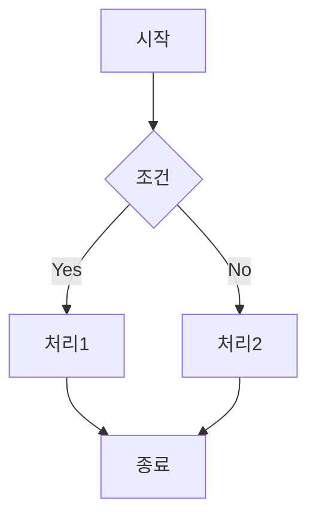

#### 방향 설정

| 방향 | 설명 | 예시 |
|------|------|------|
| `TB` / `TD` | Top to Bottom (위→아래) | 일반적인 플로우차트 |
| `BT` | Bottom to Top (아래→위) | 역방향 흐름 |
| `LR` | Left to Right (왼쪽→오른쪽) | 아키텍처 다이어그램 |
| `RL` | Right to Left (오른쪽→왼쪽) | RTL 언어 문서 |

#### 노드 모양

| 문법 | 모양 | 용도 |
|------|------|------|
| `A[텍스트]` | 사각형 | 프로세스, 작업 |
| `A(텍스트)` | 둥근 사각형 | 시작/종료 |
| `A([텍스트])` | 스타디움 | 터미널 |
| `A[[텍스트]]` | 서브루틴 | 서브프로세스 |
| `A[(텍스트)]` | 원통 | 데이터베이스 |
| `A((텍스트))` | 원 | 연결점 |
| `A>텍스트]` | 비대칭 | 플래그 |
| `A{텍스트}` | 마름모 | 조건/분기 |
| `A{{텍스트}}` | 육각형 | 준비 단계 |
| `A[/텍스트/]` | 평행사변형 | 입력 |
| `A[\텍스트\]` | 역평행사변형 | 출력 |
| `A[/텍스트\]` | 사다리꼴 | 수동 조작 |
| `A[\텍스트/]` | 역사다리꼴 | 수동 입력 |
| `A(((텍스트)))` | 이중 원 | 중요 연결점 |

#### 연결선

| 문법 | 설명 |
|------|------|
| `A --> B` | 화살표 |
| `A --- B` | 선 (화살표 없음) |
| `A -.-> B` | 점선 화살표 |
| `A ==> B` | 굵은 화살표 |
| `A --텍스트--> B` | 라벨이 있는 화살표 |
| `A --o B` | 원형 끝 |
| `A --x B` | X 끝 |
| `A <--> B` | 양방향 화살표 |
| `A o--o B` | 양방향 원형 |
| `A x--x B` | 양방향 X |

#### Subgraph (그룹핑)

```
graph TB
    subgraph Frontend
        A[React] --> B[Redux]
    end
    subgraph Backend
        C[Spring] --> D[JPA]
    end
    B --> C
```

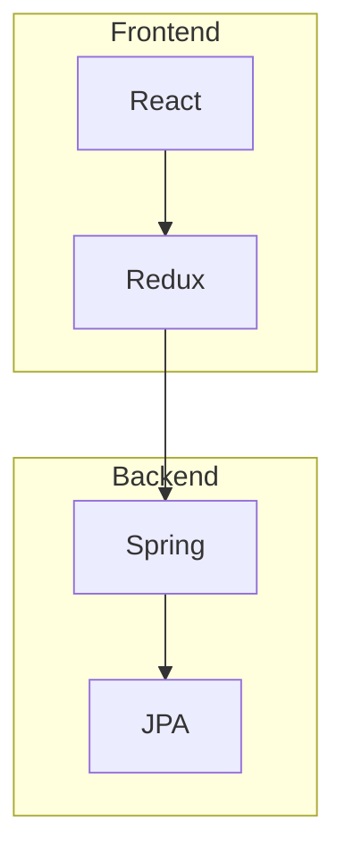

---

### 2. Sequence Diagram (시퀀스 다이어그램)

API 호출, 시스템 간 통신 흐름 표현에 적합.

#### 기본 문법

```
sequenceDiagram
    participant C as Client
    participant S as Server
    participant DB as Database

    C->>S: HTTP Request
    S->>DB: Query
    DB-->>S: Result
    S-->>C: HTTP Response
```

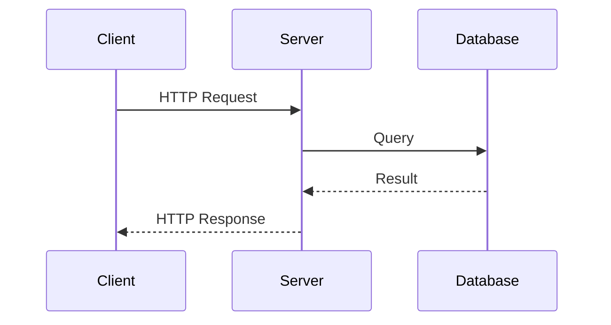

#### 화살표 종류

| 문법 | 설명 |
|------|------|
| `->` | 실선 (동기) |
| `-->` | 점선 (응답) |
| `->>` | 실선 + 화살표 |
| `-->>` | 점선 + 화살표 |
| `-x` | 실선 + X (실패) |
| `--x` | 점선 + X |
| `-)` | 실선 + 열린 화살표 (비동기) |
| `--)` | 점선 + 열린 화살표 |

#### 고급 기능

```
sequenceDiagram
    autonumber
    participant A as Client
    participant B as Server

    A->>B: 요청

    alt 성공
        B-->>A: 200 OK
    else 실패
        B-->>A: 500 Error
    end

    loop 재시도 (3회)
        A->>B: 재요청
    end

    opt 선택적 처리
        B->>B: 로깅
    end

    par 병렬 처리
        B->>C: 요청1
    and
        B->>D: 요청2
    end

    critical 크리티컬 섹션
        B->>DB: 트랜잭션
    option 타임아웃
        B-->>A: 503 Timeout
    end

    break 중단 조건
        B-->>A: 400 Bad Request
    end

    Note over A,B: 통신 완료
    Note right of B: 서버 노트
    Note left of A: 클라이언트 노트

    rect rgb(200, 230, 200)
        Note over A, B: 성공 영역
        A->>B: 정상 요청
    end
```

#### Actor vs Participant

```
sequenceDiagram
    actor User
    participant System
    User->>System: 로그인
```

---

### 3. Class Diagram (클래스 다이어그램)

객체지향 설계, 클래스 관계 표현.

#### 기본 문법

```
classDiagram
    class User {
        -Long id
        -String name
        #String email
        +getName() String
        +setName(name) void
    }

    class Order {
        -Long id
        -List~Item~ items
        +addItem(item) void
        +getTotal()$ BigDecimal
    }

    User "1" --> "*" Order : places
```

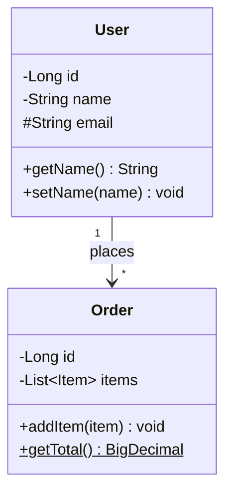

#### 접근 제어자

| 기호 | 접근 제어자 |
|------|------------|
| `+` | public |
| `-` | private |
| `#` | protected |
| `~` | package/internal |

#### 관계 표현

| 문법 | 관계 | 설명 |
|------|------|------|
| `<\|--` | 상속 (Inheritance) | 자식 클래스 |
| `*--` | 컴포지션 (Composition) | 강한 소유 |
| `o--` | 집합 (Aggregation) | 약한 소유 |
| `-->` | 연관 (Association) | 일반 관계 |
| `--` | 링크 (Link) | 실선 연결 |
| `..>` | 의존 (Dependency) | 사용 관계 |
| `..\|>` | 구현 (Realization) | 인터페이스 구현 |
| `..` | 점선 링크 | 점선 연결 |

#### Cardinality (다중성)

| 표기 | 의미 |
|------|------|
| `1` | 정확히 1 |
| `0..1` | 0 또는 1 |
| `1..*` | 1 이상 |
| `*` | 0 이상 |
| `n` | n개 |
| `0..n` | 0에서 n개 |
| `1..n` | 1에서 n개 |

#### 인터페이스 & 추상클래스

```
classDiagram
    class Animal {
        <<abstract>>
        +speak()* void
    }
    class Flyable {
        <<interface>>
        +fly() void
    }
    class Bird {
        +speak() void
        +fly() void
    }
    Animal <|-- Bird
    Flyable <|.. Bird
```

---

### 4. State Diagram (상태 다이어그램)

상태 머신, 라이프사이클 표현.

#### 기본 문법

```
stateDiagram-v2
    [*] --> Pending
    Pending --> Processing : submit
    Processing --> Completed : success
    Processing --> Failed : error
    Failed --> Processing : retry
    Completed --> [*]
```

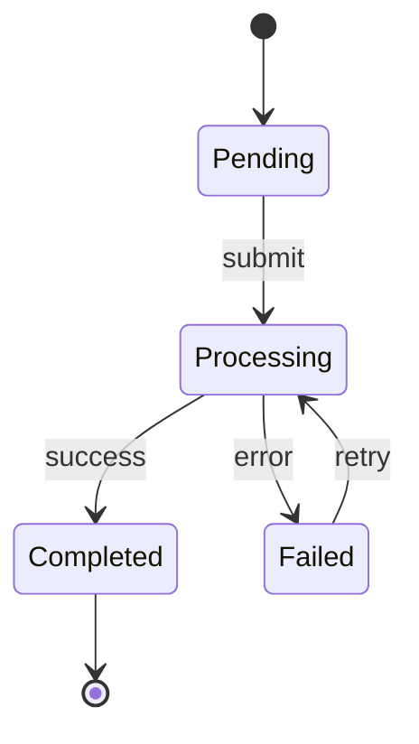

#### 복합 상태

```
stateDiagram-v2
    [*] --> Active

    state Active {
        [*] --> Running
        Running --> Paused : pause
        Paused --> Running : resume
    }

    Active --> Stopped : stop
    Stopped --> [*]
```

#### Fork / Join

```
stateDiagram-v2
    state fork_state <<fork>>
    state join_state <<join>>

    [*] --> fork_state
    fork_state --> State1
    fork_state --> State2
    State1 --> join_state
    State2 --> join_state
    join_state --> [*]
```

#### Choice

```
stateDiagram-v2
    state if_state <<choice>>
    [*] --> IsValid
    IsValid --> if_state
    if_state --> Valid : yes
    if_state --> Invalid : no
```

---

### 5. ER Diagram (개체 관계 다이어그램)

데이터베이스 테이블 구조, 관계 표현.

#### 기본 문법

```
erDiagram
    USER ||--o{ ORDER : places
    ORDER ||--|{ ORDER_ITEM : contains
    PRODUCT ||--o{ ORDER_ITEM : "ordered in"

    USER {
        long id PK
        string name
        string email UK
        datetime created_at
    }

    ORDER {
        long id PK
        long user_id FK
        string status
        datetime created_at
    }

    ORDER_ITEM {
        long id PK
        long order_id FK
        long product_id FK
        int quantity
    }
```

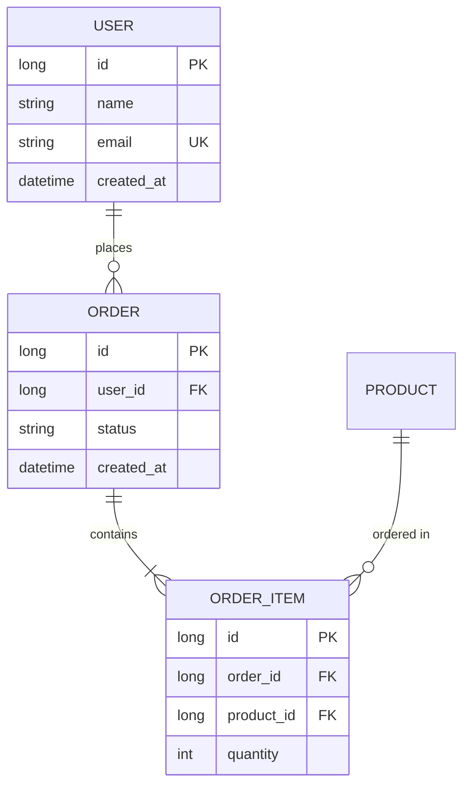

#### 관계 표기

| 왼쪽 | 오른쪽 | 의미 |
|------|--------|------|
| `\|\|` | `\|\|` | 정확히 1 대 1 |
| `\|\|` | `o{` | 1 대 0 이상 |
| `\|\|` | `\|{` | 1 대 1 이상 |
| `o\|` | `o{` | 0 또는 1 대 0 이상 |

#### 속성 키

| 키 | 의미 |
|----|------|
| `PK` | Primary Key |
| `FK` | Foreign Key |
| `UK` | Unique Key |

---

### 6. Gantt Chart (간트 차트)

프로젝트 일정, 타임라인 표현.

```
gantt
    title 프로젝트 일정
    dateFormat YYYY-MM-DD
    excludes weekends

    section 기획
    요구사항 분석    :done,    des1, 2024-01-01, 7d
    설계 문서 작성   :active,  des2, after des1, 5d

    section 개발
    백엔드 개발     :         dev1, after des2, 14d
    프론트엔드 개발  :         dev2, after des2, 14d

    section 테스트
    통합 테스트     :         test1, after dev1, 7d
    배포           :milestone, deploy, after test1, 0d
```

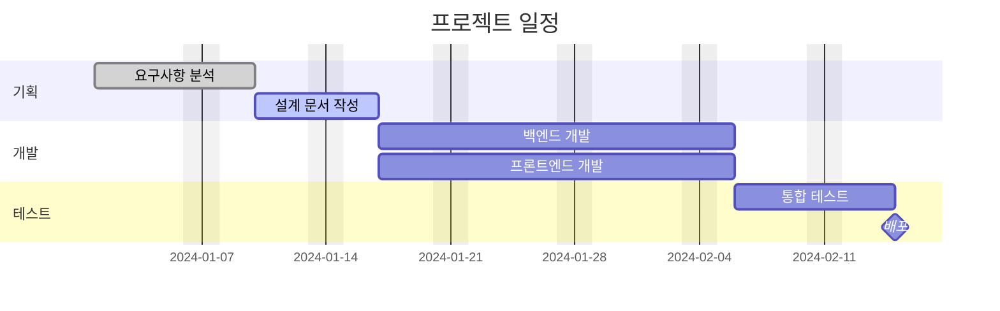

#### 태스크 상태

| 상태 | 설명 |
|------|------|
| `done` | 완료됨 |
| `active` | 진행 중 |
| `crit` | 크리티컬 패스 |
| `milestone` | 마일스톤 |

---

### 7. Pie Chart (파이 차트)

```
pie showData
    title 프로그래밍 언어 사용률
    "Java" : 35
    "Python" : 25
    "JavaScript" : 20
    "Go" : 12
    "Others" : 8
```

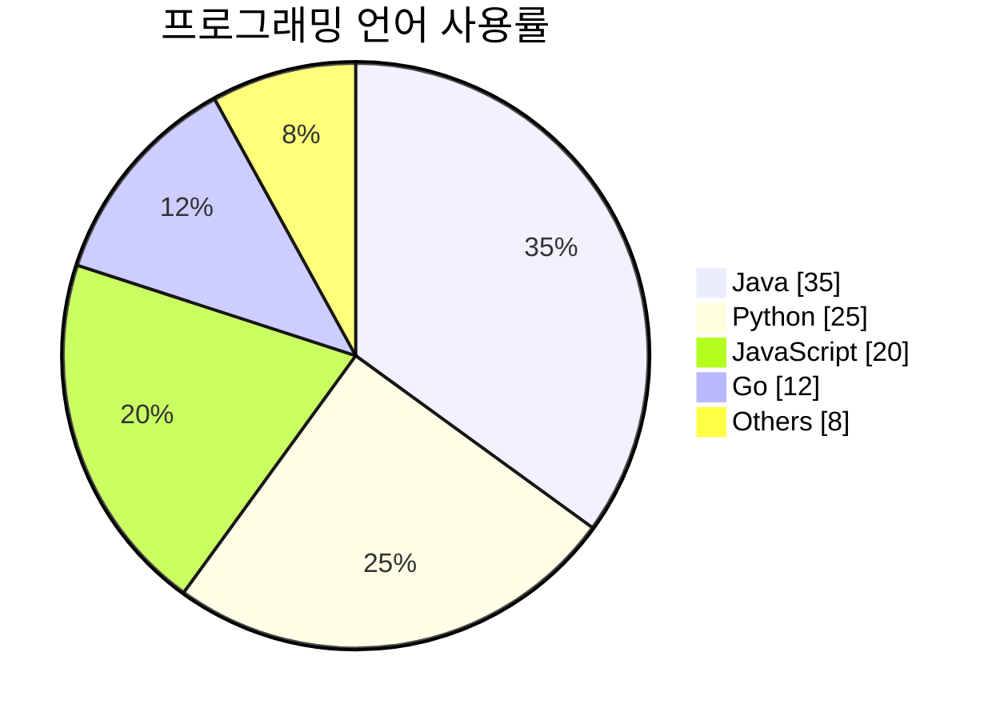

---

### 8. Mindmap (마인드맵)

```
mindmap
  root((시스템 설계))
    확장성
      수평 확장
        로드밸런싱
        샤딩
      수직 확장
        CPU 업그레이드
        메모리 증설
    가용성
      이중화
      장애 조치
      헬스 체크
    성능
      캐싱
        Redis
        Memcached
      CDN
      인덱싱
```

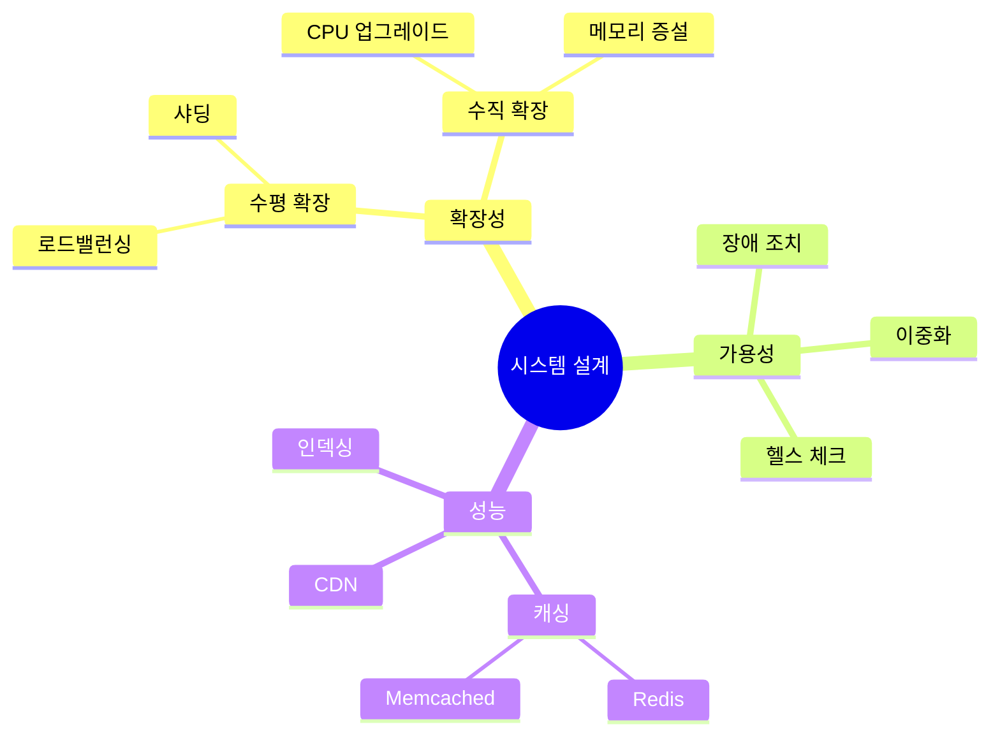

---

### 9. User Journey (사용자 여정)

```
journey
    title 사용자 구매 여정
    section 탐색
      홈페이지 방문: 5: 사용자
      상품 검색: 4: 사용자
      상품 상세 보기: 4: 사용자
    section 구매
      장바구니 담기: 5: 사용자
      결제 진행: 3: 사용자
      결제 완료: 5: 사용자
    section 배송
      배송 추적: 4: 사용자
      상품 수령: 5: 사용자
```

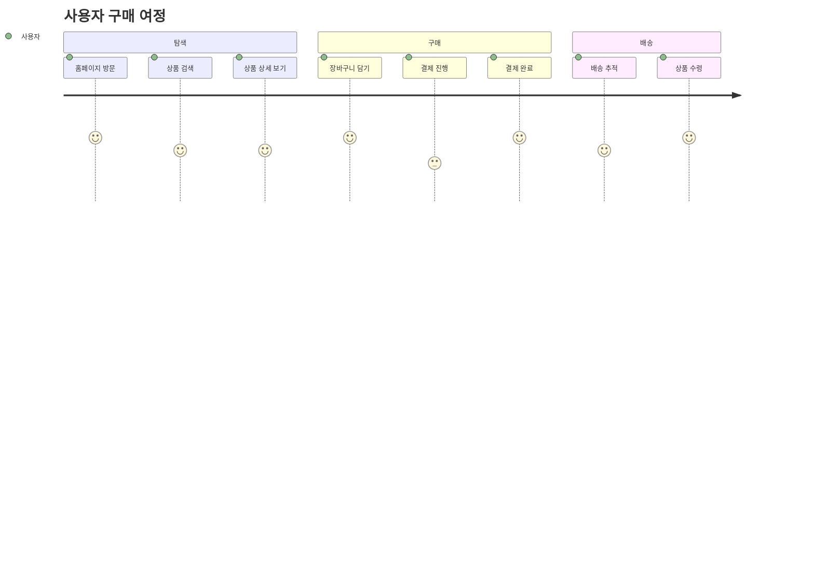

---

### 10. GitGraph (Git 그래프)

```
gitGraph
    commit id: "Initial"
    branch develop
    checkout develop
    commit id: "Feature A"
    commit id: "Feature B"
    checkout main
    merge develop id: "Merge develop"
    commit id: "Hotfix"
    branch release
    checkout release
    commit id: "Release prep"
    checkout main
    merge release id: "v1.0.0" tag: "v1.0.0"
```

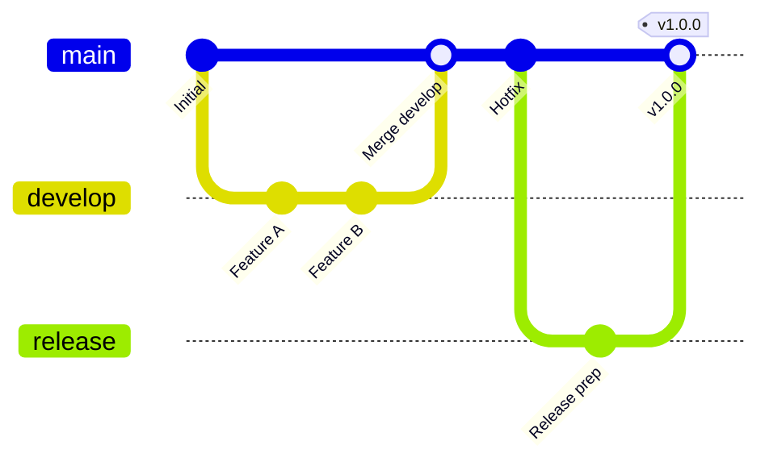

---

### 11. Timeline (타임라인)

```
timeline
    title 기술 발전 역사
    section 2000년대
        2004 : Gmail 출시
        2006 : AWS 출시
        2008 : GitHub 출시
    section 2010년대
        2010 : Instagram 출시
        2013 : Docker 출시
        2014 : Kubernetes 출시
    section 2020년대
        2020 : GitHub Copilot
        2022 : ChatGPT 출시
        2024 : Claude Code 출시
```

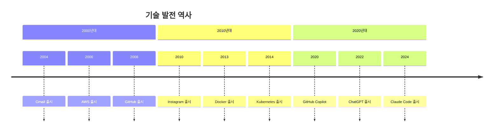

---

### 12. Quadrant Chart (사분면 차트)

```
quadrantChart
    title 기술 평가 매트릭스
    x-axis 구현 난이도 낮음 --> 구현 난이도 높음
    y-axis 비즈니스 가치 낮음 --> 비즈니스 가치 높음
    quadrant-1 즉시 구현
    quadrant-2 전략적 투자
    quadrant-3 빠른 개선
    quadrant-4 재검토 필요
    캐싱: [0.3, 0.8]
    마이크로서비스: [0.8, 0.9]
    로깅 개선: [0.2, 0.4]
    레거시 리팩토링: [0.9, 0.3]
```

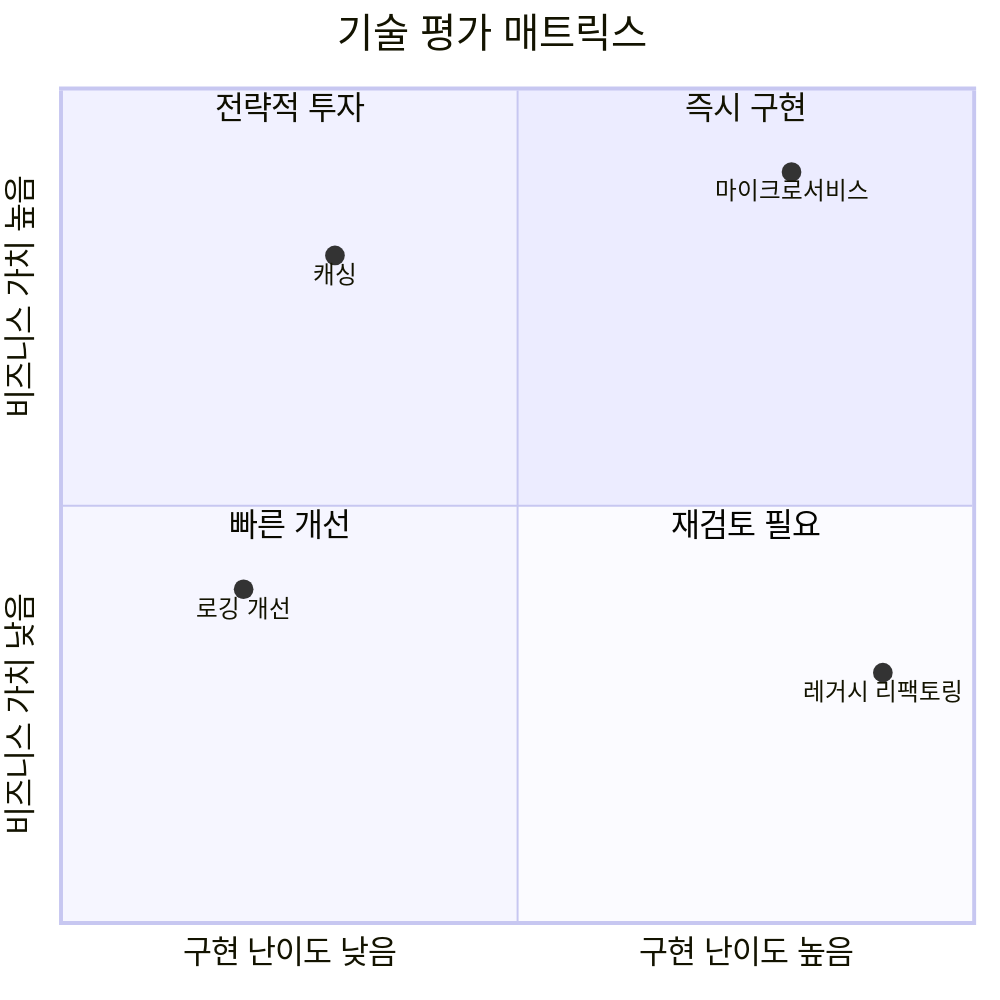

---

### 13. XY Chart (좌표 차트)

```
xychart-beta
    title "월별 트래픽"
    x-axis [Jan, Feb, Mar, Apr, May, Jun]
    y-axis "요청 수 (천)" 0 --> 100
    bar [30, 45, 60, 55, 70, 85]
    line [30, 45, 60, 55, 70, 85]
```

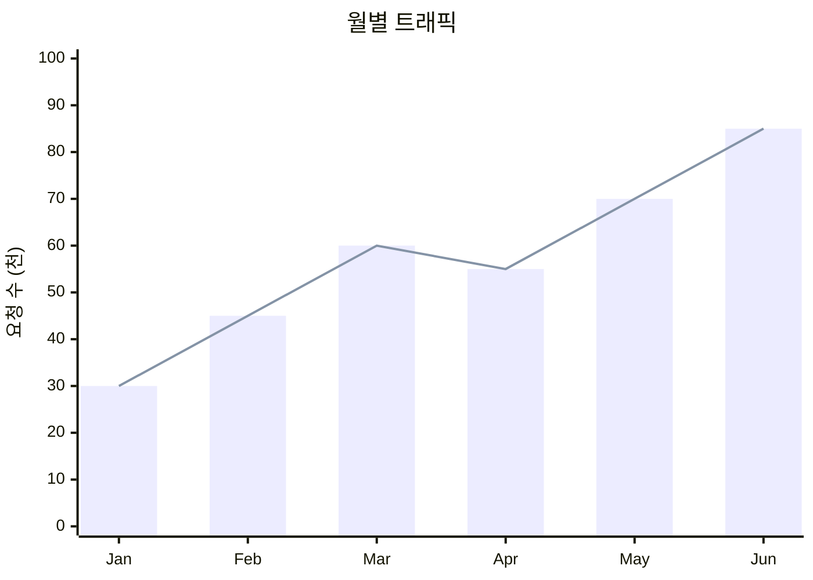

---

### 14. Kanban (칸반 보드)

```
kanban
    Todo
        task1[기능 설계]
        task2[API 정의]
    In Progress
        task3[백엔드 개발]
    Review
        task4[코드 리뷰 대기]
    Done
        task5[DB 설계 완료]
```

---

### 15. Block Diagram (블록 다이어그램)

```
block-beta
    columns 3
    Frontend:3
    block:backend:2
        API["API Server"]
        Worker["Background Worker"]
    end
    DB[("Database")]:1
```

---

## Mermaid CLI 사용법

커맨드라인에서 이미지 파일로 변환할 때 사용.

### 설치

```bash
npm install -g @mermaid-js/mermaid-cli
```

### 기본 사용법

```bash
# SVG 출력 (기본)
mmdc -i input.mmd -o output.svg

# PNG 출력
mmdc -i input.mmd -o output.png

# 배경 투명
mmdc -i input.mmd -o output.svg -b transparent

# 테마 지정
mmdc -i input.mmd -o output.svg -t dark

# 설정 파일 사용
mmdc -i input.mmd -o output.svg -c config.json

# 크기 지정
mmdc -i input.mmd -o output.png -w 1920 -H 1080
```

### 설정 파일 (config.json)

```json
{
  "theme": "default",
  "themeVariables": {
    "primaryColor": "#4a90d9",
    "primaryTextColor": "#fff",
    "primaryBorderColor": "#3a7bc8",
    "lineColor": "#333",
    "secondaryColor": "#f4f4f4",
    "tertiaryColor": "#fff"
  }
}
```

### 테마 옵션

| 테마 | 설명 |
|------|------|
| `default` | 기본 테마 |
| `neutral` | 깔끔한 회색 기반 |
| `dark` | 다크 모드 |
| `forest` | 녹색 계열 |
| `base` | 커스터마이징 기본 |

---

## 스타일링

### 노드 스타일

```
graph LR
    A[기본] --> B[스타일 적용]

    style A fill:#fff,stroke:#333,stroke-width:2px
    style B fill:#ff6b6b,stroke:#c92a2a,stroke-width:2px,color:#fff
```

### 클래스 정의

```
graph LR
    A[Success]:::success --> B[Error]:::error

    classDef success fill:#c8e6c9,stroke:#2e7d32
    classDef error fill:#ffcdd2,stroke:#c62828
```

### 테마 초기화

```
%%{init: {'theme': 'base', 'themeVariables': { 'primaryColor': '#ff6b6b'}}}%%
graph LR
    A --> B
```

---

## 지원 플랫폼

| 플랫폼 | 지원 방식 |
|--------|----------|
| **GitHub** | 네이티브 지원 (` ```mermaid `) |
| **GitLab** | 네이티브 지원 |
| **Notion** | 코드 블록에서 Mermaid 선택 |
| **VS Code** | 확장 프로그램 (Mermaid Preview) |
| **Obsidian** | 네이티브 지원 |
| **Confluence** | 플러그인 필요 |
| **Typora** | 네이티브 지원 |
| **Docusaurus** | 플러그인으로 지원 |

---

## 트레이드오프

| 장점 | 단점 |
|------|------|
| 텍스트 기반으로 Git 버전 관리 가능 | 복잡한 레이아웃 제어 어려움 |
| 마크다운에 직접 삽입 가능 | 정교한 디자인에 한계 |
| 빠른 수정 및 협업 용이 | 대규모 다이어그램에 부적합 |
| 다양한 플랫폼 네이티브 지원 | 플랫폼별 렌더링 차이 존재 |
| 20개 이상의 다이어그램 유형 지원 | 고급 기능 학습 곡선 존재 |

---

## 면접 예상 질문

### Q: Mermaid를 사용하는 이유는?

A: **Diagram as Code** 방식으로 다이어그램을 텍스트로 관리할 수 있습니다. Git으로 버전 관리가 가능하고, 코드 리뷰 시 diff를 확인할 수 있습니다. 또한 GitHub, GitLab 등에서 네이티브 지원하여 별도 도구 없이 마크다운 문서에 직접 삽입할 수 있습니다.

### Q: Mermaid vs Draw.io/Lucidchart 차이점은?

A: Mermaid는 **텍스트 기반**으로 빠른 작성과 버전 관리에 강점이 있고, Draw.io/Lucidchart는 **GUI 기반**으로 정교한 디자인과 복잡한 레이아웃에 강점이 있습니다. 기술 문서화에는 Mermaid가, 비즈니스 프레젠테이션에는 GUI 도구가 적합합니다.

### Q: 어떤 다이어그램을 언제 사용하나요?

A:
- **Flowchart**: 프로세스 흐름, 의사결정 로직
- **Sequence**: API 호출, 시스템 간 통신
- **Class**: 객체지향 설계, UML
- **ER**: 데이터베이스 스키마
- **State**: 상태 머신, 라이프사이클
- **Gantt**: 프로젝트 일정
- **Mindmap**: 개념 정리, 브레인스토밍

---

## 연관 문서

| 문서 | 연관성 | 난이도 |
|------|--------|--------|
| [시스템 설계란](../system-design/what-is-system-design.md) | 아키텍처 다이어그램 활용 | [1] 정의 |
| [CI/CD 자동화](./cicd.md) | 문서 자동화 파이프라인 | [3] 중급 |
| [Git 기초](../git/git-basics.md) | 버전 관리 | [2] 입문 |

---

## 참고 자료

- [Mermaid 공식 문서](https://mermaid.js.org/)
- [Mermaid Live Editor](https://mermaid.live/)
- [GitHub Mermaid 지원 공식 블로그](https://github.blog/2022-02-14-include-diagrams-markdown-files-mermaid/)
- [Mermaid Cheat Sheet](https://jojozhuang.github.io/tutorial/mermaid-cheat-sheet/)
