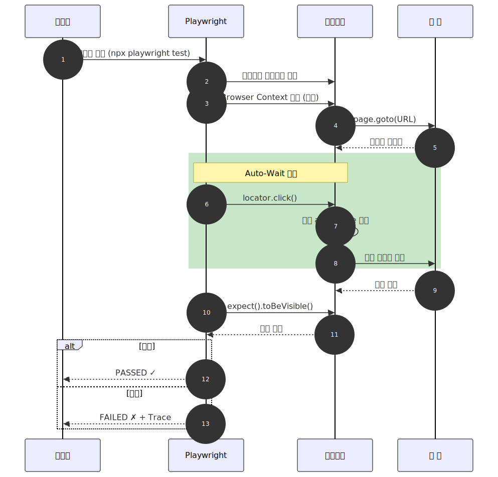

# Playwright

> `[2] 입문` · 선수 지식: [자동화란](./what-is-automation.md)

> Microsoft가 개발한 오픈소스 웹 테스팅 프레임워크로, 단일 API로 Chromium, Firefox, WebKit에서 E2E 테스트를 수행

`#Playwright` `#플레이라이트` `#E2E` `#EndToEnd` `#E2E테스트` `#브라우저테스트` `#BrowserTesting` `#크로스브라우저` `#CrossBrowser` `#테스트자동화` `#TestAutomation` `#Microsoft` `#Chromium` `#Firefox` `#WebKit` `#AutoWait` `#Locator` `#TraceViewer` `#Codegen` `#네트워크모킹` `#NetworkMocking` `#Selenium` `#Cypress` `#Puppeteer` `#WebDriver` `#BrowserContext` `#테스트격리` `#병렬테스트` `#시각적회귀테스트` `#VisualRegression` `#PlaywrightMCP`

## 왜 알아야 하는가?

- **실무**: 배포 전 주요 기능을 크로스 브라우저 환경에서 자동 검증하여 품질 보장
- **면접**: E2E 테스트 전략, 테스트 피라미드, Selenium/Cypress 비교 질문 빈출
- **기반 지식**: CI/CD 파이프라인의 품질 게이트, AI 기반 테스트 자동화의 핵심 도구

## 핵심 개념

- **Auto-Wait**: 요소가 상호작용 가능 상태가 될 때까지 자동 대기
- **Browser Context**: 각 테스트를 독립된 브라우저 환경에서 격리 실행
- **Locator**: 접근성 기반으로 UI 요소를 탐색하는 API
- **Web-First Assertions**: 조건 충족까지 자동 재시도하는 단언문
- **Trace Viewer**: 테스트 실행 과정을 시간순으로 추적하는 디버깅 도구

## 쉽게 이해하기

**Playwright**를 자동차 검수 로봇에 비유할 수 있습니다.

| 비유 | Playwright 개념 |
|------|----------------|
| 검수 항목 작성 | 테스트 코드 작성 |
| 검수 로봇이 직접 운전 | 브라우저 조작 자동화 |
| 여러 차종에서 동시 검수 | 크로스 브라우저 테스트 |
| "시동 걸릴 때까지 기다림" | Auto-Wait (자동 대기) |
| 검수 영상 녹화 | Trace Viewer |
| 차종별 독립 검수 라인 | Browser Context (테스트 격리) |

기존에는 검수원(개발자)이 직접 모든 차종(브라우저)을 하나씩 확인해야 했지만, Playwright 로봇은 **모든 차종을 동시에, 정확하게, 반복적으로** 검수합니다.

## 상세 설명

### 탄생 배경

Playwright는 Google의 **Puppeteer** 팀 핵심 엔지니어들이 Microsoft로 이직한 후, 2020년에 개발을 시작했습니다. Puppeteer의 한계(Chromium 전용)를 극복하고, 크로스 브라우저 테스팅을 단일 API로 통합하는 것이 목표였습니다.

**왜 이렇게 하는가?**
웹 애플리케이션은 Chrome, Firefox, Safari에서 모두 동작해야 합니다. 브라우저마다 렌더링 엔진이 다르기 때문에, 하나의 브라우저에서 통과한 테스트가 다른 브라우저에서 실패할 수 있습니다. Playwright는 이 문제를 단일 API로 해결합니다.

### 아키텍처

Playwright는 WebDriver 프로토콜 대신 **CDP(Chrome DevTools Protocol)** 등 브라우저 네이티브 프로토콜로 직접 통신합니다. 중간 계층이 없어 Selenium보다 빠르고 안정적입니다.



### 지원 환경

#### 브라우저

| 브라우저 엔진 | 해당 브라우저 | 비고 |
|------------|------------|------|
| **Chromium** | Chrome, Edge, Opera | v1.57부터 Chrome for Testing 빌드 |
| **Firefox** | Firefox | Playwright 전용 패치 빌드 |
| **WebKit** | Safari | macOS/Linux/Windows 모두 지원 |

> IE(Internet Explorer)는 지원하지 않습니다.

#### 언어

| 언어 | 패키지 |
|------|--------|
| JavaScript / TypeScript | `@playwright/test` |
| Python | `playwright` (pip) |
| Java | `com.microsoft.playwright` |
| C# / .NET | `Microsoft.Playwright` |

### Auto-Wait (자동 대기)

기존 테스트 도구에서 가장 흔한 불안정(flaky) 원인은 **타이밍 문제**입니다. 요소가 렌더링되기 전에 클릭하면 테스트가 실패합니다.

Playwright는 액션 수행 전 요소가 다음 조건을 만족할 때까지 **자동으로 대기**합니다:
- 요소가 DOM에 존재
- 요소가 화면에 보임 (visible)
- 요소가 활성화 상태 (enabled)
- 요소가 애니메이션 완료
- 다른 요소에 가려지지 않음

```typescript
// sleep이나 waitFor 없이도 안정적
await page.getByRole('button', { name: '제출' }).click();
// → 버튼이 준비될 때까지 자동 대기 후 클릭
```

**왜 이렇게 하는가?**
`sleep(3000)` 같은 고정 대기는 너무 짧으면 테스트가 실패하고, 너무 길면 테스트가 느려집니다. Auto-Wait는 **필요한 만큼만** 대기하여 속도와 안정성을 모두 확보합니다.

### Locator API (요소 탐색)

Playwright는 **접근성 기반 Locator**를 권장합니다. CSS 셀렉터나 XPath 대신 사용자가 실제로 인식하는 방식으로 요소를 찾습니다.

```typescript
// Role 기반 (권장)
page.getByRole('button', { name: '제출' });
page.getByRole('heading', { name: '환영합니다' });

// 텍스트 기반
page.getByText('로그인');

// 라벨 기반 (폼 요소)
page.getByLabel('이메일');

// Placeholder 기반
page.getByPlaceholder('비밀번호 입력');

// Test ID 기반 (마지막 수단)
page.getByTestId('submit-button');

// CSS/XPath (최후의 수단)
page.locator('.my-class');
```

**왜 이렇게 하는가?**
CSS 클래스나 ID는 리팩토링 시 자주 변경되지만, 버튼의 텍스트("제출")나 역할("button")은 잘 변하지 않습니다. 접근성 기반 Locator는 **테스트 유지보수 비용을 줄이고**, 동시에 **접근성 품질도 검증**합니다.

### 테스트 격리 (Browser Context)

각 테스트는 독립된 Browser Context에서 실행됩니다. 쿠키, 로컬 스토리지, 세션이 완전히 격리되어 테스트 간 간섭이 없습니다.

```typescript
// 각 테스트마다 새로운 context + page 생성 (자동)
test('로그인 테스트', async ({ page }) => {
  // 이 page는 독립된 context에서 실행
  await page.goto('/login');
});

test('회원가입 테스트', async ({ page }) => {
  // 위 테스트와 완전히 독립된 환경
  await page.goto('/signup');
});
```

### 네트워크 가로채기 (Network Interception)

API 응답을 모킹하거나 요청을 차단할 수 있습니다.

```typescript
// API 응답 모킹
await page.route('**/api/users', async route => {
  await route.fulfill({
    status: 200,
    body: JSON.stringify([{ name: '홍길동' }])
  });
});

// 이미지 요청 차단 (테스트 속도 향상)
await page.route('**/*.png', route => route.abort());
```

**왜 이렇게 하는가?**
E2E 테스트에서 외부 API에 의존하면 네트워크 상태에 따라 테스트가 불안정해집니다. 네트워크 모킹으로 **일관된 테스트 환경**을 보장하면서도, UI가 API 응답을 올바르게 처리하는지 검증할 수 있습니다.

## 동작 원리

테스트 실행부터 결과 확인까지의 흐름입니다.



## 예제 코드

### 설치 및 초기 설정

```bash
# 프로젝트 초기화
npm init playwright@latest

# 브라우저 설치
npx playwright install
```

### 기본 테스트 작성

```typescript
import { test, expect } from '@playwright/test';

test('홈페이지 제목 확인', async ({ page }) => {
  await page.goto('https://example.com');
  await expect(page).toHaveTitle(/Example/);
});

test('로그인 성공', async ({ page }) => {
  // Given - 로그인 페이지 접속
  await page.goto('/login');

  // When - 로그인 정보 입력 및 제출
  await page.getByLabel('이메일').fill('user@test.com');
  await page.getByLabel('비밀번호').fill('password123');
  await page.getByRole('button', { name: '로그인' }).click();

  // Then - 대시보드로 이동 확인
  await expect(page).toHaveURL(/dashboard/);
  await expect(page.getByText('환영합니다')).toBeVisible();
});
```

### 주요 Assertions

```typescript
// 페이지 단언
await expect(page).toHaveTitle(/제목/);
await expect(page).toHaveURL(/dashboard/);

// 요소 단언
await expect(locator).toBeVisible();
await expect(locator).toBeEnabled();
await expect(locator).toHaveText('텍스트');
await expect(locator).toHaveCount(3);
await expect(locator).toHaveAttribute('href', '/path');
await expect(locator).toContainText('부분 텍스트');
```

### 설정 파일

```typescript
// playwright.config.ts
import { defineConfig, devices } from '@playwright/test';

export default defineConfig({
  testDir: './tests',
  fullyParallel: true,
  retries: 2,
  workers: 4,
  reporter: 'html',
  use: {
    baseURL: 'http://localhost:3000',
    trace: 'on-first-retry',
    screenshot: 'only-on-failure',
  },
  projects: [
    { name: 'chromium', use: { ...devices['Desktop Chrome'] } },
    { name: 'firefox', use: { ...devices['Desktop Firefox'] } },
    { name: 'webkit', use: { ...devices['Desktop Safari'] } },
    { name: 'mobile', use: { ...devices['iPhone 14'] } },
  ],
});
```

### 주요 CLI 명령어

```bash
# 전체 테스트 실행
npx playwright test

# 특정 파일 실행
npx playwright test login.spec.ts

# UI 모드 (시각적 디버깅)
npx playwright test --ui

# 코드 생성기 (브라우저 조작 녹화)
npx playwright codegen https://example.com

# HTML 리포트 열기
npx playwright show-report

# 특정 브라우저만 실행
npx playwright test --project=chromium

# 디버그 모드
npx playwright test --debug
```

## Selenium, Cypress와 비교

| 항목 | Playwright | Selenium | Cypress |
|------|-----------|----------|---------|
| **개발사** | Microsoft | OpenJS Foundation | Cypress.io |
| **아키텍처** | 브라우저 직접 통신 | WebDriver 프로토콜 | 브라우저 내부 실행 |
| **브라우저** | Chromium, Firefox, WebKit | 모든 주요 브라우저 + IE | Chromium 중심 |
| **언어** | JS/TS, Python, Java, C# | Java, Python, C#, Ruby 등 | JS/TS만 |
| **속도** | 매우 빠름 | 상대적으로 느림 | 빠름 |
| **자동 대기** | 내장 (Auto-Wait) | 명시적 wait 필요 | 내장 |
| **병렬 실행** | 무료, 내장 | Grid 설정 필요 | 유료 (Dashboard) |
| **다중 탭/창** | 지원 | 지원 | 미지원 |
| **네트워크 모킹** | 내장 | 별도 도구 필요 | 내장 |
| **모바일** | 에뮬레이션 지원 | Appium 연동 필요 | 제한적 |
| **러닝 커브** | 낮음 | 중~높음 | 낮음 |

**선택 가이드:**
- 크로스 브라우저 + 다중 언어 → **Playwright**
- 레거시 브라우저(IE) + 엔터프라이즈 환경 → **Selenium**
- JavaScript 중심 + 간단한 설정 → **Cypress**

## Playwright Test Runner 주요 기능

### 병렬 실행

기본적으로 테스트 파일을 병렬로 실행합니다. `fullyParallel: true` 설정 시 같은 파일 내 테스트도 병렬 실행됩니다.

### Fixtures (픽스처)

`page`, `browser`, `context` 등 내장 fixture를 제공하며, 커스텀 fixture 정의도 가능합니다.

```typescript
// 커스텀 fixture 예시
const test = base.extend({
  authenticatedPage: async ({ page }, use) => {
    await page.goto('/login');
    await page.getByLabel('이메일').fill('admin@test.com');
    await page.getByLabel('비밀번호').fill('admin');
    await page.getByRole('button', { name: '로그인' }).click();
    await use(page);
  },
});
```

### Trace Viewer

테스트 실패 시 스크린샷, DOM 스냅샷, 네트워크 요청, 콘솔 로그를 시간순으로 확인할 수 있습니다.

```bash
# trace 활성화 후 실행
npx playwright test --trace on

# trace 파일 보기
npx playwright show-trace trace.zip
```

### Codegen (코드 생성기)

브라우저를 열고 사용자의 동작을 녹화하여 테스트 코드를 자동 생성합니다.

```bash
npx playwright codegen https://example.com
```

## 트레이드오프

| 장점 | 단점 |
|------|------|
| 단일 API로 3대 브라우저 지원 | IE 등 레거시 브라우저 미지원 |
| Auto-Wait로 안정적 테스트 | E2E 특성상 UI 변경 시 테스트 수정 필요 |
| 무료 병렬 실행 | 다른 언어 바인딩도 내부적으로 Node.js 의존 |
| 다중 탭/창/iframe 지원 | Canvas 기반 UI 테스트에 한계 |
| 네트워크 모킹 내장 | Selenium 대비 작은 커뮤니티 (빠르게 성장 중) |
| Trace Viewer 등 강력한 디버깅 도구 | 네이티브 모바일 앱 테스트 불가 |
| AI 기반 테스트 자동화 지원 (MCP) | 방대한 공식 문서로 초보자 진입 장벽 |

## 트러블슈팅

### 사례 1: 테스트가 간헐적으로 실패 (Flaky Test)

#### 증상
동일한 테스트가 로컬에서는 통과하지만, CI 환경에서 간헐적으로 실패합니다.

#### 원인 분석
CI 환경은 로컬보다 리소스가 제한적이어서 페이지 로딩이 느릴 수 있습니다. 하드코딩된 `waitForTimeout()`이나 CSS 셀렉터 기반 탐색이 원인인 경우가 많습니다.

#### 해결 방법
```typescript
// Bad - 고정 대기
await page.waitForTimeout(3000);
await page.click('.submit-btn');

// Good - Auto-Wait + Locator 활용
await page.getByRole('button', { name: '제출' }).click();
```

#### 예방 조치
- `waitForTimeout()` 사용을 금지하고 Auto-Wait에 의존
- 접근성 기반 Locator 사용 (`getByRole`, `getByText` 등)
- `retries: 2` 설정으로 일시적 실패 대응

### 사례 2: 브라우저 설치 실패 (CI 환경)

#### 증상
```
Error: browserType.launch: Executable doesn't exist at /ms-playwright/chromium-xxx/chrome-linux/chrome
```

#### 원인 분석
CI 환경에서 Playwright 브라우저가 설치되지 않았거나, 시스템 의존성이 누락되었습니다.

#### 해결 방법
```yaml
# GitHub Actions 예시
- name: Install Playwright Browsers
  run: npx playwright install --with-deps
```

#### 예방 조치
- CI 파이프라인에 `npx playwright install --with-deps` 단계 추가
- Docker 사용 시 공식 이미지(`mcr.microsoft.com/playwright`) 활용

## 면접 예상 질문

### Q: Playwright와 Selenium의 차이점은?

A: **아키텍처**가 근본적으로 다릅니다. Selenium은 WebDriver 프로토콜을 통해 브라우저와 통신하지만, Playwright는 CDP 등 **브라우저 네이티브 프로토콜**로 직접 통신합니다. 이로 인해 Playwright가 더 빠르고, Auto-Wait 같은 기능을 내장할 수 있습니다. 반면 Selenium은 IE 포함 더 많은 브라우저를 지원하며, 언어 바인딩도 풍부하고 커뮤니티가 더 큽니다. **선택 기준**: 신규 프로젝트면 Playwright, 레거시 브라우저 지원이 필요하면 Selenium입니다.

### Q: E2E 테스트에서 Flaky Test를 줄이는 방법은?

A: (1) **Auto-Wait 활용**: `sleep()` 대신 요소 상태 기반 자동 대기 (2) **접근성 기반 Locator**: CSS 클래스 대신 `getByRole`, `getByText` 사용으로 UI 변경에 강건 (3) **네트워크 모킹**: 외부 API 의존성 제거 (4) **테스트 격리**: Browser Context로 테스트 간 간섭 차단 (5) **Retry 설정**: 일시적 실패에 대한 재시도 정책 적용. **핵심**: Flaky Test의 대부분은 타이밍 문제이며, Auto-Wait가 이를 구조적으로 해결합니다.

### Q: 테스트 피라미드에서 E2E 테스트의 위치는?

A: E2E 테스트는 피라미드 **최상단**에 위치합니다. 가장 느리고 비용이 높지만, 사용자 관점에서 전체 시스템이 올바르게 동작하는지 검증합니다. **권장 비율**: 단위 테스트 70% > 통합 테스트 20% > E2E 테스트 10%. E2E는 **핵심 사용자 시나리오**(로그인, 결제 등)에만 집중하고, 세부 로직은 단위 테스트로 검증합니다.

## 연관 문서

| 문서 | 연관성 | 난이도 |
|------|--------|--------|
| [자동화란](./what-is-automation.md) | 선수 지식 | [1] 정의 |
| [CI/CD 자동화](./cicd.md) | 테스트 파이프라인 통합 | [3] 중급 |
| [TDD](../programming/tdd.md) | 테스트 전략 | [3] 중급 |

## 참고 자료

- [Playwright 공식 문서](https://playwright.dev/)
- [Playwright GitHub](https://github.com/microsoft/playwright)
- [Playwright Release Notes](https://playwright.dev/docs/release-notes)
- [Playwright Best Practices](https://playwright.dev/docs/best-practices)
