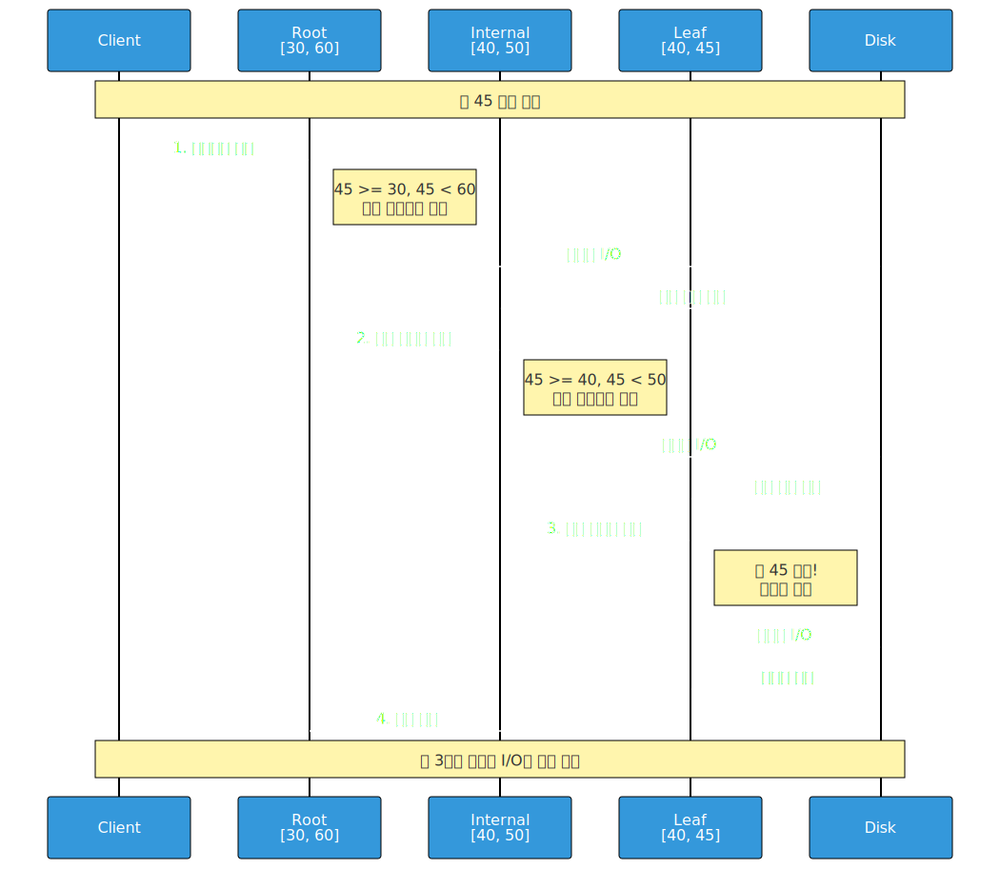

# B-Tree / B+Tree

> `[4] 심화` · 선수 지식: [트리](./tree.md)

> 디스크 I/O를 최소화하도록 설계된 자기 균형 다진 탐색 트리

`#B트리` `#BTree` `#B플러스트리` `#BPlusTree` `#인덱스` `#Index` `#데이터베이스` `#Database` `#MySQL` `#InnoDB` `#PostgreSQL` `#디스크IO` `#DiskIO` `#균형트리` `#BalancedTree` `#다진트리` `#MWayTree` `#페이지` `#Page` `#블록` `#Block` `#리프노드` `#LeafNode` `#내부노드` `#InternalNode` `#순차접근` `#RangeQuery` `#클러스터드인덱스` `#세컨더리인덱스`

## 왜 알아야 하는가?

- **실무**: 모든 RDBMS(MySQL, PostgreSQL, Oracle)가 인덱스 구현에 B+Tree를 사용한다. 인덱스 동작 원리를 이해해야 쿼리 최적화가 가능하다.
- **면접**: "인덱스가 어떻게 동작하나요?", "왜 B+Tree를 사용하나요?" 는 DB 면접 단골 질문이다.
- **기반 지식**: 파일 시스템, NoSQL(MongoDB), 검색 엔진 등 다양한 저장 시스템의 기반이 된다.

## 핵심 개념

- **B-Tree**: 각 노드가 여러 키를 가질 수 있는 자기 균형 다진 탐색 트리
- **B+Tree**: B-Tree의 변형으로, 모든 데이터가 리프 노드에만 저장되고 리프끼리 연결된 구조
- **차수(Order)**: 노드가 가질 수 있는 최대 자식 수 (M)
- **페이지(Page)**: 디스크에서 한 번에 읽는 블록 단위 (보통 4KB~16KB)

## 쉽게 이해하기

### 도서관 비유

**B-Tree는 도서관의 다층 목록**이라고 생각하세요.

1. **1층 안내판(루트)**: "A~M은 왼쪽, N~Z는 오른쪽"
2. **각 층 분류대(내부 노드)**: "Science → 3번 통로, History → 7번 통로"
3. **책꽂이(리프 노드)**: 실제 책이 있는 곳

**왜 이진 트리가 아닌가?**

도서관에서 책을 찾을 때 "왼쪽/오른쪽"만 선택하면 너무 많이 걸어야 합니다. 한 곳에서 여러 방향을 안내하면 더 빨리 찾을 수 있습니다.

### 디스크 I/O 관점

```
메모리 접근: ~100ns (나노초)
디스크 접근: ~10ms (밀리초) → 100,000배 느림!
```

**핵심 통찰**: 디스크에서 1바이트를 읽으나 4KB를 읽으나 시간은 거의 같다. 따라서 한 번 읽을 때 최대한 많은 키를 가져오는 것이 유리하다.

## 상세 설명

### B-Tree 구조

차수가 M인 B-Tree의 특성:

| 속성 | 규칙 |
|------|------|
| 키 개수 | 각 노드는 최소 ⌈M/2⌉-1개, 최대 M-1개의 키 |
| 자식 개수 | 각 노드는 최소 ⌈M/2⌉개, 최대 M개의 자식 |
| 균형 | 모든 리프 노드는 같은 깊이 |
| 정렬 | 노드 내 키는 오름차순 정렬 |

**왜 최소 개수를 강제하는가?**

트리가 한쪽으로 치우치는 것을 방지한다. 최소 절반 이상 채워져야 하므로 높이가 O(log n)으로 유지된다.

### B+Tree와 B-Tree의 차이

| 특성 | B-Tree | B+Tree |
|------|--------|--------|
| 데이터 위치 | 모든 노드 | 리프 노드만 |
| 리프 연결 | 없음 | Linked List로 연결 |
| 내부 노드 | 키 + 데이터 | 키만 (가이드 역할) |
| 범위 검색 | 트리 순회 필요 | 리프에서 순차 스캔 |
| 공간 효율 | 낮음 | 높음 (내부 노드에 더 많은 키) |

**왜 대부분 B+Tree를 사용하는가?**

1. **범위 쿼리 최적화**: `WHERE age BETWEEN 20 AND 30` 처리 시 리프만 스캔
2. **내부 노드 경량화**: 데이터가 없으므로 더 많은 키 저장 가능 → 트리 높이 감소
3. **순차 접근 최적화**: 리프가 연결되어 있어 전체 스캔이 빠름

### 시간 복잡도

| 연산 | B-Tree | B+Tree | 설명 |
|------|--------|--------|------|
| 검색 | O(log n) | O(log n) | 둘 다 균형 트리 |
| 삽입 | O(log n) | O(log n) | 분할(split) 포함 |
| 삭제 | O(log n) | O(log n) | 병합(merge) 포함 |
| 범위 검색 | O(log n + k) | O(log n + k) | k는 결과 수, B+Tree가 상수 계수 유리 |

**디스크 I/O 관점에서의 실제 성능**:

```
1억 개 레코드, 차수 100인 B+Tree
→ 높이 = log₁₀₀(100,000,000) ≈ 4

4번의 디스크 접근으로 1억 개 중 1개를 찾을 수 있다!
```

## 동작 원리

### B+Tree 구조도



### B+Tree 검색 과정



### 삽입 시 노드 분할

노드가 가득 찬 상태에서 새 키 삽입 시:

1. 중간 키를 부모로 올림
2. 노드를 두 개로 분할
3. 부모도 가득 차면 재귀적으로 분할

### 삭제 시 노드 병합

노드가 최소 개수 미만이 되면:

1. 형제 노드에서 빌려옴 (재분배)
2. 불가능하면 형제와 병합
3. 부모 키 하나 내려옴

## 예제 코드

### B+Tree 노드 구조 (Java)

```java
// B+Tree 노드 (개념적 구현)
public class BPlusTreeNode<K extends Comparable<K>, V> {
    private static final int ORDER = 4; // 차수

    private List<K> keys;           // 키 목록
    private List<Object> children;  // 내부: 자식 노드, 리프: 값
    private boolean isLeaf;
    private BPlusTreeNode<K, V> next; // 리프 노드 연결 (B+Tree 특성)

    public BPlusTreeNode(boolean isLeaf) {
        this.keys = new ArrayList<>();
        this.children = new ArrayList<>();
        this.isLeaf = isLeaf;
    }

    // 검색: O(log n)
    public V search(K key) {
        int i = findKeyIndex(key);

        if (isLeaf) {
            // 리프 노드에서 키 찾기
            if (i < keys.size() && keys.get(i).compareTo(key) == 0) {
                return (V) children.get(i);
            }
            return null; // 키 없음
        } else {
            // 내부 노드: 적절한 자식으로 이동
            return ((BPlusTreeNode<K, V>) children.get(i)).search(key);
        }
    }

    // 범위 검색: O(log n + k)
    public List<V> rangeSearch(K start, K end) {
        List<V> result = new ArrayList<>();

        // 시작점 찾기
        BPlusTreeNode<K, V> leaf = findLeaf(start);

        // 리프 노드들을 순차 스캔 (B+Tree의 장점)
        while (leaf != null) {
            for (int i = 0; i < leaf.keys.size(); i++) {
                K k = leaf.keys.get(i);
                if (k.compareTo(start) >= 0 && k.compareTo(end) <= 0) {
                    result.add((V) leaf.children.get(i));
                }
                if (k.compareTo(end) > 0) {
                    return result;
                }
            }
            leaf = leaf.next; // 다음 리프로 이동
        }
        return result;
    }

    private int findKeyIndex(K key) {
        // 이진 탐색으로 키 위치 찾기
        int lo = 0, hi = keys.size();
        while (lo < hi) {
            int mid = (lo + hi) / 2;
            if (keys.get(mid).compareTo(key) < 0) {
                lo = mid + 1;
            } else {
                hi = mid;
            }
        }
        return lo;
    }

    private BPlusTreeNode<K, V> findLeaf(K key) {
        if (isLeaf) return this;
        int i = findKeyIndex(key);
        return ((BPlusTreeNode<K, V>) children.get(i)).findLeaf(key);
    }
}
```

### MySQL 인덱스 확인

```sql
-- 테이블의 인덱스 정보 확인
SHOW INDEX FROM users;

-- 실행 계획으로 인덱스 사용 여부 확인
EXPLAIN SELECT * FROM users WHERE age BETWEEN 20 AND 30;

-- 인덱스 통계 확인 (InnoDB)
SELECT * FROM information_schema.INNODB_INDEXES
WHERE TABLE_NAME = 'users';
```

## 트레이드오프

| 장점 | 단점 |
|------|------|
| 디스크 I/O 최적화 | 메모리에서는 이진 트리가 더 빠를 수 있음 |
| 범위 검색에 최적 (B+Tree) | 구현 복잡도가 높음 |
| 균형 유지 자동화 | 삽입/삭제 시 오버헤드 |
| 캐시 친화적 | 순차 삽입 시 페이지 분할 빈번 |

### 언제 B+Tree가 적합하지 않은가?

| 상황 | 대안 |
|------|------|
| 메모리 기반 데이터 | Red-Black Tree, AVL Tree |
| 단순 Key-Value | Hash Table |
| 문자열 접두사 검색 | Trie |
| 시계열 데이터 | LSM Tree (LevelDB, RocksDB) |

## 트러블슈팅

### 사례 1: 인덱스가 있는데 Full Table Scan

#### 증상
```sql
EXPLAIN SELECT * FROM orders WHERE status = 'pending';
-- type: ALL (Full Table Scan)
```

#### 원인 분석
- 카디널리티(Cardinality)가 낮은 컬럼: status가 3~4개 값만 가짐
- 옵티마이저가 인덱스보다 풀스캔이 빠르다고 판단

#### 해결 방법
```sql
-- 복합 인덱스 사용
CREATE INDEX idx_status_created ON orders(status, created_at);

-- 커버링 인덱스로 변경
SELECT order_id, created_at FROM orders WHERE status = 'pending';
```

### 사례 2: 범위 검색 후 정렬이 느림

#### 증상
```sql
SELECT * FROM products
WHERE price BETWEEN 100 AND 500
ORDER BY name;
-- Using filesort 발생
```

#### 원인 분석
- price 인덱스로 범위 검색 후, name으로 별도 정렬 필요
- B+Tree는 인덱스 순서로만 정렬된 상태

#### 해결 방법
```sql
-- 복합 인덱스로 정렬까지 커버
CREATE INDEX idx_price_name ON products(price, name);

-- 또는 검색 조건에 맞는 인덱스 설계
```

## 면접 예상 질문

### Q: 왜 데이터베이스 인덱스는 B+Tree를 사용하나요?

A: 세 가지 이유가 있습니다.

1. **디스크 I/O 최적화**: 디스크는 블록 단위로 읽으므로, 한 노드에 여러 키를 저장하면 I/O 횟수를 줄일 수 있습니다. B+Tree는 차수가 커서 트리 높이가 낮습니다.

2. **범위 검색 효율**: 리프 노드가 연결 리스트로 연결되어 있어, `BETWEEN`, `>`, `<` 같은 범위 쿼리를 순차 스캔으로 처리할 수 있습니다.

3. **균형 보장**: 자기 균형 트리이므로 최악의 경우에도 O(log n) 성능을 보장합니다.

### Q: B-Tree와 B+Tree의 차이점은?

A: 가장 큰 차이는 **데이터 저장 위치**입니다.

- B-Tree: 모든 노드에 데이터 저장
- B+Tree: 리프 노드에만 데이터 저장, 리프끼리 연결

B+Tree가 유리한 이유:
1. 내부 노드에 더 많은 키 저장 가능 → 트리 높이 감소
2. 범위 검색 시 리프만 순차 스캔 → 효율적
3. 풀스캔 시 리프만 읽으면 됨 → 내부 노드 무시 가능

### Q: 인덱스를 타지 않는 경우는?

A: 옵티마이저가 인덱스 사용이 비효율적이라 판단할 때입니다.

1. **낮은 카디널리티**: 값의 종류가 적으면 (예: 성별) 풀스캔이 더 빠름
2. **데이터 분포**: 대부분의 행이 조건을 만족하면 인덱스 오버헤드만 증가
3. **함수 사용**: `WHERE YEAR(created_at) = 2024` → 함수로 인해 인덱스 무효화
4. **타입 불일치**: `WHERE id = '123'` (id가 INT인 경우)

## 연관 문서

| 문서 | 연관성 | 난이도 |
|------|--------|--------|
| [트리](./tree.md) | 선수 지식 (이진 트리 기초) | Intermediate |
| [해시 테이블](./hash-table.md) | 대안 자료구조 비교 | Intermediate |
| [인덱스](../db/index.md) | 실무 적용 (DB 인덱스) | Intermediate |

## 참고 자료

- [MySQL InnoDB Index](https://dev.mysql.com/doc/refman/8.0/en/innodb-index-types.html)
- [Use The Index, Luke - B-Tree](https://use-the-index-luke.com/sql/anatomy/the-tree)
- Introduction to Algorithms (CLRS) - Chapter 18: B-Trees
- Database Internals by Alex Petrov - Chapter 4
